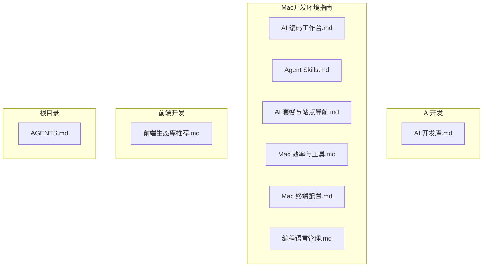
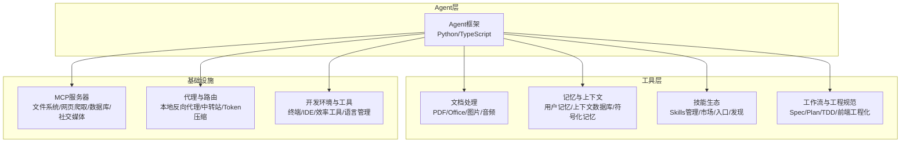
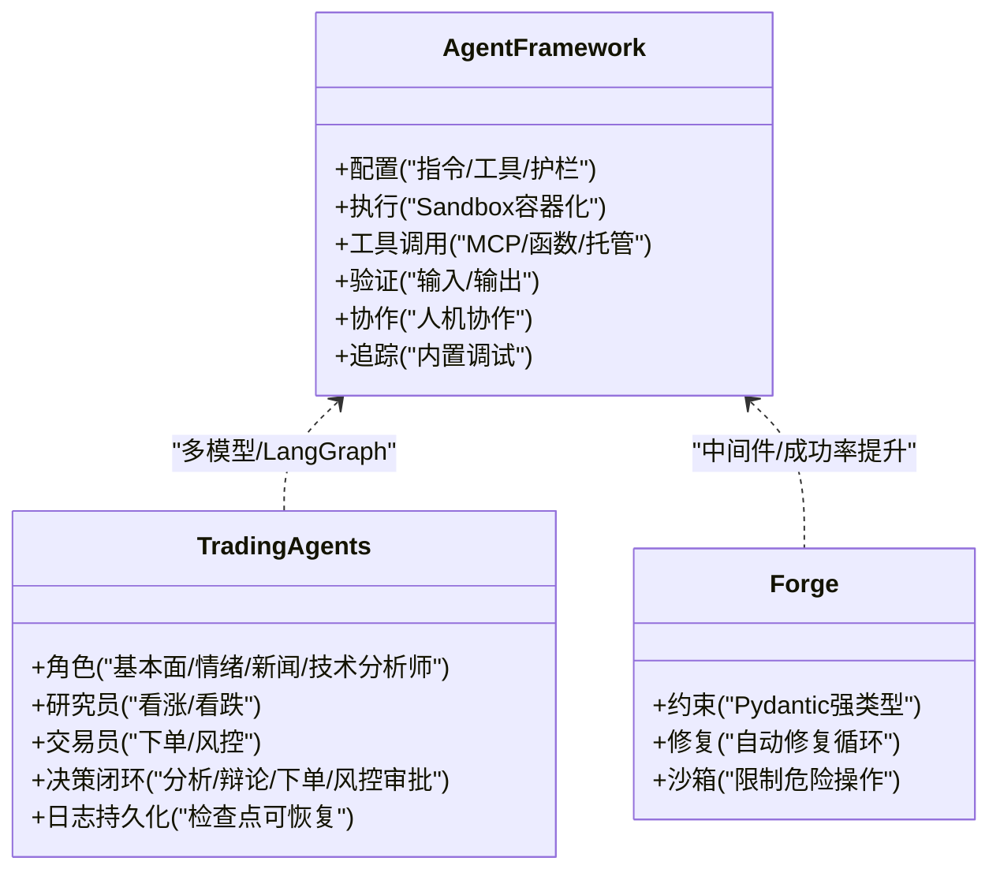
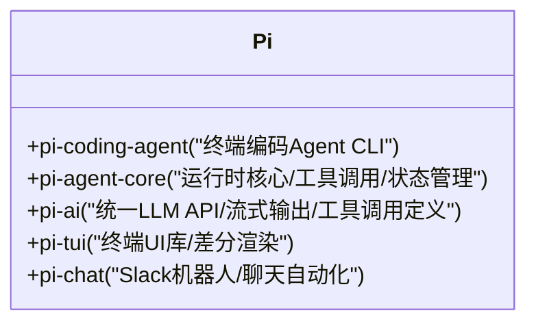
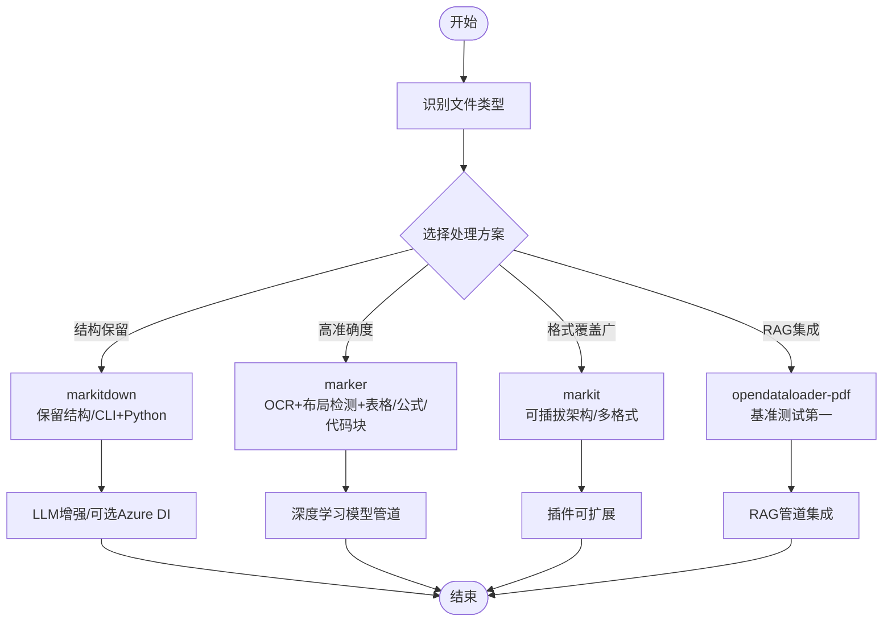
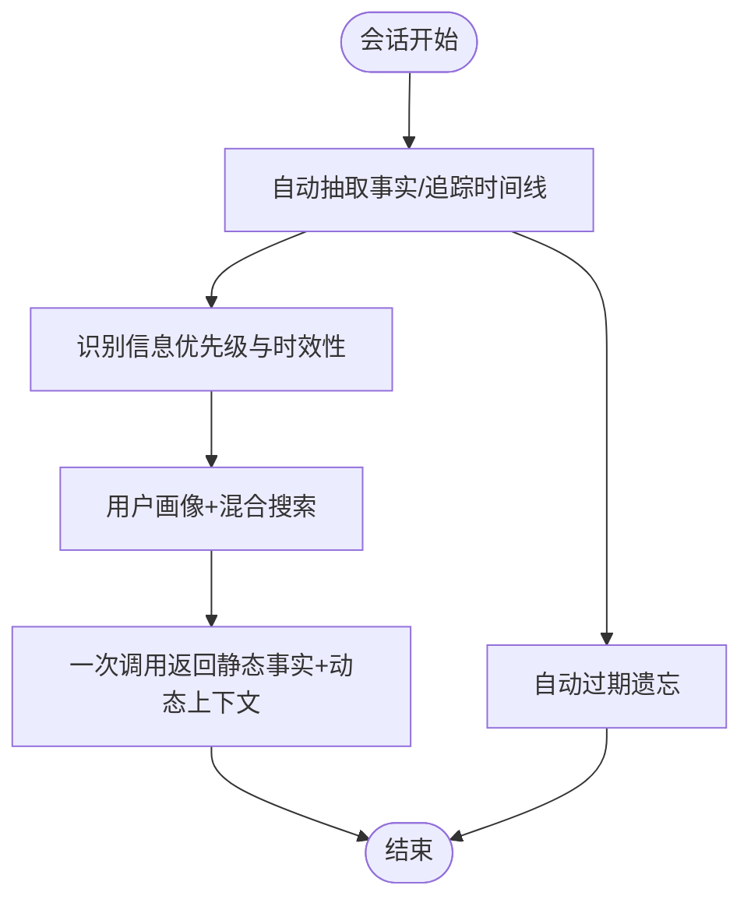
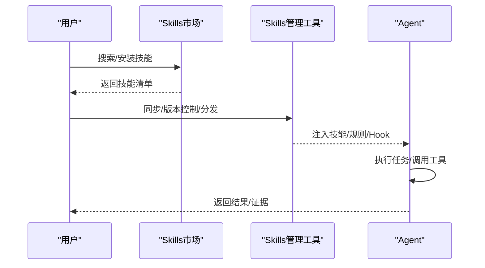
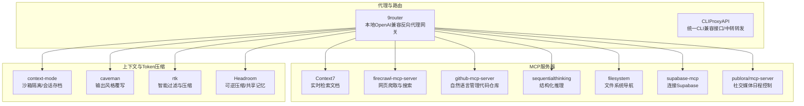
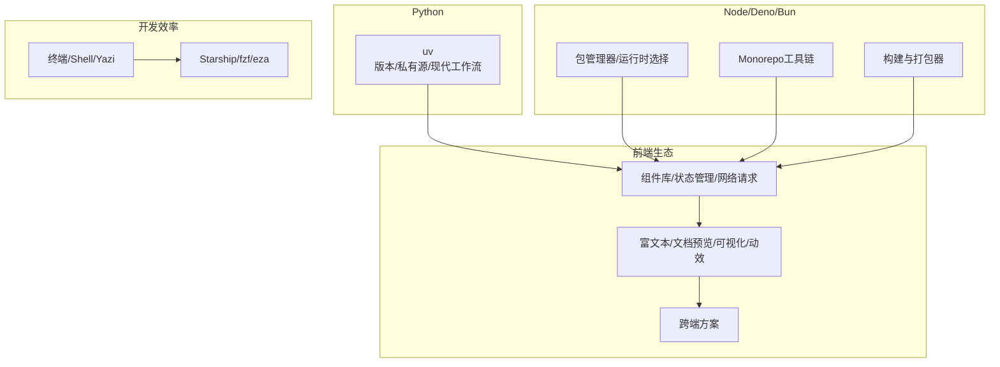

# AI开发资源

<cite>
**本文引用的文件**
- [AI 开发/AI 开发库.md](file://AI%20开发/AI%20开发库.md)
- [AGENTS.md](file://AGENTS.md)
- [Mac 开发环境指南/AI 套餐与站点导航.md](file://Mac%20开发环境指南/AI%20套餐与站点导航.md)
- [Mac 开发环境指南/AI 编码工作台.md](file://Mac%20开发环境指南/AI%20编码工作台.md)
- [Mac 开发环境指南/Agent Skills.md](file://Mac%20开发环境指南/Agent Skills.md)
- [Mac 开发环境指南/Mac 效率与工具.md](file://Mac%20开发环境指南/Mac%20效率与工具.md)
- [Mac 开发环境指南/Mac 终端配置.md](file://Mac%20开发环境指南/Mac%20终端配置.md)
- [Mac 开发环境指南/编程语言管理.md](file://Mac%20开发环境指南/编程语言管理.md)
- [前端开发/前端生态库推荐.md](file://前端开发/前端生态库推荐.md)
</cite>

## 目录
1. [引言](#引言)
2. [项目结构](#项目结构)
3. [核心组件](#核心组件)
4. [架构总览](#架构总览)
5. [详细组件分析](#详细组件分析)
6. [依赖分析](#依赖分析)
7. [性能考虑](#性能考虑)
8. [故障排除指南](#故障排除指南)
9. [结论](#结论)
10. [附录](#附录)

## 引言
本文件面向AI Agent开发与工程化落地，系统梳理Python与TypeScript两大语言生态下的Agent框架、工具库、记忆与上下文管理、文档处理、技能生态、工作流与工程规范、以及开发环境与部署策略。内容来源于个人技术笔记仓库，采用清单式与分类式组织，便于快速检索与落地实践。读者可据此完成从入门到进阶的AI Agent工程化路径，覆盖多模型接入、工具调用、RAG、记忆系统、上下文压缩、Token优化、跨平台Agent工作台、技能市场与生态协作等主题。

## 项目结构
仓库采用“笔记式”组织，主要分为以下几类：
- AI开发：AI Agent框架、文档处理、记忆与上下文等工具库清单
- Mac开发环境指南：AI编码工作台、Agent Skills生态、效率工具、终端与语言管理
- 前端开发：前端生态库推荐（与Agent可视化、文档处理、演示文稿等场景相关）

**图表来源**
- [AI 开发/AI 开发库.md](file://AI%20开发/AI%20开发库.md)
- [Mac 开发环境指南/AI 编码工作台.md](file://Mac%20开发环境指南/AI%20编码工作台.md)
- [Mac 开发环境指南/Agent Skills.md](file://Mac%20开发环境指南/Agent Skills.md)
- [Mac 开发环境指南/AI 套餐与站点导航.md](file://Mac%20开发环境指南/AI%20套餐与站点导航.md)
- [Mac 开发环境指南/Mac 效率与工具.md](file://Mac%20开发环境指南/Mac%20效率与工具.md)
- [Mac 开发环境指南/Mac 终端配置.md](file://Mac%20开发环境指南/Mac%20终端配置.md)
- [Mac 开发环境指南/编程语言管理.md](file://Mac%20开发环境指南/编程语言管理.md)
- [前端开发/前端生态库推荐.md](file://前端开发/前端生态库推荐.md)
- [AGENTS.md](file://AGENTS.md)

**章节来源**
- [AGENTS.md](file://AGENTS.md)
- [AI 开发/AI 开发库.md](file://AI%20开发/AI%20开发库.md)
- [Mac 开发环境指南/AI 编码工作台.md](file://Mac%20开发环境指南/AI%20编码工作台.md)
- [Mac 开发环境指南/Agent Skills.md](file://Mac%20开发环境指南/Agent Skills.md)
- [Mac 开发环境指南/AI 套餐与站点导航.md](file://Mac%20开发环境指南/AI%20套餐与站点导航.md)
- [Mac 开发环境指南/Mac 效率与工具.md](file://Mac%20开发环境指南/Mac%20效率与工具.md)
- [Mac 开发环境指南/Mac 终端配置.md](file://Mac%20开发环境指南/Mac%20终端配置.md)
- [Mac 开发环境指南/编程语言管理.md](file://Mac%20开发环境指南/编程语言管理.md)
- [前端开发/前端生态库推荐.md](file://前端开发/前端生态库推荐.md)

## 核心组件
本节从“Agent框架、文档处理、记忆与上下文、技能生态、工作流与工程规范、开发环境与工具”六个维度，提炼关键能力与适用场景。

- Python
  - Agent框架：多Agent协作、工具调用、护栏与沙箱、人机协作、内置追踪调试
  - 文档处理：PDF/Office/图片/音频等转Markdown，结构保留、LLM增强、按需安装
  - 记忆与上下文：用户持久记忆、上下文数据库、符号化记忆与分层召回
- TypeScript
  - Agent框架：统一多模型API、CLI与SDK、工具调用与状态管理、终端UI与聊天自动化
- 技能生态：Skills管理工具、技能市场、技能入口与发现、自我改进与长期记忆
- 工作流与工程规范：Spec/Plan驱动、TDD与多Agent开发、前端工程化与测试
- 开发环境与工具：AI编码工作台、MCP服务器、上下文与Token压缩、代理与路由

**章节来源**
- [AI 开发/AI 开发库.md](file://AI%20开发/AI%20开发库.md)
- [Mac 开发环境指南/AI 编码工作台.md](file://Mac%20开发环境指南/AI%20编码工作台.md)
- [Mac 开发环境指南/Agent Skills.md](file://Mac%20开发环境指南/Agent Skills.md)

## 架构总览
下图展示了AI Agent开发的典型架构：Agent框架作为核心控制器，通过工具调用与状态管理连接文档处理、记忆与上下文、技能生态与工作流；开发环境提供代理、路由、上下文压缩与终端工具链支撑。

**图表来源**
- [AI 开发/AI 开发库.md](file://AI%20开发/AI%20开发库.md)
- [Mac 开发环境指南/AI 编码工作台.md](file://Mac%20开发环境指南/AI%20编码工作台.md)
- [Mac 开发环境指南/Agent Skills.md](file://Mac%20开发环境指南/Agent Skills.md)
- [Mac 开发环境指南/Mac 终端配置.md](file://Mac%20开发环境指南/Mac%20终端配置.md)
- [Mac 开发环境指南/编程语言管理.md](file://Mac%20开发环境指南/编程语言管理.md)

## 详细组件分析

### Python Agent框架
- openai-agents-python：多代理工作流框架，支持OpenAI API及100+其他LLM，具备Agent配置、Sandbox容器化执行、MCP/函数/托管工具、输入输出验证、人机协作、内置追踪调试。
- TradingAgents：金融交易框架，角色分工明确，决策闭环完整，支持多模型，基于LangGraph构建。
- Forge：Agent中间件框架，通过强类型约束、自动修复循环与沙箱执行，显著提升小模型任务成功率，适合大规模自动化与本地部署。

**图表来源**
- [AI 开发/AI 开发库.md](file://AI%20开发/AI%20开发库.md)

**章节来源**
- [AI 开发/AI 开发库.md](file://AI%20开发/AI%20开发库.md)

### TypeScript Agent框架
- Pi (earendil-works)：统一多模型API，支持CLI与SDK，提供终端编码Agent CLI、运行时核心、LLM API、终端UI与聊天自动化；工程化亮点包括依赖版本精确锁定与供应链安全。

**图表来源**
- [AI 开发/AI 开发库.md](file://AI%20开发/AI%20开发库.md)

**章节来源**
- [AI 开发/AI 开发库.md](file://AI%20开发/AI%20开发库.md)

### 文档处理
- markitdown：AutoGen Team出品，支持PDF/PPT/Word/Excel/图片/音频/HTML/CSV/ZIP/YouTube等，保留结构，CLI+Python API，插件可扩展，可接入LLM增强与Azure Document Intelligence。
- marker：基于深度学习模型管道，支持PDF/图片/PPTX/DOCX/XLSX/HTML/EPUB，OCR+布局检测+表格/公式/代码块格式化，可选LLM提升准确度。
- markit：30+格式转Markdown，可插拔架构，内置LLM provider，CLI+SDK双模式。
- opendataloader-pdf：PDF解析器，基准测试排名第一，支持Markdown/HTML/带边界框JSON输出，适合RAG管道集成。

**图表来源**
- [AI 开发/AI 开发库.md](file://AI%20开发/AI%20开发库.md)

**章节来源**
- [AI 开发/AI 开发库.md](file://AI%20开发/AI%20开发库.md)

### 记忆与上下文
- Honcho：用户持久记忆，支持自然语言查询用户画像，Deriver后台推理，Python+TypeScript SDK，托管服务或自托管。
- OpenViking：上下文数据库，文件系统范式统一管理记忆、资源和技能，L0/L1/L2三层信息模型，Viking URI寻址，Session管理自动压缩与提取。
- TencentDB Agent Memory：符号化记忆+分层可下钻，L0-L3四层渐进式架构，Mermaid Canvas短期记忆，双路召回（BM25+Embedding RRF）。

**图表来源**
- [AI 开发/AI 开发库.md](file://AI%20开发/AI%20开发库.md)

**章节来源**
- [AI 开发/AI 开发库.md](file://AI%20开发/AI%20开发库.md)

### 技能生态与工作流
- Skills管理工具与市场：skills-manager、skills-hub、skills-manage、skill-manager、PromptHub、skillhub等，提供跨平台同步、版本控制、分发与安全审计。
- 技能入口与发现：Claude Plugins、skills.sh、SkillHub、ClawHub、SkillsLLM、SkillsMP、agent-skills等，支持搜索、安装与创作者发布。
- 工作流与工程规范：Superpowers、compound-engineering-plugin、mattpocock/skills、get-shit-done、gstack、claude-code-harness、ECC、ruflo等，覆盖Spec/Plan驱动、TDD、前端工程化、多Agent编排与联邦通信。

**图表来源**
- [Mac 开发环境指南/Agent Skills.md](file://Mac%20开发环境指南/Agent Skills.md)

**章节来源**
- [Mac 开发环境指南/Agent Skills.md](file://Mac%20开发环境指南/Agent Skills.md)

### 开发环境与工具
- AI编码工作台：cc-switch、EchoBird、CLIProxyAPI、9router等，提供跨平台桌面一体化、模型管理、本地代理、智能路由与Token压缩。
- MCP服务器：Context7、firecrawl-mcp-server、github-mcp-server、sequentialthinking、filesystem、supabase-mcp、publora/mcp-server等，支持网页爬取、文件系统导航、数据库连接与社交媒体控制。
- 上下文与Token压缩：context-mode、caveman、rtk、Headroom等，提供沙箱隔离、会话存档、输出风格覆写、内容路由与可逆压缩。

**图表来源**
- [Mac 开发环境指南/AI 编码工作台.md](file://Mac%20开发环境指南/AI%20编码工作台.md)
- [Mac 开发环境指南/Mac 终端配置.md](file://Mac%20开发环境指南/Mac%20终端配置.md)

**章节来源**
- [Mac 开发环境指南/AI 编码工作台.md](file://Mac%20开发环境指南/AI%20编码工作台.md)
- [Mac 开发环境指南/Mac 终端配置.md](file://Mac%20开发环境指南/Mac%20终端配置.md)

## 依赖分析
- 语言与工具链
  - Python：uv管理版本与私有源、现代Python工作流、venv兼容模式
  - Node/Deno/Bun：包管理器与运行时选择、Monorepo工具链、构建与打包器
- 前端生态：组件库、状态管理、网络请求、富文本与文档预览、可视化与动效、跨端方案
- 开发效率：终端与Shell配置、Yazi文件管理器、Starship提示符、fzf模糊搜索、eza替代ls

**图表来源**
- [Mac 开发环境指南/编程语言管理.md](file://Mac%20开发环境指南/编程语言管理.md)
- [前端开发/前端生态库推荐.md](file://前端开发/前端生态库推荐.md)
- [Mac 开发环境指南/Mac 终端配置.md](file://Mac%20开发环境指南/Mac%20终端配置.md)

**章节来源**
- [Mac 开发环境指南/编程语言管理.md](file://Mac%20开发环境指南/编程语言管理.md)
- [前端开发/前端生态库推荐.md](file://前端开发/前端生态库推荐.md)
- [Mac 开发环境指南/Mac 终端配置.md](file://Mac%20开发环境指南/Mac%20终端配置.md)

## 性能考虑
- Token与上下文优化
  - 使用Headroom进行内容路由与可逆压缩，减少LLM输入输出Token消耗
  - 使用rtk进行命令输出过滤与压缩，节省60%–90% Token
  - 使用caveman进行输出风格覆写，降低输出Token
  - 使用context-mode进行沙箱隔离与会话存档，减少无关上下文
- 记忆与检索
  - 采用混合检索（BM25+向量+知识图谱RRF融合），提升召回质量
  - 分层记忆（L0/L1/L2/L3）与符号化记忆，降低Token与存储成本
- 工具链与运行时
  - 选择高性能运行时（如Bun/Deno）与构建工具（如Rsbuild/Turbopack/tsdown）
  - 使用Yazi文件管理器与fzf提升交互效率，减少IO等待
- 代理与路由
  - 9router提供智能路由与多账号轮询，减少API调用失败与额度浪费
  - CLIProxyAPI提供统一兼容接口与本地代理能力，提升稳定性

[本节为通用性能建议，不直接分析具体文件]

## 故障排除指南
- Claude Code相关
  - 使用cc-switch统一管理多个AI编码CLI，避免环境变量分散导致的配置问题
  - 使用9router进行智能路由与自动Token刷新，避免订阅额度撞车
  - 使用Headroom进行上下文压缩与共享记忆，减少Token超限
- 技能与工作流
  - 使用skills-manager与skills-hub进行技能同步与版本控制，避免技能冲突
  - 使用ECC的harness.toml定义安全边界与行为策略，防止越权操作
- 终端与Shell
  - 使用Ghostty替代iTerm2，获得更现代的界面与更好的性能
  - 使用Starship与fzf提升Shell体验，减少命令输入错误
- 代理与网络
  - 使用CLIProxyAPI提供统一兼容接口，减少不同提供商的差异带来的问题
  - 使用Headroom进行可逆压缩，便于回溯与调试

**章节来源**
- [Mac 开发环境指南/AI 编码工作台.md](file://Mac%20开发环境指南/AI%20编码工作台.md)
- [Mac 开发环境指南/Mac 终端配置.md](file://Mac%20开发环境指南/Mac%20终端配置.md)
- [Mac 开发环境指南/Agent Skills.md](file://Mac%20开发环境指南/Agent Skills.md)

## 结论
本仓库提供了从工具库、框架到工程化实践的完整AI Agent开发资源清单。通过Python与TypeScript两大语言生态的Agent框架、文档处理、记忆与上下文、技能生态与工作流，结合开发环境与工具链，可快速搭建可扩展、可维护、可优化的AI Agent系统。建议初学者从文档处理与记忆系统入手，逐步掌握Agent框架与技能生态；专家级开发者可关注上下文压缩、代理路由与联邦通信等高级技巧，并结合本仓库的清单进行选型与集成。

[本节为总结性内容，不直接分析具体文件]

## 附录
- Token计划与中转站：提供多家AI套餐与中转站评测，便于选择合适的Token计划与API中转
- 前端生态库：涵盖运行时、工具链、组件库、状态管理、网络请求、富文本与文档预览、可视化与动效、跨端方案等

**章节来源**
- [Mac 开发环境指南/AI 套餐与站点导航.md](file://Mac%20开发环境指南/AI%20套餐与站点导航.md)
- [前端开发/前端生态库推荐.md](file://前端开发/前端生态库推荐.md)