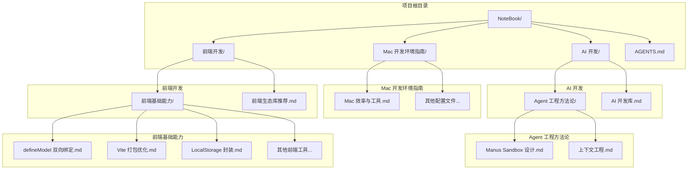
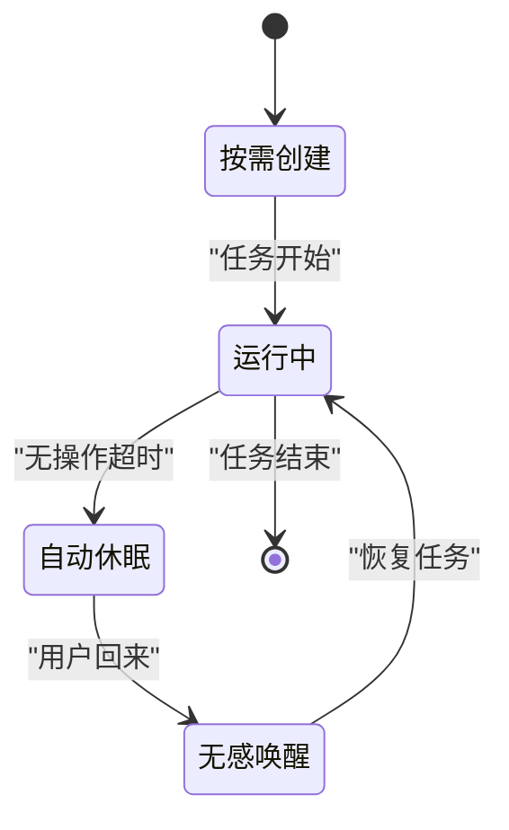
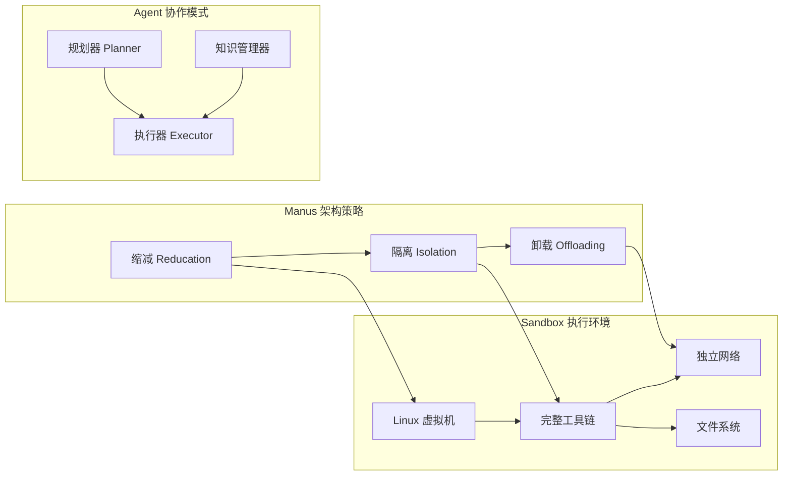
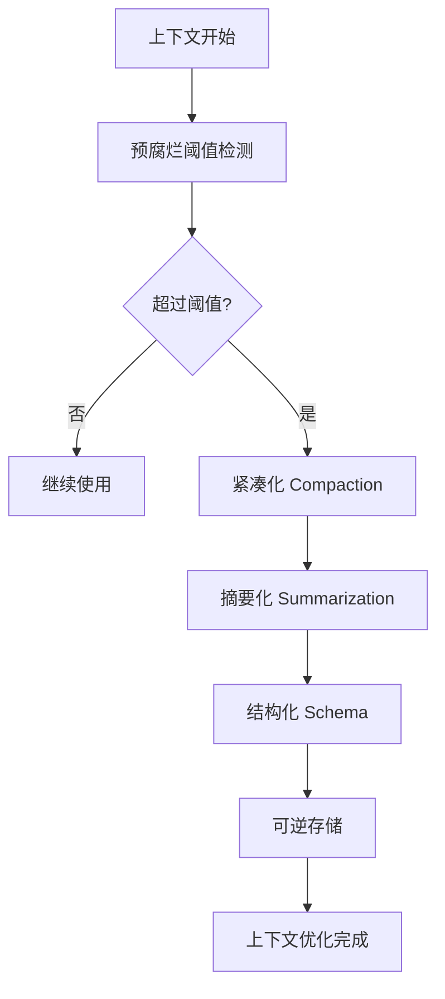
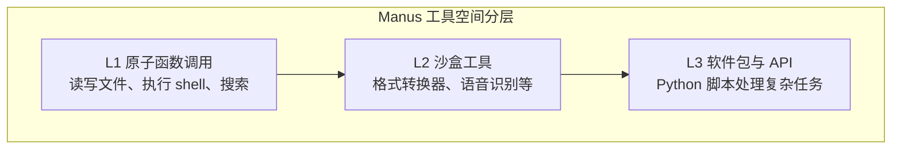
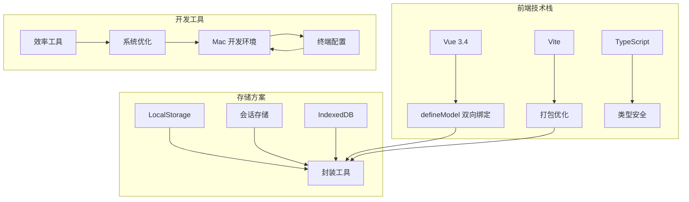

# Manus Sandbox 设计

<cite>
**本文档引用的文件**
- [Manus Sandbox 设计.md](file://AI 开发/Agent 工程方法论/Manus Sandbox 设计.md)
- [上下文工程.md](file://AI 开发/Agent 工程方法论/上下文工程.md)
- [AI 开发库.md](file://AI 开发/AI 开发库.md)
- [defineModel 双向绑定.md](file://前端开发/前端基础能力/defineModel 双向绑定.md)
- [Vite 打包优化.md](file://前端开发/前端基础能力/Vite 打包优化.md)
- [LocalStorage 封装.md](file://前端开发/前端基础能力/LocalStorage 封装.md)
- [Mac 效率与工具.md](file://Mac 开发环境指南/Mac 效率与工具.md)
- [AGENTS.md](file://AGENTS.md)
</cite>

## 目录
1. [简介](#简介)
2. [项目结构](#项目结构)
3. [核心组件](#核心组件)
4. [架构概览](#架构概览)
5. [详细组件分析](#详细组件分析)
6. [依赖关系分析](#依赖关系分析)
7. [性能考虑](#性能考虑)
8. [故障排除指南](#故障排除指南)
9. [结论](#结论)
10. [附录](#附录)

## 简介

Manus Sandbox 是 Manus 架构中最核心的设计理念之一，它为每个 AI 任务分配一台完全独立的云端虚拟机，拥有完整的操作系统、文件系统、网络连接、浏览器和各种软件工具。这一设计彻底改变了 AI 的工作方式，使 AI 能够自主执行复杂的编程任务，从"纸上谈兵"转变为真正的自主执行。

## 项目结构

该项目是一个个人技术笔记仓库，主要包含以下几类内容：

**图表来源**
- [AGENTS.md:13-28](file://AGENTS.md#L13-L28)

**章节来源**
- [AGENTS.md:5-28](file://AGENTS.md#L5-L28)

## 核心组件

### Sandbox 核心定位

Sandbox 的核心设计理念是"给 AI 一台完整的电脑"。它为每个 AI 任务提供：

- **完整的操作系统环境**：包括 Linux 虚拟机，拥有完整的文件系统
- **独立的网络连接**：可以访问互联网，执行网络相关操作
- **完整的软件工具链**：编译器、解释器、包管理器等
- **浏览器环境**：可以进行网页交互和测试

这种设计让 AI 能够：
- 自由安装依赖、配置环境、编译运行
- 验证代码是否真正运行成功
- 执行复杂的多步骤任务（写代码 → 运行 → 看报错 → 修复 → 再运行）

**章节来源**
- [Manus Sandbox 设计.md:3-17](file://AI 开发/Agent 工程方法论/Manus Sandbox 设计.md#L3-L17)

### 工程取舍机制

为了平衡成本和可用性，Manus 采用了三个关键的工程取舍机制：

#### 1. 动态生命周期管理

**图表来源**
- [Manus Sandbox 设计.md:23-29](file://AI 开发/Agent 工程方法论/Manus Sandbox 设计.md#L23-L29)

#### 2. 数据回收机制

| 用户类型 | 保留时长 |
|---------|---------|
| 免费用户 | 7 天 |
| Pro 用户 | 21 天 |

回收后只保留核心资产，运行中的临时文件、中间代码、环境配置全部丢失。

#### 3. 安全设计：零信任架构

Sandbox 采用 Zero Trust 架构，AI 在沙盒内拥有绝对控制权：
- 可以修改系统文件、格式化磁盘
- 完全隔离，不影响 Manus 主服务
- 如果 AI 搞坏系统，直接删除重开

**章节来源**
- [Manus Sandbox 设计.md:19-67](file://AI 开发/Agent 工程方法论/Manus Sandbox 设计.md#L19-L67)

## 架构概览

Manus 的整体架构围绕三个核心策略构建：

**图表来源**
- [上下文工程.md:11](file://AI 开发/Agent 工程方法论/上下文工程.md#L11)

### 上下文工程策略

#### 结构化可逆缩减

Manus 采用结构化可逆的上下文缩减策略：

**图表来源**
- [上下文工程.md:26-36](file://AI 开发/Agent 工程方法论/上下文工程.md#L26-L36)

**章节来源**
- [上下文工程.md:9-89](file://AI 开发/Agent 工程方法论/上下文工程.md#L9-L89)

## 详细组件分析

### 上下文缩减策略对比

#### Cursor 的文件化策略

Cursor 采用"万物皆可文件化"的理念：
- 工具结果写入文件：`output.log`
- 终端会话同步文件：便于搜索和回顾
- 历史记录文件化：支持按需检索

#### Manus 的结构化策略

Manus 的策略更加精细：
- **预腐烂阈值**：12.8-20万 Token
- **双版本机制**：完整版 + 紧凑版
- **分阶段执行**：紧凑化 → 摘要化

**章节来源**
- [上下文工程.md:17-36](file://AI 开发/Agent 工程方法论/上下文工程.md#L17-L36)

### 工具空间设计

#### Cursor 的工具说明书文件化

- **索引层**：System Prompt 只包含工具名称列表
- **发现层**：详细描述、参数定义同步到本地文件夹
- **状态同步**：工具状态通过文件传达给 Agent

#### Manus 的分层行动空间

**图表来源**
- [上下文工程.md:47-53](file://AI 开发/Agent 工程方法论/上下文工程.md#L47-L53)

**章节来源**
- [上下文工程.md:37-53](file://AI 开发/Agent 工程方法论/上下文工程.md#L37-L53)

### 多 Agent 协作模式

#### 任务委托模式

主 Agent 发任务，子 Agent 交结果，中间过程免打扰：
- 适用于"过程不重要，只关心结果"的任务
- Manus 内部称为"Agent 即工具"

#### 信息同步模式

子 Agent 创建时能看到主 Agent 完整的先前上下文：
- 适用于高度依赖历史信息的综合分析任务
- 成本较高（Prefill 大输入 + 无法复用 KV 缓存）

**章节来源**
- [上下文工程.md:55-81](file://AI 开发/Agent 工程方法论/上下文工程.md#L55-L81)

## 依赖关系分析

### 技术栈依赖

**图表来源**
- [defineModel 双向绑定.md:5](file://前端开发/前端基础能力/defineModel 双向绑定.md#L5)
- [Vite 打包优化.md:1-9](file://前端开发/前端基础能力/Vite 打包优化.md#L1-L9)

### 开发环境依赖

#### Mac 开发环境配置

| 配置类别 | 工具名称 | 用途 |
|---------|---------|------|
| 键盘 | F1-F12 作为标准功能键 | 提升开发效率 |
| 触控板 | 四指手势 | 快速切换应用和桌面 |
| Finder | 列表视图 | 文件管理更高效 |
| 终端 | raycast | 启动器和全局搜索 |
| 剪贴板 | Paste | 历史记录管理 |

**章节来源**
- [Mac 效率与工具.md:1-218](file://Mac 开发环境指南/Mac 效率与工具.md#L1-L218)

## 性能考虑

### 上下文工程优化

#### Token 消耗优化

根据 Cursor 的实测数据：
- MCP 工具调用任务的 Token 总消耗降低 46.9%
- 通过文件化策略减少上下文冗余

#### 打包性能优化

Vite 打包优化策略：
- **可视化分析**：rollup-plugin-visualizer 精准定位大文件
- **压缩优化**：Gzip/Brotli 双压缩，传输体积缩小 60%-80%
- **CDN 外置**：第三方依赖减少 80%+ 打包体积
- **按需加载**：路由懒加载 + 手动分包

**章节来源**
- [上下文工程.md:21-24](file://AI 开发/Agent 工程方法论/上下文工程.md#L21-L24)
- [Vite 打包优化.md:1-9](file://前端开发/前端基础能力/Vite 打包优化.md#L1-L9)

### 存储性能优化

LocalStorage 封装提供了多项性能优化：
- **过期时间管理**：自动清理过期数据
- **批量操作**：支持批量存储和读取
- **跨页面通信**：监听 storage 事件实现数据同步
- **大小限制**：避免单条数据过大影响性能

**章节来源**
- [LocalStorage 封装.md:1-158](file://前端开发/前端基础能力/LocalStorage 封装.md#L1-L158)

## 故障排除指南

### Sandbox 相关问题

#### 休眠和唤醒问题

**症状**：Sandbox 在长时间无操作后自动休眠
**解决方案**：
- 定期执行轻量操作保持活跃状态
- 设置合理的休眠时间
- 使用无感唤醒功能恢复任务

#### 权限问题

**症状**：AI 无法执行某些系统操作
**解决方案**：
- 确认 Sandbox 具有必要的权限
- 检查安全策略配置
- 必要时重启 Sandbox

#### 数据丢失问题

**症状**：Sandbox 回收后数据消失
**解决方案**：
- 重要数据及时备份
- 使用 Pro 用户的延长保留期
- 建立数据导出流程

### 开发环境问题

#### Mac 系统配置问题

**症状**：触控板手势冲突
**解决方案**：
- 将四指手势设置为四指触发
- 避免与三指手势冲突
- 统一手势配置

#### 终端工具问题

**症状**：启动器无法找到应用程序
**解决方案**：
- 检查 raycast 权限设置
- 重新索引应用程序
- 更新工具到最新版本

**章节来源**
- [Manus Sandbox 设计.md:42-67](file://AI 开发/Agent 工程方法论/Manus Sandbox 设计.md#L42-L67)
- [Mac 效率与工具.md:26-33](file://Mac 开发环境指南/Mac 效率与工具.md#L26-L33)

## 结论

Manus Sandbox 设计代表了 AI Agent 架构的重大突破。通过提供完整的执行环境，AI 能够真正自主地解决复杂问题，而不再局限于预定义的工具集。这一设计的核心价值在于：

1. **执行能力提升**：从"生成代码"到"执行代码"的根本转变
2. **成本控制**：通过动态生命周期管理和数据回收机制平衡成本
3. **安全性保障**：零信任架构确保系统安全
4. **协作边界清晰**：明确区分分享和协作的不同权限级别

对于 Agent 开发者而言，Manus Sandbox 提供了三个重要启示：
- 给 AI 完整的执行环境能显著提升能力上限
- 安全靠隔离不靠限制，在封闭环境里给最大自由度
- 生命周期管理是成本控制的关键
- 区分分享和协作的权限边界

## 附录

### 相关技术资源

#### AI Agent 开发库

**Python 生态**：
- [openai-agents-python](https://github.com/openai/openai-agents-python)：多代理工作流框架
- [Forge](https://github.com/antoinezambelli/forge)：Agent 中间件框架，成功率从 53% 提升到 99%

**TypeScript 生态**：
- [Pi (earendil-works)](https://github.com/earendil-works/pi)：AI Agent 全栈工具箱

#### 前端开发最佳实践

**Vue 3.4 新特性**：
- [defineModel 双向绑定](file://前端开发/前端基础能力/defineModel 双向绑定.md)：减少 60% 代码量
- [Vite 打包优化](file://前端开发/前端基础能力/Vite 打包优化.md)：传输体积缩小 60%-80%

**存储解决方案**：
- [LocalStorage 封装](file://前端开发/前端基础能力/LocalStorage 封装.md)：支持过期时间 + 容错处理

#### Mac 开发环境配置

**效率工具推荐**：
- [raycast](https://raycast.com)：现代化 macOS 启动器
- [Paste](https://pasteapp.io)：剪贴板管理工具
- [Magnet](https://magnet.crowdcafe.com)：窗口分屏管理工具

**章节来源**
- [AI 开发库.md:1-73](file://AI 开发/AI 开发库.md#L1-L73)
- [defineModel 双向绑定.md:1-128](file://前端开发/前端基础能力/defineModel 双向绑定.md#L1-L128)
- [Vite 打包优化.md:1-225](file://前端开发/前端基础能力/Vite 打包优化.md#L1-L225)
- [LocalStorage 封装.md:1-158](file://前端开发/前端基础能力/LocalStorage 封装.md#L1-L158)
- [Mac 效率与工具.md:1-218](file://Mac 开发环境指南/Mac 效率与工具.md#L1-L218)