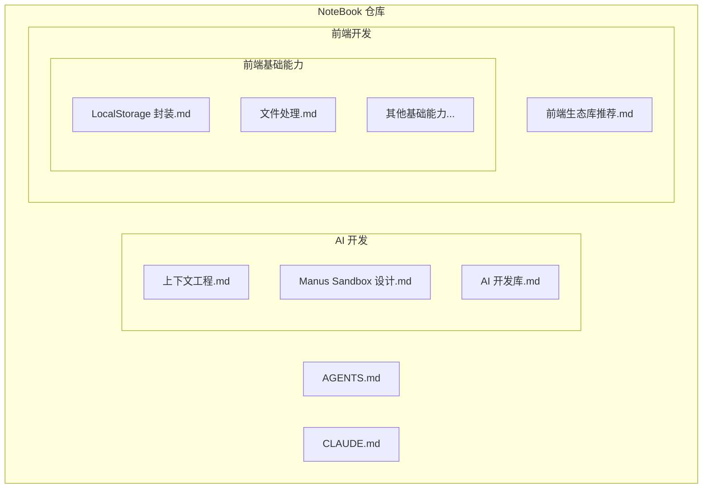
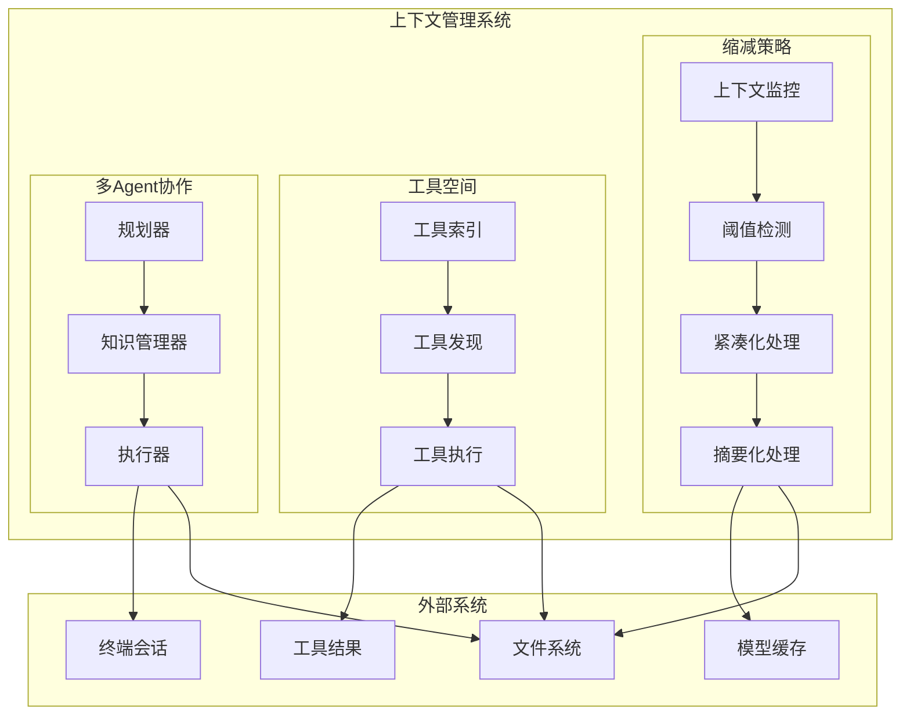
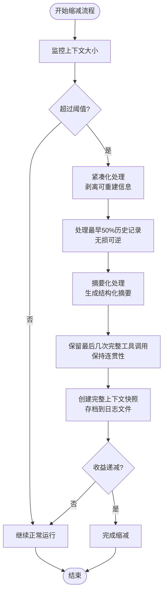
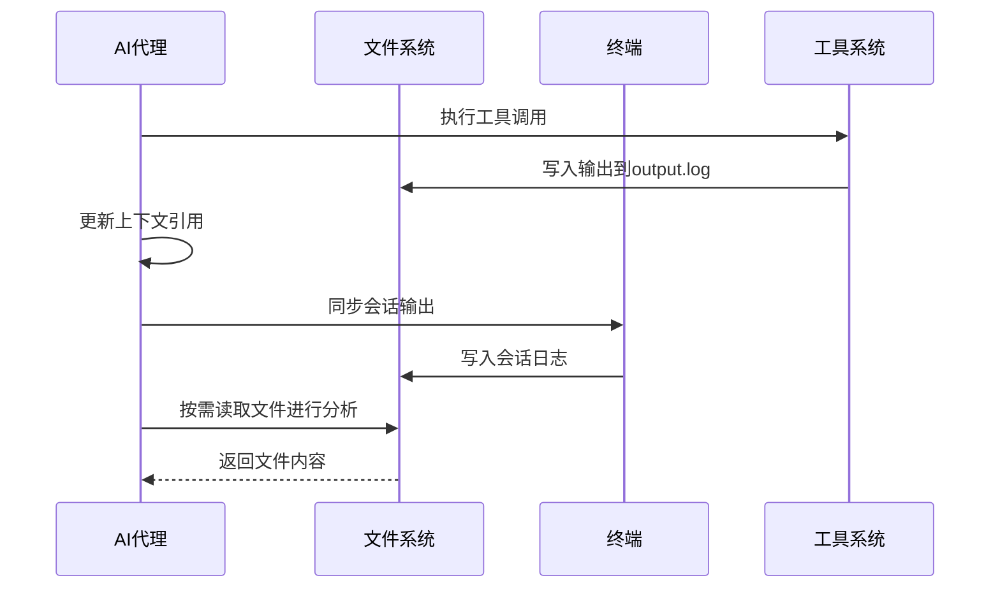
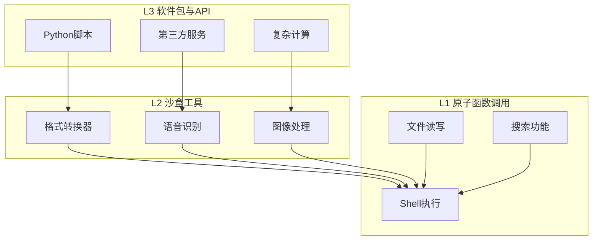
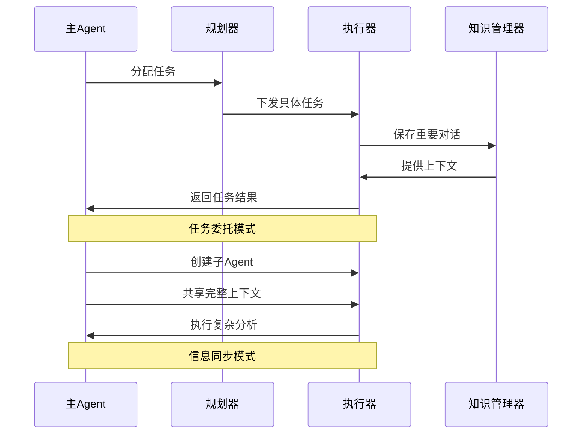
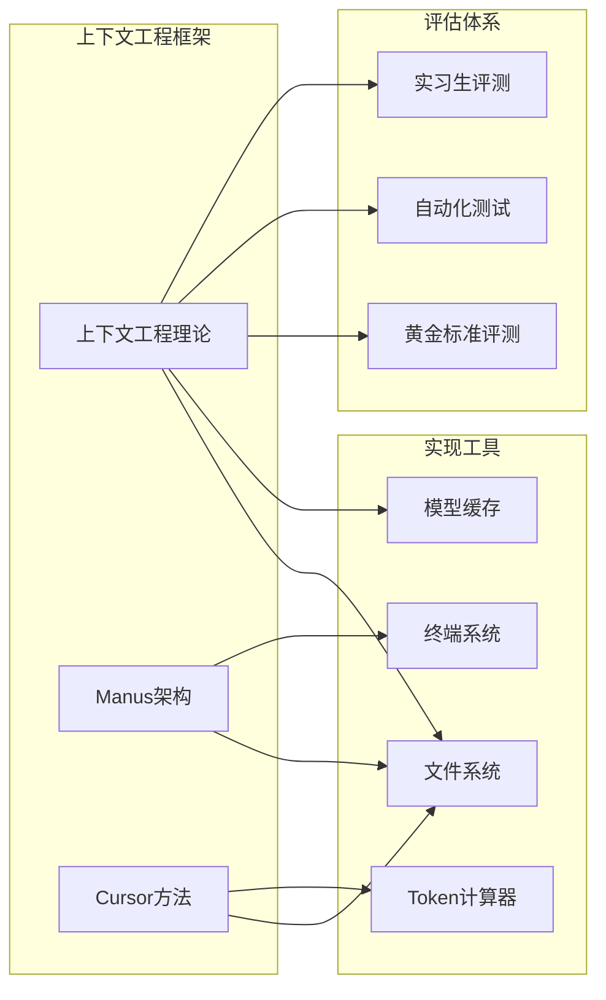

# 上下文工程

<cite>
**本文档引用的文件**
- [上下文工程.md](file://AI 开发/Agent 工程方法论/上下文工程.md)
- [Manus Sandbox 设计.md](file://AI 开发/Agent 工程方法论/Manus Sandbox 设计.md)
- [AI 开发库.md](file://AI 开发/AI 开发库.md)
- [AGENTS.md](file://AGENTS.md)
- [CLAUDE.md](file://CLAUDE.md)
- [LocalStorage 封装.md](file://前端开发/前端基础能力/LocalStorage 封装.md)
- [文件处理.md](file://前端开发/前端基础能力/文件处理.md)
</cite>

## 目录
1. [引言](#引言)
2. [项目结构](#项目结构)
3. [核心组件](#核心组件)
4. [架构概览](#架构概览)
5. [详细组件分析](#详细组件分析)
6. [依赖分析](#依赖分析)
7. [性能考虑](#性能考虑)
8. [故障排除指南](#故障排除指南)
9. [结论](#结论)
10. [附录](#附录)

## 引言

上下文工程是人工智能代理系统设计中的关键领域，专注于优化和管理AI代理的上下文窗口，以提高推理效率和决策质量。本文档深入探讨了现代AI代理系统的上下文工程实践，特别是基于Cursor和Manus等领先项目的最佳实践。

上下文工程的核心理念是"避免上下文的过度工程化"，通过简化架构而非增加复杂层次来提升系统性能。这一理念在Manus项目中得到了充分体现，该系统自3月发布以来已经进行了5次重构，体现了持续优化的重要性。

## 项目结构

该项目是一个个人技术笔记仓库，采用纯Markdown格式，专注于AI开发和前端开发两个主要领域：

**图表来源**
- [上下文工程.md:1-120](file://AI 开发/Agent 工程方法论/上下文工程.md#L1-L120)
- [AI 开发库.md:1-73](file://AI 开发/AI 开发库.md#L1-L73)

**章节来源**
- [AGENTS.md:1-78](file://AGENTS.md#L1-L78)
- [CLAUDE.md:1-84](file://CLAUDE.md#L1-L84)

## 核心组件

### 上下文缩减策略

上下文持续增长会导致"上下文腐烂"现象，表现为推理变慢、质量下降和无意义重复。大多数模型在12.8万至20万Token时性能开始下降，远低于硬件极限。

#### Cursor的文件化策略

Cursor采用"万物皆可文件化"的理念，将冗长的工具结果、终端会话、聊天记录全部转化为文件，让Agent在需要时自行查找。

**关键实现模式**：
- 工具结果写入文件：Shell/MCP返回的巨大JSON写入`output.log`，上下文中只保留文件引用
- 总结阶段引用历史：触发总结时，Agent拿到摘要+指向历史记录文件的引用
- 终端会话同步文件：集成终端的所有输出同步到本地文件系统

**效果**：MCP工具调用任务的Token总消耗降低46.9%

#### Manus的结构化可逆缩减

Manus设计了明确触发机制、分阶段执行的结构化流程：

**核心机制**：
- 腐烂前阈值：通过评估识别性能下降点（通常12.8万至20万Token）
- 工具结果双版本机制：每个工具调用维护完整版和紧凑版
- 第一步：紧凑化（Compaction）- 无损、可逆
- 第二步：摘要化（Summarization）- 有损、带保险

**关键技术**：避免free-form格式，采用结构化Schema，预定义摘要的Schema/表格结构

**章节来源**
- [上下文工程.md:13-36](file://AI 开发/Agent 工程方法论/上下文工程.md#L13-L36)

### 工具空间设计

工具过多会导致上下文混淆和Token浪费。Cursor和Manus提供了不同的解决方案。

#### Cursor的工具说明书文件化

- 索引层：System Prompt只包含工具名称列表
- 发现层：详细描述、参数定义同步到本地文件夹
- 额外收益：工具状态可通过文件传达给Agent

#### Manus的分层行动空间

Manus认为对工具描述做动态RAG不可行，因此采用分层设计：

- L1原子函数调用：极少数固定正交的原子函数
- L2沙盒工具：预装在Linux虚拟机沙箱中
- L3软件包与API：允许Agent编写Python脚本处理大量计算

**章节来源**
- [上下文工程.md:37-54](file://AI 开发/Agent 工程方法论/上下文工程.md#L37-L54)

### 多Agent协作模式

#### 架构组件

- 规划器（Planner）：分配任务
- 知识管理器（Knowledge Manager）：审查对话，决定保存到文件系统的内容
- 执行器子Agent（Executor）：执行规划器分配的任务

#### 任务委托模式

主Agent发任务，子Agent交结果，中间过程免打扰。适用于"过程不重要，只关心结果"的任务。

#### 信息同步模式

子Agent创建时能看到主Agent完整的先前上下文，但拥有独立的系统提示词和行动空间。适用于高度依赖历史信息的综合分析任务。

**章节来源**
- [上下文工程.md:55-81](file://AI 开发/Agent 工程方法论/上下文工程.md#L55-L81)

## 架构概览

**图表来源**
- [上下文工程.md:1-120](file://AI 开发/Agent 工程方法论/上下文工程.md#L1-L120)
- [Manus Sandbox 设计.md:1-69](file://AI 开发/Agent 工程方法论/Manus Sandbox 设计.md#L1-L69)

## 详细组件分析

### 上下文缩减组件

#### 结构化缩减流程

**图表来源**
- [上下文工程.md:26-36](file://AI 开发/Agent 工程方法论/上下文工程.md#L26-L36)

#### Cursor文件化策略

**图表来源**
- [上下文工程.md:17-24](file://AI 开发/Agent 工程方法论/上下文工程.md#L17-L24)

**章节来源**
- [上下文工程.md:13-36](file://AI 开发/Agent 工程方法论/上下文工程.md#L13-L36)

### 工具空间设计组件

#### 分层行动空间架构

**图表来源**
- [上下文工程.md:47-54](file://AI 开发/Agent 工程方法论/上下文工程.md#L47-L54)

**章节来源**
- [上下文工程.md:37-54](file://AI 开发/Agent 工程方法论/上下文工程.md#L37-L54)

### 多Agent协作组件

#### 任务委托与信息同步

**图表来源**
- [上下文工程.md:55-81](file://AI 开发/Agent 工程方法论/上下文工程.md#L55-L81)

**章节来源**
- [上下文工程.md:55-81](file://AI 开发/Agent 工程方法论/上下文工程.md#L55-L81)

## 依赖分析

### 外部依赖关系

**图表来源**
- [上下文工程.md:90-111](file://AI 开发/Agent 工程方法论/上下文工程.md#L90-L111)

### 内部模块依赖

项目内部各组件之间的依赖关系相对简单，主要体现在：

- 上下文工程理论指导具体实现
- Manus架构和Cursor方法相互借鉴
- 评测体系支撑整个工程的验证

**章节来源**
- [上下文工程.md:102-111](file://AI 开发/Agent 工程方法论/上下文工程.md#L102-L111)

## 性能考虑

### Token优化策略

1. **上下文缩减**：通过紧凑化和摘要化减少Token使用
2. **文件化存储**：将历史信息转移到文件系统
3. **结构化输出**：预定义Schema减少生成不确定性
4. **模型路由**：根据任务类型选择最优模型

### 成本控制机制

- **动态生命周期管理**：按需创建、自动休眠、无感唤醒
- **数据回收机制**：根据用户类型设置不同的保留时长
- **安全隔离**：通过Zero Trust架构控制风险

**章节来源**
- [上下文工程.md:90-101](file://AI 开发/Agent 工程方法论/上下文工程.md#L90-L101)
- [Manus Sandbox 设计.md:19-41](file://AI 开发/Agent 工程方法论/Manus Sandbox 设计.md#L19-L41)

## 故障排除指南

### 常见问题诊断

1. **上下文膨胀问题**
   - 检查是否正确实现了文件化策略
   - 验证紧凑化和摘要化流程
   - 监控Token使用趋势

2. **工具调用失败**
   - 确认工具说明书文件化是否正确
   - 检查分层行动空间配置
   - 验证沙盒权限设置

3. **多Agent协作异常**
   - 检查任务委托和信息同步模式
   - 验证结构化输出契约
   - 监控Agent间通信

### 优化建议

- 定期评估上下文大小，及时触发缩减机制
- 使用结构化Schema确保输出一致性
- 建立完善的评测体系验证系统效果
- 持续监控模型性能，及时调整策略

**章节来源**
- [上下文工程.md:71-81](file://AI 开发/Agent 工程方法论/上下文工程.md#L71-L81)

## 结论

上下文工程作为AI代理系统设计的核心领域，其成功与否直接影响到系统的整体性能和用户体验。通过学习Cursor和Manus等领先项目的实践经验，我们可以得出以下关键结论：

1. **简化优于复杂化**：避免上下文的过度工程化，通过简化架构提升系统性能
2. **文件化存储**：将历史信息转移到文件系统，减少上下文负担
3. **分层设计**：采用多层行动空间，平衡功能需求和性能要求
4. **结构化输出**：预定义Schema确保输出质量和一致性
5. **持续优化**：通过评测体系和监控机制持续改进系统表现

这些原则不仅适用于AI代理系统，也为其他类型的复杂软件系统提供了宝贵的架构设计思路。

## 附录

### 相关资源

- **模型路由策略**：根据不同任务类型选择最优模型
- **评测体系**：三层评测确保系统质量
- **安全设计**：Zero Trust架构保障系统安全

### 实践建议

1. **渐进式实施**：从小规模试点开始，逐步扩大应用范围
2. **持续监控**：建立完善的监控体系，及时发现问题
3. **团队培训**：确保团队成员理解上下文工程的重要性和实施方法
4. **文档维护**：保持文档的时效性和准确性

**章节来源**
- [上下文工程.md:112-120](file://AI 开发/Agent 工程方法论/上下文工程.md#L112-L120)