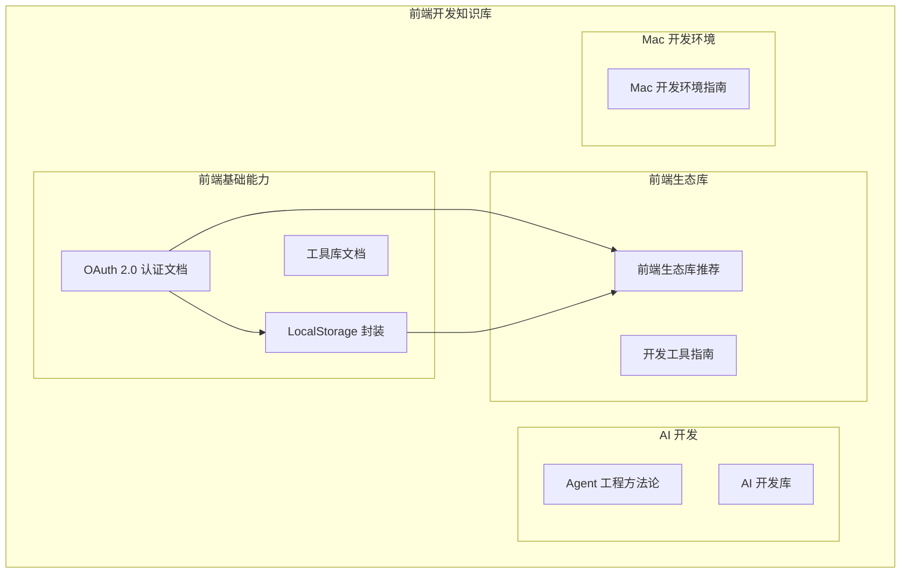
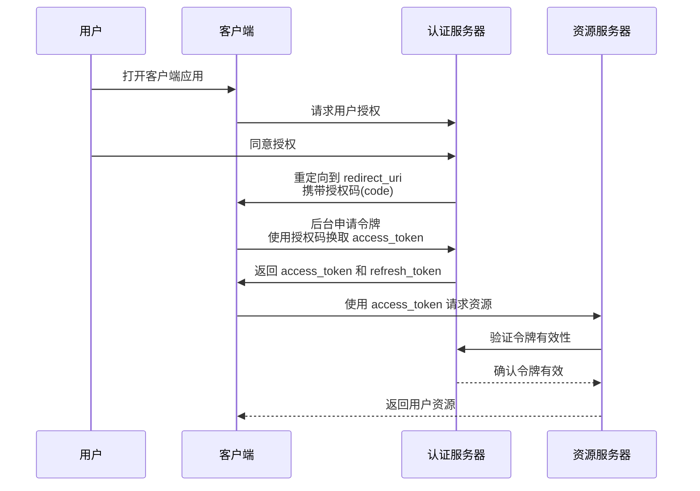
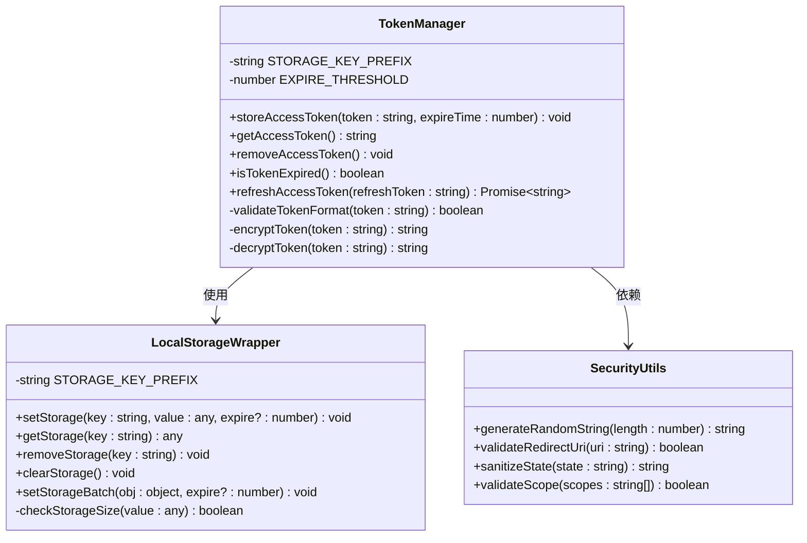
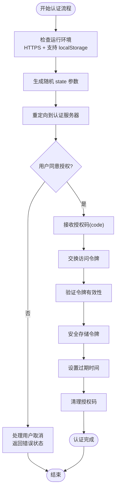
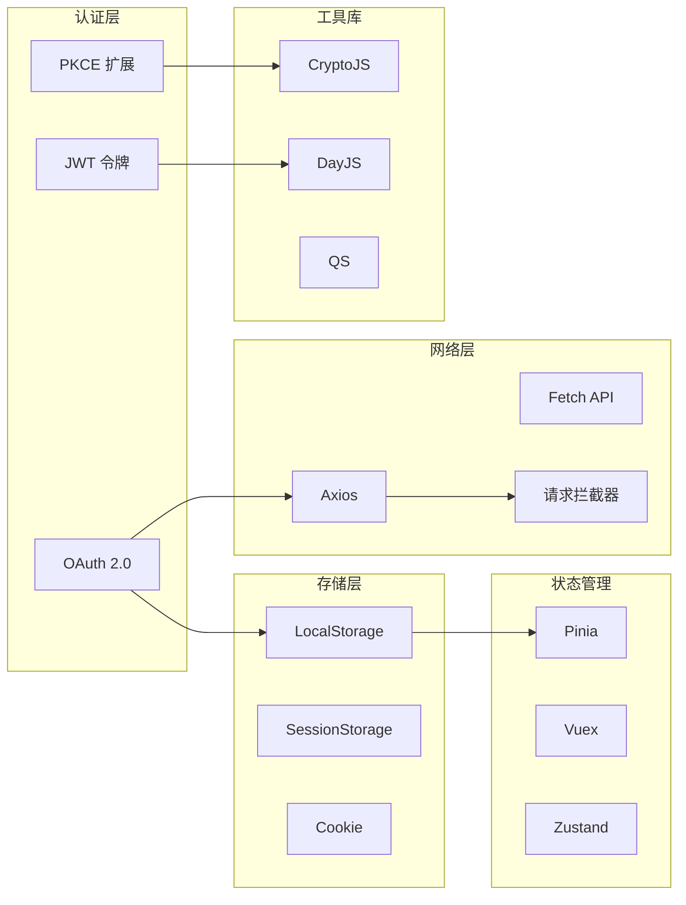

# OAuth 2.0 认证

<cite>
**本文档引用的文件**
- [OAuth 2.0.md](file://前端开发/前端基础能力/OAuth 2.0.md)
- [LocalStorage 封装.md](file://前端开发/前端基础能力/LocalStorage 封装.md)
- [前端生态库推荐.md](file://前端开发/前端生态库推荐.md)
</cite>

## 目录
1. [简介](#简介)
2. [项目结构](#项目结构)
3. [核心组件](#核心组件)
4. [架构概览](#架构概览)
5. [详细组件分析](#详细组件分析)
6. [依赖关系分析](#依赖关系分析)
7. [性能考虑](#性能考虑)
8. [故障排除指南](#故障排除指南)
9. [结论](#结论)

## 简介

OAuth 2.0 是一个开放的授权标准，用于应用程序安全地获取对用户资源的有限访问权限。该标准通过在客户端和服务提供商之间设置授权层来解决传统密码共享的安全问题。

### 为什么需要 OAuth

传统的应用程序访问模式存在以下安全问题：
- 应用程序会保存用户的密码，增加了泄露风险
- 用户无法限制应用程序获得授权的范围和有效期
- 只有修改密码才能收回权限
- 一旦第三方应用程序被破解，会导致密码和所有数据泄漏

OAuth 2.0 通过在客户端与服务提供商之间设置授权层来解决这些问题，客户端不直接登录，只登录授权层，使用令牌代替密码。

## 项目结构

该项目是一个知识库文档集合，专注于前端开发相关的技术文档。OAuth 2.0 认证相关内容主要集中在前端基础能力文档中。

**图表来源**
- [OAuth 2.0.md:1-249](file://前端开发/前端基础能力/OAuth 2.0.md#L1-L249)
- [LocalStorage 封装.md:1-158](file://前端开发/前端基础能力/LocalStorage 封装.md#L1-L158)

## 核心组件

### OAuth 2.0 核心概念

OAuth 2.0 定义了六个关键角色：

1. **第三方应用程序/客户端**：想要访问用户资源的第三方应用
2. **HTTP 服务/服务提供商**：提供资源访问的服务平台（如 Google）
3. **资源所有者**：用户本人
4. **用户代理**：通常指浏览器
5. **认证服务器**：专门处理认证、发放 Token 的服务
6. **资源服务器**：存放用户资源的服务器，可以和认证服务器是同一台，也可以不同

### 四种授权模式

#### 1. 授权码模式（Authorization Code）

这是功能最完整、流程最严密的模式，通过客户端的后台服务器与认证服务器互动。

**核心特性**：
- 授权码有效期极短（通常 10 分钟）
- 授权码只能使用一次，重复使用会被拒绝
- 与 client_id 和 redirect_uri 一一对应

**流程步骤**：
1. 用户访问客户端，客户端将用户导向认证服务器
2. 用户选择是否授权
3. 用户同意后，认证服务器将用户重定向到客户端指定的 redirect_uri，并附带授权码（code）
4. 客户端收到 code，在后台用 code + redirect_uri + client_id 向认证服务器申请令牌
5. 认证服务器核对无误，返回 access_token 和 refresh_token

#### 2. 简化模式（Implicit）

不通过客户端服务器，直接在浏览器中申请令牌，跳过授权码步骤。所有步骤在浏览器中完成，令牌对访问者可见，客户端无需认证。

**注意**：简化模式已不推荐使用，已被 PKCE 模式取代。

#### 3. 密码模式（Resource Owner Password Credentials）

用户直接向客户端提供用户名和密码，客户端用这些信息向认证服务器索要令牌。

**适用场景**：用户对客户端高度信任（如操作系统的一部分，或知名公司出品）

#### 4. 客户端模式（Client Credentials）

客户端以自己的名义（而非用户名义）向认证服务器申请令牌。严格来说不属于 OAuth 要解决的典型授权问题。

**适用场景**：服务间调用（API to API），客户端直接注册使用服务

**章节来源**
- [OAuth 2.0.md:36-249](file://前端开发/前端基础能力/OAuth 2.0.md#L36-L249)

## 架构概览

OAuth 2.0 的整体运行流程包括以下关键步骤：

**图表来源**
- [OAuth 2.0.md:23-31](file://前端开发/前端基础能力/OAuth 2.0.md#L23-L31)

### 安全要点

OAuth 2.0 实现中的关键安全考虑：

1. **通信安全**：所有通信必须使用 HTTPS
2. **重定向 URI 验证**：redirect_uri 必须精确匹配注册时的值
3. **CSRF 防护**：state 参数必须随机且一次性
4. **令牌管理**：Access Token 过期时间要短，配合 Refresh Token 使用
5. **密钥保护**：客户端密钥（client_secret）绝不能出现在前端代码中
6. **缓存控制**：Token 响应的 HTTP 头必须指定 no-store，防止缓存泄漏

**章节来源**
- [OAuth 2.0.md:240-249](file://前端开发/前端基础能力/OAuth 2.0.md#L240-L249)

## 详细组件分析

### 令牌管理组件

在前端应用中，OAuth 2.0 令牌的存储和管理是一个重要组件。基于项目中的 LocalStorage 封装，可以实现安全的令牌存储机制。

**图表来源**
- [LocalStorage 封装.md:1-158](file://前端开发/前端基础能力/LocalStorage 封装.md#L1-L158)

### 令牌存储策略

基于 LocalStorage 封装的令牌存储实现具有以下特点：

1. **键名前缀管理**：使用统一的存储前缀避免与其他项目冲突
2. **过期时间控制**：支持设置令牌过期时间，自动清理过期数据
3. **JSON 序列化**：自动处理对象和数组类型的存储
4. **错误处理**：包含完整的异常捕获和错误提示机制
5. **跨页面通信**：支持监听存储变化实现多页面状态同步

**章节来源**
- [LocalStorage 封装.md:8-85](file://前端开发/前端基础能力/LocalStorage 封装.md#L8-L85)

### 安全实现模式

OAuth 2.0 在前端的安全实现应该遵循以下模式：

**图表来源**
- [OAuth 2.0.md:36-112](file://前端开发/前端基础能力/OAuth 2.0.md#L36-L112)

**章节来源**
- [OAuth 2.0.md:36-112](file://前端开发/前端基础能力/OAuth 2.0.md#L36-L112)

## 依赖关系分析

### 前端生态系统集成

OAuth 2.0 认证在前端生态系统中的位置和依赖关系：

**图表来源**
- [前端生态库推荐.md:1-361](file://前端开发/前端生态库推荐.md#L1-L361)

### 第三方库集成

基于项目中的生态库推荐，OAuth 2.0 认证可以与以下库集成：

1. **状态管理**：Pinia、Vuex、Zustand
2. **网络请求**：Axios、Fetch API
3. **加密工具**：CryptoJS、js-cookie
4. **时间处理**：DayJS、Moment.js
5. **工具函数**：lodash-es、es-toolkit

**章节来源**
- [前端生态库推荐.md:80-176](file://前端开发/前端生态库推荐.md#L80-L176)

## 性能考虑

### 令牌存储性能优化

1. **存储容量限制**：浏览器 LocalStorage 通常限制为 5-10MB，需要监控存储使用情况
2. **序列化开销**：频繁的 JSON 序列化/反序列化会影响性能，建议批量操作
3. **过期检查**：定期清理过期数据，避免存储膨胀
4. **跨页面同步**：使用 storage 事件监听时要注意避免无限循环

### 网络性能优化

1. **令牌预加载**：在应用启动时预检查令牌有效性
2. **批量请求**：合并多个 API 请求减少网络往返
3. **缓存策略**：合理设置资源缓存策略
4. **连接复用**：使用 keep-alive 复用 HTTP 连接

## 故障排除指南

### 常见问题诊断

1. **授权码无效**
   - 检查 redirect_uri 是否与注册时完全一致
   - 验证授权码是否在有效期内（通常 10 分钟）
   - 确认授权码只能使用一次

2. **令牌过期**
   - 检查 access_token 的过期时间
   - 使用 refresh_token 获取新令牌
   - 验证服务器时间同步

3. **CSRF 攻击防护**
   - 确认 state 参数随机生成
   - 验证 state 参数在重定向过程中保持不变
   - 检查服务器端 state 参数验证逻辑

4. **存储相关问题**
   - 检查浏览器隐私模式支持
   - 验证 LocalStorage 可用性
   - 监控存储空间使用情况

**章节来源**
- [OAuth 2.0.md:240-249](file://前端开发/前端基础能力/OAuth 2.0.md#L240-L249)

### 调试技巧

1. **浏览器开发者工具**
   - Network 面板检查 OAuth 请求和响应
   - Application 面板查看 LocalStorage 内容
   - Console 面板输出调试信息

2. **日志记录**
   - 记录完整的 OAuth 流程步骤
   - 捕获错误和异常信息
   - 监控令牌生命周期

3. **测试策略**
   - 单元测试验证令牌存储逻辑
   - 集成测试模拟完整认证流程
   - 性能测试评估存储和网络开销

## 结论

OAuth 2.0 作为一种成熟的授权标准，在现代 Web 应用开发中扮演着至关重要的角色。通过合理的实现策略和安全措施，可以构建出既安全又高效的认证系统。

### 最佳实践总结

1. **安全优先**：始终使用 HTTPS，妥善管理客户端密钥，实施严格的令牌验证
2. **用户体验**：优化认证流程，提供清晰的错误提示和恢复机制
3. **性能优化**：合理设计存储策略，优化网络请求，监控系统性能
4. **可维护性**：模块化设计，完善的错误处理，清晰的代码文档

通过遵循这些原则和实践，可以构建出符合现代安全标准的 OAuth 2.0 认证系统，为用户提供安全可靠的访问体验。