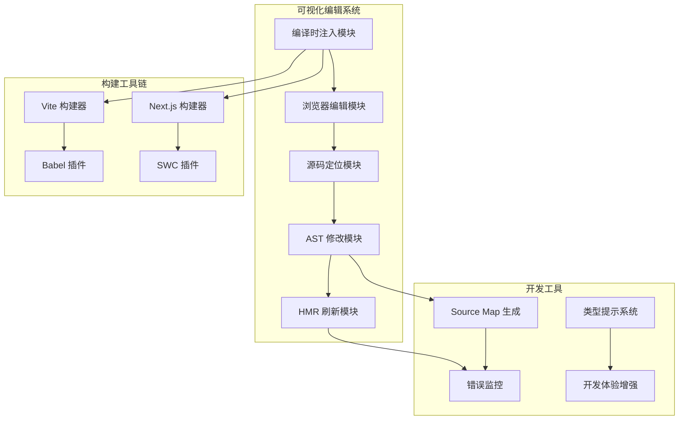
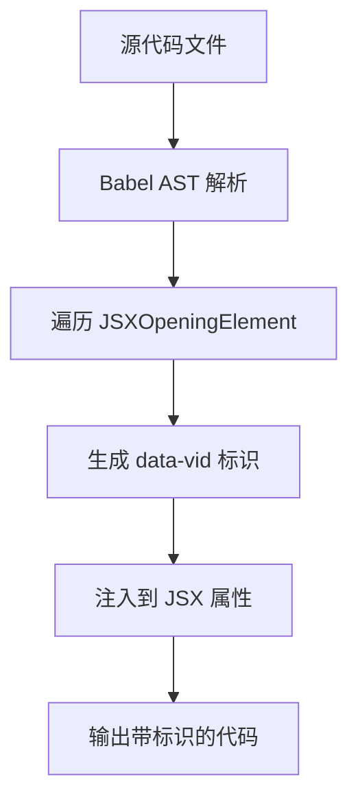
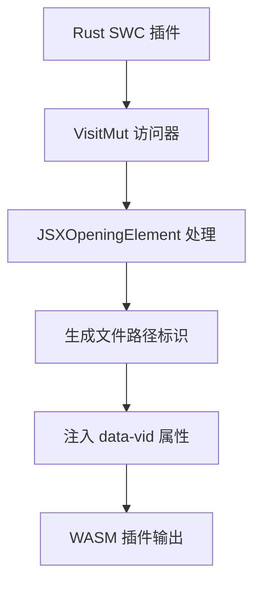
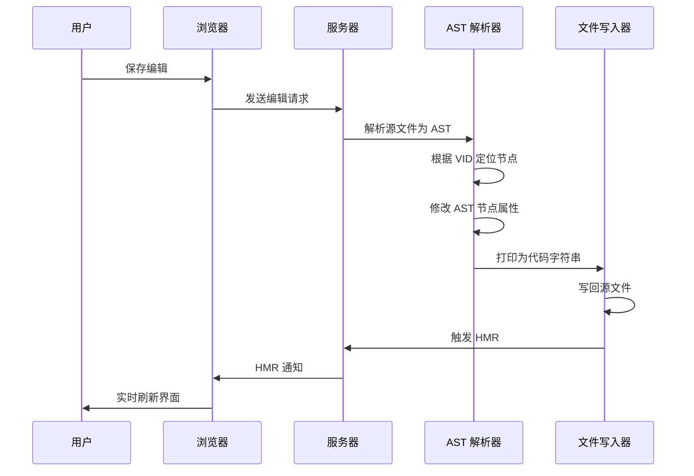
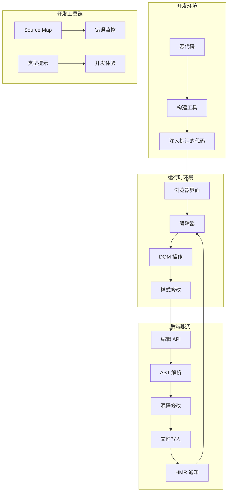
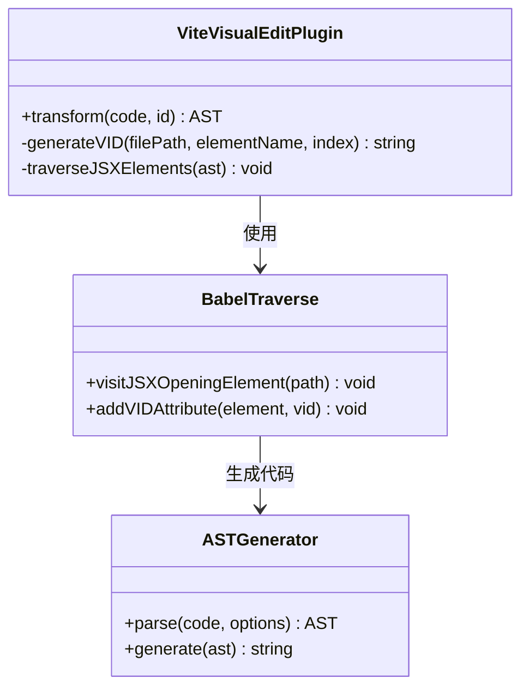
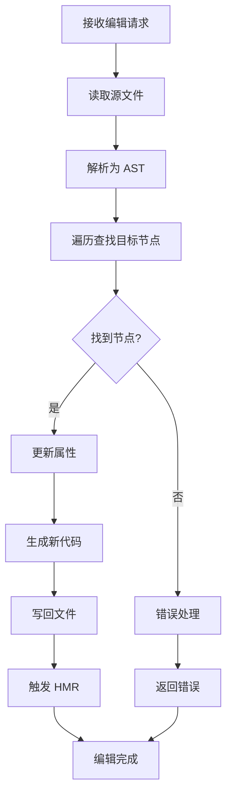
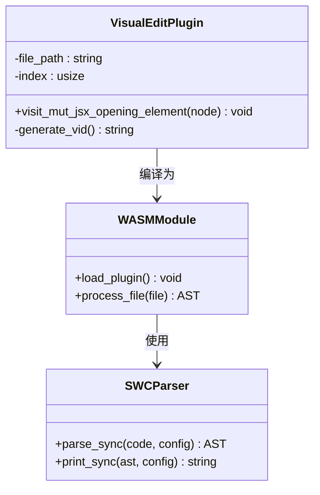
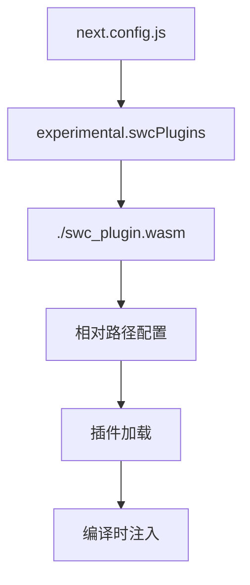
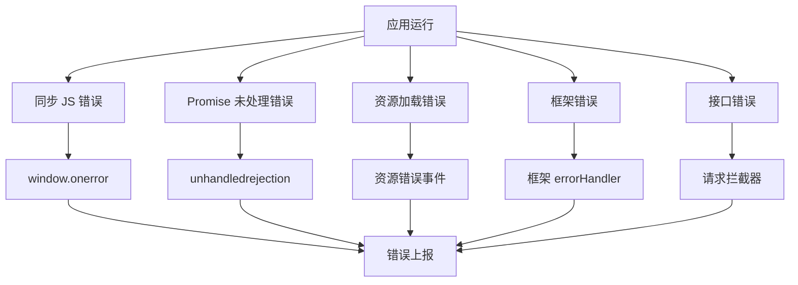

# React 可视化编辑

<cite>
**本文档引用的文件**
- [React 可视化编辑.md](file://前端开发/前端基础能力/React 可视化编辑.md)
- [Vite 打包优化.md](file://前端开发/前端基础能力/Vite 打包优化.md)
- [LocalStorage 封装.md](file://前端开发/前端基础能力/LocalStorage 封装.md)
- [OAuth 2.0.md](file://前端开发/前端基础能力/OAuth 2.0.md)
- [实时通信.md](file://前端开发/前端基础能力/实时通信.md)
- [错误监控.md](file://前端开发/前端基础能力/错误监控.md)
- [ECharts JSDoc 类型提示.md](file://前端开发/前端基础能力/ECharts JSDoc 类型提示.md)
- [枚举管理.md](file://前端开发/前端基础能力/枚举管理.md)
</cite>

## 目录
1. [简介](#简介)
2. [项目结构](#项目结构)
3. [核心组件](#核心组件)
4. [架构概览](#架构概览)
5. [详细组件分析](#详细组件分析)
6. [依赖关系分析](#依赖关系分析)
7. [性能考虑](#性能考虑)
8. [故障排除指南](#故障排除指南)
9. [结论](#结论)

## 简介

React 可视化编辑是一种革命性的前端开发方式，它允许开发者在浏览器中直接编辑 React 组件，而无需离开可视化界面。这种技术的核心在于将浏览器中的 DOM 元素精准映射回源代码位置，实现真正的"所见即所得"编辑体验。

### 主要亮点

- **编译时注入 `data-vid` 标识**：通过 AST 插件为每个 JSX 节点注入唯一标识符，实现 DOM 与源码的精确映射
- **实时编辑体验**：支持直接在浏览器中选中元素、编辑样式和内容，保存后回写源码
- **AST 修改 + HMR 无缝刷新**：修改即时生效，刷新不丢失工作成果
- **双方案实现**：Vite + Babel（门槛低）和 Next.js + SWC（性能优异）

## 项目结构

基于仓库中的前端开发知识库，React 可视化编辑系统采用模块化设计，主要包含以下核心模块：



**图表来源**
- [React 可视化编辑.md:13-17](file://前端开发/前端基础能力/React 可视化编辑.md#L13-L17)
- [Vite 打包优化.md:1-31](file://前端开发/前端基础能力/Vite 打包优化.md#L1-L31)

**章节来源**
- [React 可视化编辑.md:5-11](file://前端开发/前端基础能力/React 可视化编辑.md#L5-L11)

## 核心组件

### 1. 编译时注入模块

编译时注入模块负责在构建阶段为 JSX 节点添加唯一标识符，这是整个可视化编辑系统的基础。

#### Vite + Babel 方案



**图表来源**
- [React 可视化编辑.md:60-76](file://前端开发/前端基础能力/React 可视化编辑.md#L60-L76)

#### Next.js + SWC 方案



**图表来源**
- [React 可视化编辑.md:99-114](file://前端开发/前端基础能力/React 可视化编辑.md#L99-L114)

**章节来源**
- [React 可视化编辑.md:19-25](file://前端开发/前端基础能力/React 可视化编辑.md#L19-L25)

### 2. 浏览器编辑模块

浏览器编辑模块提供直观的用户界面，支持元素选择、样式编辑和内容修改。

#### 编辑功能特性

- **元素高亮显示**：选中元素时自动高亮
- **内容可编辑**：支持 `contenteditable` 编辑状态
- **样式面板**：提供 `className` 和 `style` 属性编辑
- **实时预览**：修改先作用于 DOM 实现实时效果

**章节来源**
- [React 可视化编辑.md:26-34](file://前端开发/前端基础能力/React 可视化编辑.md#L26-L34)

### 3. 源码定位模块

源码定位模块通过 `data-vid` 标识将浏览器中的元素精确映射到源代码位置。

#### 定位策略对比

| 策略 | 原理 | 优点 | 缺点 |
|------|------|------|------|
| AST Path（节点路径） | 记录父节点链路 | 定位精确，格式化后仍有效 | 对代码结构变化敏感 |
| DFS 全局 index | 深度优先遍历编号 | 实现简单，对格式化稳定 | 插入/删除节点导致序号漂移 |

**章节来源**
- [React 可视化编辑.md:35-45](file://前端开发/前端基础能力/React 可视化编辑.md#L35-L45)

### 4. AST 修改模块

AST 修改模块负责解析源代码为 AST，根据定位策略找到目标节点并进行修改。

#### 修改流程



**图表来源**
- [React 可视化编辑.md:48-56](file://前端开发/前端基础能力/React 可视化编辑.md#L48-L56)

**章节来源**
- [React 可视化编辑.md:46-56](file://前端开发/前端基础能力/React 可视化编辑.md#L46-L56)

## 架构概览

### 系统整体架构



**图表来源**
- [React 可视化编辑.md:13-17](file://前端开发/前端基础能力/React 可视化编辑.md#L13-L17)

### 技术栈对比

| 维度 | Vite + Babel | Next.js + SWC |
|------|-------------|---------------|
| 编译注入 | JS Babel 插件，开发快 | Rust SWC 插件，编译为 WASM |
| 定位策略 | AST Path 或 DFS index | DFS 全局 index |
| 源码回写 | Babel AST + generator，生态成熟 | @swc/core parse/print，性能好 |
| HMR | Vite HMR，链路简单 | Next Fast Refresh / reload |
| 开发门槛 | 低，调试友好 | 高，需 Rust 工具链 |
| 性能 | 中等 | 高 |

**章节来源**
- [React 可视化编辑.md:143-152](file://前端开发/前端基础能力/React 可视化编辑.md#L143-L152)

## 详细组件分析

### Vite + Babel 方案

#### 构建插件实现

Vite 方案通过在 `transform` 阶段遍历 AST 注入 `data-vid` 标识符：



**图表来源**
- [React 可视化编辑.md:60-76](file://前端开发/前端基础能力/React 可视化编辑.md#L60-L76)

#### 保存时的 AST 回写流程



**图表来源**
- [React 可视化编辑.md:78-93](file://前端开发/前端基础能力/React 可视化编辑.md#L78-L93)

**章节来源**
- [React 可视化编辑.md:58-95](file://前端开发/前端基础能力/React 可视化编辑.md#L58-L95)

### Next.js + SWC 方案

#### Rust 插件实现

SWC 方案使用 Rust 编写插件，编译为 `wasm32-wasip1`：



**图表来源**
- [React 可视化编辑.md:99-114](file://前端开发/前端基础能力/React 可视化编辑.md#L99-L114)

#### Next.js 配置



**图表来源**
- [React 可视化编辑.md:116-126](file://前端开发/前端基础能力/React 可视化编辑.md#L116-L126)

**章节来源**
- [React 可视化编辑.md:97-142](file://前端开发/前端基础能力/React 可视化编辑.md#L97-L142)

## 依赖关系分析

### 核心依赖关系

```mermaid
graph TB
subgraph "编译时依赖"
A[Babel Parser] --> B[AST Traversal]
C[@swc/core] --> D[AST Parsing]
E[Source Map] --> F[错误定位]
end
subgraph "运行时依赖"
G[React DOM] --> H[元素渲染]
I[Webpack Dev Server] --> J[HMR 机制]
K[Next.js Fast Refresh] --> L[组件热替换]
end
subgraph "开发工具依赖"
M[TypeScript] --> N[类型安全]
O[Sentry] --> P[错误监控]
Q[Vite] --> R[快速构建]
end
A --> G
C --> G
I --> J
K --> L
```

**图表来源**
- [React 可视化编辑.md:136-142](file://前端开发/前端基础能力/React 可视化编辑.md#L136-L142)

### 版本兼容性

| 组件 | 版本要求 | 兼容性说明 |
|------|----------|------------|
| @swc/core | 与 Next.js 匹配 | 需要查 plugins.swc.rs 确认版本 |
| SWC 插件 | wasm32-wasip1 | 必须使用相对路径 |
| Vite | 最新稳定版 | 与 Babel 插件兼容 |
| React | 17+ | 支持 Hooks 和 Suspense |

**章节来源**
- [React 可视化编辑.md:136-142](file://前端开发/前端基础能力/React 可视化编辑.md#L136-L142)

## 性能考虑

### 构建性能优化

基于 Vite 打包优化的最佳实践，可视化编辑系统可以采用以下优化策略：

#### 1. 构建分析
- 使用 `rollup-plugin-visualizer` 分析打包体积
- 识别大型依赖和重复模块
- 优化第三方库的外部化策略

#### 2. 代码分割
- 使用 `manualChunks` 手动分包
- 路由级懒加载减少初始包体积
- 组件级别的按需加载

#### 3. 压缩策略
- Gzip 和 Brotli 双重压缩
- 针对不同文件类型的阈值设置
- CDN 结合的静态资源优化

**章节来源**
- [Vite 打包优化.md:10-77](file://前端开发/前端基础能力/Vite 打包优化.md#L10-L77)

### 运行时性能

#### 1. AST 解析性能
- SWC 相比 Babel 性能提升约 10-100x
- 使用 WASM 加速 JavaScript AST 解析
- 缓存解析结果减少重复计算

#### 2. HMR 优化
- Vite 的模块热替换比 Webpack 更快
- Next.js 的 Fast Refresh 专注于 React 组件
- 智能增量更新减少不必要的重渲染

#### 3. 内存管理
- 及时释放 AST 解析器实例
- 控制编辑历史的内存占用
- 优化 DOM 操作避免内存泄漏

## 故障排除指南

### 常见问题及解决方案

#### 1. 编译时注入失败

**问题症状**：
- 浏览器中找不到 `data-vid` 属性
- 编辑功能无法使用

**可能原因**：
- Babel 插件未正确配置
- SWC 插件路径错误
- 源代码语法不符合预期

**解决方案**：
- 检查插件配置和导入路径
- 确认源代码符合 JSX 语法规范
- 验证构建工具版本兼容性

**章节来源**
- [React 可视化编辑.md:136-142](file://前端开发/前端基础能力/React 可视化编辑.md#L136-L142)

#### 2. AST 定位错误

**问题症状**：
- 编辑目标不是预期的元素
- 修改影响到错误的组件

**可能原因**：
- `data-vid` 标识符冲突
- 定位策略选择不当
- 代码结构变化导致索引偏移

**解决方案**：
- 使用 AST Path 策略提高定位精度
- 为每个文件生成独立的 VID 命名空间
- 实施 VID 缓存机制避免重复计算

#### 3. HMR 刷新异常

**问题症状**：
- 修改后页面不刷新
- 刷新后状态丢失

**可能原因**：
- HMR 配置错误
- 文件监听失败
- 模块热替换机制异常

**解决方案**：
- 检查开发服务器配置
- 验证文件系统监听权限
- 实施 HMR 失败回退机制

### 错误监控集成

为了确保可视化编辑系统的稳定性，建议集成完善的错误监控：

#### 多层次错误捕获



**图表来源**
- [错误监控.md:10-19](file://前端开发/前端基础能力/错误监控.md#L10-L19)

**章节来源**
- [错误监控.md:157-202](file://前端开发/前端基础能力/错误监控.md#L157-L202)

## 结论

React 可视化编辑代表了前端开发方式的重大变革，它将传统的"编码-编译-测试"循环转变为"所见即所得"的直接编辑体验。通过编译时注入标识符、浏览器实时编辑、精确的源码定位和 AST 修改回写，这套系统实现了真正意义上的"点哪改哪"。

### 技术优势

1. **开发效率提升**：减少编码和编译时间，实现即时反馈
2. **用户体验优化**：非技术用户也能轻松调整页面布局
3. **代码质量保证**：通过 AST 修改确保修改的准确性和一致性
4. **工具链完善**：支持多种构建工具和开发环境

### 应用场景

- **AI 代码生成**：为 AI 生成的代码提供精细微调能力
- **设计稿转代码**：设计师可以直接编辑生成的 React 组件
- **内容管理系统**：CMS 管理员可以直观编辑页面内容
- **原型开发**：快速迭代产品原型和界面设计

### 未来发展方向

1. **生产环境部署**：解决动态内容编辑的安全边界问题
2. **样式系统集成**：支持 CSS-in-JS 和 Tailwind 等现代样式方案
3. **协作编辑**：多人同时编辑同一组件的实时协作
4. **版本控制**：集成 Git 等版本控制系统进行编辑追踪

通过持续的技术创新和工具完善，React 可视化编辑将成为前端开发的标准工作流，大幅提高开发效率和用户体验。