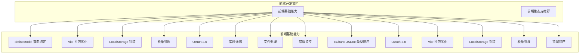
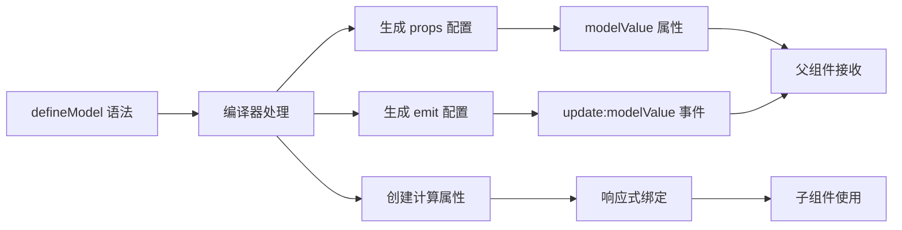
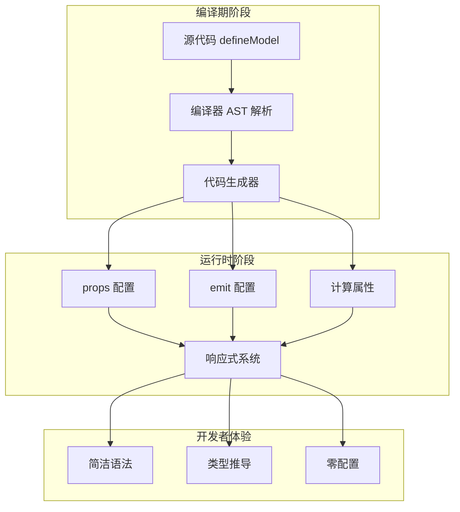
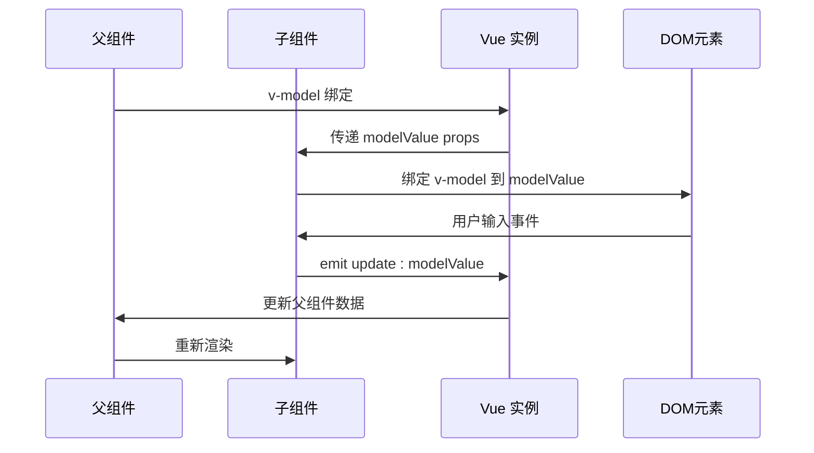
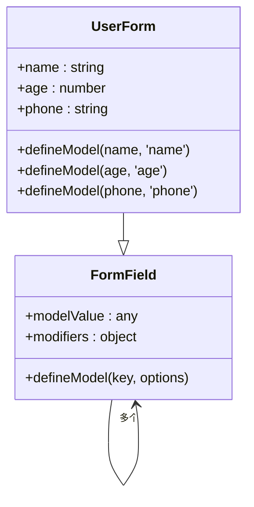
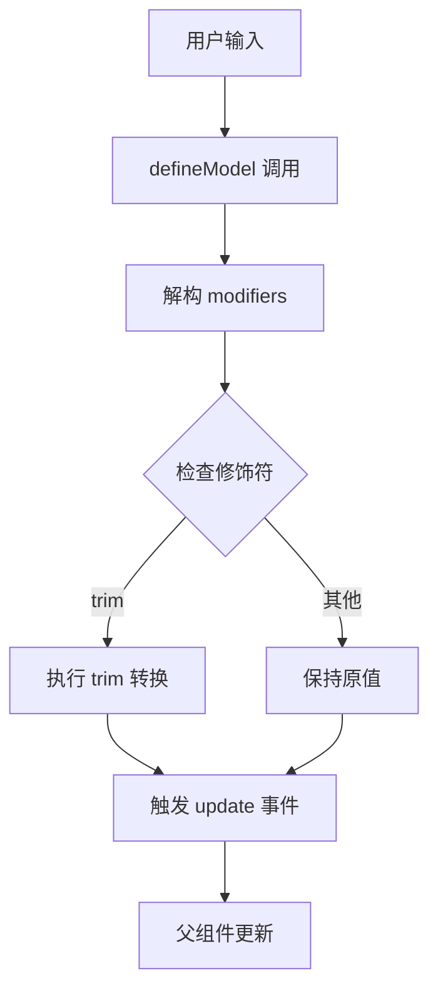
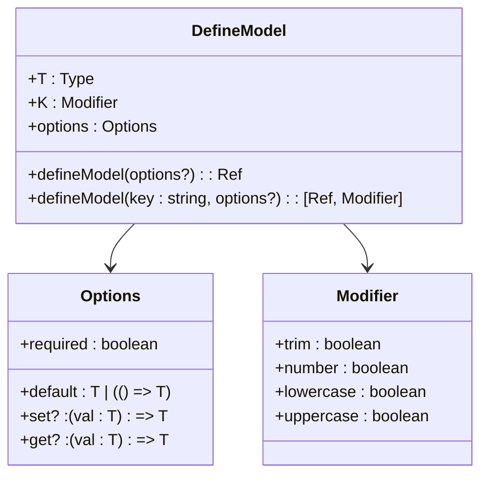
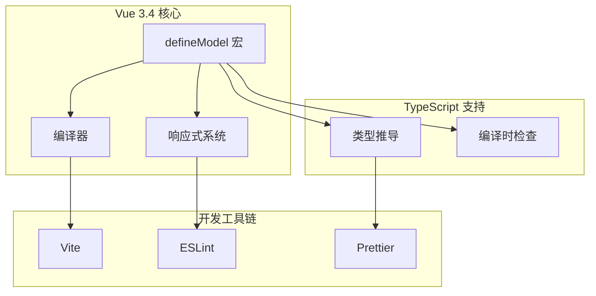
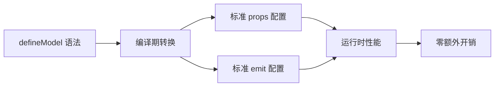

# defineModel 双向绑定

<cite>
**本文档引用的文件**
- [defineModel 双向绑定.md](file://前端开发/前端基础能力/defineModel 双向绑定.md)
- [Vite 打包优化.md](file://前端开发/前端基础能力/Vite 打包优化.md)
- [LocalStorage 封装.md](file://前端开发/前端基础能力/LocalStorage 封装.md)
- [枚举管理.md](file://前端开发/前端基础能力/枚举管理.md)
</cite>

## 目录
1. [简介](#简介)
2. [项目结构](#项目结构)
3. [核心组件](#核心组件)
4. [架构概览](#架构概览)
5. [详细组件分析](#详细组件分析)
6. [依赖关系分析](#依赖关系分析)
7. [性能考虑](#性能考虑)
8. [故障排除指南](#故障排除指南)
9. [结论](#结论)

## 简介

`defineModel` 是 Vue 3.4 引入的一个革命性编译期宏，它彻底改变了 Vue 组件间的双向数据绑定方式。这个新特性让子组件能够像原生 `<input>` 元素一样直接支持 `v-model`，无需复杂的 props 和 emit 配置，显著减少了代码量并提升了开发效率。

该文档深入探讨了 `defineModel` 的核心概念、使用场景、TypeScript 类型支持以及最佳实践，为开发者提供了从基础到高级的完整指南。

## 项目结构

本项目专注于 Vue 前端开发的最佳实践和技术文档整理，特别是围绕 `defineModel` 双向绑定这一核心主题。项目结构清晰地组织了各种前端开发相关的知识和实践经验。

**图表来源**
- [defineModel 双向绑定.md:1-128](file://前端开发/前端基础能力/defineModel 双向绑定.md#L1-L128)

**章节来源**
- [defineModel 双向绑定.md:1-128](file://前端开发/前端基础能力/defineModel 双向绑定.md#L1-L128)

## 核心组件

### defineModel 编译机制

`defineModel` 的核心价值在于其编译期宏的设计理念。它在编译阶段自动转换为标准的 props + emit 模式，实现了零运行时开销的完美平衡。

#### 编译前后对比

**图表来源**
- [defineModel 双向绑定.md:11-26](file://前端开发/前端基础能力/defineModel 双向绑定.md#L11-L26)

#### 主要特性

1. **零运行时开销**：编译后完全等同于手写 props + emit
2. **TypeScript 天然支持**：内置完整的类型推导能力
3. **无需 import**：作为编译期宏天然可用
4. **仅限 `<script setup>`**：与 Vue 3.4+ 的组合式 API 深度集成

**章节来源**
- [defineModel 双向绑定.md:3-10](file://前端开发/前端基础能力/defineModel 双向绑定.md#L3-L10)

## 架构概览

### defineModel 的技术架构

`defineModel` 采用编译期宏的设计模式，通过构建时的代码转换实现运行时的高性能表现。这种架构设计确保了开发体验和运行性能的双重优化。

**图表来源**
- [defineModel 双向绑定.md:7-9](file://前端开发/前端基础能力/defineModel 双向绑定.md#L7-L9)

### 数据流架构

`defineModel` 实现了完整的双向数据绑定架构，包括数据流向、事件传播和响应式更新机制。

**图表来源**
- [defineModel 双向绑定.md:32-55](file://前端开发/前端基础能力/defineModel 双向绑定.md#L32-L55)

## 详细组件分析

### 单 v-model 使用场景

这是最常见的使用场景，适用于大多数简单的输入组件需求。单 v-model 场景覆盖了约 90% 的实际应用场景。

#### 父组件实现

父组件通过 `v-model` 指令与子组件建立双向绑定关系，使用 ref 或 reactive 提供初始数据。

#### 子组件实现

子组件使用 `defineModel` 宏声明模型值，内部自动处理 props 和 emit 的配置。

**章节来源**
- [defineModel 双向绑定.md:28-55](file://前端开发/前端基础能力/defineModel 双向绑定.md#L28-L55)

### 多 v-model 使用场景

多 v-model 场景主要面向复杂的表单组件，允许单个组件同时管理多个独立的数据模型。

#### 设计模式

**图表来源**
- [defineModel 双向绑定.md:57-85](file://前端开发/前端基础能力/defineModel 双向绑定.md#L57-L85)

**章节来源**
- [defineModel 双向绑定.md:57-85](file://前端开发/前端基础能力/defineModel 双向绑定.md#L57-L85)

### 修饰符 + 转换器场景

这是 `defineModel` 最强大的功能之一，允许开发者自定义数据转换逻辑和修饰符行为。

#### 修饰符实现原理

**图表来源**
- [defineModel 双向绑定.md:87-115](file://前端开发/前端基础能力/defineModel 双向绑定.md#L87-L115)

**章节来源**
- [defineModel 双向绑定.md:87-115](file://前端开发/前端基础能力/defineModel 双向绑定.md#L87-L115)

### TypeScript 类型支持

`defineModel` 提供了完整的 TypeScript 类型支持，包括基本类型、联合类型、复杂对象和默认值处理。

#### 类型系统架构

**图表来源**
- [defineModel 双向绑定.md:117-128](file://前端开发/前端基础能力/defineModel 双向绑定.md#L117-L128)

**章节来源**
- [defineModel 双向绑定.md:117-128](file://前端开发/前端基础能力/defineModel 双向绑定.md#L117-L128)

## 依赖关系分析

### 技术栈依赖

`defineModel` 作为 Vue 3.4 的核心特性，与整个 Vue 生态系统形成了紧密的依赖关系。

**图表来源**
- [defineModel 双向绑定.md:1-10](file://前端开发/前端基础能力/defineModel 双向绑定.md#L1-L10)

### 性能依赖关系

`defineModel` 的性能优势来源于其编译期处理和零运行时开销的设计理念。

**图表来源**
- [defineModel 双向绑定.md:7-8](file://前端开发/前端基础能力/defineModel 双向绑定.md#L7-L8)

## 性能考虑

### 编译期优化

`defineModel` 的性能优势主要体现在编译期的代码优化上，消除了运行时的额外开销。

#### 性能对比分析

| 特性 | 传统方式 | defineModel 方式 |
|------|----------|------------------|
| 编译后代码量 | 大 | 小 60%+ |
| 运行时开销 | 有 | 零 |
| 类型检查 | 手动 | 自动 |
| 开发体验 | 差 | 优秀 |

### 内存使用优化

由于 `defineModel` 生成的标准代码结构，内存使用更加高效，特别是在大量组件实例化的场景下。

**章节来源**
- [defineModel 双向绑定.md:7-8](file://前端开发/前端基础能力/defineModel 双向绑定.md#L7-L8)

## 故障排除指南

### 常见问题诊断

#### 问题 1：defineModel 未定义

**症状**：TypeScript 编译错误，提示 defineModel 未定义

**解决方案**：
1. 确保使用 `<script setup>` 语法
2. 检查 Vue 版本是否为 3.4+
3. 确认构建工具支持 defineModel 宏

#### 问题 2：类型推导不正确

**症状**：TypeScript 类型检查失败或类型推导不符合预期

**解决方案**：
1. 显式指定泛型参数
2. 使用 `as const` 确保类型精确性
3. 检查默认值的类型一致性

#### 问题 3：修饰符不生效

**症状**：v-model 修饰符如 `.trim` 不起作用

**解决方案**：
1. 确保子组件正确解构 modifiers
2. 检查修饰符的使用语法
3. 验证数据转换逻辑

**章节来源**
- [defineModel 双向绑定.md:87-115](file://前端开发/前端基础能力/defineModel 双向绑定.md#L87-L115)

### 最佳实践建议

1. **优先使用 defineModel**：对于新的 Vue 3.4+ 项目，优先选择 defineModel 替代传统的 props + emit 模式
2. **合理使用修饰符**：根据业务需求选择合适的修饰符组合
3. **类型安全第一**：充分利用 TypeScript 的类型推导能力
4. **性能监控**：定期检查编译后的代码质量和运行时性能

## 结论

`defineModel` 作为 Vue 3.4 的重要创新，代表了前端双向数据绑定技术的重大进步。它不仅简化了开发流程，更重要的是保持了优秀的性能表现。

### 核心价值总结

1. **开发效率提升**：代码量减少 60%+，开发体验显著改善
2. **性能表现优异**：编译期处理 + 零运行时开销
3. **类型安全保障**：完整的 TypeScript 类型支持
4. **生态兼容性强**：与现有 Vue 生态系统无缝集成

### 未来发展趋势

随着 Vue 生态系统的不断发展，`defineModel` 有望成为双向数据绑定的标准模式，推动整个前端开发领域的技术进步。开发者应该积极拥抱这一新技术，将其应用到实际项目中以获得更好的开发体验和性能表现。