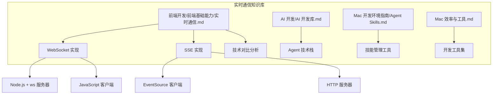
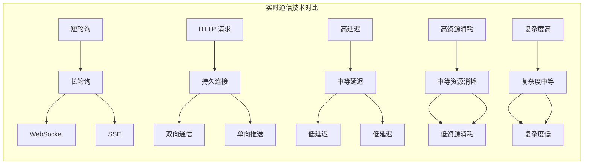
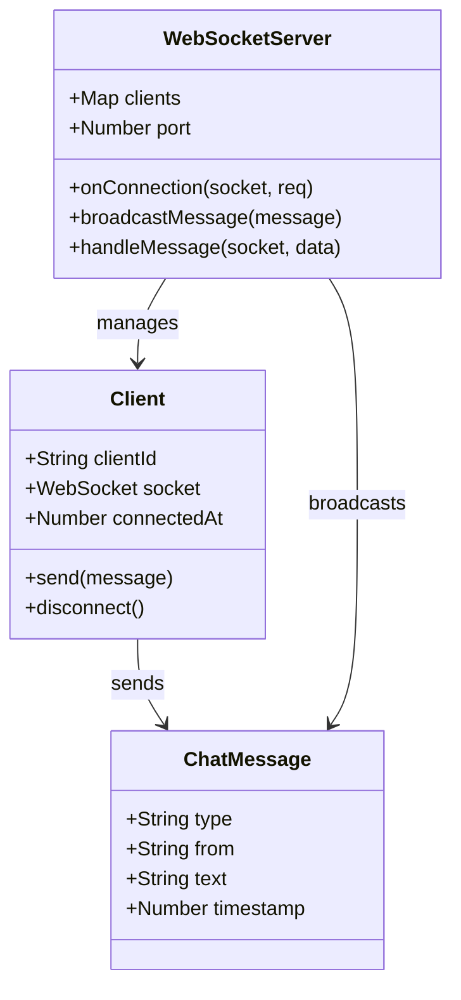
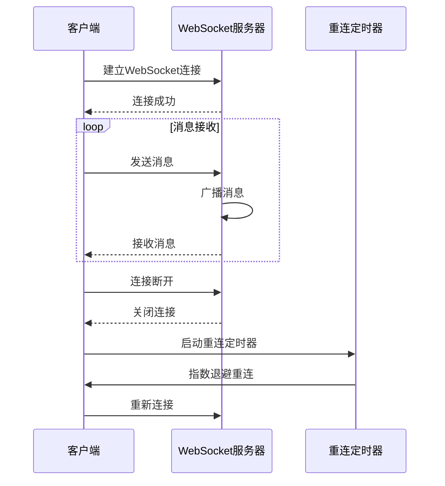
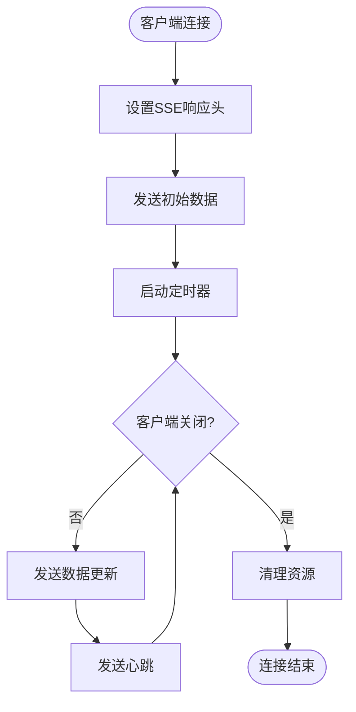
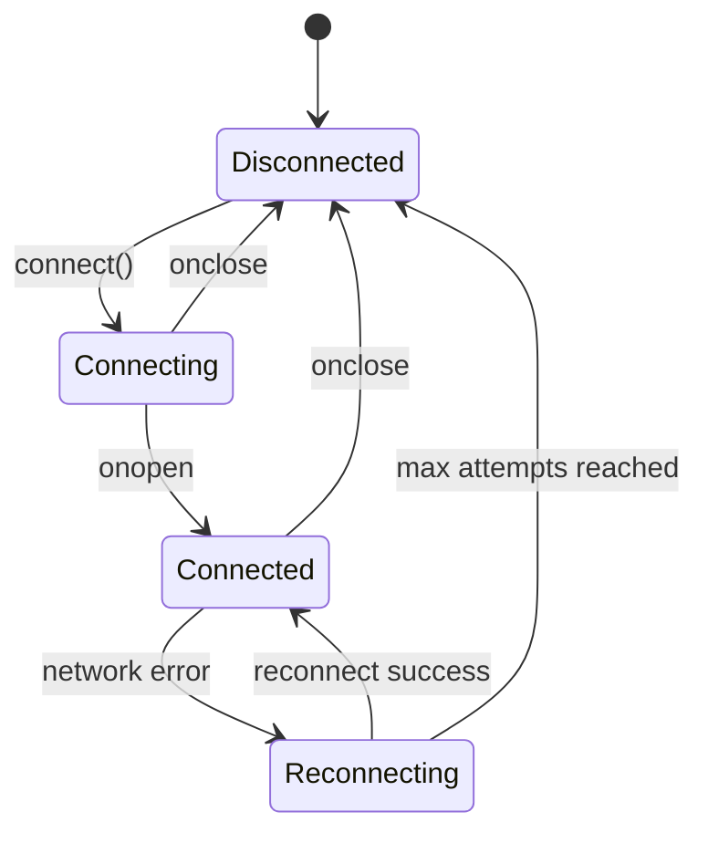
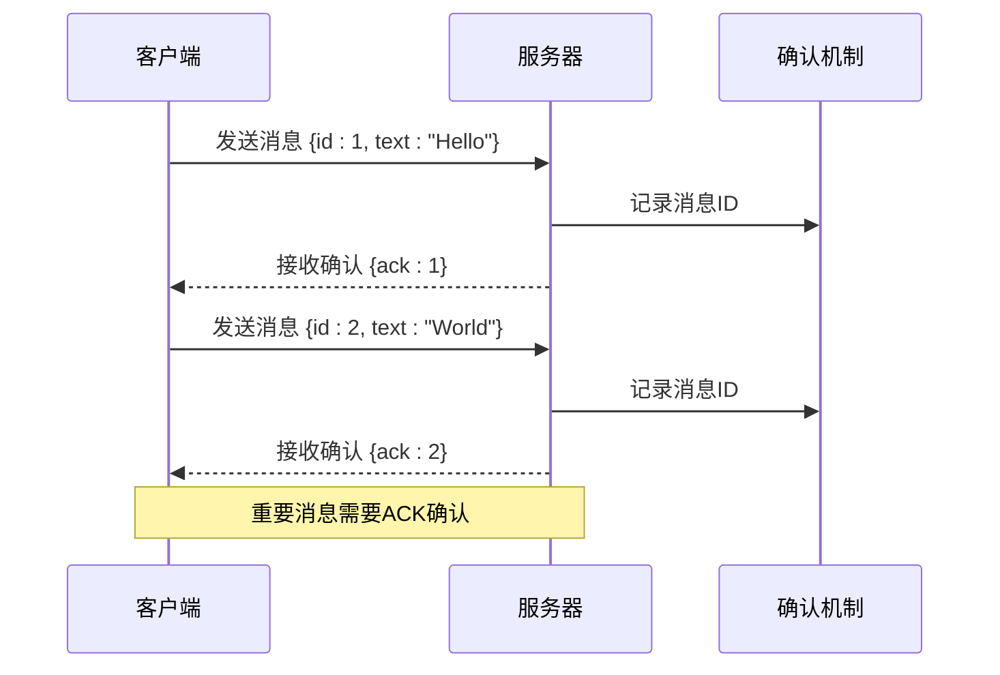
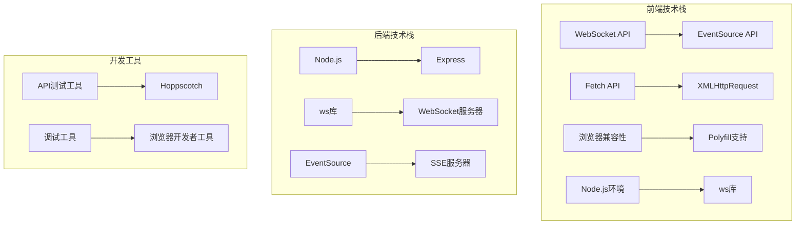

# 实时通信

<cite>
**本文档引用的文件**
- [实时通信.md](file://前端开发/前端基础能力/实时通信.md)
- [AI 开发库.md](file://AI 开发/AI 开发库.md)
- [Agent Skills.md](file://Mac 开发环境指南/Agent Skills.md)
- [Mac 效率与工具.md](file://Mac 开发环境指南/Mac 效率与工具.md)
</cite>

## 目录
1. [简介](#简介)
2. [项目结构](#项目结构)
3. [核心组件](#核心组件)
4. [架构概览](#架构概览)
5. [详细组件分析](#详细组件分析)
6. [依赖分析](#依赖分析)
7. [性能考虑](#性能考虑)
8. [故障排除指南](#故障排除指南)
9. [结论](#结论)

## 简介

实时通信是现代Web应用的核心功能之一，它允许客户端和服务器之间进行即时的数据交换。本文档深入分析了实时通信的演进历程，从传统的轮询方式发展到现代的WebSocket和Server-Sent Events技术，并提供了完整的实现指南和最佳实践。

实时通信技术的选择直接影响应用的性能、用户体验和开发复杂度。本文档涵盖了三种主要的实时通信技术：短轮询、长轮询和WebSocket，以及Server-Sent Events（SSE）的实现方案。

## 项目结构

该项目是一个关于实时通信技术的知识库，主要包含以下核心文件：

**图表来源**
- [实时通信.md:1-269](file://前端开发/前端基础能力/实时通信.md#L1-L269)
- [AI 开发库.md:1-73](file://AI 开发/AI 开发库.md#L1-L73)
- [Agent Skills.md:1-312](file://Mac 开发环境指南/Agent Skills.md#L1-L312)

**章节来源**
- [实时通信.md:1-269](file://前端开发/前端基础能力/实时通信.md#L1-L269)

## 核心组件

### 实时通信技术演进

实时通信技术经历了三个主要发展阶段：

#### 时代 1：短轮询（Polling）

短轮询是最简单的实时通信方式，客户端定时向服务器发送请求来检查是否有新数据。

**特点：**
- 每隔固定时间发送一次请求
- 99% 的请求都是无效的
- 实时性差，延迟等于轮询间隔
- 浪费带宽和服务器资源

#### 时代 2：长轮询（Long Polling）

长轮询改进了短轮询的效率，服务器保持连接直到有新数据或超时。

**优势：**
- 减少无效请求
- 实时性接近零延迟

**缺陷：**
- 服务器需要维护大量挂起连接
- 每次响应后需要重新建立连接
- 多服务器间同步等待队列困难

#### 时代 3：WebSocket

WebSocket是一次性HTTP握手后建立的持久双向连接，是现代实时通信的标准。

**优势：**
- 真正的双向通信
- 低延迟和高效率
- 支持二进制和文本数据
- 标准化协议

**章节来源**
- [实时通信.md:5-121](file://前端开发/前端基础能力/实时通信.md#L5-L121)

### WebSocket 实现详解

#### 服务器端实现（Node.js + ws）

WebSocket服务器使用ws库实现，支持多客户端连接管理和消息广播。

**核心功能：**
- 客户端连接管理
- 消息广播机制
- 连接状态跟踪
- 用户离开通知

#### 客户端实现（智能重连）

客户端实现了完整的重连机制，包括指数退避算法和连接状态管理。

**重连策略：**
- 指数退避重连：`delay = min(1000 * 2^attempts, 30000)`
- 最大重连次数限制
- 连接状态实时反馈
- 消息确认机制

**章节来源**
- [实时通信.md:87-178](file://前端开发/前端基础能力/实时通信.md#L87-L178)

### SSE（Server-Sent Events）实现

SSE适用于服务器单向推送的场景，相比WebSocket更加简单。

**服务端实现：**
- 设置正确的响应头
- 定时推送数据更新
- 支持心跳机制
- 自动重连支持

**客户端实现：**
- EventSource API 使用
- 自动重连处理
- 数据格式解析

**章节来源**
- [实时通信.md:180-221](file://前端开发/前端基础能力/实时通信.md#L180-L221)

## 架构概览

### 技术选型对比

**图表来源**
- [实时通信.md:233-247](file://前端开发/前端基础能力/实时通信.md#L233-L247)

### 性能对比分析

| 方案 | 请求频率/秒 | CPU占用 | 内存使用 | 延迟 |
|------|------------|---------|----------|------|
| 短轮询（2s） | 500 | 45% | 280MB | 1000ms |
| 长轮询 | 50 | 28% | 180MB | 100ms |
| WebSocket | 0次 | 12% | 95MB | 15ms |
| SSE | 0次 | 10% | 80MB | 20ms |

**章节来源**
- [实时通信.md:248-269](file://前端开发/前端基础能力/实时通信.md#L248-L269)

## 详细组件分析

### WebSocket 服务器架构

**图表来源**
- [实时通信.md:91-121](file://前端开发/前端基础能力/实时通信.md#L91-L121)

### 客户端连接管理

**图表来源**
- [实时通信.md:123-178](file://前端开发/前端基础能力/实时通信.md#L123-L178)

### SSE 服务器实现

**图表来源**
- [实时通信.md:186-205](file://前端开发/前端基础能力/实时通信.md#L186-L205)

**章节来源**
- [实时通信.md:87-221](file://前端开发/前端基础能力/实时通信.md#L87-L221)

### 生产环境最佳实践

#### 连接状态管理

#### 消息确认机制

**章节来源**
- [实时通信.md:261-269](file://前端开发/前端基础能力/实时通信.md#L261-L269)

## 依赖分析

### 技术栈依赖关系

**图表来源**
- [实时通信.md:1-269](file://前端开发/前端基础能力/实时通信.md#L1-L269)
- [Mac 效率与工具.md:190-201](file://Mac 开发环境指南/Mac 效率与工具.md#L190-L201)

### 第三方库集成

#### AI 开发相关工具

项目中还包含了与实时通信相关的AI开发工具：

- **pi-chat**: Slack机器人与聊天自动化，支持实时消息推送
- **Skills 管理工具**: 支持实时技能发现和协作
- **Agent 技术栈**: 多智能体协作框架，支持实时通信协议

**章节来源**
- [AI 开发库.md:64-71](file://AI 开发/AI 开发库.md#L64-L71)
- [Agent Skills.md:1-312](file://Mac 开发环境指南/Agent Skills.md#L1-L312)

## 性能考虑

### 资源消耗优化

实时通信系统的性能优化需要从多个维度考虑：

#### 服务器端优化

- **连接池管理**: 合理管理WebSocket连接，避免内存泄漏
- **消息队列**: 使用消息队列处理高并发消息
- **负载均衡**: 多实例部署时的会话保持
- **压缩算法**: 启用WebSocket压缩减少带宽消耗

#### 客户端优化

- **连接复用**: 复用单个WebSocket连接处理多种消息类型
- **消息批处理**: 批量发送消息减少网络开销
- **背压处理**: 防止客户端处理不过来导致的消息堆积
- **缓存策略**: 合理使用缓存避免重复数据传输

#### 网络优化

- **HTTP/2 复用**: 利用HTTP/2的多路复用特性
- **心跳机制**: 定期发送心跳维持连接活性
- **断线重连**: 智能的断线检测和重连策略
- **超时控制**: 合理设置请求超时时间

## 故障排除指南

### 常见问题诊断

#### 连接问题

**问题症状：**
- 客户端无法连接WebSocket服务器
- 连接频繁断开
- 服务器端连接数异常增长

**诊断步骤：**
1. 检查服务器端口是否正确监听
2. 验证防火墙和代理配置
3. 查看服务器端错误日志
4. 检查客户端网络连接状态

#### 消息丢失问题

**问题症状：**
- 部分消息无法到达客户端
- 消息重复接收
- 消息顺序混乱

**解决方案：**
1. 实现消息确认机制
2. 添加消息重传逻辑
3. 使用有序消息队列
4. 实施消息去重策略

#### 性能问题

**问题症状：**
- 服务器CPU使用率过高
- 内存泄漏
- 响应延迟增加

**优化措施：**
1. 实施连接池和资源回收
2. 优化消息处理逻辑
3. 添加性能监控指标
4. 实施限流和熔断机制

### 调试工具使用

#### 浏览器开发者工具

- **Network标签**: 监控WebSocket连接状态
- **Console标签**: 查看WebSocket错误信息
- **Sources标签**: 调试WebSocket客户端代码

#### 服务器端调试

- **日志记录**: 详细记录连接和消息处理过程
- **性能监控**: 监控服务器资源使用情况
- **连接统计**: 统计连接数和消息流量

**章节来源**
- [Mac 效率与工具.md:190-201](file://Mac 开发环境指南/Mac 效率与工具.md#L190-L201)

## 结论

实时通信技术的发展为现代Web应用提供了强大的即时数据交换能力。通过深入分析WebSocket、长轮询和Server-Sent Events等技术，我们可以根据不同应用场景选择最适合的实时通信方案。

### 技术选择建议

- **双向实时通信**: 选择WebSocket，支持复杂的双向交互
- **单向数据推送**: 选择SSE，实现简单高效的数据推送
- **简单轮询需求**: 选择传统轮询，满足基本的实时需求
- **高并发场景**: 优先考虑WebSocket，优化服务器端架构

### 最佳实践总结

1. **生产环境部署**: 实施完善的重连机制和错误处理
2. **性能优化**: 优化消息处理和连接管理
3. **监控告警**: 建立完整的监控和告警体系
4. **安全考虑**: 实施身份验证和授权机制
5. **扩展性设计**: 考虑水平扩展和负载均衡

通过遵循这些最佳实践，可以构建高性能、可靠的实时通信系统，为用户提供优质的实时交互体验。