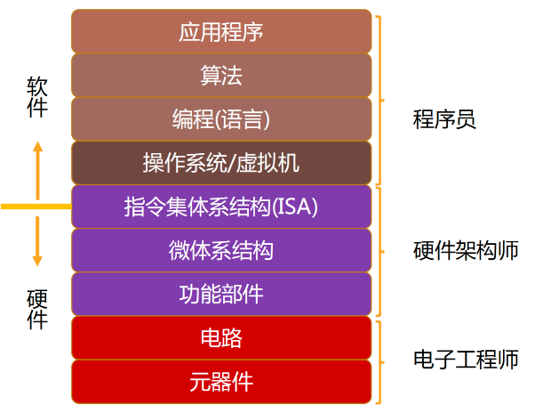
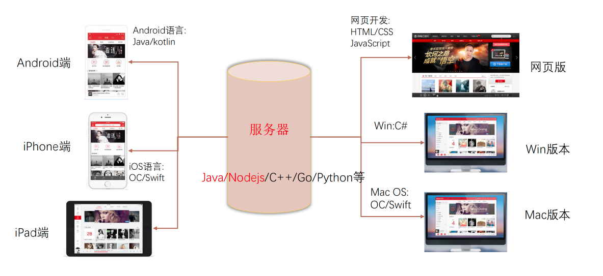
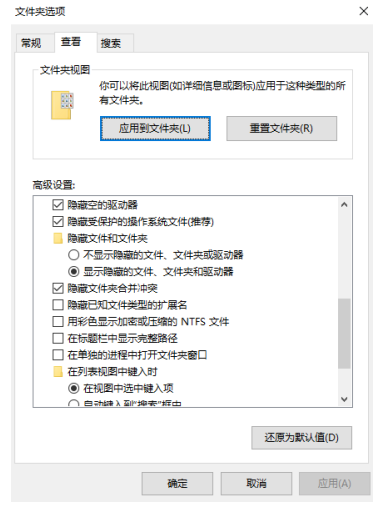
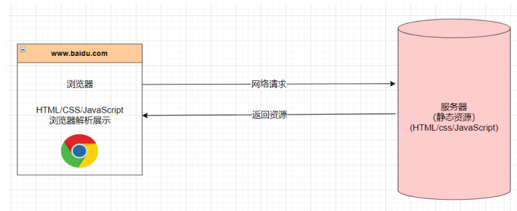
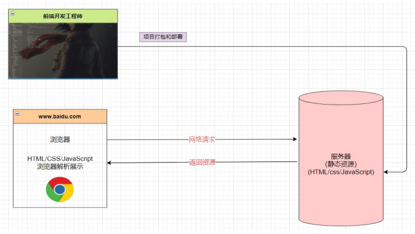
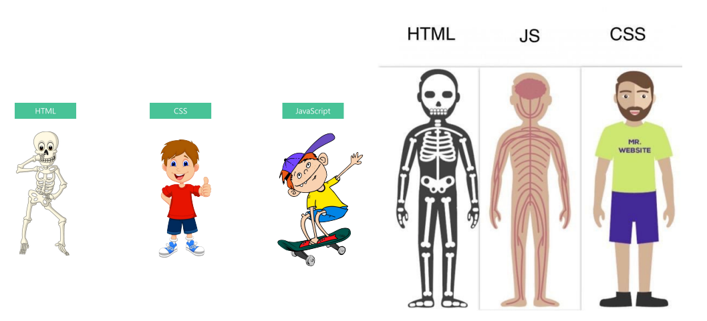

## 1、软件开发和程序员

### 1.1、软件的专业定义

- 专业的软件定义：一系列按照特定顺序组织的计算机数据和指令，是电脑的非有型部分。
- 软件开发是什么呢？就是告诉计算机一系列的指令，这些指令也称之为 程序。

*开发软件的这部分人就称之为 软件开发工程师，也称之为程序员。*

### 1.2、软件开发和应用程序开发区别

### 1.3、完善的软件系统

### 1.4、前端开发工程师

- 开发系统中各个环节的不同部分都属于**软件开发**：
  - 这些开发者我们称之为软件开发工程师； 
  - 开发者、程序员、码农、IT民工等等；
  - coder、programmer、developer；
- 按照**职能的不同**也可以划分两类：
  - 后端（Back-end）开发，称之为后端开发工程师； 
  - 前端（Front-end）开发，称之为前端开发工程师；
- **前端开发工程师：**
  - 主要负责的：Web（网站、后台管理系统、手机H5）、小程序端；
  - 也可以做：移动端（Uniapp、React Native）、桌面端（Electron）、服务器开发（Node.js）

## 2、电脑配置、推荐软件

### 2.1、显示隐藏文件和扩展名

### 2.2、推荐软件

- Chrome浏览器：开发必备浏览器
- VSCode编辑器：开发推荐编辑器（编写代码）
- Xmind Zen思维导图：思维导图笔记
- Typora：markdown笔记软件

## 3、网站、网页

### 3.1、网站和网页的关系

什么是网页

- 网页的专业术语叫做 Web Page； 
- 打开浏览器查看到的页面，是网络中的一“页”； 
- 网页的内容可以非常丰富：包括文字、链接、图片、音乐、视频等等

网站

- 网站是由多个网页组成的；
- 通常一个网站由N个网页组成（N >= 1）

### 3.2、网页的显示过程

用户角度：

- 1.用户在浏览器输入一个网站； 
- 2.浏览器会找到对应的服务器地址，请求静态资源（可以存放在世界上任何一个地方）； 
- 3.服务器返回静态资源给浏览器； 
- 4.浏览器对静态资源进行解析和展示；

开发角度：

- 1.开发项目（HTML/CSS/JavaScript/Vue/React）
- 2.打包、部署项目到服务器里面

### 3.3、服务器是什么

我们日常生活接触到的基本都属于客户端、前端的内容：

- 比如浏览器、微信、QQ、小程序；

我们知道自己的手机并不可能存放哪些多的数据和资源：

- 比如你用《网易云听音乐》，音乐数据大部分都是存在“服务器”中的；

那么服务到底是什么呢？

- 服务器本质上也是一台类似于你电脑一样的主机；

- 但是这个主机有几个特点：

  - 二十四小时不关机的（稳定运行）；

  - 没有显示器的；

  - 一般装的是Linux操作系统（比如centos）； 

那么我以后到公司是不是就看得见服务器了呢？

- 目前公司大部分用的是云服务器（比如阿里云、腾讯云、华为云）；

## 4、网页的组成部分

### 4.1、世界上第一个网页

上世纪90年代，Berners-Lee上线了世界上第一个网站：

- http://info.cern.ch/hypertext/WWW/TheProject.html

### 4.2、网页的组成

- HTML：网页的内容结构
- CSS：网页的视觉体验
- JavaScript：网页的交互处理

## 5、浏览器和浏览器内核

### 5.1、浏览器的作用

我们已经知道了网页的组成部分：HTML + CSS + JavaScript

那么这些看起来枯燥的代码，是如何被渲染成多彩的网页呢？ 是通过浏览器来完成。

**浏览器最核心的部分其实是 “浏览器内核”。**

### 5.2、浏览器的渲染引擎

浏览器最核心的部分是渲染引擎（Rendering Engine），一般也称为“浏览器内核” ：负责解析网页语法，并渲染（显示）网页。

**常见的浏览器内核：**

- Trident （ 三叉戟）：IE、360安全浏览器、搜狗高速浏览器、百度浏览器、UC浏览器；
- Gecko（ 壁虎） ：Mozilla Firefox；
- Presto（急板乐曲）-> Blink （眨眼）：Opera
- Webkit ：Safari、360极速浏览器、搜狗高速浏览器、移动端浏览器（Android、iOS）
- Webkit -> Blink ：Google Chrome

**不同的浏览器内核有不同的解析、渲染规则，所以同一网页在不同内核的浏览器中的渲染效果也可能不同。**

## 6、开发第一个网页

- 新建一个.txt的文件
- 在其中添加一些文字，比如Hello World
- 保存文件
- 修改文件的扩展名为.html文件
- 使用浏览器打开页面

这个网页有什么缺点：

- 只能显示一段普通的文本；
- 浏览器不知道是否要对这段文本加粗、放大、段落之间的间距；
