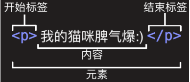
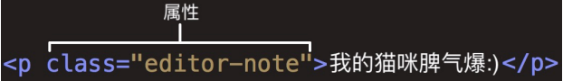
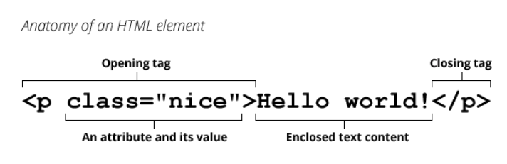
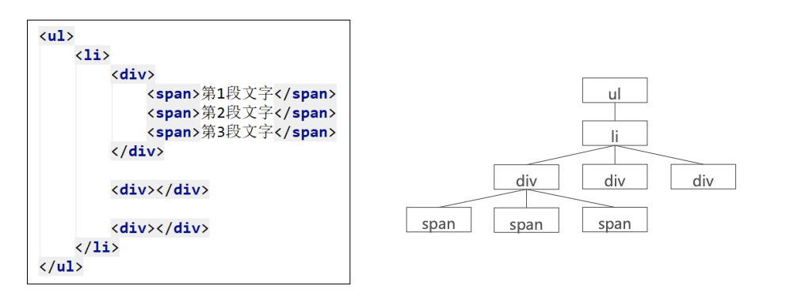

## 1、认识HTML

> **超文本标记语言（HyperText Markup Language，简称：HTML）是一种用于创建网页的标准标记语言。 **

*HTML元素是构建网站的基石；*

**什么是标记语言**（markup language）？

- 由无数个标记（标签、tag)组成；

- 是对某些内容进行特殊的标记，以供其他解释器识别处理； 

- 比如使用<h2></h2>标记的文本会被识别为“标题”进行加粗、文字放大显示；

- 由标签和内容组成的称为元素（element） 

**什么是超文本（ HyperText ）呢？**

- 表示不仅仅可以插入普通的文本（Text），还可以插入图片、音频、视频等内容；

- 还可以表示超链接（HyperLink），从一个网页跳转到另一个网页；

### 1.1、HTML文件特点-扩展名

**HTML文件的拓展名是.htm  .html**

*因历史遗留问题，Win95\Win98系统的文件拓展名不能超过3字符，所以使用.htm，现在统一使用 .html*

### 1.2、HTML文件的特点-结构

```html
<html>
  <head>
    <title>Hello World</title>
  </head>
  <body>
    Hello World
  </body>
</html>
```

## 2、开发工具

记事本可以开发一个网页吗？答案：可以。但是有很多的缺点：

- 创建和管理文件不方便； 
- 没有颜色标识/没有智能提示/无法调试程序； 

专业的前端开发工具 

- WebStorm、Sublime Text、Visual Studio Code、Atom、HBuilder、IntelliJ IDEA、Dreamweaver 
- 智能提示、高亮识别、语法检测、集成环境、开发效率高 

推荐开发工具： 

- Webstorm 
  - 优点：集成开发工具，包罗万象 
  - 缺点：重（占用系统资源多），收费 
- VSCode（上课使用）
  - 优点：轻（相当于一个编辑器），免费 
  - 缺点：需要安装一些插件来辅助开发

## 3、HTML元素

### 3.1、认识元素

*HTML本质上是由一系列的**元素（Element）**构成的；*

 **什么是元素（Element）呢？**

- 元素是网页的一部分；

- 一个元素可以包含一个数据项，或是一块文本，或是一张照片，亦或是什么也不包含； 

**那么HTML有哪些元素呢？** https://developer.mozilla.org/zh-CN/docs/Web/HTML/Element

**我们会发现元素非常非常的多，这么多能记得住吗？**

- 常用的，用的多自然就记住了；

- 不常用的，知道在哪里查找即可；

### 3.2、元素的组成



元素（<p></p>）的主要部分有：

- **开始标签**（Opening tag）：包含元素的名称（本例为 p），被左、右尖括号所包围。表示元素从这里开始或者开始起作用 —— 在本例中即段落由此开始。

- **结束标签**（Closing tag）：与开始标签相似，只是其在元素名之前包含了一个斜杠。这表示着元素的结尾 —— 在本例中即段落在此结束。

- **内容**（Content）：元素的内容，本例中就是所输入的文本本身。

- **元素**（Element）：开始标签、结束标签与内容相结合，便是一个完整的元素。

### 3.3、元素的属性

**元素也可以拥有属性（**Attribute）：



*属性包含元素的额外信息，这些信息不会出现在实际的内容中。*

**一个属性必须包含如下内容：**

- 一个空格，在属性和元素名称之间。(如果已经有一个或多个属性，就与前一个属性之间有一个空格。)

- 属性名称，后面跟着一个等于号。

- 一个属性值，由一对引号“ ”引起来。

### 3.4、属性的分类

- 有些属性是公共的，每一个元素都可以设置，比如class、id、title属性

- 有些属性是元素特有的，不是每一个元素都可以设置，比如meta元素的charset属性、img元素的alt属性等

### 3.5、单标签元素-双标签元素

- 双标签元素：我们会发现前面大部分看到的元素都是双标签的；html、body、head、h2、p、a元素；

- 单标签元素：也有一些元素是只有一个标签；br、img、hr、meta、input； 

**注意事项：**HTML元素不区分大小写，但是推荐小写

### 3.6、元素的结构总结



### 3.7、元素的嵌套关系

**某些元素的内容除了可以是文本之外，还可以去其他元素，这样就形成了元素的嵌套。**



## 4、注释编写

**什么是注释？**

​	简单来说，注释就是一段代码说明，注释是只给开发者看的，浏览器并不会把注释显示给用户看

​	<!-- 注释内容 --> 

**注释的意义:** 

- 帮助我们自己理清代码的思路, 方便以后进行查阅. 

- 与别人合作开发时, 添加注释, 可以减少沟通成本.(同事之间分模块开发) 

- 开发自己的框架时, 加入适当的注释, 方便别人使用和学习.(开源精神) 

- 可以临时注释掉一段代码, 方便调试. 

**注释快捷键：ctrl + /**


