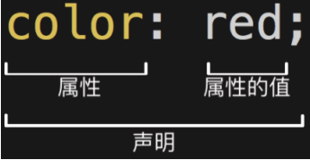
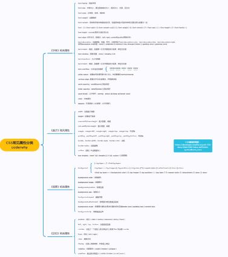
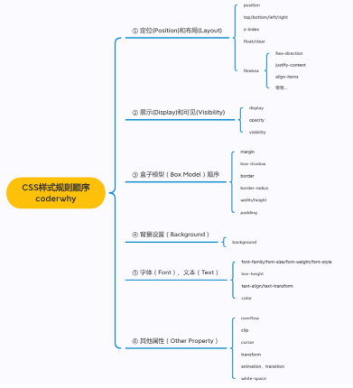
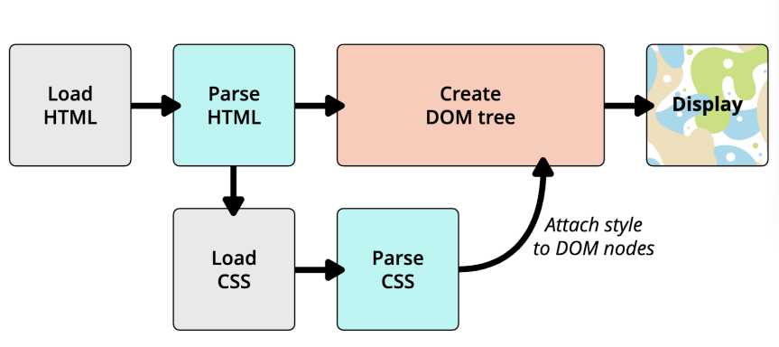
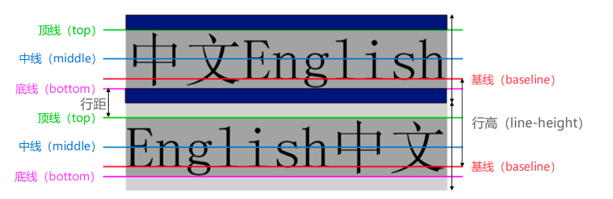
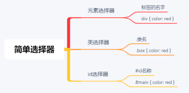

## 1、CSS简介

### 1.1、认识CSS

CSS表示层叠样式表（Cascading Style Sheet，简称：CSS，又称为又称**串样式列表**、**级联样式表**、**串接样式表**、**阶层式样式表**），是为网页添加样式的代码。 

CSS是一种语言吗？

- MDN解释：CSS 也不是真正的编程语言，甚至不是标记语言。它是一门样式表语言；
- 维基百科解释：是一种计算机语言，但是不算是一种编程语言；

### 1.2、CSS的历史

早期的网页都是通过HTML来编写的，但是我们希望HTML页面可以更加丰富: 

- 这个时候就增加了很多具备特殊样式的元素：比如i、strong、del等等；
- 后来也有不同的浏览器实现各自的样式语言，但是没有统一的规划；  1994年，哈肯·维姆·莱和伯特·波斯合作设计CSS，在1996年的时候发布了CSS1；
- 直到1997年初，W3C组织才专门成立了CSS的工作组，1998年5月发布了CSS2； 
- 在2006~2009非常流行 “DIV+CSS”布局的方式来替代所有的html标签；
- 从CSS3开始，所有的CSS分成了不同的模块（modules），每一个“modules”都有于CSS2中额外增加的功能，以及向后兼容。
- 直到2011年6月7日，CSS 3 Color Module终于发布为W3C Recommendation。

总结：CSS的出现是为了美化HTML的，并且让结构（HTML）与样式（CSS）分离； 

- 美化方式一：为HTML添加各种各样的样式，比如颜色、字体、大小、下划线等等；
- 美化方式二：对HTML进行布局，按照某种结构显示（CSS进行布局 – 浮动、flex、grid）；

## 2、编写CSS样式

### 2.1、CSS如何编写

声明（**Declaration**）一个**单独的CSS规则**，如 color: red; 用来指定添加的CSS样式。

- 属性名（Property name）：要添加的css规则的名称；

- 属性值（Property value）：要添加的css规则的值；



### 2.2、将CSS样式应用到元素上

CSS提供了3种方法，可以将CSS样式应用到元素上：

- 内联样式（inline style） 

- 内部样式表（internal style sheet）、文档样式表（document style sheet）、内嵌样式表（embed style sheet） 

- 外部样式表（external style sheet） 

#### 2.2.1、内联样式

内联样式表存在于HTML元素的style属性之中。

```html
<!-- 内联样式(inline) -->
<div style="color: red; font-size: 30px">我是div元素</div>
<h1 style="font-size: 100px">我是标题</h1>
```

CSS样式之间用分号;隔开，建议每条CSS样式后面都加上分号;

很多资料不推荐这种写法：

- 1.在原生的HTML编写过程中确实这种写法是不推荐的
- 2.在Vue的template中某些动态的样式是会使用内联样式的；

所以，内联样式的写法依然需要掌握。

#### 2.2.2、内部样式表

将CSS放在HTML文件`<head>`元素里的`<style>`元素之中

```html
<head>
  <meta charset="UTF-8">
  <meta http-equiv="X-UA-Compatible" content="IE=edge">
  <meta name="viewport" content="width=device-width, initial-scale=1.0">
  <title>Document</title>

  <style>
    /* 内部样式表(internal) */
    .div-one {
      color: red; 
      font-size: 30px; 
      background-color: orange;
    }
  </style>
</head>
```

在Vue的开发过程中，每个组件也会有一个style元素，和内部样式表非常的相似（原理并不相同）；

#### 2.2.3、外部样式表

外部样式表（external style sheet） 是将css编写一个独立的文件中，并且通过<link>元素引入进来；

使用外部样式表主要分成两个步骤：

- 第一步：将css样式在一个独立的css文件中编写（后缀名为.css）；
- 第二步：通过元素引入进来；

```html
<!-- link元素是用来引入资源 -->
<!-- href -> hypertext reference -->
<link rel="stylesheet" href="./css/style.css">
<link rel="stylesheet" href="./css/test.css">
```

### 2.3、@import

可以在style元素或者CSS文件中使用@import导入其他的CSS文件

```javascript
/* 可以通过@import引入其他的css资源 */
@import url(./style.css);
@import url(./test.css);
```

## 3、CSS注释

CSS代码也可以添加注释来方便阅读：

- CSS的注释和HTML的注释是不一样的；
- /* 注释内容 */

```css
<style>
  /* css的注释 */
  .box {
    font-size: 30px; /* 字体大小 */
    color: red; /* 前景色 */
  }
</style>
```

## 4、常见的CSS属性

### 4.1、常见的CSS属性

- font-size：文字大小 
-  width ：宽度
-  height：高度

- background-color决定背景色
- color属性用来设置文本内容的前景色（包括文字、装饰线、边框、外轮廓等的颜色）



### 4.2、必须掌握的CSS属性



### 4.3、CSS属性的官方文档

**CSS官方文档地址** https://www.w3.org/TR/?tag=css

**CSS推荐文档地址：** https://developer.mozilla.org/zh-CN/docs/Web/CSS/Reference#%E5%85%B3%E9%94%AE%E5%AD%97%E7%B4%A2%E5%BC%95

**由于浏览器版本、CSS版本等问题，查询某些CSS是否可用：**可以到https://caniuse.com/查询CSS属性的可用性；


## 5、额外知识补充

### 5.1、link元素

link元素是外部资源链接元素，规范了文档与外部资源的关系。link元素通常是在head元素中

最常用的链接是样式表（CSS）； 此外也可以被用来创建站点图标（比如 “favicon” 图标）；

**link元素常见的属性：**

- href：此属性指定被链接资源的URL。 URL 可以是绝对的，也可以是相对的。

- rel：指定链接类型，常见的链接类型：https://developer.mozilla.org/zh-CN/docs/Web/HTML/Link_types

  - icon：站点图标；

  - stylesheet：CSS样式；

```html
  <!-- 引入css -->
  <link rel="stylesheet" href="./css/style.css">
  <!-- 引入icon(站点的图标) -->
  <link rel="icon" href="../images/favicon.ico">
```

### 5.2、计算机进制

#### 5.2.1、认识进制

**进制的概念：**

- 维基百科：**进位制**是一种记数方式，亦称**进位计数法**或**位值计数法**。 

- 通俗理解：当数字达到某个值时，进一位(比如从1位变成2位)。 

按照进制的概念，来**理解一下十进制**： 

- 当数字到9的时候，用一位已经表示不了了，那么就进一位变成2位。 

按照上面的来理解，**二进制、八进制、十六进制**： 

- 二进制：当数字到1的时候，用一位已经表示不了了，那么就进一位。

- 八进制：当数字到7的时候，用一位已经表示不了了，那么就进一位。

- 十六进制：等等，用一位如何表示十六个数字呢？a(10)、b(11)、c(12) 、 d(13) 、 e(14) 、 f(15)

#### 5.2.2、十进制

学习编程语言，需要了解进制的概念： 

- 我们平时使用的数字都是十进制的，当我写下一个数字的时候，你会默认当做十进制来使用。 
- 从发明数字开始，人类就使用十进制，原因可能是人类正好十根手指。 
- 如果人类有八根手指，现在用的可能是八进制。

#### 5.2.3、计算机中的进制

如何表示二进制、八进制、十六进制? 

- 二进制（0b开头, binary）：其中的数字由0、1组成，可以回顾之前学习过的机器语言。

- 八进制（0o开头, Octonary）：其中的数字由0~7组成。

- 十六进制（0x开头, hexadecimal）：其中的数字由0~9和字母a-f组成（大小写都可以）

**十进制 or 二进制:** 

- 虽然计算机更喜欢二进制, 但是编程中我们还是以十进制为主. 

- 因为高级编程语言的目的就是更加接近自然语言, 让我们人类更容易理解.

#### 5.2.4、进制之间的转换

**十进制转其他进制：**

- 整除, 取余数. 

其他进制转十进制：

- 比如二进制的1001转成十进制: 1 * 2³ + 0 * 2² + 0 * 2 + 1 = 9

- 比如八进制的1234转成十进制: 1 * 8³ + 2 * 8² + 3 * 8 + 4 = 668

- 比如十六进制的522转成十进制: 5 * 16² + 2 * 16 + 2 = 1314

二进制转八进制：

- 三位转成一位八进制

二进制转十六进制：

- 四位转成一位十六进制

### 5.3、CSS表示颜色

**颜色关键字（**color keywords）：

- 是不区分大小写的标识符，它表示一个具体的颜色；

- 可以表示哪些颜色呢？

- https://developer.mozilla.org/zh-CN/docs/Web/CSS/color_value#%E8%AF%AD%E6%B3%95

**RGB颜色：**

- RGB是一种色彩空间，通过R（red，红色）、G（green，绿色）、B（blue，蓝色）三原色来组成了不同的颜色；也就是通过调整这三个颜色不同的比例，可以组合成其他的颜色；

- RGB各个原色的取值范围是 0~255；

#### 5.3.1、RGB的表示方法

*RGB颜色可以通过以#为前缀的十六进制字符和函数（rgb()、rgba()）标记表示。*

- **方式一：十六进制符号：**#RRGGBB[AA]
  - R（红）、G（绿）、B （蓝）和A （alpha）是十六进制字符（0–9、A–F）；A是可选的。比如，#ff0000等价于#ff0000ff； 

- **方式二：十六进制符号：**#RGB[A]

  - R（红）、G（绿）、B （蓝）和A （alpha）是十六进制字符（0–9、A–F）；

  - 三位数符号（#RGB）是六位数形式（#RRGGBB）的减缩版。比如，#f09和#ff0099表示同一颜色。

  - 四位数符号（#RGBA）是八位数形式（#RRGGBBAA）的减缩版。比如，#0f38和#00ff3388表示相同颜色。

- **方式三：函数符：** rgb[a](R, G, B[, A])
  - R（红）、G（绿）、B （蓝）可以是<number>（数字），或者<percentage>（百分比），255相当于100%。 

  - A（alpha）可以是0到1之间的数字，或者百分比，数字1相当于100%（完全不透明）。


```css
      /* 值: 单词 red/white/black......... */
      .box {
        color: red;
        background-color: black;

        /* 黑色是最纯洁的颜色 */
        background-color: rgb(100, 100, 100);
        background-color: #646464;

        /* 表示一个纯黑色 */
        background-color: rgb(0, 0, 0);
        background-color: #000000;
        background-color: #000;

        /* 表示一个纯白色 */
        background-color: rgb(255, 255, 255);
        background-color: #ffffff;

        background-color: #e1251b;
      }
```

### 5.4、Chrome调试工具

打开Chrome调试工具： 

- 方式一：右键 – 检查 
- 方式二：快捷键 – F12

其他技巧： 

- 快捷键：ctrl+ 可以调整页面或者调试工具的字体大小； 
- 可以通过删除某些元素来查看网页结构; 
- 可以通过增删css来调试网页样式;

### 5.5、浏览器渲染过程




## 6、CSS属性-文本

### 6.1、text-decoration

**text-decoration用于设置文字的装饰线**

- decoration是装饰/装饰品的意思 

text-decoration有如下常见取值: 

- none：无任何装饰线，可以去除a元素默认的下划线

- underline：下划线

- overline：上划线

- line-through：中划线（删除线）

**a元素有下划线的本质是被添加了text-decoration属性**

### 6.2、text-transform

**text-transform用于设置文字的大小写转换**：Transform单词是使变形/变换(形变);

text-transform有几个常见的值: 

- capitalize：(使…首字母大写, 资本化的意思)将每个单词的首字符变为大写

- uppercase：(大写字母)将每个单词的所有字符变为大写

- lowercase：(小写字母)将每个单词的所有字符变为小写

- none：没有任何影响

*实际开发中用JavaScript代码转化的更多.*

### 6.3、text-indent

**text-indent用于设置第一行内容的缩进**

text-indent: 2em; 刚好是缩进2个文字

### 6.4、text-align

**text-align: 直接翻译过来设置文本的对齐方式;** 

**MDN:** **定义行内内容（例如文字）如何相对它的块父元素对齐**;

**常用的值**

- left：左对齐

- right：右对齐

- center：正中间显示

- justify：两端对齐

### 6.5、word-spacing/letter-spacing

**letter-spacing、word-spacing分别用于设置字母、单词之间的间距**

- 默认是0，可以设置为负数

## 7、CSS属性-字体

### 7.1、font-size

**font-size决定文字的大小**

常用的设置

- 具体数值+单位

  - 比如100px

  - 也可以使用em单位(不推荐)：1em代表100%，2em代表200%，0.5em代表50%

- 百分比
  - 基于父元素的font-size计算，比如50%表示等于父元素font-size的一半

### 7.2、font-family

font-family用于设置**文字的字体名称**

- 可以设置1个或者多个字体名称; 

- 浏览器会选择列表中第一个该计算机上有安装的字体; 

- 或者是通过 @font-face 指定的可以直接下载的字体。

```css
  font-family: "Microsoft YaHei", "Heiti SC", tahoma, arial, "Hiragino Sans GB", "\5B8B\4F53", sans-serif;
```

### 7.3、font-weight

**font-weight用于设置文字的粗细（重量）**

**常见的取值:** 

- 100 | 200 | 300 | 400 | 500 | 600 | 700 | 800 | 900 ：每一个数字表示一个重量

- normal：等于400 

- bold：等于700

**strong、b、h1~h6等标签的font-weight默认就是bold**

### 7.4、font-style

**font-style用于设置文字的常规、斜体显示**

- normal：常规显示

- italic(斜体)：用字体的斜体显示(通常会有专门的字体) 

- oblique(倾斜)：文本倾斜显示(仅仅是让文字倾斜) 

**em、i、cite、address、var、dfn等元素的font-style默认就是italic**

### 7.5、font-variant

**font-variant可以影响小写字母的显示形式**

- variant是变形的意思; 

**可以设置的值如下**

- normal：常规显示

- small-caps：将小写字母替换为缩小过的大写字母

### 7.6、line-height

**line-height用于设置文本的行高**

行高可以先简单理解为一行文字所占据的高度

行高的严格定义是：**两行文字基线（baseline）之间的间距**

基线（baseline）：**与小写字母x最底部对齐的线**



**注意区分height和line-height的区别**

- height：元素的整体高度

- line-height：元素中每一行文字所占据的高度

应用实例：假设div中只有一行文字，如何让这行文字在div内部垂直居中：让line-height等同于height

### 7.7、font缩写属性

**font是一个缩写属性**

- font 属性可以用来作为 font-style, font-variant, font-weight, font-size, line-height 和 font-family 属性的简写; 

- font-style font-variant font-weight font-size/line-height font-family

**规则：**

- font-style、font-variant、font-weight可以随意调换顺序，也可以省略

- /line-height可以省略，如果不省略，必须跟在font-size后面

- font-size、font-family不可以调换顺序，不可以省略


## 8、CSS选择器

### 8.1、认识CSS选择器

**什么是CSS选择器**

​		按照一定的规则选出符合条件的元素，为之添加CSS样式

**选择器的种类繁多，大概可以这么归类**

- 通用选择器（universal selector） 

- 元素选择器（type selectors） 

- 类选择器（class selectors） 

- id选择器（id selectors） 

- 属性选择器（attribute selectors） 

- 组合（combinators） 

- 伪类（pseudo-classes） 

- 伪元素（pseudo-elements）

### 8.2、通用选择器

**通用选择器（universal selector）** 

​		所有的元素都会被选中; 

**一般用来给所有元素作一些通用性的设置**

- 比如内边距、外边距; 

- 比如重置一些内容; 

**效率比较低，尽量不要使用;**

```css
   * {
      font-size: 30px;
      background-color: #f00;
    }
    /* 更推荐的做法 */
    body, p, div, h2, span {
      margin: 0;
      padding: 0;
    }
```

### 8.3、简单选择器

**简单选择器是开发中用的最多的选择器:** 

- 元素选择器（type selectors）, 使用元素的名称; 

- 类选择器（class selectors）, 使用 .类名 ; 

- id选择器（id selectors）, 使用 #id;



**id注意事项：**一个HTML文档里面的id值**是唯一的，不能重复**

- id值如果由多个单词组成，单词之间可以用中划线-、下划线_连接，也可以使用驼峰标识

- 最好不要用标签名作为id值 

*中划线又叫连字符（hyphen）*

```css
    <style>
      div {
        color: red;
      }

      .box {
        color: blue;
      }

      #home {
        color: green;
      }
    </style>
```

```html
  <body>
    <!-- 强调: 在同一个HTML文档中, id不要重复, 应该是唯一 -->
    <div>我是div1</div>
    <div class="box">我是div2</div>
    <div id="home">我是div3</div>
    <p class="box">我是p元素</p>
    <h2 id="div">我是h2标题</h2>

    <!-- class/id的名称比较复杂 -->
    <div class="box one"></div>
    <div class="box-one box-first"></div>
    <div class="box_one box_first"></div>
    <!-- 大驼峰/小驼峰 -->
    <!-- <div class="boxOne BoxFirst"></div> -->
  </body>
```

### 8.4、属性选择器

- **拥有某一个属性** ：**[att]** 

- **属性等于某个值** ：**[att=val]** 

其他了解的：

- [attr*=val]: 属性值包含某一个值val;

- [attr^=val]: 属性值以val开头;

- [attr$=val]: 属性值以val结尾;

- [ attr|=val]: 属性值等于val或者以val开头后面紧跟连接符-;

- [attr~=val]: 属性值包含val, 如果有其他值必须以空格和val分割;

### 8.5、后代选择器

- 后代选择器一: 所有的后代(直接/间接的后代) ，选择器之间以空格分割
- 后代选择器二: 直接子代选择器(必须是直接自带) ，选择器之间以 > 分割;

```css
     /* 后代选择器 */
      .home span {
        color: red;
        font-size: 30px;
      }

      /* .home的子代的span元素设置一个背景 */
      .home > span {
        background-color: green;
      }
```

```html
  <body>
    <div class="home">
      <span>啦啦啦啦</span>
      <div class="box">
        <p>我是p元素</p>
        <span class="home-item">呵呵呵呵</span>
      </div>

      <div class="content">
        <div class="desc">
          <p>
            <span class="home-item">哈哈哈哈</span>
          </p>
        </div>
      </div>
    </div>

    <!-- 不希望被选中 -->
    <span>嘻嘻嘻</span>
    <div>
      <span>嘿嘿嘿</span>
    </div>
  </body>
```

### 8.6、兄弟选择器

- 兄弟选择器一：相邻兄弟选择器，使用符号 + 连接
- 兄弟选择器二：普遍兄弟选择器，使用符号 ~ 连接

```css
      .box + .content {
        color: red;
      }

      .box ~ div {
        font-size: 30px;
      }
```

```html
  <body>
    <div class="home">
      <div>叽叽叽叽</div>
      <div class="box">呵呵呵呵</div>
      <div class="content">哈哈哈哈</div>
      <div>嘻嘻嘻嘻</div>
      <div>嘿嘿嘿嘿</div>
      <p>我是p元素</p>
    </div>
  </body>
```

### 8.7、选择器组

- 交集选择器: 需同时符合两个选择器条件(两个选择器紧密连接) ，在开发中通常为了精准的选择某一个元素
- 并集选择器: 符合一个选择器条件即可(两个选择器以,号分割) ，在开发中通常为了给多个元素设置相同的样式;

```css
			div.box {
        color: red;
        font-size: 30px;
      }

      body,
      p,
      h1,
      h2 {
        color: red;
        font-size: 40px;
      }
```

```html
  <body>
    <div class="box">我是div元素</div>
    <p class="box">我是p元素</p>
  </body>
```

### 8.9、伪类选择器

#### 8.9.1、认识伪类

**什么是伪类（Pseudo-classes）：伪类是选择器的一种，它用于选择处于特定状态的元素;**

**常见的伪类：**

- 1.动态伪类（dynamic pseudo-classes）:link、:visited、:hover、:active、:focus
- 2.目标伪类（target pseudo-classes） :target 
- 3.语言伪类（language pseudo-classes）:lang( ) 
- 4.元素状态伪类（UI element states pseudo-classes）:enabled、:disabled、:checked
-  5.结构伪类（structural pseudo-classes）:nth-child( )、:nth-last-child( )、:nth-of-type( )、:nth-lastof-type( )  :first-child、:last-child、:first-of-type、:last-of-type :root、:only-child、:only-of-type、:empty
- 6.否定伪类（negation pseudo-classes）:not()

#### 8.9.2、动态伪类

使用举例

- a:link 未访问的链接
- a:visited 已访问的链接
- a:hover 鼠标挪动到链接上(重要)
- a:active 激活的链接（鼠标在链接上长按住未松开）

使用注意

- :hover必须放在:link和:visited后面才能完全生效 
- :active必须放在:hover后面才能完全生效
- 所以建议的编写顺序是 :link、:visited、:hover、:active

**除了a元素，:hover、:active也能用在其他元素上**

#### 8.9.3、动态伪类 :focus

- **:focus指当前拥有输入焦点的元素（能接收键盘输入），文本输入框一聚焦后，背景就会变红色**

- *因为链接a元素可以被键盘的Tab键选中聚焦，所以:focus也适用于a元素*

- **动态伪类编写顺序建议为 :link、:visited、:focus、:hover、:active**

- 直接给a元素设置样式，相当于给a元素的所有动态伪类都设置了
  - 相当于a:link、a:visited、a:hover、a:active、a:focus的color都是red

```css
      /* a元素的链接从来没有被访问过 */
      a:link {
        color: red;
      }

      /* a元素被访问过了颜色 */
      a:visited {
        color: green;
      }

      /* a/input元素聚焦(获取焦点) */
      a:focus {
        color: yellow;
      }

      /* a元素鼠标放到上面 */
      a:hover {
        color: blue;
      }

      /* 点下去了, 但是还没有松手 */
      a:active {
        color: purple;
      }

      /* 所有的状态下同样的样式 */
      a {
        color: orange;
      }
```

### 8.10、伪元素

常用的伪元素有 

- :first-line、::first-line
- :first-letter、::first-letter
- :before、::before
- :after、::after 

为了区分伪元素和伪类，建议伪元素使用2个冒号，比如::first-line

#### 8.10.1、伪元素 - ::first-line - ::first-letter

- ::first-line可以针对首行文本设置属性

- ::first-letter可以针对首字母设置属性

```css
      .box {
        width: 800px;
        background-color: #f00;
        color: #fff;
      }

      .keyword {
        font-size: 30px;
        color: orange;
      }

      .box::first-line {
        font-size: 30px;
        color: orange;
      }

      .box::first-letter {
        font-size: 50px;
        color: blue;
      }
```

```html
  <body>
    <div class="box">
      <span class="keyword">雁门关，别名西陉关 ，坐落于我国山西省忻</span
      >州市代县以北约成员国20千米的雁门山。它是长城上的一个关键大关，与宁武关、偏关并称之为“外三关”。坐落于偏关县大河上，辖四侧墙，总长度数百公里。迄今仍有30千米储存完好无损，所有用砖遮盖，沿堤岸耸立，十分壮阔。“边关丁宁岩，山连紫塞，地控大河北，鑫城携手共进强。”这也是前人对偏关的赞扬。早在春秋战国时代，这儿便是赵武灵王攻克胡林的竞技场。唐朝名将在关东建有九龙庙，宋代建有魏镇、杨三关。现有的关城始建明洪武二十三年，是重点学科文物古迹。
    </div>
  </body>
```

#### 8.10.2、伪元素 - ::before和::after

**::before和::after用来在一个元素的内容之前或之后插入其他内容（可以是文字、图片) ，常通过 content 属性来为一个元素添加修饰性的内容。**

```css
      .before {
        color: red;
      }

      .after {
        color: blue;
      }

      /* 伪元素 */
      .item::before {
        content: "321";
        color: orange;
        font-size: 20px;
      }

      .item::after {
        /* content: "cba"; */
        content: url("../images/hot_icon.svg");
        color: green;
        font-size: 20px;

        /* 位置不是很好看 */
        position: relative; /* 相对定位 */
        left: 5px;
        top: 2px;
      }

      /* 额外的补充 */
      /* ::after是一个行内级元素 */
      .box5::after {
        /* 使用伪元素的过程中, 不要将content省略 */
        content: "";
        display: inline-block;
        width: 8px;
        height: 8px;
        background-color: #f00;
      }
```

```html
  <body>
    <div class="box">
      <span class="before">123</span>
      我是div元素
      <span class="after">abc</span>
    </div>

    <div class="box2">
      <span class="before">123</span>
      我是box2
      <span class="after">abc</span>
    </div>

    <!-- 伪元素方案 -->
    <div class="box3 item">我是box3</div>
    <div class="box4 item">我是box4</div>

    <!-- 伪元素的补充 -->
    <div class="box5">我是box5</div>
  </body>
```


