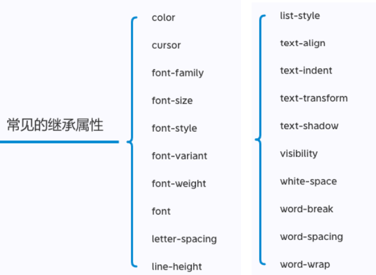
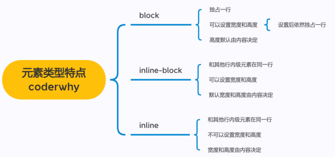

## 1、CSS属性的继承

CSS的某些属性具有继承性(Inherited): 

- 如果一个属性具备继承性, 那么在该元素上设置后, 它的后代元素都可以继承这个属性; 
- 当然, 如果后代元素自己有设置该属性, 那么优先使用后代元素自己的属性(不管继承过来的属性权重多高);

注意(了解): 继承过来的是计算值, 而不是设置值

常见的继承属性：



```css
    /* 默认继承 */
		div.box {
      color: red;
    }

    /* 继承计算值 */
    .box {
      color: red;
      /* 相对于自身字体(父元素的字体) */
      /* 浏览器 16px */
      font-size: 2em; /* 32px */
    }

		/* 强制继承 */
    .box p {
      /* 很少用 */
      border: inherit;
    }
```

```html
  <body>
    <div class="box">
      <h1>我是h1元素</h1>
      <p>
        我是p元素
        <span>哈哈哈</span>
        <strong>呵呵呵</strong>
      </p>
      <span>我是span元素</span>
    </div>
  </body>
```

## 2、CSS属性的层叠

CSS的翻译是层叠样式表, 什么是层叠呢? 

- 对于一个元素来说, 相同一个属性我们可以通过不同的选择器给它进行多次设置; 
- 那么属性会被一层层覆盖上去; 
- 但是最终只有一个会生效; 

那么多个样式属性覆盖上去, 哪一个会生效呢? 

- 判断一: 选择器的权重, 权重大的生效, 根据权重可以判断出优先级; 
- 判断二: 先后顺序, 权重相同时, 后面设置的生效;

### 2.1、选择器的权重

按照经验，为了方便比较CSS属性的优先级，可以给CSS属性所处的环境定义一个权值（权重） 

- !important：10000 
- 内联样式：1000
- id选择器：100 
- 类选择器、属性选择器、伪类：10
- 元素选择器、伪元素：1
- 通配符：0

```css
      div.box {
        color: red !important; /* 10000 */
      }

      /* id选择器: 100 */
      #main {
        color: orange;
      }

      /* 类选择器: 10 */
      .box {
        color: blue;
      }

      /* 元素选择器: 1 */
      div {
        color: purple;
      }

      /* 通配选择器: 0 */
      * {
        color: yellow;
      }
```

```html
  <body>
    <!-- 内联样式: 1000 -->
    <div id="main" class="box one two" style="color: blue">我是div元素</div>
  </body>
```


## 3、CSS属性的类型

### 3.1、HTML元素的类型

div是块级元素会独占一行, span是行内级元素会在同一行显示. 

HTML定义元素类型的思路: 

- HTML元素有很多, 比如h元素/p元素/div元素/span元素/img元素/a元素等等; 
- 当我们把这个元素放到页面上时, 这个元素到底占据页面中一行多大的空间呢? 
  - 为什么我们这里只说一行呢? 因为垂直方向的高度通常是内容决定的; 
- 比如一个h1元素的标题, 我们必然是希望它独占一行的, 其他的内容不应该和我的标题放在一起; 
- 比如一个p元素的段落, 必然也应该独占一行, 其他的内容不应该和我的段落放在一起; 
- 而类似于img/span/a元素, 通常是对内容的某一个细节的特殊描述, 没有必要独占一行; 

为了区分哪些元素需要独占一行, 哪些元素不需要独占一行, HTML将元素区分(本质是通过CSS的)成了两类: 

- **块级元素（block-level elements）: 独占父元素的一行 **
- **行内级元素（inline-level elements）:多个行内级元素可以在父元素的同一行中显示**

### 3.2、修改元素类型

事实上元素没有本质的区别: 

- div是块级元素, span是行内级元素; 
- div之所以是块级元素仅仅是因为浏览器默认设置了display属性而已;

## 4、display属性

CSS中有个display属性，能修改元素的显示类型，有4个常用值 

- block：让元素显示为块级元素
- inline：让元素显示为行内级元素 
- inline-block：让元素同时具备行内级、块级元素的特征
- none：隐藏元素

### 4.1、display值的特性



```css
      /* 宽高不满意: 自己来设置 */
      div {
        background-color: #f00;
        width: 200px;
        height: 200px;
      }

      span {
        background-color: #0f0;
        width: 200px;
        height: 200px;
      }

      img {
        height: 200px;
        height: 150px;
      }

      input {
        height: 60px;
      }
```

```html
  <body>
    <div>我是div元素</div>

    <!-- 行内级元素设置宽度和高度不生效??? 行内非替换元素不可以设置宽高 -->
    <span>我是span元素</span>

    <!-- 补充:  -->
    <!-- img元素: inline - replaced -> 行内替换元素 -->
    <!-- 行内替换元素: 
        1> 和其他的行内级元素在同一行显示
        2> 可以设置宽度和高度 
    -->
    
    <input type="text" />
  </body>
```

### 4.2、编写HTML时的注意事项

- 块级元素、inline-block元素 
  - 一般情况下，可以包含其他任何元素（比如块级元素、行内级元素、inline-block元素） 
  - 特殊情况，p元素不能包含其他块级元素
- 行内级元素（比如a、span、strong等）
  - 一般情况下，只能包含行内级元素

## 5、元素的隐藏

- 方法一: display设置为none
  - 元素不显示出来, 并且也不占据位置, 不占据任何空间(和不存在一样); 
- 方法二: visibility设置为hidden 
  - 设置为hidden, 虽然元素不可见, 但是会占据元素应该占据的空间;
  - 默认为visible, 元素是可见的;
- 方法三: rgba设置颜色, 将a的值设置为0
  - rgba的a设置的是alpha值, 可以设置透明度, 不影响子元素;
- 方法四: opacity设置透明度, 设置为0
  - 设置整个元素的透明度, 会影响所有的子元素;

```css
      .box {
        display: none;
      }

      .content {
        visibility: hidden;
      }

      /* alpha: 只是设置当前color/bgc其中的颜色透明度为某一个值, 不会影响子元素 */
      .box1 {
        /* 不是很推荐 */
        /* color module */
        color: #ff000088;
        /* webpack -> postcss -> browserslist -> rgba() */
        /* 推荐下面的写法 a -> alpha 0~1 */
        color: rgba(255, 0, 0, 0.5);

        /* 通过颜色来隐藏 */
        color: rgba(0, 0, 0, 0);

        /* 通过背景颜色透明度来隐藏 */
        background-color: rgba(0, 0, 0, 0);
        background-color: transparent; /* rgba(0,0,0,0) */
      }

      /* opacity: 设置透明度, 并且会携带所有的子元素都有一定的透明度 */
      .box2 {
        opacity: 0.5;
      }
```

## 6、overflow属性

overflow用于控制内容溢出时的行为 

- visible：溢出的内容照样可见
- hidden：溢出的内容直接裁剪
- scroll：溢出的内容被裁剪，但可以通过滚动机制查看
  - 会一直显示滚动条区域，滚动条区域占用的空间属于width、height
- auto：自动根据内容是否溢出来决定是否提供滚动机制

## 7、CSS样式不生效技巧

为何有时候编写的CSS属性不好使，有可能是因为

- 选择器的优先级太低
- 选择器没选中对应的元素
- CSS属性的使用形式不对
  - 元素不支持此CSS属性，比如span默认是不支持width和height的
  - 浏览器不支持此CSS属性，比如旧版本的浏览器不支持一些css module3的某些属性
  - 被同类型的CSS属性覆盖，比如font覆盖font-size 

建议：充分利用浏览器的开发者工具进行调试（增加、修改样式）、查错


