## 1、列表元素

### 1.1、认识列表元素

在开发一个网页的过程中, 很多数据都是以列表的形式存在的

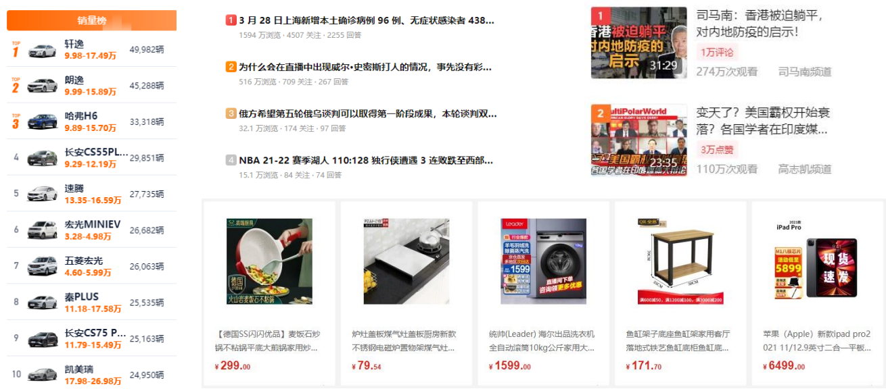

### 1.2、列表的实现方式

事实上现在很多的列表功能采用了不同的方案来实现:

- 方案一: 使用div元素来实现(比如汽车之家, 知乎上的很多列表)
- 方案二: 使用列表元素, 使用元素语义化的方式实现;

事实上现在很多的网站对于列表元素没有很强烈的偏好, 更加不拘一格, 按照自己的风格来布局:

- 原因是列表元素默认的CSS样式, 让它用起来不是非常方便;
- 比如列表元素往往有很多的限制, ul/ol中只能存放li, li再存放其他元素, 默认样式等;
- 虽然我们可以通过重置来解决, 但是我们更喜欢自由的div;

 HTML提供了3组常用的用来展示列表的元素

- 有序列表：ol、li
- 无序列表：ul、li
- 定义列表：dl、dt、dd

## 2、常见列表

### 2.1、有序列表 – ol – li 

- ol（ordered list）
  - 有序列表，直接子元素只能是li
- li（list item）
  - 列表中的每一项

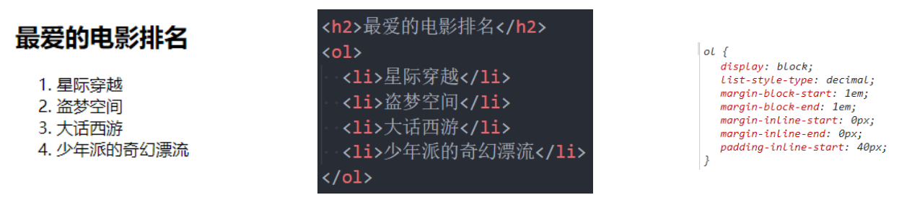

### 2.2、无序列表 – ul - li

ul（unordered list）

- 无序列表，直接子元素只能是li

 li（list item）

- 列表中的每一项

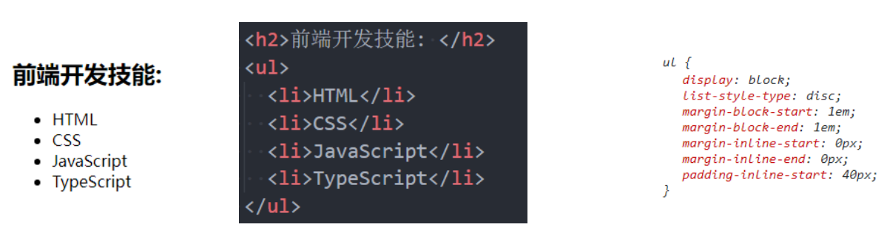

### 2.3、定义列表 – dl – dt - dd

dl（definition list）

- 定义列表，直接子元素只能是dt、dd

dt（definition term）

- term是项的意思, 列表中每一项的项目名

 dd（definition description）

- 列表中每一项的具体描述，是对 dt 的描述、解释、补充
- 一个dt后面一般紧跟着1个或者多个dd

## 3、表格元素

### 3.1、认识表格元素

在网页中, 对于某些内容的展示使用表格元素更为合适和方便

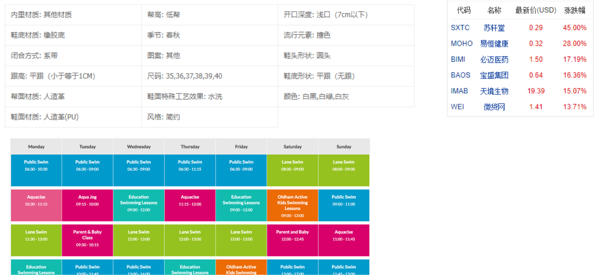

### 3.2、表格常见的元素

编写表格最常见的是下面的元素:

- table
  - 表格
- tr(table row)
  - 表格中的行
- td(table data)
  - 行中的单元格
- 另外表格有很多相关的属性可以设置表格的样式, 但是已经不推荐使用了

### 3.3、表格的练习

通过表格元素和CSS完成下面的表格: 

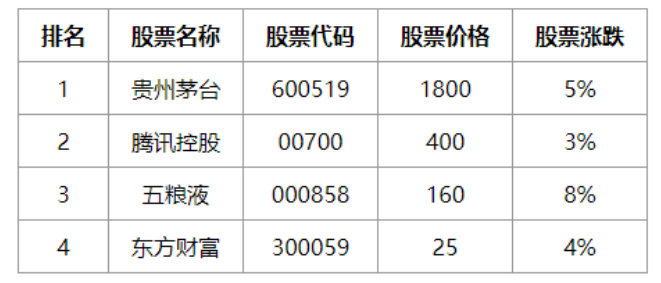

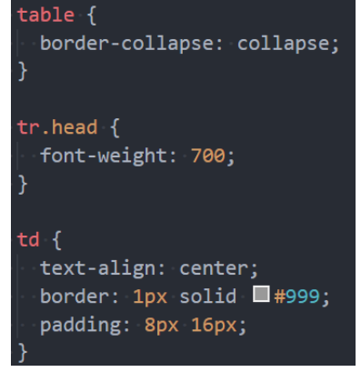

这里我们需要用到一个非常重要的属性: 

- border-collapse CSS 属性是用来决定表格的边框是分开的还是合并的。
- table { border-collapse: collapse; }
- 合并单元格的边框

### 3.5、表格的其他元素

-  thead
  - 表格的表头
- tbody
  - 表格的主体
- tfoot
  - 表格的页脚
- caption
  - 表格的标题
- th
- 表格的表头单元格

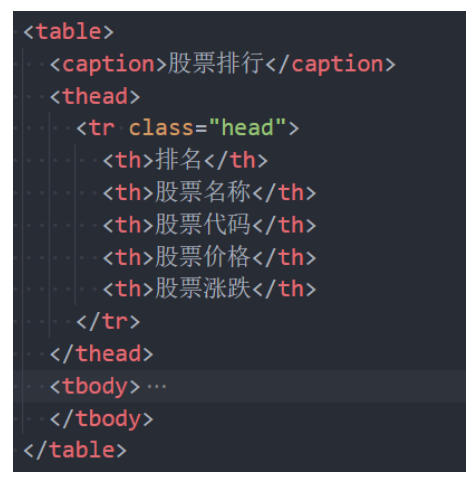

## 4、表格合并

### 4.1、单元格合并

在某些特殊的情况下, 每个单元格占据的大小可能并不是固定的

- 一个单元格可能会跨多行或者多列来使用;

 比如下面的表格

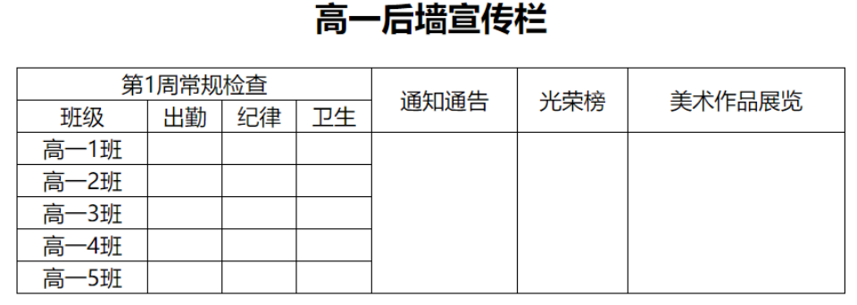

这个时候我们就要使用单元格合并来完成;

### 4.2、如何使用单元格合并呢?

单元格合并分成两种情况:

- 跨列合并: 使用colspan
  - 在最左边的单元格写上colspan属性, 并且省略掉合并的td;
- 跨行合并: 使用rowspan
  - 在最上面的单元格协商rowspan属性, 并且省略掉后面tr中的td;

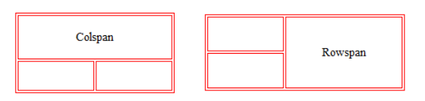

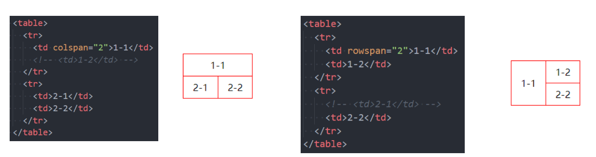

## 5、表单元素

### 5.1、认识表单

HTML表单元素是和用户交互的重要方式之一, 在很多网站都需要使用表单:

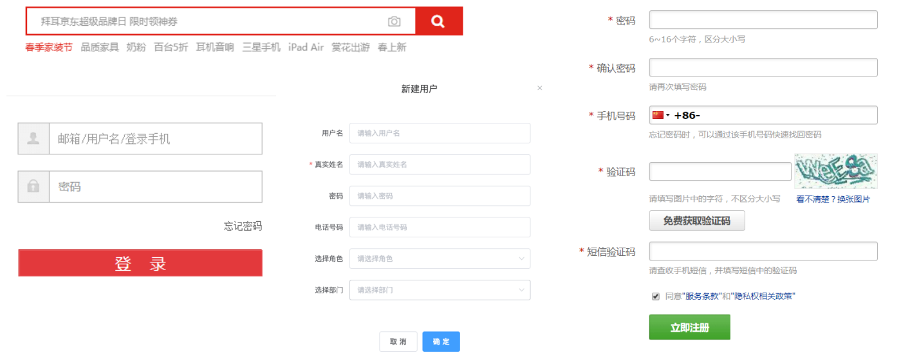

### 5.2、常见的表单元素

- form
  - 表单, 一般情况下，其他表单相关元素都是它的后代元素
- input
  - 单行文本输入框、单选框、复选框、按钮等元素
- textarea
  - 多行文本框
- select、option 
  - 下拉选择框
- button 
  - 按钮
- label
  - 表单元素的标题

## 6、表单常见属性

### 6.1、input元素的使用

