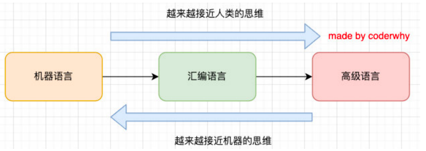
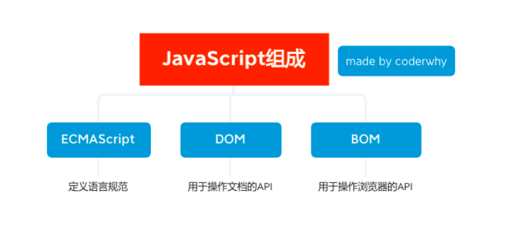
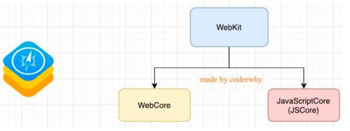
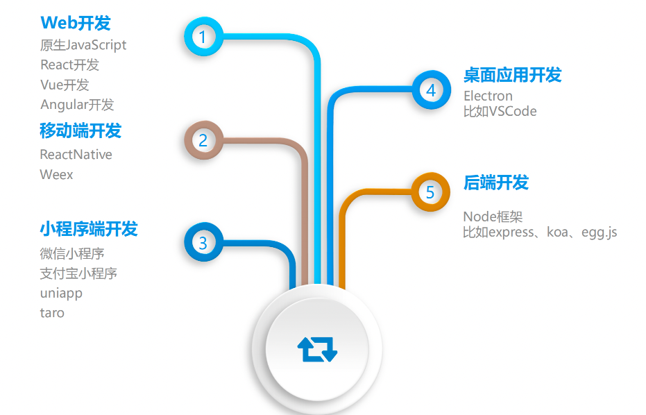

## 1、认识编程语言

### 1.1、计算机语言

在之前我们提到过, HTML是一种标记语言, CSS也是一种样式语言; 

 **他们本身都是属于计算机语言, 因为都在和计算机沟通交流；**计算机语言就是我们人和计算机进行交流要学习的语言; 

### 1.2、编程语言

**计算机语言和编程语言的关系和区别:** 

- 计算机语言：**计算机语言**（computer language）指用于人与计算机之间通讯的语言，是人与计算机之间传递信息的介质。但是其概念比通用的编程语言要更广泛。例如，HTML是标记语言，也是计算机语言，但并不是编程语言。

-  编程语言：**编程语言**（英语：programming language），是用来定义计算机程序的形式语言。它是一种被标准化的交流技巧，

  用来向计算机发出指令，一种能够让程序员准确地定义计算机所需要使用数据的计算机语言，并精确地定义在不同情况下所

  应当采取的行动。 

**编程语言的特点：**

- 数据和数据结构
- 指令及流程控制
- 引用机制和重用机制
- 设计哲学

## 2、编程语言发展历史

### 2.1、机器语言

**阶段一**:**机器语言**

- 计算机的存储单元只有0和1两种状态，因此一串代码要让计算机“读懂”，这串代码只能由数字0和1组成。
- 像这种由数字0和1按照一定的规律组成的代码就叫机器码，也叫二进制编码。 
- 一定长度的机器码组成了机器指令，用这些机器指令所编写的程序就称为机器语言。 

**优点:** 

- 代码能被计算机直接识别，不需要经过编译解析； 
- 直接对硬件产生作用，程序的执行效率非常高； 

**缺点:** 

- 程序全是些0和1的指令代码，可读性差，还容易出错；

- 不易编写(目前没有人这样开发)；

### 2.2、汇编语言

**阶段二**: **汇编语言**

- 为了解决机器语言的缺陷，人们发明了另外一种语言——汇编语言。 
- 这种语言用符号来代替冗长的、难以记忆的0、1代码。(mov/push指令，经过汇编器，汇编代码再进一步转成0101)

**优点**:

- 像机器语言一样，可以直接访问、控制计算机的各种硬件设备； 

- 占用内存少，执行速度快；

**缺点**:

- 第一，不同的机器有不同的汇编语言语法和编译器，代码缺乏可移植性也就是说，一个程序只能在一种机器上运行，换到其他机器上可能就不能运行；

- 第二，符号非常多、难记。即使是完成简单的功能也需要大量的汇编语言代码，很容易产生BUG，难于调试；

**应用场景**

- 操作系统内核、驱动程序、单片机程序；

### 2.3、高级语言

**阶段三**: **高级语言**

- 最好的编程语言应该是什么? 自然语言； 
- 而高级语言, 就是接近自然语言, 更符合人类的思维方式
- 跟和人交流的方式很相似, 但是大多数编程语言都是国外发明的, 因为都是接近于英文的交流方式

**优点**:

- 简单、易用、易于理解，语法和结构类似于普通英文；
- 远离对硬件的直接操作，使得一般人经过学习之后都可以编程，而不用熟悉硬件知识；
- 一个程序还可以在不同的机器上运行，具有可移植性；

**缺点**: 

- 程序不能直接被计算机识别，需要经编译器翻译成二进制指令后，才能运行到计算机上；

- 种类繁多：JavaScript 、 C语言、C++、C#、Java、Objective-C 、Python等；

### 2.4、机器语言和汇编语言

## 3、JavaScript的历史

### 3.1、认识JavaScript

JavaScript（通常缩写为JS）是一种高级的、解释型的编程语言；

**JavaScript是一门基于原型、头等函数的语言，是一门多范式的语言，它支持面向对象程序设计，指令式编程，以及函数式编程**

### 3.2、JavaScript起源

## 4、JavaScript的分类

**ECMAScript是JavaScript的标准，描述了该语言的语法和基本对象。**

- JavaScript是ECMAScript的语言层面的实现; 
- 除了语言规范之外，JavaScript还需要对页面和浏览器进行各种操作，还包括DOM操作和BOM操作;

## 5、JavaScript运行引擎

**我们经常会说：不同的浏览器有不同的内核组成**

- Gecko：早期被Netscape和Mozilla Firefox浏览器浏览器使用；
- Trident：微软开发，被IE4~IE11浏览器使用，但是Edge浏览器已经转向Blink； 
- Webkit：苹果基于KHTML开发、开源的，用于Safari，Google Chrome之前也在使用；
- Blink：是Webkit的一个分支，Google开发，目前应用于Google Chrome、Edge、Opera等；

**事实上，我们经常说的浏览器内核指的是浏览器的排版引擎：**

​		排版引擎**（layout engine），也称为**浏览器引擎**（browser engine）、**页面渲染引擎**（rendering engine）或**样版引擎**。 **

那么，JavaScript代码由谁来执行呢？**JavaScript引擎**

### 5.1、认识JavaScript引擎

**为什么需要JavaScript引擎呢？**

​		我们前面说过，高级的编程语言都是需要转成最终的机器指令来执行的；事实上我们编写的JavaScript无论你交给浏览器或者Node执行，最后都是需要被CPU执行的；但是CPU只认识自己的指令集，实际上是机器语言，才能被CPU所执行；所以我们需要JavaScript引擎帮助我们将JavaScript代码翻译成CPU指令来执行；

**比较常见的JavaScript引擎有哪些呢？**

- *SpiderMonkey**：第一款JavaScript引擎，由Brendan Eich开发（也就是JavaScript作者）；**
- Chakra**：微软开发，用于IT浏览器；**
- JavaScriptCore**：WebKit中的JavaScript引擎，Apple公司开发；**
- V8**：Google开发的强大JavaScript引擎，也帮助Chrome从众多浏览器中脱颖而出；

### 5.2、浏览器内核和JS引擎的关系

这里我们先以WebKit为例，WebKit事实上由两部分组成的：

- WebCore**：**负责HTML解析、布局、渲染等等相关的工作；
- JavaScriptCore**：**解析、执行JavaScript代码；

## 6、JavaScript应用场景

