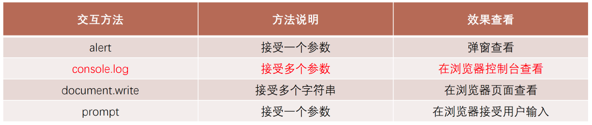

## 1、JavaScript编写方式

- **位置一：**HTML代码行内（不推荐）

- **位置二：**script标签中

- **位置三：**外部script文件

```javascript
<body>
  <!-- 1.编写位置一: 编写在html内部(了解) -->
  <a href="#" onclick="alert('百度一下')">百度一下</a>
  <a href="javascript: alert('百度一下')">百度一下</a>

  <!-- 2.编写位置二: 编写在script元素之内 -->
  <a class="google" href="#">Google一下</a>
  <script>
    var googleAEl = document.querySelector(".google")
    googleAEl.onclick = function() {
      alert("Google一下")
    }
  </script>

  <!-- 3.编写位置三: 独立的js文件 -->
  <a class="bing" href="#">bing一下</a>
  <script src="./js/bing.js"></script>
</body>
```


## 2、noscript元素的使用

**如果运行的浏览器不支持JavaScript, 那么我们如何给用户更好的提示呢?** 

​		针对早期浏览器不支持 JavaScript 的问题，需要一个页面优雅降级的处理方案，最终，<noscript> 元素出现，被用于给不支持 JavaScript 的浏览器提供替代内容; 

**下面的情况下, 浏览器将显示包含在<noscript>中的内容:** 

- 浏览器不支持脚本; 
- 浏览器对脚本的支持被关闭。

```javascript
<body>
  <noscript>
    <h1>您的浏览器不支持JavaScript, 请打开或者更换浏览器~</h1>
  </noscript>

  <script>
    alert("您的浏览器正在运行JavaScript代码")
  </script>
</body>
```


## 3、JavaScript注意事项

- **注意一: script元素****不能写成单标签**
  - 在外联式引用js文件时，script标签中不可以写JavaScript代码，并且script标签不能写成单标签；
  - 即不能写成<script src="index.js"/>； 

- **注意二: 省略type属性**
  - 在以前的代码中，<script>标签中会使用 type=“text/javascript”； 
  - 现在可不写这个代码了，因为JavaScript 是所有现代浏览器以及 HTML5 中的默认脚本语言； 

- **注意三: 加载顺序**
  - 作为HTML文档内容的一部分，JavaScript默认遵循HTML文档的加载顺序，即自上而下的加载顺序；
  - 推荐将JavaScript代码和编写位置放在body子元素的最后一行； 

- **注意四: JavaScript代码严格区分大小写**
  - HTML元素和CSS属性不区分大小写，但是在JavaScript中严格区分大小写；

- **后续补充：script元素还有defer、async属性。**


## 4、JavaScript交互方式

```javascript
  <script>
    // 1.交互方式一: alert函数
    alert("Hello World");

    // 2.交互方式二: console.log函数, 将内容输出到控制台中(console)
    // 使用最多的交互方式
    console.log("Hello Coderwhy");

    // 编写的JavaScript代码出错了
    // message.length

    // 3.交互方式三: document.write()
    document.write("Hello Kobe");

    // 4.交互方式四: prompt函数, 作用获取用户输入的内容
    var result = prompt("请输入你的名字: ");
    alert("您刚才输入的内容是:" + result);
  </script>
```




## 5、JavaScript语句和分号


## 6、JavaScript注释方式

**JavaScript的注释主要分为三种：**

- 单行注释
- 多行注释
- 文档注释（VSCode中需要在单独的JavaScript文件中编写才有效）

注意：JavaScript也不支持注释的嵌套

```javascript
    // 1.单行注释

    // 2.多行注释
    /* 
     我是一行注释
     我是另外一行注释
    */

    // 3.文档注释
    /**
     * 和某人打招呼
     * @param {string} name 姓名
     * @param {number} age 年龄
     */
    function sayHello(name, age) {

    }
```


