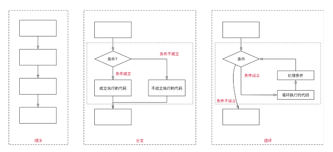

## 0、程序执行顺序与代码块

- 程序的执行顺序：**在程序开发中，程序有三种不同的执行方式：**

  - **顺序** —— 从上向下，顺序执行代码

  - **分支** —— 根据条件判断，决定执行代码的 分支

  - **循环** —— 让 特定代码 重复 执行

- **代码块**是多行执行代码的集合，通过一个花括号{}放到了一起。

  - **在开发中，一行代码很难完成某一个特定的功能，我们就会将这些代码放到一个代码块中**

- **在JavaScript中，我们可以通过流程控制语句来决定如何执行一个代码块：**
  - 通常会通过一些关键字来告知js引擎代码要如何被执行；比如分支语句、循环语句对应的关键字等；

## 1、if分支语句

### 1.1、什么是分支结构？

**分支结构**

- 分支结构的代码就是让我们根据条件来决定代码的执行

- 分支结构的语句被称为判断结构或者选择结构. 

- 几乎所有的编程语言都有分支结构（C、C++、OC、JavaScript等等）

**JavaScript中常见的分支结构有：**

- if分支结构

- switch分支结构

### 1.2、if分支语句

**if分支结构有三种：**

- 单分支结构
  - if..

- 多分支结构

  - if..else..

  - if..else if..else..

### 1.3、单分支结构

**单分支语句：if**

- if(...) 语句计算括号里的条件表达式，如果计算结果是 true，就会执行对应的代码块。

### 1.4、if语句细节补充

- **补充一：如果代码块中只有一行代码，那么{}可以省略：**

- **补充二：if (…) 语句会计算圆括号内的表达式，并将计算结果转换为布尔型（Boolean）。**

  - 转换规则和Boolean函数的规则一致；

  - 数字 0、空字符串 “”、null、undefined 和 NaN 都会被转换成 false。 因为它们被称为“假值（falsy）”；

  - 其他值被转换为 true，所以它们被称为“真值（truthy）”；

## 2、if...else...语句

## 3、if...else...if...else...语句

## 4、三元运算符

## 5、逻辑运算符

### 5.1、认识逻辑运算符

### 5.2、逻辑或的本质

### 5.3、逻辑与的本质

### 5.4、非

## 6、switch语句

