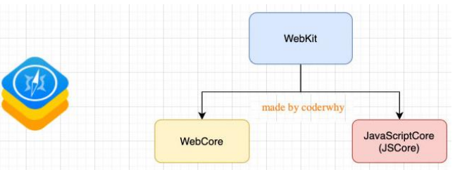
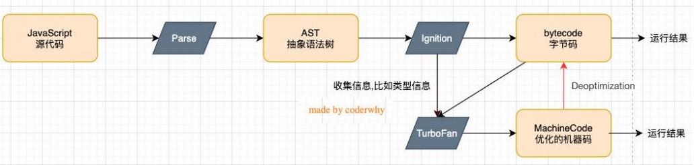
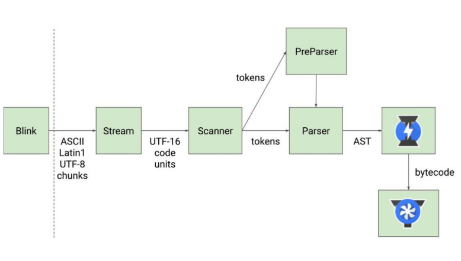
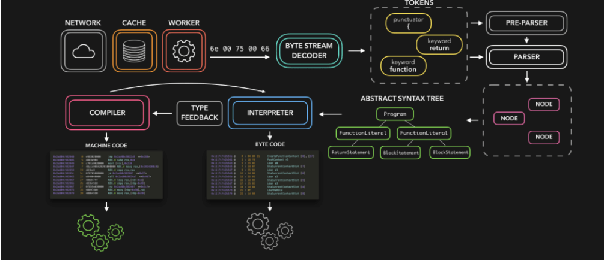

## 1、深入V8引擎原理

### 1.1、JavaScript代码的执行

浏览器内核是由两部分组成的，以webkit为例：

- WebCore：负责HTML解析、布局、渲染等等相关的工作；
- JavaScriptCore：解析、执行JavaScript代码；



**另外一个强大的JavaScript引擎就是V8引擎。**

### 1.2、V8引擎的执行原理

下官方对V8引擎的定义：

- V8是用C ++编写的Google开源高性能JavaScript和WebAssembly引擎，它用于Chrome和Node.js等。
- 它实现ECMAScript和WebAssembly，并在Windows 7或更高版本，macOS 10.12+和使用x64，IA-32，ARM或MIPS处理 器的Linux系统上运行。
- V8可以独立运行，也可以嵌入到任何C ++应用程序中。



### 1.3、V8引擎的架构

V8引擎本身的源码非常复杂，大概有超过100w行C++代码，通过了解它的架构，我们可以知道它是如何对JavaScript执行的：

-  Parse模块会将JavaScript代码转换成AST（抽象语法树），这是因为解释器并不直接认识JavaScript代码； 
  - 如果函数没有被调用，那么是不会被转换成AST的；
  - Parse的V8官方文档：https://v8.dev/blog/scanner 
- Ignition是一个解释器，会将AST转换成ByteCode（字节码）
  - 同时会收集TurboFan优化所需要的信息（比如函数参数的类型信息，有了类型才能进行真实的运算）； 
  - 如果函数只调用一次，Ignition会解释执行ByteCode； 
  - Ignition的V8官方文档：https://v8.dev/blog/ignition-interpreter 
- TurboFan是一个编译器，可以将字节码编译为CPU可以直接执行的机器码；
  - 如果一个函数被多次调用，那么就会被标记为热点函数，那么就会经过TurboFan转换成优化的机器码，提高代码的执行性能；
  - 但是，机器码实际上也会被还原为ByteCode，这是因为如果后续执行函数的过程中，类型发生了变化（比如sum函数原来执 行的是number类型，后来执行变成了string类型），之前优化的机器码并不能正确的处理运算，就会逆向的转换成字节码；
  - TurboFan的V8官方文档：https://v8.dev/blog/turbofan-jit

### 1.4、V8引擎的解析图

- 词法分析（英文lexical analysis）
  - 将字符序列转换成token序列 的过程。
  - token是记号化 （tokenization）的缩写
  - 词法分析器（lexical analyzer，简称lexer），也 叫扫描器（scanner）
- 语法分析（英语：syntactic analysis，也叫 parsing）
  - 语法分析器也可以称之为 parser。






### 1.5、JavaScript代码执行原理 - 版本说明

在ECMA早期的版本中（ECMAScript3），代码的执行流程的术语和ECMAScript5以及之后的术语会有所区别： 

- 目前网上大多数流行的说法都是基于ECMAScript3版本的解析，并且在面试时问到的大多数都是ECMAScript3的版本内容。 
- 但是ECMAScript3终将过去， ECMAScript5必然会成为主流，所以最好也理解ECMAScript5甚至包括ECMAScript6以及更 好版本的内容；
- 事实上在TC39（ ECMAScript5 ）的最新描述中，和ECMAScript5之后的版本又出现了一定的差异； 

那么我们课程按照如下顺序学习： 

- 通过ECMAScript3中的概念学习JavaScript执行原理、作用域、作用域链、闭包等概念；
- 通过ECMAScript5中的概念学习块级作用域、let、const等概念；

**事实上，它们只是在对某些概念上的描述不太一样，在整体思路上都是一致的。**

### 1.6、JavaScript的执行过程

下面一段代码，它在JavaScript中是如何被执行的呢？

```javascript
var message = "Global Message";

function foo() {
  var message = "Foo Message";
  console.log("foo function");
}

var num1 = 10;
var num2 = 20;
var result = num1 + num2;
console.log(result);
```

### 1.7、初始化全局对象

>  js引擎会在执行代码之前，会在堆内存中创建一个全局对象：Global Object（GO）

- 该对象 所有的作用域（scope）都可以访问；
- 里面会包含Date、Array、String、Number、setTimeout、setInterval等等；
- 其中还有一个window属性指向自己；

## 2、JS执行上下文

- js引擎内部有一个执行上下文栈（Execution Context Stack，简称ECS），它是用于执行代码的调用栈。

- 那么现在它要执行谁呢？执行的是全局的代码块： 
  - 全局的代码块为了执行会构建一个 Global Execution Context（GEC）；
  - GEC会 被放入到ECS中 执行；

- GEC被放入到ECS中里面包含两部分内容：
  - 第一部分：在代码执行前，在parser转成AST的过程中，会将全局定义的变量、函数等加入到GlobalObject中，但是并不会 赋值；
    - 这个过程也称之为变量的作用域提升（hoisting）
  - 第二部分：在代码执行中，对变量赋值，或者执行其他的函数；

### 2.1、认识VO对象（Variable Object）

> 每一个执行上下文会关联一个VO（Variable Object，变量对象），变量和函数声明会被添加到这个VO对象中。

> 当全局代码被执行的时候，VO就是GO对象了

## 3、全局代码执行过程

### 3.1、执行前


### 3.2、执行后


## 4、函数代码执行过程

### 4.1、函数如何被执行

> 在执行的过程中执行到一个函数时，就会根据函数体创建一个函数执行上下文（Functional Execution Context，简称FEC）， 并且压入到EC Stack中。

**因为每个执行上下文都会关联一个VO，那么函数执行上下文关联的VO是什么呢**

- 当进入一个函数执行上下文时，会创建一个AO对象（Activation Object）；
- 这个AO对象会使用arguments作为初始化，并且初始值是传入的参数；
- 这个AO对象会作为执行上下文的VO来存放变量的初始化；

### 4.2、执行前


### 4.3、执行后


## 5、作用域和作用域链（Scope Chain）

当进入到一个执行上下文时，执行上下文也会关联一个作用域链（Scope Chain）

- 作用域链是一个对象列表，用于变量标识符的求值；
- 当进入一个执行上下文时，这个作用域链被创建，并且根据代码类型，添加一系列的对象；


