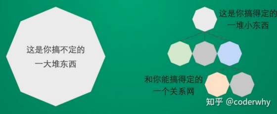
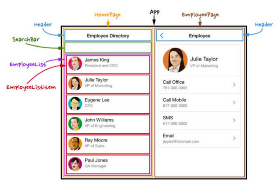
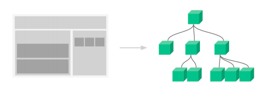
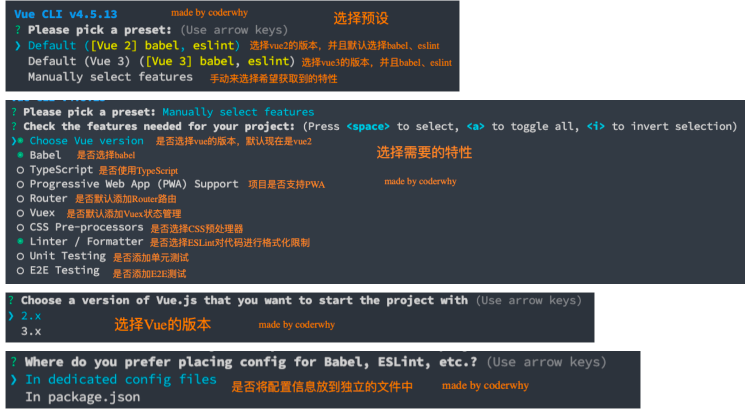
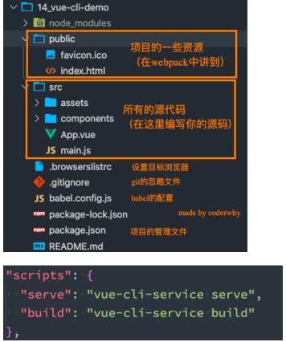
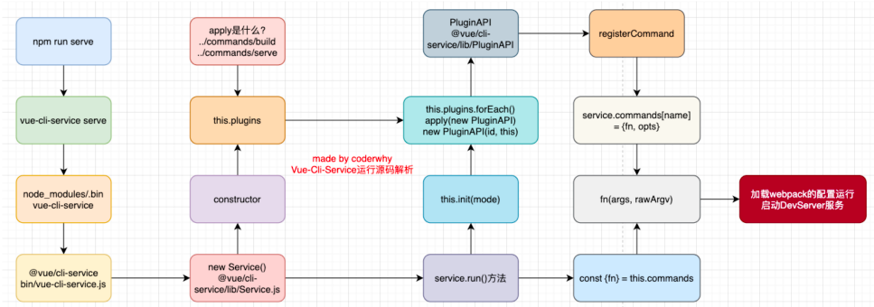

## 1、Vue组件化开发思想

### 1.1、人处理问题的方式

人面对复杂问题的处理方式：

- 任何一个人处理信息的逻辑能力都是有限的 
- 所以，当面对一个非常复杂的问题时，我们不太可能一次性搞定一大堆的内容。 
- 但是，我们人有一种天生的能力，就是将问题进行拆解。 
- 如果将一个复杂的问题，拆分成很多个可以处理的小问题，再将其放在整体当中，你会发现大的问题也会迎刃而解。



### 1.2、认识组件化

组件化也是类似的思想：

- 如果我们将一个页面中所有的处理逻辑全部放在一起，处理起来就会变得非常复杂，而且不利于后续的管理以及扩展； 
- 但如果，我们讲一个页面拆分成一个个小的功能块，每个功能块完成属于自己这部分独立的功能，那么之后整个页面的管理和维护就变得非常容易了；
- 如果我们将一个个功能块拆分后，就可以像搭建积木一下来搭建我们的项目；



### 1.3、组件化开发

现在可以说整个的大前端开发都是组件化的天下，

- 无论从三大框架（Vue、React、Angular），还是跨平台方案的Flutter，甚至是移动端都在转向组件化开发，包括小程序的开发也是采用组件化开发的思想。

所以，学习组件化最重要的是它的思想，每个框架或者平台可能实现方法不同，但是思想都是一样的。
我们需要通过组件化的思想来思考整个应用程序：

- 我们将一个完整的页面分成很多个组件；
- 每个组件都用于实现页面的一个功能块；
- 而每一个组件又可以进行细分；
- 而组件本身又可以在多个地方进行复用；

### 1.4、Vue的组件化

组件化是Vue、React、Angular的核心思想，也是我们后续课程的重点（包括以后实战项目）：

- 前面我们的createApp函数传入了一个对象App，这个对象其实本质上就是一个组件，也是我们应用程序的根组件；
- 组件化提供了一种抽象，让我们可以开发出一个个独立可复用的小组件来构造我们的应用；
- 任何的应用都会被抽象成一颗组件树；



```js
// 1.组件: App组件(根组件)
const App = {
  data() {
    return {
      message: "Hello Vue",
    };
  },
};

// 1.创建app
const app = Vue.createApp(App);

// 2.挂载app
app.mount("#app");
```

## 2、注册Vue的全局组件

### 2.1、注册组件的方式

如果我们现在有一部分**内容（模板、逻辑等）**，我们希望将这部分内容抽取到一个**独立的组件**中去维护，这个时候如何注册一个组件呢？

**注册组件分成两种：**

- 全局组件：在任何其他的组件中都可以使用的组件；
- 局部组件：只有在注册的组件中才能使用的组件；

### 2.2、注册全局组件

我们先来学习一下全局组件的注册：

- 全局组件需要使用我们全局创建的app来注册组件；
- 通过component方法传入组件名称、组件对象即可注册一个全局组件了；
- 之后，我们可以在App组件的template中直接使用这个全局组件：

```html
<div id="app">
  <!-- 1.内容一: -->
  <product-item></product-item>

  <!-- 2.内容二: -->
  <product-item></product-item>

  <!-- 3.内容三: -->
  <product-item></product-item>
</div>

<!-- 组件product-item的模板 -->
<template id="item">
  <div class="product">
    <h2>我是商品</h2>
    <div>商品图片</div>
    <div>商品价格: <span>¥9.9</span></div>
    <p>商品描述信息, 9.9秒杀</p>
  </div>
</template>
```

```js
/*
  1.通过app.component(组件名称, 组件的对象)
  2.在App组件的模板中, 可以直接使用product-item的组件
*/

// 1.组件: App组件(根组件)
const App = {};
// 2.创建app
const app = Vue.createApp(App);
// 3.注册一个全局组件
// product-item全局组件
app.component("product-item", {
  template: "#item",
});

// 2.挂载app
app.mount("#app");
```

### 2.3、全局组件的逻辑

当然，我们组件本身也可以有自己的代码逻辑：

- 比如自己的data、computed、methods等等

```html
<div id="app">
  <!-- <home-nav></home-nav> -->
  <HomeNav></HomeNav>
  <home-nav></home-nav>

  <product-item></product-item>
  <product-item></product-item>
  <product-item></product-item>
</div>

<template id="nav">
  <h2>我是应用程序的导航</h2>
</template>

<template id="product">
  <div class="product">
    <h2>{{title}}</h2>
    <p>商品描述, 限时折扣, 赶紧抢购</p>
    <p>价格: {{price}}</p>
    <button @click="favarItem">收藏</button>
  </div>
</template>
```

```js
// 1.创建app
const app = Vue.createApp({
  // data: option api
  data() {
    return {
      message: "Hello Vue",
    };
  },
});

// 2.注册全局组件
app.component("product-item", {
  template: "#product",
  data() {
    return {
      title: "我是商品Item",
      price: 9.9,
    };
  },
  methods: {
    favarItem() {
      console.log("收藏了当前的item");
    },
  },
});

app.component("HomeNav", {
  template: "#nav",
});

// 2.挂载app
app.mount("#app");
```

### 2.4、组件的名称

在通过app.component注册一个组件的时候，第一个参数是组件的名称，定义组件名的方式有两种：

- 方式一：使用kebab-case（短横线分割符）
  - 当使用 kebab-case (短横线分隔命名) 定义一个组件时，你也必须在引用这个自定义元素时使用 kebab-case，例如 <mycomponent-name>； 
- 方式二：使用PascalCase（驼峰标识符）
  - 当使用 PascalCase (首字母大写命名) 定义一个组件时，你在引用这个自定义元素时两种命名法都可以使用。
  - 也就是说 <my-component-name> 和 <MyComponentName> 都是可接受的；

## 3、注册Vue的局部组件

全局组件往往是在应用程序一开始就会全局组件完成，那么就意味着如果某些组件我们并没有用到，也会一起被注册：

- 比如我们注册了三个全局组件：ComponentA、ComponentB、ComponentC；
- 在开发中我们只使用了ComponentA、ComponentB，如果ComponentC没有用到但是我们依然在全局进行了注册，那么就意味着类似于webpack这种打包工具在打包我们的项目时，我们依然会对其进行打包；
- 这样最终打包出的JavaScript包就会有关于ComponentC的内容，用户在下载对应的JavaScript时也会增加包的大小；

所以在开发中我们通常使用组件的时候采用的都是局部注册：

- 局部注册是在我们需要使用到的组件中，通过components属性选项来进行注册；
- 比如之前的App组件中，我们有data、computed、methods等选项了，事实上还可以有一个components选项；
- 该components选项对应的是一个对象，对象中的键值对是 组件的名称: 组件对象；

```html
<div id="app">
  <home-nav></home-nav>

  <product-item></product-item>
  <product-item></product-item>
  <product-item></product-item>
</div>

<template id="product">
  <div class="product">
    <h2>{{title}}</h2>
    <p>商品描述, 限时折扣, 赶紧抢购</p>
    <p>价格: {{price}}</p>
    <button>收藏</button>
  </div>
</template>

<template id="nav">
  <div>-------------------- nav start ---------------</div>
  <h1>我是home-nav的组件</h1>
  <product-item></product-item>
  <div>-------------------- nav end ---------------</div>
</template>
```

```js
// 1.创建app
const ProductItem = {
  template: "#product",
  data() {
    return {
      title: "我是product的title",
      price: 9.9,
    };
  },
};

// 1.1.组件打算在哪里被使用
const app = Vue.createApp({
  // components: option api
  components: {
    ProductItem,
    HomeNav: {
      template: "#nav",
      components: {
        ProductItem,
      },
    },
  },
  // data: option api
  data() {
    return {
      message: "Hello Vue",
    };
  },
});

// 2.挂载app
app.mount("#app");
```

## 4、Vue的开发模式解析

### 4.1、Vue的开发模式

目前我们使用vue的过程都是在html文件中，通过template编写自己的模板、脚本逻辑、样式等。

但是随着项目越来越复杂，我们会采用组件化的方式来进行开发：

- 这就意味着每个组件都会有自己的模板、脚本逻辑、样式等；
- 当然我们依然可以把它们抽离到单独的js、css文件中，但是它们还是会分离开来；
- 也包括我们的script是在一个全局的作用域下，很容易出现命名冲突的问题；
- 并且我们的代码为了适配一些浏览器，必须使用ES5的语法；
- 在我们编写代码完成之后，依然需要通过工具对代码进行构建、代码；

所以在真实开发中，我们可以通过一个后缀名为 .vue 的single-file components (单文件组件) 来解决，并且可以使用webpack或者vite或者rollup等构建工具来对其进行处理。

### 4.2、单文件的特点

在这个组件中我们可以获得非常多的特性：

- 代码的高亮；
- ES6、CommonJS的模块化能力；
- 组件作用域的CSS；
- 可以使用预处理器来构建更加丰富的组件，比如TypeScript、Babel、Less、Sass等；

### 4.3、如何支持SFC

如果我们想要使用这一的SFC的.vue文件，比较常见的是两种方式：

- 方式一：使用Vue CLI来创建项目，项目会默认帮助我们配置好所有的配置选项，可以在其中直接使用.vue文件；
- 方式二：自己使用webpack或rollup或vite这类打包工具，对其进行打包处理；

我们最终，无论是后期我们做项目，还是在公司进行开发，通常都会采用Vue CLI的方式来完成。

### 4.4、VSCode对SFC文件的支持

在前面我们提到过，真实开发中多数情况下我们都是使用SFC（ single-file components (单文件组件) ）。

我们先说一下VSCode对SFC的支持：

- 插件一：Vetur，从Vue2开发就一直在使用的VSCode支持Vue的插件；
- 插件二：Volar，官方推荐的插件；

## 5、Vue CLI安装和使用

### 5.1、Vue CLI脚手架

什么是Vue脚手架？

- 我们前面学习了如何通过webpack配置Vue的开发环境，但是在真实开发中我们不可能每一个项目从头来完成所有的webpack配置，这样显示开发的效率会大大的降低；
- 所以在真实开发中，我们通常会使用脚手架来创建一个项目，Vue的项目我们使用的就是Vue的脚手架； 
- 脚手架其实是建筑工程中的一个概念，在我们软件工程中也会将一些帮助我们搭建项目的工具称之为脚手架；

Vue的脚手架就是Vue CLI：

- CLI是Command-Line Interface, 翻译为命令行界面；
- 我们可以通过CLI选择项目的配置和创建出我们的项目；
- Vue CLI已经内置了webpack相关的配置，我们不需要从零来配置；

### 5.2、Vue CLI安装和使用

- 安装Vue CLI（目前最新的版本是v5.0.8）	
  - 我们是进行全局安装，这样在任何时候都可以通过vue的命令来创建项目；
  - `npm install @vue/cli -g`
- 升级Vue CLI：
  - 如果是比较旧的版本，可以通过下面的命令来升级
  - `npm update @vue/cli -g`
- 通过Vue的命令来创建项目
  - `Vue create 项目的名称`

### 5.3、vue create项目的过程



## 6、Vue的项目目录分析

### 6.1、项目的目录结构



```js
import { createApp } from "vue"; // 不支持template选项
// import { createApp } from 'vue/dist/vue.esm-bundler' // compile代码
import App from "./App.vue"; // vue-loader: template -> createVNode过程

import "./utils/abc/cba/nba/index";

/**
 * 1.jsconfig.json的演练
 *   作用: 给VSCode来进行读取, VSCode在读取到其中的内容时, 给我们的代码更加友好的提示.
 * 2.引入的vue的版本
 *   默认vue版本: runtime, vue-loader完成template的编译过程
 *   vue.esm-bundler: runtime + compile, 对template进行编译
 *
 * 3.补充: 单文件Vue style是有自己的作用域
 *   style -> scoped
 * 4.补充: vite创建一个Vue项目
 */

// 元素 -> createVNode: vue中的源码来完成
// compile的代码
// const App = {
//   template: `<h2>Hello Vue3 App</h2>`,
//   data() {
//     return {}
//   }
// }

createApp(App).mount("#app");
```

### 6.2、Vue CLI的运行原理




