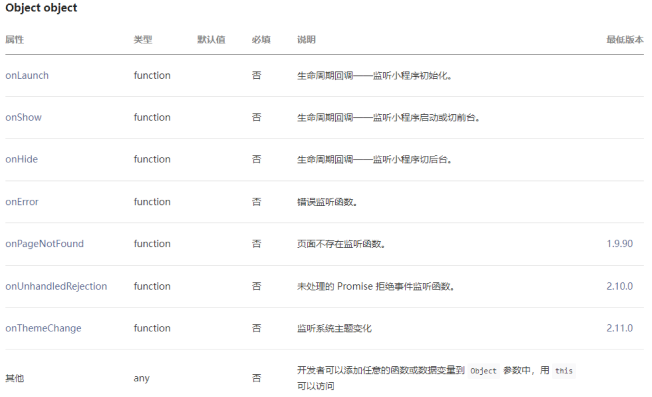
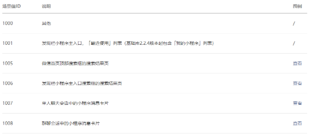
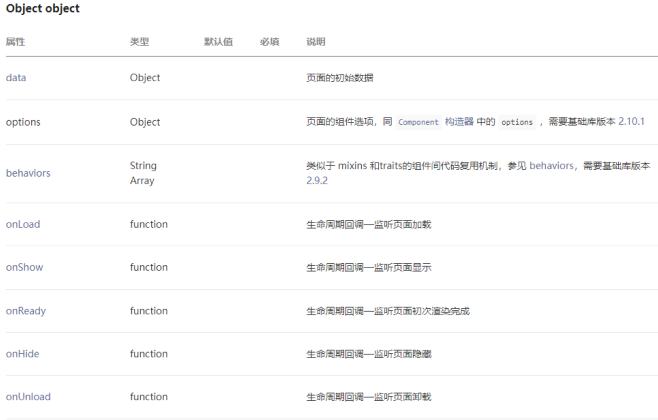
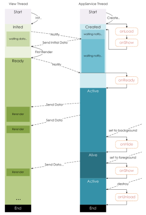

## 一、小程序的双线程模型

**小程序的架构模型**

谁是小程序的宿主环境呢？**微信客户端**

- 宿主环境为了执行小程序的各种文件：wxml文件、wxss文件、js文件

当小程序基于 WebView 环境下时，WebView 的 JS 逻辑、DOM 树创建、CSS 解析、样式计算、Layout、Paint (Composite) 都发生在同一线程，在 WebView 上执行过多的 JS 逻辑可能阻塞渲染，导致界面卡顿。

以此为前提，小程序同时考虑了性能与安全，采用了目前称为「双线程模型」的架构。


**双线程模型：**

- WXML模块和WXSS样式运行于 渲染层，渲染层使用WebView线程渲染（一个程序有多个页面，会使用多个WebView的线程）。
- JS脚本（app.js/home.js等）运行于 逻辑层，逻辑层使用JsCore运行JS脚本。
- 这两个线程都会经由微信客户端（Native）进行中转交互。

## 二、不同配置文件的区分

### 2.1.小程序的配置文件

小程序的很多开发需求被规定在了配置文件中。

为什么这样做呢?

- 这样做可以更有利于我们的开发效率；
- 并且可以保证开发出来的小程序的某些风格是比较一致的；
- 比如导航栏 – 顶部TabBar，以及页面路由等等。

常见的配置文件有哪些呢?

- project.config.json：项目配置文件, 比如项目名称、appid等；
  - https://developers.weixin.qq.com/miniprogram/dev/devtools/projectconfig.html
- sitemap.json：小程序搜索相关的；
  - https://developers.weixin.qq.com/miniprogram/dev/framework/sitemap.html
- app.json：全局配置；
- page.json：页面配置；

### 2.2.全局配置文件app.json

全局配置比较多, 我们这里将几个比较重要的. 完整的查看官方文档. 

- https://developers.weixin.qq.com/miniprogram/dev/reference/configuration/app.html

  

pages: 页面路径列表

- 用于指定小程序由哪些页面组成，每一项都对应一个页面的 路径（含文件名） 信息。
- 小程序中所有的页面都是必须在pages中进行注册的。

window: 全局的默认窗口展示

- 用户指定窗口如何展示, 其中还包含了很多其他的属性

tabBar: 底部tab栏的展示

- 具体属性稍后我们进行演示

配置案例实：

```json
"tabBar": {
  "selectedColor": "#ff8189",
  "list": [
    {
      "text": "首页",
      "pagePath": "pages/index/index",
      "iconPath": "assets/tabbar/home.png",
      "selectedIconPath": "assets/tabbar/home_active.png"
    },
    {
      "text": "收藏",
      "pagePath": "pages/favor/favor",
      "iconPath": "assets/tabbar/category.png",
      "selectedIconPath": "assets/tabbar/category_active.png"
    },
    {
      "text": "订单",
      "pagePath": "pages/order/order",
      "iconPath": "assets/tabbar/cart.png",
      "selectedIconPath": "assets/tabbar/cart_active.png"
    },
    {
      "text": "我的",
      "pagePath": "pages/profile/profile",
      "iconPath": "assets/tabbar/profile.png",
      "selectedIconPath": "assets/tabbar/profile_active.png"
    }
  ]
},
```

### 2.3.页面配置文件page.json

每一个小程序页面也可以使用 .json 文件来对本页面的窗口表现进行配置。

- 页面中配置项在当前页面会覆盖 app.json 的 window 中相同的配置项。
- https://developers.weixin.qq.com/miniprogram/dev/reference/configuration/page.html


## 三、注册小程序

### 3.1.App函数

每个小程序都需要在 app.js 中调用 App 函数 注册小程序示例

- 在注册时, 可以绑定对应的生命周期函数；
- 在生命周期函数中, 执行对应的代码；
- https://developers.weixin.qq.com/miniprogram/dev/reference/api/App.html

我们来思考：注册App时，我们一般会做什么呢？

1. 判断小程序的进入场景
2. 监听生命周期函数，在生命周期中执行对应的业务逻辑，比如在某个生命周期函数中进行登录操作或者请求网络数据；
3.  因为App()实例只有一个，并且是全局共享的（单例对象），所以我们可以将一些共享数据放在这里；

**App函数的参数：**



**作用一：判断打开场景**

小程序的打开场景较多：

- 常见的打开场景：群聊会话中打开、小程序列表中打开、微信扫一扫打开、另一个小程序打开
- https://developers.weixin.qq.com/miniprogram/dev/reference/scene-list.html

如何确定场景?

- 在onLaunch和onShow生命周期回调函数中，会有options参数，其中有scene值；



**作用二：定义全局App的数据**

可以在Object中定义全局App的数据，定义的数据可以在其他任何页面中访问：

```js
// app.js
App({
  // 作用二: 共享数据
  // 数据不是响应式, 这里共享的数据通常是一些固定的数据
  globalData: {
    token: "",
    userInfo: {}
  },
    
  onLaunch(options) {
    console.log("options", options);
    // 0.从本地获取token/userInfo
    const token = wx.getStorageSync("token")
    const userInfo = wx.getStorageSync("userInfo")

    // 1.进行登录操作(判断逻辑)
    if (!token || !userInfo) {
      // 将登录成功的数据, 保存到storage
      console.log("登录操作");
      wx.setStorageSync("token", "kobetoken")
      wx.setStorageSync("userInfo", { nickname: "kobe", level: 100 })
    }

    // 2.将获取到数据保存到globalData中
    this.globalData.token = token
    this.globalData.userInfo = userInfo

    // 3.发送网络请求, 优先请求一些必要的数据
    // wx.request({ url: 'url'})
  },
})
```

```js
// pages/order/order.js
Page({
  data: {
    userInfo: {}
  },

  onLoad() {
    // 获取共享的数据: App实例中数据
    // 1.获取app实例对象
    const app = getApp()

    // 2.从app实例对象获取数据
    const token = app.globalData.token
    const userInfo = app.globalData.userInfo

    // 3.拿到token目的发送网络请求
    // 4.将数据展示到界面上面
    // this.data.userInfo = userInfo
    this.setData({ userInfo })
    console.log(this.data.userInfo);
  }
})
```

**作用三 – 生命周期函数**

在生命周期函数中，完成应用程序启动后的初始化操作

- 比如登录操作（这个后续会详细讲解）；
- 比如读取本地数据（类似于token，然后保存在全局方便使用）
- 比如请求整个应用程序需要的数据；

```js
onLaunch(options) {
  console.log("options", options);
  // 0.从本地获取token/userInfo
  const token = wx.getStorageSync("token")
  const userInfo = wx.getStorageSync("userInfo")

  // 1.进行登录操作(判断逻辑)
  if (!token || !userInfo) {
    // 将登录成功的数据, 保存到storage
    console.log("登录操作");
    wx.setStorageSync("token", "kobetoken")
    wx.setStorageSync("userInfo", { nickname: "kobe", level: 100 })
  }

  // 2.将获取到数据保存到globalData中
  this.globalData.token = token
  this.globalData.userInfo = userInfo

  // 3.发送网络请求, 优先请求一些必要的数据
  // wx.request({ url: 'url'})
},
```

### 3.2.Page函数

小程序中的每个页面, 都有一个对应的js文件, 其中调用Page函数注册页面示例

- 在注册时, 可以绑定初始化数据、生命周期回调、事件处理函数等。
- https://developers.weixin.qq.com/miniprogram/dev/reference/api/Page.html

我们来思考：注册一个Page页面时，我们一般需要做什么呢？

1. 在生命周期函数中发送网络请求，从服务器获取数据；
2. 初始化一些数据，以方便被wxml引用展示；
3. 监听wxml中的事件，绑定对应的事件函数；
4. 其他一些监听（比如页面滚动、上拉刷新、下拉加载更多等）；

**注册Page时做什么呢?**



**Page页面的生命周期**



**上拉和下拉的监听**

监听页面的下拉刷新和上拉加载更多：

- 步骤一：配置页面的json文件；
- 步骤二：代码中进行监听；

```json
{
  "usingComponents": {},
  "navigationBarTitleText": "个人信息",
  "navigationBarBackgroundColor": "#f00",
  "enablePullDownRefresh": true,
  "onReachBottomDistance": 100
}
```

```js
// pages/profile/profile.js
Page({
  data: {
    avatarURL: "",
    listCount: 30
  },

  // 监听下拉刷新
  onPullDownRefresh() {
    console.log("用户进行下拉刷新~");

    // 模拟网络请求: 定时器
    setTimeout(() => {
      this.setData({ listCount: 30 })

      // API: 停止下拉刷新
      wx.stopPullDownRefresh({
        success: (res) => {
          console.log("成功停止了下拉刷新", res);
        },
        fail: (err) => {
          console.log("失败停止了下拉刷新", err);
        }
      })
    }, 1000)
  },

  // 监听页面滚动到底部
  onReachBottom() {
    console.log("onReachBottom");
    this.setData({
      listCount: this.data.listCount + 30
    })
  }
})
```


