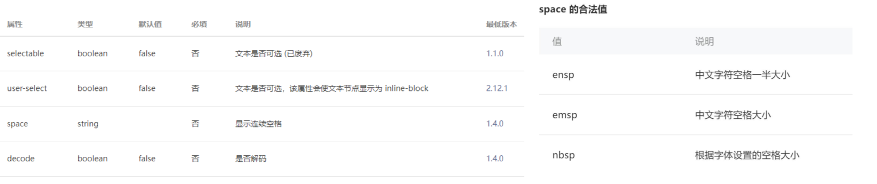
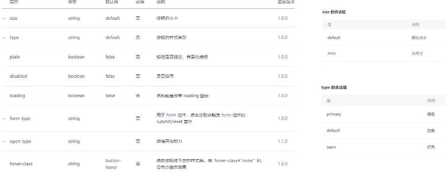
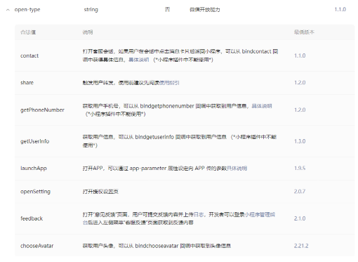
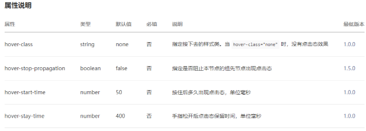
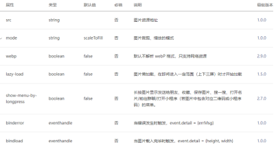
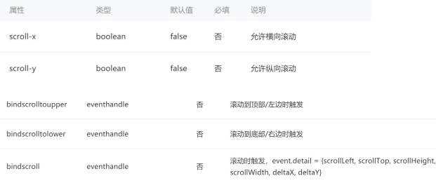
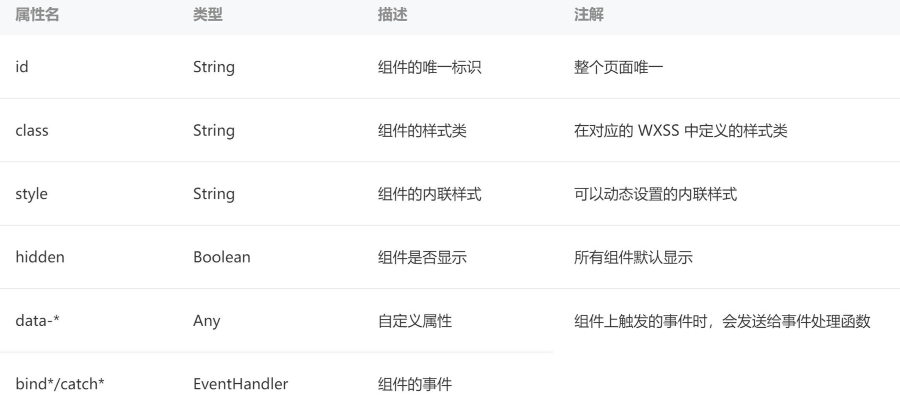

## 一、Text文本组件

Text组件用于显示文本, 类似于span标签, 是行内元素



- user-select属性决定文本内容是否可以让用户选中
- space有三个取值(了解)
- decode是否解码(了解)
  - decode可以解析的有 `&nbsp; &lt; &gt; &amp; &apos; &ensp; &emsp;`

```html
<text>Hello World</text>
<text user-select>{{ message }}</text>
<text decode>&gt;</text>
```

## 二、Button按钮组件

Button组件用于创建按钮，默认块级元素

**常见属性：**




**open-type属性**

open-type用户获取一些特殊性的权限，可以绑定一些特殊的事件



```html
<!-- 1.基本使用 -->
<button>按钮</button>
<button size="mini">size属性</button>
<button size="mini" type="primary">type属性</button>
<button size="mini" type="warn">type属性</button>
<button size="mini" class="btn">自定义CSS</button>
<button size="mini" plain>plain属性</button>
<button size="mini" disabled>disabled属性</button>
<button size="mini" loading class="btn">loading属性</button>
<button size="mini" hover-class="active">hover效果</button>

<!-- 2.open-type属性 -->
<!-- 2.open-type属性 -->
<button open-type="contact" size="mini" type="primary">打开会话</button>
<button open-type="getUserInfo" bindgetuserinfo="getUserInfo" size="mini" type="primary">
  用户信息
</button>
<button size="mini" type="primary" bindtap="getUserInfo">用户信息2</button>
<button size="mini" type="primary" open-type="getPhoneNumber" bindgetphonenumber="getPhoneNumber">
  手机号码
</button>
```

```js
getUserInfo(event) {
  // 调用API, 获取用户的信息
  // 1.早期小程序的API, 基本都是不支持Promise风格
  // 2.后期小程序的API, 基本都开发支持Promise风格
  wx.getUserProfile({
    desc: 'desc',
    // success: (res) => {
    //   console.log(res);
    // }
  }).then(res => {
    console.log(res);
  })
},

// 获取手机号码
getPhoneNumber(event) {
  console.log(event);
},
```

## 三、View视图组件

视图组件（块级元素，独占一行，通常用作容器组件）



```html
<view bindtap="onViewClick" hover-class="active">我是view组件</view>
```

## 四、Image图片组件

Image组件用于显示图片，有如下常见属性



其中src可以是本地图片，也可以是网络图片

Mode属性使用也非常关键，详情查看官网：

- https://developers.weixin.qq.com/miniprogram/dev/component/image.html

注意：image组件默认宽度320px、高度240px

```html
<!-- 根目录: /表示根目录 -->
<!-- 1.图片的基本使用 -->
<!-- image元素宽度和高度: 320x240 -->
<image src="/assets/zznh.png" />
<image src="https://pic3.zhimg.com/v2-9be23000490896a1bfc1df70df50ae32_b.jpg" />
<!-- 2.图片重要的属性: mode -->
<image src="/assets/zznh.png" mode="aspectFit" />
<!-- image基本都是设置widthFix -->
<image src="/assets/zznh.png" mode="widthFix" />
<image src="/assets/zznh.png" mode="heightFix" />

<!-- 3.选择本地图片: 将本地图片使用image展示出来 -->
<button bindtap="onChooseImage">选择图片</button>
<image class="img" src="{{chooseImageUrl}}" mode="widthFix" />
```

```js
onChooseImage() {
  wx.chooseMedia({
    mediaType: "image"
  }).then(res => {
    const imagePath = res.tempFiles[0].tempFilePath
    this.setData({
      chooseImageUrl: imagePath
    })
  })
},
```

## 五、ScrollView滚动组件

scroll-view可以实现局部滚动，常见属性如下：



注意事项：

- 实现滚动效果必须添加scroll-x或者scroll-y属性（只需要添加即可，属性值相当于为true了）
- 垂直方向滚动必须设置scroll-view一个高度

```html
<!-- 上下滚动(y轴) -->
<scroll-view class="container scroll-y" scroll-y>
  <block wx:for="{{viewColors}}" wx:key="*this">
    <view class="item" style="background: {{item}};">{{item}}</view>
  </block>
</scroll-view>

<!-- 左右滚动(x轴) -->
<scroll-view class="container scroll-x" scroll-x enable-flex>
  <block wx:for="{{viewColors}}" wx:key="*this">
    <view class="item" style="background: {{item}};">{{item}}</view>
  </block>
</scroll-view>

<!-- 监听事件 -->
<scroll-view class="container scroll-x" scroll-x enable-flex bindscrolltoupper="onScrollToUpper" bindscrolltolower="onScrollToLower" bindscroll="onScroll">
  <block wx:for="{{viewColors}}" wx:key="*this">
    <view class="item" style="background: {{item}};">{{item}}</view>
  </block>
</scroll-view>
```

```js
// 监听scroll-view滚动
onScrollToUpper() {
  console.log("滚动到最顶部/左边");
},
onScrollToLower() {
  console.log("滚到到最底部/右边");
},
onScroll(event) {
  console.log("scrollview发生了滚动:", event);
}
```

## 六、组件的共同属性




## 七、补充：input

```html
<input type="text" model:value="{{message}}" />
```


