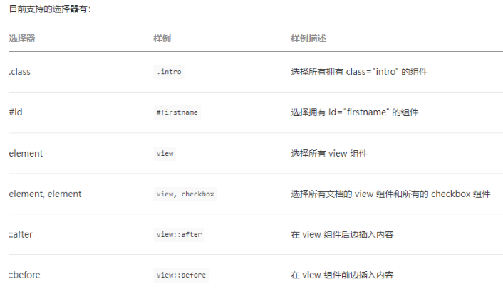
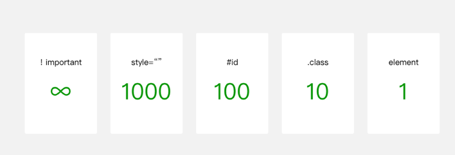
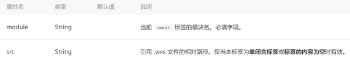

## 一、WXSS编写程序样式

### 1.1.小程序的样式写法

页面样式的三种写法：

- 行内样式、页面样式、全局样式
- 三种样式都可以作用于页面的组件

如果有相同的样式：

- 优先级依次是：行内样式 > 页面样式 > 全局样式

```html
<!-- 1.样式的编写方式 -->
<!-- 1.1.应用全局样式 -->
<view class="title">learn wxss title</view>

<!-- 1.2.页面中的样式 -->
<view class="message">learn wxss message</view>

<!-- 1.3.行内的样式 -->
<view style="color: blue;">inline style</view>

<!-- 2.rpx单位的使用 -->
<view class="item">
  我是文本
</view>
```

```css
/**app.wxss全局样式**/
.title {
  font-size: 30px;
  font-weight: 700;
  color: red;
}
```

### 1.2.WXSS支持的选择器



### 1.3.WXSS优先级

WXSS优先级与CSS类似，权重如图



### 1.4.wxss的扩展 – 尺寸单位

尺寸单位

- rpx（responsive pixel）: 可以根据屏幕宽度进行自适应，规定屏幕宽为750rpx。
- 如在 iPhone6 上，屏幕宽度为375px，共有750个物理像素，则750rpx = 375px = 750物理像素，1rpx =  0.5px = 1物理像素。


```css
.item {
  font-size: 32rpx;
  /* iphone6: 1px === 2rpx */
  width: 200rpx;
  height: 200rpx;
  background-color: #f00;
}
```

> 建议： 开发微信小程序时设计师可以用 iPhone6 作为视觉稿的标准。

## 二、Mustache语法绑定

WXML基本格式：

- 类似于HTML代码：比如可以写成单标签，也可以写成双标签；
- 必须有严格的闭合：没有闭合会导致编译错误
- 大小写敏感：class和Class是不同的属性

开发中, 界面上展示的数据并不是写死的, 而是会根据服务器返回的数据，或者用户的操作来进行改变.

- 如果使用原生 JS 或者 jQuery 的话, 我们需要通过操作DOM来进行界面的更新.
- 小程序和 Vue 一样, 提供了插值语法: Mustache语法(双大括号)

```html
<view>{{ message }}</view>
<view>{{ firstname + " " + lastname }}</view>
<view>{{ date }}</view>
```

```js
data: {
  message: "Hello World",
  firstname: "kobe",
  lastname: "bryant",
  date: new Date().toLocaleDateString(),
},
```

## 三、WXML的条件渲染

### 3.1.逻辑判断 wx:if – wx:elif – wx:else

某些时候, 我们需要根据条件来决定一些内容是否渲染：

- 当条件为true时, view组件会渲染出来
- 当条件为false时, view组件不会渲染出来

```html
<view wx:if="{{score > 90}}">优秀</view>
<view wx:elif="{{score > 80}}">良好</view>
<view wx:elif="{{score >= 60}}">及格</view>
<view wx:else>不及格</view>
```

### 3.2.hidden属性

hidden属性:

- hidden是所有的组件都默认拥有的属性；
- 当hidden属性为true时, 组件会被隐藏；
- 当hidden属性为false时, 组件会显示出来；

hidden和wx:if的区别

- hidden控制隐藏和显示是控制是否添加hidden属性
- wx:if是控制组件是否渲染的

```html
<!-- hidden属性:v-show -->
<!-- 基本使用 -->
<view hidden>我是hidden的view</view>

<!-- 切换案例 -->
<button bindtap="onChangeTap">切换</button>
<view hidden="{{isHidden}}">哈哈哈哈</view>
<view wx:if="{{!isHidden}}">呵呵呵呵</view>
```

```js
onChangeTap() {
  this.setData({
    isHidden: !this.data.isHidden
  })
}
```

## 四、WXML的列表渲染

### 4.1.wx:for基础

为什么使用wx:for？

- 我们知道，在实际开发中，服务器经常返回各种列表数据，我们不可能一一从列表中取出数据进行展示；
- 需要通过for循环的方式，遍历所有的数据，一次性进行展示；

在组件中，我们可以使用wx:for来遍历一个数组 （字符串 - 数字）

- 默认情况下，遍历后在wxml中可以使用一个变量index，保存的是当前遍历数据的下标值。
- 数组中对应某项的数据，使用变量名item获取。

```html
<!-- 4.1.wx:for基本使用 -->
<!-- 遍历data中的数组 -->
<view class="books">
  <view wx:for="{{books}}" wx:key="id">
    <!-- item: 每项内容, index: 每项索引 -->
    {{item.name}}-{{item.price}}
  </view>
</view>

<!-- 遍历数字 -->
<view class="number">
  <view wx:for="{{10}}" wx:key="*this">
    {{ item }}
  </view>
</view>

<!-- 遍历字符串 -->
<view class="str">
  <view wx:for="coderwhy" wx:key="*this">
    {{ item }}
  </view>
</view>
```

### 4.2.block标签

什么是block标签？

- 某些情况下，我们需要使用 wx:if 或 wx:for时，可能需要包裹一组组件标签
- 我们希望对这一组组件标签进行整体的操作，这个时候怎么办呢？

注意：

- `<block/>`并不是一个组件，它仅仅是一个包装元素，不会在页面中做任何渲染，只接受控制属性。

使用block有两个好处：

- 1）将需要进行遍历或者判断的内容进行包裹。
- 2）将遍历和判断的属性放在block便签中，不影响普通属性的阅读，提高代码的可读性。

```html
<!-- 4.2. 细节补充: block-item/index名称-key的使用 -->
<view class="books">
  <block wx:for="{{books}}" wx:key="id" wx:for-item="book" wx:for-index="i">
    <view>{{ book.name }}-{{ book.price }}-{{ i }}</view>
  </block>
</view>
```

### 4.3.item/index名称

默认情况下，item – index的名字是固定的

- 但是某些情况下，我们可能想使用其他名称
- 或者当出现多层遍历时，名字会重复

这个时候，我们可以指定item和index的名称：

### 4.4.key作用

我们看到，使用wx:for时，会报一个警告：

- 这个提示告诉我们，可以添加一个key来提供性能。

为什么需要这个key属性呢？

- 这个其实和小程序内部也使用了虚拟DOM有关系（和Vue、React很相似）。
- 当某一层有很多相同的节点时，也就是列表节点时，我们希望插入、删除一个新的节点，可以更好的复用节点；

wx:key 的值以两种形式提供

- 字符串，代表在 for 循环的 array 中 item 的某个 property，该 property 的值需要是列表中唯一的字符串或数字，且不能动态改变。
- 保留关键字 *this 代表在 for 循环中的 item 本身，这种表示需要 item 本身是一个唯一的字符串或者数字。

## 五、WXS语法基本使用

### 5.1.什么是WXS？

WXS（WeiXin Script）是小程序的一套脚本语言，结合 WXML，可以构建出页面的结构。

- 官方：WXS 与 JavaScript 是不同的语言，有自己的语法，并不和 JavaScript 一致。（不过基本一致）

为什么要设计WXS语言呢？

- 在WXML中是不能直接调用Page/Component中定义的函数的.
- 但是某些情况, 我们可以希望使用函数来处理WXML中的数据(类似于Vue中的过滤器)，这个时候就使用WXS了

WXS使用的限制和特点：

- WXS 不依赖于运行时的基础库版本，可以在所有版本的小程序中运行；
- WXS 的运行环境和其他 JavaScript 代码是隔离的，WXS 中不能调用其他 JavaScript 文件中定义的函数，也不能调用小程序提供的API；
- 由于运行环境的差异，在 iOS 设备上小程序内的 WXS 会比 JavaScript 代码快 2 ~ 20 倍。在 android 设备 上二者运行效率无差异；

### 5.2.WXS的写法

WXS有两种写法：

- 写在`<wxs>`标签中
- 写在以.wxs结尾的文件中

`<wxs>`标签的属性：



每一个 `.wxs` 文件和 `<wxs>` 标签都是一个单独的模块。

- 每个模块都有自己独立的作用域。即在一个模块里面定义的变量与函数，默认为私有的，对其他模块不可见；
- 一个模块要想对外暴露其内部的私有变量与函数，只能通过 module.exports 实现；

```html
<!-- 1.方式一: 标签 -->
<wxs module="format">
  function formatPrice(price) {
    return "¥" + price
  }

  // 必须导出后, 才能被其他地方调用: 必须使用CommonJS导出
  module.exports = {
    formatPrice: formatPrice
  }
</wxs>
```

```html
<!-- 2.方式二: 独立的文件, 通过src引入 -->
<wxs module="format" src="/utils/format.wxs"></wxs>
```

```html
<view class="books">
  <block wx:for="{{books}}" wx:key="id">
    <view>name:{{item.name}}-price:{{format.formatPrice(item.price)}}</view>
  </block>
</view>
```

### 5.3.WXS的练习

```html
<view class="total">总价格: {{format.calcPrice(books)}}</view>

<view class="count">播放量: {{format.formatCount(playCount)}}</view>

<view class="time">
  {{format.formatTime(currentTime)}}/{{format.formatTime(duration)}}
</view>
```

```js
function formatPrice(price) {
  return "¥" + price
}

function calcPrice(books) {
  return "¥" + books.reduce(function(preValue, item) {
    return preValue + item.price
  }, 0)
}

// 对count进行格式化
function formatCount(count) {
  count = Number(count)
  if (count >= 100000000) {
    return (count / 100000000).toFixed(1) + "亿"
  } else if (count >= 10000) {
    return (count / 10000).toFixed(1) + "万"
  } else {
    return count
  }
}

// 2 -> 02
// 24 -> 24
function padLeft(time) {
  time = time + ""
  return ("00" + time).slice(time.length)
}

// 对time进行格式化 100 -> 01:40
function formatTime(time) {
  // 1.获取时间
  var minute = Math.floor(time / 60)
  var second = Math.floor(time) % 60

  // 2.拼接字符串
  return padLeft(minute) + ":" + padLeft(second)
}

// 必须导出后, 才能被其他地方调用: 必须使用CommonJS导出
module.exports = {
  formatPrice: formatPrice,
  calcPrice: calcPrice,
  formatCount: formatCount,
  formatTime: formatTime
}
```


