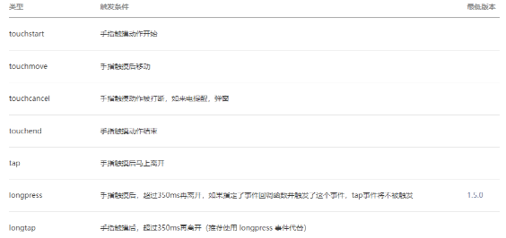
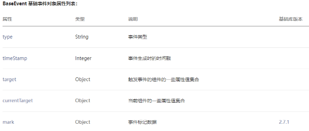
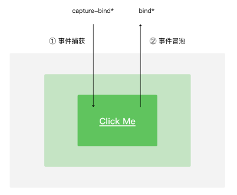

## 一、小程序的事件监听

什么时候会产生事件呢？

- 小程序需要经常和用户进行某种交互，比如点击界面上的某个按钮或者区域，比如滑动了某个区域；
- 事件是视图层到逻辑层的通讯方式；
- 事件可以将用户的行为反馈到逻辑层进行处理；
- 事件可以绑定在组件上，当触发事件时，就会执行逻辑层中对应的事件处理函数；
- 事件对象可以携带额外信息，如 id, dataset, touches；

事件时如何处理呢？

- 事件是通过bind/catch这个属性绑定在组件上的（和普通的属性写法很相似, 以key=“value”形式）；
- key以bind或catch开头, 从1.5.0版本开始, 可以在bind和catch后加上一个冒号；
- 同时在当前页面的Page构造器中定义对应的事件处理函数, 如果没有对应的函数, 触发事件时会报错；
- 比如当用户点击该button区域时，达到触发条件生成事件tap，该事件处理函数会被执行，同时还会收到一个事件对象event。

```html
<!-- 1.事件的基本使用 -->
<button bindtap="onBtnTap">按钮</button>
```

```js
// 绑定事件监听函数
onBtnTap(event) {
  console.log("onBtnTap:", event);
},
```

## 二、常见事件类型划分

某些组件会有自己特性的事件类型，大家可以在使用组件时具体查看对应的文档

- 比如input有bindinput/bindblur/bindfocus等
- 比如scroll-view有bindscrolltowpper/bindscrolltolower等

这里我们讨论几个组件都有的, 并且也比较常见的事件类型：



## 三、事件对象属性分析

### 3.1.事件对象event

当某个事件触发时, 会产生一个事件对象, 并且这个对象被传入到回调函数中, 事件对象有哪些常见的属性呢?



### 3.2.currentTarget和target的区别


### 3.3.touches和changedTouches的区别

1. 在touchend中不同
2. 多手指触摸时不同


## 四、事件参数传递方法

当视图层发生事件时，某些情况需要事件携带一些参数到执行的函数中, 这个时候就可以通过data-属性来完成：

- 格式：data-属性的名称
- 获取：e.currentTarget.dataset.属性的名称

```html
<!-- 4.event的参数传递 -->
<view 
  class="arguments"
  bindtap="onArgumentsTap"
  data-name="why"
  data-age="18"
  data-height="1.88"
>
  参数传递
</view>
```

```js
// 监听事件, 并且传递参数
onArgumentsTap(event) {
  console.log("onArgumentsTap:", event);
  const {
    name,
    age,
    height
  } = event.currentTarget.dataset
  console.log(name, age, height);
},
```

**参数传递的案例练习**

```html
<!-- tab-control案例(重要) -->
<view class="tab-control">
  <block wx:for="{{ titles }}" wx:key="*this">
    <view 
      class="item {{index === currentIndex ? 'active': ''}}"
      bindtap="onItemTap"
      data-index="{{index}}"
    >
      <text class="title">{{ item }}</text>
    </view>
  </block>
</view>
```

```js
data: {
  titles: ["手机", "电脑", "iPad", "相机"],
  currentIndex: 0
},

onItemTap(event) {
  const currentIndex = event.currentTarget.dataset.index
  this.setData({
    currentIndex
  })
},
```

## 五、冒泡和捕获的区别

当界面产生一个事件时，事件分为了捕获阶段和冒泡阶段。



```html
<!-- 5.捕获和冒泡阶段 -->
<view class="view1" capture-bind:tap="onView1CaptureTap" bindtap="onView1Tap">
  <view class="view2" capture-bind:tap="onView2CaptureTap" bindtap="onView2Tap">
    <view class="view3" capture-bind:tap="onView3CaptureTap" bindtap="onView3Tap"></view>
  </view>
</view>

<!-- 将bind替换为catch: 阻止事件仅一步传递(了解) -->
capture-bind => capture-catch

<!-- 8.给逻辑传递数据, 另外一种方式: mark -->
<view class="mark" bindtap="onMarkTap" data-name="why" data-age="18" mark:name="kobe" mark:age="30">
  <text mark:address="洛杉矶" class="title">mark</text>
</view>
```

```js
// 捕获和冒泡过程
onView1CaptureTap() {
  console.log("onView1CaptureTap");
},
onView2CaptureTap() {
  console.log("onView2CaptureTap");
},
onView3CaptureTap() {
  console.log("onView3CaptureTap");
},
onView1Tap() {
  console.log("onView1Tap");
},
onView2Tap() {
  console.log("onView2Tap");
},
onView3Tap() {
  console.log("onView3Tap");
},
    
// onView1CaptureTap
// index.js:60 onView2CaptureTap
// index.js:63 onView3CaptureTap
// index.js:72 onView3Tap
// index.js:69 onView2Tap
// index.js:66 onView1Tap
    
// mark的数据传递
onMarkTap(event) {
  const data1 = event.target.dataset
  const data2 = event.mark
}
```


