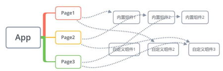
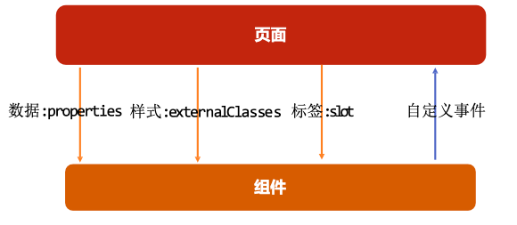
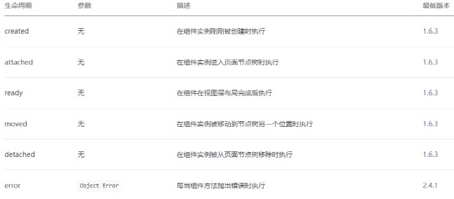
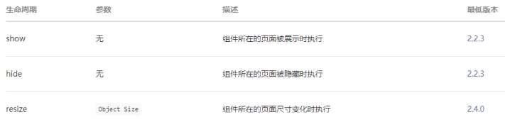
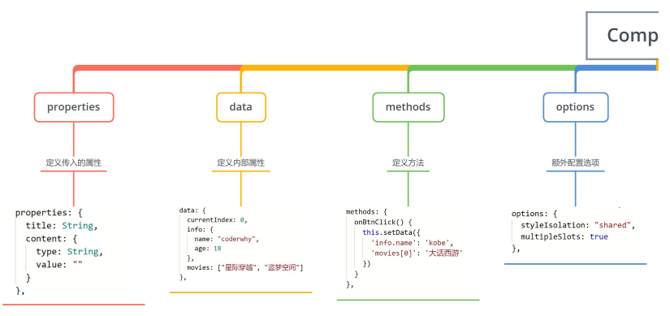
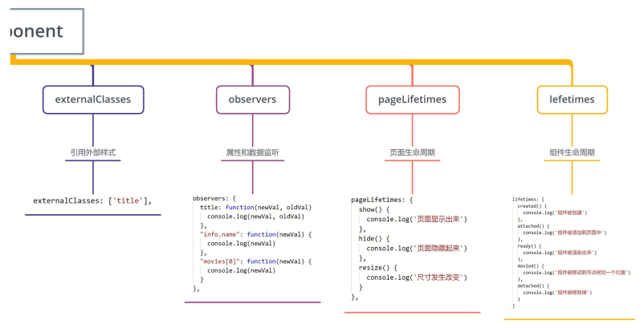

## 一、小程序组件化思想

小程序在刚刚推出时是不支持组件化的, 也是为人诟病的一个点：

- 但是从v1.6.3开始, 小程序开始支持自定义组件开发, 也让我们更加方便的在程序中使用组件化.



组件化思想的应用：

- 有了组件化的思想，我们在之后的开发中就要充分的利用它。
- 尽可能的将页面拆分成一个个小的、可复用的组件。
- 这样让我们的代码更加方便组织和管理，并且扩展性也更强。

## 二、自定义组件的过程

### 2.1.创建一个组件

类似于页面，自定义组件由 json wxml wxss js 4个文件组成。

- 按照我的个人习惯, 我们会先在根目录下创建一个文件夹；
- components, 里面存放我们之后自定义的公共组件；
- 常见一个自定义组件 my-cpn: 包含对应的四个文件；

自定义组件的步骤：

1. 首先需要在 json 文件中进行自定义组件声明（将component 字段设为 true 可这一组文件设为自定义组件）：
2. 在wxml中编写属于我们组件自己的模板
3. 在wxss中编写属于我们组件自己的相关样式
4. 在js文件中, 可以定义数据或组件内部的相关逻辑(后续我们再使用)

```json
{
  "component": true,
  "usingComponents": {}
}
```

```html
<!--components/section-info/section-info.wxml-->
<view class="section">
  <view class="title" bindtap="onTitleTap">{{ title }}</view>
  <view class="content info">{{ content }}</view>
</view>
```

### 2.2.使用自定义组件和细节注意事项

一些需要注意的细节：

- **自定义组件也是可以引用自定义组件的**，引用方法类似于页面引用自定义组件的方式（使用usingComponents 字段）。
- 自定义组件和页面所在项目根目录名 **不能以“wx-”为前缀**，否则会报错。
- 如果在app.json的usingComponents声明某个组件，那么所有页面和组件可以直接使用该组件。

```json
{
  "usingComponents": {
    "section-info": "/components/section-info/section-info",
  }
}
```

```html
<section-info 
  info="abc" 
  title="我与地坛" 
  content="要是有些事情我没说, 别以为是我忘记了"
  bind:titleclick="onSectionTitleClick"
/>
<section-info info="cba" title="黄金时代" content="在我一生中最好的黄金时代, 我想吃, 我想爱"/>
```

### 2.3.组件样式细节

课题一：组件内的样式对外部样式 的影响

- 结论一：组件内的class样式，只对组件wxml内的节点生效, 对于引用组件的Page页面不生效。
- 结论二：组件内不能使用id选择器、属性选择器、标签选择器

课题二：外部样式对组件内样式 的影响

- 结论一：外部使用class的样式，只对外部wxml的class生效，对组件内是不生效的
- 结论二：外部使用了id选择器、属性选择器不会对组件内产生影响
- 结论三：外部使用了标签选择器，会对组件内产生影响

课题三：如何让class可以相互影响

- 在**Component对象**中，可以传入一个options属性，其中options属性中有一个**styleIsolation**（隔离）属性。
- styleIsolation有三个取值：
  - **isolated**表示启用样式隔离，在自定义组件内外，使用 class 指定的样式将不会相互影响（默认取值）；
  - **apply-shared**表示页面 wxss 样式将影响到自定义组件，但自定义组件 wxss 中指定的样式不会影响页面；
  - **shared**表示页面wxss样式将影响自定义组件，自定义组件wxss中指定的样式也会影响页面和其他设置 了

```js
Component({
  options: {
    styleIsolation: "shared"
  }
})
```

## 三、组件的通信

很多情况下，组件内展示的内容（数据、样式、标签），并不是在组件内写死的，而且可以由使用者来决定。



### 3.1.向组件传递数据 - properties

给组件传递数据：

- 大部分情况下，组件只负责布局和样式，内容是由使用组件的对象决定的；
- 所以，我们经常需要从外部传递数据给我们的组件，让我们的组件来进行展示；

如何传递呢？

- 使用properties属性；

支持的类型：

- String、Number、Boolean
- Object、Array、null（不限制类型）

默认值：

- 可以通过value设置默认值；

```js
properties: {
  title: {
    type: String,
    value: "默认标题"
  },
  content: {
    type: String,
    value: "默认内容"
  }
},
```

### 3.2.向组件传递样式 - externalClasses

给组件传递样式：

- 有时候，我们不希望将样式在组件内固定不变，而是外部可以决定样式。

这个时候，我们可以使用externalClasses属性：

1. 在Component对象中，定义externalClasses属性
2. 在组件内的wxml中使用externalClasses属性中的class
3. 在页面中传入对应的class，并且给这个class设置样式

```js
externalClasses: ["info"],
```

```html
<view class="content info">{{ content }}</view>
```

```html
<section-info info="abc" />
<section-info info="cba" title="黄金时代" content="在我一生中最好的黄金时代, 我想吃, 我想爱"/>
```

### 3.3.组件向外传递事件 – 自定义事件

有时候是自定义组件内部发生了事件，需要告知使用者，这个时候可以使用自定义事件：

```html
<!--components/section-info/section-info.wxml-->
<view class="section">
  <view class="title" bindtap="onTitleTap">{{ title }}</view>
  <view class="content info">{{ content }}</view>
</view>
```

```js
methods: {
  onTitleTap() {
    console.log("title被点击了~");
    this.triggerEvent("titleclick", "aaa")
  }
}
```

```html
<section-info 
  info="abc" 
  title="我与地坛" 
  content="要是有些事情我没说, 别以为是我忘记了"
  bind:titleclick="onSectionTitleClick"
/>
```

```js
onSectionTitleClick(event) {
  console.log("区域title发生了点击", event.detail);
},
```

**自定义组件练习**

```html
<!--components/tab-control/tab-control.wxml-->
<view class="tab-control">
  <block wx:for="{{ titles }}" wx:key="*this">
    <view class="item {{index === currentIndex ? 'active': ''}}" bindtap="onItemTap" data-index="{{index}}">
      <text class="title">{{ item }}</text>
    </view>
  </block>
</view>
```

```js
// components/tab-control/tab-control.js
Component({
  properties: {
    titles: {
      type: Array,
      value: []
    }
  },

  data: {
    currentIndex: 0
  },

  methods: {
    onItemTap(event) {
      const currentIndex = event.currentTarget.dataset.index
      this.setData({
        currentIndex
      })

      // 自定义事件
      this.triggerEvent("indexchange", currentIndex)
    },
      
    test(index) {
      console.log("tab control test function exec");
      this.setData({
        currentIndex: index
      })
    }
  }
})
```

```html
<!-- tab-control的使用 -->
<tab-control
  class="tab-control"
  titles="{{digitalTitles}}"
  bind:indexchange="onTabIndexChange"
/>

<button bindtap="onExecTCMethod">调用TC方法</button>
<tab-control titles="{{['流行', '新款', '热门']}}"/>
```

```js
// pages/07_learn_cpns/index.js
Page({
  data: {
    digitalTitles: ['电脑', '手机', 'iPad']
  },
  onTabIndexChange(event) {
    const index = event.detail
    console.log("点击了", this.data.digitalTitles[index]);
  },
    
  onExecTCMethod() {
    // 1.获取对应的组件实例对象
    const tabControl = this.selectComponent(".tab-control")

    // 2.调用组件实例的方法
    tabControl.test(2)
  }
})
```

### 3.4.页面直接调用组件方法

可在父组件里调用 this.selectComponent ，获取子组件的实例对象。

- 调用时需要传入一个匹配选择器 selector，如：`this.selectComponent(".my-component")`。

## 四、组件插槽定义使用

### 4.1.什么是插槽？

slot翻译为插槽：

- 在生活中很多地方都有插槽，电脑的USB插槽，插板当中的电源插槽。
- 插槽的目的是让我们原来的设备具备更多的扩展性。
- 比如电脑的USB我们可以插入U盘、硬盘、手机、音响、键盘、鼠标等等。

组件的插槽：

- 组件的插槽也是为了让我们封装的组件更加具有扩展性。
- 让使用者可以决定组件内部的一些内容到底展示什么。

### 4.2.单个插槽的使用

除了内容和样式可能由外界决定之外，也可能外界想决定显示的方式

- 比如我们有一个组件定义了头部和尾部，但是中间的内容可能是一段文字，也可能是一张图片，或者是一个进 度条。
- 在不确定外界想插入什么其他组件的前提下，我们可以在组件内预留插槽：

```html
<!--components/my-slot/my-slot.wxml-->
<view class="my-slot">
  <view class="header">Header</view>
  <view class="content">
    <!-- 小程序中插槽是不支持默认值的 -->
    <slot></slot>
  </view>
  <view class="default">哈哈哈哈</view>
  <view class="footer">Footer</view>
</view>
```

```css
/* components/my-slot/my-slot.wxss */
.my-slot {
  margin: 20px 0;
}

.default {
  display: none;
}

.content:empty + .default {
  display: block;
}
```

```html
<!--pages/08_learn_slot/index.wxml-->
<!-- 单个插槽的使用 -->
<my-slot>
  <button>我是按钮</button>
</my-slot>
<my-slot>
  <image src="/assets/nhlt.jpg" mode="widthFix"></image>
</my-slot>

<my-slot></my-slot>
```

### 4.3.多个插槽的使用

有时候为了让组件更加灵活, 我们需要定义多个插槽：

```html
<!--components/mul-slot/mul-slot.wxml-->
<view class="mul-slot">
  <view class="left">
    <slot name="left"></slot>
  </view>
  <view class="center">
    <slot name="center"></slot>
  </view>
  <view class="right">
    <slot name="right"></slot>
  </view>
</view>
```

```js
// components/mul-slot/mul-slot.js
Component({
  options: {
    multipleSlots: true
  }
})
```

```html
<!-- 2.多个插槽的使用 -->
<mul-slot>
  <button slot="left" size="mini">left</button>
  <view slot="center">哈哈哈</view>
  <button slot="right" size="mini">right</button>
</mul-slot>
```

### 4.4.behaviors

behaviors 是用于组件间代码共享的特性，类似于一些编程语言中的 “mixins”。

- 每个 behavior 可以包含一组属性、数据、生命周期函数和方法；
- 组件引用它时，它的属性、数据和方法会被合并到组件中，生命周期函数也会在对应时机被调用；
- 每个组件可以引用多个 behavior ，behavior 也可以引用其它 behavior ；

```html
<!--components/c-behavior/c-behavior.wxml-->
<view>
  <view class="counter">当前计数: {{counter}}</view>
  <button bindtap="increment">+1</button>
  <button bindtap="decrement">-1</button>
</view>
```

```js
// /behaviors/counter.js
export const counterBehavior = Behavior({
  data: {
    counter: 100
  },
  methods: {
    increment() {
      this.setData({
        counter: this.data.counter + 1
      })
    },
    decrement() {
      this.setData({
        counter: this.data.counter - 1
      })
    }
  }
})
```

```js
// components/c-behavior/c-behavior.js
import {
  counterBehavior
} from "../../behaviors/counter"

Component({
  behaviors: [counterBehavior]
})
```

### 4.5.组件的生命周期

组件的生命周期，指的是组件自身的一些函数，这些函数在特殊的时间点或遇到一些特殊的框架事件时被自动触发。

- 其中，最重要的生命周期是 created attached detached ，包含一个组件实例生命流程的最主要时间点。

自小程序基础库版本 2.2.3 起，组件的的生命周期也可以在 lifetimes 字段内进行声明（这是推荐的方式，其优先级最高）。



```js
// components/c-lifetime/c-lifetime.js
Component({
  lifetimes: {
    created() {
      console.log("组件被创建created");
    },
    attached() {
      console.log("组件被添加到组件树中attached");
    },
    detached() {
      console.log("组件从组件树中被移除detached");
    }
  },
  pageLifetimes: {
    show() {
      console.log("page show");
    },
    hide() {
      console.log("page hide");
    }
  }
})
```

### 4.6.组件所在页面的生命周期

还有一些特殊的生命周期，它们并非与组件有很强的关联，但有时组件需要获知，以便组件内部处理。

- 样的生命周期称为“组件所在页面的生命周期”，在 pageLifetimes 定义段中定义。

其中可用的生命周期包括：



## 五、Component构造器






