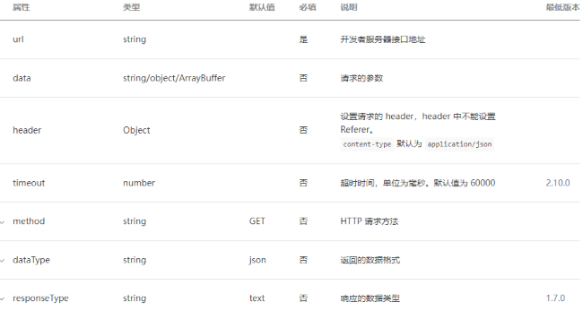
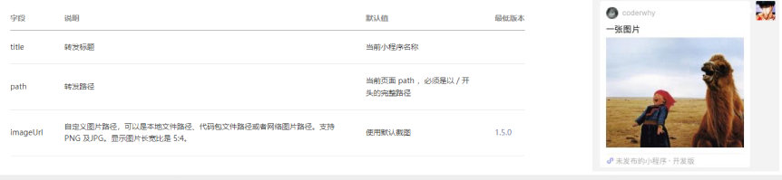
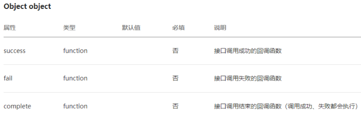
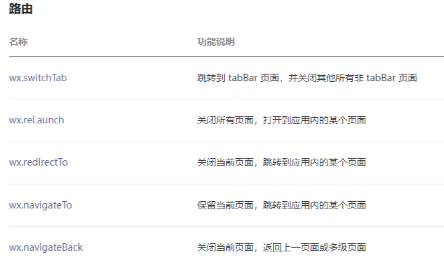
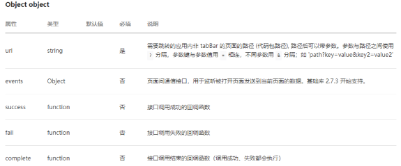
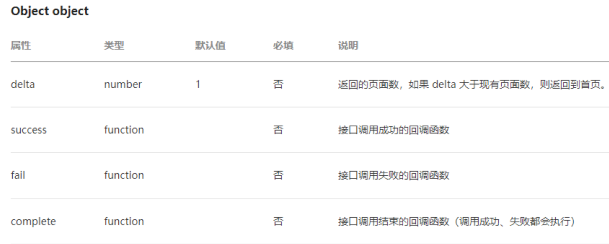
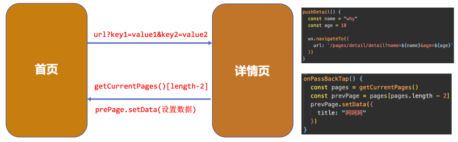
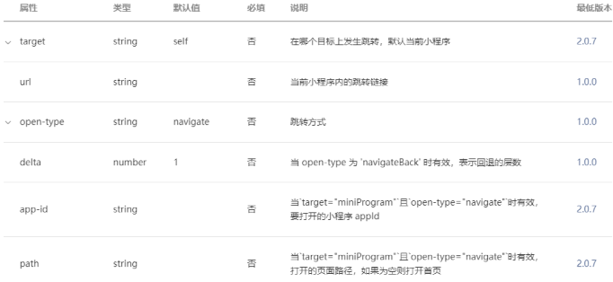
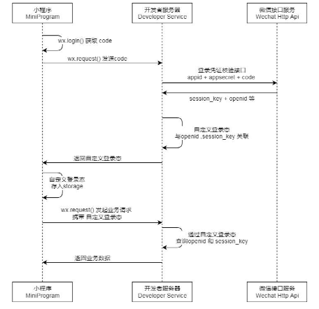

## 一、网络请求API和封装

### 1.1.网络请求 – API参数

微信提供了专属的API接口,用于网络请求: `wx.request(Object object)`



比较关键的几个属性解析:

- url: 必传, 不然请求什么
- data: 请求参数
- method: 请求的方式
- success: 成功时的回调
- fail: 失败时的回调

### 1.2.网络请求 – API使用

直接使用`wx.request(Object object)`发送请求：

```js
async onLoad() {
  // 网络请求基本使用
  wx.request({
    url: "http://codercba.com:1888/api/city/all",
    success: (res) => {
      const data = res.data.data
      this.setData({
        allCities: data
      })
    },
    fail: (err) => {
      console.log("err:", err);
    }
  })

  wx.request({
    url: 'http://codercba.com:1888/api/home/houselist',
    data: {
      page: 1
    },
    success: (res) => {
      const data = res.data.data
      this.setData({
        houselist: data
      })
    }
  })
},
```

### 1.3.网络请求 – API封装

```js
// 封装成函数
export function hyRequest(options) {
  return new Promise((resolve, reject) => {
    wx.request({
      ...options,
      success: (res) => {
        resolve(res.data)
      },
      fail: reject
    })
  })
}
```

```js
// 使用封装的函数
hyRequest({
  url: "http://codercba.com:1888/api/city/all"
}).then(res => {
  this.setData({
    allCities: res.data
  })
})

// await/async
const houseRes = await hyRequest({
  url: "http://codercba.com:1888/api/home/houselist",
  data: {
    page: 1
  }
})
this.setData({
  houselist: houseRes.data
})
```


```js
// 封装成类 -> 实例
class HYRequest {
  constructor(baseURL) {
    this.baseURL = baseURL
  }
  request(options) {
    const {
      url
    } = options
    return new Promise((resolve, reject) => {
      wx.request({
        ...options,
        url: this.baseURL + url,
        success: (res) => {
          resolve(res.data)
        },
        fail: (err) => {
          console.log("err:", err);
        }
      })
    })
  }
  get(options) {
    return this.request({
      ...options,
      method: "get"
    })
  }
  post(options) {
    return this.request({
      ...options,
      method: "post"
    })
  }
}

export const hyReqInstance = new HYRequest("http://codercba.com:1888/api")
export const hyLoginReqInstance = new HYRequest("http://123.207.32.32:3000")
```

```js
// 使用类的实例发送请求
hyReqInstance.get({
  url: "/city/all"
}).then(res => {
  console.log(res);
})
```

### 1.4.网络请求域名配置

每个微信小程序需要事先设置通讯域名，小程序只可以跟指定的域名进行网络通信。

- 小程序登录后台 – 开发管理 – 开发设置 – 服务器域名；

服务器域名请在 「小程序后台 - 开发 - 开发设置 - 服务器域名」 中进行配置，配置时需要注意：

- 域名只支持 https (wx.request、wx.uploadFile、wx.downloadFile) 和 wss (wx.connectSocket) 协议；
- 域名不能使用 IP 地址（小程序的局域网 IP 除外）或 localhost；
- 可以配置端口，如 https://myserver.com:8080，但是配置后只能向 https://myserver.com:8080 发起请求。如果向https://myserver.com、https://myserver.com:9091 等 URL 请求则会失败。
- 如果不配置端口。如 https://myserver.com，那么请求的 URL 中也不能包含端口，甚至是默认的 443 端口也不可以。如果向 https://myserver.com:443 请求则会失败。
- 域名必须经过 ICP 备案；
- 出于安全考虑，api.weixin.qq.com 不能被配置为服务器域名，相关 API 也不能在小程序内调用。 开发者应将 AppSecret保存到后台服务器中，通过服务器使用 getAccessToken 接口获取 access_token，并调用相关 API；
- 不支持配置父域名，使用子域名。

## 二、展示弹窗和页面分享

### 2.1.展示弹窗效果

小程序中展示弹窗有四种方式: showToast、showModal、showLoading、showActionSheet


```js
wx.showToast({
  title: '购买失败!',
  icon: "error",
  duration: 5000,
  mask: true,
  success: (res) => {
    console.log("res:", res);
  },
  fail: (err) => {
    console.log("err:", err);
  }
})
```


```js
wx.showLoading({
  title: "加载中ing"
})
```


```js
wx.showModal({
  title: "确定购买吗?",
  content: "确定购买的话, 请确定您的微信有钱!",
  confirmColor: "#f00",
  cancelColor: "#0f0",
  success: (res) => {
    if (res.cancel) {
      console.log("用户点击取消");
    } else if (res.confirm) {
      console.log("用户点击了确定");
    }
  }
})
```


```js
wx.showActionSheet({
  itemList: ["衣服", "裤子", "鞋子"],
  success: (res) => {
    console.log(res.tapIndex);
  },
  fail: (err) => {
    console.log("err:", err);
  }
})
```

### 2.2.分享功能

分享是小程序扩散的一种重要方式，小程序中有两种分享方式：

- 方式一：点击右上角的菜单按钮，之后点击转发
- 方式二：点击某一个按钮，直接转发

当我们转发给好友一个小程序时，通常小程序中会显示一些信息：

- 如何决定这些信息的展示呢？通过 onShareAppMessage
- 监听用户点击页面内转发按钮（button 组件 open-type="share"）或右上角菜单“转发”按钮的行为，并自定义转发内容。
- 此事件处理函数需要 return 一个 Object，用于自定义转发内容；



```js
onShareAppMessage() {
  return {
    title: "旅途的内容",
    path: "/pages/favor/favor",
    imageUrl: "/assets/nhlt.jpg"
  }
},
```

## 三、设备信息和位置信息

### 3.1.获取设备信息

在开发中，我们需要经常获取当前设备的信息，用于手机信息或者进行一些适配工作。

- 小程序提供了相关个API：`wx.getSystemInfo(Object object)`



```js
wx.getSystemInfo({
  success: (res) => {
    console.log(res);
  }
})
```


### 3.2.获取位置信息

开发中我们需要经常获取用户的位置信息，以方便给用户提供相关的服务：

- 我们可以通过API获取：`wx.getLocation(Object object)`

```js
wx.getLocation({
  success: (res) => {
    console.log("res:", res);
  }
})
```


对于用户的关键信息，需要获取用户的授权后才能获得：

- https://developers.weixin.qq.com/miniprogram/dev/reference/configuration/app.html#permission

```json
// app.json
"permission": {
  "scope.userLocation": {
    "desc": "需要获取您的位置信息"
  }
},
```

## 四、小程序Storage存储

在开发中，某些常见我们需要将一部分数据存储在本地：比如token、用户信息等。

- 小程序提供了专门的Storage用于进行本地存储。

同步存取数据的方法：

- `wx.setStorageSync(string key, any data)`
- `wx.getStorageSync(string key)`
- `wx.removeStorageSync(string key)`
- `wx.clearStorageSync()`

```js
// 1.存储一些键值对
wx.setStorageSync('name', "why")
wx.setStorageSync('age', 18)
wx.setStorageSync('friends', ["abc", "cba", "nba"])

// 2.获取storage中内容
const name = wx.getStorageSync('name')
const age = wx.getStorageSync('age')
const friends = wx.getStorageSync('friends')

// 3.删除storage中内容
wx.removeStorageSync('name')

// 4.清空storage中内容
wx.clearStorageSync()
```

异步存储数据的方法：

- `wx.setStorage(Object object)`
- `wx.getStorage(Object object)`
- `wx.removeStorage(Object object)`
- `wx.clearStorage(Object object)`

```js
wx.setStorage({
  key: "books",
  data: "哈哈哈",
  encrypt: true,
  success: (res) => {
    wx.getStorage({
      key: "books",
      encrypt: true,
      success: (res) => {
        console.log(res);
      }
    })
  }
})
```

## 五、页面跳转和数据传递

### 5.1.界面跳转的方式

面的跳转有两种方式：通过navigator组件 和 通过wx的API跳转

 这里我们先以wx的API作为讲解：



### 5.2.页面跳转 - navigateTo

wx.navigateTo(Object object)

- 保留当前页面，跳转到应用内的某个页面；
- 但是不能跳到 tabbar 页面；



```js
Page({
  data: {
    name: "kobe",
    age: 30,
    message: "哈哈哈"
  },

  onNavTap() {
    const name = this.data.name
    const age = this.data.age
    // 页面导航操作
    wx.navigateTo({
      // 跳转的过程, 传递一些参数过去
      url: `/pages2/detail/detail?name=${name}&age=${age}`,
      events: {
        backEvent(data) {
          console.log("back:", data);
        },
        coderwhy(data) {
          console.log("why:", data);
        }
      }
    })
  }
})
```

### 5.3.页面返回 - navigateBack

wx.navigateBack(Object object)

- 关闭当前页面，返回上一页面或多级页面。



```js
wx.navigateBack()
```

### 5.4.页面跳转 - 数据传递

如何在界面跳转过程中我们需要相互传递一些数据，应该如何完成呢？

- 首页 -> 详情页：使用URL中的query字段
- 详情页 -> 首页：在详情页内部拿到首页的页面对象，直接修改数据

```js
onLoad(options) {
  const name = options.name
  const age = options.age
  this.setData({
    name,
    age
  })
},
```

```js
onUnload() {
  // 1.1. 获取到上一个页面的实例
  const pages = getCurrentPages()
  const prePage = pages[pages.length - 2]

  // 1.2.通过setData给上一个页面设置数据
  prePage.setData({
    message: "呵呵呵"
  })
}
```



早期数据的传递方式只能通过上述的方式来进行，在小程序基础库 2.7.3 开始支持events参数，也可以用于数据的传递。


```js
// 2.方式二: 回调events的函数
// 2.1. 拿到eventChannel
const eventChannel = this.getOpenerEventChannel()

// 2.2. 通过eventChannel回调函数
eventChannel.emit("backEvent", {
  name: "back",
  age: 111
})
eventChannel.emit("coderwhy", {
  name: "why",
  age: 10
})
```

### 5.5.界面跳转的方式

navigator组件主要就是用于界面的跳转的，也可以跳转到其他小程序中：



```html
<navigator class="nav" url="/pages2/detail/detail?name=why&age=18">跳转</navigator>
```

## 六、小程序登录流程演练

### 6.1.小程序登录解析

为什么需要用户登录？

- 增加用户的粘性和产品的停留时间；

如何识别同一个小程序用户身份？

- 认识小程序登录流程
- openid和unionid
- 获取code
- 换取authToken

用户身份多平台共享

- 账号绑定
- 手机号绑定

```js
import { getCode } from "../../service/login";
import { hyLoginReqInstance } from "../../service/index"

// pages/12_learn_login/index.js
Page({
  // onLoad登录的流程
  async onLoad() {
    // 1.获取token, 判断token是否有值
    const token = wx.getStorageSync('token') || ""

    // 2.判断token是否过期
    const res = await hyLoginReqInstance.post({
      url: "/auth",
      header: {
        token: token
      }
    })

    // 2.如果token有值
    if (token && res.message === "已登录") {
      console.log("请求其他的数据");
    } else {
      this.handleLogin()
    }
  },

  async handleLogin() {
    // 1.获取code
    const code = await getCode()

    // 2.使用code换取token
    const res = await hyLoginReqInstance.post({
      url: "/login",
      data: { code }
    })

    // 3.保存token
    wx.setStorageSync('token', res.token)
  }
})
```

```js
export function getCode() {
  return new Promise((resolve, reject) => {
    wx.login({
      success: (res) => {
        resolve(res.code)
      }
    })
  })
}
```


### 6.2.小程序用户登录的流程




