## 1、邂逅数据可视化

### 1.1、邂逅数据可视化

数据可视化（英语：Data visualization），主要旨在借助于图形化手段，清晰有效地传达与沟通信息。

- 为了清晰有效地传递信息，数据可视化通常使用柱状图、折线图、饼图、玫瑰图、散点图等图形来传递信息。
- 也可以使用点、线、面、地图来对数字数据进行编码展示，以便在视觉上快速传达关键信息。
- 可视化可以帮助用户分析和推理数据，让复杂的数据更容易理解和使用，有利于做出决策。

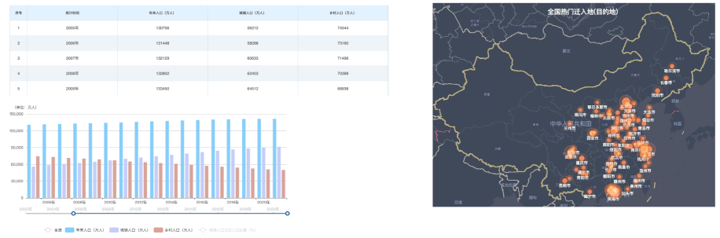

### 1.2、可视化 - 发展过程

**可视化-萌芽阶段**

17世纪以前

- 早在17世纪以前，可视化就开始萌芽了，其中最早的地图在公元前6200年于土耳其地区出现。
- 现代考古发现我国最早的地图实物，是出土于甘肃天水放马滩战国墓地一号墓中的《放马滩地图》

17-19世纪

- 17世纪末随着几何兴起、坐标系、以及人口统计学开端，人类开始了可视化思考的新模式，从此标记可视化的开端。
- 1800-1849年：随着工艺设计的完善，统计图形爆炸性增长，包括柱状图, 饼图, 直方图, 折线图等。
- 1826年，查尔斯·杜品发明了使用连续黑白底纹来显示法国识字分布，这可能是第一张现代形式主题统计地图。

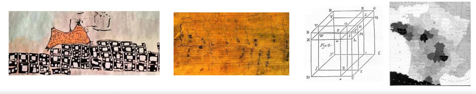

**可视化-黄金阶段**

19世纪中

- 1850-1899：人们开始认识到数字信息对社会计划，工业化，商业和运输的重要性，此时统计理论开始诞生。
- 1869年查尔斯·约瑟夫·米纳德，发布的拿破仑对1812年俄罗斯东征事件流图，被誉为有史以来最好的数据可视化。
  - 他的流图呈现了拿破仑军队的位置和行军方向、军队汇集、分散和重聚的时间和地点等信息。
- 1879年 Luigi Perozzo 绘制立体图（三维人口金字塔）。标记着可视化开始进入了三维立体图。

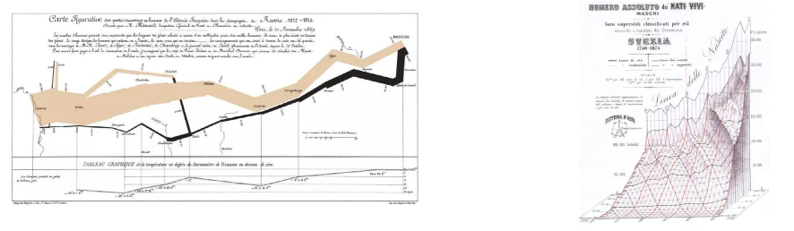

**可视化-重生阶段**

20世纪

- 1950-1974年：引领这次大潮的，首先是一个划时代的事件——计算机的诞生。
- 计算机的出现彻底地改变了数据分析工作，计算机高分辨率和交互式的图形分析，提供了手绘时代无法实现的表现能力。
- 随着统计应用的发展，数理统计把数据可视化变成了一门科学（如：计算机图形学、统计学、分析学），并运用到各行各业。
- 1969年 John W. Tukey 在探索数据分析的图形时，发明箱型图。
- 1982年乔治·罗里克（George Rorick）绘制彩色天气图开创了报纸上的彩色信息图形时代。
- 1996年 Jason Dykes 发明了制图工具：一种地图可视化工具包，可以实时查看数据的图形工具。

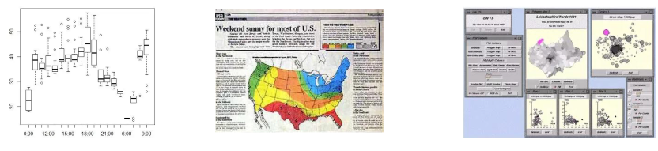

**可视化 -分析学阶段**

2004年至今

- 以前可视化难以应对海量、高维、多源的动态数据的分析，进入21世纪，随着计算机的升级，对于以前难以应对数据，可以借用计算机来综合可视化、图形学、数据挖掘理论与方法来研究新的科学理论模型。通过这种模型来辅助用户从海量、复杂、矛盾的数据中快速挖掘出有用的数据，做出有效决策，这门新兴学科称为可视化分析学。
- 可视化分析现在已大量应用在地图、物流、电力、水利、环保、交通、医学、监控、预警等领域。可视化分析降低了数据理解的难度，突破了常规统计分析的局限性。如下交通拥挤分析图。随着大数据的应用，如今可视化开发也变得越来越重要了。

### 1.3、数据可视化-应用

随着近几年大数据的快速发展，数据可视化技术也迅速被普及。目前数据可视化的应用非常广：

- 如淘宝双十一活动时，借助于数据可视化展示公司实时交易数额，并可以实时动态观察。
- 交管部门可实现对交通形态、卡口数据统计、违章分析、警力部署、出警分析、行车轨迹分析等智能交通大数据分析。
- 企业各层可以借助数据可视化工具，可以直接在手机等设备上远程查看业务运营数据状况和关键指标。
- 医院可以利用数据可视化工具，对医疗卫生数据进行可视化分析和研究应用，进而获取医疗卫生数据隐藏的价值。
- 等等

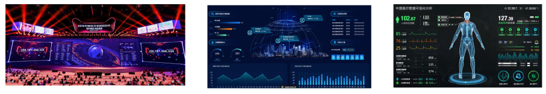

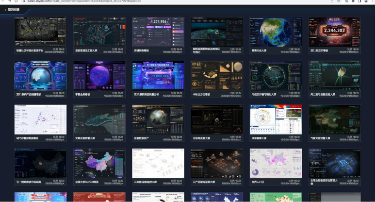

### 1.4、可视化-解决方案

前端可视化技术

- 底层图形引擎： Skia 、OpenGL 等。
- W3C提供：CSS3、Canvas、SVG、WebGL。
- 第三方的可视化库： ZRender、Echarts、 AntV 、Highcharts、D3.js 、Three.js 和 百度地图、高德地图等等。
- 低代码可视化平台：阿里云（DataV）、腾讯云图、网易有数（EasyScreen）、帆软等。

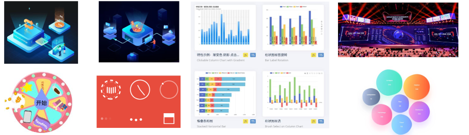

**低代码平台 阿里云（DataV）**

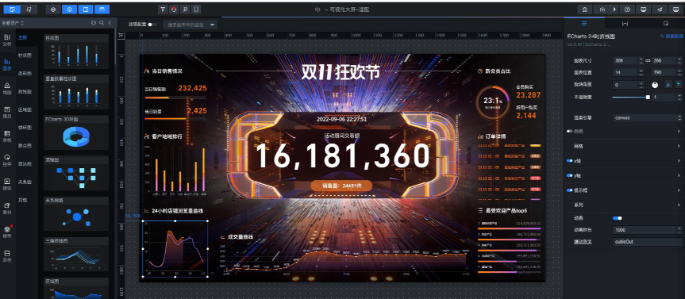

## 2、2D动画

### 2.1、2D动画 - transform

CSS3 transform属性允许你旋转，缩放，倾斜或平移给定元素。

Transform是形变的意思（通常也叫变换），transformer就是变形金刚

常见的函数transform function有：

- 平移：translate(x, y)
- 缩放：scale(x, y)
- 旋转：rotate(deg)
- 倾斜：skew(deg, deg)

通过上面的几个函数，我们就可以改变某个元素的2D形变

### 2.2、坐标系

CSS3 transform属性允许你在二维或三维空间中直观地变换元素。

- transform属性会转换元素的坐标系，使元素在空间中转换。
- 用transform属性变换的元素会受`transform-origin`属性值的影响，该属性用于**指定形变的原点**。

元素的坐标系

- CSS 中的每个元素都有一个坐标系，其原点位于元素的左上角，左上角这被称为初始坐标系。
- 用transform时，坐标系的原点默认会移动到元素的中心。
- 因为transform-origin属性的默认值为50% 50%，即该原点将会作为变换元素的中心点。
- 用transform属性旋转或倾斜元素，会变换或倾斜元素的坐标系。并且该元素所有后续变换都将基于新坐标系的变换。
- 因此，transform属性中变换函数的顺序非常重要——不同的顺序会导致不同的变换结果。

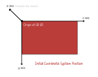

例如：

- 如果将一个元素绕 y 轴旋转 90 度，那么它的 x 轴将指向屏幕内部，即远离你。
  - 此时如再沿着 x 轴平移，元素不会向右移动，它会向内远离我们。
- 因此，要注意编写转换函数的顺序，其中transform属性中的第一个函数将首先应用，最后一个函数将最后应用。

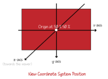

```css
transform: translateX(100px) rotate(45deg);
transform: rotate(45deg) translateX(100px);
```

### 2.3、transform-origin

transform-origin：变形的原点（即坐标系0 , 0点）

- 一个值：
  - 设置 x轴 的原点， y轴为默认值 50%。
- 两个值：
  - 设置 x轴 和 y轴 的原点
- 三个值：
  - 设置 x轴、 y轴 和 z轴 的原点
- 必须是`<length>`，`<percentage>`，或 left, center, right, top, bottom关键字中的一个
  - left, center, right, top, bottom关键字
  - length：从左上角开始计算
  - 百分比：参考元素本身大小

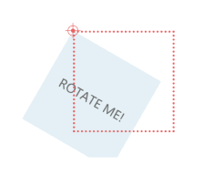

```css
transform: rotate(45deg);
/* left -> 0, 50% */
/* bottom -> 50%, 100% */
/* 修改坐标的原点 */
transform-origin: bottom;
```

## 3、3D动画

### 3.1、3D动画 - transform

CSS3 transform属性不但允许你进行2D的旋转，缩放或平移指定的元素，还支持3D变换元素。

常见的函数transform function有：

- 平移：translate3d(tx, ty, tz)
  - translateX(tx) 、translateY(ty)、translateZ(tz)
- 缩放：scale3d(sx, sy, sz)
  - scaleX(sy)、scaleY(sy)、scaleZ(sz)、
- 旋转：rotate3d(x, y, z, a)
  - rotateX(x)、rotateY(y)、rotateZ(z)

通过上面的几个函数，我们可以改变某个元素的3D形变。

3D形变函数会创建一个合成层来启用GPU硬件加速，比如： translate3d、 translateZ、 scale3d 、 rotate3d ...


### 3.2、3D旋转 - rotateZ 、rotateX、rotateY

旋转：rotateX(deg)、rotateY(deg)、rotateZ(deg)

- 该CSS函数定义一个变换，它将元素围绕固定轴旋转。旋转量由指定的角度确定; 为正，旋转将为顺时针，为负，则为逆时针。

值个数

- 只有一个值，表示旋转的角度（单位deg）

值类型：

- deg：`<angle>` 类型，表示旋转角度（不是弧度）。
- 正数为顺时针
- 负数为逆时针

简写：rotate3d(x, y, z, deg)

注意：旋转的原点受 transform-origin 影响

```css
transform: rotateX(-33.5deg) rotateY(45deg);
```


### 3.3、3D旋转 - rotate3d

旋转：rotate3d(x, y, z, a)

- 该CSS 函数定义一个变换，它将元素围绕固定轴旋转。旋转量由指定的角度定义; 为正，运动将为顺时针，为负，则为逆时针。

值个数

- 一个值时，表示 z轴 旋转的角度
- 四个值时，表示在 3D 空间之中，旋转有 x,y,z 个旋转轴和一个旋转角度。

值类型：

- x：`<number>` 类型，可以是 0 到 1 之间的数值，表示旋转轴 X 坐标方向的矢量( 用来计算形变矩阵中的值 )。
- y：`<number>` 类型，可以是 0 到 1 之间的数值，表示旋转轴 Y 坐标方向的矢量。
- z：`<number>` 类型，可以是 0 到 1 之间的数值，表示旋转轴 Z 坐标方向的矢量。
- a：`<angle>` 类型，表示旋转角度。正的角度值表示顺时针旋转，负值表示逆时针旋转。

注意：旋转的原点受transform-origin影响

```css
transform: rotate3d(1, 0, 0, 45deg);
```


### 3.4、3D旋转 - rotateXYZ VS rotate3d

旋转函数，最终会生成一个4*4的矩阵

- rotatex(50deg)is equivalent to rotate3d(1,0,0,50deg)
- rotateY(20deg)is equivalent to rotate3d(0,1,0,20deg)
- rotateZ(15deg)is equivalent to rotate3d(0,0,1,15deg)

S0.…

- rotatex(50deg) rotateY(20deg) rotateZ(15deg)  
- is equivalent to 
- rotate3d(1,0,0,50deg) rotate3d(0,1,0,20deg) rotate3d(0,0,1,15deg)

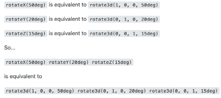

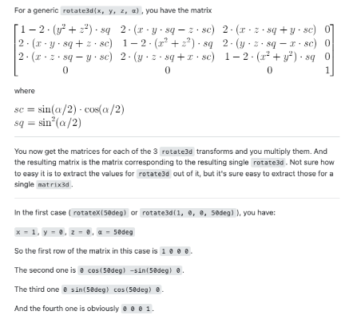

### 3.5、3D透视 - perspective

透视：perspective

- 定了观察者与 z=0 平面的距离，使具有三维位置变换的元素产生透视效果（z表示Z轴）。
- z>0 的三维元素比正常的大，而 z<0 时则比正常的小，大小程度由该属性的值决定。

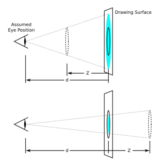

值个数

- 只有一个值，表示观察者距离 z=0 的平面距离 和 none

必须是`<none>` ` <length>`中的一个

- none：没有应用 perspective 样式时的默认值。
- length：定观察者距离 z=0 平面的距离(如右图d的距离，单位px)。
  - 为元素及其内容应用透视变换。当值为 0 或负值时，无透视变换。

透视的两种使用方式：

- 1.在父元素上定义 CSS 透视属性
- 2.如果它是子元素或单元素子元素，可以使用函数 perspective()

透视演练场：

- https://codepen.io/mburakerman/pen/wrZKwe
- https://codepen.io/enxaneta/pen/ZQbNMx

```css
.box {
  position: relative;
  width: 200px;
  height: 100px;
  background-color: skyblue;

  /* 在父元素添加透视效果 */
  perspective: 200px;
}

.item {
  position: absolute;
  top: 0;
  left: 0;
  width: 100%;
  height: 100%;
  background-color: pink;
  /* 形变 */
  transform: rotateY(60deg);
}
```

```html
<div class="box">
  div
  <div class="item">10</div>
</div>
```


```css
.box {
  position: relative;
  width: 200px;
  height: 100px;
  background-color: skyblue;

  /* 在当前元素中直接添加透视效果 */
  transform: perspective(200px) rotateY(60deg);
}
```


### 3.6、3D位移 - translateX、translateY、translateZ

平移：translateX(x)、translateY(y)、translateZ(z)

- 该函数表示在二、三维平面上移动元素。

值个数

- 只有一个值，设置对应轴上的位移

值类型：

- 数字：100px
- 百分比：参照元素本身（ refer to the size of bounding box ）

```css
/* 形变 */
transform: translateX(100px) translateY(100px);

/* 简写 */
transform: translate3d(100px, 100px, 0);

transform: perspective(300px) translateZ(200px);
```

### 3.7、3D位移 - translate3d

平移：translate3d(tx, ty, tz)

- 该CSS 函数在 3D 空间内移动一个元素的位置。这个移动由一个三维向量来表达，分别表示他在三个方向上移动的距离。

值个数

- 三个值时，表示在 3D 空间之中， tx, ty, tz 分别表示他在三个方向上移动的距离。

值类型：

- tx：是一个` <length>` 代表移动向量的横坐标。
- ty：是一个`<length>` 代表移动向量的纵坐标。
- tz：是一个 `<length>` 代表移动向量的 z 坐标。它不能是`<percentage>` 值；那样的移动是没有意义的。

注意：

- translateX(tx)等同于 translate(tx, 0) 或者 translate3d(tx, 0, 0)。
- translateY(ty) 等同于translate(0, ty) 或者 translate3d(0, ty, 0)。
- translateZ(zx)等同于 translate3d(0, 0, tz)。

### 3.8、3D缩放 - scaleX、scaleY、scaleZ

缩放：scaleX、scaleY、scaleZ

- 函数指定了一个沿 x、y 、z轴调整元素缩放比例因子。

值个数

- 一个值时，设置对应轴上的缩放（无单位）

值类型：

- 数字：
  - 1：保持不变
  - 2：放大一倍
  - 0.5：缩小一半
- 百分比：不支持百分比

```css
.box {
  width: 200px;
  height: 100px;
  background-color: skyblue;
  transform-origin: 0 0;

  /* 形变 */
  transform: scaleX(2) scaleY(2);
    
  /* 简写 */
  transform: scale3d(2, 2, 1);
}
```

### 3.9、3D缩放 - scale3d

缩放：scale3d(sx,  sy，sz)

- 该CSS函数定义了在 3D 空间中调整元素的缩放比例因子 。。

值个数

- 三个值时，表示在 3D 空间之中， sx, sy, sz 分别表示他在三个方向上缩放的向量。

值类型：

- sx：是一个<number>代表缩放向量的横坐标。
- sy：是一个<number>表示缩放向量的纵坐标。
- sz：是<number>表示缩放向量的 z 分量的 a（再讲到3D正方体再演示）。

注意：

- scaleX(sx) 等价于scale(sx, 1)  或 scale3d(sx, 1, 1) 。
- scaleY(sy)等价于 scale(1, sy) 或 scale3d(1, sy, 1)。
- scaleZ(sz)等价于 scale3d(1, 1, sz)。

### 3.10、3D空间 - transform-style

变换式：transform-style

- 该CSS属性用于设置**元素的子元素**是定位在 3D 空间中还是平展在元素的2D平面中。
- 在3D空间中同样是可以使用透视效果。

值类型：

- flat：指示元素的子元素位于元素本身的平面内。
- preserve-3d：指示元素的子元素应位于 3D 空间中。


```css
.box {
  position: relative;
  width: 200px;
  height: 100px;
  background-color: skyblue;

  /* 在父元素中添加 transform-style来启用3D空间 */
  transform-style: preserve-3d;
  /* 在父元素添加透视效果 */
  perspective: 300px;

  .item {
    position: absolute;
    top: 0;
    left: 0;
    width: 100%;
    height: 100%;
    background-color: pink;

    /* 形变 */
    transform: rotateX(70deg) translateX(50px);
  }
}
```

```html
<div class="box">
  div
  <div class="item">10</div>
</div>
```

### 3.11、练习：3D空间 - 制作正方体

需求：制作一个正方体

- 绘制正方体的侧面图
- 绘制正方体的个六面

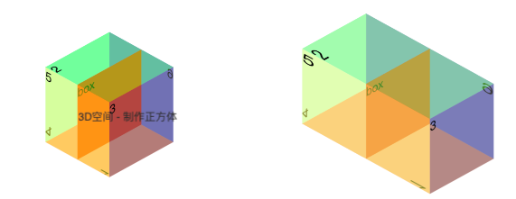

```css
body {
  margin: 0;
  padding: 100px;
  background-image: url(../images/grid.png);
}
.box {
  position: relative;
  width: 100px;
  height: 100px;
  background-color: red;

  /* 在父元素中添加 transform-style来启用3D空间 */
  transform-style: preserve-3d;
  transform: rotateX(-33.5deg) rotateY(45deg) scaleZ(2);
}
.item {
  position: absolute;
  top: 0;
  left: 0;
  width: 100%;
  height: 100%;
}
.top {
  background-color: rgba(255, 0, 0, 0.4);
  transform: rotateX(90deg) translateZ(50px);
}
.bottom {
  background-color: rgba(0, 255, 0, 0.4);
  transform: rotateX(-90deg) translateZ(50px);
}
.front {
  background-color: rgba(100, 100, 100, 0.4);
  transform: rotateY(0deg) translateZ(50px);
}
.back {
  background-color: rgba(0, 255, 255, 0.4);
  transform: rotateY(-180deg) translateZ(50px);
}
.left {
  background-color: rgba(255, 255, 0, 0.4);
  transform: rotateY(-90deg) translateZ(50px);
}
.right {
  background-color: rgba(0, 0, 255, 0.4);
  transform: rotateY(90deg) translateZ(50px);
}
```

```html
<!-- 父元素(舞台) -->
<div class="box">
  div
  <!-- 子元素 -->
  <div class="item top">1</div>
  <div class="item bottom">2</div>
  <div class="item front">3</div>
  <div class="item back">4</div>
  <div class="item left">5</div>
  <div class="item right">6</div>
</div>
```

### 3.12、3D背面可见性 - backface-visibility

背面可见性：backface-visibility

- 该CSS 属性 backface-visibility 指定某个元素当背面朝向观察者时是否可见。

值类型：

- visible：背面朝向用户时可见。
- hidden：背面朝向用户时不可见。

```css
.box {
  position: relative;
  width: 200px;
  height: 100px;
  background-color: skyblue;

  /* 在父元素添加透视效果 */
  perspective: 800px;
}

.item {
  position: absolute;
  top: 0;
  left: 0;
  width: 100%;
  height: 100%;
  background-color: pink;
  /* 形变 */
  /* transform: rotateY(180deg); */

  /* 元素背向是否可见 */
  backface-visibility: hidden;

  /* 帧动画 */
  animation: loop 6s linear infinite;
}

@keyframes loop {
  0% {
    transform: rotateY(0deg);
  }

  100% {
    transform: rotateY(-360deg);
  }
}
```

```html
<div class="box">
  div
  <div class="item">10</div>
</div>
```

### 3.13、练习：3D动画 - 制作webpack logo

需求：制作一个webpack logo

- 绘制小正方体的侧面图
- 绘制小正方体的个六面
- 绘制大正方体的侧面图
- 绘制大正方体的个六面
- 添加旋转动画

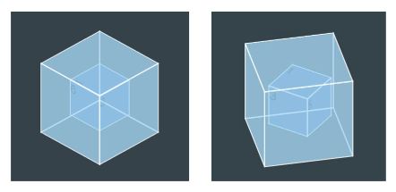

```css
html,
body {
  padding: 0;
  margin: 0;
  width: 100%;
  height: 100%;
  background-color: #2b3a42;

  display: flex;
  justify-content: center;
  align-items: center;
}

ul {
  margin: 0;
  padding: 0;
  list-style: none;
}

.webpack-logo {
  width: 100%;
  height: 200px;
  /* border: 1px solid red; */

  position: relative;
}

.cube-inner {
  position: absolute;
  left: 50%;
  top: 50%;
  /* 关键,不要用 transform */
  margin: -25px 0px 0px -25px;
  width: 50px;
  height: 50px;
  /* background-color: red; */

  /* 启用3D空间 */
  transform-style: preserve-3d;
  transform: rotateX(-33.5deg) rotateY(45deg);
  /* 帧动画 */
  animation: innerLoop 6s ease-in-out infinite;
}

@keyframes innerLoop {
  0% {
    transform: rotateX(-33.5deg) rotateY(45deg);
  }

  50%,
  100% {
    transform: rotateX(-33.5deg) rotateY(-315deg);
  }
}

.cube-inner li {
  position: absolute;
  top: 0;
  left: 0;
  width: 100%;
  height: 100%;
  background-color: #175d96;
  border: 1px solid white;
}

.cube-inner .top {
  transform: rotateX(90deg) translateZ(25px);
}

.cube-inner .bottom {
  transform: rotateX(-90deg) translateZ(25px);
}

.cube-inner .front {
  transform: rotateX(0deg) translateZ(25px);
}

.cube-inner .back {
  transform: rotateX(-180deg) translateZ(25px);
}
.cube-inner .left {
  transform: rotateY(-90deg) translateZ(25px);
}

.cube-inner .right {
  transform: rotateY(90deg) translateZ(25px);
}

/* cube outer */
.cube-outer {
  position: absolute;
  left: 50%;
  top: 50%;
  /* 关键,不要用 transform */
  margin: -50px 0px 0px -50px;
  width: 100px;
  height: 100px;

  /* 启用3D空间 */
  transform-style: preserve-3d;
  transform: rotateX(-33.5deg) rotateY(45deg);
  /* 帧动画 */
  animation: outerLoop 6s ease-in-out infinite;
}

@keyframes outerLoop {
  0% {
    transform: rotateX(-33.5deg) rotateY(45deg);
  }

  50%,
  100% {
    transform: rotateX(-33.5deg) rotateY(405deg);
  }
}

.cube-outer li {
  position: absolute;
  top: 0;
  left: 0;
  width: 100%;
  height: 100%;
  background-color: rgba(141, 214, 249, 0.5);
  border: 1px solid white;
}

.cube-outer .top {
  transform: rotateX(90deg) translateZ(50px);
}

.cube-outer .bottom {
  transform: rotateX(-90deg) translateZ(50px);
}

.cube-outer .front {
  transform: rotateX(0deg) translateZ(50px);
}

.cube-outer .back {
  transform: rotateX(-180deg) translateZ(50px);
}
.cube-outer .left {
  transform: rotateY(-90deg) translateZ(50px);
}

.cube-outer .right {
  transform: rotateY(90deg) translateZ(50px);
}

```

```html
<div class="webpack-logo">
  <!-- cube-inner -->
  <ul class="cube-inner">
    <li class="top"></li>
    <li class="bottom"></li>
    <li class="front"></li>
    <li class="back"></li>
    <li class="left"></li>
    <li class="right"></li>
  </ul>

  <!-- cube-outer -->
  <ul class="cube-outer">
    <li class="top"></li>
    <li class="bottom"></li>
    <li class="front"></li>
    <li class="back"></li>
    <li class="left"></li>
    <li class="right"></li>
  </ul>
</div>
```

## 4.2、5D和3D动画实战

**2.5D动画 - 数据平台可视化**


## 5、动画的优化

### 5.1、浏览器渲染流程

1. 解析HTML，构建DOM Tree
2. 对CSS文件进行解析，解析出对应的规则树
3. DOM Tree + CSSOM 生成 Render Tree
4. 布局（Layout）：计算出每个节点的宽度、高度和位置信息。
   - 页面元素位置、大小发生变化，往往会导致其他节点联动，需要重新计算布局，这个过程称为回流（Reflow）。
5. 绘制（Paint）：将可见的元素绘制在屏幕中。
   - 默认标准流是在同一层上绘制，一些特殊属性会创建新的层绘制，这些层称为渲染层。
   - 一些不影响布局的 CSS 修改也会导致该渲染层重绘（Repaint），回流必然会导致重绘。
6. Composite合成层：一些特殊属性会创建一个新的合成层（ CompositingLayer ），并可以利用GPU来加速绘制，这是浏览器的一种优化手段。合成层确实可以提高性能，但是它以消耗内存为代价，因此不能滥用作为 web 性能优化策略和过度使用。

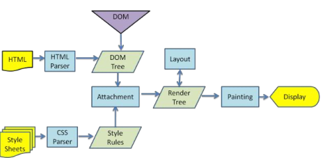


### 5.2、CSS3动画性能优化

1. 创建一个新的渲染层（减少回流）
   - 有明确的定位属性（relative、fixed、sticky、absolute）
   - 透明度（opacity 小于 1）
   - 有 CSS transform 属性（不为 none）
   - 当前有对于 opacity、transform、fliter、backdrop-filter 应用动画
   - backface-visibility 属性为 hidden
   - ....
2. 创建合成层。合成层会开始GPU加速页面渲染，但不能滥用
   - 对 opacity、transform、fliter、backdropfilter应用了animation或transition（需要是active的animation或者 transition）
   - 有 3D transform 函数：比如： translate3d、 translateZ、 scale3d 、 rotate3d ...
   - will-change 设置为 opacity、transform、top、left、bottom、right，比如：will-change: opacity , transform;
     - 其中 top、left等需要设置明确的定位属性，如 relative 等

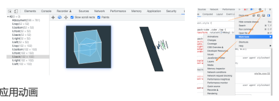


