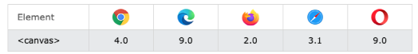
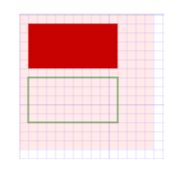
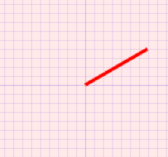

## 1.邂逅 Canvas

### 1.1.邂逅Canvas

什么是Canvas

- Canvas 最初由Apple于2004 年引入，用于Mac OS X WebKit组件，为仪表板小部件和Safari浏览器等应用程序提供支持。后来，它被Gecko内核的浏览器（尤其是Mozilla Firefox），Opera和Chrome实现，并被网页超文本应用技术工作小组提议为下一代的网络技术的标准元素（HTML5新增元素）。
- Canvas提供了非常多的JavaScript绘图API（比如：绘制路径、矩形、圆、文本和图像等方法），与`<canvas>`元素可以绘制各种2D图形。
- Canvas API 主要聚焦于 2D 图形。当然也可以使用`<canvas>`元素对象的 WebGL API 来绘制 2D 和 3D 图形。

Canvas的应用场景

- 可以用于动画、游戏画面、数据可视化、图片编辑以及实时视频处理等方面。

Canvas 浏览器兼容性



### 1.2.Canvas优缺点

Canvas 优点：

- Canvas提供的功能更原始，适合像素处理，动态渲染和数据量大的绘制，如：图片编辑、热力图、炫光尾迹特效等。
- Canvas非常适合图像密集型的游戏开发，适合频繁重绘许多的对象。
- Canvas能够以 .png 或 .jpg 格式保存结果图像，适合对图片进行像素级的处理。

Canvas 缺点：

- 在移动端可以能会因为Canvas数量多，而导致内存占用超出了手机的承受能力，导致浏览器崩溃。
- Canvas 绘图只能通过JavaScript脚本操作（all in js）。
- Canvas 是由一个个像素点构成的图形，放大会使图形变得颗粒状和像素化，导致模糊。

### 1.3.初体验Canvas

使用Canvas的注意事项：

- `<canvas>` 和` ` 元素很相像，唯一的不同就是它并没有 src 和 alt 属性。
- `<canvas>` 标签只有两个属性——width和height( 单位默认为px )。当没有设置宽度和高度时，canvas 会初始化宽为300px 和高为 150px。
- 与` ` 元素不同，`<canvas>` 元素必须需要结束标签 (`</canvas>`)。如结束标签不存在，则文档其余部分会被认为是替代内容，将不会显示出来。
- 可以通过判断canvas.getContext()方法是否存在来检查浏览器是否支持Canvas(现代浏览器基本都支持)

 初体验Canvas

1. Canvas通用模板
2. Canvas绘制正方形



```html
<canvas id="tutorial" width="300" height="300px">
  你的浏览器不兼容Canvas,请升级您的浏览器!
</canvas>

<script>
  window.onload = function () {
    // 1.拿到canvas的元素对象
    let canvasEl = document.getElementById("tutorial");

    if (!canvasEl.getContext) {
      return;
    }
    // 2.拿到Canvas渲染的上下文
    // ctx: CanvasRenderingContext2D
    // ctx是一个绘图的上下文: 提供了绘图的指令, 可以绘制各种图形( 圆形 直线 椭圆... )
    let ctx = canvasEl.getContext("2d"); // 2d | webgl
    console.log(ctx);
  };
</script>
```

```html
<canvas id="tutorial" width="300" height="300px">
  你的浏览器不兼容Canvas,请升级您的浏览器!
</canvas>

<script>
  window.onload = function () {
    let canvasEl = document.getElementById("tutorial");
    if (!canvasEl.getContext) {
      return;
    }
    let ctx = canvasEl.getContext("2d"); // 2d | webgl

    ctx.fillRect(0, 0, 100, 50); // 单位也是不用写 px
  };
</script>
```

## 2.Canvas绘制图形

### 2.1、Canvas Grid 和 坐标空间

在开始画图之前，我们需要了解一下Canvas网格（canvas grid）和 坐标系。

Canvas Grid 或 坐标空间

- 假如，HTML 模板中有个宽 150px, 高 150px 的 `<canvas>` 元素。`<canvas>`元素默认被网格所覆盖。
- 通常来说网格中的一个单元相当于 canvas 元素中的一像素。
- 该网格的原点位于坐标 (0,0) 的左上角。所有元素都相对于该原点放置。
- 网格也可以理解为坐标空间（坐标系），坐标原点位于canvas元素的左上角，被称为初始坐标系
  - 如右图中蓝色正方形，左上角的坐标为距离左边 x 像素，距离上边y 像素，坐标为（x, y）
- 网格或坐标空间是可以变换的，后面会讲如何将原点转换到不同的位置，旋转网格甚至缩放它。
  - 注意：移动了原点后，默认所有后续变换都将基于新坐标系的变换。


### 2.2、绘制矩形( Rectangle )

Canvas支持两种方式来绘制矩形：矩形方法 和 路径方法。

- 路径是点列表，由线段连接。这些线段可以具有不同的形状、弯曲或不弯曲的、连续或不连续的、不同的宽度和不同的颜色
- 除了矩形，其他的图形都是通过一条或者多条路径组合而成的。
- 通常我们会通过众多的路径来绘制复杂的图形。

Canvas 绘图的矩形方法：

- fillRect(x, y, width, height)： 绘制一个填充的矩形
- strokeRect(x, y, width, height)： 绘制一个矩形的边框
- clearRect(x, y, width, height)： 清除指定矩形区域，让清除部分完全透明。

方法参数：

- 上面的方法都包含了相同的参数。
- x 与 y 指定了在canvas画布上所绘制矩形的左上角（相对于原点）的坐标（不支持 undefined ）。
- width 和 height 设置矩形的尺寸。

```html
<canvas id="tutorial" width="300" height="300px">
  你的浏览器不兼容Canvas,请升级您的浏览器!
</canvas>

<script>
  window.onload = function () {
    let canvasEl = document.getElementById("tutorial");
    if (!canvasEl.getContext) {
      return;
    }
    let ctx = canvasEl.getContext("2d"); // 2d | webgl

    // 1.绘制了一个填充的矩形
    ctx.fillStyle = "red";
    ctx.fillRect(0, 0, 100, 50);

    // 2.绘制一个边框的矩形
    ctx.strokeRect(100, 100, 100, 50);

    // 3.清除指定区域的矩形
    // ctx.clearRect(0,0, 100, 50)
  };
</script>
```


### 2.3、认识路径

什么是路径？

- 图形的基本元素是路径。路径是通过不同颜色和宽度的线段或曲线相连形成的不同形状的点的集合。
- 路径是可由很多子路径构成，这些子路径都是在一个列表中，列表中所有子路径（线、弧形等）将构成图形。
- 一个路径，甚至一个子路径，通常都是闭合的。

使用路径绘制图形的步骤：

1. 首先需要创建路径起始点（beginPath）。
2. 然后使用画图命令去画出路径( arc 、lineTo )。
3. 之后把路径闭合( closePath , 不是必须)。
4. 一旦路径生成，就能通过描边(stroke)或填充路径区域(fill)来渲染图形。

以下是绘制路径时，所要用到的函数

- beginPath()：新建一条路径，生成之后，图形绘制命令被指向到新的路径上绘图，不会关联到旧的路径。
- closePath()：闭合路径之后图形绘制命令又重新指向到 beginPath之前的上下文中。
- stroke()：通过线条来绘制图形轮廓/描边（针对当前路径图形）。
- fill()：通过填充路径的内容区域生成实心的图形（针对当前路径图形）。

### 2.4、路径-绘制直线

移动画笔（moveTo）方法

- moveTo 方法是不能画出任何东西，但是它也是路径列表的一部分
- moveTo 可以想象为在纸上作业，一支钢笔或者铅笔的笔尖从一个点到另一个点的移动过程。
- moveTo(x, y)： 将笔移动到指定的坐标 x 、 y 上。
- 当 canvas 初始化或者beginPath()调用后，我们通常会使用moveTo(x, y)函数设置起点。
- 使用moveTo函数能够绘制一些不连续的路径。

绘制直线（lineTo）方法

- lineTo(x, y)： 绘制一条从当前位置到指定 (x ，y)位置的直线。
  - 该方法有两个参数(x ， y)代表坐标系中直线结束的点。
  - 开始点和之前的绘制路径有关，之前路径的结束点就是接下来的开始点。
  - 当然开始点也可以通过moveTo(x, y)函数改变。

绘制一条直线

- 第一步：调用 beginPath() 来生成路径。本质上，路径是由很多子路径（线、弧形、等）构成。
- 第二步：调用moveTo、lineTo函数来绘制路径（路径可以是连续也可以不连续）。
- 第三步：闭合路径 closePath()，虽然不是必需的，但是通常都是要闭合路径。
- 第四步：调用stroke()函数来给直线描边。

```js
window.onload = function () {
  let canvasEl = document.getElementById("tutorial");
  if (!canvasEl.getContext) {
    return;
  }
  let ctx = canvasEl.getContext("2d"); // 2d | webgl

  ctx.lineWidth = 10;
  // 1.创建一个新的路径
  ctx.beginPath();
  // 2.使用的绘图的命名(ctx对象中的 属性 和 API)
  ctx.moveTo(10, 10);
  ctx.lineTo(100, 10);
  // 3.闭合路径
  ctx.closePath() // 不是必须
  // 4.描边或填充
  ctx.stroke(); // 绘制线条只能用 stroke填充,不用 fill
};
```


### 2.5、路径-绘制三角形( Triangle )

绘制一个三角形步骤

- 第一步：调用 beginPath() 来生成路径。
- 第二步：调用moveTo()、lineTo()函数来绘制路径。
- 第三步：闭合路径 closePath()，不是必需的。
  - closePath() 方法会通过绘制一条从当前点到开始点的直线来闭合图形。
  - 如果图形是已经闭合了的，即当前点为开始点，该函数什么也不做。
- 第四步：调用stroke()函数来给线描边，或者调用fill()函数来填充（使用填充 fill 时，路径会自动闭合，而 stroke 不会）。

```js
window.onload = function () {
  let canvasEl = document.getElementById("tutorial");
  if (!canvasEl.getContext) {
    return;
  }
  let ctx = canvasEl.getContext("2d"); // 2d | webgl

  // 1.描边三角形
  ctx.beginPath();
  ctx.moveTo(50, 0);
  ctx.lineTo(100, 50);
  ctx.lineTo(50, 100);
  // ctx.closePath()
  ctx.stroke();

  // 2.实心的三角形
  ctx.beginPath();
  ctx.moveTo(150, 0);
  ctx.lineTo(200, 50);
  ctx.lineTo(150, 100);
  // ctx.closePath()
  ctx.fill(); // 它会 自动闭合路径
};
```


### 2.6、路径-绘制圆弧（Arc）、圆 ( Circle)

绘制圆弧或者圆，使用arc()方法。

- arc(x, y, radius, startAngle, endAngle, anticlockwise)，该方法有六个参数：
  - x、y：为绘制圆弧所在圆上的圆心坐标。
  - radius：为圆弧半径。
  - startAngle、endAngle：该参数用弧度定义了开始以及结束的弧度。这些都是以 x 轴为基准。
  - anticlockwise：为一个布尔值。为 true ，是逆时针方向，为false，是顺时针方向，默认为false。

计算弧度

- arc() 函数中表示角的单位是弧度，不是角度。
- 角度与弧度的 JS 表达式：弧度=( Math.PI / 180 ) * 角度 ，即 1角度= Math.PI / 180 个弧度
  - 比如:旋转90°:Math.PI / 2； 旋转180°:Math.PI ； 旋转360°:Math.PI * 2； 旋转-90°:-Math.PI / 2；

绘制一个圆弧的步骤

- 第一步：调用 beginPath() 来生成路径。
- 第二步：调用arc()函数来绘制圆弧。
- 第三步：闭合路径 closePath()，不是必需的。
- 第四步：调用stroke()函数来描边，或者调用fill()函数来填充（使用填充 fill 时，路径会自动闭合）。

```js
window.onload = function () {
  let canvasEl = document.getElementById("tutorial");
  if (!canvasEl.getContext) {
    return;
  }
  let ctx = canvasEl.getContext("2d"); // 2d | webgl

  // 1.每个图形都绘制在一个路径中
  ctx.beginPath();
  ctx.arc(50, 50, 25, 0, Math.PI * 2, false);
  ctx.closePath();
  ctx.stroke();

  ctx.beginPath();
  ctx.arc(150, 150, 25, 0, Math.PI);
  ctx.closePath();
  ctx.stroke();
};
```

```js
window.onload = function () {
  let canvasEl = document.getElementById("tutorial");
  if (!canvasEl.getContext) {
    return;
  }
  let ctx = canvasEl.getContext("2d"); // 2d | webgl
  // 2.在一个路径中绘制多个图形
  ctx.beginPath();
  ctx.arc(50, 50, 25, 0, Math.PI * 2, false);
  ctx.moveTo(175, 150);
  ctx.arc(150, 150, 25, 0, Math.PI);
  ctx.closePath();
  ctx.stroke();
};
```


### 2.7、路径-矩形（Rectangle）

绘制矩形的另一个方法：

- 调用rect() 函数绘制，即将一个矩形路径增加到当前路径上
- rect(x, y, width, height)
  - 绘制一个左上角坐标为（x,y），宽高为 width 以及 height 的矩形。

注意：

- 当该方法执行的时候，moveTo(x, y) 方法自动设置坐标参数（0,0）。也就是说，当前笔触自动重置回默认坐标。

```js
window.onload = function () {
  let canvasEl = document.getElementById("tutorial");
  if (!canvasEl.getContext) {
    return;
  }
  let ctx = canvasEl.getContext("2d"); // 2d | webgl

  // 1.创建一个路径
  ctx.beginPath();
  // 2.绘图指令
  // ctx.moveTo(0, 0)
  ctx.rect(100, 100, 100, 50);
  // 3.闭合路径
  ctx.closePath();
  // 4.填充和描边
  ctx.stroke();
};
```


## 3.Canvas样式和颜色

### 3.1、色彩 Colors

前面已经学过了很多绘制图形的方法。如果我们想要给图形上色，有两个重要的属性可以做到：

- fillStyle = color： 设置图形的填充颜色，需在 fill() 函数前调用。
- strokeStyle = color： 设置图形轮廓的颜色，需在 stroke() 函数前调用。

color颜色

- color 可以是表示 CSS 颜色值的字符串，支持：关键字、十六进制、rgb、rgba格式。
- 默认情况下，线条和填充颜色都是黑色（CSS 颜色值 #000000）。

注意

- 一旦设置了 strokeStyle 或者 fillStyle 的值，那么这个新值就会成为新绘制的图形的默认值。
- 如果你要给图形上不同的颜色，你需要重新设置 fillStyle 或 strokeStyle 的值。

额外补充

- fill() 函数是图形填充，fillStyle属性是设置填充色
- stroke() 函数是图形描边，strokeStyle属性是设置描边色

```js
 window.onload = function () {
  let canvasEl = document.getElementById("tutorial");
  if (!canvasEl.getContext) {
    return;
  }
  let ctx = canvasEl.getContext("2d"); // 2d | webgl

  // 2.修改画笔的颜色
  ctx.fillStyle = "red";
  ctx.fillRect(0, 0, 100, 50); // 单位也是不用写 px

  ctx.fillStyle = "#cdcdcd";
  ctx.fillRect(200, 0, 100, 50);

  ctx.fillStyle = "green";
  ctx.beginPath();
  ctx.rect(0, 100, 100, 50);
  ctx.fill();
};
```


```js
window.onload = function () {
  let canvasEl = document.getElementById("tutorial");
  if (!canvasEl.getContext) {
    return;
  }
  let ctx = canvasEl.getContext("2d"); // 2d | webgl

  // 2.修改画笔的颜色
  ctx.fillStyle = "rgba(255, 0, 0, 0.3)";
  ctx.fillRect(0, 0, 100, 50); // 单位也是不用写 px

  ctx.strokeStyle = "blue";
  ctx.strokeRect(200, 0, 100, 50);

  ctx.strokeStyle = "green"; // 关键字, 十六进制, rbg , rgba
  ctx.beginPath();
  ctx.rect(0, 100, 100, 50);
  ctx.stroke();
};
```


### 3.2、透明度 Transparent

除了可以绘制实色图形，我们还可以用 canvas 来绘制半透明的图形。

方式一：strokeStyle 和 fillStyle属性结合RGBA：

方式二：globalAlpha 属性

- globalAlpha = 0 ~ 1
  - 这个属性影响到 canvas 里所有图形的透明度
  - 有效的值范围是 0.0（完全透明）到 1.0（完全不透明），默认是 1.0。

```js
window.onload = function () {
  let canvasEl = document.getElementById("tutorial");
  if (!canvasEl.getContext) {
    return;
  }
  let ctx = canvasEl.getContext("2d"); // 2d | webgl

  // 针对于Canvas中所有的图形生效
  ctx.globalAlpha = 0.3;

  // 2.修改画笔的颜色
  // ctx.fillStyle = "rgba(255, 0, 0, 0.3)";
  ctx.fillRect(0, 0, 100, 50); // 单位也是不用写 px

  ctx.fillStyle = "blue";
  ctx.fillRect(200, 0, 100, 50);

  ctx.fillStyle = "green"; // 关键字, 十六进制, rbg , rgba
  ctx.beginPath();
  ctx.rect(0, 100, 100, 50);
  ctx.fill();
};
```


### 3.3、线型 Line styles

调用lineTo()函数绘制的线条，是可以通过一系列属性来设置线的样式。

- lineWidth = value： 设置线条宽度。
- lineCap = type： 设置线条末端样式。
- lineJoin = type： 设定线条与线条间接合处的样式。
- .....


lineWidth 

- 设置线条宽度的属性值必须为正数。默认值是 1.0px，不需单位。（ 零、负数、Infinity和
  y和NaN值将被忽略）
- 线宽是指给定路径的中心到两边的粗细。换句话说就是在路径的两边各绘制线宽的一半。
- 如果你想要绘制一条从 (3,1) 到 (3,5)，宽度是 1.0 的线条，你会得到像第二幅图一样的结果。
  - 路径的两边个各延伸半个像素填充并渲染出1像素的线条（深蓝色部分）
  - 两边剩下的半个像素又会以实际画笔颜色一半色调来填充（浅蓝部分）
  - 实际画出线条的区域为（浅蓝和深蓝的部分），填充色大于1像素了，这就是为何宽度为 1.0 的线经常并不准确的原因。
- 要解决这个问题，必须对路径精确的控制。如，1px的线条会在路径两边各延伸半像素，那么像第三幅图那样绘制从 (3.5 ,1) 到 (3.5, 5)的线条，其边缘正好落在像素边界，填充出来就是准确的宽为 1.0 的线条。

```js
window.onload = function () {
  let canvasEl = document.getElementById("tutorial");
  if (!canvasEl.getContext) {
    return;
  }
  let ctx = canvasEl.getContext("2d"); // 2d | webgl

  ctx.lineWidth = 1;
  ctx.beginPath();
  ctx.moveTo(20.5, 20);
  ctx.lineTo(20.5, 100);
  ctx.stroke();

  ctx.lineWidth = 2;
  ctx.beginPath();
  ctx.moveTo(40, 20);
  ctx.lineTo(40, 100);
  ctx.stroke();
};
```


lineCap： 属性的值决定了线段端点显示的样子。它可以为下面的三种的其中之一：

- butt 截断，默认是 butt
- round 圆形
- square 正方形

```js
window.onload = function () {
  let canvasEl = document.getElementById("tutorial");
  if (!canvasEl.getContext) {
    return;
  }
  let ctx = canvasEl.getContext("2d"); // 2d | webgl

  ctx.lineWidth = 10;
  ctx.lineCap = "butt";
  ctx.beginPath();
  ctx.moveTo(20, 20);
  ctx.lineTo(20, 100);
  ctx.stroke();

  ctx.lineCap = "round";
  ctx.beginPath();
  ctx.moveTo(40, 20);
  ctx.lineTo(40, 100);
  ctx.stroke();

  ctx.lineCap = "square ";
  ctx.beginPath();
  ctx.moveTo(60, 20);
  ctx.lineTo(60, 100);
  ctx.stroke();
};
```


lineJoin： 属性的值决定了图形中线段连接处所显示的样子。它可以是这三种之一：

- round 圆形
- bevel  斜角
- miter 斜槽规，默认是 miter。

```js
window.onload = function () {
  let canvasEl = document.getElementById("tutorial");
  if (!canvasEl.getContext) {
    return;
  }
  let ctx = canvasEl.getContext("2d"); // 2d | webgl
  ctx.lineWidth = 10;

  ctx.lineJoin = "miter";
  ctx.beginPath();
  ctx.moveTo(0, 0);
  ctx.lineTo(100, 100);
  ctx.lineTo(200, 0);
  ctx.stroke();

  ctx.lineJoin = "round";
  ctx.beginPath();
  ctx.moveTo(0, 40);
  ctx.lineTo(100, 140);
  ctx.lineTo(200, 40);
  ctx.stroke();

  ctx.lineJoin = "bevel";
  ctx.beginPath();
  ctx.moveTo(0, 80);
  ctx.lineTo(100, 180);
  ctx.lineTo(200, 80);
  ctx.stroke();
};
```


### 3.4、绘制文本

canvas 提供了两种方法来渲染文本：

- fillText(text, x, y [, maxWidth])
  - 在 (x,y) 位置，填充指定的文本
  - 绘制的最大宽度（可选）。
- strokeText(text, x, y [, maxWidth])
  - 在 (x,y) 位置，绘制文本边框
  - 绘制的最大宽度（可选）。


文本的样式（需在绘制文本前调用）

- font = value： 当前绘制文本的样式。这个字符串使用和 CSS font 属性相同的语法。默认的字体是：10px sans-serif。
- textAlign = value：文本对齐选项。可选的值包括：start, end, left, right or center. 默认值是 start
- textBaseline = value：基线对齐选项。可选的值包括：top, hanging, middle, alphabetic(默认), ideographic, bottom。
  - 默认值是 alphabetic。

```js
window.onload = function () {
  let canvasEl = document.getElementById("tutorial");
  if (!canvasEl.getContext) {
    return;
  }
  let ctx = canvasEl.getContext("2d"); // 2d | webgl

  ctx.font = "60px sen-serif";
  ctx.textAlign = "center";
  ctx.textBaseline = "middle";
  ctx.strokeStyle = "red";
  ctx.fillStyle = "red";

  // 将字体绘制在 100, 100 这个坐标点
  ctx.fillText("Ay", 100, 100);
  // ctx.strokeText('Ay', 100, 100)
};
```


### 3.5、绘制图片

绘制图片，可以使用 drawImage 方法将它渲染到 canvas 里。drawImage 方法有三种形态：

- drawImage(image, x, y)
  - 其中 image 是 image 或者 canvas 对象，x 和 y 是其在目标 canvas 里的起始坐标。
- drawImage(image, x, y, width, height)
  - 这个方法多了 2 个参数：width 和 height，这两个参数用来控制 当向 canvas 画入时应该缩放的大小
- drawImage(image, sx, sy, sWidth, sHeight, dx, dy, dWidth, dHeight)
  - 第一个参数和其它的是相同的，都是一个图像或者另一个 canvas 的引用。其它 8 个参数最好是参照右边的图解，前 4 个是定义图像源的切片位置和大小，后 4 个则是定义切片的目标显示位置和大小。

图片的来源，canvas 的 API 可以使用下面这些类型中的一种作为图片的源：

- HTMLImageElement：这些图片是由Image()函数构造出来的，或者任何的``元素。
- HTMLVideoElement：用一个 HTML 的 `<video>`元素作为你的图片源，可以从视频中抓取当前帧作为一个图像。
- HTMLCanvasElement：可以使用另一个 `<canvas>` 元素作为你的图片源。
- ...

```js
window.onload = function () {
  let canvasEl = document.getElementById("tutorial");
  if (!canvasEl.getContext) {
    return;
  }
  let ctx = canvasEl.getContext("2d"); // 2d | webgl
  // 1.准备一张图片
  var image = new Image();
  image.src = "../images/backdrop.png";
  image.onload = function () {
    // 2.开始用Canvas来绘制图片
    ctx.drawImage(image, 0, 0, 180, 130);

    // 3.绘制折线
    ctx.beginPath();
    ctx.moveTo(40, 100);
    ctx.lineTo(50, 70);
    ctx.lineTo(60, 90);
    ctx.lineTo(100, 30);
    ctx.lineTo(170, 90);
    ctx.stroke();
  };
};
```


## 4.Canvas状态和形变

### 4.1.Canvas绘画状态-保存和恢复

Canvas绘画状态

- 是当前绘画时所产生的样式和变形的一个快照。
- Canvas在绘画时，会产生相应的绘画状态，其实我们是可以将某些绘画的状态存储在栈中来为以后复用。
- Canvas 绘画状态的可以调用 save 和 restore 方法是用来保存和恢复，这两个方法都没有参数，并且它们是成对存在的。

保存和恢复（Canvas）绘画状态

- save()：保存画布 (canvas) 的所有绘画状态
- restore()：恢复画布 (canvas) 的所有绘画状态

Canvas绘画状态包括：

- 当前应用的变形（即移动，旋转和缩放）
- 以及这些属性：strokeStyle, fillStyle, globalAlpha, lineWidth, lineCap, lineJoin, miterLimit,
  shadowOffsetX, shadowOffsetY, shadowBlur, shadowColor, font, textAlign, textBaseline ......
- 当前的裁切路径（clipping path）


```js
window.onload = function () {
  let canvasEl = document.getElementById("tutorial");
  if (!canvasEl.getContext) {
    return;
  }
  let ctx = canvasEl.getContext("2d"); // 2d | webgl

  ctx.fillStyle = "red";
  ctx.fillRect(10, 10, 30, 15);
  ctx.save();

  ctx.fillStyle = "green";
  ctx.fillRect(50, 10, 30, 15);
  ctx.save();

  ctx.fillStyle = "blue";
  ctx.fillRect(90, 10, 30, 15);
  ctx.save();

  ctx.restore(); // blue
  // ctx.fillStyle = "blue";
  ctx.fillRect(90, 40, 30, 80);

  ctx.restore(); // green
  // ctx.fillStyle = "green";
  ctx.fillRect(50, 40, 30, 80);

  ctx.restore(); // red
  // ctx.fillStyle = "red";
  ctx.fillRect(10, 40, 30, 80);
};
```


### 4.2.变形 Transform

Canvas和CSS3一样也是支持变形，形变是一种更强大的方法，可以将坐标原点移动到另一点、形变可以对网格进行旋转和缩放。

Canvas的形变有4种方法实现：

- translate(x, y)：用来移动 canvas 和它的原点到一个不同的位置。
  - x 是左右偏移量，y 是上下偏移量（无需要单位），如右图所示。
- rotate(angle)：用于以原点为中心旋转 canvas，即沿着z轴旋转。
  - angle是旋转的弧度，是顺时针方向，以弧度为单位。
- scale(x, y)：用来增减图形在 canvas 中像素数目，对图形进行缩小或放大。
  - x 为水平缩放因子，y 为垂直缩放因子。如果比 1 小，会缩小图形，如果比 1 大会放大图形。默认值为 1，也支持负数。
- transform(a, b, c, d, e, f)： 允许对变形矩阵直接修改。这个方法是将当前的变形矩阵乘上一个基于自身参数的矩阵。

注意事项：

- 在做变形之前先调用 save 方法保存状态是一个良好的习惯。
- 大多数情况下，调用 restore 方法比手动恢复原先的状态要简单得多。
- 如果在一个循环中做位移但没有保存和恢复canvas状态，很可能到最后会发现有些东西不见了，因为它很可能已超出canvas画布以外了。
- 形变需要在绘制图形前调用。

### 4.3.移动-translate

translate方法，它用来移动 canvas 和它的原点到一个不同的位置。

- translate(x, y)
  - x 是左右偏移量，y 是上下偏移量（无需单位）。

移动 canvas 原点的好处

- 如不使用 translate方法，那么所有矩形默认都将被绘制在相同的（0,0）坐标原点。
- translate方法可让我们任意放置图形，而不需要手工一个个调整坐标值。

移动矩形案例

- 第一步：先保存一下canvas当前的状态
- 第二步：在绘制图形前translate移动画布
- 第三步：开始绘制图形，并填充颜色


```js
window.onload = function () {
  let canvasEl = document.getElementById("tutorial");
  if (!canvasEl.getContext) {
    return;
  }
  let ctx = canvasEl.getContext("2d"); // 2d | webgl

  // 1.形变( 没有保存状态)
  // ctx.translate(100, 100);
  // ctx.fillRect(0, 0, 100, 50); // 单位也是不用写 px

  // ctx.translate(100, 100);
  // ctx.strokeRect(0, 0, 100, 50);

  // 1.形变(保存形变之前的状态)
  ctx.save();
  ctx.translate(100, 100);
  ctx.fillRect(0, 0, 100, 50); // 单位也是不用写 px
  ctx.restore(); // 恢复了形变之前的状态( 0,0)

  ctx.save(); // (保存形变之前的状态)
  ctx.translate(100, 100);
  ctx.fillStyle = "red";
  ctx.fillRect(0, 0, 50, 30);
  ctx.restore();
};
```

### 4.4.旋转-rotate

rotate方法，它用于以原点为中心旋转 canvas，即沿着 z轴 旋转。

- rotate(angle)
  - 只接受一个参数：旋转的角度 (angle)，它是顺时针方向，以弧度为单位的值。
  - 角度与弧度的 JS 表达式：弧度=( Math.PI / 180 ) * 角度 ，即 1角度 = Math.PI/180 个弧度。
  - 比如：旋转90°：Math.PI / 2； 旋转180°：Math.PI ； 旋转360°：Math.PI * 2； 旋转-90°：-Math.PI / 2；
  - 旋转的中心点始终是 canvas 的原坐标点，如果要改变它，我们需要用到 translate方法。

旋转案例

- 第一步：先保存一下Canvas当前的状态，并确定旋转原点
- 第二步：在绘制图形前旋转画布（坐标系会跟着旋转了）
- 第三步：开始绘制图形，并填充颜色


```js
window.onload = function () {
  let canvasEl = document.getElementById("tutorial");
  if (!canvasEl.getContext) {
    return;
  }
  let ctx = canvasEl.getContext("2d"); // 2d | webgl

  // 保存形变之前的状态
  ctx.save();
  // 1.形变
  ctx.translate(100, 100);
  // 360 -> Math.PI * 2
  // 180 -> Math.PI
  // 1 -> Math.PI / 180
  // 45 -> Math.PI / 180 * 45
  ctx.rotate((Math.PI / 180) * 45);
  ctx.fillRect(0, 0, 50, 50);

  // ctx.translate(100, 0)
  // ctx.fillRect(0, 0, 50, 50)
  // 绘图结束(恢复形变之前的状态)
  ctx.restore();

  ctx.save();
  ctx.translate(100, 0);
  ctx.fillRect(0, 0, 50, 50);
  ctx.restore();
  // ....下面在继续写代码的话,坐标轴就是参照的是原点了
};
```

### 4.5.缩放-scale

scale方法可以缩放画布。可用它来增减图形在 canvas 中的像素数目，对图形进行缩小或者放大。

- scale(x, y)
  - x 为水平缩放因子，y 为垂直缩放因子，也支持负数。
  - 如果比 1 小，会缩小图形，如果比 1 大会放大图形。默认值为 1。

注意事项

- 画布初始情况下，是以左上角坐标为原点。如果参数为负实数，相当于以 x 或 y 轴作为对称轴镜像反转。
  - 例如，使用translate(0, canvas.height);   scale(1,-1);    以 y 轴作为对称轴镜像反转。
- 默认情况下，canvas 的 1 个单位为 1 个像素。如果我们设置缩放因子是 0.5，1 个单位就变成对应 0.5 个像素，这样绘制出来的形状就会是原先的一半。同理，设置为 2.0 时，1 个单位就对应变成了 2 像素，绘制的结果就是图形放大了 2 倍。

缩放案例实战

- 第一步：先保存一下Canvas当前的状态，并确定缩放原点
- 第二步：在绘制图形前缩放画布
- 第三步：开始绘制图形，并填充颜色


```js
window.onload = function () {
  let canvasEl = document.getElementById("tutorial");
  if (!canvasEl.getContext) {
    return;
  }
  let ctx = canvasEl.getContext("2d"); // 2d | webgl

  // 保存形变之前的状态
  ctx.save();
  // 1.形变
  ctx.translate(100, 100); // 平移坐标系统
  ctx.scale(2, 2); // 对坐标轴进行了放大(2倍)
  ctx.translate(10, 0); // 10px  -> 20px
  ctx.fillRect(0, 0, 50, 50);
  // 绘图结束(恢复形变之前的状态)
  ctx.restore();
};
```

## 5.Canvas动画和案例

### 5.1.Canvas动画

Canvas绘图都是通过JavaScript 去操控的，如要实现一些交互性动画是相当容易的。那Canvas是如何做一些基本动画的？

- canvas可能最大的限制就是图像一旦绘制出来，它就是一直保持那样了。
- 如需要执行动画，不得不对画布上所有图形进行一帧一帧的重绘（比如在1秒绘60帧就可绘出流畅的动画了）。
- 为了实现动画，我们需要一些可以定时执行重绘的方法。然而在Canvas中有三种方法可以实现：
  - 分别为 setInterval 、 setTimeout 和 requestAnimationFrame 三种方法来定期执行指定函数进行重绘。

Canvas 画出一帧动画的基本步骤（如要画出流畅动画，1s 需绘60帧）：

- 第一步：用 clearRect 方法清空 canvas ，除非接下来要画的内容会完全充满 canvas（例如背景图），否则你需要清空所有。
- 第二步：保存 canvas 状态，如果加了 canvas 状态的设置（样式，变形之类的），又想在每画一帧之时都是原始状态的话，你需要先保存一下，后面再恢复原始状态。
- 第三步：绘制动画图形（animated shapes） ，即绘制动画中的一帧。
- 第四步：恢复 canvas 状态，如果已经保存了 canvas 的状态，可以先恢复它，然后重绘下一帧。

### 5.2.绘制秒针- setInterval

绘制秒针动画，绘制一帧的步骤：

- 第一步：用 clearRect(x,y, w,h)方法，清空 canvas 。
- 第二步：保存 canvas 状态 。
- 第三步：修改 canvas 状态 （样式、移动坐标、旋转等）。
- 第四步：绘制秒针图形（即绘制动画中的一帧）。
- 第五步：恢复 canvas 状态 ，准备重绘下一帧。

setTimout定时器的缺陷

- setTimeout定时器不是非常精准的，因为setTimeout的回调函数是放到了宏任务中等待执行。
- 如果微任务中一直有未处理完成的任务，那么setTimeout的回调函数就有可能不会在指定时间内触发回调。
- 如果想要更加平稳和更加精准的定时执行某个任务的话，可以使用requestAnimationFrame函数。



```js
window.onload = function () {
  let canvasEl = document.getElementById("tutorial");
  if (!canvasEl.getContext) {
    return;
  }
  let ctx = canvasEl.getContext("2d"); // 2d | webgl
  let count = 0;
  draw();

  setInterval(function () {
    draw();
  }, 1000);

  /**
   * 这个函数就是动画的一帧
   */
  function draw() {
    count++;
    if (count >= 60) {
      count = 0;
    }
    ctx.clearRect(0, 0, 300, 300);
    ctx.save();

    // 1.开始绘图
    ctx.translate(100, 100);
    // Math.PI * 2   一个圆
    // Math.PI * 2 / 60   一个圆分成 60
    ctx.rotate(((Math.PI * 2) / 60) * count);
    ctx.lineWidth = 6;
    ctx.lineCap = "round";
    ctx.strokeStyle = "red";

    ctx.beginPath();
    ctx.moveTo(0, 0);
    ctx.lineTo(0, -80);
    ctx.stroke();

    ctx.restore();
  }
};
```

### 5.3.绘制秒针-requestAnimationFrame

requestAnimationFrame函数

- 告诉浏览器——你希望执行一个动画，并且要求浏览器在下次重绘之前调用该函数的回调函数来更新动画。
- 该方法需要传入一个回调函数作为参数，该回调函数会在浏览器下一次重绘之前执行
- 若想在浏览器下次重绘之前继续更新下一帧动画，那么在回调函数自身内必须再次调requestAnimationFrame()
- 通常每秒钟回调函数执行 60 次左右，也有可能会被降低。

绘制秒针动画，绘制一帧的步骤：

- 第一步：用 clearRect(x,y, w,h)方法，清空 canvas 。
- 第二步：保存 canvas 状态 。
- 第三步：修改 canvas 状态 （样式、移动坐标、旋转等）。
- 第四步：绘制秒针图形（即绘制动画中的一帧） 。
- 第五步：恢复 canvas 状态 ，准备重绘下一帧。

```js
window.onload = function () {
  let canvasEl = document.getElementById("tutorial");
  if (!canvasEl.getContext) {
    return;
  }
  let ctx = canvasEl.getContext("2d"); // 2d | webgl
  requestAnimationFrame(draw);

  /**
   * 这个函数就是动画的一帧
   * 现在这个函数在1秒钟会回调 61 次
   */
  function draw() {
    let second = new Date().getSeconds();
    console.log("draw");
    ctx.clearRect(0, 0, 300, 300);
    ctx.save();

    // 1.开始绘图
    ctx.translate(100, 100);
    ctx.rotate(((Math.PI * 2) / 60) * second);
    ctx.lineWidth = 6;
    ctx.lineCap = "round";
    ctx.strokeStyle = "red";

    ctx.beginPath();
    ctx.moveTo(0, 0);
    ctx.lineTo(0, -80);
    ctx.stroke();

    ctx.restore();
    requestAnimationFrame(draw);
  }
};
```

### 5.4.太阳系旋转

太阳系旋转动画，绘制一帧的步骤：

- 第一步：用 clearRect(x,y, w,h)方法，清空 canvas ，并初始化全局样式。
- 第二步：保存 canvas 状态 。
- 第三步：绘制背景、绘制地球（绘制月球）、绘制阴影效果。
- 第五步：恢复 canvas 状态 ，准备重绘下一帧。


```js
window.onload = function () {
  let canvasEl = document.getElementById("tutorial");
  if (!canvasEl.getContext) {
    return;
  }
  let ctx = canvasEl.getContext("2d"); // 2d | webgl

  let sun = new Image();
  sun.src = "../../images/canvas_sun.png";
  let earth = new Image();
  earth.src = "../../images/canvas_earth.png";
  let moon = new Image();
  moon.src = "../../images/canvas_moon.png";
  requestAnimationFrame(draw);

 /**
  * 1秒钟会回调 61次
  */
  function draw() {
    console.log("draw");
    ctx.clearRect(0, 0, 300, 300);
    ctx.save();
    // 1.绘制背景
    drawBg();
    // 2.地球
    drawEarth();
    ctx.restore();
    requestAnimationFrame(draw);
  }

  function drawBg() {
    ctx.save();
    ctx.drawImage(sun, 0, 0); // 背景图
    ctx.translate(150, 150); // 移动坐标
    ctx.strokeStyle = "rgba(0, 153, 255, 0.4)";
    ctx.beginPath(); // 绘制轨道
    ctx.arc(0, 0, 105, 0, Math.PI * 2);
    ctx.stroke();
    ctx.restore();
  }

  function drawEarth() {
    let time = new Date();
    let second = time.getSeconds();
    let milliseconds = time.getMilliseconds();
    ctx.save(); // earth start
    ctx.translate(150, 150); // 中心点坐标系
    ctx.rotate(
      ((Math.PI * 2) / 60) * second +
        ((Math.PI * 2) / 60 / 1000) * milliseconds
    );
    ctx.translate(105, 0); // 圆上的坐标系
    ctx.drawImage(earth, -12, -12);
    // 3.绘制月球
    drawMoon(second, milliseconds);
    // 4.绘制地球的蒙版
    drawEarthMask();

    ctx.restore(); // earth end
  }

  function drawMoon(second, milliseconds) {
    ctx.save(); // moon start
    ctx.rotate(
      ((Math.PI * 2) / 10) * second +
        ((Math.PI * 2) / 10 / 1000) * milliseconds
    );
    ctx.translate(0, 28);
    ctx.drawImage(moon, -3.5, -3.5);
    ctx.restore(); // moon end
  }

  function drawEarthMask() {
    // 这里的坐标系是哪个? 圆上的坐标系
    ctx.save();
    ctx.fillStyle = "rgba(0, 0, 0, 0.4)";
    ctx.fillRect(0, -12, 40, 24);
    ctx.restore();
  }
};
```

### 5.5.时钟

求圆上x, y的坐标：

- 圆上x, y轴坐标实际上就是右图的 ( AB, BC )，AC为时钟半径
- x= AB = cosa * AC     =>   x = Math.cos(弧度)  * R
- y= BC = sina * AC     =>    y = Math.sin(弧度) * R
- 角度与弧度的 JS 表达式：弧度=( Math.PI / 180 ) * 角度 => 弧度= 1角度对应的弧度 * 角度 。
- 比如：旋转90°：弧度为Math.PI / 2； 旋转180°：为Math.PI ； 旋转360°：为Math.PI * 2； 旋转-90°：为-Math.PI / 2；
- 第 i 小时的坐标：
  - x = Math.cos(  Math.PI * 2 / 12  * i  )  *  R 
  - y = Math.sin(  Math.PI * 2 / 12  * i  )  * R

绘制时钟，绘制一帧的步骤：

- 第一步：用 clearRect(x,y, w,h)方法，清空 canvas 。
- 第二步：保存 canvas 状态 。
- 第三步：绘制白背景、绘制数字、绘制时/分/秒针、绘制圆、绘制时分刻度。
- 第四步：恢复 canvas 状态 ，准备重绘下一帧。


```JS
window.onload = function () {
  let canvasEl = document.getElementById("tutorial");
  if (!canvasEl.getContext) {
    return;
  }
  let ctx = canvasEl.getContext("2d"); // 2d | webgl
  requestAnimationFrame(draw);

  /**
   * 1秒钟会回调 61次
   */
  function draw() {
    ctx.clearRect(0, 0, 300, 300);
    ctx.save();
    let time = new Date();
    let hours = time.getHours();
    let minute = time.getMinutes();
    let second = time.getSeconds();

    // 1.绘制背景(白色圆)
    drawBg();
    // 2.绘制的数字
    drawNumbers();
    // 3.绘制时针
    drawHours(hours, minute, second);
    // 3.绘制分针
    drawMinute(minute, second);
    // 4.绘制秒针
    drawSecond(second);
    // 5.绘制圆心
    drawCircle();
    // 6.画圆上的时针的刻度
    drawHoursTick();
    // 7.画圆上的分针的刻度
    drawMinuteTick();
    ctx.restore();
    requestAnimationFrame(draw);
  }

  function drawBg() {
    ctx.save();
    ctx.translate(150, 150);
    ctx.fillStyle = "white";
    ctx.beginPath();
    ctx.arc(0, 0, 130, 0, Math.PI * 2);
    ctx.fill();
    ctx.restore();
  }

  function drawNumbers() {
    ctx.save();
    ctx.translate(150, 150);

    // 开始画 3 数字
    ctx.font = "30px fangsong";
    ctx.textBaseline = "middle";
    ctx.textAlign = "center";

    let numbers = [3, 4, 5, 6, 7, 8, 9, 10, 11, 12, 1, 2];
    for (let i = 0; i < numbers.length; i++) {
      let x = Math.cos(((Math.PI * 2) / 12) * i) * 100;
      let y = Math.sin(((Math.PI * 2) / 12) * i) * 100;
      ctx.fillText(numbers[i], x, y);
    }
    ctx.restore();
  }
  function drawHours(hours, minute, second) {
    ctx.save();
    ctx.translate(150, 150); // 坐标轴原点在园的中心
    ctx.rotate(
      ((Math.PI * 2) / 12) * hours +
        ((Math.PI * 2) / 12 / 60) * minute +
        ((Math.PI * 2) / 12 / 60 / 60) * second
    );
    ctx.lineWidth = 5;
    ctx.lineCap = "round";
    ctx.beginPath();
    ctx.moveTo(0, 0);
    ctx.lineTo(0, -50);
    ctx.stroke();
    ctx.restore();
  }

  function drawMinute(minute, second) {
    ctx.save();
    ctx.translate(150, 150); // 坐标轴原点在园的中心
    ctx.rotate(
      ((Math.PI * 2) / 60) * minute + ((Math.PI * 2) / 60 / 60) * second
    );
    ctx.lineWidth = 3;
    ctx.lineCap = "round";
    ctx.beginPath();
    ctx.moveTo(0, 0);
    ctx.lineTo(0, -70);
    ctx.stroke();
    ctx.restore();
  }

  function drawSecond(second) {
    ctx.save();
    ctx.translate(150, 150); // 坐标轴原点在园的中心

    // 1 second = 弧度?
    ctx.rotate(((Math.PI * 2) / 60) * second);
    ctx.strokeStyle = "red";
    ctx.lineWidth = 2;
    ctx.lineCap = "round";
    ctx.beginPath();
    ctx.moveTo(0, 0);
    ctx.lineTo(0, -80);
    ctx.stroke();
    ctx.restore();
  }

  function drawCircle() {
    ctx.save();
    ctx.translate(150, 150);

    ctx.beginPath();
    ctx.arc(0, 0, 8, 0, Math.PI * 2);
    ctx.fill();

    ctx.fillStyle = "gray";
    ctx.beginPath();
    ctx.arc(0, 0, 5, 0, Math.PI * 2);
    ctx.fill();

    ctx.restore();
  }

  function drawHoursTick() {
    ctx.save();
    ctx.translate(150, 150);

    for (let j = 0; j < 12; j++) {
      ctx.rotate((Math.PI * 2) / 12);
      ctx.lineWidth = 3;
      ctx.beginPath();
      ctx.moveTo(0, -130);
      ctx.lineTo(0, -122);
      ctx.stroke();
    }

    ctx.restore();
  }

  function drawMinuteTick() {
    ctx.save();
    ctx.translate(150, 150);
    for (let j = 0; j < 60; j++) {
      ctx.rotate((Math.PI * 2) / 60);
      ctx.lineWidth = 1;
      ctx.beginPath();
      ctx.moveTo(0, -130);
      ctx.lineTo(0, -125);
      ctx.stroke();
    }
    ctx.restore();
  }
};
```


