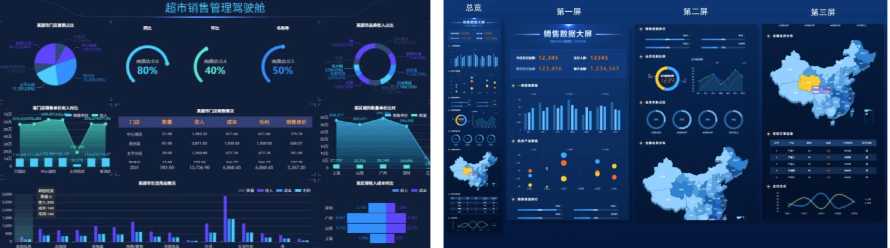
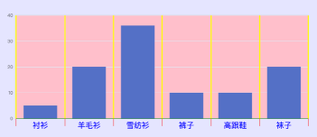
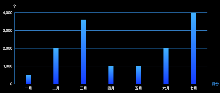
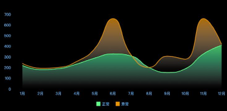
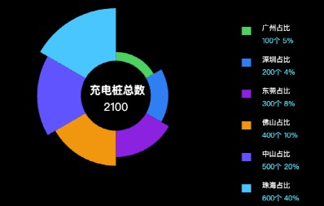
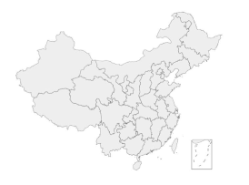
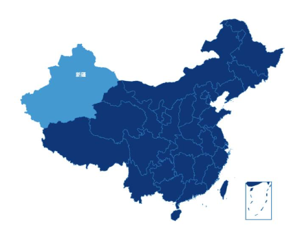
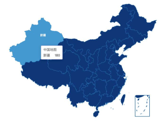
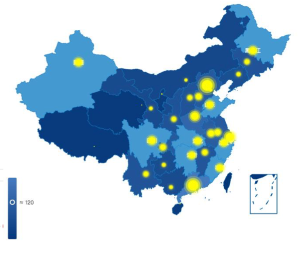

## 1.邂逅 ECharts

### 1.1.认识ECharts

什么是Echarts：

- ECharts （全称 EnterpriseCharts ）是企业级数据图表。官方的解释是：一个基于 JavaScript 的开源可视化图表库。
- ECharts可以流畅的运行在PC和移动设备上，兼容当前绝大部分浏览器（IE6/7/8/9/10/11，chrome，firefox，Safari等）。
- ECharts底层依赖轻量级的ZRender图形库，可提供直观，生动，可交互，可高度个性化定制的数据可视化图表。

ECharts的历史：

- ECharts由百度团队开源
- 2018年初，捐赠给Apache基金会，成为Apache软件基金会孵化级项目。
- 2021年1月26日晚，Apache基金会官方宣布 ECharts 项目正式毕业，成为Apache顶级项目。
- 2021年1月28日，ECharts5 线上发布会举行


### 1.2.ECharts应用场景

ECharts应用场景：

- 智慧城市、园区、航运、公安、机房、监所、电力、物业、应急管理等多个领域的数据可视化展示。



### 1.3.ECharts 的特点

- 丰富的图表类型
  - 提供开箱即用的 20 多种图表和十几种组件，并且支持各种图表以及组件的任意组合；


- 强劲的渲染引擎
  - Canvas、SVG 双引擎一键切换，增量渲染等技术实现千万级数据的流畅交互；


- 简单易容，上手容易
  - 直接通过编写配置，便可以生成各种图表，并且支持多种集成方式；


- 活跃的社区
  - 活跃的社区用户保证了项目的健康发展，也贡献了丰富的第三方插件满足不同场景的需求；


- 等等

## 2.EChars5初体验

### 2.1、初体验ECharts

集成 Echarts 的常见方式：

1. 通过 npm 获取 echarts：

   npm install echarts --save

2. 通过 jsDelivr 等 CDN 引入

初体验Echarts（容器必须设高度）


```html
<!-- ECharts 的容器( 必须要有高度,宽度是可选的 ) -->
<div id="main" style="height: 400px"></div>
<script src="../libs/echarts-5.3.3.js"></script>
<script>
  window.onload = function () {
    // 1.基于准备好的dom，初始化 echarts实例
    var myChart = echarts.init(document.getElementById("main"));

    // 2.指定图表的配置项和数据
    var option = {
      title: {
        text: "ECharts 入门示例",
        // ...
      },
      tooltip: {},
      legend: {
        data: ["销量"],
      },
      xAxis: {
        data: ["衬衫", "羊毛衫", "雪纺衫", "裤子", "高跟鞋", "袜子"],
      },
      yAxis: {},
      series: [
        {
          name: "销量",
          type: "bar",
          data: [5, 20, 36, 10, 10, 20],
        },
      ],
    };

    // 3.使用刚指定的配置项和数据显示图表。
    myChart.setOption(option);
  };
</script>
```

### 2.2、ECharts 渲染原理

浏览器端的图表库大多会选择 SVG 或者 Canvas 进行渲染。

ECharts 最开始时一直都是使用 Canvas 绘制图表。直到 ECharts v4.0版本，才发布支持 SVG 渲染器。

SVG 和 Canvas 这两种使用方式在技术上是有很大的差异的，EChart能够做到同时支持，主要归功于 ECharts 底层库 ZRender的抽象和实现。

ZRender是二维轻量级的绘图引擎，它提供 Canvas、SVG、VML 等多种渲染方式。

因此，Echarts 可以轻松的互换SVG 渲染器 和 Canvas 渲染器。切换渲染器只须在初始化图表时设置 renderer 
参数 为canvas或svg即可。

```js
window.onload = function () {
  // 切换为svg的渲染器( 默认是canvas )
  let myChart = echarts.init(document.getElementById("main"), null, {
    renderer: "svg",
  });
  let option = {
    xAxis: {
      data: ["衬衫", "羊毛衫", "雪纺衫", "裤子", "高跟鞋", "袜子"],
    },
    yAxis: {},
    series: [
      {
        type: "bar",
        data: [5, 20, 36, 10, 10, 20],
      },
    ],
  };
  myChart.setOption(option);
};
```

### 2.3、选择哪种渲染器

Canvas 更适合绘制图形元素数量较多的图表。如，热力图、炫光尾迹特效、地理坐标系、平行坐标系上的大规模线图等。

SVG 具有重要的优势：它的内存占用更低、适配性、扩展性性好，放大缩小图表不会模糊。

选择哪种渲染器？ 可以根据软硬件环境、数据量、功能需求综合考虑：

- 在软硬件环境较好，数据量不大的场景下，两种渲染器都可以适用，并不需要太多纠结。
- 在软硬件环境较差，出现性能问题需要优化的场景下，可以通过试验来确定使用哪种渲染器。比如有这些经验：
  - 在需要创建很多 ECharts 实例且浏览器易崩溃的情况下（可能因为 Canvas 数量多导致内存占用超出手机承受能力），可以使用 SVG 渲染器来进行改善。
  - 数据量较大（经验判断 > 1k）、较多交互时，建议选择 Canvas 渲染器。

## 3.ECharts 组件和配置

### 3.1.认识option配置项( 组件 )

- backgroundColor ：设置直角坐标系内绘图区域的背景
- grid 选项 ：直角坐标系内绘图区域
- yAxis 选项 ：直角坐标系 grid 中的 y 轴
- xAxis 选项 ：直角坐标系 grid 中的 x 轴
- title ：图表的标题
- legend：图例，展现了不同系列的标记、颜色和名字
- tooltip：提示框
- toolbox：工具栏，提供操作图表的工具
- series：系列，配置系列图表的类型和图形信息数据
- visualMap：视觉映射，可以将数据值映射到图形的形状、大小、颜色等
- geo：地理坐标系组件。用于地图的绘制，支持在地理坐标系上绘制散点图，线集。

### 3.2.Grid网格配置 （组件）

grid 选项 ：直角坐标系内绘图区域

- show : 是否显示直角坐标系网格。 boolean类型。
- left、right、top、bottom： grid 组件离容器左右上下的距离。 string | number类型。
- containLabel：grid 区域是否包含坐标轴的刻度标签。 boolean类型。
- backgroundColor： Color类型，网格背景色，默认透明。

### 3.3.坐标系配置（组件）

xAxis 选项 ：直角坐标系 grid 中的 x 轴

- show 是否显示 x 轴。 : boolean 类型。
- name：坐标轴名称。
- type ： 坐标轴类型。 string 类型。
  - value 数值轴，适用于连续数据。
  - category 类目轴，适用于离散的类目数据。类目数据可来源 xAxis.data、series.data或 dataset.source之一 。
- data：类目数据，在类目轴（type: 'category'）中有效。 array 类型
- axisLine： 坐标轴轴线相关设置。 object 类型
- axisTick：坐标轴刻度相关设置。 object 类型
- axisLabel：坐标轴刻度标签的相关设置。 object 类型
- splitLine：坐标轴在 grid区域中的分隔线。 object 类型
- ...

yAxis 选项 ：直角坐标系 grid 中的 y 轴，参数基本和 xAxis 差不多。



```js
window.onload = function () {
  let myChart = echarts.init(document.getElementById("main"));
  let option = {
    backgroundColor: "rgba(255, 0, 0, 0.1)",
    grid: {
      show: true,
      backgroundColor: "rgba(0, 255, 0, 0.1)",
    },

    xAxis: {
      show: true,
      name: "类目坐标",

      type: "category", // 类目坐标才有data选项
      data: ["衬衫", "羊毛衫", "雪纺衫", "裤子", "高跟鞋", "袜子"],

      axisLine: {
        // 坐标轴轴线相关设置。
        show: true,
        lineStyle: {
          color: "red",
          width: 3,
        },
      },

      axisLabel: {
        // 坐标轴刻度标签的相关设置。
        show: true,
        color: "green",
        fontSize: 16,
      },

      axisTick: {
        // 坐标轴刻度相关设置。
        show: true,
        length: 10,
        lineStyle: {
          color: "blue",
          width: 3,
        },
      },

      splitLine: {
        // 坐标轴在 grid 区域中的分隔线。
        show: true,
        lineStyle: {
          color: "orange",
          width: 1,
        },
      },
    },
    yAxis: {
      name: "数量 / 件",
      // type: "value",
    },
    series: [
      {
        type: "bar",
        data: [5, 20, 36, 10, 10, 20],
      },
    ],
  };
  myChart.setOption(option);
};
```

### 3.4、series 系列图配置（组件）

series：系列，配置系列图表的类型和图形信息数据。object[] 类型，每个object具体配置信息如下

- name：系列名称，用于tooltip的显示，legend的图例筛选等
- type：指定系列图表的类型，比如：柱状图、折线图、饼图、散点图、地图等
- data：系列中的数值内容数组。数组中的每一项称为数据项 。
  - 一维数组: [ value ， value ] 。（一维数组是二维数组的简写 ）
  - 二维数组。
    -  [ [index, value ]， [index, value ] ] ， 注意 index 从 0 开始
    - [ [x, y, value ]， [ x, y ， value ] ]， 注意这里的x 和 y 可以表示x轴和y轴，也可以表示 经度 和 纬度。
  - 对象类型( 推荐 )。[ { value: x， name: x， label: { }，itemStyle:{}、 emphasis:{} .... } ]
- label：图形上的文本标签（就近原则，data中的比series优先级高）
- itemStyle：图形样式。
- emphasis：高亮的图形样式和标签样式。
- coordinateSystem：该系列使用的坐标系，默认值为二维的直角坐标系（笛卡尔坐标系）

### 3.5、series 高亮的样式( emphasis )

鼠标悬浮到图形元素上时，高亮的样式。

- 默认情况高亮的样式是根据普通样式自动生成。但是也可自己定义
- 自定义主要是通过 emphasis属性来定制。
- emphsis的结构和普通样式结构相同

ECharts4以前，高亮和普通样式的写法

- 这种写法 仍然被兼容，但是不再推荐了

多数情况下，开发者只配置普通状态下的样式，让高亮的样式是根据普通样式自动生成。

### 3.6、标题、图例、提示配置（组件）

- title：图表的标题。object 类型。
  - text、top、left....
- legend：图例，展现了不同系列的标记、颜色和名字。object 类型。
  - show、icon、formatter、textStyle、itemWidth 、itemGap...
- tooltip：提示框组件。object 类型。
  - show、 trigger、axisPointer.....

### 3.7、Color 和 渐变色

ECharts中 Color 支持的格式：

- RGB、RGBA、关键字、十六进制格式

ECharts中的渐变色

- 线性渐变，前四个参数分别是（ x, y ）,（ x2, y2 ） 范围从 0 – 1。
- 径向渐变，前三个参数分别是圆心 x, y 和半径，取值同线性渐变

## 4.ECharts 图表实战

### 4.1.柱形图



### 4.2.折线图



### 4.3.饼图



### 4.4.地图

#### 4.4.1.地图-绘制

ECharts 可以使用 GeoJSON格式的数据作为地图的轮廓，可以获取第三方的 GeoJSON数据注册到 ECharts 中：

- https://github.com/echarts-maps/echarts-china-cities-js/tree/master/js/shape-with-internal-borders
- https://datav.aliyun.com/portal/school/atlas/area_selector

ECharts绘制地图步骤（方式一）：

1. 拿到GeoJSON数据
2. 注册对应的地图的GeoJSON数据（调用setOption前注册）
3. 配置geo选项。

ECharts绘制地图步骤（方式二）：

1. 拿到GeoJSON数据
2. 注册对应的地图的GeoJSON数据（调用setOption前注册）
3. 配置map series。

**geo 和 map series绘制地图的区别**

geo地理坐标系组件

- 会生成一个 geo 地理坐标系组件
- 地理坐标系组件用于地图的绘制
- 支持在地理坐标系上绘制散点图，线集。
- 该坐标系可以共其它系列复用
  - 注意：其他系列在复用该地理坐标系时，series的itemStyle等样式将不起作用

map series

- 默认情况下，map series 会自己生成内部专用的 geo 地理坐标系组件
- 地理坐标系组件用于地图的绘制
- 地图主要用于地理区域数据的可视化，配合data使用
- 配合 visualMap组件用于展示不同区域的人口分布密度等数据



#### 4.4.2.地图-着色

地图着色，可以通过 itemStyle 属性中的 areaColor 和 borderColor 属性。

- areaColor ：地图区域的颜色；
- borderColor：图形（边界）的描边颜色。



#### 4.4.3.地图-数据可视化

给地图添加数据，并可视化展示

- 添加一个map series
- 配置地图样式
- 添加地图所需的数据
- 添加 visualMap 视觉映射




#### 4.4.4.地图-涟漪特效散点图

给地图添加涟漪特效的散点图数据，并可视化展示

- 添加一个effectScatter series
- 指定使用的地理坐标系
- 添加地图所需的数据
- 修改标记的大小和样式
- 修改默认的tooltip提示



## 5.ECharts其它补充

### 5.1.Echarts 常见 API

全局 echarts 对象，在 script 标签引入 echarts.js 文件后获得，或者在 AMD 环境中通过 require('echarts') 获得。

- echarts. init( dom， theme， opts )：创建echartsInstance实例
- echarts. registerMap( mapName， opts )：注册地图
- echarts. getMap( mapName )：获取已注册地图

通过 echarts.init 创建的实例（echartsInstance）

- echartsInstance. setOption(opts)：设置图表实例的配置项以及数据，万能接口。
- echartsInstance. getWidth()、 echartsInstance. getHeight()：获取 ECharts 实例容器的宽高度。
- echartsInstance. resize(opts)：改变图表尺寸，在容器大小发生改变时需要手动调用。
- echartsInstance. showLoading()、 echartsInstance. hideLoading()：显示和隐藏加载动画效果。
- echartsInstance. dispatchAction( )：触发图表行为，例如：图例开关、显示提示框showTip等
- echartsInstance. dispose：销毁实例，销毁后实例无法再被使用
- echartsInstance. on()：通过 on 方法添加事件处理函数，该文档描述了所有ECharts的事件列表


### 5.2.响应式 Echarts 图表

响应式图片的实现步骤：

1. 图表只设置高度，宽度设置为100% 或 不设置。
2. 监听窗口的resize事件，即监听窗口尺寸的变化（需节流）。
3. 当窗口大小改变时，然后调用 echartsInstance.resize改变图表的大小。。

另外需要注意的是：

- 在容器节点被销毁时，可以调用 echartsInstance.dispose以销毁echarts的实例释放资源，避免内存泄漏。


