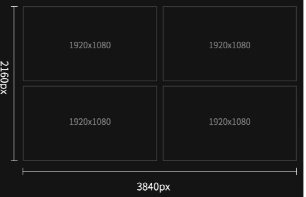
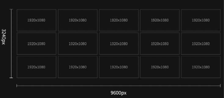
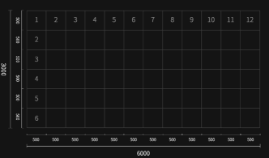
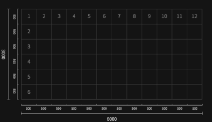
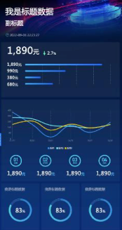
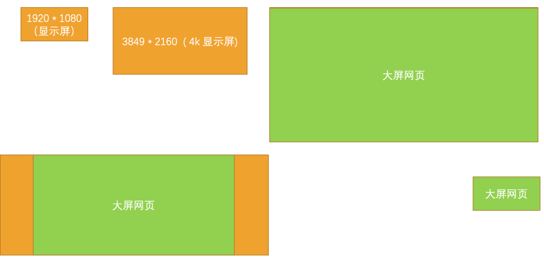
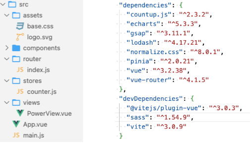

## 1.认识大屏设备

### 1.1.认识大屏

在开发网页时，我适配最多的屏幕尺寸是：

- PC端电脑：1920px * 1080px （当然也有少部分电脑是支持输出4k屏， 比如：小米笔记本等）
- 移动设备： 750px *  auto

那什么是大屏设备

- 在我们的生活中，经常会见到一些比较大的屏幕，比如：指挥大厅、展厅、展会中的大屏。这些设备就可以称之为大屏设备，当然1920*1080 和 3840*2160（4k 屏 ）也可以说是属于大屏。

大屏的应用场景

- 通常用在数据可视化，借助于图形化手段，清晰有效地传达与沟通信息
  - 比如用在：零售、物流、电力、水利、环保、交通、医疗等领域。

大屏的硬件设备的分类：

- 拼接屏、LED屏、投影等。

**大屏设备-拼接屏**

拼接屏

- 顾名思义就是很多屏幕按照一定拼接方式拼接而成。
  - 其实可以理解成是由很多电视（显示屏）拼接而成。
  - 常见的使用场景有指挥大厅、展厅、展会等等。

拼接方式取决于使用场景的需求，如下例子：

- 1920px * 1080px，即 1 * 1 个 显示屏（16 : 9）
- 3840 * 2160（4k 屏 ），即 2 * 2 个显示屏（16 : 9）
- 5760 * 3240，即 3 * 3 个显示屏（16 : 9）
- 7680 * 3240，即 4 * 3 个显示屏（64 : 27）
- 9600 * 3240，即 5 * 3 个显示屏（80 : 27）

**大屏设备- LED屏**

LED屏

- LED 也是现在大屏中常用的硬件，它是由若干单体屏幕模块组成的，它的像素点计算及拼接方式与拼接屏有很大区别。
- LED 可以看成是矩形点阵，具体拼接方式也会根据现场实际情况有所不同，拼接方式的不同直接影响到设计的尺寸规则。
- LED 屏有很多规格，各规格计算方法相同。
  - 比如，我们用单体为 500 * 500 的作为标准计算，每个单体模块像素点横竖都为 128px
  - 如右图，横向 12 块竖向 6 块，横向像素为 128*12=1536px，竖向 128*6=768px。可以使用横竖总像素去设计。
  - 最终算出的屏幕尺寸：1536px * 768px

### 1.2.定设计稿尺寸

**定设计稿尺寸 -拼接屏**

拼接屏

- 大多数屏幕分辨率是 1920 * 1080。当然也会有一些大屏，比如6 *  3的拼接屏，横向分辨率为 6 * 1920=11520px。竖向分辨率为3 * 1080=3240px。设计可以按照横竖计算后的总和（11520px * 3240px）作为设计尺寸。
- 这种尺寸过大的就不太适合按原尺寸设计，那怎么判断什么时候可以按照总和设计，什么时候最好不要按照总和设计。这有一个关键的节点 4K，超过 4K 后现有硬件会产生很多问题，例如：卡顿，GPU 压力过大，高负荷运行等等。
- 正常设计建议最好是保持在 4K 内，由于硬件问题，所以现在大家采用的都是输出 4K 及以下，既保证流畅度又能在视觉上清晰阅读。
- 所以设计时也要保持同样的规则。保持大屏的比例等比缩放即可。
- 注：最好是按照硬件的输出分辨率设计（关键），因为按照输出分辨率设计，一定不会出错。

比如

- 1920px * 1080px（1*1），设计搞尺寸 ：1920px * 1080px 。
- 3840 * 2160（2*2 4k 屏 ），设计搞尺寸 ： 3840 * 2160 。
- 5760 * 3240（3*3），设计搞尺寸 ： 5760 * 3240 。 7680 * 3240（4*3），设计搞尺寸 ： （ 3840 * 1620 需要出 1倍图 和 2倍图， 7680 * 3240 ）
- 9600 * 3240（5*3），设计搞尺寸 ： 比如：4800 * 1620，需要出 1倍图 和 2倍图
- ......

**定设计稿尺寸 -LED屏**

LED屏

- LED 大屏是由若干单体屏幕模块组成的，LED 屏有很多规格，但是规格计算方法相同。
- 比如：我们用单体为 500 * 500 的作为标准计算，每个单体模块像素点横竖都为 128px。
- 如图横向 12 块竖向 6 块，横向像素为 128*12=1536px，竖向 128*6=768px。可以使用横竖总像素去设计。
- 此处规则和之前的拼接屏一样，如果超过 4K 像素时可以等比缩放，建议尽量保持在 4k 及以下。

比如

- 1536px * 768px，设计搞尺寸 ： 1536px * 768px 。
- 4608 * 3072，设计搞尺寸 ： 4608 * 3072 。
- 9216 * 6144，设计搞尺寸 ：
  - 比如：4608 * 3072，需要出 1倍图 和 2倍图

**设计稿尺寸-移动端大屏**

对于移动端的大屏展示，基本按照实际尺寸设计即可，比如：

- 750px * Auto，设计搞尺寸 ： 750px * Auto 。

### 1.3.总结

大屏设计稿尺寸的总结：

- 设计尺寸建议按照输出分辨率设计（重点）
- 拼接后像素在 4k 左右直接按照总和设计就行
- 总和设计建议不要超过 4k，可以按比例缩小设计搞（非固定，超过也是可以，只是强烈建议）
- 建议定设计搞尺寸前，先了解硬件及信号输入输出，确定设计搞的尺寸。
- 特殊尺寸，需到现场调试最佳设计搞的尺寸。

大屏适配方案的总结：

- 特殊尺寸不要考虑适配电脑屏幕又适配拼接屏，因为完全没有必要，也不可能一稿既适配电脑也适配各种尺寸大屏。
- 这种情况应该优先考虑目标屏幕的适配，要针对性设计，而在小屏根据等比例缩放显示，这才是最佳的解决方法。

## 2.大屏适配方案

### 2.1.大屏适配方案

在学习大屏适配方案之前，我们现在回顾一下移动端的适配方案有哪些？

- 方案一：百分比设置；
  - 因为不同属性的百分比值，相对的可能是不同参照物，所以百分比往往很难统一；
  - 所以百分比在移动端适配中使用是非常少的；
- 方案二：rem单位 + 动态设置 html 的 font-size；
- 方案三：vw单位（推荐）；
- 方案四：flex的弹性布局（推荐） ；

大屏的幕尺寸通常也是非常多的，很多时候我们是希望页面在不同的屏幕尺寸上显示不同的尺寸，那大屏的适配方案有哪些？

- 方案一：百分比设置；
- 方案二：rem 单位 + 动态设置 html 的 font-size；
- 方案三：vw 单位；
- 方案四：flex 弹性布局；
- 方案五：scale 等比例缩放（推荐）

### 2.2.新建 大屏设备

在讲解大屏适配之前，我们先来创建几个大屏设备，这样可以方便我们学习和测试。

- 在chrome浏览器中，打开 DevTools 页面
- 在选择设备下拉栏中，点击最后一个选项 Edit
- 然后在Emulated Devices中点击 Add custom device ....
- 最后在Device面板中输入设备信息，并点击 Add 按钮完成设备的新建。
  - 这里分别新建：1920*1080 、 3840 * 2160 、 7680 * 2160

### 2.3.大屏适配方案1 – rem + font-size

动态设置HTML根字体大小 和 body 字体大小（lib_flexible.js）

- 将设计稿的宽（1920）平均分成 24 等份， 每一份为 80px。
- HTML字体大小就设置为 80 px，即1rem = 80px， 24rem = 1920px
- body字体大小设置为 16px。
- 安装 cssrem 插件， root font size 设置为 80px。这个是px单位转rem的参考值
  - px 转 rem方式：手动、less/scss函数、cssrem插件、webpack插件、Vite插件
- 接着就可以按照 1920px * 1080px 的设计稿愉快开发，此时的页面已经是响应式，并且宽高比不变。

### 2.4.大屏适配方案2 - vw

直接使用vw单位。

- 屏幕的宽默认为 100vw，那么100vw = 1920px， 1vw = 19.2px 。
- 安装 cssrem 插件， body的宽高（1920px * 1080px）直接把px单位转vw单位
  - px 转 vw 方式：手动、less/scss函数、cssrem插件、webpack插件、Vite插件
- 接着就可以按照 1920px * 1080px 的设计稿愉快开发，此时的页面已经是响应式，并宽高比不变。

### 2.5.大屏适配方案3（推荐） - scale

使用CSS3中的scale函数来缩放网页，这里我们将使用两种方案来实现：

- 方案一：直接根据宽度的比率进行缩放。（宽度比率=网页当前宽 / 设计稿宽）
- 方案二：动态计算网页宽高比，决定是是否按照宽度的比率进行缩放。

### 2.6.三种适配方案的对比

vw相比于rem的优势：

- 优势一：不需要去计算html的font-size大小，不需要给html设置font-size，也不需要设置body的font-size，防止继承；
- 优势二：因为不依赖font-size的尺寸，所以不用担心某些原因html的font-size尺寸被篡改，页面尺寸混乱；
- 优势三：vw相比于rem更加语义化，1vw是1/100的viewport大小（即将屏幕分成100份）; 并且具备 rem 之前所有的优点；

vw 和 rem 存在问题

- 如果使用rem或vw单位时，在JS中添加样式时，单位需要手动设置rem或vw。
- 第三方库的字体等默认的都是px单位，比如：element、echarts，因此通常需要层叠第三方库的样式。
- 当大屏比例更大时，有些字体还需要相应的调整字号。

scale相比vw和rem的优势

- 优势一：相比于vw 和 rem，使用起来更加简单，不需要对单位进行转换。
- 优势二：因为不需要对单位进行转换，在使用第三方库时，不需要考虑单位转换问题。
- 优势三：由于浏览器的字体默认最小是不能小于12px，导致rem或vw无法设置小于12px的字体，缩放没有这个问题。

## 3.开发注意事项

字体大小设置问题（非scale方案需要考虑）

- 如果使用rem或vw单位时，在JS中添加样式时，单位需要手动设置rem或vw。
- 第三方库的字体等默认的都是px单位，比如：element、echarts，因此通常需要层叠第三方库的样式。
- 当大屏比例更大时，有些字体还需要相应的调整字号。

图片模糊问题

- 切图时切1倍图、2倍图，大屏用大图，小屏用小图。
- 建议都使用SVG矢量图，保证放大缩小不会失真。

Echarts 渲染引擎的选择

- 使用SVG渲染引擎，SVG图扩展性更好

动画卡顿优化

- 创建新的渲染层、启用GPU加速、善用CSS3形变动画
- 少用渐变和高斯模糊、当不需要动画时，及时关闭动画

## 4.大屏项目实战

### 4.1.大屏项目搭建

创建Vue3项目：

- `npm init vue@latest`

安装依赖

- echarts：图表库（Canvas 、SVG）
- countup.js ：数据滚动插件
- gsap：javascript动画库
- axios ：网络请求库
- normalize.css：统一网页样式
- lodash：JavaScript工具函数库
- sass：scss 编译器

### 4.2.大屏项目布局搭建

大屏项目布局搭建

- 1920px*1080px 设计稿尺寸
- 目标设备 16 : 9

### 4.3.大屏项目适配

scale等比例缩放网页

- 当组件挂载完成之后，监听window的resize事件
- 获取当前的屏幕的宽度和高度
- 根据当前屏幕的宽高比来判断缩放的方式
  - 当前屏幕宽高比<=设计稿的宽高比，参考X轴缩放
  - 当前屏幕宽高比>设计稿的宽高比，参考Y轴缩放

### 4.4.Echarts 图表

Echarts 图表组件的封装

SVG组件的封装

### 4.5.新能源充电桩数据可视化平台

项目经验（可视化开发）

新能源充电桩数据可视化平台 广州弘源科教软件有限公司 （2020.02-2020-06）

- 技术：`Vue3`  `Vue Router` `Pinia`   `Echarts``   `Canvas   `SVG` `countup` `Scss`  `Git` 
- 描述：新能源充电桩数据可视化平台包：充电桩统计、流程监控，实时充电数据展示，充电桩排名，充电数据统计，异常监控等功能。
- 职责
  - 参与需求讨论，制定开发计划，统一项目开规范等
  - 独立负责大屏适配：小于2k屏、2k屏、4k屏、 大于4k屏 、16:9、非16:9等屏幕适配
  - 负责充电桩统计、流程监控，实时充电数据的可视化话开发，包括2D、2.5D和3D特效
  - 负责封装公共的图表组件，包括：地图、折线图、条形图、数字滚动、SVG组件等等

增加吸引力

- 亮点✓ - 首页性能优化包括：项目结构、代码、布局、图片、动画等，优化完首页访问速度提高1倍。
  - 大屏适配：小于2k屏、2k屏、4k屏、 大于4k屏 、16:9、非16:9等屏幕适配。
  - 公共图表组件封装、大大提高了开发效率和组件的复用度。
  - 制作了各种动画，包括CSS3、2D、2.5D、3D、Canvas、SVG、SMIL等炫酷动画特效。

