## 1、跨平台开发介绍

### 1.1、邂逅跨平台开发

- 传统移动端开发方式
  - 自从iOS和Android系统诞生以来，移动端开发主要由 iOS 和 Android 这两大平台占据。
  - 早期的移动端开发人员主要是针对 iOS 和 Android 这两个平台分别进行同步开发。
  - 原生开发模式优缺点：
    - 原生App在体验、性能、兼容性都非常好，并可以非常方便使用硬件设备，比如：摄像头、罗盘等
    - 但是同时开发两个平台，无论是成本上，还是时间，对于企业来说这个花费都是巨大，不可接受的。
    - 纯原生 开发效率 和 上线周期 也严重影响了应用快速的迭代，也不利于多个平台版本控制等。
- 跨平台开发的诞生
  - 因为原生App存在：时间长、成本高、迭代慢、部署慢、不利于推广等因素。
  - 导致了跨平台开发的概念渐渐走进了人们的视野。
  - 因此 “一套代码，多端运行” 的跨平台理念也应运而生 。

- 原生 VS 跨平台
  - 原生开发的特点：
    - 性能稳定，使用流畅，用户体验好、功能齐全，安全性有保证，兼容性好，可使用手机所有硬件功能等
    - 但是开发周期长、维护成本高、迭代慢、部署慢、新版本必须重新下载应用
    - 不支持跨平台，必须同时开发多端代码
  - 跨平台开发的特点：
    - 可以跨平台，一套代码搞定iOS、Android、微信小程序、H5应用等
    - 开发成本较低，开发周期比原生短
    - 适用于跟系统交互少、页面不太复杂的场景。
    - 但是对开发者要求高，除了本身JS的了解，还必须熟悉一点原生开发
    - 不适合做高性能、复杂用户体验，以及定制高的应用程序。比如：抖音、微信、QQ等。
    - 同时开发多端兼容和适配比较麻烦、调试起来不方便。

### 1.2、跨平台发展史

- 跨平台发展史
  - 2009年以前，当时最要是使用最原始的HTML + CSS + JS进行移动端App开发。
  - 2009-2014年间， 出现了PhoneGap、Cordova等跨平台框架，以及Ionic轻量级的手机端UI库。
  - 2015年，ReactNative（跨平台框架）掀起了国内跨平台开发热潮，一些互联网大厂纷纷投入 ReactNative 开发阵营。
  - 2016年，阿里开源了Weex，它是一个可以使用现代化Web技术开发高性能原生应用的框架。
  - 2017年Google I/O大会上，Google正式向外界公布了Flutter，一款跨平台开发工具包，用于为Android、iOS、Web、Windows、Mac等平台开发应用。
  - 2017年至今，微信小程序、uni-app、Taro 等一系列跨平台小程序框架陆续流行起来了。
- 应该如何选择？个人建议
  - 需要做高性能、复杂用户体验、定制高的APP、需硬件支持的选原生开发
  - 需要性能较好、体验好、跨Android、iOS平台、 H5平台、也需要硬件支持的选 Flutter（采用Dart开发）
  - 需要跨小程序、H5平台、Android、iOS平台、不太复杂的先选 uni-app，其次选 Taro
  - 不需要扩平台的，选择对应技术框架即可。

### 1.3、跨平台框架对比


- uniapp性能是否较高存疑

## 2、初体验uni-app

### 2.1、认识uni-app

官网对uni-app的介绍：

- uni-app 是一个使用Vue.js 开发前端应用的框架。
- 即开发者编写一套代码，便可发布到iOS、Android、Web（响应式）、以及各种小程序（微信/支付宝/百度/头条/飞书/QQ/快手/钉钉/淘宝）、快应用等多个平台。
- uni-app在手，做啥都不愁。即使不跨端， uni-app也是更好的小程序开发框架、更好的App跨平台框架、更方便的H5开发框架。不管领导安排什么样的项目，你都可以快速交付，不需要转换开发思维、不需要更改开发习惯。

uni-app的历史

- uni-app中的 uni，读 you ni，是统一的意思。
- DCloud于2012年开始研发的小程序技术，并推出了 HBuilder X 开发工具。
- 2015年，DCloud正式商用了自己的小程序，产品名为“流应用”，
  - 并捐献给了工信部旗下的HTML5中国产业联盟。
- 该应用能接近原生功能和性能的App，并且即点即用，不需要安装。
- 微信团队经过分析，于2016年初决定上线微信小程序业务，但其没有接入中国产业联盟标准，而是订制了自己的标准。

### 2.2、uni-app VS 微信小程序

uni-app和微信小程序相同点：

- 都是接近原生的体验、打开即用、不需要安装
- 都可开发微信小程序、都有非常完善的官方文档

uni-app和微信小程序区别：

- uni-app支持跨平台，编写一套代码，可以发布到多个平台，而微信小程序不支持
- uni-app纯Vue体验、高效、统一、工程化强，微信小程序工程化弱、使用小程序开发语言。
- 微信小程序适合较复杂、定制性较高、兼容和稳定性更好的应用
- uni-app适合不太复杂的应用，因为需要兼容多端，多端一起兼容和适配增加了开发者心智负担

uni-app 和 微信小程序，应该如何选择？

- 需要跨平台、不太复杂的应用选 uni-app，复杂的应用使用uni-app反而增加了难度。
- 不需要跨平台、较复杂、对兼容和稳定性要求高的选原生微信小程序。

### 2.3、uni-app架构图


### 2.4、uni-app初体验

#### 2.4.1、创建uni-app项目

创建uni-app项目

- 支持 可视化界面 和 Vue-CLI 两种方式。可视化方式比较简单，HBuilder X 内置相关环境，开箱即用。

开发工具 HBuilder X：

- Hbuilder X 是通用的前端开发工具，但为 uni-app 做了特别强化 。
  - 下载地址：https://hx.dcloud.net.cn/Tutorial/install/windows
- 安装完之后可以注册一个Dcloud的开发者账号(左下角可以点击注册)
- 注意：用Vue3的Composition API 建议用 HBuilder X最新Alpha版，旧版有兼容问题

创建方式

- 方式一（推荐）：HBuilderX创建 uni-app项目步骤：

  - 点工具栏里的文件 -> 新建 -> 项目（快捷键Ctrl+N）

  - 选择uni-app类型，输入工程名，选择模板，选择Vue版本，点击创建即可。

- 方式二： Vue-CLI 命令行创建

  - 全局安装Vue-CLI （目前仍推荐使用 vue-cli 4.x ）： `npm install -g @vue/cli@4 `

  - 创建项目：`vue create -p dcloudio/uni-preset-vue my-project-name`

#### 2.4.2、HBuilder X 开发工具

- HBuilderX从v3.2.5(包含)开始优化了对vue3的支持。
  - 完善的提示，在代码助手右侧还能看到清晰的帮助描述。
  - 支持css中使用v-bind提示和参数变量提示及转到定义(Alt+click)
  - Vue3推荐使用的setup语法糖支持也完全支持。
  - 在data、props和setup中定义的变量以及methods和setup内定义的函数都能在template中提示和转到定义(Alt+click)。
- HBuilderX支持各种表达式语法，如less、scss、stylus、typescript等高亮，无需安装插件。
- this的精准识别和语法提示。
- 组件的标签、属性都可以直接被提示出来。
- 不管是关闭HBuilder，还是断电、崩溃，临时文件始终会自动保存。
- 更多功能看官方文档：https://hx.dcloud.net.cn/Tutorial/Language/vue

#### 2.4.3、运行uni-app

- 在浏览器运行
  - 选中uniapp 项目，点击工具栏的运行 -> 运行到浏览器 -> 选择浏览器，即可体验 uni-app 的 web 版。

- 在微信开发者工具运行

  - 选中uniapp项目，点击工具栏的运行 -> 运行到小程序模拟器 -> 微信开发者工具，即可在微信开发者工具里面体验 uni-app。

  - 其它注意事项：
    - 微信开发者工具需要开启服务端口：小程序开发工具设置 -> 安全（目的是让HBuilder可以启动微信开发者工具）
    - 如第一次使用，需配置微信开发者工具的安装路径（会提示下图）。
      - 点击工具栏运行 -> 运行到小程序模拟器 -> 运行设置，配置相应小程序开发者工具的安装路径
    - 自动启动失败，可用微信开发者工具手动打开项目（项目在unpackage/dist/dev/mp-weixin路径下）。

- 在运行App到手机或模拟器（需要先安装模拟器）

  - 先连接真机 或者 模拟器（Android的还需要配置adb调试桥命令行工具）

  - 选中uniapp项目，点击工具栏的运行 -> 运行App到手机或模拟器，
    - 即可在该设备里面体验uni-app（支持中文路径）。

**安装mumu模拟器**

- 第一步：下载mumu模拟器：https://mumu.163.com/mac/index.html
- 第二步：安装mumu模拟器
- 第三步：配置adb调试桥命令行工具（用于 HBuilder X 和Android模拟器建立连接，来实时调试和热重载。HBuilder X 是有内置adb的 )
  - HBuilderX 3.8.4 的adb目录位置：安装路径下的 plugins/launcher/tools/adbs 目录( 需先运行后安装了插槽才会有该目录 )
    - 而MAC下为/Applications/HBuilderX-Alpha.app/Contents/HBuilderX/plugins/launcher/tools/adbs目录
  - 在adbs目录下运行./adb ，即可使用adb命令（Win和Mac一样）。
  - 如想要全局使用 adb 命令，window电脑可在：设置 -> 高级设计 -> 环境变量中设置
- 第四步：HBuilder X 开发工具连接mumu模拟器，使用adb调试桥来连接
  - adb connect 127.0.0.1:7555 （ 端口是固定的，启动mumu模拟器默认是运行在7555端口）
- 第五步：选中项目 -> 运行 ->运行App到手机或模拟器-> 选中Android基座（基座其实是一个app壳）

**安装其它模拟器**

- Mac 电脑：
  - 可以安装 Xcode 或者 Android Studio 软件。推荐 XCode。
- Window电脑：
  - 安装mumu、夜神、雷电模拟器等（推荐）
  - 可以安装 Android Studio 软件（模拟器大、速度慢、卡）。

## 3、uni-app全局文件

### 3.1、目录结构

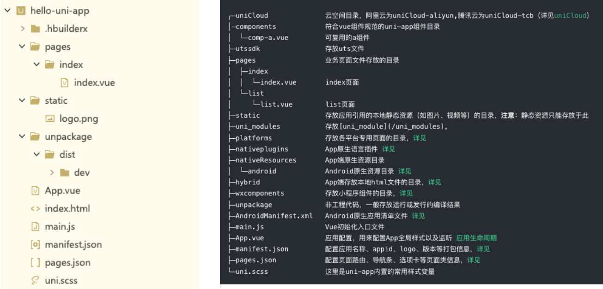

### 3.2、开发规范

- 为了实现多端兼容，综合考虑编译速度、运行性能等因素，uni-app 约定了如下开发规范：
- 页面文件遵循 Vue 单文件组件 (SFC) 规范
- 组件标签靠近小程序规范，详见uni-app 组件规范
- 接口能力（JS API）靠近微信小程序规范，但需将前缀 wx 替换为 uni，详见uni-app接口规范
- 数据绑定及事件处理同 Vue.js 规范，同时补充了App及页面的生命周期
- 为兼容多端运行，建议使用flex布局进行开发，推荐使用rpx单位（750设计稿）。
- 文档直接查看uni-app的官网文档： https://uniapp.dcloud.net.cn/

### 3.3、main.js

main.js是 uni-app 的入口文件，主要作用是：

- 初始化vue实例。
- 定义全局组件。
- 定义全局属性。
- 安装插件，如：pinia、vuex 等。

```vue
import App from './App'

// #ifndef VUE3
import Vue from 'vue'
import './uni.promisify.adaptor'
Vue.config.productionTip = false
App.mpType = 'app'
const app = new Vue({
  ...App
})
app.$mount()
// #endif

// #ifdef VUE3
import { createSSRApp } from 'vue'
export function createApp() {
  const app = createSSRApp(App)
  return {
    app
  }
}
// #endif
```

### 3.4、App.vue

 App.vue入口组件

- App.vue是uni-app的入口组件，所有页面都是在App.vue下进行切换
- App.vue本身不是页面，这里不能编写视图元素，也就是没有<template>元素

App.vue的作用：

- 应用的生命周期
- 编写全局样式
- 定义全局数据 globalData

注意：应用生命的周期仅可在App.vue中监听，在页面监听无效。

```vue
<script>
	export default {
		onLaunch: function() {
			console.log('App Launch')
		},
		onShow: function() {
			console.log('App Show')
		},
		onHide: function() {
			console.log('App Hide')
		}
	}
</script>

<style>
	/*每个页面公共css */
</style>

```

### 3.5、全局和局部样式

全局样式

- App.vue 中style的样式为全局样式，作用于每一个页面（style标签不支持scoped，写了导致样式无效）。
  - App.vue 中通过 @import 语句可以导入外联样式，一样作用于每一个页面。
- uni.scss 文件也是用来编写全局公共样式，通常用来定义全局变量。
  - uni.scss 中通过 @import 语句可以导入外联样式，一样作用于每一个页面。

```css
@import "@/static/css/variable.css";
@import "@/static/css/base.scss";
```

局部样式

- 在 pages 目录下 的 vue 文件的style中的样式为局部样式，只作用对应的页面，并会覆盖 App.vue 中相同的选择器。
- vue文件中的style标签也可支持scss等预处理器，比如：安装dart-sass插件后，style标签便可支持scss写样式了。
- style标签支持scoped吗？不支持，不需写。

### 3.6、uni.scss

uni.scss 全局样式文件

- 为了方便整体控制应用风格。 默认定义了uni-app框架内置全局变量，当然也可以存放自定义的全局变量等
- 在uni.scss中定义的变量，我们无需 @import 就可以在任意组件中直接使用。
- 使用uni.scss中的变量，需在 HBuilderX 里面安装 scss 插件（dart-sass插件），
- 然后在该组件的 style 上加 lang=“scss”，重启即可生效。

注意事项：

- 这里的uni-app框架内置变量和后面uni-ui组件库的内置变量是不一样的。
- uni.scss定义的变量是全局可以直接使用，App.vue定义的变量只能在当前组件中使用。

### 3.7、页面调用接口

getApp() 函数( 兼容h5、weapp、app )：

- 用于获取当前应用实例，可用于获取globalData 。

getCurrentPages() 函数( 兼容h5、weapp、app )

- 用于获取当前页面栈的实例，以数组形式按栈的顺序给出。
  - 数组：第一个元素为首页，最后一个元素为当前页面。
- 仅用于展示页面栈的情况，请勿修改页面栈，以免造成页面状态错误。
- 常用方法如下图所示：

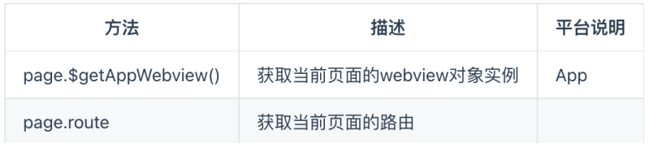

### 3.8、page.json

page.json全局页面配置（兼容h5、weapp、app ）

- pages.json 文件用来对 uni-app 进行全局配置，类似微信小程序中app.json。
- 决定页面的路径、窗口样式、原生的导航栏、底部的原生tabbar 等。

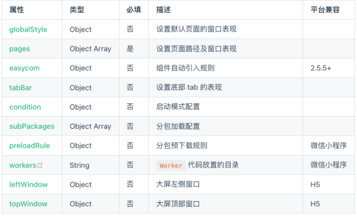

### 3.9、manifest.json

 manifest.json应用配置

- Android平台相关配置
- iOS平台相关配置
- Web端相关的配置
- 微信小程序相关配置
  - wxbc30134b589795b0
- ....

## 4、内置组件和样式

### 4.1、常用内置组件

-  view：视图容器。类似于传统html中的div，用于包裹各种元素内容。（视图容器可以使用div吗？可以，但div不跨平台）
- text：文本组件。用于包裹文本内容。
- button：在小程序端的主题 和 在其它端的主题色不一样（可通过条件编译来统一风格）。
-  image：图片。默认宽度 320px、高度 240px
  - 仅支持相对路径、绝对路径，支持导入，支持 base64 码；
- scrollview：可滚动视图区域，用于区域滚动。
  - 使用竖向滚动时，需要给 <scroll-view> 一个固定高度，通过 css 设置 height
  - 使用横向滚动时，需要给<scroll-view>添加white-space: nowrap;样式，子元素设置为行内块级元素。
  - APP和小程序中，请勿在 scroll-view 中使用 map、video 等原生组件。
  - 小程序的 scroll-view 中也不要使用 canvas、textarea 原生组件。
  - 若要使用下拉刷新，建议使用页面的滚动，而不是 scroll-view 。
- swiper：滑块视图容器，一般用于左右滑动或上下滑动比如banner轮播图。
  - 默认宽100%，高为150px，可设置swiper组件高度来修改默认高度，图片宽高可用100%。

```vue
<template>
	<view class="content">
		<!-- 直接写div是可以,但是不推荐, 并且这个div标签是不跨平台组件 -->
		<!-- <div>我是一个div</div> -->
		<view class="title">1.我是一个View组件(是一个跨平台组件)</view>
		<text class="text">2.我是一个Text组件</text>
		<button type="default">3.我是一个button</button>
		<!-- primary 是一个主题色 
		 1. 自己封装一个button
		 2. 重写button的样式( 条件编译 )		
		-->
		<button type="primary">4.我是一个button</button>

		<!-- 图片 -->
		<!-- 相对路径 -->
		<!-- <image src="../../static/images/cvy.png" mode="widthFix"></image> -->
		<!-- 绝对路径 -->
		<!-- <image src="@/static/images/cvy.png" mode="widthFix"></image> -->
		<!-- 导入的图片 -->
		<image class="image" :src="cvy" mode="widthFix"></image>
		<!-- base64 字符串 -->

		<scroll-view scroll-y="true" class="hy-v-scroll">
			<view class="v-item">item1</view>
			<view class="v-item">item2</view>
			<view class="v-item">item3</view>
			<view class="v-item">item4</view>
			<view class="v-item">item5</view>
			<view class="v-item">item6</view>
			<view class="v-item">item7</view>
		</scroll-view>

		<scroll-view scroll-x="true" class="hy-h-scroll" :show-scrollbar="false">
			<view class="h-item">item1</view>
			<view class="h-item">item2</view>
			<view class="h-item">item3</view>
			<view class="h-item">item4</view>
			<view class="h-item">item5</view>
			<view class="h-item">item6</view>
			<view class="h-item">item7</view>
		</scroll-view>

		<swiper class="hy-swiper" :indicator-dots="true" indicator-active-color="#ff8198" indicator-color="#f8f8f8"
			:autoplay="true" :interval="3000" :duration="1000">
			<swiper-item>
				<image class="swiper-image" src="@/static/images/banner/banner01.jpeg"></image>
			</swiper-item>
			<swiper-item>
				<image class="swiper-image" src="@/static/images/banner/banner02.jpeg"></image>
			</swiper-item>
		</swiper>

	</view>
</template>
```

### 4.2、尺寸单位（rpx）

uni-app 支持的通用 css 单位包括 px、rpx（推荐单位）、vh、vw

- px 即屏幕像素，rpx 是响应式像素（ responsive pixel ），可以根据屏幕宽度进行自适应。
- 规定屏幕宽为750rpx。如在 iPhone6 上，屏幕宽度为375px，共有750个物理像素。
  - 则750rpx = 375px = 750物理像素，1rpx = 0.5px = 1物理像素。
- 建议： 开发微信小程序时设计师可以用 iPhone6 作为设计稿的标准（即：设计稿宽度为750px）。

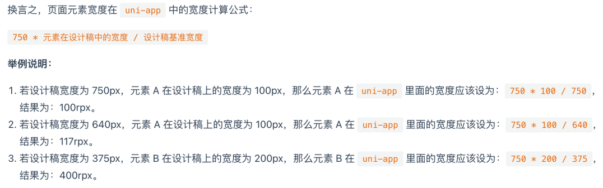

### 4.3、样式导入

- 使用@import语句可以导入外联样式（css 或 scss）
- @import后跟需要导入的外联样式表的相对路径， 用 ; 表示语句结束。
  - 除了相对路径，默认是支持绝对路径（即@别名前缀）
    - 相对路径：../../common/base.css
    - 绝对路径：@/static/common/base.css

### 4.4、背景图片

 uni-app 支持使用在 css 里设置背景图片，使用方式与普通 web 项目大体相同，但需要注意以下几点：

- 支持 base64 格式图片，支持网络路径图片。
- 小程序不支持在 css 中使用本地文件，包括背景图和字体文件，需转成 base64 后使用。如何转？
- 使用本地背景图片或字体图标需注意：
  - 为方便开发者，在背景图片小于 40kb 时，uni-app 编译到不支持本地背景图的平台时，会自动将其转化为 base64 格式；
  - 图片大于等于 40kb，会有性能问题，不建议使用太大的背景图，如开发者必须使用，则需自己将其转换为 base64 格式使用，或将其挪到服务器上，从网络地址引用。
  - 本地背景图片的引用路径推荐使用以 ~@ 开头的绝对路径。

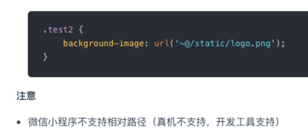

### 4.5、字体图标

 uni-app 支持使用字体图标，使用方式与普通 web 项目相同，注意事项也会背景图片一样，使用步骤如下：

- 先制作字体图标，比如：可以在iconfont网站中生成
- 将字体图标文件引入项目，比如：iconfont.ttf
- 在全局的css中引入字体图标，比如：App.vue

## 5、扩展组件 uni-ui

### 5.1、扩展组件（uni-ui）介绍

 什么是 uni-ui？

- uni-ui是DCloud提供的一个UI组件库，一套基于Vue组件、flex布局的跨全端UI框架。
- uni-ui不包括uni-app框架提供的基础组件，而是基础组件的补充。
- 详情：https://uniapp.dcloud.net.cn/component/uniui/uni-ui.html

uni-ui 特点

- 高性能
  - 目前为止，在小程序和混合app领域，uni-ui是性能的标杆。
  - 自动差量更新数据。uni-app引擎底层会自动用diff算法更新数据。
  - 优化逻辑层和视图层通讯折损。 比如，需要跟手式操作的UI组件，底层使用了wxs、bindingx等技术，实现了高性能的交互体验
    - WXS（WeiXin Script）是小程序的一套脚本语言，结合 WXML，可以构建出页面的结构。在 iOS 设备上小程序内的 WXS 会比 JavaScript 代码快 2 ~ 20 倍。
    - bindingx技术提供了一种称之为表达式绑定(Expression Binding) 的机制，在 weex 上让手势等复杂交互操作以60fps的帧率流畅执行，而不会导致卡顿。
- 全端
  - uni-ui的组件都是多端自适应的，底层会抹平很多小程序平台的差异或bug。
  - uni-ui还支持nvue原生渲染、以及PC宽屏设备
- 风格扩展
  - uni-ui的默认风格是中型的，与uni-app基础组件风格一致。
  - 支持uni.scss ，可以方便的扩展和切换应用的风格。

### 5.2、安装 uni-ui 组件库

- 方式一（推荐）：通过 uni_modules（插件模块化规范）单独安装组件，通过 uni_modules 按需安装某个组件：
  - 步骤1：官网找到扩展组件清单，然后将所需要的组件导入到项目，导入后直接使用，无需import和注册。
  - 步骤2：通常我们还想切换应用风格，这时可以在uni.scss导入uni-ui提供的内置scss变量，然后重启应用。
  - 注意：需要登录 DCloud 账号才能安装
- 方式二（推荐） ：通过 uni_modules 导入全部组件
  - 如想把所有uni-ui组件导入到项目，可以借用Hbuilder X插件导入。
  - 如没自动导入其他组件，可在 uni-ui 组件目录上右键选择 安装三方插件依赖 即可。
- 方式三：在 HBuilderX 新建 uni-app项目时，在模板中选择 uni-ui 模板来创建项目
  - 由于uni-app独特的easycom（自动导包）技术，可以免引入、注册，就直接使用符合规则的vue组件。
- 方式四：npm安装
  - 在 vue-cli 项目中可用 npm 安装 uni-ui 库
  - 或直接在 HBuilderX 项目中用 npm安装 

### 5.3、定制 uni-ui 主题风格

- 安装dart-sass插件(一般都会提示，并自动安装)
- 在项目根目录的uni.scss文件中引入uni-ui组件库的variable.scss变量文件，然后就可以使用或修改对应的scss变量。
- 变量主要定义的是主题色。

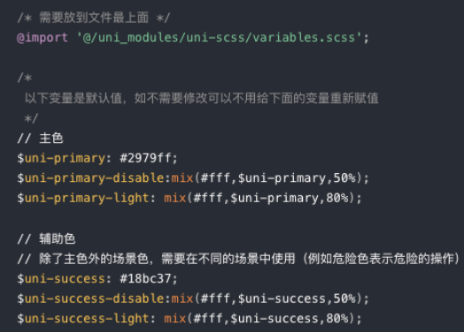

### 5.4、uni-forms 组件

uni-forms 组件使用步骤（类似Element Plus的表单组件用法）：

- 安装uni-forms 等组件
- uni-forms 搭建表单布局
- 编写表单项的验证规则
- 提交表单时验证表单项
- 重置表单

```vue
<template>
	<view class="login">
		<uni-forms ref="form" :modelValue="formData" :rules="rules">
			<uni-forms-item label="账号" name="username" required>
				<uni-easyinput type="text" v-model="formData.username" placeholder="请输入账号" />
			</uni-forms-item>
			<uni-forms-item label="密码" name="password" required>
				<uni-easyinput type="password" v-model="formData.password" placeholder="请输入密码" />
			</uni-forms-item>
		</uni-forms>
		<button type="default" @click="submit">提交表单</button>
		<button type="default" @click="reset">重置</button>
	</view>
</template>

<script>
	export default {
		data() {
			return {
				formData: {
					username: null,
					password: null
				},
				rules: {
					username: {
						rules: [
							{
								required: true,
								errorMessage: '请输入账号'
							}
						]
					},
					password: {
						rules: [
							{
								required: true,
								errorMessage: '请输入密码'
							},
							{
								minLength: 6,
								maxLength: 8,
								errorMessage: '请输入6-8位的密码'
							}
						]
					}
				}
			};
		},
		methods: {
			submit() {
				console.log('submit');
				this.$refs.form.validate().then((value) => {
					// 表单验证成功
					console.log(value);
				}).catch((err) => {
					// 表单验证失败
					console.error(err);
				} )
			},
			reset() {
				console.log('reset');
				// 清除表单验证的结果
				this.$refs.form.clearValidate()
				// 重置表单的值
				Object.keys(this.formData).forEach((key) => {
					this.formData[key] = null
				})
			}
		}
	}
</script>
```

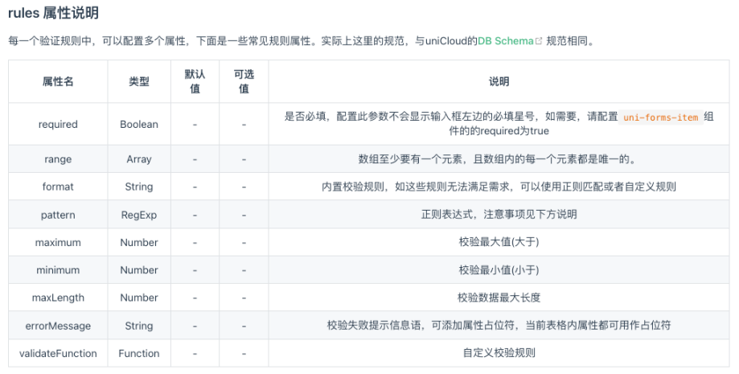

### 5.5、重写 uni-forms 组件样式

- 小程序、App直接重写，需要添加 important
- H5、App和小程序使用：global( selector ) ，需要添加important
- H5 、App和小程序使用：deep( selector ) ，需要添加important

```css
// 方案一: weapp app
.uni-forms-item__label {
	color: red !important;
	padding-left: 10rpx;
}


// 方案二: weapp  h5  app
:deep(.uni-forms-item__label) {
	color: pink !important;
}

// 方案三: weapp h5 app
:global(.uni-forms-item__label) {
	color: purple !important;
}

```

## 6、跨端兼容实现

### 6.1、跨平台兼容

uni-app能实现一套代码、多端运行，核心是通过编译器 + 运行时实现的：

- 编译器：将uni-app统一代码编译生成每个平台支持的特有代码；如在小程序平台，编译器将.vue文件拆分生成wxml、wxss、js等。
- 运行时：动态处理数据绑定、事件代理，保证 Vue和对应宿主平台 数据的一致性；

跨平台存在的问题：

- uni-app 已将常用的组件、JS API 封装到框架中，开发者按照 uni-app 规范开发即可保证多平台兼容，大部分业务均可直接满足。
- 但每个平台有自己的一些特性，因此会存在一些无法跨平台的情况。
  - 大量写 if else，会造成代码执行性能低下和管理混乱。
  - 编译到不同的工程后二次修改，会让后续升级变的很麻烦。

跨平台兼容解决方案：

- 在 C 语言中，通过 #ifdef、#ifndef 的方式，为 windows、mac 等不同 os 编译不同的代码。
- uni-app 参考这个思路，为 uni-app 提供了条件编译手段，在一个工程里优雅的完成了平台个性化实现。

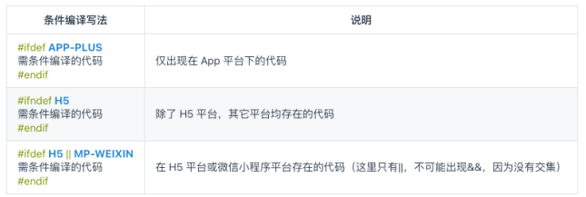

### 6.2、条件编译

条件编译是用特殊的注释作为标记，在编译时根据这些特殊的注释，将注释里面的代码编译到不同平台。

具体的语法：以 #ifdef 或 #ifndef 加 %PLATFORM% 开头，以 #endif 结尾。

- #ifdef：if defined 仅在某平台存在
- #ifndef：if not defined 除了某平台均存在
- %PLATFORM%：平台名称

支持条件编译的文件

- .vue（template 、script 、style）
- .js 、.css 、pages.json
- 各预编译语言文件，如：.scss、.less、.stylus、.ts、.pug

例如：设置页面的标题

- H5专有API：document.title = ’’
- 微信小程序专有API：wx.setNavigationBarTitle(object)

注意事项

- 条件编译是利用注释实现的，在不同语法里注释写法不一样
  - js使用 // 注释
  - css 使用 /* 注释 */
  - vue/nvue 模板里使用 <!-- 注释 -->
- 条件编译 APP-PLUS 包含 ：APP-NVUE 和 APP-VUE
- APP-PLUS-NVUE 和 APP-NVUE 没什么区别，为了简写后面出了 APP-NVUE
- 使用条件编译请保证编译前和编译后文件的正确性，比如 json 文件中不能有多余的逗号
- Android 和 iOS 平台不支持条件编译，如需区分 Android、iOS 平台，请通过调用 uni.getSystemInfo 来获取平台信息
- 微信小程序主题色是绿色，而百度支付宝小程序是蓝色，应用想分平台适配颜色，条件编译是代码量最低、最容易维护的

## 7、页面路由和传参

### 7.1、新建Page页面

 uni-app页面是编写在pages目录下：

- 可直接在 uni-app 项目上右键“新建页面”，HBuilderX会自动在pages.json中完成页面注册。
- HBuilderX 还内置了常用的页面模板（如图文列表、商品列表等），这些模板可以大幅提升你的开发效率。

注意事项：

- 每次新建页面，需在pages.json中配置pages列表（手动才需配置）
- 未在pages.json -> pages 中配置的页面，uni-app会在编译阶段进行忽略。

删除页面：

- 删除.vue文件 和 pages.json中对应的配置

配置tabBar

- color
- selectedColor
- list -> pagePath、text、iconPath、selectedIconPath

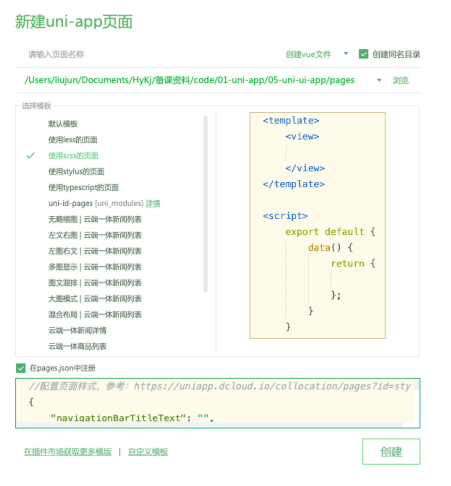

### 7.2、页面路由

uni-app 有两种页面路由跳转方式：使用navigator组件跳转、调用API跳转（类似小程序，与vue-router不同）。

- 组件：navigator
- API：navigateTo、redirectTo、navigateBack、switchTab

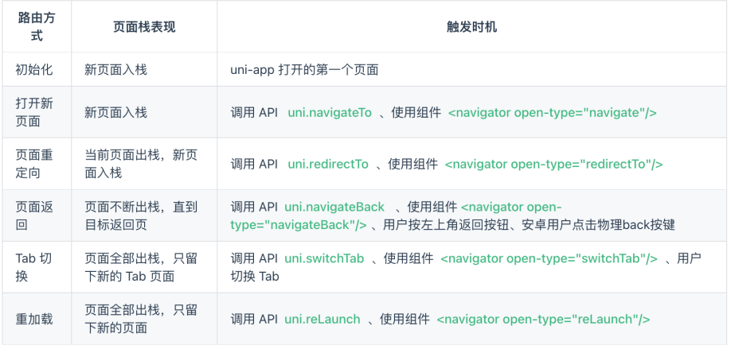

### 7.3、页面间通讯

- 在uni-app中，常见页面通讯方式：
  - 方式一：url查询字符串和EventChannel 
  - 方式二：使用事件总线
  - 方式三：全局数据 globalData
  - 方式四：本地数据存储
  - 方式五：Vuex和Pinia，状态管理库。
- 方式一：url和EventChannel(兼容h5、weapp、app) 
  - 直接在url后面通过查询字符串的方式拼接
    - 如url查询字符串出现特殊字符等格式，需编码
  - 然后可在onLoad生命周期中获取url传递的参数
- EventChannel 对象的获取方式
  - Options语法：this.getOpenerEventChannel()
  - Composition语法：getCurrentInstance().proxy. getOpenerEventChannel()

### 7.5、事件总线

 方式二：事件总线

- uni.$emit( eventName, OBJECT ) 触发全局的自定义事件。
- uni.$on( eventName, callback ) 监听全局的自定义事件。由 uni.$emit 触发。
- uni.$once( eventName, callback ) 只监听一次全局的自定义事件。由 uni.$emit 触发
- uni.$off( eventName, callback ) 移除全局自定义事件监听器。
  - 如果没有提供参数，则移除所有的事件监听器；

注意事项：

- 需先监听，再触发事件，比如：你在A界面触发，然后跳转到B页面后才监听是不行的。
- 通常on 和 off 是同时使用，可以避免多次重复监听
- 适合页面返回传递参数、适合跨组件通讯，不适合界面跳转传递参数

## 8、其它常用API

### 8.1、页面生命周期

#### 8.1.1、Options API

uni-app 常用的页面生命周期函数：

- onLoad(options) -> onLoad
- onShow -> onShow
- onReady -> onReady
- onHide -> onHide
- onUnload -> onUnload
- onPullDownRefresh -> onPullDownRefresh
- onReachBottom -> onReachBottom
- 更多： https://uniapp.dcloud.net.cn/tutorial/page.html#lifecycle

注意事项：

- 页面可以使用Vue组件生命周期吗？ 可以的
- 页面滚动才会触发 onReachBottom 回调，如果自行通过overflow实现的滚动不会触发 onReachBottom 回调

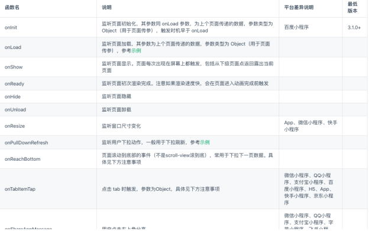

#### 8.1.2、Composition API

 uni-app 常用的页面生命周期函数：

- onLoad -> onLoad
- onShow -> onShow
- onReady -> onReady
- onHide -> onHide
- onUnload -> onUnload
- onResize -> onResize
- onPullDownRefresh -> onPullDownRefresh
- onReachBottom -> onReachBottom
- 更多： https://uniapp.dcloud.net.cn/tutorial/page.html#lifecycle

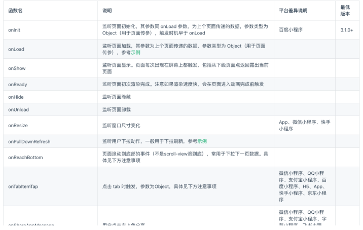

```vue
<script setup>
	import {
		ref,
		onBeforeMount,
		onMounted
	} from 'vue'
	import {
		onLoad,
		onShow,
		onReady,
		onHide,
		onUnload,
		onPullDownRefresh,
		onReachBottom
	} from '@dcloudio/uni-app'

	// 1.页面的生命周期
	onLoad(() => {
		console.log('detail05 onLoad');
	})

	onShow(() => {
		console.log('detail05 onShow');
	})

	onReady(() => {
		console.log('detail05 onReady');
	})

	onHide(() => {
		console.log('detail05 onHide');
	})

	onUnload(() => {
		console.log('detail05 onUnload');
	})

	onPullDownRefresh(() => {
		console.log('detail05 onPullDownRefresh');
		setTimeout(() => {
			uni.stopPullDownRefresh()
		}, 1000)
	})

	onReachBottom(() => {
		console.log('detail05 onReachBottom');
	})

	// 2.Vue组件的生命周期
	onBeforeMount(() => {
		console.log('detail05 onBeforeMount');
	})
	onMounted(() => {
		console.log('detail05 onMounted');
	})
</script>
```

### 8.2、网络请求

uni.request(OBJECT) 发起网络请求。

- 登录各个小程序管理后台，给网络相关的 API 配置合法域名（域名白名单）
- 微信小程序开发工具，在开发阶段可以配置：不校验合法域名
- 运行到手机时，资源没有出来时可以打开手机的调试模式
- 请求的 header 中 content-type 默认为 application/json

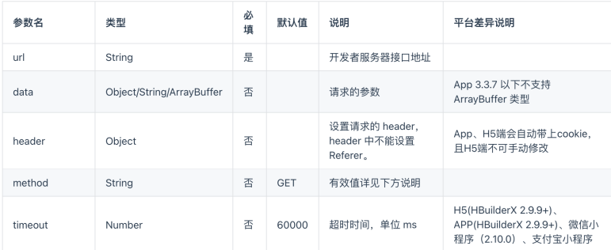

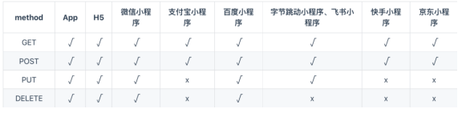

### 8.3、数据缓存

- uni.setStorage(OBJECT)
  - 将数据存储在本地缓存中指定的 key 中，会覆盖掉原来该 key 对应的内容，这是一个异步接口。
- uni.setStorageSync(KEY, DATA)
  - 将 data 存储在本地缓存中指定的 key 中，会覆盖掉原来该 key 对应的内容，这是一个同步接口。
- uni.getStorage(OBJECT)
  - 从本地缓存中异步获取指定 key 对应的内容。
- uni.getStorageSync(KEY)
  - 从本地缓存中同步获取指定 key 对应的内容。
- uni.removeStorage(OBJECT)
  - 从本地缓存中异步移除指定 key。
- uni.removeStorageSync(KEY)
  - 从本地缓存中同步移除指定 key。

[文档链接](https://uniapp.dcloud.net.cn/api/storage/storage.html#setstorage)

## 9、自定义组件

### 9.1、组件（Component）

uni-app 组件 Vue标准组件基本相同，但是也有一点区别，比如：

- 传统vue组件，需要创建组件、引用、注册，三个步骤后才能使用组件， easycom组件模式可以将其精简为一步。
- easycom组件规范：
  - 组件需符合components/组件名称/组件名称.vue 的目录结构。
  - 符合以上目录结构的就可不用引用、注册，直接在页面中使用该组件了。

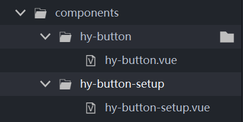

### 9.2、组件生命周期

 uni-app 组件支持的生命周期，与Vue组件的生命周期相同。

- 组件中可以使用页面的生命周期吗？
  - 在Options API 语法：组件中不支持使用页面生命周期。
  - 在Composition API语法：组件中支持页面生命周期，不同端支持情况有差异。

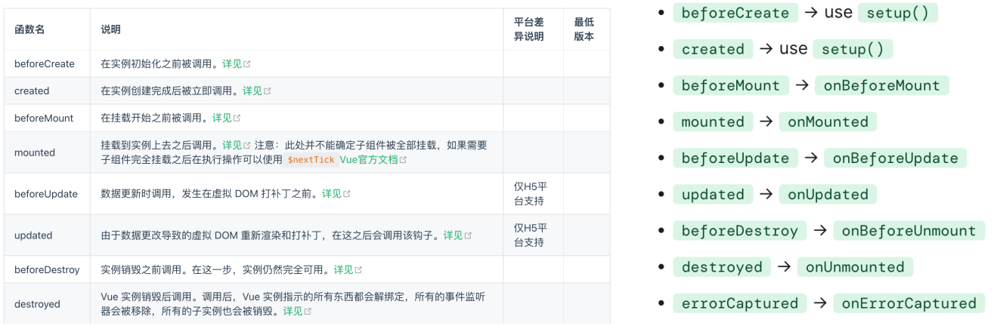

### 9.3、Options API

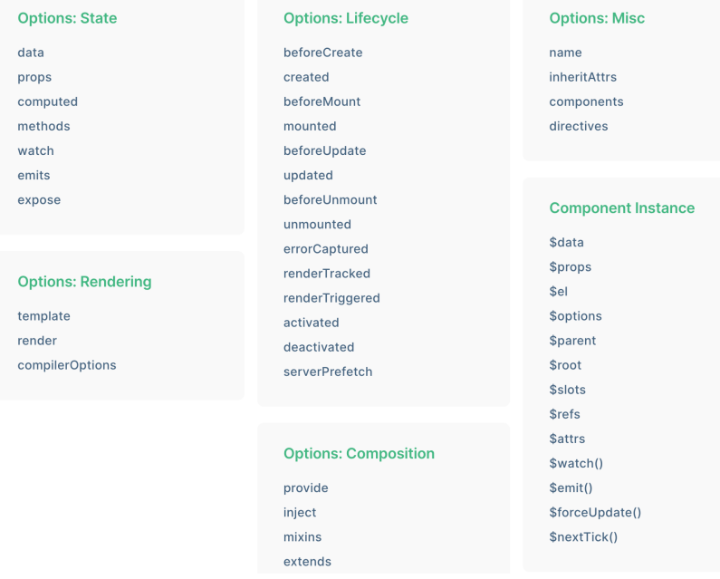

```vue
<template>
	<view :class="['hy-btn', type]" @click="handleBtnClick">
		<slot></slot>
	</view>
</template>

<script>
	export default {
		name:"hy-button",
		props: {
			type: {
				type: String,
				default: 'default' // default  primary
			}
		},
		emits:['onBtnClick'],
		data() {
			return {
				
			};
		},
		computed: {},
		watch: {},
		// 1.组件的生命周期函数
		beforeCreate() {
			console.log('hy-btn beforeCreate');
		},
		created() {
			console.log('hy-btn created');
			console.log(this);
		},
		mounted() {
			console.log('hy-btn mounted');
		},
		// 2.页面的生命周期(在options api 中是不会执行)
		onLoad() {
			console.log('hy-btn onLoad');
		},
		onShow() {
			console.log('hy-btn onShow');
		},
		methods: {
			handleBtnClick() {
				this.$emit('onBtnClick')
			}
		}
	}
</script>
```

### 9.4、Composition API

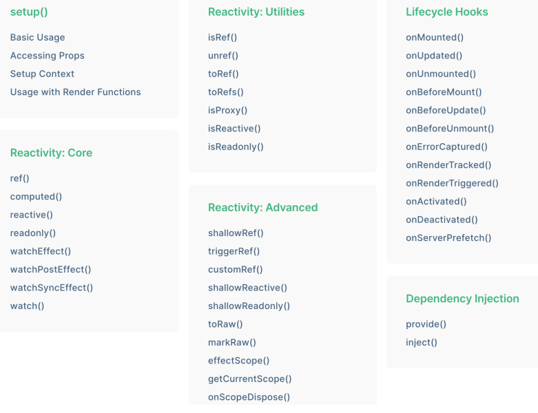

```vue
<template>
	<view :class="['hy-btn', type]" @click="handleBtnClick">
		<slot></slot>
	</view>
</template>

<script setup>
	// 是组件的生命周期
	import { onBeforeMount, onMounted, ref, watch, computed } from 'vue'
	// 页面的生命周期
	import {
		onLoad,
		onShow,
		onReady
	} from '@dcloudio/uni-app'
	
	const props = defineProps({
		type: {
			type: String,
			default: 'default'
		}
	})
	
	const emit = defineEmits(['onBtnClick'])
	
	function handleBtnClick() {
		emit('onBtnClick')
	}
	// 1.是组件的生命周期
	onBeforeMount(() => {
		console.log('hy-buton-setup onBeforeMount');
	})
	
	onMounted(() => {
		console.log('hy-buton-setup onMounted');
	})
	
	// 2.页面的生命周期
	// 执行
	onLoad(() => {
		console.log('hy-buton-setup onLoad');
	})
	// 执行
	onShow(() => {
		console.log('hy-buton-setup onShow');
	})
	// 这个在App H5没有执行, weapp有执行
	onReady(() => {
		console.log('hy-buton-setup onReady');
	})
	
</script>
```

## 10、状态管理Pinia

认识Pinia

- Pinia（发音为 /piːnjʌ/，如英语中的 peenya） 是 Vue 的存储库，它允许跨组件、页面共享状态。
- uni-app 内置了 Pinia，使用 HBuilder X 不需要手动安装，直接使用即可。
- 使用 CLI 需要手动安装，执行 yarn add pinia 或 npm install pinia。

Pinia的初体验，步骤如下：

- 第一步：在 main.js 中安装 Pinia插件
  - app.use(Pinia.createPinia());
- 第二步：接着创建一个store
- 第三步：然后在组件中就可以直接使用了

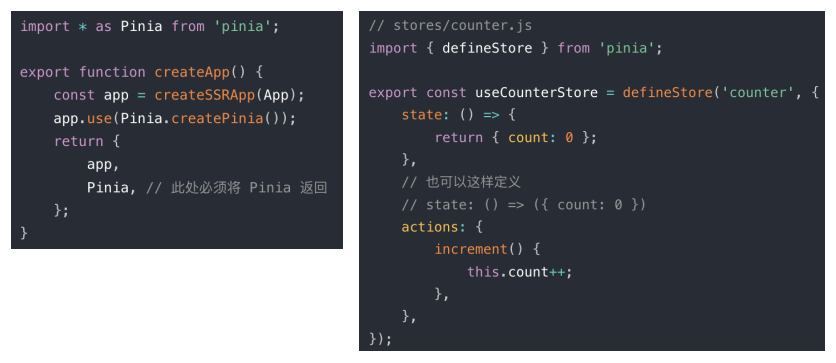

## 11、项目目录结构

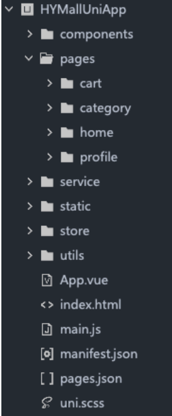

## 12、微信小程序-打包配置

1. 注册一个小程序账号：https://mp.weixin.qq.com/wxopen/waregister?action=step1
2.  登录已注册好的账号，拿到小程序 APPID： wxbc30134b589795b0（需要用你自己申请的）
3. 修改一下manifest.json的配置（比如：appid、es6-es5、压缩）
4. 发行->打包微信小程序
5. 在微信开发者工具中点击 上传 代码

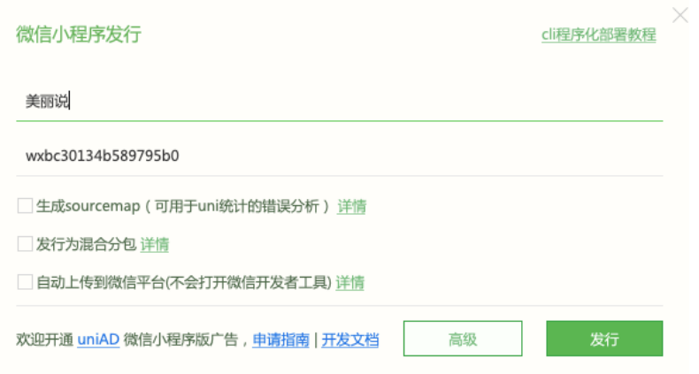

### 13、H5-打包配置

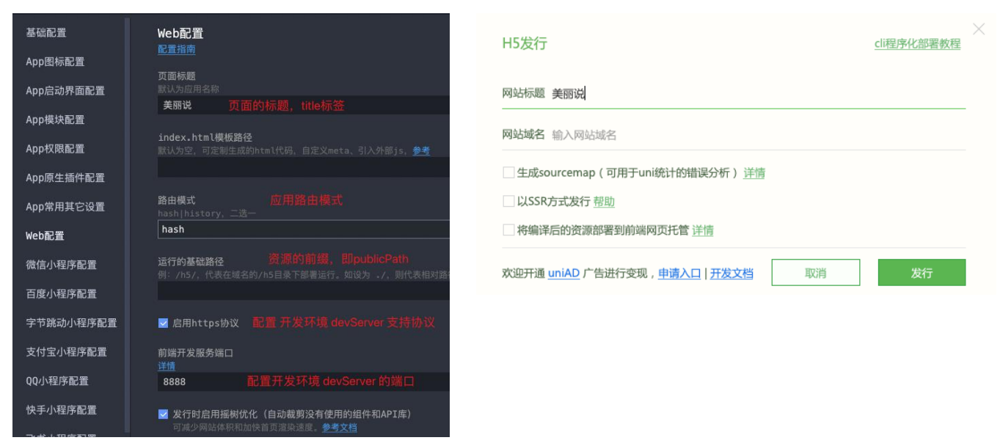

1. 购买阿里云服务器

2. 连接阿里云服务器（VSCode 安装 Remove SSH 插件）

3. 安装Nginx服务器

   `sudo yum  install nginx` # 安装 nginx

   `sudo systemctl enable nginx` # 设置开机启动

4. 启动Nginx服务器(   http://8.134.149.197  )

   `sudo service nginx start` # 启动 nginx 服务

   `sudo service nginx restart` # 重启 nginx 服务

5. 修改Nginx的配置( /etc/nginx/nginx.conf )

   切换为 root 用户，修改部署路径

6. 打包和部署项目

## 14、Android

### 14.1、云打包配置

1. 注册一个Dcloud账号：https://dev.dcloud.net.cn/ 或在 HBuilder X 中注册
2. HBuilder X 登录已注册好的账号，然后在manifest.json中配置应用基本信息
3. 云打包Android时，会自动生成证书（也可以手动生成）
4. 开始执行云打包

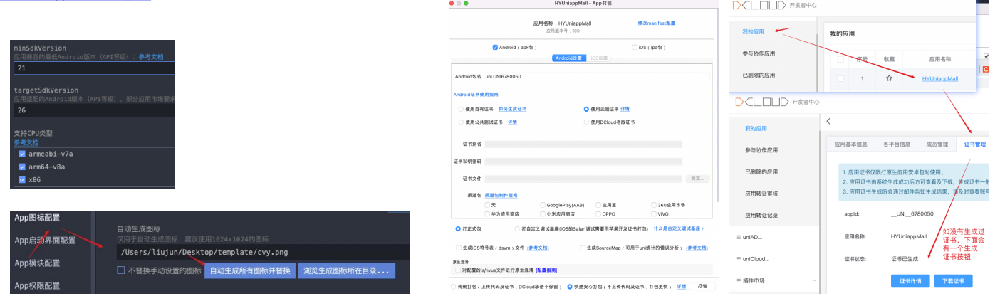

### 14.2、离线本地打包

- 生成本地打包App资源
  - 先完成社区身份验证，请点击链接 https://ask.dcloud.net.cn/account/setting/profile 
  - 验证后再重新打包：原生App-本地打包->生成本地打包App资源

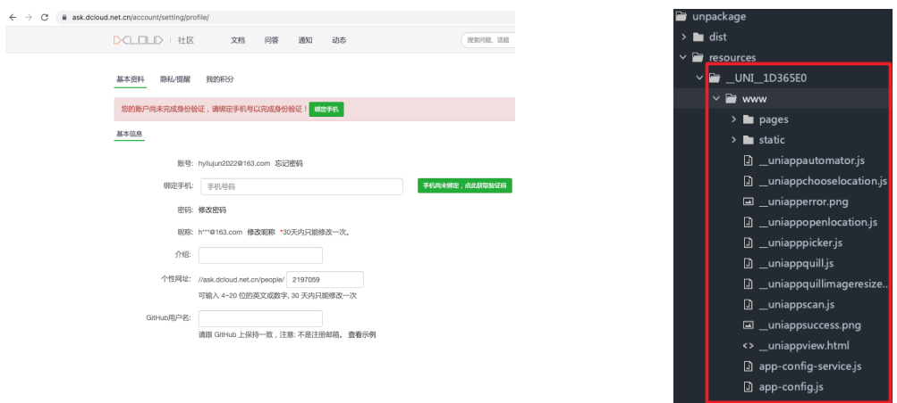

- 生成证书( jks文件)
  - 文件密码
  - 证书别名：hymall01
  - 证书密码
- 通过证书获取sha1 （https://ask.dcloud.net.cn/article/35777）
  - keytool -list -v -keystore 生成的证书文件
    - D2:15:91:B8:24:97:D1:BC:B9:8B:CF:07:44:DA:C7:90:C4:44:C8:E5

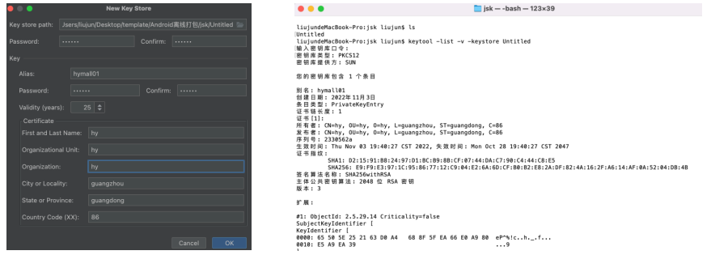

离线打包apk常见配置（项目路径不支持中文）：

- 配置Appkey: Appkey
- 配置应用版本号: versionCode
- 应用的版本名称: versionName
- 应用的包名，一般设置为反向域名： applicationId
- SDK最低支持版本21： minSdkVersion
- 配置应用名称app_name ，建议与manifest.json中name同为一个
- 图标名称：
  - icon.png为应用的图标。
  - splash.png为应用启动页的图标。
  - push.png为推送消息的图标。
- 资源配置，包括：导出的app资源和data资源
- dcloud_control.xml中的appid为拷贝过来的uni-app的id


