## 1、邂逅 Taro 框架

### 1.1、认识 Taro 框架

什么是Taro？

- Taro 是由京东 凹凸实验室 打造的一个开放式跨端、跨框架解决方案，并于2018 年 6 月 7 日正式开源。
- Taro支持使用 React/Vue/Preact等框架来开发 微信 / 京东 / 百度 / 支付宝 / 字节跳动 / QQ等小程序 / H5 / RN 等应用。

Taro的版本史

- Taro 1.x / 2.x 版的文档，现已不再积极维护。
- 2021年3月，Taro 3.1版本正式发布，主要改动是打造开放式架构，支持以插件的形式编译到任意小程序平台。
- 2021年4月，Taro 3.2 版本正式发布，新增了对 ReactNative 的支持，主要是由 58 同城团队主导。
- 2021年4月，Taro 3.3 alpha发布，主要改动是支持使用 HTML 标签进行开发。
- 2022年1月，Taro 3.4版本正式发布，主要改动是支持使用 Preact 和 Vue3.2 进行开发。
- 目前 Taro 团队的迭代重心在于 Taro 3，Taro 1/2 只会对重大问题进行修复，不会新增新特性。

Taro的特点

- 多端支持
  - Taro 3 可以支持转换到 H5、ReactNative 以及任意小程序平台（重心是小程序端）。
  - 目前官方支持转换的平台如下：
    - H5、ReactNative、微信小程序、京东小程序、百度小程序、支付宝小程序、字节跳动小程序
    - QQ 小程序、钉钉小程序、企业微信小程序、支付宝小程序等
- 多框架支持
  - 在 Taro 3 中可以使用完整的 React / Vue / Nervjs / Preact 开发体验

### 1.2、Taro vs uni-app

跨端支持度

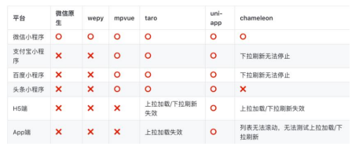

资料完善度

- Taro： 官方文档较完整，但不是很丰富，资料一般。
- uni-app：官方文档和各种专题内容很丰富，资料齐全。

Taro和uni-app如何选择？

- 如需要跨平台，并且应用不是很复杂，可选 Taro 和 uni-app。
- 如熟悉Vue可优先选择uni-app； 如熟悉React推荐使用 Taro。
- uni-app在资料、生态、工具、开发效率、跨端数会比Taro略胜一筹。
- 当然Taro也有独特的优势，如：用React开发非常的灵活。

社区活跃度

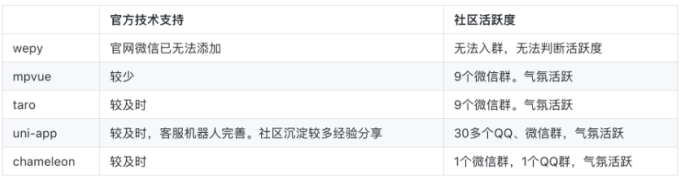

工具和周边生态

- Taro：官方的Taro UI，只支持小程序和H5( 不支持RN )，截至到2019年10月28日， Taro只有64个插件。
- uni-app：官方的uni-ui支持多端、周边模板丰富、完善的插件市场，截至到2019年10月28日，有850个插件。

### 1.3、Taro架构图设计图

- Taro 当前的架构主要分为：编译时 和 运行时。
- 其中编译时主要是将 Taro 代码通过 Babel[11] 转换成 小程序的代码，如：JS、WXML、WXSS、JSON。
- 运行时主要是进行一些：生命周期、事件、data 等部分的处理和对接，以保证和宿主平台数据的一致性。

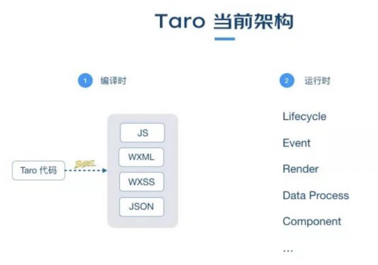

## 2、Taro的初体验

### 2.1、编辑器选择

- 推荐使用 VSCode或 WebStorm。
- 当你使用 VSCode 时，推荐安装 ESLint 插件，如果你使用 TypeScript，别忘了配置 eslint.probe 参数。
- 如果使用 Vue，推荐安装 Vetur或 Volar插件。
- 如果你愿意花钱又懒得折腾可以选择 WebStorm，基本不需要配置。
- 不管使用 VSCode 还是 WebStrom，安装了上述插件之后使用 Taro 都实现自动补全和代码实时检查（linting）的功能。

### 2.2、安装及使用

- Taro 项目基于 node，请确保已具备较新的 node 环境（>=12.0.0）

- Taro CLI 工具安装

  - 首先，你需要使用 npm 或者 yarn 全局安装 @tarojs/cli，或者直接使用 npx（如下图所示）:

  - `npm i –g @tarojs/cli`

    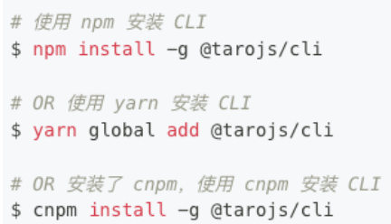

- 查看 Taro CLI 工具版本

  - npm info @tarojs/cli

### 2.3、项目初始化

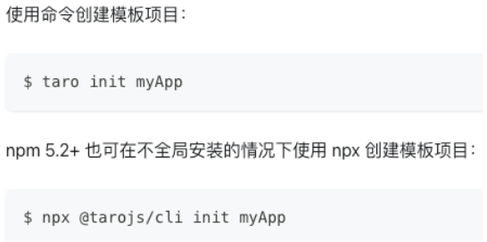

注意事项：

- 开发支付宝小程序时，Webpack4 暂不支持使用 React18。
- 受小程序环境限制，诸如新 SSR Suspense 等特性将不能在小程序中使用。
- RN 暂不支持 React v18，需要等待 RN 官方输出支持方案。
- 为了顺利地用Taro来开发App，我们强烈地建议您，先对 React Native 开发进行学习。

### 2.4、编译运行

- Taro 编译分为 dev 和 build 模式：
  - dev 模式（增加 --watch 参数） 将会监听文件修改。
  - build 模式（去掉 --watch 参数） 将不会监听文件修改，并会对代码进行压缩打包。
- dev 命令 启动 Taro 项目的开发环境
  - `pnpm run dev:h5` 启动H5端
  - `pnpm run dev:weapp` 启动小程序端
- build 命令可以把 Taro 代码编译成不同端的代码，然后在对应的开发工具中查看效果，比如：
  - H5直接在浏览器中可以查看效果
  - 微信小程序需在《微信开发者工具》打开根目录下的dist查看效果
  - RN应用需参考《React Native端开发流程》
  - 等等

### 2.5、目录结构

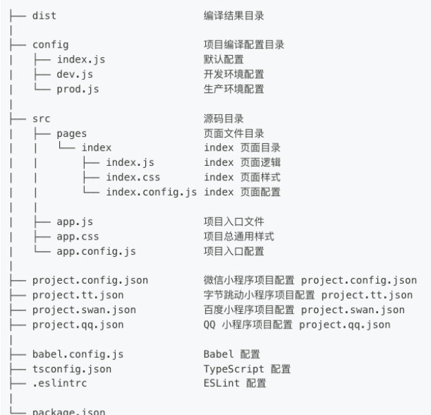

### 2.6、Taro+React开发规范

为了实现多端兼容，综合考虑编译速度、运行性能等因素，Taro可以约定了如下开发规范：

- 页面文件遵循 React组件(JSX) 规范。
- 组件标签靠近小程序规范（但遵从大驼峰，并需导包），详见Taro组件规范
- 接口能力（JS API）靠近微信小程序规范，但需将前缀 wx 替换为 Taro(需导包)，详见Taro接口规范
- 数据绑定及事件处理同 React 规范，同时补充了App及页面的生命周期
- 为兼容多端运行，建议使用flex布局进行开发，推荐使用 px 单位（750设计稿）。
- 在 React 中使用Taro内置组件前，必须从 @tarojs/components 进行引入。
- 文档直接查看Taro的官网文档： https://docs.taro.zone/docs

## 3、Taro配置文件

### 3.1、webpack编译配置(config)

编译配置存放于项目根目录下的 config 目录中，包含三个文件：

- index.js 是通用配置
- dev.js 是项目开发时的配置
- prod.js 是项目生产时的配置

常用的配置

- projectName ： 项目名称
- date ： 项目创建时间
- designWidth: 设计稿尺寸
- sourceRoot : 项目源码目录
- outputRoot： 项目产出目录
- defineConstants: 定义全局的变量（DefinePlugin）
- alias: 配置路径别名
- h5.webpackChain： webpack配置
- h5.devServer ：开发者服务配置
- 更多的配置：https://docs.taro.zone/docs/config

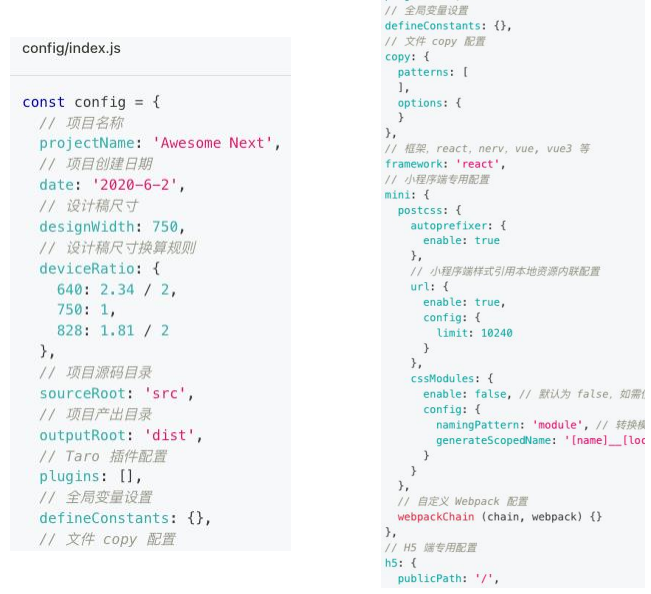

### 3.2、全局配置（app.config.js ）

app.config.js 用来对小程序进行全局配置，配置项遵循微信小程序规范，类似微信小程序的app.json，并对所有平台进行统一

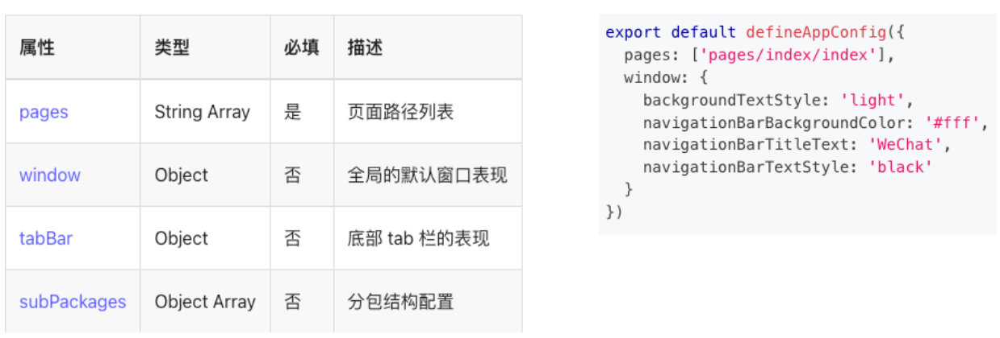

更多的配置：https://docs.taro.zone/docs/next/app-config

### 3.3、页面配置（.config.js）

每一个小程序页面都可以使用 .config.js 文件来对本页面的窗口表现进行配置。

页面中配置项在当前页面会覆盖全局配置 app.config.json 的 window 中相同的配置项。

文件需要 export 一个默认对象，配置项遵循微信小程序规范，并且对所有平台进行统一。

更多页面配置：https://docs.taro.zone/docs/next/page-config

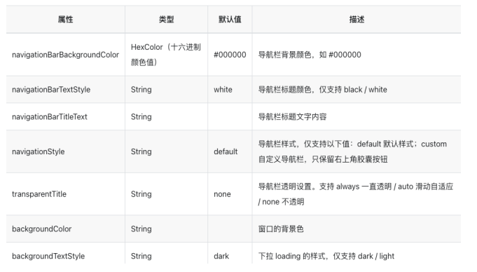

### 3.4、项目配置（project.x.json）

为了适配不同的小程序， Taro支持各个小程序平台添加各自项目配置文件。

- 默认 project.config.json 配置只能用于微信小程序。

project.config.json 常用配置

- libVersion 小程序基础库版本
- projectname 小程序项目名字
- appid 小程序项目的appid
- setting 小程序项目编译配置

各类小程序平台均有自己的项目配置文件，例如：

- 微信小程序，project.config.json
- 百度小程序，project.swan.json
- 字节跳动小程序，project.tt.json
- 支付宝小程序，project.alipay.json
- 等等

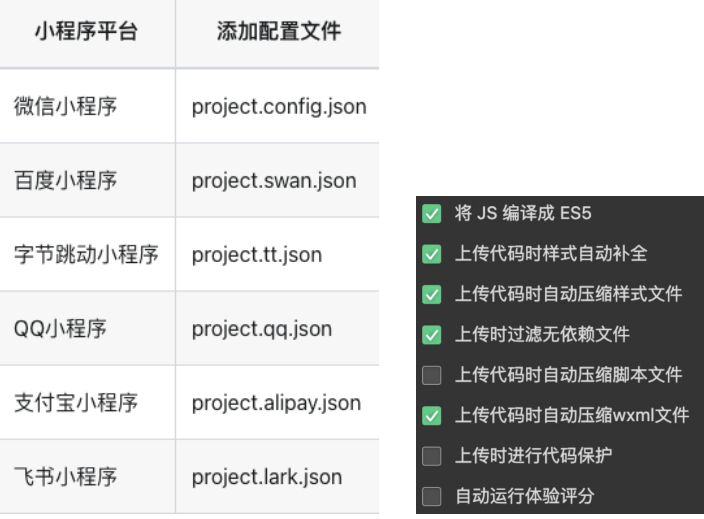

### 3.5、入口组件（app.js）

每一个 Taro 应用都需要一个入口组件（如React 组件）用来注册应用。入口文件默认是 src 目录下的 app.js。

在入口app.js组件中我们可以：

- 定义应用的生命周期
  - onLaunch -> useEffect：在小程序环境中对应 app 的 onLaunch。
  - componentDidShow -> useDidShow：在小程序环境中对应 app 的 onShow 。
  - componentDidHide -> useDidHide：在小程序环境中对应 app 的 onHide 。
- 定义全局数据
  - taroGlobalData
- 定义应用的全局状态：Redux ( Vuex、Pinia)

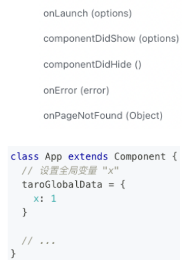

## 4、内置组件和样式

### 4.1、常用内置组件

-  View：视图容器。用于包裹各种元素内容（Taro3.3以后支持使用 HTML 标签 进行开发）。
- Text：文本组件。用于包裹文本内容。
- Button: 按钮组件，多端主题色一样。
- Image：图片。H5默认为图片宽高，weapp为默认组件宽高，支持 JPG、PNG、SVG、WEBP、GIF 等格式以及云文件ID。
  - 支持import导入 和 URL网络图片
- ScrollView：可滚动视图区域，用于区域滚动。
  - 使用竖向滚动时，需要给 <scroll-view> 一个固定高度，通过 css 设置 height
  - 使用横向滚动时，需要给<scroll-view>添加white-space: nowrap;样式，子元素设置为行内块级元素。
  - 小程序中，请勿在 scroll-view 中使用 map、video 等原生组件，也不要使用 canvas、textarea 原生组件。
- Swiper：滑块视图容器，一般作为banner轮播图，默认宽100%，高150px。

### 4.2、设计稿及尺寸单位(px)

- Taro 默认以 750px 作为换算尺寸标准，如设计稿不是 750px 为标准需修改designWidth
  - 比如：设计稿是 640px，则需修改 config/index.js 中 designWidth 为 640
- 在Taro中单位建议使用 px、 百分比 %，Taro 默认会对所有单位进行转换。
  - 在 Taro中写尺寸按照 1:1 关系来写，即设计稿量长度 100px，那么尺寸就写 100px，当转成微信小程序时尺寸为 100rpx，当转成 H5 时尺寸以 rem 为单位。
  - 如你希望部分 px 单位不被转换成 rpx 或 rem ，最简单做法就是在 px 单位中增加一个大写字母。
- JS 中行内样式的转换
  - 在编译时，Taro 会帮你对样式做尺寸转换操作
  - 但是如果是在 JS 中书写了行内样式，那么编译时就无法做替换了
  - 针对这种情况，Taro 提供了 API Taro.pxTransform 来做运行时的尺寸转换。

### 4.3、CSS 编译时忽略

忽略单个属性

- 当前忽略单个属性的最简单的方法，就是 px 单位使用大写字母。

忽略样式文件

- 对于头部包含注释 / *postcss-pxtransform disable*/ 的文件，插件不予转换处理。

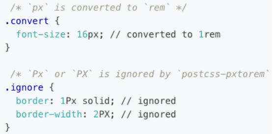

### 4.4、全局和局部样式

全局样式

- Taro页面和普通组件导入的样式默认都是全局样式
- 那在Taro中应该如何编写局部的样式呢？使用CSS Modules功能

局部样式

1. 在config/index.js配置文件中启用 CSS Modules 的功能

2. 编写的样式文件需要加上 .module 关键字。

   比如： index.module.scss 文件

3. 然后在组件中导入该样式文件，即可以按照模块的方式使用了。

CSS Modules 中也支持编写全局样式

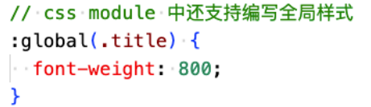

### 4.5、背景图片

Taro 支持使用在 css 里设置背景图片，使用方式与普通 web 项目大体相同，但需要注意以下几点：

- 支持 base64 格式图片，支持网络路径图片。

使用本地背景图片需注意：

- 小程序不支持在 css 中使用本地文件，包括本地的背景图和字体文件。需以 base64 方式方可使用。
- 为了方便开发，Taro 提供了直接在样式文件中引用本地资源的方式，其原理是通过 PostCSS 的
  postcss-url 插件将样式中本地资源引用转换成 Base64 格式，从而能正常加载。
- 不建议使用太大的背景图，大图需挪到服务器上，从网络地址引用。
- 本地背景图片的引用支持：相对路径和绝对路径 。

### 4.6、字体图标

 Taro 支持使用字体图标，使用方式与普通 web 项目相同：

- 第一步：先生成字体图标文件
- 第二步：app.scss 引入字体图标
- 第三步：组件中使用自定义字体

## 5、Taro页面和传参

### 5.1、新建Page页面

快速创建新页面

1. 命令行创建：Taro create --name [页面名称]

   能够在当前项目的pages目录下快速生成新的页面文件，并填充基础代码，是一个提高开发效率的利器。

2. 手动创建页面

   在目录根目录下的pages目录下新建即可。

注意事项：新建的页面，都需在 app.config.json 中的 pages 列表上配置。

删除页面，需做两件工作

- 删除页面对应的文件
- 删除app.config.json中对应的配置

### 5.2、配置Tabbar

- 在app.config.js中配置Tabbar
- icon路劲支持绝对路径和相对路径

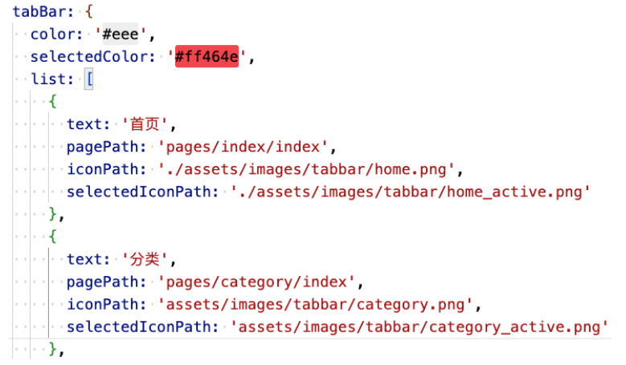

### 5.3、页面路由

 Taro 有两种页面路由跳转方式：使用Navigator组件跳转、调用API跳转。

- 组件：Navigator
- 常用API：navigate 、redirectTo、switchTab、navigateBack

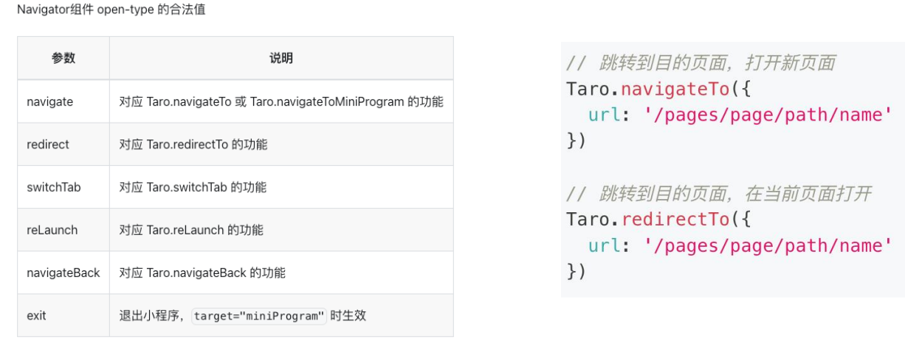

### 5.4、页面通讯

在Taro中，常见页面通讯方式：

- 方式一： url查询字符串 和 只支持小程序端的EventChannel
- 方式二：全局事件总线： Taro.eventCenter
- 方式三：全局数据：taroGloabalData
- 方式四：本地数据存储: Taro.setStorageSync(key, data) 等
- 方式五：Redux状态管理库

方式一：url查询字符串

- 传递参数：?name=liujun&id=100
- 获取参数：
  - onLoad 、 useLoad 生命周期获取路由参数
  - Taro.getCurrentInstance().router.params 获取路由参数。

### 5.5、全局事件总线

为了支持跨组件、跨页面之间的通信，Taro 提供了全局事件总线：Taro.eventCenter

- Taro.eventCenter.on( eventName, function ) 监听一个事件
- Taro.eventCenter.trigger( eventName, data) 触发一个事件
- Taro.eventCenter.off( eventName, function ) 取消监听事件

注意事项：

- 需先监听，再触发事件，比如：你在A界面触发，然后跳转到B页面后才监听是不行的。
- 通常on 和 off 是同时使用，可以避免多次重复监听
- 适合页面返回传递参数、适合跨组件通讯，不适合界面跳转传递参数

### 5.6、页面生命周期

Taro 页面组件除了支持 React 组件生命周期 方法外，还根据小程序的标准，额外支持以下页面生命周期：

- onLoad (options) 在小程序环境中对应页面的 onLoad。
  - 通过访问 options 参数或调用 getCurrentInstance().router，可以访问到页面路由参数
- componentDidShow() 在小程序环境中对应页面的 onShow。
- onReady () 在小程序环境中对应页面的 onReady。
  - 可以使用 createCanvasContext 或 createSelectorQuery 等 API 访问小程序渲染层 DOM 节点
- componentDidHide () 在小程序环境中对应页面的 onHide。
- onUnload () 在小程序环境中对应页面的 onUnload。
  - 一般情况下建议使用 React 的 componentWillUnmount 生命周期处理页面卸载时的逻辑。
- onPullDownRefresh() 监听用户下拉动作。
- onReachBottom() 监听用户上拉触底事件。
- 更多生命周期函数： https://docs.taro.zone/docs/react-page

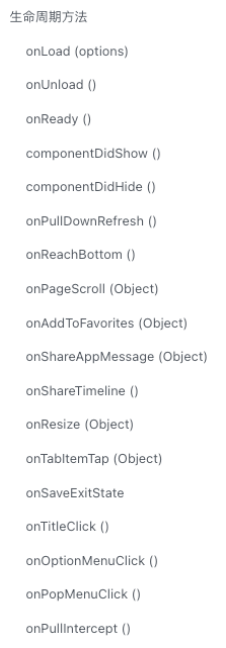

### 5.7、Hooks 生命周期

- Taro使用Hooks很简单。Taro专有Hooks，例如 usePageScroll, useReachBottom，需从 @tarojs/taro 中引入
- React框架自己的 Hooks ，例如 useEffect, useState，从对应的框架引入。
- 更多的Hooks可查看官网： https://docs.taro.zone/docs/hooks

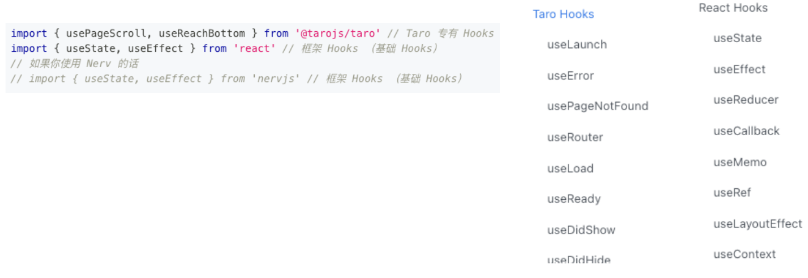

## 6、Taro常用的API

### 6.1、网络请求

 Taro.request(OBJECT) 发起网络请求。

- 在各个小程序平台运行时，网络相关的 API 在使用前需要配置合法域名（域名白名单）。
- 微信小程序开发工具在开发阶段可以配置：不校验合法域名。
- header中的content-type属性的默认值为：application/json

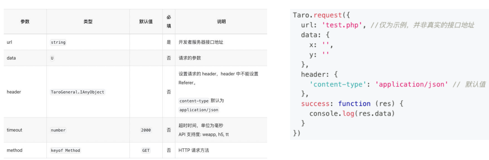

### 6.2、数据缓存

- Taro.setStorage(OBJECT)
  - 将数据存储在本地缓存中指定的 key 中，会覆盖掉原来该 key 对应的内容，这是一个异步接口。
- Taro.setStorageSync(KEY, DATA)
  - 将 data 存储在本地缓存中指定的 key 中，会覆盖掉原来该 key 对应的内容，这是一个同步接口。
- Taro.getStorage(OBJECT)
  - 从本地缓存中异步获取指定 key 对应的内容。
- Taro.getStorageSync(KEY)
  - 从本地缓存中同步获取指定 key 对应的内容。
- Taro.removeStorage(OBJECT)
  - 从本地缓存中异步移除指定 key。
- Taro.removeStorageSync(KEY)
  - 从本地缓存中同步移除指定 key。

## 7、自定义组件

### 组件及生命周期

在 Taro中，除了应用和页面组件有生命周期之外， Taro 的组件也是生命周期，如下图所示：

下面我们来编写一个HYButton组件。

- 创建组件
- 定义属性
- 样式编写
- 定义插槽
- 定义生命周期
- 组件可编写页面生命周期吗？
  - class组件默认不行，需要单独处理
  - 但是函数组件是支持的
- 页面可以编写组件生命周期吗？可以

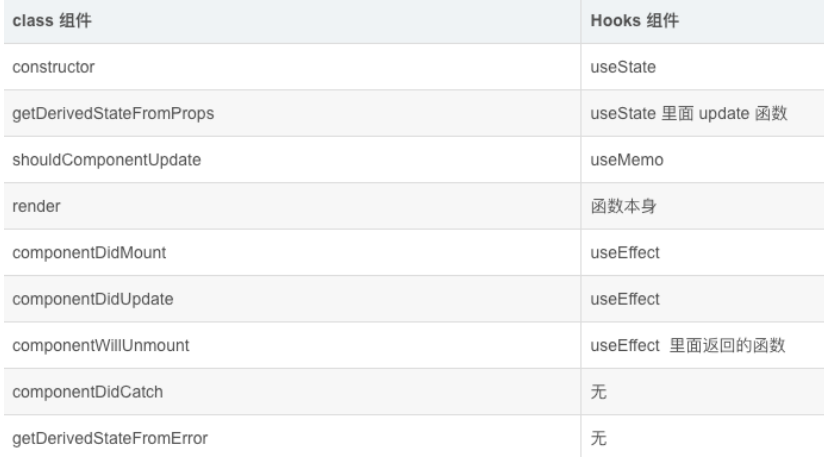

## 8、跨端兼容实现

### 8.1、跨端兼容方案

Taro 的设计初衷就是为了统一跨平台的开发方式，并且已经尽力通过运行时框架、组件、API 去抹平多端差异，但是由于不同的平台之间还是存在一些无法消除的差异，所以为了更好的实现跨平台开发，Taro 中提供了如下的解决方案。

- 方案一：内置环境变量
  - Taro 在编译时提供了一些内置的环境变量来帮助用户做一些特殊处理。
  - 通过这个变量来区分不同环境，从而使用不同的逻辑。在编译阶段，会移除不属于当前端的代码，只保留当前端的代码。
  - 内置环境变量虽然可以解决大部分跨端的问题，但是会让代码中存在很多逻辑判断的代码，影了响代码的可维护性，而且也让代码变得丑陋。
  - 为了解决这种问题，Taro 提供了另外一种跨端开发的方式作为补充。
- 方案二：统一接口的多端文件
  - 开发者可以通过将文件修改成 原文件名 + 端类型 的命名形式（端类型对应着 process.env.TARO_ENV 的取值），不同端的文件代码对外保持统一接口，而引用的时候仍然是 import 原文件名的文件。
  - Taro 在编译时，会跟根据当前编译平台类型，精准加载对应端类型的文件，从而达到不同的端加载其对应端的文件。

### 8.2、内置环境变量

内置环境变量（ process.env.TARO_ENV），该环境变量可直接使用

- process.env.TARO_ENV，用于判断当前的编译平台类型，有效值为：weapp / swan / alipay / tt / qq / jd / h5 / rn。
- 通过这个变量来区分不同环境，从而使用不同的逻辑。
- 在编译阶段，会移除不属于当前平台的代码，只保留当前平台的代码，例如：

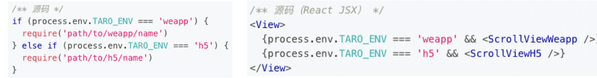

注意事项：不要解构 process.env 来获取环境变量，请直接以完整书写的方式（process.env.TARO_ENV）来进行使用

### 8.3、统一接口的多端文件

统一接口的多端文件这一跨平台兼容写法有如下三个使用要点：

- 不同端的对应文件一定要统一接口和调用方式。
- 引用文件的时候，只需写默认文件名，不用带文件后缀。
- 最好有一个平台无关的默认文件，这样在使用 TS 的时候也不会出现报错。

常见有以下使用场景：

- 多端组件（属性，方法，事件等需统一）
  - 针对不同的端写不同的组件代码
- 多端脚本逻辑（属性、方法等需统一）
  - 针对不同的端写不同的脚本逻辑代码

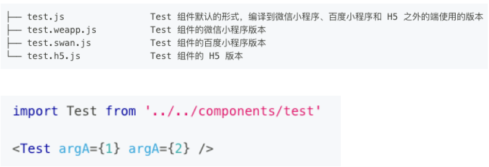

## 9、Redux状态管理

### 9.1、认识Redux Toolkit（RTK）

Redux Toolkit 是官方推荐的编写 Redux 逻辑的方法。

- 以前我们在使用redux的时候，通常会将redux代码拆分在多个文件中，比如：constants、action、reducer 等
- 这种代码组织方式过于繁琐和麻烦，导致代码量过多，也不利于后期管理
- Redux Toolkit 就是为了解决这种编码方式而诞生。
- 并且以前的 createStore 方式已标为过时，而 Redux Toolkit 已成为官方推荐；

安装Redux Toolkit：`npm install @reduxjs/toolkit react-redux`

Redux Toolkit的核心API主要是如下几个：

- configureStore：包装createStore以提供简化的配置选项和良好的默认值。
  - 可自动组合 slice reducer
  - 可添加其它 Redux 中间件，redux-thunk默认包含，
  - 默认启用 Redux DevTools Extension
- createSlice：接受切片名称、初始状态值和reducer函数的对象，并自动生成切片reducer，并带有相应的actions。
- createAsyncThunk: 接受一个动作类型字符串和一个返回承诺的函数，并生成一个pending/fulfilled/rejected基于该承诺分派动作类型的thunk。简单理解就是专门用来创建异步Action。

### 9.2、创建counter模块的reducer

我们先创建counter模块的reducer： 通过createSlice创建一个slice。

createSlice主要包含如下几个参数：

- name：用来标记slice的名词
  - redux-devtool中会显示对应的名词；
- initialState：第一次初始化时的值；
- reducers：相当于之前的reducer函数
  - 对象类型，并且可以添加很多的函数；
    - 函数类似于redux原来reducer中的一个case语句；
    - 函数的参数：
  - 参数一：state
  - 参数二：action
- createSlice 返回值是一个对象
  - 对象包含所有的 actions 和 reducer；

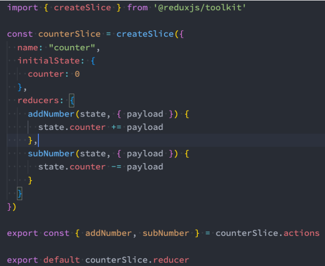

### 9.3、store的创建

configureStore用于创建store对象，常见参数如下：

- reducer，将slice中的reducer可以组成一个对象传入此处；
- middleware：可以使用参数，传入其他的中间件（自行了解）；
- devTools：是否配置devTools工具，默认为true；

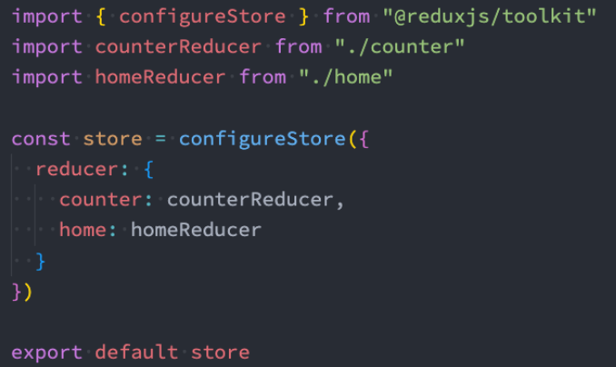

### 9.4、store接入应用

在app.js中将store接入应用：

- Provider，内容提供者，给所有的子或孙子组件提供store对象；
- store： 使用configureStore创建的store对象；

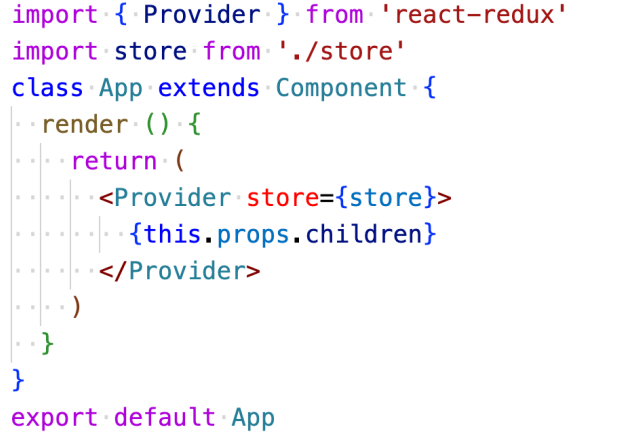

### 9.5、开始使用store

在函数式组件中可以使用 react-redux 提供的 Hooks API 连接、操作 store。

- useSelector 允许你使用 selector 函数从 store 中获取数据（root state）。
- useDispatch 返回 redux store 的 dispatch 引用。你可以使用它来 dispatch actions。
- useStore 返回一个 store 引用，和 Provider 组件引用完全一致。

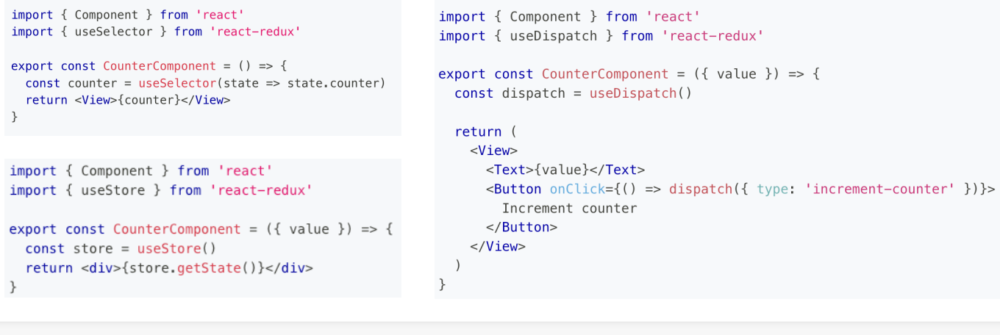

### 9.6、Redux Toolkit异步Action操作

- 在之前的开发中，我们通过redux-thunk中间件让dispatch中可以进行异步操作。

- Redux Toolkit默认已经给我们继承了Thunk相关的功能：createAsyncThunk

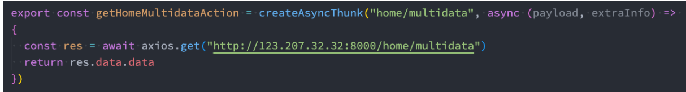

- 当createAsyncThunk创建出来的action被dispatch时，会存在三种状态：
  - pending：action被发出，但是还没有最终的结果；
  - fulfilled：获取到最终的结果（有返回值的结果）；
  - rejected：执行过程中有错误或者抛出了异常；
- 我们可以在createSlice的entraReducer中监听这些结果：见右图

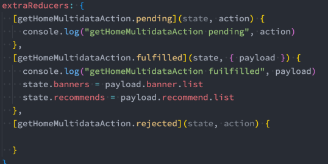

## 10、项目打包和部署

多端同步调试

- 可以在 dist 目录下创建一个与编译的目标平台名同名的目录，并将结果放在这个目录下。
- 例如：编译到微信小程序，最终结果是在 dist/weapp 目录下； H5打包结果放在 dist/h5 目录下
- 好处是，各个平台使用独立的目录互不影响，从而达到多端同步调试的目的，在 config/index.js 配置如下：

浏览器端

- 打包：npm run build:h5

微信小程序

- 打包：npm run build:weapp
- 打开weapp目录进行预览或发包

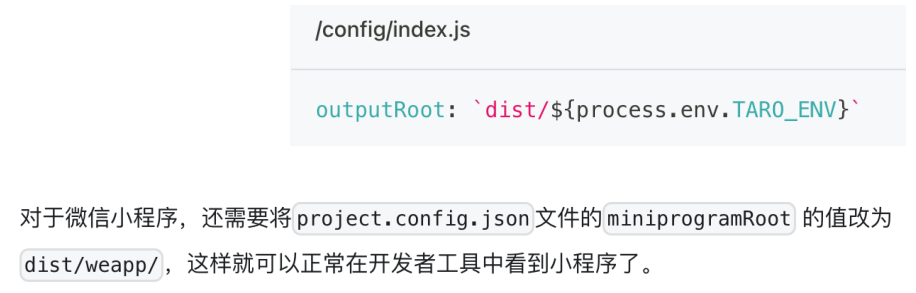

