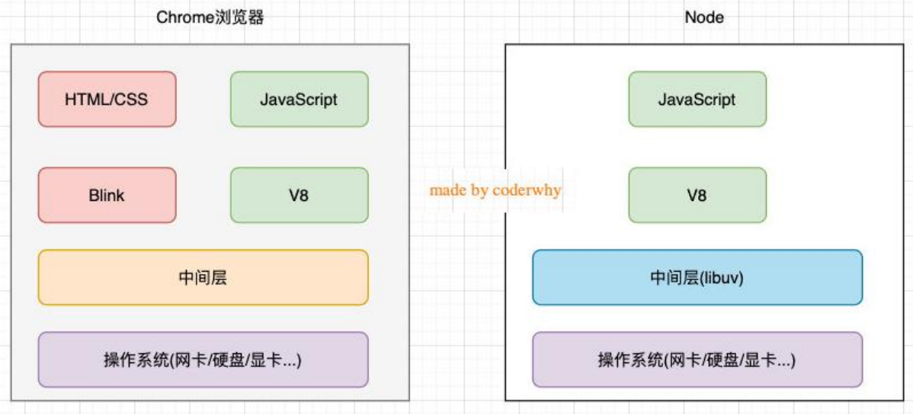
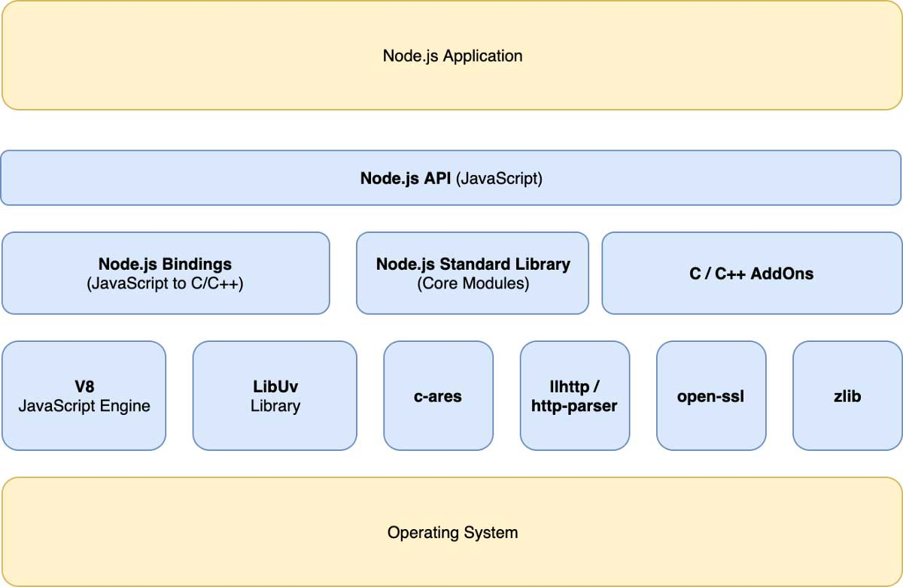
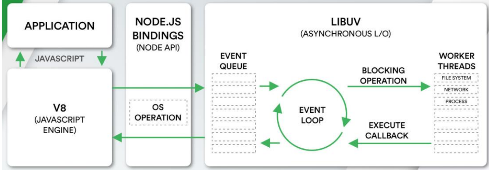

## 1.服务器开发


## 2.Node.js是什么

官方对Node.js的定义：

- Node.js是一个基于V8 JavaScript引擎的JavaScript运行时环境。


Node.js基于V8引擎来执行JavaScript的代码，但是不仅仅只有V8引擎：

- V8可以嵌入到任何C++应用程序中，无论是Chrome还是Node.js，事实上都是嵌入了V8引擎来执行JavaScript代码；
- 但是在Chrome浏览器中，还需要解析、渲染HTML、CSS等相关渲染引擎，还需要提供支持浏览器操作的API、浏览器自己的事件循环等；
- 另外，在Node.js中也需要进行一些额外的操作，比如文件系统读/写、网络IO、加密、压缩解压文件等操作；

## 3.Node.js架构

### 3.1.浏览器和Node.js架构区别



### 3.2.Node.js架构



Node.js 是运行在操作系统之上的，它底层由 V8 JavaScript 引擎，以及一些 C/C++ 写的库构成，包括 libUV 库、c-ares、llhttp/http-parser、open-ssl、zlib 等等。

其中，libUV 负责处理事件循环，c-ares、llhttp/http-parser、open-ssl、zlib 等库提供 DNS 解析、HTTP 协议、HTTPS 和文件压缩等功能。

在这些模块的上一层是中间层，中间层包括`Node.js Bindings`、`Node.js Standard Library`以及`C/C++ AddOns`。`Node.js Bindings`层的作用是将底层那些用 C/C++ 写的库接口暴露给 JS 环境，而`Node.js Standard Library`是 Node.js 本身的核心模块。至于`C/C++ AddOns`，它可以让用户自己的 C/C++ 模块通过桥接的方式提供给`Node.js`。

中间层之上就是 Node.js 的 API 层了，我们使用 Node.js 开发应用，主要是使用 Node.js 的 API 层，所以 Node.js 的应用最终就运行在 Node.js 的 API 层之上。



- JavaScript代码会经过V8引擎，再通过Node.js的Bindings，将任务放到Libuv的事件循环中；
- libuv（Unicorn Velociraptor—独角伶盗龙）是使用C语言编写的库；
- libuv提供了事件循环、文件系统读写、网络IO、线程池等等内容；

## 4.Node.js 内置的模块

Node.js 内置的模块比较丰富，常用的主要是以下几个。

- File System 模块：这是操作系统的目录和文件的模块，提供文件和目录的读、写、创建、删除、权限设置等等。
- Net 模块：提供网络套接字 socket，用来创建 TCP 连接，TCP 连接可以用来访问后台数据库和其他持久化服务。
- HTTP 模块：提供创建 HTTP 连接的能力，可以用来创建 Web 服务，也是 Node.js 在前端最常用的核心模块。
- URL 模块：用来处理客户端请求的 URL 信息的辅助模块，可以解析 URL 字符串。
- Path 模块：用来处理文件路径信息的辅助模块，可以解析文件路径的字符串。
- Process 模块：用来获取进程信息。
- Buffer 模块：用来处理二进制数据。
- Console 模块：控制台模块，同浏览器的Console模块，用来输出信息到控制台。
- Crypto 加密解密模块：用来处理需要用户授权的服务。
- Events 模块：用来监听和派发用户事件。

## 5.Node.js安装

在 Node.js 官网 [nodejs.org](https://link.juejin.cn/?target=https%3A%2F%2Fnodejs.org) 上下载适合我们操作系统的 Node.js。不论是 MacOS、Linux 系统还是 X86 或 64 位 windows 系统，都有对应的版本可以安装。


下载对应版本后，解压安装即可。安装完成后，打开命令行终端，执行命令 `node -v`，可以查看当前安装的 Node.js 的版本号。

```bash
$ node -v
v16.16.0
```

创建一个文件`ziyue.js`

```js
const template = (text) => `
                 __._                                   
                / ___)_                                 
               (_/Y ===\\                            __ 
               |||.==. =).                            | 
               |((| o |p|      |  ${text}
            _./| \\(  /=\\ )     |__                    
          /  |@\\ ||||||||.                             
         /    \\@\\ ||||||||\\                          
        /   \\  \\@\\ ||||||//\\                        
       (     Y  \\@\\|||| // _\\                        
       |    -\\   \\@\\ \\\\//    \\                    
       |     -\\__.-./ //\\.---.^__                        
       | \\    /  |@|__/\\_|@|  |  |                         
       \\__\\      |@||| |||@|     |                    
       <@@@|     |@||| |||@|    /                       
      / ---|     /@||| |||@|   /                                 
     |    /|    /@/ || |||@|  /|                        
     |   //|   /@/  ||_|||@| / |                        
     |  // \\ ||@|   /|=|||@| | |                       
     \\ //   \\||@|  / |/|||@| \\ |                     
     |//     ||@| /  ,/|||@|   |                        
     //      ||@|/  /|/||/@/   |                        
    //|   ,  ||//  /\\|/\\/@/  / /                      
   //\\   /   \\|/  /H\\|/H\\/  /_/                     
  // |\\_/     |__/|H\\|/H|\\_/                         
 |/  |\\        /  |H===H| |                            
     ||\\      /|  |H|||H| |                            
     ||______/ |  |H|||H| |                             
      \\_/ _/  _/  |L|||J| \\_                          
      _/  ___/   ___\\__/___ '-._                       
     /__________/===\\__/===\\---'                      
                                                        
`;

const argv = process.argv;
console.log(template(argv[2] || '有朋自远方来，不亦乐乎！'));
```

在控制台上，进入这个项目目录，运行 node 命令：`node ziyue.js`


这个代码和浏览器的 JS 没有什么区别，我们定义了一个输出模板字符串的函数`template`，它接受一个`text`参数，然后用它解析模板字符串，最终通过`console.log`得到输出结果。

注意，我们的 console.log 中给 text 一个默认值，但是实际上还有一个`process.argv[2]`的变量，这个是做什么用的呢？

实际上，process.argv 可以获得命令行调用的信息，以空格分隔。所以，按照我们执行`node ziyue.js`的命令，这时候`process.argv`的值是数组`['node', 'ziyue.js']`，所以`process.argv[2]`的值是 undefined，结果就输出了默认值。

现在我们换一种方式调用：`node ziyue.js 三人行必有我师焉`


## 6.Node.js 的模块管理

### 6.1.模块化

> 所谓模块化，就是指代码具有模块结构，**整个应用可以自顶向下划分为若干个模块，每个模块彼此独立，代码不会相互影响**。模块化的目的是使代码可以更好地复用，从而支持更大规模的应用开发。

Node.js 诞生之初，JavaScript 还没有标准的模块机制，因此 Node.js 一开始采用了[CommonJS 规范](https://link.juejin.cn/?target=http%3A%2F%2Fwww.commonjs.org%2F)。随后，JavaScript 标准的模块机制`ES Modules`诞生，浏览器开始逐步支持`ES Modules`。Node.js 从`v13.2.0`之后也引入了规范的`ES Modules`机制，同时兼容早期的`CommonJS`。

早在 Node.js 支持`ES Modules`之前，像`Babel`这样的编译工具和`Webpack`这类打包器，已经能够将规范的`ES Modules`模块机制编译成`Node.js`的`CommonJS`模块机制了。而现在，Node.js 自身对`ES Modules`的支持也越发成熟。

所以，现在我们写 Node.js 模块的时候，可以有 3 种方式：

1. 直接采用最新的`ES Modules`，在`Node.js v13.2.0`以后的版本中可行，但是使用上有些条件。
2. 采用`ES Modules`，通过 Babel 编译。
3. 仍然使用旧的`CommonJS`规范，预计未来 Node.js 在很长一段时间内依然会同时兼容`ES Modules`和`CommonJS`。

### 6.2.ES-Modules

**`ES Modules`的基本使用方法：**

- 导出对象：`export { 模块的公共API }`

- 从模块中引入导出的API：`import { API名字 } from 模块名`

```js
// ziyue.mjs
const ziyue = (text) => `
                 __._                                   
                / ___)_                                 
               (_/Y ===\\                            __ 
               |||.==. =).                            | 
               |((| o |p|      |  ${text}
            _./| \\(  /=\\ )     |__                    
          /  |@\\ ||||||||.                             
         /    \\@\\ ||||||||\\                          
        /   \\  \\@\\ ||||||//\\                        
       (     Y  \\@\\|||| // _\\                        
       |    -\\   \\@\\ \\\\//    \\                    
       |     -\\__.-./ //\\.---.^__                     
       | \\    /  |@|__/\\_|@|  |  |                    
       \\__\\      |@||| |||@|     |                    
       <@@@|     |@||| |||@|    /                       
      / ---|     /@||| |||@|   /                        
     |    /|    /@/ || |||@|  /|                        
     |   //|   /@/  ||_|||@| / |                        
     |  // \\ ||@|   /|=|||@| | |                       
     \\ //   \\||@|  / |/|||@| \\ |                     
     |//     ||@| /  ,/|||@|   |                        
     //      ||@|/  /|/||/@/   |                        
    //|   ,  ||//  /\\|/\\/@/  / /                      
   //\\   /   \\|/  /H\\|/H\\/  /_/                     
  // |\\_/     |__/|H\\|/H|\\_/                         
 |/  |\\        /  |H===H| |                            
     ||\\      /|  |H|||H| |                            
     ||______/ |  |H|||H| |                             
      \\_/ _/  _/  |L|||J| \\_                          
      _/  ___/   ___\\__/___ '-._                       
     /__________/===\\__/===\\---'                      
                                                        
`;

export { ziyue }; //将ziyue函数对象导出
```

```js
// index.mjs
import {ziyue} from './ziyue.mjs'; // 引入ziyue模块

const argv = process.argv;
console.log(ziyue(argv[2] || '有朋自远方来，不亦乐乎！'));
```

上面导出的对象`ziyue`是一个函数对象。实际上，我们不止可以导出函数，还可以导出模块中任何类型的数据。

```js
// foo.mjs
const a = 10;
const b = 'hello';
const c = () => {
  return 'greeting';
};

export {a, b, c}; // 导出 a、b、c
```

在另一个模块中引用它们的全部或一部分。

```js
// bar.mjs
import {a, c} from './foo.mjs';
console.log(a); // 10
console.log(c()); // greeting
```

在 export 的时候重新命名导出的 API 名字：

```js
// foo.mjs
const a = 10;
const b = 'hello';
const c = () => {
  return 'greeting';
};

export {
  a as d,
  b as e,
  c as f
}; // 导出 a、b、c 三个数据，重新命名为 d、e、f
```

用`export default`导出一个默认模块，默认模块可以在`import`的时候用任意名字引入

```js
const ziyue = (text) => { ... };
export default ziyue;
```

```js
import ziyue /* 或其他名字 */ from './ziyue.mjs';
```

*注意：一个模块的 export default 只能导出一个默认 API。如果这个模块还有其他的 API 需要导出，那么只能使用 export了。*

```js
// ziyue.mjs

const ziyue = (text) => { ... } ;
const a = 10;
const b = '君喻学堂';

export default ziyue;
export {a, b};
```

可以任意命名导出的 API 名字，同样，我们也可以在引入的时候给其它模块的 API 命名。比如：

```js
import {a as c, b as d} from './ziyue.mjs';
import foobar from `./ziyue.mjs`; // 将ziyue重新命名为foobar
import * as foo from './ziyue.mjs';

console.log(foo.a); // 10
console.log(foo.b); // 君喻学堂
console.log(foo.default); // [Object Function]
```

注意第三行`foo.default`，为什么这里是`default`而不是`ziyue`呢？因为我们的`ziyue`API 是用`export default`方式导出的，所以当我们将`foo`打印出来的时候，结果是这样的：

```js
import * as foo from './ziyue.mjs';
console.log(foo) // {a, b, default}
```

### 6.3. 扩展名.mjs

前面命名 js 模块文件不是用 .js 扩展名，而是用 .mjs 扩展名。这是因为 Node.js 目前默认用`CommonJS`规范定义 .js 文件的模块，用`ES Modules`定义 .mjs 文件的模块。

如果要用`ES Modules`定义 .js 文件的模块，可以在 Node.js 的配置文件`package.json`中设置参数`type: module`。

`package.json`可以手动创建，也可以通过命令行创建。用 NPM 命令行`npm init -y`可以快速创建一个 package.json 文件。

```json
{
  "type": "module"
}
```

### 6.4.`CommonJS`规范

Node.js 的`ES Modules`还处在实验特性阶段，大部分 Node 模块还是用`CommonJS`规范实现的。

**基本使用方法：**

和`ES Modules`不同的地方是，`CommonJS`采用`module.exports/require`而`ES Modules`则采用`export/import`。

```js
// ziyue.js
const ziyue = (text) => `
                 __._                                   
                / ___)_                                 
               (_/Y ===\\                                __ 
               |||.==. =).                                | 
               |((| o |p|      |  ${text}
            _./| \\(  /=\\ )     |__                    
          /  |@\\ ||||||||.                             
         /    \\@\\ ||||||||\\                          
        /   \\  \\@\\ ||||||//\\                        
       (     Y  \\@\\|||| // _\\                        
       |    -\\   \\@\\ \\\\//    \\                    
       |     -\\__.-./ //\\.---.^__                        
       | \\    /  |@|__/\\_|@|  |  |                         
       \\__\\      |@||| |||@|     |                    
       <@@@|     |@||| |||@|    /                       
      / ---|     /@||| |||@|   /                                 
     |    /|    /@/ || |||@|  /|                        
     |   //|   /@/  ||_|||@| / |                        
     |  // \\ ||@|   /|=|||@| | |                       
     \\ //   \\||@|  / |/|||@| \\ |                     
     |//     ||@| /  ,/|||@|   |                        
     //      ||@|/  /|/||/@/   |                        
    //|   ,  ||//  /\\|/\\/@/  / /                      
   //\\   /   \\|/  /H\\|/H\\/  /_/                     
  // |\\_/     |__/|H\\|/H|\\_/                         
 |/  |\\        /  |H===H| |                            
     ||\\      /|  |H|||H| |                            
     ||______/ |  |H|||H| |                             
      \\_/ _/  _/  |L|||J| \\_                          
      _/  ___/   ___\\__/___ '-._                       
     /__________/===\\__/===\\---'                     
                                                        
`;

module.exports = ziyue;
```

```js
// index.js
const ziyue = require('./ziyue');

const argv = process.argv;
console.log(ziyue(argv[2] || '有朋自远方来，不亦乐乎！'));
```

**CommonJS 规范可以导出多个接口：**

```js
// abc.js
const a = 1;
const b = 2;
const c = () => a + b;

module.exports = {
  a, b, c
};
```

```js
const {a, b, c} = require('./abc.js');
console.log(a, b, c()); // 1 2 3
```

与`ES Modules`不同的是，`module.exports`导出的是真正的对象，所以我们可以这样给 API 别名：

```js
// abc.js
const a = 1;
const b = 2;
const c = () => a + b;

module.exports = {
  d: a,
  e: b,
  f: c
};
```

```js
const {d, e, f} = require('./abc.js'); // 这里要用d、e、f了
console.log(d, e, f()); // 1 2 3
```

在 CommonJS 规范中，有两种导出模块 API 的方式：`module.exports`和`exports`。这两个变量默认情况下都指向同一个初始值`{}`。因此，除了使用`module.exports`我们也可以使用`exports`变量导出模块的 API：

```js
// abc.js
exports.a = 1;
exports.b = 2;
exports.c = () => a + b;
```

但是，这种用法**不能**和`module.exports`混用。因为`module.exports = 新对象`改写了`module.exports`的默认引用，而引擎默认返回的是`modeule.exports`，从而导致`exports`指向的初始空间无效了。这样一来，原先用`exports`导出的那些数据就不会被导出了。

### 6.5.`ES Modules`的向下兼容

在 Node.js 环境中，ES Modules 向下兼容 CommonJS，因此用`import`方式可以引入 CommonJS 方式导出的 API，但是会以 `default` 方式引入。

因此以下写法：

```js
// abc.js 这是一个 CommonJS 规范的模块
const a = 1;
const b = 2;
const c = () => a + b;

module.exports = {a, b, c};
```

可以用`ES Modules`的`import`引入：

```js
import abc from './test.js';
console.log(abc.a, abc.b, abc.c()); // 1 2 3
```

但是不能用`import {a, b, c} from './test.js';`

因为 `module.exports = {a, b, c}` 相当于：

```js
const abc = {a, b, c};
export default abc;
```

### 6.6.`ES Modules`与`CommonJS`的主要区别

`ES Modules`与`CommonJS`的主要有四个区别。

第一个区别，**如果要在导出时使用别名**，`ES Modules`要写成：

```js
export {
  a as d,
  b as e,
  c as f,
}
```

而对应的`CommonJS`的写法是：

```js
module.exports = {
  d: a,
  e: b,
  f: c,
}
```

第二个区别是，**`CommonJS`在`require`文件的时候采用文件路径，并且可以忽略 .js 文件扩展名**。也就是说，`require('./ziyue.js')`也可以写成`require('./ziyue')`。但是，`ES Modules`在`import`的时候采用的是 URL 规范就不能省略文件的扩展名，而必须写成完整的文件名`import {ziyue} from './ziyue.mjs'`，`.mjs`的扩展名不能省略。

💡如果你使用 Babel 编译的方式将`ES Modules`编译成`CommonJS`，因为 Babel 自己做了处理，所以可以省略文件扩展名，但是根据规范还是应该保留文件扩展名。

第三个区别是，**`ES Modules`的`import`和`export`都只能写在最外层，不能放在块级作用域或函数作用域中**。比如：

```js
if(condition) {
  import {a} from './foo';
} else {
  import {a} from './bar';
}
```

这样的写法，在`ES Modules`中是不被允许的。但是，像下面这样写在`CommonJS`中是被允许的：

```js
let api;
if(condition) {
  api = require('./foo');
} else {
  api = require('./bar');
}
```

事实上，CommonJS 的 require 可以写在任何语句块中。

第四个区别是，**require 是一个函数调用，路径是参数字符串，它可以动态拼接**，比如：

```js
const libPath = ENV.supportES6 ? './es6/' : './';
const myLib = require(`${libPath}mylib.js`);
```

但是`ES Modules`的`import`语句是不允许用动态路径的。

### 6.7.import() 动态加载

`ES Modules`不允许`import`语句用动态路径，也不允许在语句块中使用它。但是，它提供了一个异步动态加载模块的机制 —— 将`import`作为异步函数使用。

所以我们可以这样动态加载：

```js
(async function() {
  const {ziyue} = await import('./ziyue.mjs');
  
  const argv = process.argv;
  console.log(ziyue(argv[2] || '巧言令色，鮮矣仁！'));
}());
```

同样地，我们也可以向下兼容地加载 CommonJS 模块，`module.exports`导出的对象会被作为`default`对象加载进来。

一般来说，在写 Node.js 模块的时候，我们更多采用静态的方式引入模块。但是动态加载模块在一些复杂的库中比较有用，尤其是跨平台开发中，我们可能需要针对不同平台的环境加载不同的模块，这个时候采用动态加载就是必须的了。


参考[Node.js 官方 API 文档](https://link.juejin.cn/?target=http%3A%2F%2Fnodejs.cn%2Fapi%2Fmodules.html)。


