## 2.fs模块-文件系统

### 2.1、内置模块fs

fs是File System的缩写，表示文件系统。

对于任何一个为服务器端服务的语言或者框架通常都会有自己的文件系统：

- 因为服务器需要将各种数据、文件等放置到不同的地方；
- 比如用户数据可能大多数是放到数据库中的（后面我们也会学习）；
- 比如某些配置文件或者用户资源（图片、音视频）都是以文件的形式存在于操作系统上的；

Node也有自己的文件系统操作模块，就是fs：

- 借助于Node帮我们封装的文件系统，我们可以在任何的操作系统（window、Mac OS、Linux）上面直接去操作文件；
- 这也是Node可以开发服务器的一大原因，也是它可以成为前端自动化脚本等热门工具的原因；

### 2.2、fs的API介绍

Node文件系统的API非常的多：

- https://nodejs.org/docs/latest-v16.x/api/fs.html
- 我们不可能，也没必要一个个去学习；
- 这个更多的应该是作为一个API查询的手册，等用到的时候查询即可；
- 学习阶段我们只需要学习最常用的即可；

但是这些API大多数都提供三种操作方式：

- 方式一：同步操作文件：代码会被阻塞，不会继续执行；
- 方式二：异步回调函数操作文件：代码不会被阻塞，需要传入回调函数，当获取到结果时，回调函数被执行；
- 方式三：异步Promise操作文件：代码不会被阻塞，通过 fs.promises 调用方法操作，会返回一个Promise，可以通过then、catch进行处理；

### 2.3、案例：获取一个文件的状态

获取一个文件的状态：

```js
// commonjs
const fs = require("fs");
```

```js
// 1.同步读取
const res1 = fs.readFileSync("./aaa.txt", {
  encoding: "utf8",
});
console.log("同步读取", res1);
```

```js
// 2.异步读取: 回调函数
fs.readFile(
  "./aaa.txt",
  {
    encoding: "utf8",
  },
  (err, data) => {
    if (err) {
      console.log("读取文件错误:", err);
      return;
    }
    console.log("读取文件结果:", data);
  }
);
console.log("后续的代码~");
```

```js
// 3.异步读取: Promise
fs.promises
  .readFile("./aaa.txt", {
    encoding: "utf-8",
  })
  .then((res) => {
    console.log("获取到结果:", res);
  })
  .catch((err) => {
    console.log("发生了错误:", err);
  });
```

### 2.4、文件描述符

文件描述符（File descriptors）是什么呢？

- 在常见的操作系统上，对于每个进程，内核都维护着一张当前打开着的文件和资源的表格。
- 每个打开的文件都分配了一个称为文件描述符的简单的数字标识符。
- 在系统层，所有文件系统操作都使用这些文件描述符来标识和跟踪每个特定的文件。
- Windows 系统使用了一个虽然不同但概念上类似的机制来跟踪资源。

为了简化用户的工作，Node.js 抽象出操作系统之间的特定差异，并为所有打开的文件分配一个数字型的文件描述符。

fs.open() 方法用于分配新的文件描述符。

- 一旦被分配，则文件描述符可用于从文件读取数据、向文件写入数据、或请求关于文件的信息。

```js
// 打开一个文件
fs.open("./bbb.txt", (err, fd) => {
  if (err) {
    console.log("打开文件错误:", err);
    return;
  }

  // 1.获取文件描述符
  console.log(fd);

  // 2.读取到文件的信息
  fs.fstat(fd, (err, stats) => {
    if (err) return;
    console.log(stats);

    // 3.手动关闭文件
    fs.close(fd);
  });
});
```

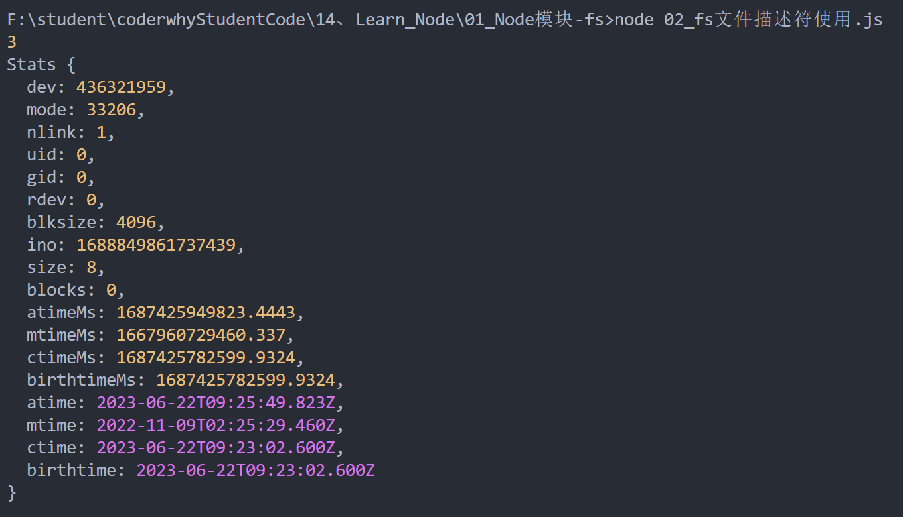

### 2.5、文件的读写

如果我们希望对文件的内容进行操作，这个时候可以使用文件的读写：

- `fs.readFile(path[, options], callback)`：读取文件的内容；
- `fs.writeFile(file, data[, options], callback)`：在文件中写入内容；

```js
const fs = require("fs");

// 1.有一段内容(客户端传递过来http/express/koa)
const content = "hello world, my name is coderwhy";

// 2.文件的写入操作
fs.writeFile(
  "./ccc.txt",
  content,
  {
    encoding: "utf8",
    flag: "a",
  },
  (err) => {
    if (err) {
      console.log("文件写入错误:", err);
    } else {
      console.log("文件写入成功");
    }
  }
);
```

在上面的代码中，你会发现有一个对象类型，这个是写入时填写的option参数：

- flag：写入的方式。
- encoding：字符的编码；

#### 2.5.1、flag选项

flag的值有很多：https://nodejs.org/dist/latest-v14.x/docs/api/fs.html#fs_file_system_flags

- w 打开文件写入，默认值，如果不存在则创建文件；
- w+ 打开文件进行读写（可读可写），如果不存在则创建文件；
- r 打开文件读取，读取时的默认值；
- r+ 打开文件进行读写，如果不存在那么抛出异常；
- a 打开要写入的文件，将流放在文件末尾。如果不存在则创建文件；
- a+ 打开文件以进行读写（可读可写），将流放在文件末尾。如果不存在则创建文件

#### 2.5.2、encoding选项

我们再来看看编码：

- 我之前在简书上写过一篇关于字符编码的文章：https://www.jianshu.com/p/899e749be47c
- 目前基本用的都是UTF-8编码；

文件读取：

- 如果不填写encoding，返回的结果是Buffer；

### 2.6、文件夹操作

新建一个文件夹

- 使用fs.mkdir()或fs.mkdirSync()创建一个新文件夹：

```js
fs.mkdir("./why", (err) => {
  console.log(err);
});
```

获取文件夹的内容

```js
// 读取文件夹
// 1.读取文件夹, 获取到文件夹中文件名的字符串
fs.readdir("./why", (err, files) => {
  console.log(files);
});

// 2.读取文件夹, 获取到文件夹中文件的信息
fs.readdir("./why", { withFileTypes: true }, (err, files) => {
  files.forEach((item) => {
    if (item.isDirectory()) {
      console.log("item是一个文件夹:", item.name);

      fs.readdir(
        `./why/${item.name}`,
        { withFileTypes: true },
        (err, files) => {
          console.log(files);
        }
      );
    } else {
      console.log("item是一个文件:", item.name);
    }
  });
});

// 3.递归的读取文件夹中所有的文件
function readDirectory(path) {
  fs.readdir(path, { withFileTypes: true }, (err, files) => {
    files.forEach((item) => {
      if (item.isDirectory()) {
        readDirectory(`${path}/${item.name}`);
      } else {
        console.log("获取到文件:", item.name);
      }
    });
  });
}
readDirectory("./why");
```

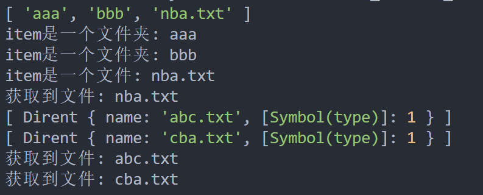

文件重命名

```js
// 1.对文件夹进行重命名
fs.rename('./why', './kobe', (err) => {
  console.log("重命名结果:", err)
})

// 2.对文件重命名
fs.rename("./ccc.txt", "./ddd.txt", (err) => {
  console.log("重命名结果:", err);
});
```

## 3、event模块-事件处理

### 3.1、events模块

Node中的核心API都是基于异步事件驱动的：

- 在这个体系中，某些对象（发射器（Emitters））发出某一个事件；
- 我们可以监听这个事件（监听器 Listeners），并且传入的回调函数，这个回调函数会在监听到事件时调用；

发出事件和监听事件都是通过EventEmitter类来完成的，它们都属于events对象。

- `emitter.on(eventName, listener)`：监听事件，也可以使用`addListener`；
- `emitter.off(eventName, listener)`：移除事件监听，也可以使用`removeListener`；
- `emitter.emit(eventName[, ...args])`：发出事件，可以携带一些参数；

```js
// events模块中的事件总线
const EventEmitter = require("events");

// 创建EventEmitter的实例
const emitter = new EventEmitter();

// 监听事件
function handleWhyFn(name, age, height) {
  console.log("监听why的事件", name, age, height);
}
emitter.on("why", handleWhyFn);

// 发射事件
setTimeout(() => {
  emitter.emit("why", "coderwhy", 18, 1.88);

  // 取消事件监听
  emitter.off("why", handleWhyFn);

  setTimeout(() => {
    emitter.emit("why");
  }, 1000);
}, 2000);
```

### 3.2、常见的方法

EventEmitter的实例有一些属性，可以记录一些信息：

- `emitter.eventNames()`：返回当前 EventEmitter对象注册的事件字符串数组；
- `emitter.getMaxListeners()`：返回当前EventEmitter对象的最大监听器数量,可通过`setMaxListeners()`来修改，默认是10；
- `emitter.listenerCount(事件名称)`：返回当前 EventEmitter对象某一个事件名称，监听器的个数；
- `emitter.listeners(事件名称)`：返回当前 EventEmitter对象某个事件监听器上所有的监听器数组；

```js
const EventEmitter = require("events");
const ee = new EventEmitter();

ee.on("why", () => {});
ee.on("why", () => {});
ee.on("why", () => {});
ee.on("kobe", () => {});
ee.on("kobe", () => {});

// 1.获取所有监听事件的名称
console.log(ee.eventNames());
// 2.获取监听最大的监听个数
console.log(ee.getMaxListeners());
// 3.获取某一个事件名称对应的监听器个数
console.log(ee.listenerCount("why"));
// 4.获取某一个事件名称对应的监听器函数(数组)
console.log(ee.listeners("why"));
```

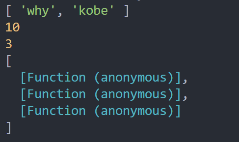

### 3.3、方法的补充

EventEmitter的实例方法补充：

- `emitter.once(eventName, listener)`：事件监听一次
- `emitter.prependListener()`：将监听事件添加到最前面
- `emitter.prependOnceListener()`：将监听事件添加到最前面，但是只监听一次
- `emitter.removeAllListeners([eventName])`：移除所有的监听器

```js
const EventEmitter = require("events");
const ee = new EventEmitter();

// 1.once: 事件监听只监听一次(第一次发射事件的时候进行监听)
ee.once("why", () => {
  console.log("on监听why");
});

// 2.prependListener: 将事件监听添加到最前面
ee.prependListener("why", () => {
  console.log("on监听why2");
});

ee.emit("why");

// 3.移除所有的事件监听
// 不传递参数的情况下, 移除所有事件名称的所有事件监听
// 在传递参数的情况下, 只会移除传递的事件名称的事件监听
ee.removeAllListeners("why");
```

## 4、认识二进制和buffer

### 4.1、数据的二进制

计算机中所有的内容：文字、数字、图片、音频、视频最终都会使用二进制来表示。

JavaScript可以直接去处理非常直观的数据：比如字符串，我们通常展示给用户的也是这些内容。

不对啊，JavaScript不是也可以处理图片吗？

- 事实上在网页端，图片我们一直是交给浏览器来处理的；
- JavaScript或者HTML，只是负责告诉浏览器一个图片的地址；
- 浏览器负责获取这个图片，并且最终讲这个图片渲染出来；

但是对于服务器来说是不一样的：

- 服务器要处理的本地文件类型相对较多;
- 比如某一个保存文本的文件并不是使用 utf-8进行编码的，而是用 GBK，那么我们必须读取到他们的二进制数据，再通过GKB转换成对应的文字；

- 比如我们需要读取的是一张图片数据（二进制），再通过某些手段对图片数据进行二次的处理（裁剪、格式转换、旋转、添加滤镜），Node中有一个Sharp的库，就是读取图片或者传入图片的Buffer对其再进行处理；

- 比如在Node中通过TCP建立长连接，TCP传输的是字节流，我们需要将数据转成字节再进行传入，并且需要知道传输字节的大小（客服端需要根据大小来判断读取多少内容）；

### 4.2、Buffer和二进制

我们会发现，对于前端开发来说，通常很少会和二进制直接打交道，但是对于服务器端为了做很多的功能，我们必须直接去操作其二进制的数据；

所以Node为了可以方便开发者完成更多功能，提供给了我们一个类Buffer，并且它是全局的。

我们前面说过，Buffer中存储的是二进制数据，那么到底是如何存储呢？

- 我们可以将Buffer看成是一个存储二进制的数组；
- 这个数组中的每一项，可以保存8位二进制： 0000 0000

为什么是8位呢？

- 在计算机中，很少的情况我们会直接操作一位二进制，因为一位二进制存储的数据是非常有限的；
- 所以通常会将8位合在一起作为一个单元，这个单元称之为一个字节（byte）；
- 也就是说 1byte = 8bit，1kb=1024byte，1M=1024kb；
- 比如很多编程语言中的int类型是4个字节，long类型时8个字节；
- 比如TCP传输的是字节流，在写入和读取时都需要说明字节的个数；
- 比如RGB的值分别都是255，所以本质上在计算机中都是用一个字节存储的；

## 5、Buffer的创建方式

### 5.1、Buffer和字符串

Buffer相当于是一个字节的数组，数组中的每一项对应一个字节的大小：

如果我们希望将一个字符串放入到Buffer中，是怎么样的过程呢？

```js
const buf = new Buffer("hello");
console.log(buf);
```

 它是怎么样的过程呢？

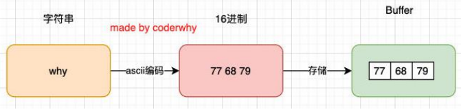

```js
const buf2 = Buffer.from("world");
console.log(buf2);
```

**如果是中文呢？**

默认编码：utf-8

```js
const buf3 = Buffer.from("你好啊hhhhh");
console.log(buf3);
console.log(buf3.toString());
```

如果编码和解码不同：

```js
// 4.手动指定的Buffer创建过程的编码
// 编码操作
const buf4 = Buffer.from("哈哈哈", "utf16le");
console.log(buf4);
// 解码操作
console.log(buf4.toString("utf16le"));
```

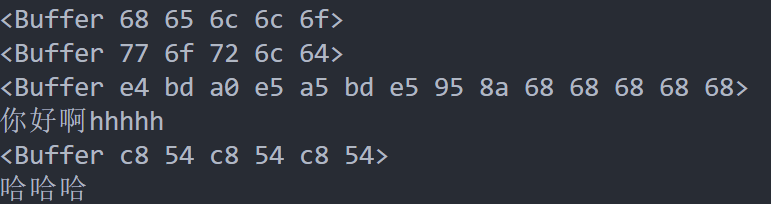

### 5.2、Buffer的其他创建

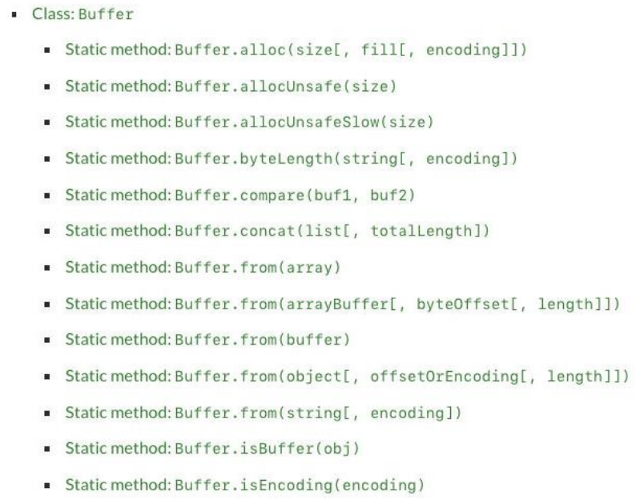

### 5.3、Buffer.alloc

来看一下Buffer.alloc:

- 我们会发现创建了一个8位长度的Buffer，里面所有的数据默认为00；

```js
// 1.创建一个Buffer对象
// 8个字节大小的buffer内存空间
const buf = Buffer.alloc(8);
console.log(buf); // <Buffer 00 00 00 00 00 00 00 00>
```

我们也可以对其进行操作

```js
// 2.手动对每个字节进行访问
console.log(buf[0]);
console.log(buf[1]);

// 3.手动对每个字节进行操作
buf[0] = 100;
buf[1] = 0x66;
console.log(buf);
console.log(buf.toString());

buf[2] = "m".charCodeAt();
console.log(buf);
```

### 5.4、Buffer和文件读取

文本文件的读取：

```js
// 1.从文件中读取buffer
fs.readFile("./aaa.txt", { encoding: "utf-8" }, (err, data) => {
  console.log(data);
});

fs.readFile("./aaa.txt", (err, data) => {
  console.log(data.toString());
});

fs.readFile("./aaa.txt", (err, data) => {
  data[0] = 0x6d;
  console.log(data.toString());
});
```

图片文件的读取

```js
// 2.读取一个图片的二进制(node中有一个库sharp)
fs.readFile("./kobe02.png", (err, data) => {
  console.log(data);
});
```

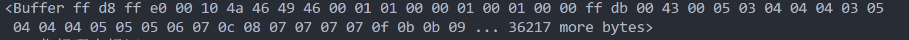

## 6、Buffer的源码解析

### 6.1、Buffer的创建过程

事实上我们创建Buffer时，并不会频繁的向操作系统申请内存，它会默认先申请一个8 * 1024个字节大小的内存，也就是8kb

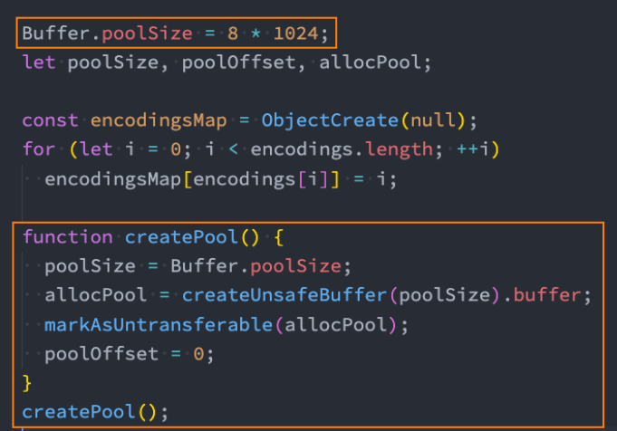

### 6.2、Buffer.from源码

假如我们调用Buffer.from申请Buffer：

- 这里我们以从字符串创建为例
- node/lib/buffer.js：290行

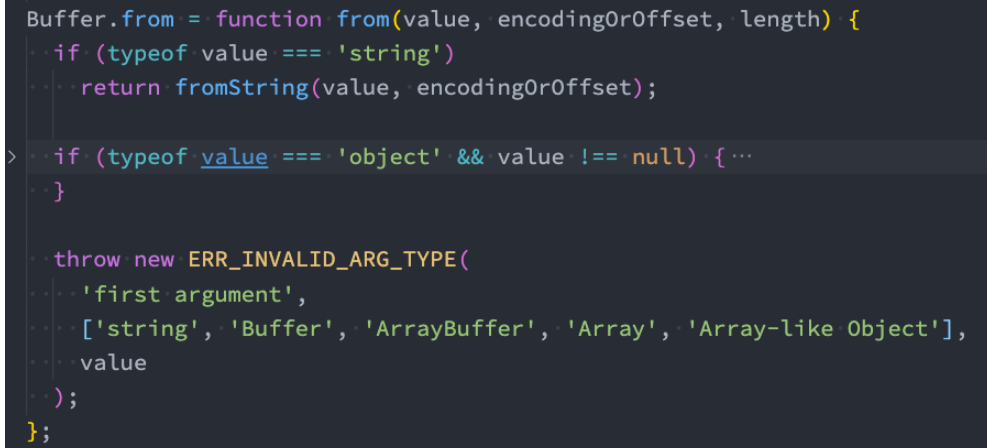

### 6.3、fromString的源码

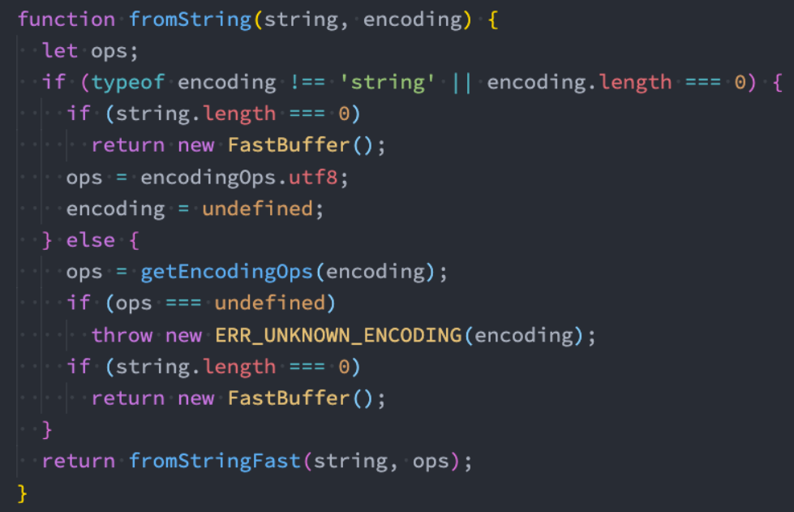

### 6.4、fromStringFast

接着我们查看fromStringFast：

- 这里做的事情是判断剩余的长度是否还足够填充这个字符串；
- 如果不足够，那么就要通过 createPool 创建新的空间；
- 如果够就直接使用，但是之后要进行 poolOffset的偏移变化；
- node/lib/buffer.js：428行

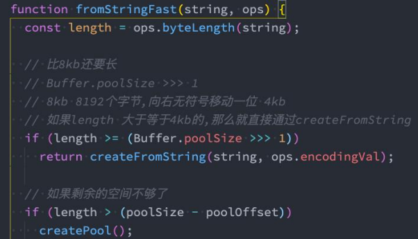

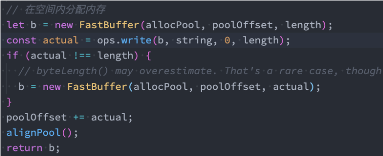


