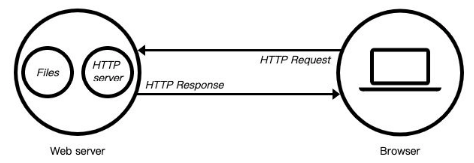
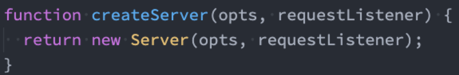
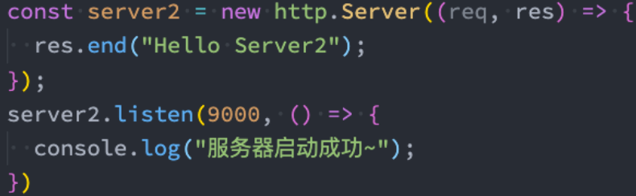
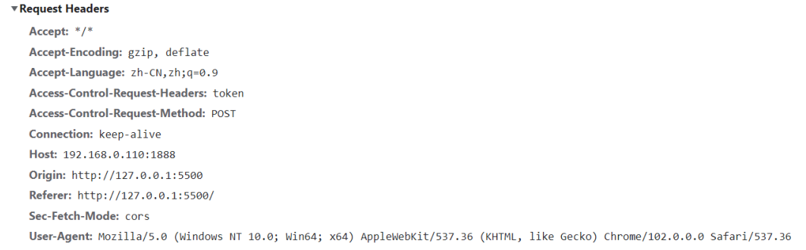
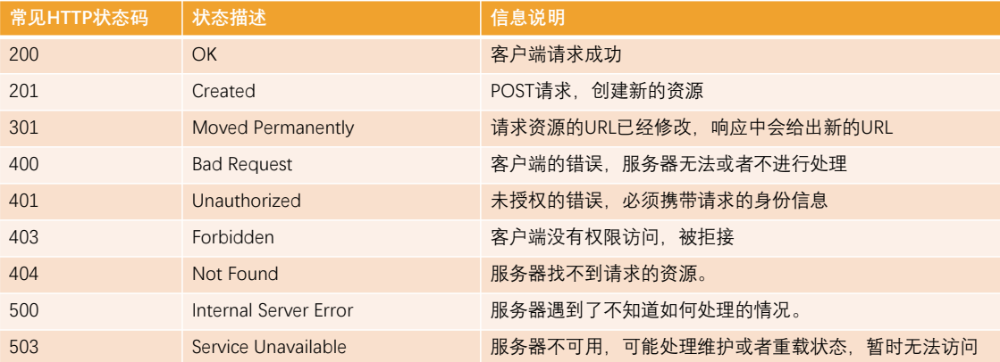
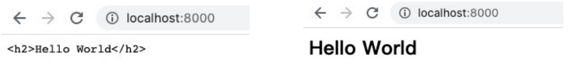

## 1、Stream的读写操作

### 1.1、认识Stream

什么是Stream（小溪、小河，在编程中通常翻译为流）呢？

- 我们的第一反应应该是流水，源源不断的流动；
- 程序中的流也是类似的含义，我们可以想象当我们从一个文件中读取数据时，文件的二进制（字节）数据会源源不断的被读取到我们程序中；
- 而这个一连串的字节，就是我们程序中的流；

所以，我们可以这样理解流：

- 是连续字节的一种表现形式和抽象概念；
- 流应该是可读的，也是可写的；

在之前学习文件的读写时，我们可以直接通过 readFile或者 writeFile方式读写文件，为什么还需要流呢？

- 直接读写文件的方式，虽然简单，但是无法控制一些细节的操作；
- 比如从什么位置开始读、读到什么位置、一次性读取多少个字节；
- 读到某个位置后，暂停读取，某个时刻恢复继续读取等等；
- 或者这个文件非常大，比如一个视频文件，一次性全部读取并不合适；

### 1.2、文件读写的Stream

事实上Node中很多对象是基于流实现的：

- http模块的Request和Response对象；

官方文档：另外所有的流都是EventEmitter的实例。

那么在Node中都有哪些流呢？

Node.js中有四种基本流类型：

- Writable：可以向其写入数据的流（例如 `fs.createWriteStream()`）。
- Readable：可以从中读取数据的流（例如 `fs.createReadStream()`）。
- Duplex：同时为Readable和Writable（例如 `net.Socket`）。
- Transform：Duplex可以在写入和读取数据时修改或转换数据的流（例如`zlib.createDeflate()`）。

这里我们通过fs的操作，讲解一下Writable、Readable，另外两个大家可以自行学习一下。

### 1.3、Readable

之前我们读取一个文件的信息：

```js
// 1.一次性读取
// 缺点一: 没有办法精准控制从哪里读取, 读取什么位置.
// 缺点二: 读取到某一个位置的, 暂停读取, 恢复读取.
// 缺点三: 文件非常大的时候, 多次读取.
fs.readFile('./aaa.txt', (err, data) => {
  console.log(data)
})
```

这种方式是一次性将一个文件中所有的内容都读取到程序（内存）中，但是这种读取方式就会出现我们之前提到的很多问题：

- 文件过大、读取的位置、结束的位置、一次读取的大小；

这个时候，我们可以使用 createReadStream，我们来看几个参数，更多参数可以参考官网：

- start：文件读取开始的位置；
- end：文件读取结束的位置；
- highWaterMark：一次性读取字节的长度，默认是64kb；

### 1.4、Readable的使用

创建文件的Readable

```js
// 2.通过流读取文件
// 2.1. 创建一个可读流
// start: 从什么位置开始读取
// end: 读取到什么位置后结束(包括end位置字节)
const readStream = fs.createReadStream("./aaa.txt", {
  start: 8,
  end: 22,
  highWaterMark: 3,
});
```

我们如何获取到数据呢？

- 可以通过监听data事件，获取读取到的数据；

```js
readStream.on("data", (data) => {
  console.log(data.toString());

  readStream.pause();

  setTimeout(() => {
    readStream.resume();
  }, 2000);
});
```

 也可以做一些其他的操作：监听其他事件、暂停或者恢复

```js
// 1.通过流读取文件
const readStream = fs.createReadStream("./aaa.txt", {
  start: 8,
  end: 22,
  highWaterMark: 3,
});

// 2.监听读取到的数据
readStream.on("data", (data) => {
  console.log(data.toString());
});

// 3.补充其他的事件监听
readStream.on("open", (fd) => {
  console.log("通过流将文件打开~", fd);
});

readStream.on("end", () => {
  console.log("已经读取到end位置");
});

readStream.on("close", () => {
  console.log("文件读取结束, 并且被关闭");
});
```

### 1.5、Writable

之前我们写入一个文件的方式是这样的：

```js
// 1.一次性写入内容
fs.writeFile('./bbb.txt', 'hello world', {
  encoding: 'utf-8',
  flag: 'a+'
}, (err) => {
  console.log('写入文件结果:', err)
})
```

这种方式相当于一次性将所有的内容写入到文件中，但是这种方式也有很多问题：

- 比如我们希望一点点写入内容，精确每次写入的位置等；

这个时候，我们可以使用 createWriteStream，我们来看几个参数，更多参数可以参考官网：

- flags：默认是w，如果我们希望是追加写入，可以使用 a或者 a+；
- start：写入的位置；

### 1.6、Writable的使用

我们进行一次简单的写入

```js
// 2.创建一个写入流
const writeStream = fs.createWriteStream("./ccc.txt", {
  flags: "a",
});

writeStream.on("open", (fd) => {
  console.log("文件被打开", fd);
});

writeStream.write("coderwhy");
writeStream.write("aaaa");
writeStream.write("bbbb", (err) => {
  console.log("写入完成:", err);
});

writeStream.on("finish", () => {
  console.log("写入完成了");
});
```

你可以监听open事件

```js
const writeStream = fs.createWriteStream('./ddd.txt', {
  // mac上面是没有问题
  // flags: 'a+',
  // window上面是需要使用r+
  flags: 'r+',
  start: 5
})

writeStream.write('my name is why')
writeStream.close()
```

### 1.7、close的监听

我们会发现，我们并不能监听到 close 事件：

- 这是因为写入流在打开后是不会自动关闭的；
- 我们必须手动关闭，来告诉Node已经写入结束了；
- 并且会发出一个 finish 事件的；

另外一个非常常用的方法是 end：end方法相当于做了两步操作： write传入的数据和调用close方法；

```js
writeStream.on("close", () => {
  console.log("文件被关闭~");
});

// 3.写入完成时, 需要手动去掉用close方法
// writeStream.close()

// 4.end方法:
// 操作一: 将最后的内容写入到文件中, 并且关闭文件
// 操作二: 关闭文件
writeStream.end("哈哈哈哈");
```

### 1.8、pipe方法

正常情况下，我们可以将读取到的 输入流，手动的放到 输出流中进行写入：

```js
// 1.方式一: 一次性读取和写入文件
fs.readFile("./foo.txt", (err, data) => {
  console.log(data);
  fs.writeFile("./foo_copy01.txt", data, (err) => {
    console.log("写入文件完成", err);
  });
});

// 2.方式二: 创建可读流和可写流
const readStream = fs.createReadStream("./foo.txt");
const writeStream = fs.createWriteStream("./foo_copy02.txt");
readStream.on("data", (data) => {
  writeStream.write(data);
});
readStream.on("end", () => [writeStream.close()]);
```

我们也可以通过pipe来完成这样的操作：

```js
// 3.在可读流和可写流之间建立一个管道
const readStream = fs.createReadStream('./foo.txt')
const writeStream = fs.createWriteStream('./foo_copy03.txt')

readStream.pipe(writeStream)
```

## 2、http模块web服务

### 2.1、Web服务器

什么是Web服务器？

- 当应用程序（客户端）需要某一个资源时，可以向一台服务器，通过Http请求获取到这个资源；
- 提供资源的这个服务器，就是一个Web服务器；



目前有很多开源的Web服务器：Nginx、Apache（静态）、Apache Tomcat（静态、动态）、Node.js

### 2.2、http模块

在Node中，提供web服务器的资源返回给浏览器，主要是通过http模块。

我们先简单对它做一个使用：

```js
const http = require("http");

// 创建一个http对应的服务器
const server = http.createServer((request, response) => {
  // request对象中包含本次客户端请求的所有信息
  // 请求的url
  // 请求的method
  // 请求的headers
  // 请求携带的数据

  // response对象用于给客户端返回结果的
  response.end("Hello World");
});

// 开启对应的服务器, 并且告知需要监听的端口
// 监听端口时, 监听1024以上的端口, 666535以下的端口
// 1025~65535之间的端口
// 2个字节 => 256*256 => 65536 => 0~65535
server.listen(8000, () => {
  console.log("服务器已经开启成功了~");
});
```

创建多个服务

```js
const http = require('http')

// 1.创建一个服务器
const server1 = http.createServer((req, res) => {
  res.end("2000端口服务器返回的结果~")
})
server1.listen(2000, () => {
  console.log('2000端口对应的服务器启动成功~')
})

// 2.创建第二个服务器
const server2 = http.createServer((req, res) => {
  res.end("3000端口服务器返回的结果~")
})
server2.listen(3000, () => {
  console.log('3000端口对应的服务器启动成功~')
})
```

### 2.3、创建服务器

创建服务器对象，我们是通过 createServer 来完成的

- http.createServer会返回服务器的对象；
- 底层其实使用直接 new Server 对象。



那么，当然，我们也可以自己来创建这个对象：



- 上面我们已经看到，创建Server时会传入一个回调函数，这个回调函数在被调用时会传入两个参数：
- req：request请求对象，包含请求相关的信息；
- res：response响应对象，包含我们要发送给客户端的信息；

### 2.4、监听主机和端口号

Server通过listen方法来开启服务器，并且在某一个主机和端口上监听网络请求：

- 也就是当我们通过 ip:port的方式发送到我们监听的Web服务器上时；
- 我们就可以对其进行相关的处理；

listen函数有三个参数：

- 端口port: 可以不传, 系统会默认分配端, 后续项目中我们会写入到环境变量中；
- 主机host: 通常可以传入localhost、ip地址127.0.0.1、或者ip地址0.0.0.0，默认是0.0.0.0；
  - localhost：本质上是一个域名，通常情况下会被解析成127.0.0.1；
  - 127.0.0.1：回环地址（Loop Back Address），表达的意思其实是我们主机自己发出去的包，直接被自己接收；
    - 正常的数据库包经常 应用层 - 传输层 - 网络层 - 数据链路层 - 物理层 ；
    - 而回环地址，是在网络层直接就被获取到了，是不会经常数据链路层和物理层的；
    - 比如我们监听 127.0.0.1时，在同一个网段下的主机中，通过ip地址是不能访问的；
  - 0.0.0.0：
    - 监听IPV4上所有的地址，再根据端口找到不同的应用程序；
    - 比如我们监听 0.0.0.0时，在同一个网段下的主机中，通过ip地址是可以访问的；
- 回调函数：服务器启动成功时的回调函数；

## 3、request请求对象

### 3.1、request对象

在向服务器发送请求时，我们会携带很多信息，比如：

- 本次请求的URL，服务器需要根据不同的URL进行不同的处理；
- 本次请求的请求方式，比如GET、POST请求传入的参数和处理的方式是不同的；
- 本次请求的headers中也会携带一些信息，比如客户端信息、接受数据的格式、支持的编码格式等；
- 等等...

这些信息，Node会帮助我们封装到一个request的对象中，我们可以直接来处理这个request对象：

```js
const server = http.createServer((req, res) => {
  // request对象中包含哪些信息?
  // 1.url信息
  console.log(req.url);
  // 2.method信息(请求方式)
  console.log(req.method);
  // 3.headers信息(请求信息)
  console.log(req.headers);

  res.end("hello world aaaa");
});
```

### 3.2、URL的处理

客户端在发送请求时，会请求不同的数据，那么会传入不同的请求地址：

- 比如 http://localhost:8000/login；
- 比如 http://localhost:8000/products;

服务器端需要根据不同的请求地址，作出不同的响应：

```js
const server = http.createServer((req, res) => {
  const url = req.url;

  if (url === "/login") {
    res.end("登录成功~");
  } else if (url === "/products") {
    res.end("商品列表~");
  } else if (url === "/lyric") {
    res.end("天空好想下雨, 我好想住你隔壁!");
  }
});
```

### 3.3、URL的解析

那么如果用户发送的地址中还携带一些额外的参数呢？

- http://localhost:8000/login?name=why&password=123;
- 这个时候，url的值是 /login?name=why&password=123；

我们如何对它进行解析呢？使用内置模块url

```js
const urlInfo = url.parse(urlString);
```

但是 query 信息如何可以获取呢？

```js
const http = require("http");
const url = require("url");
const qs = require("querystring");

const server = http.createServer((req, res) => {
  // 1.参数一: query类型参数
  // /home/list?offset=100&size=20
  // 1.1.解析url
  const urlString = req.url;
  const urlInfo = url.parse(urlString);

  // 1.2.解析query: offset=100&size=20
  const queryString = urlInfo.query;
  const queryInfo = qs.parse(queryString);
  console.log(queryInfo.offset, queryInfo.size);

  res.end("hello world aaaa bbb");
});

server.listen(8000, () => {
  console.log("服务器开启成功~");
});
```

### 3.4、method的处理

在Restful规范（设计风格）中，我们对于数据的增删改查应该通过不同的请求方式：

- GET：查询数据；
- POST：新建数据；
- PATCH：更新数据；
- DELETE：删除数据；

```js
const server = http.createServer((req, res) => {
  const url = req.url;
  const method = req.method;

  if (url === "/login") {
    if (method === "POST") {
      res.end("登录成功~");
    } else {
      res.end("不支持的请求方式, 请检测你的请求方式~");
    }
  } else if (url === "/products") {
    res.end("商品列表~");
  } else if (url === "/lyric") {
    res.end("天空好想下雨, 我好想住你隔壁!");
  }
});
```

所以，我们可以通过判断不同的请求方式进行不同的处理。

- 比如创建一个用户：
- 请求接口为 /users；
- 请求方式为 POST请求；
- 携带数据 username和password；

### 3.5、创建用户接口

在我们程序中如何进行判断以及获取对应的数据呢？

- 这里我们需要判断接口是 /users，并且请求方式是POST方法去获取传入的数据；
- 获取这种body携带的数据，我们需要通过监听req的 data事件来获取；

```js
const http = require("http");
const url = require("url");
const qs = require("querystring");

const server = http.createServer((req, res) => {
  // 获取参数: body参数
  req.setEncoding("utf-8");

  // request对象本质是上一个readable可读流
  let isLogin = false;
  req.on("data", (data) => {
    const dataString = data;
    const loginInfo = JSON.parse(dataString);
    if (loginInfo.name === "coderwhy" && loginInfo.password === "123456") {
      isLogin = true;
    } else {
      isLogin = false;
    }
  });

  req.on("end", () => {
    if (isLogin) {
      res.end("登录成功, 欢迎回来~");
    } else {
      res.end("账号或者密码错误, 请检测登录信息~");
    }
  });
});

server.listen(8000, () => {
  console.log("服务器开启成功~");
});
```

将JSON字符串格式转成对象类型，通过JSON.parse方法即可。

### 3.6、HTTP Request Header

在request对象的header中也包含很多有用的信息，客户端会默认传递过来一些信息：



-  content-type是这次请求携带的数据的类型：

  - application/x-www-form-urlencoded：表示数据被编码成以 '&' 分隔的键 - 值对，同时以 '=' 分隔键和值

  - application/json：表示是一个json类型；

  - text/plain：表示是文本类型；

  - application/xml：表示是xml类型；

  - multipart/form-data：表示是上传文件；

- content-length：文件的大小长度
- keep-alive：
  - http是基于TCP协议的，但是通常在进行一次请求和响应结束后会立刻中断；
  - 在http1.0中，如果想要继续保持连接：
    - 浏览器需要在请求头中添加 connection: keep-alive；
    - 服务器需要在响应头中添加 connection:keey-alive；
    - 当客户端再次放请求时，就会使用同一个连接，直接一方中断连接；
  - 在http1.1中，所有连接默认是 connection: keep-alive的；
    - 不同的Web服务器会有不同的保持 keep-alive的时间；
    - Node中默认是5s中；
- accept-encoding：告知服务器，客户端支持的文件压缩格式，比如js文件可以使用gzip编码，对应 .gz文件；
- accept：告知服务器，客户端可接受文件的格式类型；
- user-agent：客户端相关的信息；

## 4、response响应对象

### 4.1、返回响应结果

 如果我们希望给客户端响应的结果数据，可以通过两种方式：

- Write方法：这种方式是直接写出数据，但是并没有关闭流；
- end方法：这种方式是写出最后的数据，并且写出后会关闭流；

```js
const server = http.createServer((req, res) => {
  // res: response对象 => Writable可写流
  // 1.响应数据方式一: write
  res.write("Hello World");
  res.write("哈哈哈哈");

  // 2.响应数据方式二: end
  res.end("本次写出已经结束");
});
```

如果我们没有调用 end和close，客户端将会一直等待结果：

- 所以客户端在发送网络请求时，都会设置超时时间

### 4.2、返回状态码

Http状态码（Http Status Code）是用来表示Http响应状态的数字代码：

- Http状态码非常多，可以根据不同的情况，给客户端返回不同的状态码；
- MDN响应码解析地址：https://developer.mozilla.org/zh-CN/docs/web/http/status



```js
const server = http.createServer((req, res) => {
  // 响应状态码
  // 1.方式一: statusCode
  res.statusCode = 403

  // 2.方式二: setHead 响应头
  res.writeHead(401);

  res.end("hello world aaaa");
});
```

### 4.3、响应头文件

返回头部信息，主要有两种方式：

- res.setHeader：一次写入一个头部信息；
- res.writeHead：同时写入header和status；

```js
const server = http.createServer((req, res) => {

  // 设置header信息: 数据的类型以及数据的编码格式
  // 1.单独设置某一个header
  res.setHeader('Content-Type', 'text/plain;charset=utf8;')

  // 2.和http status code一起设置
  res.writeHead(200, {
    'Content-Type': 'application/json;charset=utf8;'
  })

  const list = [
    { name: "why", age: 18 },
    { name: "kobe", age: 30 },
  ]
  res.end(JSON.stringify(list))
})
```

Header设置 Content-Type有什么作用呢？

- 默认客户端接收到的是字符串，客户端会按照自己默认的方式进行处理；



## 5、axios node中使用

### http请求

 axios库可以在浏览器中使用，也可以在Node中使用：

- 在浏览器中，axios使用的是封装xhr；
- 在Node中，使用的是http内置模块；

```js
const axios = require("axios");
axios.get("http://localhost:8000").then((res) => {
  console.log(res.data);
});
```

```js
const http = require("http");

// 1.使用http模块发送get请求
http.get("http://localhost:8000", (res) => {
  // 从可读流中获取数据
  res.on("data", (data) => {
    const dataString = data.toString();
    const dataInfo = JSON.parse(dataString);
    console.log(dataInfo);
  });
});

// 2.使用http模块发送post请求
const req = http.request(
  {
    method: "POST",
    hostname: "localhost",
    port: 8000,
  },
  (res) => {
    res.on("data", (data) => {
      const dataString = data.toString();
      const dataInfo = JSON.parse(dataString);
      console.log(dataInfo);
    });
  }
);

// 必须调用end, 表示写入内容完成
req.end();
```

## 6、文件上传的细节分析

```html
<!DOCTYPE html>
<html lang="en">
  <head>
    <meta charset="UTF-8" />
    <meta http-equiv="X-UA-Compatible" content="IE=edge" />
    <meta name="viewport" content="width=device-width, initial-scale=1.0" />
    <title>Document</title>
  </head>
  <body>
    <input type="file" />
    <button>上传</button>

    <script src="https://cdn.jsdelivr.net/npm/axios/dist/axios.min.js"></script>
    <script>
      // 文件上传的逻辑
      const btnEl = document.querySelector("button");
      btnEl.onclick = function () {
        // 1.创建表单对象
        const formData = new FormData();

        // 2.将选中的图标文件放入表单
        const inputEl = document.querySelector("input");
        formData.set("photo", inputEl.files[0]);

        // 3.发送post请求, 将表单数据携带到服务器(axios)
        axios({
          method: "post",
          url: "http://localhost:8000",
          data: formData,
          headers: {
            "Content-Type": "multipart/form-data",
          },
        });
      };
    </script>
  </body>
</html>
```

### 6.1、文件上传 – 错误示范

如果是一个很大的文件需要上传到服务器端，服务器端进行保存应该如何操作呢？

```js
const http = require("http");
const fs = require("fs");

const server = http.createServer((req, res) => {
  // 创建writable的stream
  const writeStream = fs.createWriteStream("./foo.png", {
    flags: "a+",
  });

  // req.pipe(writeStream)

  // 客户端传递的数据是表单数据(请求体)
  req.on("data", (data) => {
    console.log(data);
    writeStream.write(data);
  });

  req.on("end", () => {
    // console.log("数据传输完成~");
    writeStream.close()
    res.end("文件上传成功~");
  });
});

server.listen(8000, () => {
  console.log("服务器开启成功~");
});
```

### 6.2、文件上传 – 正确做法

```js
const http = require("http");
const fs = require("fs");

// 1.创建server服务器
const server = http.createServer((req, res) => {
  req.setEncoding("binary");

  const boundary = req.headers["content-type"]
    .split("; ")[1]
    .replace("boundary=", "");
  console.log(boundary);

  // 客户端传递的数据是表单数据(请求体)
  let formData = "";
  req.on("data", (data) => {
    formData += data;
  });

  req.on("end", () => {
    console.log(formData);
    // 1.截图从image/jpeg位置开始后面所有的数据
    const imgType = "image/jpeg";
    const imageTypePosition = formData.indexOf(imgType) + imgType.length;
    let imageData = formData.substring(imageTypePosition);

    // 2.imageData开始位置会有两个空格
    imageData = imageData.replace(/^\s\s*/, "");

    // 3.替换最后的boundary
    imageData = imageData.substring(0, imageData.indexOf(`--${boundary}--`));

    // 4.将imageData的数据存储到文件中
    fs.writeFile("./bar.png", imageData, "binary", () => {
      console.log("文件存储成功");
      res.end("文件上传成功~");
    });
  });
});

server.listen(8000, () => {
  console.log("服务器开启成功~");
});
```


