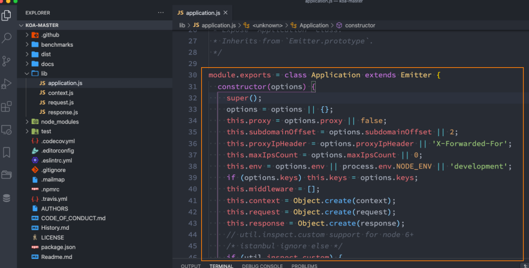
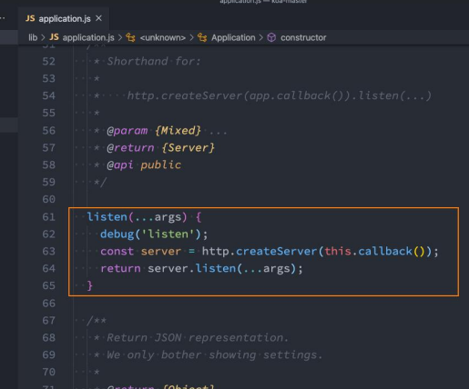
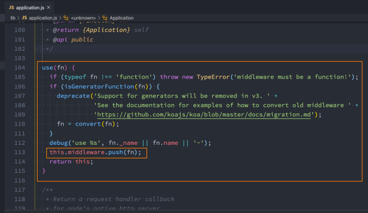
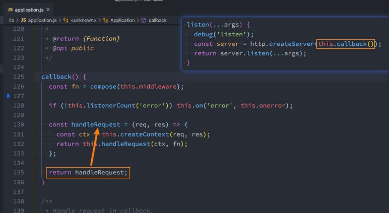
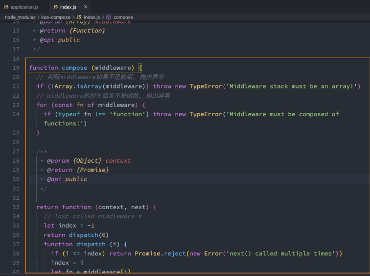
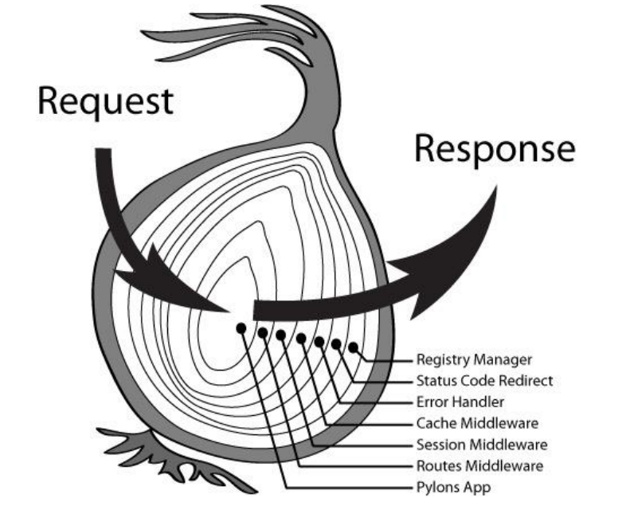

## 1、koa的基本使用

### 1.1、认识Koa

前面我们已经学习了express，另外一个非常流行的Node Web服务器框架就是Koa。

Koa官方的介绍：

- koa：next generation web framework for node.js；
- koa：node.js的下一代web框架；

事实上，koa是express同一个团队开发的一个新的Web框架：

- 目前团队的核心开发者TJ的主要精力也在维护Koa，express已经交给团队维护了；
- Koa旨在为Web应用程序和API提供更小、更丰富和更强大的能力；
- 相对于express具有更强的异步处理能力（后续我们再对比）；
- Koa的核心代码只有1600+行，是一个更加轻量级的框架；
- 我们可以根据需要安装和使用中间件；

事实上学习了express之后，学习koa的过程是很简单的；

### 1.2、Koa初体验

我们来体验一下koa的Web服务器，创建一个接口。

- koa也是通过注册中间件来完成请求操作的；

koa注册的中间件提供了两个参数：

- ctx：上下文（Context）对象；
  - koa并没有像express一样，将req和res分开，而是将它们作为ctx的属性；
  - ctx代表一次请求的上下文对象；
  - ctx.request：获取请求对象；
  - ctx.response：获取响应对象；

- next：本质上是一个dispatch，类似于之前的next；
  - 后续我们学习Koa的源码，来看一下它是一个怎么样的函数；

```js
const Koa = require("koa");

// 创建app对象
const app = new Koa();

// 注册中间件(middleware)
// koa的中间件有两个参数: ctx/next
app.use((ctx, next) => {
  console.log("匹配到koa的中间件");
  ctx.body = "哈哈哈哈哈";
});

// 启动服务器
app.listen(6000, () => {
  console.log("koa服务器启动成功~");
});
```

```js
const Koa = require("koa");

// 创建app
const app = new Koa();

// 中间件
app.use((ctx, next) => {
  // 1.请求对象
  console.log(ctx.request); // 请求对象: Koa封装的请求对象
  console.log(ctx.req); // 请求对象: Node封装的请求对象

  // 2.响应对象
  console.log(ctx.response); // 响应对象: Koa封装的响应对象
  console.log(ctx.res); // 响应对象: Node封装的响应对象

  // 3.其他属性
  console.log(ctx.query);
  // console.log(ctx.params)

  next();
});

app.use((ctx, next) => {
  console.log("second middleware~");
});

// 启动服务器
app.listen(6000, () => {
  console.log("koa服务器启动成功~");
});
```

### 1.3、Koa中间件

koa通过创建的app对象，注册中间件只能通过use方法：

- Koa并没有提供methods的方式来注册中间件；
- 也没有提供path中间件来匹配路径；

但是真实开发中我们如何将路径和method分离呢？

- 方式一：根据request自己来判断；
- 方式二：使用第三方路由中间件；

```js
const Koa = require("koa");

// 创建app
const app = new Koa();

// 中间件: path/method使用路由
app.use((ctx, next) => {
  if (ctx.path === "/users") {
    if (ctx.method === "GET") {
      ctx.body = "user data list";
    } else if (ctx.method === "POST") {
      ctx.body = "create user success~";
    }
  } else if (ctx.path === "/home") {
    ctx.body = "home data list~";
  } else if (ctx.path === "/login") {
    ctx.body = "登录成功, 欢迎回来~";
  }
});

// 启动服务器
app.listen(6000, () => {
  console.log("koa服务器启动成功~");
});
```

### 1.4、路由的使用

koa官方并没有给我们提供路由的库，我们可以选择第三方库：koa-router

- `npm install @koa/router`

可以先封装一个 user.router.js 的文件：

在app中将router.routes()注册为中间件：

注意：allowedMethods用于判断某一个method是否支持：

- 如果我们请求 get，那么是正常的请求，因为我们有实现get；
- 如果我们请求 put、delete、patch，那么就自动报错：Method Not Allowed，状态码：405；
- 如果我们请求 link、copy、lock，那么久自动报错：Not Implemented，状态码：501；

```js
const KoaRouter = require("@koa/router");

// 1.创建路由对象
const userRouter = new KoaRouter({ prefix: "/users" });

// 2.在路由中注册中间件: path/method
userRouter.get("/", (ctx, next) => {
  ctx.body = "users list data~";
});
userRouter.get("/:id", (ctx, next) => {
  const id = ctx.params.id;
  ctx.body = "获取某一个用户" + id;
});
userRouter.post("/", (ctx, next) => {
  ctx.body = "创建用户成功~";
});
userRouter.delete("/:id", (ctx, next) => {
  const id = ctx.params.id;
  ctx.body = "删除某一个用户" + id;
});

module.exports = userRouter;
```

```js
const Koa = require("koa");
const userRouter = require("./router/userRouter");

// 创建服务器app
const app = new Koa();

// 3.让路由中的中间件生效
app.use(userRouter.routes());
app.use(userRouter.allowedMethods());

// 启动服务器
app.listen(6000, () => {
  console.log("koa服务器启动成功~");
});
```

## 2、koa的参数解析

### 2.1、参数解析

- 参数解析：params - query
- 参数解析：json
  - body是json格式
  - 获取json数据：
    - 安装依赖：`npm install koa-bodyparser`; 
    - 使用 koa-bodyparser的中间件；

- 参数解析：x-www-form-urlencoded
  - body是x-www-form-urlencoded格式
  - 获取json数据：(和json是一致的)
    - 安装依赖：` npm install koa-bodyparser`; 
    - 使用 koa-bodyparser的中间件；

- 参数解析：form-data
  - body是form-data格式
  - 解析body中的数据，我们需要使用multer 
    - 安装依赖：`npm install koa-multer`; 
    - 使用 multer中间件；

```js
const Koa = require("koa");
const KoaRouter = require("@koa/router");
const bodyParser = require("koa-bodyparser");
const multer = require("@koa/multer");

// 创建app对象
const app = new Koa();

// 使用第三方中间件解析body数据
app.use(bodyParser());
const formParser = multer();

// 注册路由对象
const userRouter = new KoaRouter({ prefix: "/users" });

/**
 * 1.get: params方式, 例子:/:id
 * 2.get: query方式, 例子: ?name=why&age=18
 * 3.post: json方式, 例子: { "name": "why", "age": 18 }
 * 4.post: x-www-form-urlencoded
 * 5.post: form-data
 */
// 1.get/params
userRouter.get("/:id", (ctx, next) => {
  const id = ctx.params.id;
  ctx.body = "user list data~:" + id;
});

// 2.get/query
userRouter.get("/", (ctx, next) => {
  const query = ctx.query;
  console.log(query);
  ctx.body = "用户的query信息" + JSON.stringify(query);
});

// 3.post/json(使用最多)
userRouter.post("/json", (ctx, next) => {
  // 注意事项: 不能从ctx.body中获取数据
  console.log(ctx.request.body, ctx.req.body);

  // ctx.body用于向客户端返回数据
  ctx.body = "用户的json信息";
});

// 4.post/urlencoded
userRouter.post("/urlencoded", (ctx, next) => {
  console.log(ctx.request.body);

  ctx.body = "用户的urlencoded信息";
});

app.use(userRouter.routes());
app.use(userRouter.allowedMethods());

// 5.post/form-data
userRouter.post("/formdata", formParser.any(), (ctx, next) => {
  console.log(ctx.request.body);
  ctx.body = "用户的formdata信息";
});

// 启动服务器
app.listen(6000, () => {
  console.log("koa服务器启动成功~");
});
```

### 2.2、Multer上传文件

```js
const Koa = require("koa");
const KoaRouter = require("@koa/router");
const multer = require("@koa/multer");

// 创建app对象
const app = new Koa();

// const upload = multer({
//   dest: './uploads'
// })

const upload = multer({
  storage: multer.diskStorage({
    destination(req, file, cb) {
      cb(null, "./uploads");
    },
    filename(req, file, cb) {
      cb(null, Date.now() + "_" + file.originalname);
    },
  }),
});

// 注册路由对象
const uploadRouter = new KoaRouter({ prefix: "/upload" });

uploadRouter.post("/avatar", upload.single("avatar"), (ctx, next) => {
  console.log(ctx.request.file);
  ctx.body = "文件上传成功~";
});

uploadRouter.post("/photos", upload.array("photos"), (ctx, next) => {
  console.log(ctx.request.files);
  ctx.body = "文件上传成功~";
});

app.use(uploadRouter.routes());
app.use(uploadRouter.allowedMethods());

// 启动服务器
app.listen(6000, () => {
  console.log("koa服务器启动成功~");
});
```

## 3、koa响应和错误

### 3.1、数据的响应

输出结果：body将响应主体设置为以下之一：

- string ：字符串数据
- Buffer ：Buffer数据
- Stream ：流数据
- Object|| Array：对象或者数组
- null ：不输出任何内容
- 如果response.status尚未设置，Koa会自动将状态设置为200或204。

请求状态：status

```js
const fs = require("fs");
const Koa = require("koa");
const KoaRouter = require("@koa/router");

// 创建app对象
const app = new Koa();

// 注册路由对象
const userRouter = new KoaRouter({ prefix: "/users" });

userRouter.get("/", (ctx, next) => {
  // 1.body的类型是string
  // ctx.body = 'user list data~'

  // 2.body的类型是Buffer
  // ctx.body = Buffer.from('你好啊, 李银河~')

  // 3.body的类型是Stream
  // const readStream = fs.createReadStream('./uploads/1668331072032_kobe02.png')
  // ctx.type = 'image/jpeg'
  // ctx.body = readStream

  // 4.body的类型是数据(array/object) => 使用最多
  ctx.status = 201;
  ctx.body = {
    code: 0,
    data: [
      { id: 111, name: "iphone", price: 100 },
      { id: 112, name: "xiaomi", price: 990 },
    ],
  };

  // 5.body的值是null, 自动设置http status code为204
  // ctx.body = null
});

app.use(userRouter.routes());
app.use(userRouter.allowedMethods());

// 启动服务器
app.listen(6000, () => {
  console.log("koa服务器启动成功~");
});
```

### 3.2、错误处理

```js
const Koa = require("koa");
const KoaRouter = require("@koa/router");

// 创建app对象
const app = new Koa();

// 注册路由对象
const userRouter = new KoaRouter({ prefix: "/users" });

userRouter.get("/", (ctx, next) => {
  const isAuth = false;
  if (isAuth) {
    ctx.body = "user list data~";
  } else {
    // EventEmitter
    ctx.app.emit("error", -1003, ctx);
  }
});

app.use(userRouter.routes());
app.use(userRouter.allowedMethods());

// 独立的文件: error-handle.js
app.on("error", (code, ctx) => {
  const errCode = code;
  let message = "";
  switch (errCode) {
    case -1001:
      message = "账号或者密码错误~";
      break;
    case -1002:
      message = "请求参数不正确~";
      break;
    case -1003:
      message = "未授权, 请检查你的token信息";
      break;
  }

  const body = {
    code: errCode,
    message,
  };

  ctx.body = body;
});

// 启动服务器
app.listen(6000, () => {
  console.log("koa服务器启动成功~");
});
```

## 4、koa静态服务器

koa并没有内置部署相关的功能，所以我们需要使用第三方库：`npm install koa-static`

部署的过程类似于express：

```js
const Koa = require("koa");
const static = require("koa-static");

const app = new Koa();
app.use(static("./uploads"));
app.use(static("./build"));

app.listen(8000, () => {
  console.log("koa服务器启动成功~");
});
```

## 5、koa的源码解析

### 5.1、创建Koa的过程



### 5.2、开启监听



### 5.3、注册中间件



### 5.4、监听回调



### 5.5、compose方法



## 6、和express对比

在学习了两个框架之后，我们应该已经可以发现koa和express的区别：

从架构设计上来说：

- express是完整和强大的，其中帮助我们内置了非常多好用的功能；
- koa是简洁和自由的，它只包含最核心的功能，并不会对我们使用其他中间件进行任何的限制。
  - 甚至是在app中连最基本的get、post都没有给我们提供；
  - 我们需要通过自己或者路由来判断请求方式或者其他功能；

因为express和koa框架他们的核心其实都是中间件：

- 但是他们的中间件事实上，它们的中间件的执行机制是不同的，特别是针对某个中间件中包含异步操作时；
- 所以，接下来，我们再来研究一下express和koa中间件的执行顺序问题；


通过一个需求来演示所有的过程：

- 假如有三个中间件会在一次请求中匹配到，并且按照顺序执行；
- 我希望最终实现的方案是：
  - 在middleware1中，在req.message中添加一个字符串 aaa；
  - 在middleware2中，在req.message中添加一个 字符串bbb；
  - 在middleware3中，在req.message中添加一个 字符串ccc；
  - 当所有内容添加结束后，在middleware1中，通过res返回最终的结果；

实现方案：

- Express同步数据的实现；

```js
const express = require("express");

// 创建app对象
const app = express();

// 编写中间件
app.use((req, res, next) => {
  console.log("express middleware01");
  req.msg = "aaa";
  next();
  // 返回值结果
  res.json(req.msg);
});

app.use((req, res, next) => {
  console.log("express middleware02");
  req.msg += "bbb";
  next();
});

app.use((req, res, next) => {
  console.log("express middleware03");
  req.msg += "ccc";
});

// 启动服务器
app.listen(9000, () => {
  console.log("express服务器启动成功~");
});
```

- Express异步数据的实现；

```js
const express = require("express");
const axios = require("axios");

// 创建app对象
const app = express();

// 编写中间件
app.use(async (req, res, next) => {
  console.log("express middleware01");
  req.msg = "aaa";
  await next();
  // 返回值结果
  // res.json(req.msg)
});

app.use(async (req, res, next) => {
  console.log("express middleware02");
  req.msg += "bbb";
  await next();
});

// 执行异步代码
app.use(async (req, res, next) => {
  console.log("express middleware03");
  const resData = await axios.get("http://123.207.32.32:8000/home/multidata");
  req.msg += resData.data.data.banner.list[0].title;

  // 只能在这里返回结果
  res.json(req.msg);
});

// 启动服务器
app.listen(9000, () => {
  console.log("express服务器启动成功~");
});
```

- Koa同步数据的实现；

```js
const Koa = require("koa");
const KoaRouter = require("@koa/router");

// 创建app对象
const app = new Koa();

// 注册中间件
app.use((ctx, next) => {
  console.log("koa middleware01");
  ctx.msg = "aaa";
  next();

  // 返回结果
  ctx.body = ctx.msg;
});

app.use((ctx, next) => {
  console.log("koa middleware02");
  ctx.msg += "bbb";
  next();
});

app.use((ctx, next) => {
  console.log("koa middleware03");
  ctx.msg += "ccc";
});

// 启动服务器
app.listen(6000, () => {
  console.log("koa服务器启动成功~");
});
```

- Koa异步数据的实现；

```js
const Koa = require("koa");
const axios = require("axios");

// 创建app对象
const app = new Koa();

// 注册中间件
// 1.koa的中间件1
app.use(async (ctx, next) => {
  console.log("koa middleware01");
  ctx.msg = "aaa";
  await next();

  // 返回结果
  ctx.body = ctx.msg;
});

// 2.koa的中间件2
app.use(async (ctx, next) => {
  console.log("koa middleware02");
  ctx.msg += "bbb";
  // 如果执行的下一个中间件是一个异步函数, 那么next默认不会等到中间件的结果, 就会执行下一步操作
  // 如果我们希望等待下一个异步函数的执行结果, 那么需要在next函数前面加await
  await next();
  console.log("----");
});

// 3.koa的中间件3
app.use(async (ctx, next) => {
  console.log("koa middleware03");
  // 网络请求
  const res = await axios.get("http://123.207.32.32:8000/home/multidata");
  ctx.msg += res.data.data.banner.list[0].title;
});

// 启动服务器
app.listen(6000, () => {
  console.log("koa服务器启动成功~");
});
```


## 7.koa洋葱模型

### 7.1.洋葱圈模型设计思想

Koa的洋葱圈模型主要是受函数式编程中的compose思想启发而来的。Compose函数可以将需要顺序执行的多个函数复合起来，后一个函数将前一个函数的执行结果作为参数。这种函数嵌套是一种函数式编程模式。

Koa借鉴了这个思想，其中的中间件(middleware)就相当于compose中的函数。请求到来时会经过一个中间件栈，每个中间件会顺序执行，并把执行结果传给下一个中间件。这就像洋葱一样，一层层剥开。

这样的洋葱圈模型设计有以下几点好处:

- 更好地封装和复用代码逻辑，每个中间件只需要关注自己的功能；
- 更清晰的程序逻辑，通过中间件的嵌套可以表明代码的执行顺序；
- 更好的错误处理，每个中间件可以选择捕获错误或将错误传递给外层；
- 更高的扩展性，可以很容易地在中间件栈中添加或删除中间件。

### 7.2.洋葱圈模型实现机制

Koa的洋葱圈模型主要是通过`Generator`函数和`Koa Context`对象来实现的。

#### Generator函数

`Generator`是ES6中新增的一种异步编程解决方案。简单来说，`Generator`函数可以像正常函数那样被调用，但其执行体可以暂停在某个位置，待到外部重新唤起它的时候再继续往后执行。这使其非常适合表示异步操作。

```javascript
// koa中使用generator函数表示中间件执行链
function *logger(next){
  console.log('outer');
  yield next;
  console.log('inner');
}

function *main(){
  yield logger();
}

var gen = main();
gen.next(); // outer
gen.next(); // inner
```

`Koa`使用`Generator`函数来表示洋葱圈模型中的中间件执行链。外层不断调用`next`重新执行`Generator`函数体，`Generator`函数再按顺序`yield`内层中间件异步操作。这样就可以很优雅地表示中间件的异步串行执行过程。

#### Koa Context对象

`Koa Context`封装了请求上下文，作为所有中间件共享的对象，它保证了中间件之间可以通过`Context`对象传递信息。具体而言，`Context`对象在所有中间件间共享以下功能:

- ctx.request：请求对象
- ctx.response：响应对象
- ctx.state：推荐的命名空间，用于中间件间共享数据
- ctx.throw：手动触发错误
- ctx.app：应用实例引用

```javascript
// Context对象示例
ctx = {
  request: {...}, 
  response: {...},
  state: {},
  throw: function(){...},
  app: {...}
}

// 中间件通过ctx对象传递信息
async function middleware1(ctx){
  ctx.response.body = 'hello';
}

async function middleware2(ctx){
  let body = ctx.response.body; 
  //...
}
```

每次请求上下文创建后，这个`Context`实例会在所有中间件间传递，中间件可以通过它写入响应，传递数据等。

#### 中间件执行流程

当请求到达Koa应用时，会创建一个`Context`实例，然后按顺序执行中间件栈:

1. 最内层中间件首先执行，可以操作`Context`进行一些初始化工作；
2. 用yield将执行权转交给下一个中间件；
3. 下一个中间件执行，并再次`yield`交还执行权；
4. 当最后一个中间件执行完毕后，倒序执行中间件的剩余逻辑；
5. 每个中间件都可以读取之前中间件写入`Context`的状态；
6. 最外层获得`Context`并响应请求。

```javascript
// 示意中间件执行流程
app.use(async function(ctx, next){
  // 最内层执行
  ctx.message = 'hello';

  await next();
  
  // 最内层剩余逻辑  
});

app.use(async function(ctx, next){
  // 第二层执行
  
  await next();

  // 第二层剩余逻辑
  console.log(ctx.message); 
});

// 最外层获得ctx并响应
```

这就是洋葱圈模型核心流程，通过`Generator`函数和`Context`对象实现了优雅的异步中间件机制。

#### 完整解析

Koa中间件是一个Generator函数，可以通过yield关键字来调用下一个中间件。例如:

```javascript
const Koa = require('koa');
const app = new Koa();

app.use(async (ctx, next) => {
  console.log('中间件1开始');
  
  await next();
  
  console.log('中间件1结束');
});

app.use(async (ctx, next) => {
  console.log('中间件2');

  await next();

  console.log('中间件2结束');  
});

app.use(async ctx => {
  console.log('中间件3')
});

app.listen(3000);
```

在代码中，可以看到Koa注册中间件是通过app.use实现的。所有中间件的回调函数中，`await next()`前面的逻辑是按照中间件注册的顺序从上往下执行的，而`await next()`后面的逻辑是按照中间件注册的顺序从下往上执行的。

执行流程如下:

1. 收到请求,进入第一个中间件
2. 第一个中间件打印日志,调用next进入第二个中间件
3. 第二个中间件打印日志,调用next进入第三个中间件
4. 第三个中间件打印日志,并结束请求
5. control返回第二个中间件,打印结束日志
6. control返回第一个中间件,打印结束日志
7. 请求结束

这样每个中间件都可以控制请求前和请求后，形成洋葱圈模型。

### 7.6.中间件的实现原理

Koa通过compose函数来组合中间件，实现洋葱圈模型。compose接收一个中间件数组作为参数，执行数组中的中间件，返回一个可以执行所有中间件的函数。

compose函数的实现源码如下:

```javascript
function compose (middleware) {

  return function (context, next) {
    // last called middleware #
    let index = -1
    return dispatch(0)
    function dispatch (i) {
      if (i <= index) return Promise.reject(new Error('next() called multiple times'))
      index = i
      let fn = middleware[i]
      if (i === middleware.length) fn = next
      if (!fn) return Promise.resolve()
      try {
        return Promise.resolve(fn(context, dispatch.bind(null, i + 1)));
      } catch (err) {
        return Promise.reject(err)
      }
    }
  }
}
```

这里利用了函数递归的机制。dispatch函数接收当前中间件的索引i，如果i大于中间件数组长度，则执行next函数。如果i小于中间件数组长度，则取出对应索引的中间件函数执行。


中间件的执行过程

执行中间件函数的时候，递归调用dispatch，同时将索引+1，表示执行下一个中间件。

这样通过递归不断调用dispatch函数，就可以依次执行每个中间件，实现洋葱圈模型。

所以Koa的洋葱圈模型实现得非常简洁优雅，这也是Koa作为新一代Node框架，相比Express更优秀的设计。

### 7.7.洋葱圈模型的优势

- 提高中间件的复用性

洋葱模型让每个中间件都可以控制请求前和请求后,这样中间件可以根据需要完成各种额外的功能,不会相互干扰,提高了中间件的复用性。

- 使代码结构更清晰

洋葱模型层层嵌套，执行流程一目了然，代码阅读性好，结构清晰。不会像其他模型那样回调多层嵌套，代码难以维护。

- 异步编程更简单

洋葱模型通过async/await，使异步代码可以以同步的方式编写，没有回调函数，代码逻辑更清晰。

- 错误处理更友好

每个中间件都可以捕获自己的错误，并且不会影响其他中间件的执行，这样对错误处理更加友好。

- 方便Debug

通过洋葱模型可以清楚看到每个中间件的进入和离开，方便Debug。

- 便于扩展

可以随意在洋葱圈的任意层增加或删除中间件，结构灵活，便于扩展。


两层理解含义：

- 中间件处理代码的过程；
- Response返回body执行




