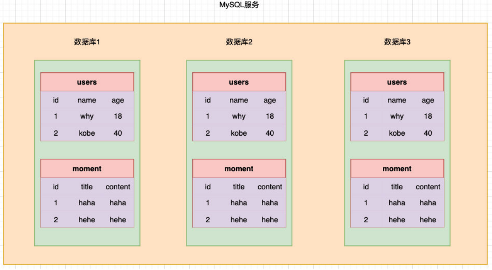
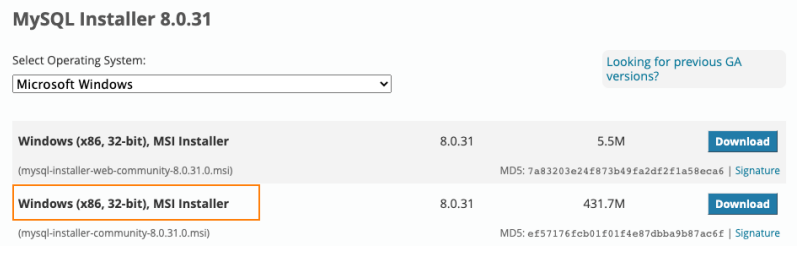
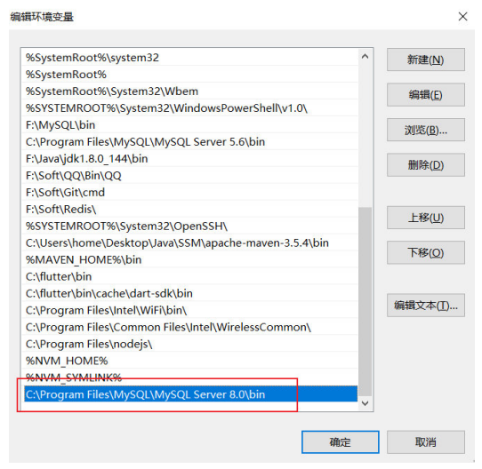
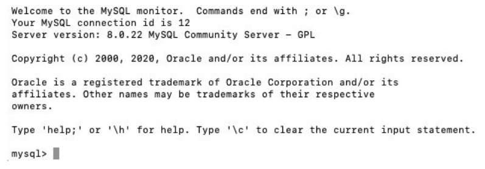
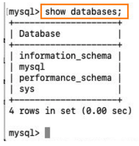
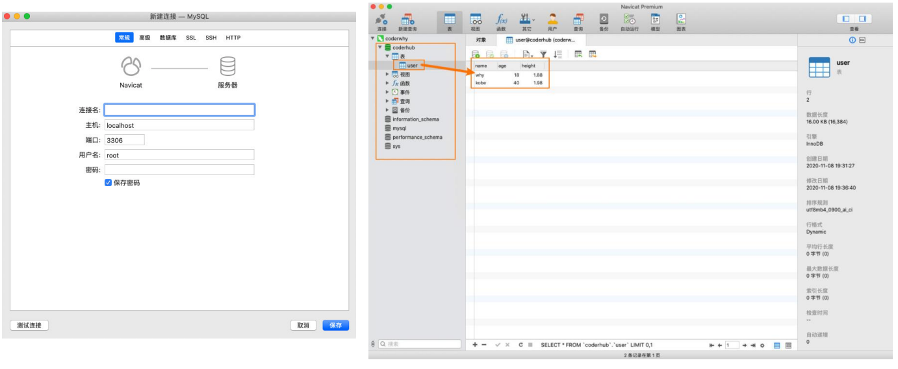
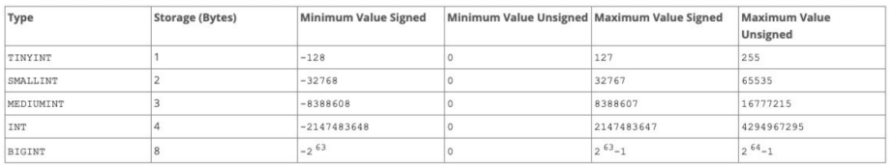

## 1、MySQL介绍和安装

### 1.1、为什么需要数据库？

任何的软件系统都需要存放大量的数据，这些数据通常是非常复杂和庞大的：

- 比如用户信息包括姓名、年龄、性别、地址、身份证号、出生日期等等；
- 比如商品信息包括商品的名称、描述、价格（原价）、分类标签、商品图片等等；
- 比如歌曲信息包括歌曲的名称、歌手、专辑、歌曲时长、歌词信息、封面图片等等；

那么这些信息不能直接存储到文件中吗？可以，但是文件系统有很多的缺点：

- 很难以合适的方式组织数据（多张表之前的关系合理组织）；
- 并且对数据进行增删改查中的复杂操作（虽然一些简单确实可以），并且保证单操作的原子性；
- 很难进行数据共享，比如一个数据库需要为多个程序服务，如何进行很好的数据共享；
- 需要考虑如何进行数据的高效备份、迁移、恢复；
- 等等...

数据库通俗来讲就是一个存储数据的仓库，数据库本质上就是一个软件、一个程序。

### 1.2、常见的数据库有哪些？

通常我们将数据划分成两类：关系型数据库和非关系型数据库；

关系型数据库：MySQL、Oracle、DB2、SQL Server、Postgre SQL等；

- 关系型数据库通常我们会创建很多个二维数据表；
- 数据表之间相互关联起来，形成一对一、一对多、多对多等关系；
- 之后可以利用SQL语句在多张表中查询我们所需的数据；

非关系型数据库：MongoDB、Redis、Memcached、HBse等；

- 非关系型数据库的英文其实是Not only SQL，也简称为NoSQL；
- 相当而言非关系型数据库比较简单一些，存储数据也会更加自由（甚至我们可以直接将一个复杂的json对象直接塞入到数据库中）；
- NoSQL是基于Key-Value的对应关系，并且查询的过程中不需要经过SQL解析；

如何在开发中选择他们呢？具体的选择会根据不同的项目进行综合的分析，我这里给一点点建议：

- 目前在公司进行后端开发（Node、Java、Go等），还是以关系型数据库为主；
- 比较常用的用到非关系型数据库的，在爬取大量的数据进行存储时，会比较常见；

### 1.3、认识MySQL

 我们的课程是开发自己的后端项目，所以我们以关系型数据库MySQL作为主要内容。

MySQL的介绍：

- MySQL原本是一个开源的数据库，原开发者为瑞典的MySQL AB公司；
- 在2008年被Sun公司收购；在2009年，Sun被Oracle收购；
- 所以目前MySQL归属于Oracle；

MySQL是一个关系型数据库，其实本质上就是一款软件、一个程序：

- 这个程序中管理着多个数据库；
- 每个数据库中可以有多张表；
- 每个表中可以有多条数据；

### 1.4、数据组织方式



### 1.5、下载MySQL软件

下载地址：https://dev.mysql.com/downloads/mysql/

根据自己的操作系统下载即可；

推荐大家直接下载安装版本，在安装过程中会配置一些环境变量；

- Windows推荐下载MSI的版本；
- Mac推荐下载DMG的版本；

这里我安装的是MySQL最新的版本：8.0.31（不再使用旧的MySQL5.x的版本）



### 1.6、Windows安装过程


### 1.7、启动MySQL


## 2、MySQL连接和GUI

### 2.1、MySQL的连接操作

打开终端，查看MySQL的安装：`mysql --version`



Mac添加环境变量 `export PATH=$PATH:/usr/local/mysql/bin`

### 2.2、终端连接数据库

我们如果想要操作数据，需要先和数据建立一个连接，最直接的方式就是通过终端来连接；

有两种方式来连接：

- 两种方式的区别在于输入密码是直接输入，还是另起一行以密文的形式输入；

- 方式一：`mysql -uroot -pCoderwhy888`
- 方式二：`mysql -uroot -p`   `Enter password: your password`



### 2.3、终端操作数据库

#### 2.3.1、显示数据库

我们说过，一个数据库软件中，可以包含很多个数据库，如何查看数据库？

- `show databases`



MySQL默认的数据库：

- information_schema：信息数据库，其中包括MySQL在维护的其他数据库、表、列、访问
  权限等信息；
- performance_schema：性能数据库，记录着MySQL Server数据库引擎在运行过程中的一
  些资源消耗相关的信息；
- mysql：用于存储数据库管理者的用户信息、权限信息以及一些日志信息等；
- sys：相当于是一个简易版的performance_schema，将性能数据库中的数据汇总成更容易
  理解的形式；

#### 2.3.2、创建数据库-表

在终端直接创建一个属于自己的新的数据库coderhub（一般情况下一个新的项目会对应一个新的数据库）。

- `create database coderhub;`

使用我们创建的数据库coderhub：`use coderhub;`

在数据中，创建一张表：

```sql
create table user(
	name varchar(20),
	age int,
	height double
);
# 插入数据
insert into user (name, age, height) values ('why', 18, 1.88); 
insert into user (name, age, height) values ('kobe', 40, 1.98);
```

### 2.4、GUI工具的介绍

我们会发现在终端操作数据库有很多不方便的地方：

- 语句写出来没有高亮，并且不会有任何的提示；
- 复杂的语句分成多行，格式看起来并不美观，很容易出现错误；
- 终端中查看所有的数据库或者表非常的不直观和不方便；
- 等等...

所以在开发中，我们可以借助于一些GUI工具来帮助我们连接上数据库，之后直接在GUI工具中操作就会非常方便。

常见的MySQL的GUI工具有很多，这里推荐几款：

- Navicat：个人最喜欢的一款工作，但是是收费的（有免费的试用时间）；
- SQLYog：一款免费的SQL工具；
- TablePlus：常用功能都可以使用，但是会多一些限制（比如只能开两个标签页）；

### 2.5、Navicat



## 3、SQL语句和数据类型

### 3.1、认识SQL语句

我们希望操作数据库（特别是在程序中），就需要有和数据库沟通的语言，这个语言就是SQL：

- SQL是Structured Query Language，称之为结构化查询语言，简称SQL；
- 使用SQL编写出来的语句，就称之为SQL语句；
- SQL语句可以用于对数据库进行操作；

事实上，常见的关系型数据库SQL语句都是比较相似的，所以你学会了MySQL中的SQL语句，之后去操作比如Oracle或者其他关系型数据库，也是非常方便的。

SQL语句的常用规范：

- 通常关键字使用大写的，比如CREATE、TABLE、SHOW等等；
- 一条语句结束后，需要以 ; 结尾；
- 如果遇到关键字作为表明或者字段名称，可以使用``包裹;

### 3.2、SQL语句的分类

常见的SQL语句我们可以分成四类：

- DDL（Data Definition Language）：数据定义语言；
  - 可以通过DDL语句对数据库或者表进行：创建、删除、修改等操作；
- DML（Data Manipulation Language）：数据操作语言；
  - 可以通过DML语句对表进行：添加、删除、修改等操作；
- DQL（Data Query Language）：数据查询语言；
  - 可以通过DQL从数据库中查询记录；（重点）
- DCL（Data Control Language）：数据控制语言；
  - 对数据库、表格的权限进行相关访问控制操作；

接下来我们对他们进行一个个的学习和掌握。

### 3.3、数据库的操作

- 查看当前数据库：

```sql
# 查看所有的数据
SHOW DATABASES;
# 使用某一个数据
USE coderhub;
# 查看当前正在使用的数据库
SELECT DATABASE();
```

- 创建新的数据库：

```sql
# 创建数据库语句
CREATE DATABASE bilibili;
CREATE DATABASE bilibili;
CREATE DATABASE IF NOT EXISTS bilibili
		DEFAULT CHARACTER SET utf8mb4 COLLATE utf8mb4_0900_ai_ci;
```

- 删除数据库：

```sql
# 删除数据库
DROP DATABASE bilibili;
DROP DATABASE IF EXIT bilibili;
```

-  修改数据库：

```sql
# 修改数据库的字符集和排序规则
ALTER DATABASE bilibili CHARACTER SET = utf8 COLLATE = utf8_unicode_ci;
```

- 查看数据表

```sql
# 查看所有的数据表
SHOW TABLES;
# 查看某一个表结构
DESC user;
```

- 创建数据表

```sql
CREATE TABLE IF NOT EXISTS `users`( 
	name VARCHAR(20),
	age INT,
	height DOUBLE
);
```

### 3.4、SQL的数据类型

#### 3.4.1、数字类型

我们知道不同的数据会划分为不同的数据类型，在数据库中也是一样：

- MySQL支持的数据类型有：数字类型，日期和时间类型，字符串（字符和字节）类型，空间类型和 JSON数据类型。

数字类型

- MySQL的数字类型有很多：
- 整数数字类型：INTEGER，INT，SMALLINT，TINYINT，MEDIUMINT，BIGINT；



- 浮点数字类型，DOUBLE（FLOAT是4个字节，DOUBLE是8个字节）；
- 精确数字类型：DECIMAL，NUMERIC（DECIMAL是NUMERIC的实现形式）；

#### 3.4.2、日期类型

 MySQL的日期类型也很多：

- YEAR以YYYY格式显示值
  - 范围 1901到2155，和 0000。
- DATE类型用于具有日期部分但没有时间部分的值：
  - DATE以格式YYYY-MM-DD显示值 ；
  - 支持的范围是 '1000-01-01' 到 '9999-12-31'；
- DATETIME类型用于包含日期和时间部分的值：
  - DATETIME以格式'YYYY-MM-DD hh:mm:ss'显示值；
  - 支持的范围是1000-01-01 00:00:00到9999-12-31 23:59:59;
- TIMESTAMP数据类型被用于同时包含日期和时间部分的值：
  - TIMESTAMP以格式'YYYY-MM-DD hh:mm:ss'显示值；
  - 但是它的范围是UTC的时间范围：'1970-01-01 00:00:01'到'2038-01-19 03:14:07';
- 另外：DATETIME或TIMESTAMP 值可以包括在高达微秒（6位）精度的后小数秒一部分（了解）
  - 比如DATETIME表示的范围可以是'1000-01-01 00:00:00.000000'到'9999-12-31 23:59:59.999999';

#### 3.4.3、字符串类型

MySQL的字符串类型表示方式如下：

- CHAR类型在创建表时为固定长度，长度可以是0到255之间的任何值；
  - 在被查询时，会删除后面的空格；
- VARCHAR类型的值是可变长度的字符串，长度可以指定为0到65535之间的值；
  - 在被查询时，不会删除后面的空格；
- BINARY和VARBINARY 类型用于存储二进制字符串，存储的是字节字符串；
  - https://dev.mysql.com/doc/refman/8.0/en/binary-varbinary.html
- BLOB用于存储大的二进制类型；
- TEXT用于存储大的字符串类型；

### 3.5、表约束

- 主键：PRIMARY KEY
  - 一张表中，我们为了区分每一条记录的唯一性，必须有一个字段是永远不会重复，并且不会为空的，这个字段我们通常会将它设置为主键：
    - 主键是表中唯一的索引；
    - 并且必须是NOT NULL的，如果没有设置 NOT NULL，那么MySQL也会隐式的设置为NOT NULL；
    - 主键也可以是多列索引，PRIMARY KEY(key_part, ...)，我们一般称之为联合主键；
    - 建议：开发中主键字段应该是和业务无关的，尽量不要使用业务字段来作为主键；
- 唯一：UNIQUE
  - 某些字段在开发中我们希望是唯一的，不会重复的，比如手机号码、身份证号码等，这个字段我们可以使用UNIQUE来约束：
  - 使用UNIQUE约束的字段在表中必须是不同的；
  - UNIQUE 索引允许NULL包含的列具有多个值NULL；
- 不能为空：NOT NULL
  - 某些字段我们要求用户必须插入值，不可以为空，这个时候我们可以使用 NOT NULL 来约束；
- 默认值：DEFAULT
  - 某些字段我们希望在没有设置值时给予一个默认值，这个时候我们可以使用 DEFAULT来完成；
- 自动递增：AUTO_INCREMENT
  - 某些字段我们希望不设置值时可以进行递增，比如用户的id，这个时候可以使用AUTO_INCREMENT来完成；
- 外键约束也是最常用的一种约束手段，我们再讲到多表关系时，再进行讲解；

## 4、SQL语句-DDL语句

### 4.1、创建一个完整的表

创建数据表

```sql
# 创建一张表
CREATE TABLE IF NOT EXISTS `users` (
    id INT PRIMARY KEY AUTO_INCREMENT,
    name VARCHAR(20) NOT NULL ,
    age INT DEFAULT 0,
    telPhone VARCHAR(20) DEFAULT '' UNIQUE NOT NULL
)
```

 删除数据表

```sql
DROP TABLE users;
DROP TABLE IF EXISTS users;
```

### 4.2、修改表

如果我们希望对表中某一个字段进行修改：

```sql
# 1.修改表名
ALTER TABLE `moments` RENAME TO `moment`;
# 2.添加一个新的列
ALTER TABLE `moment` ADD `publishTime` DATETIME;
ALTER TABLE `moment` ADD `updateTime` DATETIME;
# 3.删除一列数据
ALTER TABLE `moment` DROP `updateTime`;
# 4.修改列的名称
ALTER TABLE `moment` CHANGE `publishTime` `publishDate` DATE; 
# 5.修改列的数据类型
ALTER TABLE `moment` MODIFY `id` INT;
```

## 5、SQL语句-DML语句

### 5.1、创建新表-删除操作

DML：Data Manipulation Language（数据操作语言）

创建一张新的表

```sql
CREATE TABLE IF NOT EXISTS `products`(
    `id` INT PRIMARY KEY AUTO_INCREMENT,
    `title` VARCHAR(20),
    `description` VARCHAR(200),
    `price` DOUBLE,
    `publishTime` DATETIME
);
```

插入数据：

```sql
INSERT INTO `products` (`title`, `description`, `price`, `publishTime`)
VALUES ('iPhone', 'iPhone12只要998', 998.88, '2020-10-10');
INSERT INTO `products` (`title`, `description`, `price`, `publishTime`)
VALUES ('huawei', 'iPhoneP40只要888', 888.88, '2020-11-11');
```

### 5.2、删除操作-更新操作

删除数据：

```sql
# 删除数据
# 会删除表中所有的数据
DELETE FROM `products`;
# 会删除符合条件的数据
DELETE FROM `products` WHERE `title` = 'iPhone';
```

修改数据：

```sql
# 修改数据
# 会修改表中所有的数据
UPDATE `products`  SET `title` = 'iPhone12', `price` = 1299.88;
# 会修改符合条件的数据
UPDATE `products`  SET `title` = 'iPhone12', `price` = 1299.88 WHERE `title` = 'iPhone';
```

如果我们希望修改完数据后，直接可以显示最新的更新时间：

```sql
ALTER TABLE `products`
    ADD `updateTime` TIMESTAMP DEFAULT CURRENT_TIMESTAMP ON UPDATE CURRENT_TIMESTAMP; 
```

## 6、SQL语句-DQL语句

### 6.1、DQL语句

DQL：Data Query Language（数据查询语言）

- SELECT用于从一个或者多个表中检索选中的行（Record）。

查询的格式如下：

`SELECT select_expr [, select_expr]...
[FROM table_references]
[WHERE where_condition]
[ORDER BY expr [ASC | DESC]]
[LIMIT {[offset,] row_count | row_count OFFSET offset}] 
[GROUP BY expr]
[HAVING where_condition]`

**准备数据：**

 准备一张表：

```sql
CREATE TABLE IF NOT EXISTS `products`
(
    id      INT PRIMARY KEY AUTO_INCREMENT,
    brand   VARCHAR(20),
    title   VARCHAR(100) NOT NULL,
    price   DOUBLE       NOT NULL,
    score   DECIMAL(2, 1),
    voteCnt INT,
    url     VARCHAR(100),
    pid     INT
);
```

### 6.2、基本查询

查询所有的数据并且显示所有的字段：

- `SELECT * FROM products;`

查询title、brand、price：

- `SELECT title, brand, price FROM products;`

我们也可以给字段起别名：

- 别名一般在多张表或者给客户端返回对应的key时会使用到；
- `SELECT title as t, brand as b, price as p FROM products;`

### 6.3、where查询条件

在开发中，我们希望根据条件来筛选我们的数据，这个时候我们要使用条件查询：

- 条件查询会使用 WEHRE查询子句；

WHERE的比较运算符

```sql
# 查询价格小于1000的手机
SELECT * FROM products WHERE price < 1000;
# 查询价格大于等于2000的手机
SELECT * FROM products WHERE price >= 2000;
# 价格等于3399的手机
SELECT * FROM products WHERE price = 3399;
# 价格不等于3399的手机
SELECT * FROM products WHERE price != 3399;
# 查询华为品牌的手机
SELECT * FROM products WHERE brand = '华为';
```

WHERE的逻辑运算符

```sql
# 查询品牌是华为，并且小于2000元的手机
SELECT * FROM products WHERE brand = '华为' and price < 2000; 
SELECT * FROM products WHERE brand = '华为' && price < 2000;
# 查询1000到2000的手机（不包含1000和2000）
SELECT * FROM products WHERE price > 1000 and price < 2000;
# OR: 符合一个条件即可
# 查询所有的华为手机或者价格小于1000的手机
SELECT * FROM products WHERE brand = '华为' or price < 1000;
# 查询1000到2000的手机（包含1000和2000）
SELECT * FROM products WHERE price BETWEEN 1000 and 2000;
# 查看多个结果中的一个
SELECT * FROM products WHERE brand in ('华为', '小米');
```

模糊查询使用LIKE关键字，结合两个特殊的符号：

- %表示匹配任意个的任意字符；
- _表示匹配一个的任意字符；

```sql
# 查询所有以v开头的title
SELECT * FROM products WHERE title LIKE 'v%';
# 查询带M的title
SELECT * FROM products WHERE title LIKE '%M%'; 
# 查询带M的title必须是第三个字符
SELECT * FROM products WHERE title LIKE '__M%';
```

### 6.4、查询结果排序

当我们查询到结果的时候，我们希望讲结果按照某种方式进行排序，这个时候使用的是ORDER BY；

ORDER BY有两个常用的值：

- ASC：升序排列；
- DESC：降序排列；

`SELECT * FROM products WHERE brand = '华为' or price < 1000 ORDER BY price ASC;`

### 6.5、分页查询

当数据库中的数据非常多时，一次性查询到所有的结果进行显示是不太现实的：

- 在真实开发中，我们都会要求用户传入offset、limit或者page等字段；
- 它们的目的是让我们可以在数据库中进行分页查询；
- 它的用法有`[LIMIT {[offset,] row_count | row_count OFFSET offset}]`

```sql
SELECT * FROM products LIMIT 30 OFFSET 0; 
SELECT * FROM products LIMIT 30 OFFSET 30; 
SELECT * FROM products LIMIT 30 OFFSET 60; 
# 另外一种写法：offset, row_count
SELECT * FROM products LIMIT 90, 30;
```


