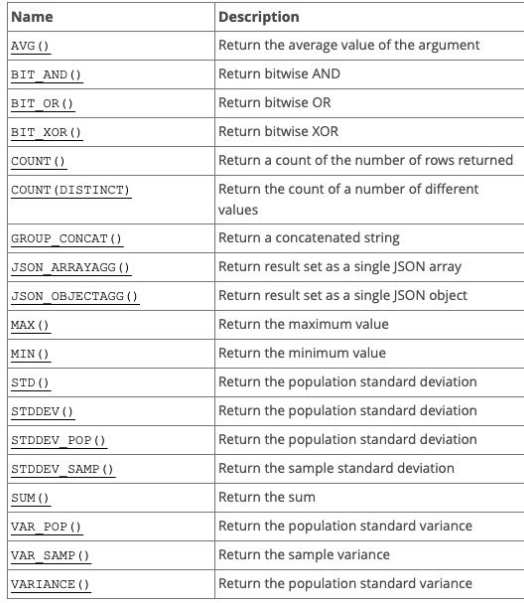
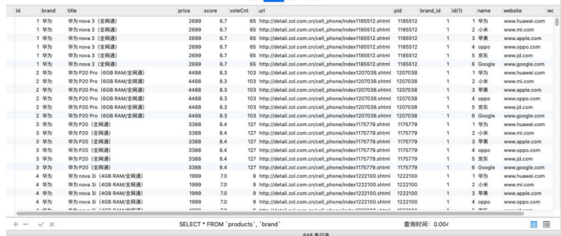
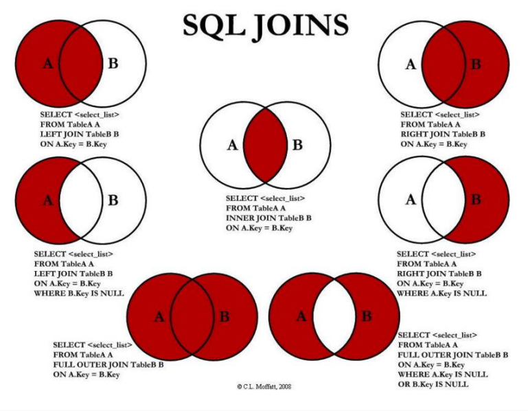
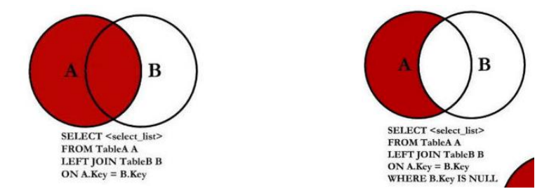
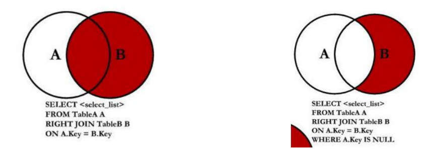
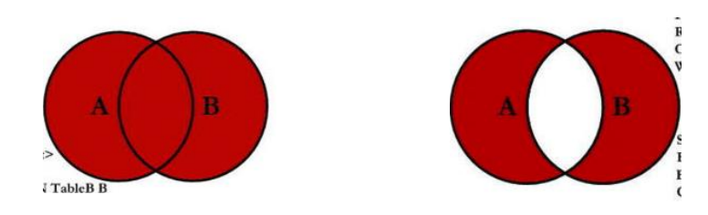

## 1、MySQL的聚合函数

### 1.1、聚合函数

聚合函数表示对 值的集合 进行操作的 组（集合）函数。

```sql
# 华为手机价格的平均值
SELECT AVG(price) FROM products WHERE brand = '华为';
# 计算所有手机的平均分
SELECT AVG(score) FROM products;
# 手机中最低和最高分数
SELECT MAX(score) FROM products;
SELECT MIN(score) FROM products;
# 计算总投票人数
SELECT SUM(voteCnt) FROM products;
# 计算所有条目的数量
SELECT COUNT(*) FROM products;
# 华为手机的个数
SELECT COUNT(*) FROM `products` WHERE brand = '华为';
```



### 1.2、认识Group By

事实上聚合函数相当于默认将所有的数据分成了一组：

- 我们前面使用avg还是max等，都是将所有的结果看成一组来计算的；
- 那么如果我们希望划分多个组：比如华为、苹果、小米等手机分别的平均价格，应该怎么来做呢？
- 这个时候我们可以使用 GROUP BY；

GROUP BY通常和聚合函数一起使用：

- 表示我们先对数据进行分组，再对每一组数据，进行聚合函数的计算；

我们现在来提一个需求：

- 根据品牌进行分组；
- 计算各个品牌中：商品的个数、平均价格，也包括：最高价格、最低价格、平均评分；

```sql
SELECT brand,
       COUNT(*)             as count,
       ROUND(AVG(price), 2) as avgPrice,
       MAX(price)           as maxPrice,
       MIN(price)           as minPrice,
       AVG(score)           as avgScore
FROM products
GROUP BY brand;
```

### 1.3、Group By的约束条件

如果我们希望给Group By查询到的结果添加一些约束，那么我们可以使用：HAVING。

比如：如果我们还希望筛选出平均价格在4000以下，并且平均分在7以上的品牌：

```sql
SELECT brand,
       COUNT(*)             as count,
       ROUND(AVG(price), 2) as avgPrice,
       MAX(price)           as maxPrice,
       MIN(price)           as minPrice,
       AVG(score)           as avgScore
FROM `products`
GROUP BY brand
HAVING avgPrice < 4000
   and avgScore > 7;
```

## 2、MySQL的外键约束

**创建多张表**

假如我们的上面的商品表中，对应的品牌还需要包含其他的信息：

- 比如品牌的官网，品牌的世界排名，品牌的市值等等；

如果我们直接在商品中去体现品牌相关的信息，会存在一些问题：

- 一方面，products表中应该表示的都是商品相关的数据，应该又另外一张表来表示brand的数据；
- 另一方面，多个商品使用的品牌是一致时，会存在大量的冗余数据；

所以，我们可以将所有的品牌数据，单独放到一张表中，创建一张品牌的表：

```sql
CREATE TABLE IF NOT EXISTS brand
(
    id        INT PRIMARY KEY AUTO_INCREMENT,
    name      VARCHAR(20) NOT NULL,
    website   VARCHAR(100),
    worldRank INT
);
```

**插入模拟数据**

- 这里我是刻意有一些商品数据的品牌是没有添加的；
- 并且也可以添加了一些不存在的手机品牌；

```sql
INSERT INTO brand (name, website, worldRank) VALUES ('华为', 'www.huawei.com', 1);
INSERT INTO brand (name, website, worldRank) VALUES ('小米', 'www.mi.com', 10);
INSERT INTO brand (name, website, worldRank) VALUES ('苹果', 'www.apple.com', 5);
INSERT INTO brand (name, website, worldRank) VALUES ('oppo', 'www.oppo.com', 15);
INSERT INTO brand (name, website, worldRank) VALUES ('京东', 'www.jd.com', 3);
INSERT INTO brand (name, website, worldRank) VALUES ('Google', 'www.google.com', 8);
```

### 2.1、创建外键

将两张表联系起来，我们可以将products中的brand_id关联到brand中的id：

- 如果是创建表添加外键约束，我们需要在创建表的()最后添加如下语句；

```sql
FOREIGN KEY (brand_id) REFERENCES brand (id)
```

- 如果是表已经创建好，额外添加外键：

```sql
ALTER TABLE products ADD brand_id INT;
ALTER TABLE products ADD FOREIGN KEY (brand_id) REFERENCES brand(id);
```

现在我们可以将products中的brand_id关联到brand中的id的值：

```sql
UPDATE products SET brand_id = 1 WHERE brand = '华为';
UPDATE products SET brand_id = 4 WHERE brand = 'OPPO';
UPDATE products SET brand_id = 3 WHERE brand = '苹果';
UPDATE products SET brand_id = 2 WHERE brand = '小米';
```

### 2.2、外键存在时更新和删除数据

我们来思考一个问题：

- 如果products中引用的外键被更新了或者删除了，这个时候会出现什么情况呢？

我们来进行一个更新操作：比如将华为的id更新为100

- `UPDATE brand SET id = 100 WHERE id = 1;`

这个时候执行代码是报错的

如果我希望可以更新呢？我们需要修改on delete或者on update的值；

我们可以给更新或者删除时设置几个值：

- RESTRICT（默认属性）：当更新或删除某个记录时，会检查该记录是否有关联的外键记录，有的话会报错的，不允许更新或删除；
- NO ACTION：和RESTRICT是一致的，是在SQL标准中定义的；
- CASCADE：当更新或删除某个记录时，会检查该记录是否有关联的外键记录，有的话：
  - 更新：那么会更新对应的记录；
  - 删除：那么关联的记录会被一起删除掉；
- SET NULL：当更新或删除某个记录时，会检查该记录是否有关联的外键记录，有的话，将对应的值设置为NULL；

```sql
SHOW CREATE TABLE products;
ALTER TABLE products
    DROP FOREIGN KEY products_ibfk_1;
ALTER TABLE products
    ADD FOREIGN KEY (brand_id) REFERENCES brand (id)
        ON UPDATE CASCADE
        ON DELETE CASCADE;
```

## 3、MySQL的多表查询

### 3.1、什么是多表查询？

如果我们希望查询到产品的同时，显示对应的品牌相关的信息，因为数据是存放在两张表中，所以这个时候就需要进行多表查询。

如果我们直接通过查询语句希望在多张表中查询到数据，这个时候是什么效果呢？

```sql
SELECT * FROM products, brand;
```



### 3.2、默认多表查询的结果

我们会发现一共有648条数据，这个数据量是如何得到的呢？

- 第一张表的108条 * 第二张表的6条数据；
- 也就是说第一张表中每一个条数据，都会和第二张表中的每一条数据结合一次；
- 这个结果我们称之为 笛卡尔乘积，也称之为直积，表示为 X*Y；

但是事实上很多的数据是没有意义的，比如华为和苹果、小米的品牌结合起来的数据就是没有意义的，我们可不可以进行筛选呢？

- 使用where来进行筛选；
- 这个表示查询到笛卡尔乘积后的结果中，符合products.brand_id = brand.id条件的数据过滤出来；

```sql
SELECT * FROM products, brand WHERE products.brand_id = brand.id;
```

## 4、表和表间的连接方式

### 4.1、多表之间的连接

事实上我们想要的效果并不是这样的，而且表中的某些特定的数据，这个时候我们可以使用 SQL JOIN 操作：

- 左连接
- 右连接
- 内连接
- 全连接



### 4.2、左连接

如果我们希望获取到的是左边所有的数据（以左表为主）：

- 这个时候就表示无论左边的表是否有对应的brand_id的值对应右边表的id，左边的数据都会被查询出来；
- 这个也是开发中使用最多的情况，它的完整写法是LEFT [OUTER] JOIN，但是OUTER可以省略的；



```sql
SELECT *
FROM products
         LEFT JOIN brand ON products.brand_id = brand.id;

SELECT *
FROM products
         LEFT JOIN brand ON products.brand_id = brand.id
WHERE brand.id IS NULL;
```

### 4.3、右连接

如果我们希望获取到的是右边所有的数据（以由表为主）：

- 这个时候就表示无论左边的表中的brand_id是否有和右边表中的id对应，右边的数据都会被查询出来；
- 右连接在开发中没有左连接常用，它的完整写法是RIGHT [OUTER] JOIN，但是OUTER可以省略的；



```sql
SELECT *
FROM products
         RIGHT JOIN brand ON products.brand_id = brand.id;

SELECT *
FROM products
         RIGHT JOIN brand ON products.brand_id = brand.id
WHERE products.id IS NULL;
```

### 4.4、内连接

事实上内连接是表示左边的表和右边的表都有对应的数据关联：

- 内连接在开发中偶尔也会有一些场景使用，看自己的场景。
- 内连接有其他的写法：CROSS JOIN或者 JOIN都可以

```sql
SELECT *
FROM products
         INNER JOIN brand ON products.brand_id = brand.id;
```

我们会发现它和之前的下面写法是一样的效果：

```sql
SELECT *
FROM products,
     brand
WHERE products.brand_id = brand.id;
```

但是他们代表的含义并不相同：

- SQL语句一：内连接，代表的是在两张表连接时就会约束数据之间的关系，来决定之后查询的结果；
- SQL语句二：where条件，代表的是先计算出笛卡尔乘积，在笛卡尔乘积的数据基础之上进行where条件的帅选；

### 4.5、全连接

 SQL规范中全连接是使用FULL JOIN，但是MySQL中并没有对它的支持，我们需要使用 UNION 来实现：



```sql
(SELECT *
 FROM products
          LEFT JOIN brand ON products.brand_id = brand.id)
UNION
(SELECT *
 FROM products
          RIGHT JOIN brand ON products.brand_id = brand.id);

(SELECT *
 FROM products
          LEFT JOIN brand ON products.brand_id = brand.id
 WHERE `brand`.id IS NULL)
UNION
(SELECT *
 FROM products
          RIGHT JOIN brand ON products.brand_id = brand.id
 WHERE products.id IS NULL);
```

## 5、多对多关系的关系表

**多对多关系数据准备**

在开发中我们还会遇到多对多的关系：

- 比如学生可以选择多门课程，一个课程可以被多个学生选择；
- 这种情况我们应该在开发中如何处理呢？

我们先建立好两张表

```sql
# 创建学生表
CREATE TABLE IF NOT EXISTS students
(
    id   INT PRIMARY KEY AUTO_INCREMENT,
    name VARCHAR(20) NOT NULL,
    age  INT
);

# 创建课程表
CREATE TABLE IF NOT EXISTS courses
(
    id    INT PRIMARY KEY AUTO_INCREMENT,
    name  VARCHAR(20) NOT NULL,
    price DOUBLE      NOT NULL
);

INSERT INTO students (name, age)
VALUES ('why', 18);
INSERT INTO students (name, age)
VALUES ('tom', 22);
INSERT INTO students (name, age)
VALUES ('lilei', 25);
INSERT INTO students (name, age)
VALUES ('lucy', 16);
INSERT INTO students (name, age)
VALUES ('lily', 20);
INSERT INTO courses (name, price)
VALUES ('英语', 100);
INSERT INTO courses (name, price)
VALUES ('语文', 666);
INSERT INTO courses (name, price)
VALUES ('数学', 888);
INSERT INTO courses (name, price)
VALUES ('历史', 80);
```

**创建关系表**

我们需要一个关系表来记录两张表中的数据关系：

```sql
# 创建关系表
CREATE TABLE IF NOT EXISTS students_select_courses
(
    id         INT PRIMARY KEY AUTO_INCREMENT,
    student_id INT NOT NULL,
    course_id  INT NOT NULL,
    FOREIGN KEY (student_id) REFERENCES students (id) ON UPDATE CASCADE,
    FOREIGN KEY (course_id) REFERENCES courses (id) ON UPDATE CASCADE
);

# why 选修了 英文和数学
INSERT INTO students_select_courses (student_id, course_id)
VALUES (1, 1);
INSERT INTO students_select_courses (student_id, course_id)
VALUES (1, 3);
# lilei选修了 语文和数学和历史
INSERT INTO students_select_courses (student_id, course_id)
VALUES (3, 2);
INSERT INTO students_select_courses (student_id, course_id)
VALUES (3, 3);
INSERT INTO students_select_courses (student_id, course_id)
VALUES (3, 4);
```

## 6、多对多数据查询语句

 查询多条数据：

```sql
# 查询所有的有选课学生选择的所有课程
SELECT stu.id   studentId,
       stu.name studentName,
       cs.id    courseId,
       cs.name  courseName,
       cs.price coursePrice
FROM students stu
         JOIN students_select_courses ssc
              ON stu.id = ssc.student_id
         JOIN courses cs
              ON ssc.course_id = cs.id;

# 查询所有的学生选课情况
SELECT stu.id   studentId,
       stu.name studentName,
       cs.id    courseId,
       cs.name  courseName,
       cs.price coursePrice
FROM students stu
         LEFT JOIN students_select_courses ssc
                   ON stu.id = ssc.student_id
         LEFT JOIN courses cs
                   ON ssc.course_id = cs.id;
```

 查询单个学生的课程：

```sql
# why同学选择了哪些课程
SELECT stu.id   studentId,
       stu.name studentName,
       cs.id    courseId,
       cs.name  courseName,
       cs.price coursePrice
FROM students stu
         JOIN students_select_courses ssc
              ON stu.id = ssc.student_id
         JOIN courses cs
              ON ssc.course_id = cs.id
WHERE stu.id = 1;

# lily同学选择了哪些课程(注意，这里必须用左连接，事实上上面也应该使用的是左连接)
SELECT stu.id   studentId,
       stu.name studentName,
       cs.id    courseId,
       cs.name  courseName,
       cs.price coursePrice
FROM students stu
         LEFT JOIN students_select_courses ssc
                   ON stu.id = ssc.student_id
         LEFT JOIN courses cs
                   ON ssc.course_id = cs.id
WHERE stu.id = 5;
```

查询哪些学生没有选择和哪些课程没有被选择：

```sql
# 哪些学生是没有选课的
SELECT stu.id   studentId,
       stu.name studentName,
       cs.id    courseId,
       cs.name  courseName,
       cs.price coursePrice
FROM students stu
         LEFT JOIN students_select_courses ssc
                   ON stu.id = ssc.student_id
         LEFT JOIN courses cs
                   ON ssc.course_id = cs.id
WHERE cs.id IS NULL;

# 查询哪些课程没有被学生选择
SELECT stu.id   studentId,
       stu.name studentName,
       cs.id    courseId,
       cs.name  courseName,
       cs.price coursePrice
FROM students stu
         RIGHT JOIN students_select_courses ssc
                    ON stu.id = ssc.student_id
         RIGHT JOIN courses cs
                    ON ssc.course_id = cs.id
WHERE stu.id IS NULL;
```


