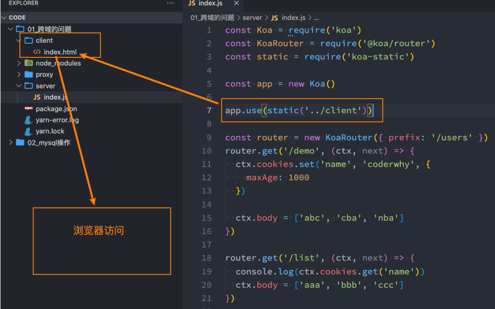

## 1.什么是跨域？

要想理解跨域，要先理解浏览器的同源策略：

- 同源策略是一个重要的安全策略，它用于限制一个origin的文档或者它加载的脚本如何能与另一个源的资源进行交互。它能帮助阻隔恶意文档，减少可能被攻击的媒介。
- 如果两个 URL 的 protocol、port (en-US) (如果有指定的话) 和 host都相同的话，则这两个 URL 是同源。
- 这个方案也被称为“协议/主机/端口元组”，或者直接是“元组”。

事实上跨域的产生和前端分离的发展有很大的关系：

- 早期的服务器端渲染的时候，是没有跨域的问题的；
- 但是随着前后端的分离，目前前端开发的代码和服务器开发的API接口往往是分离的，甚至部署在不同的服务器上的；

这个时候我们就会发现，访问静态资源服务器和API接口服务器 很有可能不是同一个服务器或者不是同一个端口。浏览器发现静态资源和API接口（XHR、Fetch）请求不是来自同一个地方时（同源策略），就产生了跨域。所以，在静态资源服务器和API服务器（其他资源类同）是同一台服务器时，是没有跨域问题的。

**跨域和不跨域的不同访问策略**



## 2.跨域的解决方案总结

 那么跨域问题如何解决呢？

- 所以跨域的解决方案几乎都和服务器有关系，单独的前端基本解决不了跨域（虽然网上也能看到各种方案，都是实际开发基本不会使用）。
- webpack配置的本质也是在webpack-server的服务器中配置了代理。

跨域常见的解决方案：

- 方案一：静态资源和API服务器部署在同一个服务器中；
- 方案二：CORS， 即是指跨域资源共享；
- 方案三：node代理服务器（webpack中就是它）；
- 方案四：Nginx反向代理；

不常见的方案：

- jsonp：现在很少使用了（曾经流行过一段时间）；
- postMessage：有兴趣了解一下吧；
- websocket：为了解决跨域，所有的接口都变成socket通信？
- …..

**前端请求代码**

```html
<!DOCTYPE html>
<html lang="en">
  <head>
    <meta charset="UTF-8" />
    <meta http-equiv="X-UA-Compatible" content="IE=edge" />
    <meta name="viewport" content="width=device-width, initial-scale=1.0" />
    <title>网易云音乐</title>
  </head>
  <body>
    <h1>网易云音乐项目</h1>

    <script>
      // 1.XHR网络请求
      const xhr = new XMLHttpRequest();
      xhr.onreadystatechange = function () {
        if (xhr.readyState === XMLHttpRequest.DONE) {
          console.log(JSON.parse(xhr.responseText));
        }
      };
      xhr.open("get", "http://localhost:9000/api/users/list");
      xhr.send();

      // 2.fetch网络请求
      fetch("http://localhost:9000/api/users/list").then(async (res) => {
        const result = await res.json();
        console.log(result);
      });
    </script>
  </body>
</html>
```

## 3.跨域解决方案 - CORS

- 跨域资源共享(CORS， Cross-Origin Resource Sharing跨域资源共享）：
  - 它是一种基于http header的机制；
  - 该机制通过允许服务器标示除了它自己以外的其它源（域、协议和端口），使得浏览器允许这些 origin 访问加载自己的资源。

浏览器将 CORS 请求分成两类：简单请求和非简单请求。只要同时满足以下两大条件，就属于简单请求（不满足就属于非简单请求）。

- 请求方法是以下是三种方法之一：
  - HEAD
  - GET
  - POST

- HTTP 的头信息不超出以下几种字段：
  - Accept
  - Accept-Language
  - Content-Language
  - Last-Event-ID
  - Content-Type：只限于三个值 application/x-www-form-urlencoded、multipart/form-data、text/plain

```js
app.use(async (ctx, next) => {
  // 1.允许简单请求开启CORS
  ctx.set("Access-Control-Allow-Origin", "*")
  // 2.非简单请求开启下面的设置
  ctx.set("Access-Control-Allow-Headers", "Accept, AcceptEncoding, Connection, Host, Origin")
  ctx.set("Access-Control-Allow-Credentials", true) // cookie
  ctx.set("Access-Control-Allow-Methods", "PUT, POST, GET, DELETE, PATCH, OPTIONS")
  // 3.发起的是一个options请求
  if (ctx.method === 'OPTIONS') {
    ctx.status = 204
  } else {
    await next()
  }
})
```

## 4.跨域解决方案 – Node代理服务器

Node代理服务器是平时开发中前端配置最多的一种方案。

```js
// node服务器代理
// webpack => webpack-dev-server
const express = require("express");
const { createProxyMiddleware } = require("http-proxy-middleware");

const app = express();

app.use(express.static("./client"));

app.use(
  "/api",
  createProxyMiddleware({
    target: "http://localhost:8000",
    pathRewrite: {
      "^/api": "",
    },
  })
);

app.listen(9000, () => {
  console.log("express proxy服务器开启成功");
});
```

## 5.跨域解决方案四 – Nginx反向代理

 Nginx反向代理

- 下载Nginx地址：https://nginx.org/en/download.html

```nginx
location / {
  # root  html;
  # index  index.html index.htm;
  add_header Access-Control-Allow-Origin *
  add_header Access-Control-Allow-Headers "Accept,Accept-Encoding,Accept-Language,Connection,Content-Length,Content-Type,Host,Origin,Referer,User-Agent";
  add_header Access-Control-Allow-Methods "GET,POST,PUT,OPTIONS";
  add_header Access-Control-Allow-Credentials true;
  if (Srequest_method ='OPTIONS'){
    return 204;
  }

  proxy_pass http://localhost:8000;
}

```


