## 1.webpack配置

### 1.1.Webpack是什么？

**官方的解释：** webpack是一个静态的模块化打包工具，为现代的JavaScript应用程序；

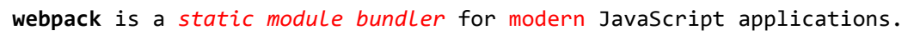

- 打包bundler：webpack可以将帮助我们进行打包，所以它是一个打包工具
- 静态的static：这样表述的原因是我们最终可以将代码打包成最终的静态资源（部署到静态服务器）；
- 模块化module：webpack默认支持各种模块化开发，ES Module、CommonJS、AMD等；
- 现代的modern：我们前端说过，正是因为现代前端开发面临各种各样的问题，才催生了webpack的出现和发展；

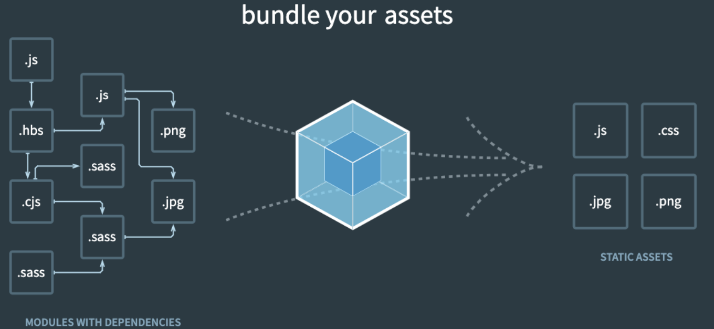

### 1.2.webpack基本打包

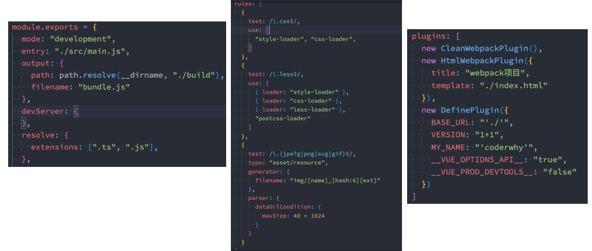


## 2.webpack的mode

### 2.1.Mode配置

Mode配置选项，可以告知webpack使用相应模式的内置优化：

- 默认值是production（什么都不设置的情况下）；
- 可选值有：'none' | 'development' | 'production'；

这几个选项有什么样的区别呢?

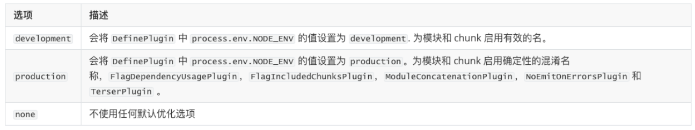

### 2.2.Mode配置代表更多

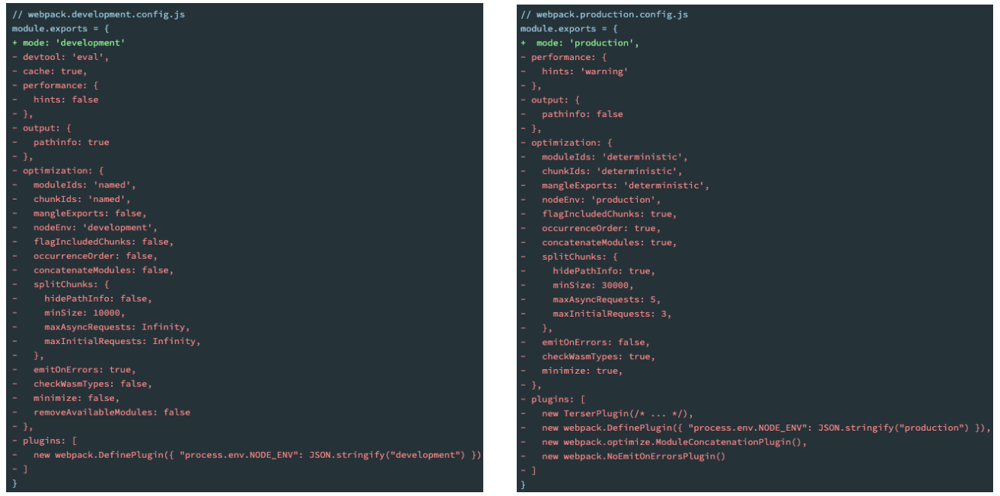


## 3.source-map

### 3.1.认识source-map

我们的代码通常运行在浏览器上时，是通过打包压缩的：

- 也就是真实跑在浏览器上的代码，和我们编写的代码其实是有差异的；
- 比如ES6的代码可能被转换成ES5；
- 比如对应的代码行号、列号在经过编译后肯定会不一致；
- 比如代码进行丑化压缩时，会将编码名称等修改；
- 比如我们使用了TypeScript等方式编写的代码，最终转换成JavaScript；

但是，当代码报错需要调试时（debug），调试转换后的代码是很困难的

那么如何可以调试这种转换后不一致的代码呢？答案就是source-map 

- source-map是从已转换的代码，映射到原始的源文件；
- 使浏览器可以重构原始源并在调试器中显示重建的原始源；

### 3.2.使用source-map

 如何可以使用source-map？

- 第一步：根据源文件，生成source-map文件，webpack在打包时，可以通过配置生成source-map；
- 第二步：在转换后的代码，最后添加一个注释，它指向sourcemap；

```js
//# sourceMappingURL=common.bundle.js.map
```

浏览器会根据我们的注释，查找相应的source-map，并且根据source-map还原我们的代码，方便进行调试。

- 在Chrome中，我们可以按照如下的方式打开source-map：

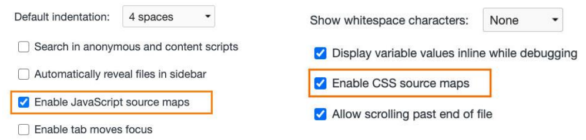

## 4.source-map解析

### 4.1.分析source-map

最初source-map生成的文件大小是原始文件的10倍，第二版减少了约50%，第三版又减少了50%，所以目前一个133kb的文件，最终的source-map的大小大概在300kb。

**目前的source-map长什么样子呢？**

- version：当前使用的版本，也就是最新的第三版；
- sources：从哪些文件转换过来的source-map和打包的代码（最初始的文件）；
- names：转换前的变量和属性名称（因为我目前使用的是development模式，所以不需要保留转换前的名称）；
- mappings：source-map用来和源文件映射的信息（比如位置信息等），一串base64 VLQ（veriable-length quantity可变长度值）编码；
- file：打包后的文件（浏览器加载的文件）；
- sourceContent：转换前的具体代码信息（和sources是对应的关系）；
- sourceRoot：所有的sources相对的根目录；

**source-map文件**

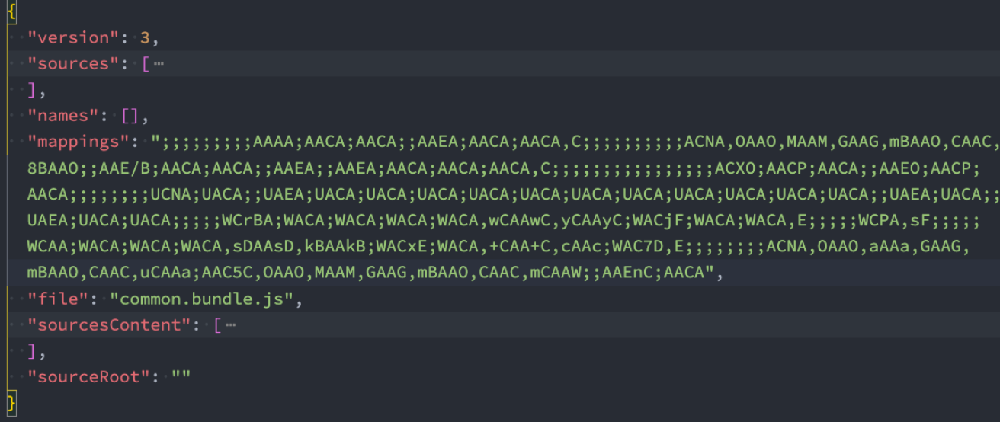

### 4.2.生成source-map

如何在使用webpack打包的时候，生成对应的source-map呢？

- webpack为我们提供了非常多的选项（目前是26个），来处理source-map；
- https://webpack.docschina.org/configuration/devtool/
- 选择不同值，生成的source-map会稍微有差异，打包的过程也会有性能差异，可以根据不同的情况选择；

下面几个值不会生成source-map

- false：不使用source-map，也就是没有任何和source-map相关的内容。
- none：production模式下的默认值（什么值都不写） ，不生成source-map。
- eval：development模式下的默认值，不生成source-map
  - 但是它会在eval执行的代码中，添加 //# sourceURL=；
  - 它会被浏览器在执行时解析，并且在调试面板中生成对应的一些文件目录，方便我们调试代码；

**eval 的效果**

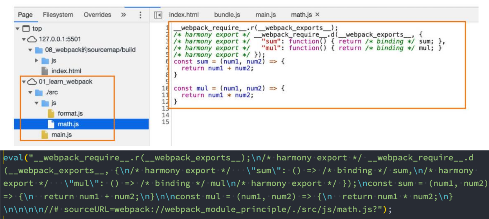

## 5.source-map常见值

### 5.1.source - map值

source - map：

- 生成一个独立的source - map文件，并且在bundle文件中有一个注释 ， 指向 source -map文件；

bundle文件中有如下的注释：

- 开发工具会根据这个注释找到 source - map文件，并且解析；

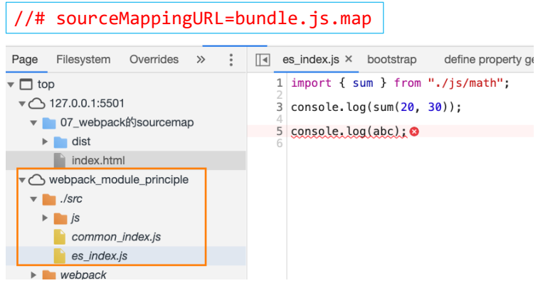

### 5.2.eval - source - map值

eval - source - map ：会生成sourcemap ，但是source - map是以DataUrl 添加到eval函数的后面

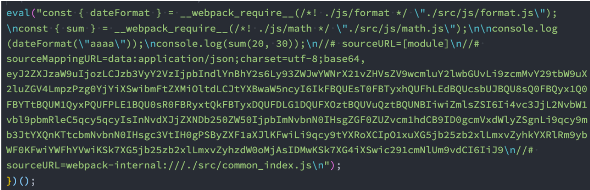

### 5.3.inline - source - map值

 inline - source - map ：会生成sourcemap ，但是source - map是以DataUrl 添加到bundle文件的后面

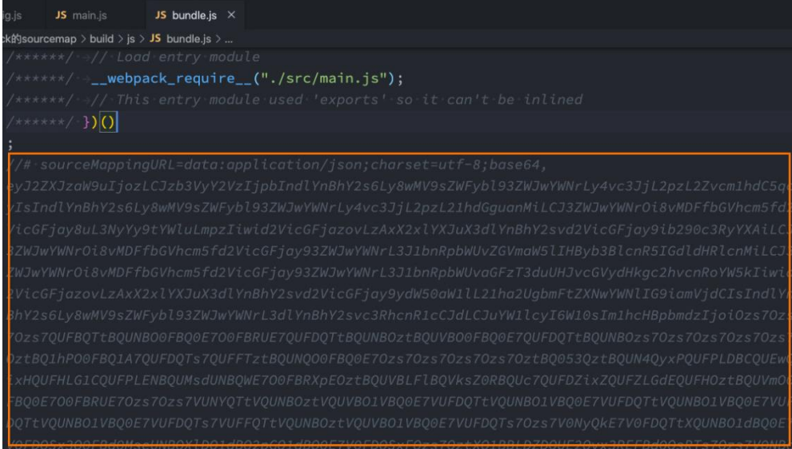

### 5.4.cheap - source -map

- 会生成sourcemap ， 但是会更加高效一些 （ cheap低开销），因为它没有生成列映射 （ Column Mapping）
- 因为在开发中，我们只需要行信息通常就可以定位到错误了

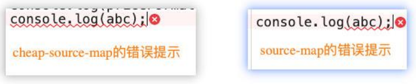

### 5.5.cheap - module - source -map值

cheap - module - source-map：

- 会生成sourcemap ，类似于cheap - source - map ，但是对源自 loader的sourcemap处理会更好。

这里有一个很模糊的概念： 对源自 loader的sourcemap处理会更好，官方也没有给出很好的解释

- 其实是如果 loader对我们的源码进行了特殊的处理 ，比如 babel；

如果我这里使用了 babel - loader （注意：目前还没有详细讲babel）

- 可以先按照我的babel 配置演练；

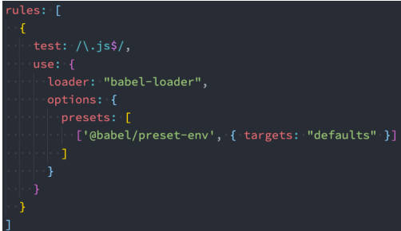

### 5.6.cheap - source - map和cheap - module - source-map

 cheap - source - map和cheap - module - source-map的区别：

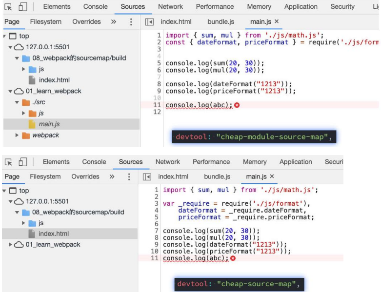

### 5.7.hidden - source - map值

 hidden - source -map：

- 会生成sourcemap ，但是不会对source - map文件进行引用；
- 相当于删除了打包文件中对sourcemap的引用注释；

```js
// 被删除掉的
//# sourceMappingURL = bundle.js.map
```

如果我们手动添加进来，那么sourcemap就会生效了

### 5.8.nosources - source - map值

 nosources - source -map：

- 会生成sourcemap ，但是生成的sourcemap只有错误信息的提示 ， 不会生成源代码文件；

正确的错误提示：

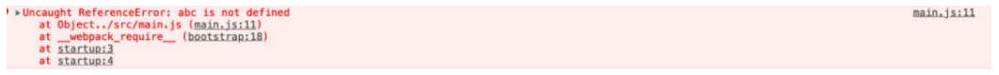

点击错误提示，无法查看源码：

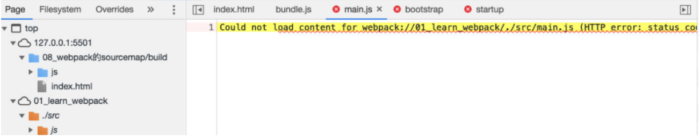

### 5.9.多个值的组合

 事实上， webpack提供给我们的26个值 ，是可以进行多组合的。

组合的规则如下：

- inline - |hidden - |eval ： 三个值时三选一；
- nosources ： 可选值；
- cheap可选值，并且可以跟随module的值；

`[inline - |hidden - |eval - ][ nosources - ][cheap - [module -]]source-map`

那么在开发中，最佳的实践是什么呢？

- 开发阶段： 推荐使用 source - map或者cheap - module - source-map 
  - 这分别是vue和 react使用的值，可以获取调试信息，方便快速开发；
- 测试阶段： 推荐使用 source - map或者cheap - module - source-map 
  - 测试阶段我们也希望在浏览器下看到正确的错误提示；
- 发布阶段： false 、缺省值（不写）


