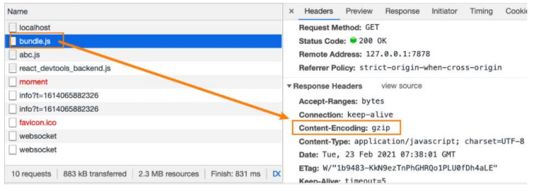
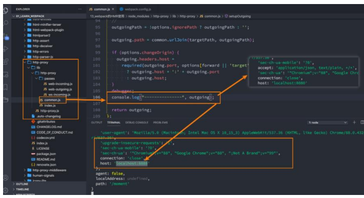

## 1.本地服务器server

### 1.1.为什么要搭建本地服务器？

目前我们开发的代码，为了运行需要有两个操作：

- 操作一： npm run build ，编译相关的代码；
- 操作二：通过 live server或者直接通过浏览器，打开 index.html 代码，查看效果；

这个过程会影响我们的开发效率，我们希望可以做到，当文件发生变化时，可以自动的完成 编译 和展示；

为了完成自动编译， webpack提供了几种可选的方式：

- webpack watch mode；
- webpack-dev-server （常用）；
- webpack-dev-middleware；

### 1.2.webpack-dev-server

上面的方式可以监听到文件的变化，但是事实上它本身是没有自动刷新浏览器的功能的：

- 当然，目前我们可以在VSCode中使用 live - server来完成这样的功能；
- 但是，我们希望在不适用 live - server的情况下，可以具备 live reloading （实时重新加载）的功能；

安装webpack- dev- server : `npm install webpack-dev - server-D`

修改配置文件，启动时加上serve参数：

```js
devServer: {
},
```

```json
"serve": "webpack serve",
```

webpack-dev-server 在编译之后不会写入到任何输出文件，而是将 bundle 文件保留在内存中：

- 事实上webpack-dev-server使用了一个库叫memfs （ memory-fs webpack自己写的）

## 2.server的静态资源

**devServer的static**

devServer中static对于我们直接访问打包后的资源其实并没有太大的作用，它的主要作用是如果我们打包后的资源，又依赖于其他的一些资源，那么就需要指定从哪里来查找这个内容：

- 比如在 index.html 中，我们需要依赖一个 abc.js 文件，这个文件我们存放在 public文件中；
- 在 index.html 中，我们应该如何去引入这个文件呢？
  - 比如代码是这样的： `<script src ="./public/abc.js "></script>`；
  - 但是这样打包后浏览器是无法通过相对路径去找到这个文件夹的；
  - 所以代码是这样的： `<script src ="/abc.js "></script>`;
  - 但是我们如何让它去查找到这个文件的存在呢？ 设置static即可；

```js
devServer: {
  static: ["public", "content"],
},
```

## 3.server的其他配置

### 3.1.host配置

host设置主机地址：

- 默认值是 localhost；
- 如果希望其他地方也可以访问，可以设置为 0.0.0.0；

localhost 和 0.0.0.0 的区别：

- localhost ：本质上是一个域名，通常情况下会被解析成 127.0.0.1;
- 127.0.0.1 ：回环地址 (Loop Back Address) ，表达的意思其实是我们主机自己发出去的包，直接被自己接收; 
  - 正常的数据库包经常 应用层 - 传输层 - 网络层 - 数据链路层-物理层;
  - 而回环地址，是在网络层直接就被获取到了，是不会经常数据链路层和物理层的 ; 
  - 比如我们监听 127.0.0.1 时，在同一个网段下的主机中，通过 ip地址是不能访问的;
- 0.0.0.0 ：监听 IPV4上所有的地址，再根据端口找到不同的应用程序;
  - 比如我们监听 0.0.0.0时，在同一个网段下的主机中，通过 ip地址是可以访问的;

### 3.2.port、open 、compress

port设置监听的端口，默认情况下是8080

open是否打开浏览器：

- 默认值是false ，设置为 true会打开浏览器；
- 也可以设置为类似于 Google Chrome等值；

compress是否为静态文件开启gzip compression：

- 默认值是false ，可以设置为 true；



## 4.server的proxy代理

proxy是我们开发中非常常用的一个配置选项，它的目的设置代理来解决跨域访问的问题：

- 比如我们的一个api 请求是 http://localhost:8888 ，但是本地启动服务器的域名是 http://localhost:8080 ，这个时候发送网络请求就会出现跨域的问题；
- 那么我们可以将请求先发送到一个代理服务器，代理服务器和API 服务器没有跨域的问题，就可以解决我们的跨域问题了；

我们可以进行如下的设置：

- target：表示代理到的目标地址，比如 /api-hy/moment会被代理到 http://localhost:8888/api-hy/moment；
- pathRewrite：默认情况下，我们的 /api-hy 也会被写入到URL中，如果希望删除，可以使用 pathRewrite；
- changeOrigin ：它表示是否更新代理后请求的 headers 中 host地址；

```js
devServer: {
  static: ["public", "content"],
  // host: '0.0.0.0',
  port: 3000,
  open: true,
  compress: true,
  proxy: {
    "/api": {
      target: "http://localhost:9000",
      pathRewrite: {
        "^/api": "",
      },
      changeOrigin: true,
    },
  },
  historyApiFallback: true,
},
```

## 5.changeOrigin作用

这个 changeOrigin官方说的非常模糊，通过查看源码我发现其实是要修改代理请求中的headers中的host属性：

- 因为我们真实的请求，其实是需要通过 http://localhost:8888来请求的；
- 但是因为使用了代码，默认情况下它的值时 http://localhost:8000；
- 如果我们需要修改，那么可以将changeOrigin设置为 true即可；



## 6.historyApiFallback

historyApiFallback是开发中一个非常常见的属性，它主要的作用是解决SPA页面在路由跳转之后，进行页面刷新时，返回404 的错误。

boolean值：默认是false

- 如果设置为 true ，那么在刷新时，返回404错误时，会自动返回 index.html的内容；

object类型的值，可以配置rewrites属性：

- 可以配置from来匹配路径，决定要跳转到哪一个页面；

事实上devServer中实现historyApiFallback功能是通过connect-history-api-fallback库的：

- 可以查看[connect-history-api-fallback](https://github.com/bripkens/connect-history-api-fallback)文档


