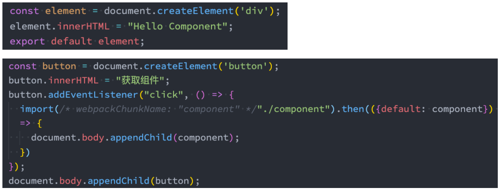
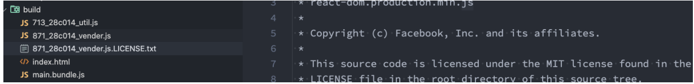
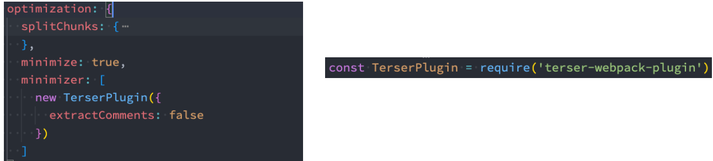
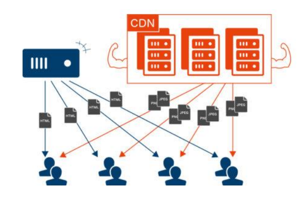
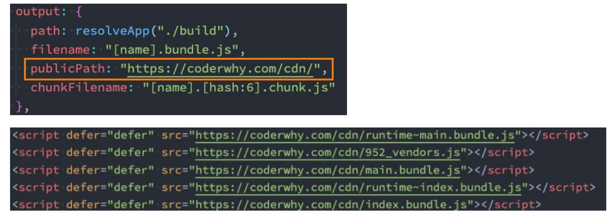
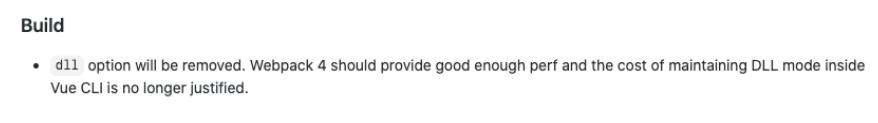
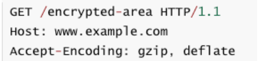
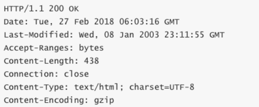
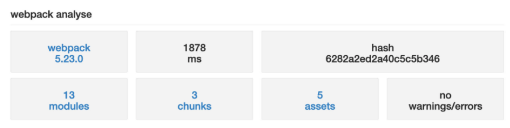

## 0.如何使用webpack性能优化？

webpack作为前端目前使用最广泛的打包工具，在面试中也是经常会被问到的。

比较常见的面试题包括：

- 可以配置哪些属性来进行webpack性能优化？
- 前端有哪些常见的性能优化？（问到前端性能优化时，除了其他常见的，也完全可以从webpack来回答）

webpack的性能优化较多，我们可以对其进行分类：

- 优化一： 打包后的结果 ，上线时的性能优化。（比如分包处理、减小包体积、 CDN服务器等）
- 优化二： 优化打包速度 ，开发或者构建时优化打包速度。（比如exclude 、 cache-loader等）

大多数情况下，我们会更加侧重于优化一，这对于线上的产品影响更大。

在大多数情况下webpack都帮我们做好了该有的性能优化：

- 比如配置mode为 production或者development时，默认webpack的配置信息；
- 但是我们也可以针对性的进行自己的项目优化；

接下来，我们来学习一下webpack性能优化的更多细节。

## 1.webpack多入口依赖

### 1.1.性能优化-代码分离

代码分离（ Code Splitting ）是webpack一个非常重要的特性：

- 它主要的目的是将代码分离到不同的bundle中，之后我们可以按需加载 ，或者并行加载这些文件；
- 比如默认情况下， 所有的JavaScript代码（业务代码、第三方依赖、暂时没有用到的模块）在首页全部都加载 ，就会影响首页的加载速度；
- 代码分离可以分出更小的bundle ，以及控制资源加载优先级 ， 提供代码的加载性能；

Webpack中常用的代码分离有三种：

- 入口起点 ：使用entry配置手动分离代码；
- 防止重复 ：使用 Entry Dependencies或者SplitChunksPlugin去重和分离代码；
- 动态导入 ：通过模块的内联函数调用来分离代码；

### 1.2.多入口起点

入口起点的含义非常简单，就是配置多入口：

- 比如配置一个 index.js 和 main.js 的入口；
- 他们分别有自己的代码逻辑；

```js
entry: {
  index: './src/index.js',
  main: './src/main.js',
},
output: {
  path: path.resolve(__dirname, './build'),
  filename: '[name]-bundle.js',
  clean: true
},
```

### 1.3.Entry Dependencies(入口依赖)

假如我们的 index.js和main.js都依赖两个库： lodash 、 dayjs

- 如果我们单纯的进行入口分离，那么打包后的两个bunlde都有会有一份 lodash和dayjs；
- 事实上我们可以对他们进行共享；

```js
entry: {
  index: {
    import: "./src/index.js",
    dependOn: "shared",
  },
  main: {
    import: "./src/main.js",
    dependOn: "shared",
  },
  shared: ["axios", "lodash"],
},
output: {
  path: path.resolve(__dirname, "./build"),
  filename: "[name]-bundle.js",
  clean: true,
},
```

## 2.webpack的动态导入

### 2.1.动态导入 (dynamic import)

另外一个代码拆分的方式是动态导入时， webpack提供了两种实现动态导入的方式：

- 第一种，使用 ECMAScript 中的 import() 语法来完成，也是目前推荐的方式；
- 第二种，使用webpack遗留的 require.ensure ，目前已经不推荐使用；

比如我们有一个模块 bar.js：

- 该模块我们希望在代码运行过程中来加载它 （比如判断一个条件成立时加载）；
- 因为我们并不确定这个模块中的代码一定会用到 ，所以最好拆分成一个独立的js文件；
- 这样可以保证不用到该内容时， 浏览器不需要加载和处理该文件的js代码；
- 这个时候我们就可以使用动态导入；

```js
// import './router/about'
// import './router/category'

const btn1 = document.createElement('button')
const btn2 = document.createElement('button')
btn1.textContent = '关于'
btn2.textContent = '分类'
document.body.append(btn1)
document.body.append(btn2)

btn1.onclick = function() {
  import('./router/about').then(res => {
    res.about()
    res.default()
  })
}

btn2.onclick = function() {
  import('./router/category')
}
```

注意：使用动态导入bar.js：

- 在webpack中，通过动态导入获取到一个对象；
- 真正导出的内容， 在该对象的default属性中，所以我们需要做一个简单的解构；

```js
function about() {
  console.log("about function exec~");
}
const name = "ABOUT";

export { about };
export default name;
```

### 2.2.动态导入的文件命名

动态导入的文件命名：

- 因为动态导入通常是一定会打包成独立的文件的，所以并不会在cacheGroups 中进行配置；
- 那么它的命名我们通常会在output 中，通过 chunkFilename 属性来命名；

```js
output: {
  clean: true,
  path: path.resolve(__dirname, './build'),
  filename: '[name]-bundle.js',
  // 单独针对分包的文件进行命名
  chunkFilename: '[name]_chunk.js'
},
```

但是，你会发现默认情况下我们获取到的 [name] 是和 id的名称保持一致的

- 如果我们希望修改name的值，可以通过magic comments （魔法注释） 的方式；

```js
import(/* webpackChunkName: "about" */'./router/about').then(res => {
  res.about()
  res.default()
})
```

### 2.3.代码的懒加载

动态 import使用最多的一个场景是懒加载（比如路由懒加载）：

- 封装一个component.js ，返回一个component对象；
- 我们可以在一个按钮点击时，加载这个对象；



## 3.SplitChunkPlugin

### 3.1.SplitChunks

另外一种分包的模式是splitChunk ，它底层是使用SplitChunksPlugin来实现的：

- 因为该插件webpack已经默认安装和集成 ，所以我们并不需要单独安装和直接使用该插件；
- 只需要提供SplitChunksPlugin相关的配置信息即可；

Webpack提供了SplitChunksPlugin默认的配置，我们也可以手动来修改它的配置：

- 比如默认配置中， chunks仅仅针对于异步（ async ）请求，我们也可以设置为all；

```js
optimization: {
    // 分包插件: SplitChunksPlugin
    splitChunks: {
      chunks: "all",
    },
  },
```

### 3.2.SplitChunks 自定义配置解析

- Chunks:
  - 默认值是async
  - all 表示对同步和异步代码都进行处理
- minSize：
  - 拆分包的大小, 至少为minSize；
  - 如果一个包拆分出来达不到minSize , 那么这个包就不会拆分；
- maxSize：
  - 将大于maxSize的包，拆分为不小于minSize的包；
- cacheGroups：
  - 用于对拆分的包就行分组，比如一个 lodash在拆分之后，并不会立即打包，而是会等到有没有其他符合规则的包一起来打包；
  - test属性：匹配符合规则的包；
  - name属性：拆分包的 name属性；
  - filename属性：拆分包的名称，可以自己使用 placeholder属性；

**SplitChunks 自定义配置**

```js
// 优化配置
optimization: {
  // 设置生成的chunkId的算法
  // development: named
  // production: deterministic(确定性)
  // webpack4中使用: natural
  chunkIds: "deterministic",
  // runtime的代码是否抽取到单独的包中(早Vue2脚手架中)
  runtimeChunk: {
    name: "runtime",
  },
  // 分包插件: SplitChunksPlugin
  splitChunks: {
    chunks: "all",
    // 当一个包大于指定的大小时, 继续进行拆包
    // maxSize: 20000,
    // 将包拆分成不小于minSize的包
    // minSize: 10000,
    minSize: 10,
，。
    // 自己对需要进行拆包的内容进行分包
    cacheGroups: {
      utils: {
        test: /utils/,
        filename: "[id]_utils.js",
      },
      vendors: {
        // /node_modules/
        // window上面 /\
        // mac上面 /
        test: /[\\/]node_modules[\\/]/,
        filename: "[id]_vendors.js",
      },
    },
  },
  // 代码优化: TerserPlugin => 让代码更加简单 => Terser
  minimizer: [
    // JS代码简化
    new TerserPlugin({
      extractComments: false,
    }),
    // CSS代码简化
  ],
},
```

### 3.3.解决注释的单独提取

默认情况下， webpack在进行分包时，有对包中的注释进行单独提取。



这个包提取是由另一个插件默认配置的原因：



### 3.4.optimization.chunkIds配置

 optimization.chunkIds配置用于告知webpack模块的 id采用什么算法生成。

有三个比较常见的值：

- natural ：按照数字的顺序使用 id；
- named ： development下的默认值，一个可读的名称的id；
- deterministic ：确定性的，在不同的编译中不变的短数字id
  - 在webpack4中是没有这个值的；
  - 那个时候如果使用 natural ，那么在一些编译发生变化时，就会有问题；

最佳实践：

- 开发过程中，我们推荐使用 named；
- 打包过程中，我们推荐使用deterministic；

```js
// 优化配置
optimization: {
  // 设置生成的chunkId的算法
  // development: named
  // production: deterministic(确定性)
  // webpack4中使用: natural
  chunkIds: "deterministic",
},
```


### 3.5.optimization.runtimeChunk配置

配置runtime相关的代码是否抽取到一个单独的chunk中：

- runtime相关的代码指的是在运行环境中，对模块进行解析、加载、模块信息相关的代码；
- 比如我们的component 、 bar两个通过 import 函数相关的代码加载 ，就是通过 runtime代码完成的；

抽离出来后，有利于浏览器缓存的策略：

- 比如我们修改了业务代码（ main ） ，那么 runtime和component 、 bar的chunk是不需要重新加载的；
- 比如我们修改了 component 、 bar的代码 ，那么main 中的代码是不需要重新加载的；

设置的值：

- true/multiple ：针对每个入口打包一个 runtime文件；
- single ：打包一个 runtime文件；
- 对象： name属性决定 runtimeChunk的名称；

```js
// 优化配置
optimization: {
  // runtime的代码是否抽取到单独的包中(早Vue2脚手架中)
  runtimeChunk: {
    name: "runtime",
  },
},
```

## 4.prefetch和preload

webpack v4.6.0+ 增加了对预获取和预加载的支持。

在声明 import 时，使用下面这些内置指令，来告知浏览器：

- prefetch (预获取) ：将来某些导航下可能需要的资源
- preload (预加载) ：当前导航下可能需要资源

```js
const btn1 = document.createElement('button')
const btn2 = document.createElement('button')
btn1.textContent = '关于'
btn2.textContent = '分类'
document.body.append(btn1)
document.body.append(btn2)

btn1.onclick = function() {
  import(
    /* webpackChunkName: "about" */
    /* webpackPrefetch: true */
    './router/about').then(res => {
    res.about()
    res.default()
  })
}

btn2.onclick = function() {
  import(
    /* webpackChunkName: "category" */
    /* webpackPrefetch: true */
    './router/category')
}
```

与 prefetch 指令相比， preload 指令有许多不同之处：

- preload chunk 会在父 chunk 加载时，以并行方式开始加载。 prefetch chunk 会在父 chunk 加载结束后开始加载。
- preload chunk 具有中等优先级，并立即下载。 prefetch chunk 在浏览器闲置时下载。
- preload chunk 会在父 chunk 中立即请求，用于当下时刻。 prefetch chunk 会用于未来的某个时刻。

## 5.CDN加速服务器配置

### 5.1.什么是CDN ？

CDN称之为内容分发网络（ Content Delivery Network或Content Distribution Network ，缩写： CDN）

- 它是指通过相互连接的网络系统，利用最靠近每个用户的服务器；
- 更快、更可靠地将音乐、图片、视频、应用程序及其他文件发送给用户；
- 来提供高性能、可扩展性及低成本的网络内容传递给用户；



在开发中，我们使用CDN主要是两种方式：

- 方式一：打包的所有静态资源，放到CDN服务器，用户所有资源都是通过CDN服务器加载的；
- 方式二：一些第三方资源放到CDN服务器上；

### 5.2.CDN服务器

**购买CDN服务器**

如果所有的静态资源都想要放到CDN服务器上，我们需要购买自己的CDN服务器；

- 目前阿里、腾讯、亚马逊、 Google等都可以购买CDN服务器；
- 我们可以直接修改publicPath ，在打包时添加上自己的CDN地址；



**第三方库的CDN服务器**

通常一些比较出名的开源框架都会将打包后的源码放到一些比较出名的、免费的CDN服务器上：

- 国际上使用比较多的是unpkg 、 JSDelivr 、 cdnjs；
- 国内也有一个比较好用的CDN是bootcdn；

在项目中，我们如何去引入这些CDN呢？

- 第一，在打包的时候我们不再需要对类似于 lodash或者dayjs这些库进行打包；
- 第二，在html 模块中，我们需要自己加入对应的CDN服务器地址；

第一步，我们可以通过webpack配置，来排除一些库的打包：

第二步，在html 模块中，加入CDN服务器地址：

```js
// 排除某些包不需要进行打包
externals: {
  react: "React",
  // key属性名: 排除的框架的名称
  // value值: 从CDN地址请求下来的js中提供对应的名称
  axios: "axios"
},
```

```html
<body>
  <div id="root"></div>
  <script src="https://cdn.bootcdn.net/ajax/libs/axios/1.2.0/axios.min.js"></script>
  <script src="https://cdn.bootcdn.net/ajax/libs/react/18.2.0/umd/react.production.min.js"></script>
</body>
```

### 5.3.认识shimming

shimming是一个概念，是某一类功能的统称：

- shimming翻译过来我们称之为 垫片，相当于给我们的代码填充一些垫片来处理一些问题；
- 比如我们现在依赖一个第三方的库，这个第三方的库本身依赖 lodash ，但是默认没有对 lodash进行导入（认为全局存在lodash ），那么我们就可以通过ProvidePlugin来实现shimming的效果；

注意： webpack并不推荐随意的使用 shimming

- Webpack背后的整个理念是使前端开发更加模块化；
- 也就是说，需要编写具有封闭性的、不存在隐含依赖（比如全局变量）的彼此隔离的模块；

### 5.4.Shimming预支全局变量

目前我们的 lodash 、 dayjs都使用了CDN进行引入，所以相当于在全局是可以使用_和dayjs的

- 假如一个文件中我们使用了axios ，但是没有对它进行引入，那么下面的代码是会报错的；

```js
axios.get('http://123.207.32.32:8000/home/multidata').then(res => {
  console.log(res)
})
```

我们可以通过使用ProvidePlugin来实现shimming的效果：

- ProvidePlugin能够帮助我们在每个模块中，通过一个变量来获取一个package；
- 如果webpack看到这个模块，它将在最终的bundle中引入这个模块；
- 另外ProvidePlugin是webpack默认的一个插件 ，所以不需要专门导入；

```js
new ProvidePlugin({
  axios: ['axios', 'default'],
  // get: ['axios', 'get'],
  dayjs: 'dayjs'
})
```

这段代码的本质是告诉webpack：

- 如果你遇到了至少一处用到 axios变量的模块实例，那请你将 axios package 引入进来，并将其提供给需要用到它的模块。

## 6.CSS样式的单独提取

### 6.1.MiniCssExtractPlugin

 MiniCssExtractPlugin可以帮助我们将css提取到一个独立的css文件中，该插件需要在webpack4+才可以使用。

- 首先，我们需要安装 mini - css - extract- plugin：
  - `npm install mini-css-extract-plugin -D`
- 配置rules和plugins：

```js
module: {
  rules: [
    {
      test: /\.css$/,
      use: [
        // 'style-loader', 开发阶段
        MiniCssExtractPlugin.loader, // 生产阶段
        'css-loader'
      ]
    }
  ]
},
plugins: [
  // 完成css的提取
  new MiniCssExtractPlugin({
    filename: 'css/[name].css',
    chunkFilename: 'css/[name]_chunk.css'
  })
]
```

### 6.2.Hash 、 ContentHash 、 ChunkHash

在我们给打包的文件进行命名的时候，会使用placeholder ， placeholder中有几个属性比较相似：

- hash 、 chunkhash 、 contenthash
- hash本身是通过MD4的散列函数处理后，生成一个 128位的 hash值（ 32个十六进制）；

hash值的生成和整个项目有关系：

- 比如我们现在有两个入口 index.js和main.js；
- 它们分别会输出到不同的bundle文件中，并且在文件名称中我们有使用 hash；
- 这个时候，如果修改了 index.js文件中的内容，那么hash会发生变化；
- 那就意味着两个文件的名称都会发生变化；

chunkhash可以有效的解决上面的问题，它会根据不同的入口进行解析来生成hash值：

- 比如我们修改了 index.js ，那么main.js的chunkhash是不会发生改变的；

contenthash表示生成的文件hash名称，只和内容有关系：

- 比如我们的 index.js ，引入了一个style.css ， style.css有被抽取到一个独立的css文件中；
- 这个css文件在命名时，如果我们使用的是chunkhash；
- 那么当 index.js文件的内容发生变化时， css文件的命名也会发生变化；
- 这个时候我们可以使用 contenthash；

### 6.3.认识DLL库（了解）

DLL是什么呢？

- DLL全程是动态链接库（ Dynamic Link Library ），是为软件在Windows 中实现共享函数库的一种实现方式；
- 那么webpack中也有内置DLL的功能，它指的是我们可以将能够共享 ， 并且不经常改变的代码 ， 抽取成一个共享的库；
- 这个库在之后编译的过程中，会被引入到其他项目的代码中；

DDL库的使用分为两步:

- 第一步：打包一个DLL库；
- 第二步：项目中引入DLL库；

注意：在升级到webpack4之后， React和Vue脚手架都移除了DLL库（下面的vue作者的回复），所以知道有这么一个概念即可。



## 7.TerserPlugin代码压缩

### 7.1.Terser介绍和安装

什么是Terser呢？

- Terser是一个JavaScript的解释（ Parser ）、 Mangler （绞肉机） /Compressor （压缩机）的工具集；
- 早期我们会使用 uglify-js来压缩、丑化我们的JavaScript代码，但是目前已经不再维护，并且不支持ES6+ 的语法；
- Terser是从 uglify- es fork 过来的，并且保留它原来的大部分API 以及适配 uglify- es和uglify-js@3等；

也就是说， Terser可以帮助我们压缩、丑化我们的代码，让我们的bundle变得更小。

因为Terser是一个独立的工具，所以它可以单独安装：

```bash
# 全局安装
npm install terser - g
# 局部安装
npm install terser -D
```

### 7.2.命令行使用Terser

我们可以在命令行中使用Terser：

```bash
terser [input files] [options]
# 举例说明
terser js/file1.js - o foo.min.js - c -m
```

我们这里来讲解几个Compress option和Mangle(乱砍) option：

- 因为他们的配置非常多，我们不可能一个个解析，更多的查看文档即可；
- https://github.com/terser/terser#compress-options 
- https://github.com/terser/terser#mangle-options

### 7.3.Compress和Mangle的options

Compress option：

- arrows： class或者object 中的函数，转换成箭头函数；
- arguments：将函数中使用 arguments[index] 转成对应的形参名称；
- dead_code：移除不可达的代码（ tree shaking）；
- 其他属性可以查看文档；

Mangle option

- toplevel：默认值是false ，顶层作用域中的变量名称，进行丑化（转换）；
- keep_classnames：默认值是false ，是否保持依赖的类名称；
- keep_fnames：默认值是false ，是否保持原来的函数名称；
- 其他属性可以查看文档；

```bash
npx terser ./src/abc.js -o abc.min.js -c
arrows,arguments=true,dead_code -m
toplevel=true,keep_classnames=true,keep_fnames=true
```

### 7.4.Terser在webpack中配置

真实开发中，我们不需要手动的通过terser来处理我们的代码，我们可以直接通过webpack来处理：

- 在webpack中有一个minimizer属性，在production模式下，默认就是使用TerserPlugin来处理我们的代码的；
- 如果我们对默认的配置不满意，也可以自己来创建TerserPlugin 的实例，并且覆盖相关的配置；

首先，我们需要打开minimize，让其对我们的代码进行压缩（默认production模式下已经打开了）

其次，我们可以在minimizer创建一个TerserPlugin：

- extractComments：默认值为 true ，表示会将注释抽取到一个单独的文件中；
  - 在开发中，我们不希望保留这个注释时，可以设置为 false；
- parallel：使用多进程并发运行提高构建的速度，默认值是true
  - 并发运行的默认数量： os.cpus().length - 1；
  - 我们也可以设置自己的个数，但是使用默认值即可；
- terserOptions：设置我们的terser相关的配置
  - compress：设置压缩相关的选项；
  - mangle：设置丑化相关的选项，可以直接设置为 true；
  - toplevel：顶层变量是否进行转换；
  - keep_classnames：保留类的名称；
  - keep_fnames：保留函数的名称；

```js
// 优化配置
optimization: {
  minimize: true,
  // 代码优化: TerserPlugin => 让代码更加简单 => Terser
  minimizer: [
    // JS压缩的插件: TerserPlugin
    new TerserPlugin({
      extractComments: false,
      terserOptions: {
        compress: {
          arguments: true,
          unused: true
        },
        mangle: true,
        // toplevel: false
        keep_fnames: true
      }
    }),
  ]
},
```

### 7.5.CSS的压缩

另一个代码的压缩是CSS：

- CSS压缩通常是去除无用的空格等，因为很难去修改选择器、属性的名称、值等；
- CSS的压缩我们可以使用另外一个插件： css-minimizer-webpack-plugin；
- css-minimizer-webpack-plugin是使用cssnano工具来优化、压缩CSS （也可以单独使用）；

第一步，安装 css-minimizer-webpack-plugin：

- `npm install css-minimizer-webpack-plugin -D`

第二步，在optimization.minimizer中配置

```js
// 代码优化: TerserPlugin => 让代码更加简单 => Terser
minimizer: [
  // JS压缩的插件: TerserPlugin
  new TerserPlugin({
    extractComments: false,
    terserOptions: {
      compress: {
        arguments: true,
        unused: true,
      },
      mangle: true,
      // toplevel: false
      keep_fnames: true,
    },
  }),
  // CSS压缩的插件: CSSMinimizerPlugin
  new CSSMinimizerPlugin({
    // parallel: true
  }),
],
```

## 8.Tree Shaking的实现

### 8.1.什么是Tree Shaking

什么是Tree Shaking呢？

- Tree Shaking是一个术语，在计算机中表示消除死代码 （ dead_code）；
- 最早的想法起源于LISP ，用于消除未调用的代码 （纯函数无副作用，可以放心的消除，这也是为什么要求我们在进行函数式编程时，尽量使用纯函数的原因之一）；
- 后来Tree Shaking也被应用于其他的语言，比如 JavaScript 、 Dart；

JavaScript的Tree Shaking：

- 对JavaScript进行Tree Shaking是源自打包工具 rollup （后面我们也会讲的构建工具）；
- 这是因为Tree Shaking依赖于ES Module的静态语法分析（不执行任何的代码，可以明确知道模块的依赖关系）；
- webpack2正式内置支持了 ES2015模块，和检测未使用模块的能力；
- 在webpack4正式扩展了这个能力，并且通过 package.json的 sideEffects属性作为标记 ，告知webpack在编译时，哪里文件可以安全的删除掉；
- webpack5 中，也提供了对部分CommonJS的tree shaking的支持；
  - https://github.com/webpack/changelog-v5#commonjs-tree-shaking

### 8.2.webpack实现Tree Shaking

事实上webpack实现Tree Shaking采用了两种不同的方案：

- usedExports ：通过标记某些函数是否被使用，之后通过Terser来进行优化的；
- sideEffects ：跳过整个模块/文件，直接查看该文件是否有副作用；

### 8.3.usedExports

将mode设置为development模式：

- 为了可以看到 usedExports带来的效果，我们需要设置为 development 模式
- 因为在 production 模式下， webpack默认的一些优化会带来很大的影响。

设置usedExports为true和false对比打包后的代码：

- 在usedExports设置为 true时，会有一段注释： unused harmony export mul；
- 这段注释的意义是什么呢？告知Terser在优化时，可以删除掉这段代码；

这个时候，我们讲 minimize设置true：

- usedExports设置为 false时， mul 函数没有被移除掉；
- usedExports设置为 true时， mul 函数有被移除掉；

所以， usedExports实现Tree Shaking是结合Terser来完成的。

```js
// 优化配置
optimization: {
  // 导入模块时, 分析模块中的哪些函数有被使用, 哪些函数没有被使用.
  usedExports: true,
},
```

### 8.4.sideEffects

```js
export function parseLyric(lyricString) {
  return [];
}
export function test() {}

// 模块的副作用代码
// 推荐: 在平时编写模块的时候, 尽量编写纯模块
window.lyric = "哈哈哈哈哈";
```

```js
// 1.正常使用的过程
// import { parseLyric } from './demo/parse-lyric'
// parseLyric()

// 2.只导入模块, 但是没有引入任何的内容
import "./demo/parse-lyric"
```

sideEffects用于告知webpack compiler哪些模块时有副作用的：

- 副作用的意思是这里面的代码有执行一些特殊的任务，不能仅仅通过export来判断这段代码的意义；
- 副作用的问题，在讲React的纯函数时是有讲过的；

在package.json中设置sideEffects的值：

- 如果我们将sideEffects设置为 false ，就是告知webpack可以安全的删除未用到的exports；
- 如果有一些我们希望保留，可以设置为数组；

比如我们有一个format.js、 style.css文件：

- 该文件在导入时没有使用任何的变量来接受；
- 那么打包后的文件，不会保留 format.js 、 style.css相关的任何代码；

```json
"sideEffects": [
  "./src/demo/parse-lyric.js",
  "*.css"
],
```

### 8.5.Webpack中tree shaking的设置

所以，如何在项目中对JavaScript的代码进行TreeShaking呢（生成环境）？

- 在optimization 中配置usedExports为 true ，来帮助Terser进行优化；
- 在package.json 中配置sideEffects ，直接对模块进行优化；

### 8.6.CSS实现Tree Shaking

上面我们学习的都是关于JavaScript的Tree Shaking ，那么CSS是否也可以进行Tree Shaking操作呢？

- CSS的Tree Shaking需要借助于一些其他的插件；
- 在早期的时候，我们会使用 PurifyCss插件来完成CSS的tree shaking ，但是目前该库已经不再维护了（最新更新也是在4年前了）；
- 目前我们可以使用另外一个库来完成CSS的Tree Shaking ： PurgeCSS ，也是一个帮助我们删除未使用的CSS的工具；

安装PurgeCss的webpack插件：

- `npm install purgecss-webpack-plugin -D`

### 8.7.配置PurgeCss

配置这个插件（生成环境）：

- paths ：表示要检测哪些目录下的内容需要被分析，这里我们可以使用glob；
- 默认情况下， Purgecss会将我们的 html 标签的样式移除掉，如果我们希望保留，可以添加一个safelist的属性；

```js
plugins: [
  // 完成css的提取
  new MiniCssExtractPlugin({
    filename: 'css/[name].css',
    chunkFilename: 'css/[name]_chunk.css'
  }),
  // 对CSS进行TreeShaking
  new PurgeCSSPlugin({
    paths: glob.sync(`${path.resolve(__dirname, '../src')}/**/*`, { nodir: true }),
    safelist: function() {
      return {
        standard: ["body"]
      }
    }
  })
]
```

purgecss也可以对 less文件进行处理（所以它是对打包后的css进行tree shaking操作）；

## 9.Scope Hoisting作用

什么是Scope Hoisting呢？

- Scope Hoisting从webpack3开始增加的一个新功能；
- 功能是对作用域进行提升，并且让webpack打包后的代码更小、运行更快；

默认情况下webpack打包会有很多的函数作用域，包括一些（比如最外层的） IIFE：

- 无论是从最开始的代码运行，还是加载一个模块，都需要执行一系列的函数；
- Scope Hoisting可以将函数合并到一个模块中来运行；

使用Scope Hoisting非常的简单， webpack已经内置了对应的模块：

- 在production模式下，默认这个模块就会启用；
- 在development模式下，我们需要自己来打开该模块；

```js
plugins: [
  // 作用域提升
  new webpack.optimize.ModuleConcatenationPlugin()
]
```

## 10.HTTP文件压缩传输

### 10.1.什么是HTTP压缩？

HTTP压缩是一种内置在 服务器 和 客户端 之间的，以改进传输速度和带宽利用率的方式；

HTTP压缩的流程什么呢？

- 第一步： HTTP数据在服务器发送前就已经被压缩了；（可以在webpack中完成）
-  第二步：兼容的浏览器在向服务器发送请求时，会告知服务器自己支持哪些压缩格式；



- 第三步：服务器在浏览器支持的压缩格式下，直接返回对应的压缩后的文件，并且在响应头中告知浏览器；



### 10.2.目前的压缩格式

目前的压缩格式非常的多：

- compress – UNIX的“ compress” 程序的方法（历史性原因，不推荐大多数应用使用，应该使用gzip或deflate）；
- deflate – 基于deflate算法（定义于RFC 1951 ）的压缩，使用zlib数据格式封装；
- gzip – GNU zip格式（定义于RFC 1952 ），是目前使用比较广泛的压缩算法；
- br – 一种新的开源压缩算法，专为 HTTP内容的编码而设计；

### 10.3.Webpack对文件压缩

webpack中相当于是实现了HTTP压缩的第一步操作，我们可以使用CompressionPlugin。

- 第一步，安装CompressionPlugin：
  - `npm install compression-webpack-plugin -D`
- 第二步，使用CompressionPlugin即可：

```js
// 对打包后的文件(js/css)进行压缩
new CompressionPlugin({
  test: /\.(js|css)$/,
  algorithm: 'gzip'
})
```

## 11.HTML文件的压缩

我们之前使用了HtmlWebpackPlugin插件来生成HTML的模板，事实上它还有一些其他的配置：

- inject ：设置打包的资源插入的位置
  - true 、 false 、 body、head
- cache ：设置为true ，只有当文件改变时，才会生成新的文件（默认值也是true）
- minify ：默认会使用一个插件html - minifier- terser

```js
new HtmlWebpackPlugin({
  template: './index.html',
  cache: true,
  minify: isProdution? {
    // 移除注释
    removeComments: true,
    // 移除属性
    removeEmptyAttributes: true,
    // 移除默认属性
    removeRedundantAttributes: true,
    // 折叠空白字符
    collapseWhitespace: true,
    // 压缩内联的CSS
    minifyCSS: true,
    // 压缩JavaScript
    minifyJS: {
      mangle: {
        toplevel: true
      }
    }
  }: false
}),
```

## 12.webpack打包分析

### 12.1.分析一：打包的时间分析

如果我们希望看到每一个 loader、每一个Plugin消耗的打包时间，可以借助于一个插件： speed - measure -webpack-plugin 

- 注意：该插件在最新的webpack版本中存在一些兼容性的问题（和部分Plugin不兼容）
- 截止2021 - 3 - 10 日，但是目前该插件还在维护，所以可以等待后续是否更新；
- 我这里暂时的做法是把不兼容的插件先删除掉，也就是不兼容的插件不显示它的打包时间就可以了；

第一步，安装speed-measure-webpack-plugin插件

- `npm install speed-measure-webpack-plugin -D`

第二步，使用 speed - measure - webpack- plugin插件

- 创建插件导出的对象 SpeedMeasurePlugin；
- 使用 smp.wrap 包裹我们导出的webpack配置；

```js
const SpeedMeasurePlugin = require("speed-measure-webpack-plugin");
const smp = new SpeedMeasurePlugin();

module.exports = function (env) {
  const isProduction = env.production;
  let mergeConfig = isProduction ? prodConfig : devConfig;
  const finalConfig = merge(getCommonConfig(isProduction), mergeConfig);
  return smp.wrap(finalConfig);
};
```

### 12.2.分析二：打包后文件分析

方案一：

- 生成一个stats.json的文件
  - `" buiebpack ld:stats ": "w--config ./config/webpack.common.js --env production --profile --json=stats.json",`

- 通过执行npm run build:status可以获取到一个stats.json的文件：

  - 这个文件我们自己分析不容易看到其中的信息；

  - 可以放到 http://webpack.github.com/analyse，进行分析
  
  

 方案二：

- 使用webpack-bundle-analyzer工具
  - 另一个非常直观查看包大小的工具是webpack-bundle-analyzer。
- 第一步，我们可以直接安装这个工具：`npm install webpack-bundle-analyzer -D`
- 第二步，我们可以在webpack配置中使用该插件：

  ```js
  const { BundleAnalyzerPlugin } = require('webpack-bundle-analyzer')
  
  module.exports = {
    plugins: [
      // 对打包后的结果进行分析
      new BundleAnalyzerPlugin(),
    ],
  };
  ```
- 在打包webpack的时候，这个工具是帮助我们打开一个8888端口上的服务，我们可以直接的看到每个包的大小。
  - 比如有一个包时通过一个Vue组件打包的，但是非常的大，那么我们可以考虑是否可以拆分出多个组件，并且对其进行懒加载；
  - 比如一个图片或者字体文件特别大，是否可以对其进行压缩或者其他的优化处理；


