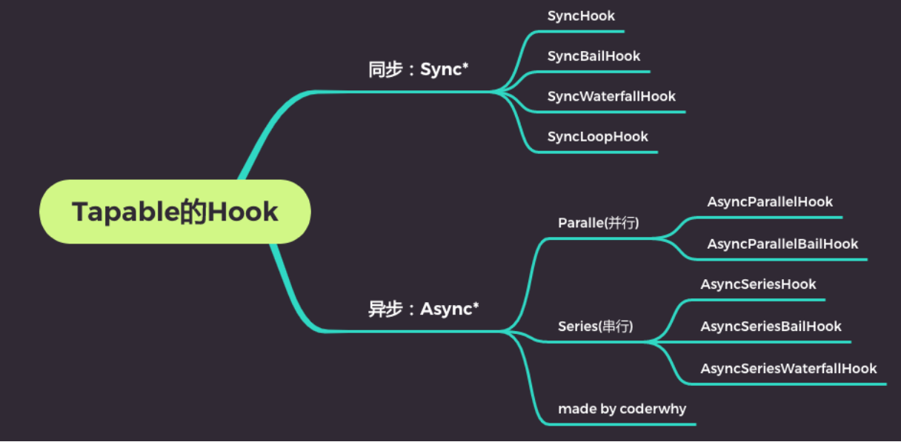

## 1.认识自定义Loader

### 1.1.创建自己的Loader

Loader是用于对模块的源代码进行转换（处理），之前我们已经使用过很多 Loader ，比如css - loader、 style - loader、babel-loader等。

这里我们来学习如何自定义自己的 Loader：

- Loader本质上是一个导出为函数的JavaScript模块；
- loader runner库会调用这个函数，然后将上一个 loader产生的结果或者资源文件传入进去；

编写一个hy- loader01.js模块这个函数会接收三个参数：

- content ：资源文件的内容；
- map ： sourcemap相关的数据；
- meta ：一些元数据；

```js
module.exports = function(content, map, meta) {
  console.log("hy_loader01:", content)
  return content
}
```

### 1.2.在加载某个模块时，引入 loader

注意：传入的路径和context是有关系的，在前面我们讲入口的相对路径时有讲过。

```js
const path = require('path')

module.exports = {
  mode: "development",
  entry: "./src/main.js",
  output: {
    path: path.resolve(__dirname, './build'),
    filename: "bundle.js"
  },
  resolveLoader: {
    modules: ["node_modules", "./hy-loaders"]
  },
  module: {
    rules: [
      {
        test: /\.js$/,
        use: [
           "./hy-loaders/hy_loader01.js"
        ]
      },

    ]
  }
}
```

### 1.3.resolveLoader属性

但是，如果我们依然希望可以直接去加载自己的 loader文件夹，有没有更加简洁的办法呢？

- 配置 resolveLoader属性；

```js
resolveLoader: {
  modules: ["node_modules", "./hy-loaders"]
},
```

## 2.Loader的加载顺序

### 2.1.loader的执行顺序

创建多个Loader使用,它的执行顺序是什幺呢? 

- 从后向前、从右向左的

```js
rules: [
  {
    test: /\.js$/,
    use: [
      "hy_loader01",
      "hy_loader02",
      "hy_loader03",
    ]
  },
]
```

### 2.2.pitch - loader和enforce

事实上还有另一种Loader ,称之为PitchLoader:

```js
module.exports.pitch = function() {
  console.log("loader pitch 02")
}
```

### 2.3.执行顺序和enforce

其实这也是为什幺 loader的执行顺序是相反的:

- run-loader先优先执行PitchLoader ,在执行PitchLoader时进行 loaderIndex++;
- run-loader之后会执行NormalLoader ,在执行NormalLoader时进行 loaderIndex--;

那幺,能不能改变它们的执行顺序呢?

- 我们可以拆分成多个Rule对象,通过enforce来改变它们的顺序;

enforce一共有四种方式:

- 默认所有的 loader都是normal;
- 在行内设置的 loader是 inline ( import 'loader1!loader2!./test.js'); 
- 也可以通过enforce设置 pre 和 post;

在Pitching和Normal 它们的执行顺序分别是: 

- post, inline, normal, pre;
- pre, normal, inline, post;

```js
rules: [
  {
    test: /\.js$/,
    use: "hy_loader01"
  },
  {
    test: /\.js$/,
    use: "hy_loader02",
    enforce: "post"
  },
  {
    test: /\.js$/,
    use: "hy_loader03"
  }
]
```

## 3.同步和异步Loader

### 3.1.同步的Loader

什幺是同步的Loader呢?

- 默认创建的 Loader就是同步的 Loader;
- 这个Loader必须通过 return 或者 this.callback 来返回结果,交给下一个 loader来处理; 
- 通常在有错误的情况下,我们会使用 this.callback;

this.callback的用法如下:

- 第一个参数必须是 Error 或者 null; 
- 第二个参数是一个 string或者Buffer;

```js
module.exports = function(content, map, meta) {
  console.log("hy_loader01:", content)
  this.callback(null, content)
}
```

### 3.2.异步的Loader

什幺是异步的Loader呢?

- 有时候我们使用 Loader时会进行一些异步的操作;
- 我们希望在异步操作完成后,再返回这个 loader处理的结果; 
- 这个时候我们就要使用异步的 Loader了;

loader-runner已经在执行 loader时给我们提供了方法,让 loader变成一个异步的 loader:

```js
module.exports = function(content) {
  // this绑定对象
  // 获取到同步的callback
  // const callback = this.callback
  const callback = this.async()

  // 进行异步操作
  setTimeout(() => {
    console.log("hy_loader03:", content)
    callback(null, content + "aaaa")
  }, 2000);

  // callback进行调用:
  // 参数一: 错误信息
  // 参数二: 传递给下一个loader的内容
  // callback(null, "哈哈哈哈")
}
```

## 4.获取以及校验参数

### 4.1.传入和获取参数

在使用 loader时,传入参数。

我们可以通过一个webpack官方提供的一个解析库 loader-utils ,安装对应的库。

- `npm install loader-utils -D`

```js
{
  test: /\.js$/,
  use: [
    // 给loader传递参数
    {
      loader: "hy_loader04",
      options: {
        name: "why",
        age: 18
      }
    }
  ]
},
```

```js
module.exports = function(content) {
  // 1.获取使用loader时, 传递进来的参数
  // 方式一: 早期时, 需要单独使用loader-utils(webpack开发)的库来获取参数
  // 方式二: 目前, 已经可以直接通过this.getOptions()直接获取到参数
  const options = this.getOptions()
  console.log(options)
  return content
}
```

### 4.2.校验参数

我们可以通过一个webpack官方提供的校验库 schema-utils ,安装对应的库:

- `npm install schema-utils -D`

```js
const { validate } = require('schema-utils')
const loader04Schema = require('./schema/loader04_schema.json')

module.exports = function(content) {
  // 1.获取使用loader时, 传递进来的参数
  const options = this.getOptions()

  // 2.校验参数是否符合规则
  validate(loader04Schema, options)

  console.log('hy-loader04:', content)
  return content
}
```

```json
{
  "type": "object",
  "properties": {
    "name": {
      "type": "string",
      "description": "请输入名称, 并且是string类型"
    },
    "age": {
      "type": "number",
      "description": "请输入年龄, 并且是number类型"
    }
  }
}
```

## 5.Loader案例练习

我们知道babel-loader可以帮助我们对JavaScript的代码进行转换,这里我们定义一个自己的babel-loader:

```js
const babel = require('@babel/core')

module.exports = function(content) {
  // 1.使用异步loader
  const callback = this.async()

  // 2.获取options
  let options = this.getOptions()
  if (!Object.keys(options).length) {
    options = require('../babel.config')
  }

  // 使用Babel转换代码
  babel.transform(content, options, (err, result) => {
    if (err) {
      callback(err)
    } else {
      callback(null, result.code)
    }
  })

  // return content
}
```

```js
module.exports = {
  presets: [
    "@babel/preset-env"
  ]
}
```

hymd-loader

```js
const { marked } = require('marked')
const hljs = require('highlight.js')

module.exports = function(content) {
  // 让marked库解析语法的时候将代码高亮内容标识出来
  marked.setOptions({
    highlight: function(code, lang) {
      return hljs.highlight(lang, code).value
    }
  })

  // 将md语法转化成html元素结构
  const htmlContent = marked(content)
  // console.log(htmlContent)

  // 返回的结果必须是模块化的内容
  const innerContent = "`" + htmlContent + "`"
  const moduleContent = `var code = ${innerContent}; export default code;`

  return moduleContent
}
```

```js
{
  test: /\.md$/,
  use: {
    loader: "hymd-loader"
  }
},
```


## 6.tapable的使用介绍

### 6.1.Webpack和Tapable

我们知道webpack有两个非常重要的类: Compiler和Compilation

- 他们通过注入插件的方式,来监听webpack的所有生命周期;
- 插件的注入离不开各种各样的Hook ,而他们的Hook是如何得到的呢? 
- 其实是创建了Tapable库中的各种Hook的实例;

所以,如果我们想要学习自定义插件,最好先了解一个库: Tapable

- Tapable是官方编写和维护的一个库;
- Tapable是管理着需要的Hook ,这些Hook可以被应用到我们的插件中;

### 6.2.Tapable有哪些Hook呢?



### 6.3.Tapable的Hook分类

同步和异步的:

- 以sync开头的,是同步的Hook;
-  以async开头的,两个事件处理回调,不会等待上一次处理回调结束后再执行下一次回调;

其他的类别

- bail :当有返回值时,就不会执行后续的事件触发了;
- Loop :当返回值为 true ,就会反复执行该事件,当返回值为 undefined或者不返回内容,就退出事件; 
- Waterfall :当返回值不为 undefined时,会将这次返回的结果作为下次事件的第一个参数;
- Parallel :并行,不会等待上一个回调事件执行结束,才执行下一次事件处理回调;
- Series :串行,会等待上一是异步的Hook;

### 6.4.Hook的使用过程

```js
const { SyncHook } = require("tapable");

class HYCompiler {
  constructor() {
    this.hooks = {
      // 1.创建hooks
      syncHook: new SyncHook(["name", "age"]),
    };

    // 2.用hooks监听事件
    this.hooks.syncHook.tap("event1", (name, age) => {
      console.log("event1事件监听执行了:", name, age);
    });

    this.hooks.syncHook.tap("event2", (name, age) => {
      console.log("event2事件监听执行了:", name, age);
    });
  }
}

const compiler = new HYCompiler();
// 3.发出去事件
setTimeout(() => {
  compiler.hooks.syncHook.call("why", 18);
}, 2000);
```

## 7.tapable的同步操作

### 7.1.sync_Bail

```js
const { SyncBailHook } = require("tapable");

class HYCompiler {
  constructor() {
    this.hooks = {
      // 1.创建hooks
      // bail的特点: 如果有返回值, 那么可以阻断后续事件继续执行
      bailHook: new SyncBailHook(["name", "age"]),
    };

    // 2.用hooks监听事件(自定义plugin)
    this.hooks.bailHook.tap("event1", (name, age) => {
      console.log("event1事件监听执行了:", name, age);
      // 有返回值时，会阻断后续事件执行
      return 123;
    });

    this.hooks.bailHook.tap("event2", (name, age) => {
      console.log("event1事件监听执行了:", name, age);
    });
  }
}

const compiler = new HYCompiler();
// 3.发出去事件
setTimeout(() => {
  compiler.hooks.bailHook.call("why", 18);
}, 2000);
```

### 7.2.sync_Loop

```js
const { SyncLoopHook } = require("tapable");

let count = 0;

class HYCompiler {
  constructor() {
    this.hooks = {
      // 1.创建hooks
      // loopHook的特点: 控制事件执行次数
      loopHook: new SyncLoopHook(["name", "age"]),
    };

    // 2.用hooks监听事件(自定义plugin)
    this.hooks.loopHook.tap("event1", (name, age) => {
      if (count < 5) {
        console.log("event1事件监听执行了:", name, age);
        count++;
        return true;
      }
    });

    this.hooks.loopHook.tap("event2", (name, age) => {
      console.log("event1事件监听执行了:", name, age);
    });
  }
}

const compiler = new HYCompiler();
// 3.发出去事件
setTimeout(() => {
  compiler.hooks.loopHook.call("why", 18);
}, 2000);
```

### 7.3.sync_waterfall

```js
const { SyncWaterfallHook } = require("tapable");

class HYCompiler {
  constructor() {
    this.hooks = {
      // 1.创建hooks
      // Waterfall :当返回值不为 undefined时,会将这次返回的结果作为下次事件的第一个参数;
      waterfallHook: new SyncWaterfallHook(["name", "age"]),
    };

    // 2.用hooks监听事件(自定义plugin)
    this.hooks.waterfallHook.tap("event1", (name, age) => {
      console.log("event1事件监听执行了:", name, age);

      return { xx: "xx", yy: "yy" };
    });

    this.hooks.waterfallHook.tap("event2", (name, age) => {
      console.log("event1事件监听执行了:", name, age); // name => { xx: "xx", yy: "yy" } age => 18
    });
  }
}

const compiler = new HYCompiler();
// 3.发出去事件
setTimeout(() => {
  compiler.hooks.waterfallHook.call("why", 18);
}, 2000);
```

## 8.tapable的异步操作

### 8.1.async_parallel

```js
const { AsyncParallelHook } = require("tapable");

class HYCompiler {
  constructor() {
    this.hooks = {
      // 1.创建hooks
      parallelHook: new AsyncParallelHook(["name", "age"]),
    };

    // 2.用hooks监听事件(自定义plugin)
    this.hooks.parallelHook.tapAsync("event1", (name, age) => {
      setTimeout(() => {
        console.log("event1事件监听执行了:", name, age);
      }, 3000);
    });

    this.hooks.parallelHook.tapAsync("event2", (name, age) => {
      setTimeout(() => {
        console.log("event2事件监听执行了:", name, age);
      }, 3000);
    });
  }
}

const compiler = new HYCompiler();
// 3.发出去事件
setTimeout(() => {
  compiler.hooks.parallelHook.callAsync("why", 18);
}, 0);
```

### 8.2.async_series

```js
const { AsyncSeriesHook } = require("tapable");

class HYCompiler {
  constructor() {
    this.hooks = {
      // 1.创建hooks
      // bail的特点: 如果有返回值, 那么可以阻断后续事件继续执行
      seriesHook: new AsyncSeriesHook(["name", "age"]),
    };

    // 2.用hooks监听事件(自定义plugin)
    this.hooks.seriesHook.tapAsync("event1", (name, age, callback) => {
      setTimeout(() => {
        console.log("event1事件监听执行了:", name, age);
        callback();
      }, 3000);
    });

    this.hooks.seriesHook.tapAsync("event2", (name, age, callback) => {
      setTimeout(() => {
        console.log("event2事件监听执行了:", name, age);
        callback();
      }, 3000);
    });
  }
}

const compiler = new HYCompiler();
// 3.发出去事件
setTimeout(() => {
  compiler.hooks.seriesHook.callAsync("why", 18, () => {
    console.log("所有任务都执行完成~");
  });
}, 0);
```

## 9.自定义Plugin的流程

在之前的学习中,我们已经使用了非常多的Plugin: 

- CleanWebpackPlugin
- HTMLWebpackPlugin
- MiniCSSExtractPlugin
- CompressionPlugin
- 等等。。。

这些Plugin是如何被注册到webpack的生命周期中的呢?

- 第一:在webpack函数的createCompiler方法中,注册了所有的插件;
- 第二:在注册插件时,会调用插件函数或者插件对象的apply方法;
- 第三:插件方法会接收compiler对象,我们可以通过compiler对象来注册Hook的事件;
- 第四:某些插件也会传入一个compilation的对象,我们也可以监听compilation的Hook事件;

## 10.自定义Plugin的练习

如何开发自己的插件呢?

- 目前大部分插件都可以在社区中找到,但是推荐尽量使用在维护,并且经过社区验证的; 
- 这里我们开发一个自己的插件: 将静态文件自动上传服务器中;

自定义插件的过程:

- 创建AutoUploadWebpackPlugin类;
- 编写apply方法:
  - 通过ssh连接服务器;
  - 删除服务器原来的文件夹;
  - 上传文件夹中的内容;
- 在webpack的plugins 中,使用AutoUploadWebpackPlugin类;

```js
const { NodeSSH } = require("node-ssh");

class AutoUploadWebpackPlugin {
  constructor(options) {
    this.ssh = new NodeSSH();
    this.options = options;
  }

  apply(compiler) {
    // console.log("AutoUploadWebpackPlugin被注册:")
    // 完成的事情: 注册hooks监听事件
    // 等到assets已经输出到output目录上时, 完成自动上传的功能
    compiler.hooks.afterEmit.tapAsync(
      "AutoPlugin",
      async (compilation, callback) => {
        // 1.获取输出文件夹路径(其中资源)
        const outputPath = compilation.outputOptions.path;

        // 2.连接远程服务器 SSH
        await this.connectServer();

        // 3.删除原有的文件夹中内容
        const remotePath = this.options.remotePath;
        this.ssh.execCommand(`rm -rf ${remotePath}/*`);

        // 4.将文件夹中资源上传到服务器中
        await this.uploadFiles(outputPath, remotePath);

        // 5.关闭ssh连接
        this.ssh.dispose();

        // 完成所有的操作后, 调用callback()
        callback();
      }
    );
  }

  async connectServer() {
    await this.ssh.connect({
      host: this.options.host,
      username: this.options.username,
      password: this.options.password,
    });
    console.log("服务器连接成功");
  }

  async uploadFiles(localPath, remotePath) {
    const status = await this.ssh.putDirectory(localPath, remotePath, {
      recursive: true,
      concurrency: 10,
    });
    if (status) {
      console.log("文件上传服务器成功~");
    }
  }
}

module.exports = AutoUploadWebpackPlugin;
module.exports.AutoUploadWebpackPlugin = AutoUploadWebpackPlugin;
```

```js
const path = require("path");
const HtmlWebpackPlugin = require("html-webpack-plugin");

const AutoUploadWebpackPlugin = require("./plugins/AutoUploadWebpackPlugin");
const { PASSWORD } = require("./plugins/config");

module.exports = {
  entry: "./src/main.js",
  output: {
    path: path.resolve(__dirname, "./build"),
    filename: "bundle.js",
  },
  plugins: [
    new HtmlWebpackPlugin(),
    new AutoUploadWebpackPlugin({
      host: "123.207.32.32",
      username: "root",
      password: PASSWORD,
      remotePath: "/root/test",
    }),
  ],
};
```


