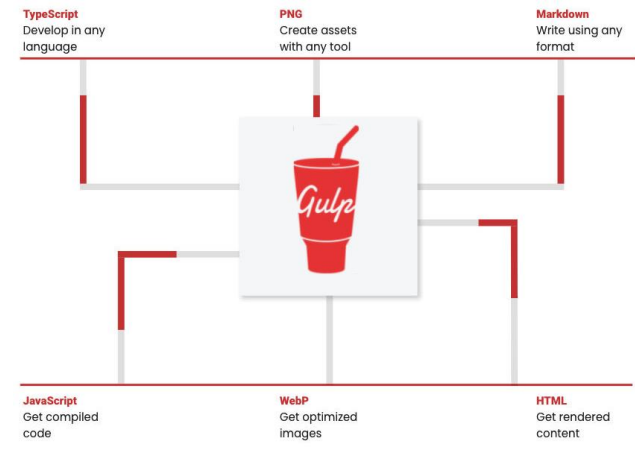

## 一、gulp和webpack

### 1、什幺是Gulp?

什幺是Gulp?

- A toolkit to automate & enhance your workflow; 
- 一个工具包,可以帮你自动化和增加你的工作流;



### 2、Gulp和Webpack

gulp的核心理念是task runner

- 可以定义自己的一系列任务 ,等待任务被执行; 
- 基于文件Stream的构建流;
- 我们可以使用gulp的插件体系来完成某些任务;

webpack的核心理念是module bundler

- webpack是一个模块化的打包工具;
- 可以使用各种各样的 loader来加载不同的模块;
- 可以使用各种各样的插件在webpack打包的生命周期完成其他的任务;

gulp相对于webpack的优缺点:

- gulp相对于webpack思想更加的简单、易用 ,更适合编写一些自动化的任务;
- 但是目前对于大型项目( Vue 、 React 、 Angular )并不会使用gulp来构建,比如默认gulp是不支持模块化的;

## 二、编写gulp的任务

### 1、Gulp的基本使用

首先,我们需要安装gulp:

```bash
# 全局安装
npm install gulp - g
# 局部安装
npm install gulp
```

其次,编写gulpfile.js文件,在其中创建一个任务:

```js
// 编写简单的任务
const foo = async (cb) => {
  console.log("第一个gulp任务");
  cb();
};

module.exports = {
  foo
}
```

 最后,执行gulp命令:  `npx gulp foo`

### 2、创建gulp任务

每个gulp任务都是一个异步的JavaScript 函数:

- 此函数可以接受一个callback作为参数,调用 callback函数那幺任务会结束;
- 或者是一个返回 stream 、 promise 、 event emitter 、 child process或observable类型的函数;

```js
// 编写异步的gulp任务
// async的时候bar函数会返回一个Promise
const bar = (cb) => {
  setTimeout(() => {
    console.log("bar任务被执行~");
    cb();
  }, 2000);
};
```

任务可以是public或者private类型的:

- 公开任务( Public tasks) 从 gulpfile 中被导出( export ),可以通过 gulp 命令直接调用;
- 私有任务( Private tasks) 被设计为在内部使用,通常作为 series() 或 parallel() 组合的组成部分;

补充: gulp4之前, 注册任务时通过gulp.task的方式进行注册的

```js
// 早期编写任务的方式(gulp4.x之前)
gulp.task('foo2', (cb) => {
  console.log("第二个gulp任务")
  cb()
})
```

### 3、默认任务

我们可以编写一个默认任务:

```js
// 默认任务
module.exports.default = (cb) => {
  console.log("default task exec~");
  cb();
};
```

执行 gulp 命令:  `npx gulp`

## 三、gulp的任务组合

**任务组合series和parallel**

通常一个函数中能完成的任务是有限的(放到一个函数中也不方便代码的维护),所以我们会将任务进行组合。

gulp提供了两个强大的组合方法: 

- series() :串行任务组合;
- parallel() :并行任务组合;

```js
const { series, parallel } = require("gulp");

const foo1 = (cb) => {
  setTimeout(() => {
    console.log("foo1 task exec~");
    cb();
  }, 2000);
};

const foo2 = (cb) => {
  setTimeout(() => {
    console.log("foo2 task exec~");
    cb();
  }, 1000);
};

const foo3 = (cb) => {
  setTimeout(() => {
    console.log("foo3 task exec~");
    cb();
  }, 3000);
};

const seriesFoo = series(foo1, foo2, foo3);
const parallelFoo = parallel(foo1, foo2, foo3);

module.exports = {
  seriesFoo,
  parallelFoo,
};
```

## 四、gulp的文件操作

### 1、读取和写入文件

gulp 暴露了 src () 和 dest () 方法用于处理计算机上存放的文件。

- src () 接受参数,并从文件系统中读取文件然后生成一个Node流( Stream ) ,它将所有匹配的文件读取到内存中并通过流( Stream )进行处理;
- 由 src () 产生的流( stream )应当从任务( task函数)中返回并发出异步完成的信号;
- dest () 接受一个输出目录作为参数 ,并且它还会产生一个 Node流 (stream) ,通过该流将内容输出到文件中;

```js
const { src, dest } = require("gulp");

const copyFile = () => {
  // 1.读取文件
  // 2.写入文件
  return src("./src/**/*.js").pipe(dest("./dist"));
};

module.exports = {
  copyFile,
};
```

流( stream )所提供的主要的 API 是 .pipe() 方法, pipe方法的原理是什幺呢?

- pipe方法接受一个 转换流( Transform streams ) 或可写流( Writable streams);
- 那幺转换流或者可写流,拿到数据之后可以对数据进行处理 ,再次传递给下一个转换流或者可写流;

### 2、对文件进行转换

如果在这个过程中,我们希望对文件进行某些处理,可以使用社区给我们提供的插件。

- 比如我们希望 ES6转换成ES5 ,那幺可以使用 babel插件;
- 如果我们希望对代码进行压缩和丑化,那幺可以使用 uglify或者terser插件;

```js
const { src, dest, watch } = require('gulp')

const babel = require('gulp-babel')
const terser = require('gulp-terser')

const jsTask = () => {
  return src("./src/**/*.js")
    .pipe(babel())
    .pipe(terser({ mangle: { toplevel: true } }))
    .pipe(dest("./dist"))
}

module.exports = {
  jsTask
}
```

### 3 、glob文件匹配

src () 方法接受一个 glob 字符串或由多个 glob 字符串组成的数组作为参数,用于确定哪些文件需要被操作。

- glob 或 glob 数组必须至少匹配到一个匹配项,否则 src () 将报错;

glob的匹配规则如下:

- (一个星号*)   `*.js`:在一个字符串中,匹配任意数量的字符,包括零个匹配; 
- (两个星号**)  `./src/**/*.js` :在多个字符串匹配中匹配任意数量的字符串,通常用在匹配目录下的文件;
- (取反 !)  `*!scripts/vendor/*`:
  - 由于 glob 匹配时是按照每个 glob 在数组中的位置依次进行匹配操作的;
  - 所以 glob 数组中的取反( negative ) glob 必须跟在一个非取反( non - negative )的glob 后面; 
  - 第一个 glob 匹配到一组匹配项,然后后面的取反 glob 删除这些匹配项中的一部分;

### 4、Gulp的文件监听

gulp api 中的 watch() 方法利用文件系统的监控程序(file system watcher)将 与进行关联。

```js
const { src, dest, watch } = require('gulp')

const babel = require('gulp-babel')
const terser = require('gulp-terser')

const jsTask = () => {
  return src("./src/**/*.js")
    .pipe(babel())
    .pipe(terser({ mangle: { toplevel: true } }))
    .pipe(dest("./dist"))
}

// watch函数监听内容的改变
watch("./src/**/*.js", jsTask)

module.exports = {
  jsTask
}
```

## 五、gulp案例

接下来,我们编写一个案例,通过gulp来开启本地服务和打包: 

- 打包html 文件;
  - 使用gulp - htmlmin插件;
- 打包JavaScript文件;
  - 使用gulp - babel , gulp - terser插件;
- 打包 less文件;
  - 使用gulp - less插件;
- html 资源注入
  - 使用gulp - inject插件;
- 开启本地服务器
  - 使用 browser- sync插件;
- 创建打包任务
- 创建开发任务

```js
const { src, dest, parallel, series, watch } = require("gulp");

const htmlmin = require("gulp-htmlmin");
const babel = require("gulp-babel");
const terser = require("gulp-terser");
const less = require("gulp-less");

const inject = require("gulp-inject");
const browserSync = require("browser-sync");

// 1.对html进行打包
const htmlTask = () => {
  return src("./src/**/*.html")
    .pipe(htmlmin({ collapseWhitespace: true }))
    .pipe(dest("./dist"));
};

// 2.对JavaScript进行打包
const jsTask = () => {
  return src("./src/**/*.js")
    .pipe(babel({ presets: ["@babel/preset-env"] }))
    .pipe(terser({ toplevel: true }))
    .pipe(dest("./dist"));
};

// 3.对less进行打包
const lessTask = () => {
  return src("./src/**/*.less").pipe(less()).pipe(dest("./dist"));
};

// 4.在html中注入js和css
const injectTask = () => {
  return src("./dist/**/*.html")
    .pipe(
      inject(src(["./dist/**/*.js", "./dist/**/*.css"]), { relative: true })
    )
    .pipe(dest("./dist"));
};

// 5.开启一个本地服务器
const bs = browserSync.create();
const serve = () => {
  watch("./src/**", buildTask);

  bs.init({
    port: 8080,
    open: true,
    files: "./dist/*",
    server: {
      baseDir: "./dist",
    },
  });
};

// 创建项目构建的任务
const buildTask = series(parallel(htmlTask, jsTask, lessTask), injectTask);
const serveTask = series(buildTask, serve);
// webpack搭建本地 webpack-dev-server

module.exports = {
  buildTask,
  serveTask,
};
```

```html
<!DOCTYPE html>
<html lang="en">
<head>
  <meta charset="UTF-8">
  <meta http-equiv="X-UA-Compatible" content="IE=edge">
  <meta name="viewport" content="width=device-width, initial-scale=1.0">
  <title>Gulp Projecct</title>
  <!-- inject:css -->
  <!-- endinject -->
</head>
<body>
  <!-- inject:js -->
  <!-- endinject -->
</body>
</html>
```


