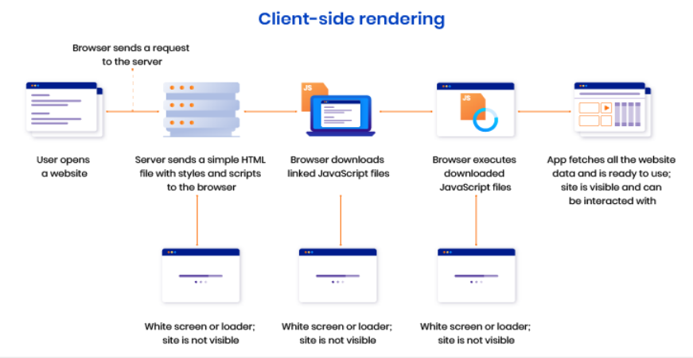
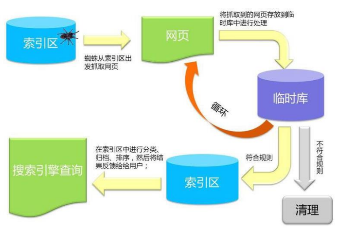
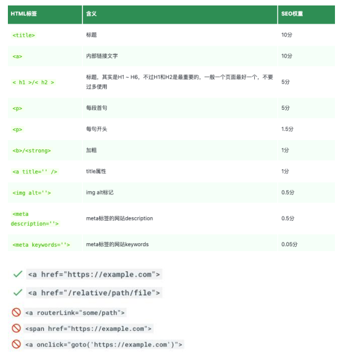
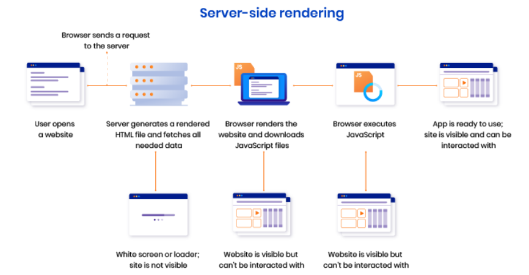
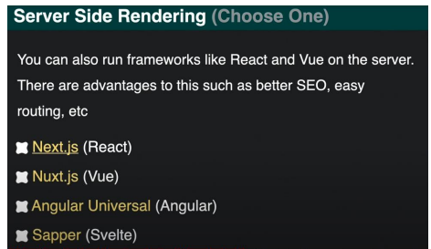

## 1、邂逅SPA与SSR

### 1.1、单页应用程序(SPA)

单页应用程序 (SPA) 全称是: Single-page application, SPA应用是在客户端呈现的(术语称: CRS)。

- SPA应用默认只返回一个空HTML页面,如: body只有<div id= “app" ></div>。
- 而整个应用程序的内容都是通过Javascript动态加载,包括应用程序的逻辑、 UI 以及与服务器通信相关的所有数据。
- 构建SPA应用常见的库和框架有: React、 AngularJS、 Vue.js等。

**客户端渲染原理**



**SPA的优点**

- 只需加载一次
  - SPA应用程序只需要在第一次请求时加载页面,页面切换不需重新加载,而传统的Web应用程序必须在每次请求时都得加载页面,需要花费更多时间。因此, SPA页面加载速度要比传统Web 应用程序更快。
- 更好的用户体验
  - SPA 提供类似于桌面或移动应用程序的体验。用户切换页面不必重新加载新页面
  - 切换页面只是内容发生了变化,页面并没有重新加载,从而使体验变得更加流畅
- 可轻松的构建功能丰富的Web应用程序

**SPA的缺点**

- SPA应用默认只返回一个空HTML页面,不利于SEO (search engine optimization ) 
- 首屏加载的资源过大时,一样会影响首屏的渲染
- 也不利于构建复杂的项目,复杂Web 应用程序的大文件可能变得难以维护

### 1.2、爬虫-工作流程

 Google 爬虫的工作流程分为 3 个阶段,并非每个网页都会经历这3 个阶段: 

- 抓取:
  - 爬虫(也称蜘蛛),从互联网上发现各类网页,网页中的外部连接也会被发现。
  - 抓取数以十亿被发现网页的内容,如:文本、图片和视频

- 索引编制:
  - 爬虫程序会分析网页上的文本、图片和视频文件
  - 并将信息存储在大型数据库(索引区)中。
  - 例如 <title> 元素和Alt 属性、图片、 视频等
  - 爬虫会对内容类似的网页归类分组
  - 不符合规则内容和网站会被清理
    - 如:禁止访问或需要权限网站等等

- 呈现搜索结果:
  - 当用户在Google 中搜索时,搜索引擎会根据内容的类型,选择一组网页中最具代表性的网页进行呈现



### 1.3、搜索引擎的优化(SEO)

语义性HTML标记

- 标题用<h1>,一个页面只有一个; 副标题用<h2>到<h6>。
- 不要过度使用h标签,多次使用不会增加SEO (search engine optimization)。
- 段落用<p>,列表用<ul>,并且li只放在ul 中等等。

每个页面需包含:标题 + 内部链接

- 每个页面对应的title,同一网站所有页面都有内链可以指向首页

确保链接可供抓取,如右图所示:

meta标签优化:设置description keywords等

文本标记和img:

- 比如<b>和<strong>加粗文本的标签,爬虫也会关注到该内容
- img标签添加alt属,图片加载失败,爬虫会取alt内容。

robots.txt文件:规定爬虫可访问您网站上的哪些网址。

sitemap.xml站点地图:在站点地图列出所有网页,确保爬虫不会漏掉某些网页

更多查看: https://developers.google.com/search/docs/crawling-indexing/valid-page-metadata



### 1.4、静态站点生成(SSG)

静态站点生成(SSG) 全称是: Static Site Generate,是预先生成好的静态网站。

- SSG应用一般在构建阶段就确定了网站的内容。
- 如果网站的内容需要更新了,那必须得重新再次构建和部署。
- 构建SSG应用常见的库和框架有: Vue Nuxt、 React Next.js等。

SSG的优点:

- 访问速度非常快,因为每个页面都是在构建阶段就已经提前生成好了。
- 直接给浏览器返回静态的HTML, 也有利于SEO
- SSG应用依然保留了SPA应用的特性,比如:前端路由、响应式数据、虚拟DOM等

SSG的缺点:

- 页面都是静态, 不利于展示实时性的内容,实时性的更适合SSR。
- 如果站点内容更新了,那必须得重新再次构建和部署。

### 1.5、服务器端渲染(SSR)

服务器端渲染全称是: Server Side Render,在服务器端渲染页面,并将渲染好HTML返回给浏览器呈现。

- SSR应用的页面是在服务端渲染的,用户每请求一个SSR页面都会先在服务端进行渲染,然后将渲染好的页面,返回给浏览器呈现。
- 构建SSR应用常见的库和框架有: Vue Nuxt、 React Next.js等(SSR应用也称同构应用)。

服务器端渲染原理



**SSR的优点**

- 更快的首屏渲染速度
  - 浏览器显示静态页面的内容要比JavaScript 动态生成的内容快得多。
  - 当用户访问首页时可立即返回静态页面内容,而不需要等待浏览器先加载完整个应用程序。
- 更好的SEO
  - 爬虫是最擅长爬取静态的HTML页面,服务器端直接返回一个静态的HTML给浏览器。
  - 这样有利于爬虫快速抓取网页内容,并编入索引,有利于SEO。
- SSR应用程序在 Hydration之后依然可以保留 Web 应用程序的交互性。比如:前端路由、响应式数据、虚拟DOM等。

**SSR的缺点**

- SSR 通常需要对服务器进行更多 API 调用,以及在服务器端渲染需要消耗更多的服务器资源, 成本高。
- 增加了一定的开发成本,用户需要关心哪些代码是运行在服务器端,哪些代码是运行在浏览器端。
- SSR配置站点的缓存通常会比SPA站点要复杂一点。

### 1.6、SSR解决方案

SSR的解决方案:

- 方案一: php、 jsp ...
- 方案二:从零搭建SSR项目( Node+webpack+Vue/React) 
- 方案三:直接使用流行的框架(推荐)
  - React : Next.js
  -  Vue3 : Nuxt3 | |Vue2 : Nuxt.js
  - Angular :Anglular Universal



SSR应用场景非常广阔,比如:

- SaaS产品,如:电子邮件网站、在线游戏、客户关系管理系统(CRM)、采购系统等
- 门户网站、电子商务、零售网站
- 单个页面、静态网站、文档类网站
- 等等


## 2、Node服务搭建

需安装的依赖项:

- `npm i express`
- `npm i–D nodemon`
- `npm i -D webpack webpack-cli webpack-node-externals`

nodemon:

- 启动Node程序时并监听文件的变化,变化即刷新

webpack-node-externals:

- 排除掉node_modules 中所以的模块

## 3、Vue3+SSR搭建

### 3.1、邂逅Vue3 + SSR

Vue除了支持开发SPA应用之外,其实也是支持开发SSR应用的。

在Vue中创建SSR应用,需要调用createSSRApp函数,而不是createApp 

- createApp:创建应用,直接挂载到页面上
- createSSRApp:创建应用,是在激活的模式下挂载应用

服务端用 @vue/server-renderer包中的 renderToString 来进行渲染。

```js
let express = require("express");
let server = express();
import createApp from "../app";
import { renderToString } from "@vue/server-renderer";

server.get("/", async (req, res) => {
  let app = createApp();
  let appStringHtml = await renderToString(app);
  res.send(
    `
    <!DOCTYPE html>
    <html lang="en">
    <head>
      <meta charset="UTF-8">
      <meta http-equiv="X-UA-Compatible" content="IE=edge">
      <meta name="viewport" content="width=device-width, initial-scale=1.0">
      <title>Document</title>
    </head>
    <body>
      <h1>Vue3 Serve Side Render</h1>
      <div id="app">
        ${appStringHtml}
      </div>
    </body>
    </html>
    `
  );
});

server.listen(3000, () => {
  console.log("start node server on 3000 ~");
});
```

### 3.2、Vue3 + SSR搭建

需安装的依赖项:

- `npm i express `
- `npm i–D nodemon`
- `npm i vue`
- `npm i -D vue-loader`
- `npm i -D babel-loader @babel/preset-env`
- `npm i -D webpack webpack-cli`
- `npm i -D webpack-merge webpack-node-externals`

vue-loader: 加载.vue文件

webpack-merge: 用来合并webpack配置

babel-loader、 @babel/preset-env 

- 加载JS文件,转换新语法

### 3.3、跨请求状态污染

在SPA中,整个生命周期中只有一个App对象实例 或一个Router对象实例或一个Store对象实例都是可以的,因为每个用户在使用浏览器访问SPA应用时,应用模块都会重新初始化,这也是一种单例模式。

然而,在SSR 环境下, App应用模块通常只在服务器启动时初始化一次。同一个应用模块会在多个服务器请求之间被复用,而我们的单例状态对象也一样,也会在多个请求之间被复用,比如:

- 当某个用户对共享的单例状态进行修改,那么这个状态可能会意外地泄露给另一个在请求的用户。
- 我们把这种情况称为: 跨请求状态污染。

为了避免这种跨请求状态污染, SSR的解决方案是:

- 可以在每个请求中为整个应用创建一个全新的实例,包括后面的 router 和全局 store等实例。
- 所以我们在创建App或路由 或Store对象时都是使用一个函数来创建,保证每个请求都会创建一个全新的实例。
- 这样也会有缺点:需要消耗更多的服务器的资源。

## 4、Vue3 SSR + Hydration

服务器端渲染页面 + 客户端激活页面,是页面有交互效果(这个过程称为: Hydration水合)

Hydration的具体步骤如下:

- 开发一个App应用,比如App.vue
- 将App.vue打包为一个客户端的client_bundle.js文件
  - 用来激活应用,使页面有交互效果
- 将App.vue打包为一个服务器端的server_bundle.js文件
  - 用来在服务器端动态生成页面的HTML
- server_bundle.js渲染的页面 + client_bundle.js文件进行Hydration

```js
let express = require("express");
let server = express();
import createApp from "../app";
import { renderToString } from "@vue/server-renderer";

// 部署 静态资源
server.use(express.static("build"));

server.get("/", async (req, res) => {
  let app = createApp();
  let appStringHtml = await renderToString(app);
  res.send(
    `
    <!DOCTYPE html>
    <html lang="en">
    <head>
      <meta charset="UTF-8">
      <meta http-equiv="X-UA-Compatible" content="IE=edge">
      <meta name="viewport" content="width=device-width, initial-scale=1.0">
      <title>Document</title>
    </head>
    <body>
      <h1>Vue3 Serve Side Render</h1>
      <div id="app">
        ${appStringHtml}
      </div>
      <script src="/client/client_bundle.js"></script>
    </body>
    </html>
    `
  );
});

server.listen(3000, () => {
  console.log("start node server on 3000 ~");
});
```

## 5、Vue3 SSR + Router

需再安装的依赖项: 

- `npm ivue-router`

注意事项:

- 为了避免跨请求状态污染
- 需在每个请求中都创建一个全新router

```js
import { createRouter } from "vue-router";

const routes = [
  {
    path: "/",
    component: () => import("../views/home.vue"),
  },
  {
    path: "/about",
    component: () => import("../views/about.vue"),
  },
];

export default function (history) {
  return createRouter({
    history,
    routes,
  });
}
```

```js
// server
let express = require("express");
let server = express();
import createApp from "../app";
import { renderToString } from "@vue/server-renderer";
import createRouter from "../router";
// 内存路由-> node用
import { createMemoryHistory } from "vue-router";

// 部署 静态资源
server.use(express.static("build"));

// /  or /about
server.get("/*", async (req, res) => {
  let app = createApp();

  // app 安装路由插件
  let router = createRouter(createMemoryHistory());
  app.use(router);
  await router.push(req.url || "/"); //  /  or /about 等待页面跳转好
  await router.isReady(); // 等待(异步)路由加载完成,在渲染页面

  let appStringHtml = await renderToString(app);
  res.send(
    `
    <!DOCTYPE html>
    <html lang="en">
    <head>
      <meta charset="UTF-8">
      <meta http-equiv="X-UA-Compatible" content="IE=edge">
      <meta name="viewport" content="width=device-width, initial-scale=1.0">
      <title>Document</title>
    </head>
    <body>
      <h1>Vue3 Serve Side Render</h1>
      <div id="app">
        ${appStringHtml}
      </div>
      <script src="/client/client_bundle.js"></script>
    </body>
    </html>
    `
  );
});

server.listen(3000, () => {
  console.log("start node server on 3000 ~");
});
```

```js
// client
import { createApp } from "vue";
import { createWebHistory } from "vue-router";
import App from "../App.vue";
import createRouter from "../router";
// spa
let app = createApp(App);

// 安装路由插件
let router = createRouter(createWebHistory());
app.use(router);

router.isReady().then(() => {
  app.mount("#app");
});
```

## 6、Vue3 SSR + Pinia

需再安装的依赖项: 

- `npm i pinia`

注意事项:

- 为了避免跨请求状态污染
- 需在每个请求中都创建一个全新pinia

```js
import { defineStore } from "pinia";

export const useHomeStore = defineStore("home", {
  state() {
    return {
      count: 1000,
    };
  },
  actions: {
    increment() {
      this.count++;
    },
    decrement() {
      this.count--;
    },
    // async fetchHomeData() {
    //   let res = await axios.get()
    //   this.homeInfo = res.data
    // }
  },
});
```

```js
// server
let express = require("express");
let server = express();
import createApp from "../app";
import { renderToString } from "@vue/server-renderer";
import createRouter from "../router";
// 内存路由-> node用
import { createMemoryHistory } from "vue-router";
import { createPinia } from "pinia";
// 部署 静态资源
server.use(express.static("build"));

// /  or /about
server.get("/*", async (req, res) => {
  let app = createApp();

  // app 安装路由插件
  let router = createRouter(createMemoryHistory());
  app.use(router);
  await router.push(req.url || "/"); //  /  or /about 等待页面跳转好
  await router.isReady(); // 等待(异步)路由加载完成,在渲染页面

  // app 安装pinia插件
  let pinia = createPinia();
  app.use(pinia);

  let appStringHtml = await renderToString(app);
  res.send(
    `
    <!DOCTYPE html>
    <html lang="en">
    <head>
      <meta charset="UTF-8">
      <meta http-equiv="X-UA-Compatible" content="IE=edge">
      <meta name="viewport" content="width=device-width, initial-scale=1.0">
      <title>Document</title>
    </head>
    <body>
      <h1>Vue3 Serve Side Render</h1>
      <div id="app">
        ${appStringHtml}
      </div>
      <script src="/client/client_bundle.js"></script>
    </body>
    </html>
    `
  );
});

server.listen(3000, () => {
  console.log("start node server on 3000 ~");
});
```

```js
// client
import { createApp } from "vue";
import { createWebHistory } from "vue-router";
import App from "../App.vue";
import createRouter from "../router";
import { createPinia } from "pinia";
// spa
let app = createApp(App);

// 安装路由插件
let router = createRouter(createWebHistory());
app.use(router);

// app 安装pinia插件
let pinia = createPinia();
app.use(pinia);

router.isReady().then(() => {
  app.mount("#app");
});
```


