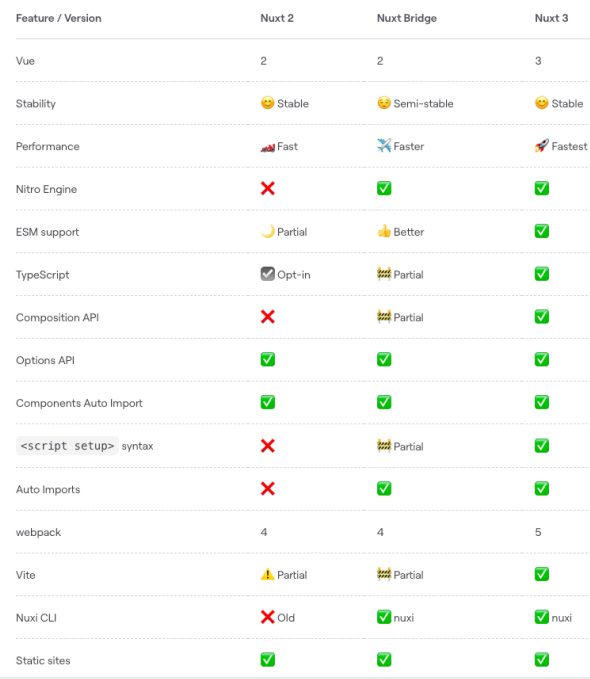
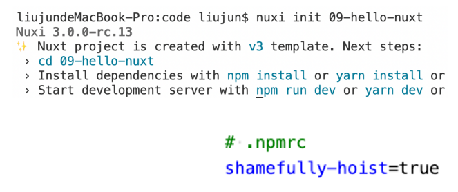
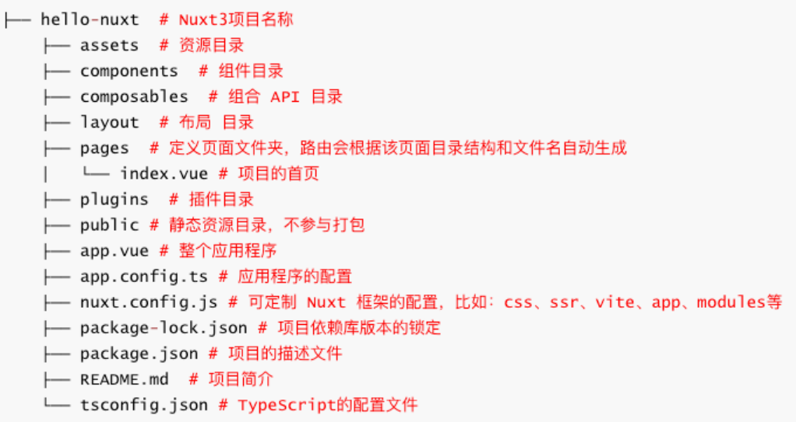
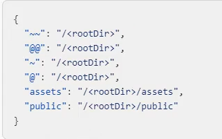
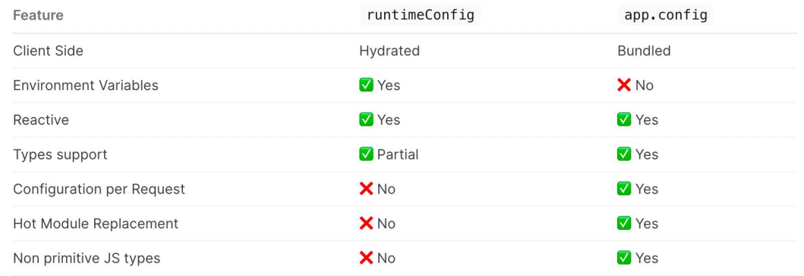
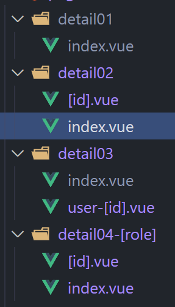
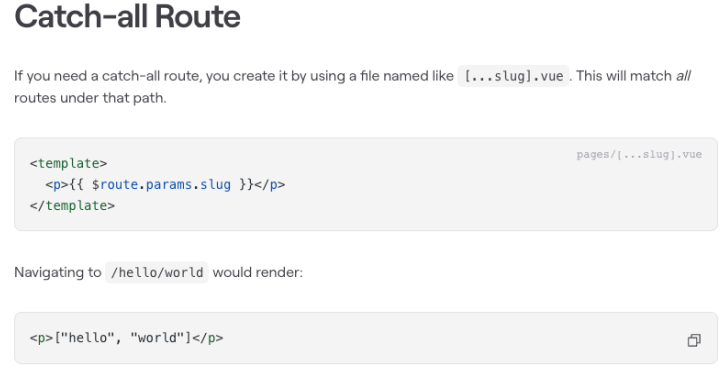
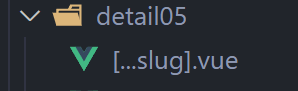
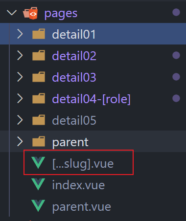

## 1、邂逅Nuxt3

### 1.1、什么是Nuxt?

在了解 Nuxt之前,我们先来了解一下创建一个现代应用程序,所需的技术: 

- 支持数据双向绑定和组件化( Nuxt选择了Vue.js 。)
- 处理客户端的导航( Nuxt选择了vue-router )。
- 支持开发中热模块替换和生产环境代码打包( Nuxt支持webpack 5和Vite 。)
- 兼容旧版浏览器,支持最新的JavaScript 语法转译( Nuxt使用esbuild 。)
- 应用程序支持开发环境服务器,也支持服务器端渲染或API接口开发。
- Nuxt使用 h3来实现部署可移植性(h3是一个极小的高性能的http框架) 
  - 如:支持在Serverless、 Workers 和 Node.js环境中运行。

Nuxt是一个 直观的 Web 框架

- 自 2016 年 10 月以来, Nuxt专门负责集成上述所描述的事情 ,并提供前端和后端的功能。
- Nuxt框架可以用来快速构建下一个Vue.js应用程序,如支持CSR 、 SSR、 SSG渲染模式的应用等。

### 1.2、Nuxt发展史

**Nuxt.js**

- 诞生于2016 年 10月 25号,由 Sebastien Chopin创建,主要是基于Vue2 、 Webpack2 、 Node和 Express。
- 在2018 年 1 月 9 日, Sebastien Chopin正式宣布,发布 Nuxt.js 1.0版本。
  - 重要的变化是放弃了对 node < 8 的支持
- 2018 年9 月 21 日, , Sebastien Chopin正式宣布,发布 Nuxt.js 2.0版本。
  - 开始使用Webpack 4及其技术栈, 其它的并没有做出重大更改。
- 2021年8月12日至今, Nuxt.js最新的版本为: Nuxt.js 2.15.8

**Nuxt3版本**

- 经过 16 个月的工作, Nuxt 3 beta 于2021 年 10 月 12 日发布, 引入了基于Vue 3、 Vite和 Nitro(服务引擎) 。
- 六个月后, 2022 年4 月 20 日, Pooya Parsa 宣布 Nuxt 3 的第一个候选版本,代号为“Mount Hope”
- 在2022年11月16号, Pooya Parsa 再次宣布 Nuxt3发布为第一个正式稳定版本。

> 官网地址: https://nuxt.com/

### 1.3、Nuxt3特点

Vue技术栈

- Nuxt3是基于Vue3 + Vue Router + Vite等技术栈, 全程Vue3+Vite开发体验(Fast)。

自动导包

- Nuxt会自动导入辅助函数、组合API和Vue API ,无需手动导入。
- 基于规范的目录结构, Nuxt还可以对自己的组件、 插件使用自动导入。

约定式路由(目录结构即路由) 

- Nuxt路由基于vue-router,在 pages/目录中创建的每个页面,都会根据目录结构和文件名来自动生成路由

渲染模式: Nuxt支持多种渲染模式(SSR、 CSR、 SSG等)

利于搜索引擎优化:服务器端渲染模式,不但可以提高首屏渲染速度,还利于SEO

服务器引擎

- 在开发环境中,它使用 Rollup 和 Node.js 。
- 在生产环境中,使用 Nitro 将您的应用程序和服务器构建到一个通用.output目录中。
  - Nitro服务引擎提供了跨平台部署的支持,包括 Node、 Deno、 Serverless、 Workers等平台上部署。



## 2、Nuxt3初体验

### 2.1、Nuxt3环境搭建

在开始之前,请确保您已安装推荐的设置:

- Node.js (最新 LTS 版本,或 16.11以上) 
- VS Code
  - Volar、 ESLint、 Prettier

命令行工具,新建项目(hello-nuxt)

- 方式一: `npx nuxi init hello-nuxt`
- 方式二: `pnpm dlx nuxi init hello-nuxt`
- 方式三: `npm install–g nuxi` && `nuxi init hello-nuxt`

运行项目: cd hello-nuxt

- `yarn install`
- `pnpm install --shamefully-hoist` (创建一个扁平的 node_modules 目录结构,类似npm 和yarn) 
- `yarn dev`



**创建项目报错**

执行npx nuxi init01-hello-nuxt报如下错误,主要是网络不通导致:

解决方案:

- 第一步: ping raw.githubusercontent.com 检查是否通
- 第二步:如果访问不通,代表是网络不通
- 第三步:配置 host,本地解析域名
  - Mac电脑host配置路径: /etc/hosts
  - Win 电脑host配置路由: c:/Windows/System32/drivers/etc/hosts 
- 第四步:在host文件中新增一行 ,编写如下配置:
  - 185.199.108.133 raw.githubusercontent.com
- 第五步:重新ping域名,如果通了就可以用了
- 第六部:重新开一个终端创建项目即可

### 2.2、Nuxt3 目录结构



### 2.3、应用入口(App.vue)

默认情况下, Nuxt会将此文件视为入口点,并为应用程序的每个路由呈现其内容,常用于: 

- 定义页面布局Layout或 自定义布局,如: NuxtLayout
- 定义路由的占位,如: NuxtPage
- 编写全局样式
- 全局监听路由 等等

```vue
<template>
  <NuxtLayout>
    <NuxtPage></NuxtPage>
  </NuxtLayout>
</template>
<script setup lang="ts">
// 监听全局路由
const router = useRouter();
router.beforeEach((to, form) => {});
</script>
```

## 3、Nuxt3全局配置

### 3.1、Nuxt配置(nuxt.config)

nuxt.config.ts配置文件位于项目的根目录,可对Nuxt进行自定义配置。比如,可以进行如下配置:

- runtimeConfig:运行时配置,即定义环境变量
  - 可通过.env文件中的环境变量来覆盖,优先级(.env > runtimeConfig)
    - .env的变量会打入到process.env中,符合规则的会覆盖runtimeConfig的变量
    - .env一般用于某些终端启动应用时动态指定配置,同时支持dev和pro
- appConfig: 应用配置,定义在构建时确定的公共变量,如: theme
  - 配置会和app.config.ts的配置合并(优先级app.config.ts > appConfig)
- app: app配置
  - head:给每个页面上设置head信息, 也支持useHead 配置和内置组件。
- ssr:指定应用渲染模式
- router:配置路由相关的信息,比如在客户端渲染可以配置hash路由
- alias:路径的别名,默认已配好
- modules:配置Nuxt扩展的模块,比如: @pinia/nuxt @nuxt/image
- routeRules:定义路由规则,可更改路由的渲染模式或分配基于路由缓存策略(公测阶段)
- builder:可指定用vite还是webpack来构建应用,默认是vite。如切换为webpack还需要安装额外的依赖。

**runtimeConfig**

```js
export default defineNuxtConfig({
  // 1.这里定义的运行时配置会不会打入到 process.env
  runtimeConfig: {
    appKey: "aabbcc", // server
    public: {
      baseURL: "http://codercba.com", // server and client -> client_bundle.js
    },
  },
});
```

```vue
<script setup>
// 1.判断代码之心的环境
if (process.server) {
  console.log("运行在 server");
}

if (process.client) {
  console.log("运行在 client");
}

if (typeof window === "object") {
  console.log("运行在 client");
}

// 2.获取运行时配置( server and client )
const runtimeConfig = useRuntimeConfig();
if (process.server) {
  console.log(runtimeConfig.appKey);
  console.log(runtimeConfig.public.baseURL);
}
if (process.client) {
  // console.log(runtimeConfig.appKey); // not
  console.log(runtimeConfig.public.baseURL);
}
console.log(process.env.appKey); // undefined
</script>
```

**app**

```js
export default defineNuxtConfig({
  // 3.app 配置
  app: {
    // 给app所有的页面的head添加的配置(SEO, 添加外部的资源)
    head: {
      title: "HYKJ",
      charset: "UTF-8",
      viewport:
        "width=device-width, initial-scale=1.0, maximum-scale=1.0, minimum-scale=1.0,user-scalable=no",
      meta: [
        {
          name: "keywords",
          content: "弘源科教 hykj",
        },
        {
          name: "description",
          content: "手机商城 hykj",
        },
      ],
      link: [
        {
          rel: "shortcut icon",
          href: "favicon.ico",
          type: "image/x-icon",
        },
      ],
      style: [
        {
          children: `body{ color: red; }`,
        },
      ],
      script: [
        {
          src: "http://codercba.com",
        },
      ],
    },
  },
});

```

```vue
<script setup>
// 4.动态的给app所有的页面添加 head的内容
useHead({
  title: "app useHead", // Ref
  bodyAttrs: {
    class: "liujun",
  },
  meta: [
    {
      name: "dsec",
      content: "广州弘源科教 hy kj",
    },
  ],
  style: [],
  link: [],
  // script: [
  //   {
  //     src: "http://liujun.com",
  //     body: true,
  //   },
  // ],
});
</script>
<template>
  <div>
    <h2>Hello Nuxt3</h2>
    <Title>Template Title</Title>
    <Meta name="key" content="key key key"></Meta>
  </div>
</template>
```

**spa**

```js
export default defineNuxtConfig({
  // 4.spa
  ssr: false,
  router: {
    options: {
      hashMode: true, // 只在spa应用是有效的
    },
  },
});
```

### 3.2、应用配置(app.config)

Nuxt 3 提供了一个app.config.ts应用配置文件,用来定义在构建时确定的公共变量,例如: 

- 网站的标题、主题色以及任何不敏感的项目配置

app.config.ts配置文件中的选项不能使用env环境变量来覆盖,与 runtimeConfig不同

> 不要将秘密或敏感信息放在app.config.ts文件中,该文件是客户端公开

```js
export default defineAppConfig({
  title: "Hello Nuxt3 liujun",
  theme: {
    primary: "blue",
  },
});
```

```vue
<script setup>
// 获取appConfig
let appConifg = useAppConfig();
// server client
console.log(appConifg.title);
console.log(appConifg.theme.primary);

onMounted(() => {
  document.title = appConifg.title;
});
</script>

```

**alias**



### 3.3、runtimeConifg vs app.config

runtimeConfig 和 app.config都用于向应用程序公开变量。要确定是否应该使用其中一种,以下是一些指导原则: 

- runtimeConfig: 定义环境变量,比如: 运行时需要指定的私有或公共token。
- app.config: 定义公共变量,比如:在构建时确定的公共token、网站配置。



## 4、Nuxt3内置组件

Nuxt3 框架也提供一些内置的组件,常用的如下:

- SEO组件: Html、 Body、 Head、 Title、 Meta、 Style、 Link、 NoScript、Base 
- NuxtWelcome:欢迎页面组件,该组件是 @nuxt/ui的一部分
- NuxtLayout:是 Nuxt 自带的页面布局组件
- NuxtPage:是 Nuxt 自带的页面占位组件
  - 需要显示位于目录中的顶级或嵌套页面 pages/
  - 是对router-view的封装
- ClientOnly:该组件中的默认插槽的内容只在客户端渲染
  - 而fallback插槽的内容只在服务器端渲染
- NuxtLink:是 Nuxt 自带的页面导航组件
  - 是Vue Router`<RouterLink>`组件和 HTML`<a>`标签的封装。
- 等等

```vue
<template>
  <div>
    <h1>App</h1>
    <!--是 对 router-view 封装 -->
    <NuxtPage></NuxtPage>
  </div>
</template>
```

```vue
// page/index.vue
<template>
  <div class="home">
    <div>我是Home Page</div>

    <ClientOnly fallback-tag="h3" fallback="loading....">
      <div>我只会在 client 渲染</div>
    </ClientOnly>

    // 支持插槽
    <ClientOnly>
      <div>我只会在 client 渲染</div>
      <template #fallback>
        <h2>服务器端渲染的 loading 页面</h2>
      </template>
    </ClientOnly>
  </div>
</template>
```

## 5、Nuxt3样式和资源

### 5.1、全局样式

编写全局样式步骤

1. 在assets中编写全局样式,比如: globel.scss 
2. 在nuxt.config中的css选项中配置
3. 执行`npm i –D sass`

```js
// nuxt.config.js
export default defineNuxtConfig({
  css: [
    "@/assets/styles/main.css",
    "@/assets/styles/global.scss",
  ],
});
```

定义全局变量步骤

1. 在assets中编写全局样式变量,比如: _colors.scss
2. 接着在nuxt.config中的vite选项中配置
3. 然后就可以在任意组件中或scss文件中直接使用全局变量

```vue
<style scoped lang="scss">
/* 1.手动导入全局样式 */
/* @import "~/assets/styles/variables.scss"; */

// as vb: 给这个模块起一个命名空间
// as * : 可以省略命名空间
// @use 和 @import
/* @use "~/assets/styles/variables.scss" as bv; */
/* @use "~/assets/styles/variables.scss" as *; */

.local-style {
  /* color: vb.$fsColor; */
  color: $fsColor;
  font-size: $fs20;
  @include border();
}
</style>
```

```js
export default defineNuxtConfig({
  css: [
    "@/assets/styles/main.css",
    "@/assets/styles/global.scss",
    "@/assets/cus-font/iconfont.css", // 自定字体图标
  ],
  vite: {
    css: {
      preprocessorOptions: {
        scss: {
          // 自动的给 scss 模块首行添加额外的数据:@use "@/assets/styles/variables.scss" as *;
          additionalData: '@use "@/assets/styles/variables.scss" as *;',
        },
      },
    },
  },
});
```

### 5.2、资源的导入

public目录

- 用作静态资产的公共服务器,可在应用程序上直接通过 URL直接访问
- 比如:引用public/img/ 目录中的图像文件
  - 在静态 URL 中可用/img/nuxt.png,如右图
  - 静态的URL也支持在背景中使用

assets目录

- assets经常用于存放如样式表、字体或 SVG的资产
- 可以使用 ~/assets/路径引用位于assets目录中的资产文件
- ~/assets/ 路径也支持在背景中使用

```vue
<script setup>
import ImgFeel from "@/assets/images/feel.png";
</script>

<template>
  <div>
    <!-- public资源的访问 -->
    
    <div class="bg-public"></div>

    <!-- assets资源的访问 -->
    
    
    
    <!-- base64 、 url -->
    <div class="bg-assets"></div>
  </div>
</template>
<style lang="scss">
.bg-public {
  width: 200px;
  height: 200px;
  border: 1px solid red;
  background-image: url(/user.png);
}
.bg-assets {
  width: 140px;
  height: 140px;
  border: 1px solid red;
  /* background-image: url(~/assets/images/avatar.png); */
  background-image: url(@/assets/images/avatar.png);
}
</style>
```

### 5.3、字体图标

字体图标使用步骤

1. 将字体图标存放在assets目录下
2. 字体文件可以使用 ~/assets/ 路径引用。
3. 在nuxt.config配置文件中导入全局样式
4. 在页面中就可以使用字体图标了

```js
export default defineNuxtConfig({
  css: [
    "@/assets/styles/main.css",
    "@/assets/styles/global.scss",
    "@/assets/cus-font/iconfont.css", // 导入字体图标
  ],
});
```

```vue
<template>
  <div>
    <!-- 字体图片的使用 -->
    <i class="iconfont icon-cart"></i>
    <i class="iconfont icon-edit"></i>
  </div>
</template>
<style lang="scss">
.iconfont {
  font-size: 50px;
  color: red;
}
</style>
```

## 6、Nuxt3页面和导航

### 6.1、新建页面

Nuxt项目中的页面是在 pages目录下创建的

在pages目录创建的页面, Nuxt会根据该页面的目录结构和其文件名来自动生成对应的路由。

页面路由也称为文件系统路由器(file system router),路由是Nuxt的核心功能之一

新建页面步骤

1. 创建页面文件,比如: pages/index.vue
2. 将`<NuxtPage/>` 内置组件添加到 app.vue
3. 页面如果使用scss那么需要安装: `npm i sass -D`

命令快速创建页面

- `npx nuxi add page home` #创建home页面
- `npx nuxi add page detail/[id]` #创建detail页面
- `npx nuxi add page user-[role]/[id]` #创建user页面

### 6.2、组件导航(NuxtLink)

`<NuxtLink>`是Nuxt内置组件,用来实现页面导航, 是对 RouterLink的扩展,比如:进入视口的链接启用预取资源等。

- 底层是一个`<a>`标签,因此使用 a + href属性也支持路由导航
- 但是用a标签导航会有触发浏览器默认刷新事件,而 NuxtLink不会, NuxtLink还扩展了其它的属性和功能

应用Hydration后(已激活,可交互),页面导航会通过前端路由来实现。这可以防止整页刷新。 当然,手动输入URL后,点击刷新浏览器也可导航,这会导致整个页面刷新

NuxtLink组件属性:

- to: 支持路由路径、路由对象、 URL
- href: to 的别名
- replace: 默认为 false , 是否替换当前路由
- activeClass: 激活链接的类名
- target: 和 a 标签的 target 一样,指定何种方式显示新页面
- 等等

```vue
<template>
  <div>
    <div>
      <!-- router-link -->
      <NuxtLink to="/">
        <button>home</button>
      </NuxtLink>

      <NuxtLink
        :to="{
          path: '/category',
          query: {
            id: 100,
          },
        }">
        <button>category</button>
      </NuxtLink>

      <NuxtLink href="/cart">
        <button>cart</button>
      </NuxtLink>

      <NuxtLink href="/profile" active-class="active-liujun">
        <button>profile</button>
      </NuxtLink>

      <NuxtLink href="/find" replace>
        <button>find replace</button>
      </NuxtLink>

      <a href="/more">
        <button>more a 标签</button>
      </a>

      <NuxtLink to="https://www.jd.com" target="_blank">
        <button>jd.com</button>
      </NuxtLink>
    </div>

    <!-- 是对router-view的封装 -->
    <NuxtPage></NuxtPage>
  </div>
</template>
```

### 6.3、编程导航

Nuxt3除了可以通过`<NuxtLink>`内置组件来实现导航,同时也支持编程导航: navigateTo。

通过编程导航,在应用程序中就可以轻松实现动态导航了,但是编程导航不利于SEO。

navigateTo 函数在服务器端和客户端都可用,也可以在插件、中间件中使用,也可以直接调用以执行页面导航,例如: 

- 当用户触发该goToProfile()方法时,我们通过navigateTo函数来实现动态导航。
- 建议: goToProfile方法总是返回 navigateTo 函数(该函数不需要导入)或返回异步函数

navigateTo(to, options) 函数:

- to:可以是纯字符串 或外部URL或路由对象,如右图所示:
- options:导航配置,可选
  - replace:默认为false,为true时会替换当前路由页面
  - external: 默认为false,不允许导航到外部连接, true则允许
  - 等等

```vue
<script setup>
function goToCategory() {
  return navigateTo("/category");
}

function goToCategoryById() {
  return navigateTo(
    {
      path: "/category",
      query: {
        id: 200,
      },
    },
    {
      replace: true, // 是否是替换当前的页面
    }
  );
}

async function doNavigateTos() {
  await navigateTo("https://www.jd.com", {
    external: true,
  });
}
</script>

<template>
  <div>
    <div>
      <!-- 1.组件的方式 -->
      <NuxtLink to="/">
        <button>home</button>
      </NuxtLink>

      <!-- 2.通过navigateTo -->
      <NuxtLink @click="goToCategory">
        <button>category</button>
      </NuxtLink>

      <button @click="goToCategory">category</button>
    </div>

    <!-- 是对router-view的封装 -->
    <NuxtPage></NuxtPage>
  </div>
</template>
```

Nuxt3中的编程导航除了可以通过 navigateTo来实现导航,同时也支持 useRouter (或OptionsAPI 的this.$router)

useRouter常用的API

- back:页面返回,和一样 router.go(-1)
- forward:页面前进,同 router.go(1)
- go:页面返回或前进,如 router.go(-1) orrouter.go(1) 
- push:以编程方式导航到新页面。建议改用 navigateTo。支持性更好
- replace:以编程方式导航到新页面,但会替换当前路由。建议改用 navigateTo。支持性更好
- beforeEach:路由守卫钩子,每次导航前执行(用于全局监听) 
- afterEach:路由守卫钩子,每次导航后执行(用于全局监听) 
- .....

```vue
<script setup>
// useRouter
let router = useRouter();
function goToCart() {
  router.push("/cart"); // navigateTo
}
function goBack() {
  router.go(-1);
}

// 路由的守卫
router.beforeEach((to, form) => {
  console.log(to);
  console.log(form);
});
</script>

<template>
  <div>
    <div>
      <!-- 3.通过编程的方式进行导航 -->
      <button @click="goToCart">cart</button>

      <button @click="goBack">Back</button>
    </div>

    <!-- 是对router-view的封装 -->
    <NuxtPage></NuxtPage>
  </div>
</template>
```

## 7、Nuxt3动态路由

### 7.1、动态路由

Nuxt3和Vue一样,也是支持动态路由的,只不过在Nuxt3中, 动态路由也是根据目录结构和文件的名称自动生成。

动态路由语法:

- 页面组件目录或页面组件文件都支持 [] 方括号语法
- 方括号里编写动态路由的参数。

例如,动态路由 支持如下写法:

- pages/detail/[id].vue -> /detail/:id
- pages/detail/user-[id].vue -> /detail/user-:id 
- pages/detail/[role]/[id].vue -> /detail/:role/:id 
- pages/detail-[role]/[id].vue -> /detail-:role/:id

注意事项:

- Nuxt3中动态路由 和 index.vue能同时存在, Next.js也是可以

### 7.2、路由参数(useRoute)

**动态路由参数**

1. 通过 [] 方括号语法定义动态路由,比如: /detail/[id].vue
2. 页面跳转时,在URL路径中传递动态路由参数,比如: /detail/10010 
3. 目标页面通过 route.params获取动态路由参数, 如下图所示:

**查询字符串参数**

1. 页面跳转时,通过查询字符串方式传递参数,比如: /detail/10010?name=liujun 
2. 目标页面通过 route.query 获取查询字符串参数



```vue
<template>
  <div>
    <NuxtLink to="/">
      <button>Home</button>
    </NuxtLink>

    <NuxtLink to="/detail01">
      <button>detail01</button>
    </NuxtLink>

    <NuxtLink to="/detail02">
      <button>detail02/index</button>
    </NuxtLink>

    <NuxtLink to="/detail02/abc?name=liujun">
      <button>detail02/abc</button>
    </NuxtLink>

    <NuxtLink to="/detail03/user-1234">
      <button>detail03/user-1234</button>
    </NuxtLink>

    <NuxtLink to="/detail04-admin">
      <button>detail04-admin</button>
    </NuxtLink>

    <NuxtLink to="/detail04-admin/abc">
      <button>detail04-admin/abc</button>
    </NuxtLink>

    <NuxtLink to="/detail05/abc">
      <button>detail05/abc</button>
    </NuxtLink>

    <NuxtLink to="/parent">
      <button>parent</button>
    </NuxtLink>

    <NuxtPage></NuxtPage>
  </div>
</template>
```

```vue
// /detail02/abc?name=liujun
<script lang="ts" setup>
// 拿到动态路由的参数
const route = useRoute();
const { id } = route.params;
const { name } = route.query;
</script>

<template>
  <div>Page: detail02 id={{ id }} name={{ name }}</div>
</template>
```

```vue
// /detail04-admin/abc
<script lang="ts" setup>
// 拿到动态路由的参数
const route = useRoute();
const { role, id } = route.params;
</script>

<template>
  <div>Page: detail04 role={{ role }} id={{ id }}</div>
</template>
```

### 7.3、404 Page

捕获所有不配路由 (即 404 notfound页面)

- 通过在方括号内添加三个点 ,如: [...slug].vue语法,其中slug可以是其它字符串。
- 除了支持在 pages根目录下创建,也支持在其子目录中创建。
- Nuxt3正式版不支持404.vue页面了,以前的候选版是支持的404.vue,但是Next.js是支持。
- 404页面也可以通过 useRoute().param.xxx来获取路由参数。





```vue
<template>
  <div>
    <NuxtLink to="/detail05/abc">
      <button>detail05/abc</button>
    </NuxtLink>

    <NuxtPage></NuxtPage>
  </div>
</template>
```

```vue
<script lang="ts" setup>
const route = useRoute();
const { slug } = route.params;
</script>

<template>
  <div>404 Page slug={{ slug }}</div>
</template>

```




### 7.4、路由匹配规则

**路由匹配需注意的事项**

预定义路由优先于动态路由,动态路由优先于捕获所有路由。请看以下示例: 

- 预定义路由: pages/detail/create.vue
  - 将匹配/detail/create
- 动态路由: pages/detail/[id].vue
  - 将匹配/detail/1, /detail/abc 等。
  - 但不匹配/detail/create 、 /detail/1/1、 /detail/等
- 捕获所有路由: pages/detail/[...slug].vue
  - 将匹配/detail/1/2, /detail/a/b/c等。
  - 但不匹配/detail 等


