## 1、嵌套路由和中间件

### 1.1、嵌套路由

 Nuxt和Vue一样,也是支持嵌套路由的,只不过在Nuxt中, 嵌套路由也是根据目录结构和文件的名称自动生成。

编写嵌套路由步骤:

1. 创建一个一级路由,如: parent.vue 

2. 创建一个与一级路由同名同级的文件夹,如: parent 

3. 在parent文件夹下,创建一个嵌套的二级路由

   如: parent/child.vue , 则为一个二级路由页面

   如: parent/index.vue 则为二级路由默认的页面

4. 需要在 parent.vue 中添加 NuxtPage 路由占位

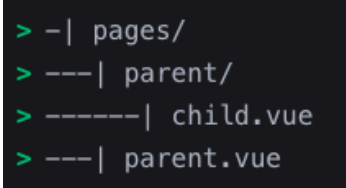

```vue
<template>
  <div>
    <div>Page: Parent</div>
    <div>
      <NuxtLink to="/parent">
        <button>default child1</button>
      </NuxtLink>

      <NuxtLink to="/parent/child1">
        <button>child1</button>
      </NuxtLink>

      <NuxtLink to="/parent/child2">
        <button>child2</button>
      </NuxtLink>
    </div>

    <!-- 嵌套二级路由 -->
    <NuxtPage></NuxtPage>
  </div>
</template>
```

### 1.2、路由中间件(middleware)

Nuxt提供了一个可定制的路由中间件,用来监听路由的导航,包括:局部和全局监听 (支持再服务器和客户端执行)

路由中间件分为三种:

- 匿名(或内联)路由中间件
  - 在页面中使用 definePageMeta 函数定义,可监听局部路由。当注册多个中间件时,会按照注册顺序来执行。
- 命名路由中间件
  - 在 middleware 目录下定义,并会自动加载中间件。 命名规范 kebab-case)
- 全局路由中间件(优先级比前面的高,支持两端)
  - 在 middleware 目录中, 需带.global后缀的文件,每次路由更改都会自动运行。

```vue
<script lang="ts" setup>
definePageMeta({
  // 路由中间件( 监听路由 )
  middleware: [
    // 第一个中间件
    function (to, from) {
      console.log("index 第一个中间件");
      // 如果返回的是 "" null, 或 没有返回语句,name就会执行下一个中间件
      // 如果返回的是 navigateTo, 直接导航到新的页面
      // return navigateTo("/detail02");
    },
    // 第二个中间件
    "home",
    // 专门用来判断用户是否已登录
    "auth",
  ],
});
</script>

<template>
  <div>Page: Index</div>
</template>
```

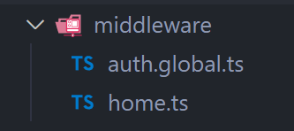

```js
// server: 刷新浏览器器的会在服务器端执行
// client:在客户端切换路由, 只会在客户端执行
export default defineNuxtRouteMiddleware((to, from) => {
  console.log("home.ts 第二个中间件");
});
```

```js
// auth.global.ts
// 这个优先级别是比较高的
export default defineNuxtRouteMiddleware((to, from) => {
  const isLogin = false;
  if (!isLogin && to.fullPath !== "/login") {
    return navigateTo("/login");
  }
});
```

```vue
<script lang="ts" setup>
definePageMeta({
  // 命名中间件( 复用 )
  middleware: ["home"],
});
</script>

<template>
  <div>Page: detail01</div>
</template>
```

### 1.3、路由验证(validate)

Nuxt支持对每个页面路由进行验证,我们可以通过 definePageMeta 中的validate属性来对路由进行验证。

- validate属性接受一个回调函数,回调函数中以 route作为参数
- 回调函数的返回值支持:
  - 返回 bool值来确定是否放行路由
    - true放行路由
    - false 默认重定向到内置的404页面
  - 返回对象
    -  {statusCode:401 } //返回自定义的401 页面,验证失败
- 路由验证失败,可以自定义错误页面:
  - 在项目根目录(不是pages目录)新建 error.vue

```vue
<script lang="ts" setup>
// 拿到动态路由的参数
const route = useRoute();
const { id } = route.params;

definePageMeta({
  // 路由参数的验证
  validate: (route) => {
    console.log(route.params.id);
    // return /^\d+$/.test(route.params.id as string);
    // return false  // 404 -> 500  401 ...
    return {
      statusCode: 401, // 路由验证失败
      statusMessage: "validata router error",
    };
  },
});
</script>

<template>
  <div>Page: detail03 id={{ id }}</div>
</template>
```

```vue
// error.vue
<script lang="ts" setup>
const props = defineProps({
  error: Object,
});

function goHome() {
  clearError({ redirect: "/" });
}
</script>

<template>
  <div>
    Error Page {{ error }}
    <div>
      <button @click="goHome">Home</button>
    </div>
  </div>
</template>
```

## 2、Nuxt布局

Layout布局是页面的包装器,可以将多个页面共性东西抽取到 Layout布局中。

- 例如:每个页面的页眉和页脚组件,这些具有共性的组件我们是可以写到一个Layout布局中。

Layout布局是使用`<slot>`组件来显示页面中的内容

Layout布局有两种使用方式:

- 方式一:默认布局
  - 在layouts目录下新建默认的布局组件,比如: layouts/default.vue
  - 然后在app.vue中通过`<NuxtLayout>`内置组件来使用
- 方式二:自定义布局(Custom Layout)
  - 继续在layouts文件夹下新建 Layout布局组件,比如: layouts/custom-layout.vue
  - 然后在app.vue中给`<NuxtLayout>`内置组件指定name属性的值为: custom-layout 
    - 也支持在页面中使用 definePageMeta 宏函数来指定 layout布局

```vue
// app.vue
<script setup>
// const name = "default";
const name = "custom-layout";
</script>

<template>
  <!-- 布局 -->
  <NuxtLayout :name="name">
    <!-- 页面 -->
    <NuxtPage></NuxtPage>
  </NuxtLayout>
</template>
```

```vue
// /layouts/default.vue
<script lang="ts" setup></script>

<template>
  <div class="layout">
    <div class="header">
      <div>我是Header</div>
      <div>
        <NuxtLink to="/">
          <button>Home</button>
        </NuxtLink>

        <NuxtLink to="/category">
          <button>category</button>
        </NuxtLink>

        <NuxtLink to="/cart">
          <button>cart</button>
        </NuxtLink>

        <NuxtLink to="/profile">
          <button>profile</button>
        </NuxtLink>

        <NuxtLink to="/login">
          <button>login</button>
        </NuxtLink>
      </div>
    </div>
    <!-- 页面的内容 -->
    <slot></slot>
    <div class="footer">我是footer</div>
  </div>
</template>

<style scoped>
.header {
  text-align: center;
  /* line-height: 80px; */
  font-size: 30px;
  background-color: red;
}

.footer {
  border: 1px solid green;
  text-align: center;
  /* line-height: 80px; */
  font-size: 30px;
  background-color: #cdcdcd;
}
</style>
```

```vue
// /layouts/custom-layout.vue
<template>
  <div class="custom-layout">
    <slot></slot>
    <!-- 页面的内容 -->
  </div>
</template>
```

```vue
<script lang="ts" setup>
// 该页面重新定义使用的 layout
definePageMeta({
  layout: "custom-layout",
});
</script>

<template>
  <div>Page: login</div>
</template>
```

## 3、页面渲染模式

浏览器和服务器都可以解释JavaScript 代码,都可以将Vue.js组件呈现为 HTML 元素。此过程称为渲染。

- 在客户端将Vue.js组件呈现为 HTML 元素,称为:客户端渲染模式
- 在服务器将Vue.js组件呈现为 HTML 元素,称为:服务器渲染模式

而Nuxt3是支持多种渲染模式,比如:

- 客户端渲染模式(CSR): 只需将ssr设置为 false
- 服务器端渲染模式(SSR):只需将 ssr设置为 true
- 混合渲染模式(SSR | CSR | SSG | SWR):需在 routeRules根据每个路由动态配置渲染模式(beta版本)

```js
// nuxt.config.ts
export default defineNuxtConfig({
  // ssr: false,
  routeRules: {
    "/": { ssr: true }, // ssr
    "/category": { ssr: false }, // spa 应用
    // 3.0.0-12rc -> NetLify
    "/cart": { static: true }, // 只会在构建时生成一次静态页面
    "/profile": { swr: true }, // 只会生成多次静态页面( 会自动重新验证页面时候需要重新生成 )
  },
});
```

## 4、Nuxt3插件开发

 Nuxt3支持自定义插件进行扩展,创建插件有两种方式:

- 方式一: 直接使用 useNuxtApp() 中的 provide(name, vlaue) 方法直接创建,比如:可在 App.vue 中创建
  - useNuxtApp 提供了访问 Nuxt共享运行时上下文的方法和属性(两端可用):  provide、 hooks、 callhook、 vueApp 等
- 方式二: 在 plugins 目录中创建插件(推荐)
  - 顶级和子目录index文件写的插件会在创建 Vue 应用程序时会自动加载和注册
  - .server 或 .client 后缀名插件, 可区分服务器端或客户端, 用时需区分环境

在 plugins 目录中创建插件

1. 在 plugins 目录下创建 plugins/price.ts 插件
2. 接着 defineNuxtPlugin 函数创建插件,参数是一个回调函数
3. 然后在组件中使用 useNuxtApp()  来拿到插件中的方法

注意事项:

- 插件注册顺序可以通过在文件名前加上一个数字来控制插件注册的顺序
  - 比如: plugins/1.price.ts 、 plugins/2.string.ts、 plugins/3.date.ts

```vue
<script setup>
// 方式一:创建插件
const nuxtApp = useNuxtApp();
nuxtApp.provide("formData", () => {
  return "2020-12-14";
});
nuxtApp.provide("version", "1.0.0");

// 使用插件
console.log(nuxtApp.$formData());
console.log(nuxtApp.$version);
if (process.client) {
  console.log(nuxtApp.$formPrice(1000.78987));
}
</script>

<template>
  <div>
    <NuxtPage></NuxtPage>
  </div>
</template>
```

```ts
// /plugins/1.price.ts
export default defineNuxtPlugin((nuxtApp) => {
  return {
    provide: {
      // 自定义的插件，格式化价格的插件 （创建Vue实例时就会自动注册好）
      formPrice: (price: number) => {
        return price.toFixed(2);
      },
      // ....
      // key: string ; value: any
    },
  };
});
```

```vue
<script setup>
const nuxtApp = useNuxtApp();

// 使用插件
console.log(nuxtApp.$formData());
console.log(nuxtApp.$version);
if (process.client) {
  console.log(nuxtApp.$formPrice(100.78987));
}
</script>

<template>
  <div class="home">Home Page</div>
</template>
```

## 5、Lifecycle Hooks

### 5.1、App Lifecycle Hooks

监听App的生命周期的Hooks: 

- App Hooks 主要可由 Nuxt 插件 使用 hooks来监听生命周期,也可用于Vue 组合API。
- 但是, 如在组件中编写hooks来监听,那 create 和 setup hooks 就监听不了, 因为这些 hooks 已经触发完了监听。

语法: nuxtApp.hook(app:created, func)

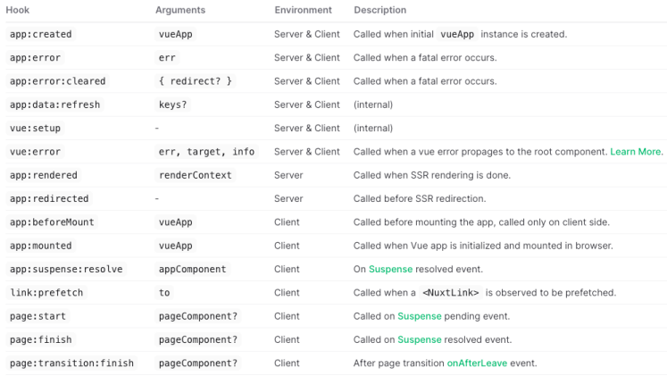

```js
// plugins/lifecycle.ts

export default defineNuxtPlugin((nuxtApp) => {
  // 监听App的生命周期
  // Server & Client
  nuxtApp.hook("app:created", (vueApp) => {
    console.log("app:created");
  });

  // Client
  nuxtApp.hook("app:beforeMount", (vueApp) => {
    console.log("app:beforeMount");
  });

  // Server & Client
  nuxtApp.hook("vue:setup", () => {
    console.log("vue:setup");
  });

  // Server
  nuxtApp.hook("app:rendered", (renderContext) => {
    console.log("app:rendered");
  });

  // Client
  nuxtApp.hook("app:mounted", (vueApp) => {
    console.log("app:mounted");
  });
});
```

### 5.2、组件生命周期

客户端渲染

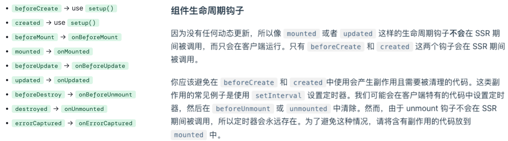服务器端渲染

- beforeCreate -> setup 
- created

```vue
<script>
export default {
  setup() {
    console.log("setup");
    return {};
  },

  beforeCreate() {
    console.log("beforeCreate");
  },

  created() {
    console.log("created");
  },

  beforeMount() {
    console.log("beforeMount");
  },

  mounted() {
    console.log("mounted");
  },

  beforeUnmount() {
    console.log("beforeUnmount");
  },

  unmounted() {
    console.log("unmounted");
  },
};
</script>

<template>
  <div class="home">home</div>
</templ
```

```vue
<script setup>
console.log("setup");

onBeforeMount(() => {
  console.log("onBeforeMount");
});

onMounted(() => {
  console.log("onMounted");
});
</script>

<template>
  <div class="home">home</div>
</template>
```

## 6、获取数据、 API接口

### 6.1、获取数据

```vue
<script setup lang="ts">
const BASE_URL = "http://codercba.com:9060/juanpi/api";
interface IResultData {
  code: number;
  data: any;
}
// 1.使用 $fetch 来发起网络请求
// server and client 都发起了请求，共会请求两次，不推荐使用
$fetch(BASE_URL + "/homeInfo", {
  method: "GET",
}).then((res) => {
  console.log(res);
});
</script>
```

在Nuxt中数据的获取主要是通过下面4个函数来实现(支持Server和Client ):

- useAsyncData(key, func):专门解决异步获取数据的函数, 会阻止页面导航。
  - 发起异步请求需用到 $fetch全局函数(类似Fetch API)
    - $fetch(url, opts)是一个类原生fetch的跨平台请求库

```vue
// 2.使用官方提供的 hooks API ( 在刷新页面时, 可以减少客户端发起的一次请求 )
const { data } = await useAsyncData<IResultData>("homeInfo", () => {
  return $fetch(BASE_URL + "/homeInfo", { method: "GET" });
});
console.log(data.value?.data);

const { data: newData } = await useAsyncData<IResultData>("homeInfo", () => {
  return $fetch(BASE_URL + "/goods", { method: "POST" });
});
</script>
```

- useFetch(url, opts): 用于获取任意的URL地址的数据, 会阻止页面导航
  - 本质是useAsyncData(key, () => $fetch(url, opts)) 的语法糖。

```vue
<script setup lang="ts">
// 3.useAsyncData的简写 useFetch
const { data } = await useFetch<IResultData>(BASE_URL + "/homeInfo", {
  method: "GET",
});

// 4. useFetch 的 options GET
const { data } = await useFetch<IResultData>("/homeInfo", {
  method: "GET",
  baseURL: BASE_URL,
  query: {
    name: "liujun",
  },
  // params:  这个是 query的别名
  // body: {}
  // headers: {}
});

// 5. useFetch 的 options POST
const { data } = await useFetch<IResultData>("/goods", {
  method: "POST",
  baseURL: BASE_URL,
  body: {
    count: 6,
  },
});

// 5.拦截器
const { data } = await useFetch<IResultData>("/goods", {
  method: "POST",
  baseURL: BASE_URL,
  body: {
    count: 1,
  },
  // 请求的拦截 ( server and client )
  onRequest({ request, options }) {
    console.log(options);
    options.headers = {
      token: "xxxx",
    };
  },
  onRequestError({ request, options, error }) {
    console.log("onRequestError");
  },
  onResponse({ request, response, options }) {
    console.log("onResponse");
    console.log(response._data.data.server_jsonstr);
    response._data.data = {
      name: "liujun",
    };
    // return response._data.data.server_jsonstr;
  },
  onResponseError({ request, response, options, error }) {
    console.log("onResponseError");
  },
});

// // server and client
const cookie = useCookie("token");
console.log(cookie.value);
</script>
```

```vue
<script setup lang="ts">
const BASE_URL = "http://codercba.com:9060/juanpi/api";
interface IResultData {
  code: number;
  data: any;
}

const count = ref(1);
// 1.点击刷新时, 是在server端发起网络请求, 客户端不会发起网络请求,水合之后客户端是可以当前数据
const { data, refresh, pending } = await useFetch<IResultData>(
  BASE_URL + "/goods",
  {
    method: "POST",
    body: {
      count,
    },
  }
);
console.log(data.value?.data);

function refreshPage() {
  count.value++; // 会自动从新发起网络请求
  // refresh(); // client 刷新请求
}
</script>

<template>
  <div class="refresh">
    refresh
    {{ pending }}
    <div>
      <button @click="refreshPage">点击刷新</button>
    </div>
  </div>
</template>
```

- useLazyFetch(url, opts):用于获取任意URL数据, 不会阻止页面导航
  - 本质和 useFetch 的 lazy属性设置为 true一样

```vue
<script setup lang="ts">
const BASE_URL = "http://codercba.com:9060/juanpi/api";
interface IResultData {
  code: number;
  data: any;
}
// 1. useFetch 默认会阻塞 页面的导航
const { data } = await useFetch<IResultData>(BASE_URL + "/homeInfo", {
  method: "GET",
  lazy: true, // 不会阻塞页面的导航
});

// // 确保一定可以拿到这个data的数据
watch(data, (newData) => {
  console.log("data=>", data);
});

// 2.简写
const { data } = await useLazyFetch<IResultData>(BASE_URL + "/homeInfo", {
  method: "GET",
});
console.log(data.value?.data);

// 确保一定可以拿到这个data的数据 ( client )
watch(data, (newData) => {
  console.log("data=>", data);
});
</script>
```

- useLazyAsyncData(key, func):专门解决异步获取数据的函数。 不会阻止页面导航
  - 本质和useAsyncData的lazy属性设置为true一样

注意事项:

- 这些函数只能用在setup or Lifecycle Hooks 中。

### 6.2、useFetch vs axios

获取数据Nuxt推荐使用 useFetch 函数,为什么不是 axios ?

- useFetch 底层调用的是$fetch函数,该函数是基于 unjs/ohmyfetch 请求库,并与原生的 FetchAPI 有者相同 API
- unjs/ohmyfetch 是一个跨端请求库: A better fetch API. Works on node, browser and workers
  - 如果运行在服务器上,它可以智能的处理对 API 接口的直接调用。
  - 如果运行在客户端行,它可以对后台提供的 API 接口正常的调用(类似 axios ),当然也支持第三方接口的调用
  - 会自动解析响应和对数据进行字符串化
- useFetch 支持智能的类型提示和智能的推断API 响应类型。
- 在setup中用 useFetch 获取数据,会减去客户端重复发起的请求。

useFetch (url, options)语法

- 参数
  - url:请求的路径
  - options:请求配置选项
    - method、 query(别名 params)、 body、 headers、 baseURL
    - onRequest、 onResponse、 lazy....
- 返回值: data, pending, error, refresh

### 6.3、useFetch的封装

封装useFetch步骤

1. 定义HYRequest类,并导出
2. 在类中定义request、 get、 post方法
3. 在request中使用useFetch发起网络请求
4. 添加TypeScript类型声明

```ts
import type { AsyncData, UseFetchOptions } from "nuxt/dist/app/composables";

const BASE_URL = "http://codercba.com:9060/juanpi/api/";
type Methods = "GET" | "POST";

export interface IResultData<T> {
  code: number;
  data: T;
}

class HYRequest {
  request<T = any>(
    url: string,
    method: Methods,
    data?: any,
    options?: UseFetchOptions<T>
  ): Promise<AsyncData<T, Error>> {
    return new Promise((resolve, reject) => {
      const newOptions: UseFetchOptions<T> = {
        baseURL: BASE_URL,
        method: method,
        ...options,
      };

      if (method === "GET") {
        newOptions.query = data; // query -> params
      }
      if (method === "POST") {
        newOptions.body = data;
      }
      useFetch<T>(url, newOptions as any)
        .then((res) => {
          // res => { data:T, pending, refresh, error ... } => AsyncData
          resolve(res as AsyncData<T, Error>);
        })
        .catch((error) => {
          reject(error);
        });
    });
  }

  get<T = any>(url: string, params?: any, options?: UseFetchOptions<T>) {
    return this.request(url, "GET", params, options);
  }

  post<T = any>(url: string, data?: any, options?: UseFetchOptions<T>) {
    return this.request(url, "POST", data, options);
  }
}

export default new HYRequest();
```

### 6.4、ServerAPI

Nuxt3 提供了编写后端服务接口的功能,编写服务接口可以在server/api目录下编写

比如:编写一个/api/homeinfo接口

1. 在server/api目录下新建 homeinfo.ts
2. 接在在该文件中使用 defineEventHandler 函数来定义接口(支持async) 
3. 然后就可以用useFetch函数轻松调用: /api/homeinfo接口了

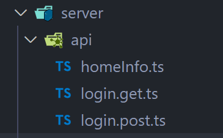

```ts
export default defineEventHandler((event) => {
  let { req, res } = event.node;

  // 本地mock数据
  return {
    code: 200,
    data: {
      name: "liujun",
      age: 18,
    },
  };
});
```

```ts
/**
 * 登录的 API 接口: /api/login
 */
export default defineEventHandler(async (event) => {
  const query = getQuery(event);
  const method = getMethod(event);
  const body = await readBody(event);
  const bodyRaw = await readRawBody(event);

  console.log(query);
  console.log(method);
  console.log(body);
  console.log(bodyRaw);

  // 连接数据库 ...
  // mock
  return {
    code: 200,
    data: {
      name: "liujun",
      age: 18,
      token: "aabbcc",
    },
  };
});
```

## 7、useState和 Pinia

### 7.1、全局状态共享

Nuxt跨页面、跨组件全局状态共享可使用 useState (支持Server和Client ):

- `useState<T>(init?: () => T | Ref<T>): Ref<T>`
- `useState<T>(key: string, init?: () => T | Ref<T>): Ref<T>`
- 参数:
  - init: 为状态提供初始值的函数,该函数也支持返回一个Ref类型
  - key:  唯一key,确保在跨请求获取该数据时,保证数据的唯一性。 为空时会根据文件和行号自动生成唯一key 
- 返回值: Ref 响应式对象

useState 具体使用步骤如下:

1. 在 composables 目录下创建一个模块,  如: composables/states.ts
2. 在 states.ts 中使用 useState 定义需全局共享状态,并导出
3. 在组件中导入 states.ts 导出的全局状态

useState 注意事项:

- useState只能用在setup 函数和 Lifecycle Hooks 中
- useState不支持classes, functions or symbols类型,因为这些类型不支持序列化

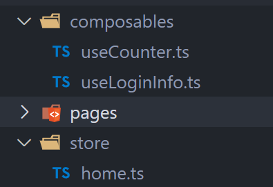

```ts
export default function () {
  return useState("counter", () => 100); // Ref
}

// or
export const useCounter = () => {
  return useState("counter", () => 100);
};
```

```ts
export default function () {
  return useState("loginInfo", () => {
    return {
      name: "liujun",
      age: 18,
      token: "aabbcc",
    };
  }); // Ref
}
```

```vue
<script setup>
// counter -> Ref
const counter = useCounter();
const loginInfo = useLoginInfo();
if (process.server) {
  console.log("counter=>", counter);
}
function addCounter() {
  counter.value++;
  loginInfo.value.age++;
}
</script>

<template>
  <div class="home">
    home
    <div>{{ counter }}</div>
    <div>{{ loginInfo }}</div>
    <button @click="addCounter">+1</button>
  </div>
</template>
```

### 7.2、Nuxt3集成Pinia

安装依赖

- `npm install @pinia/nuxt –-save`
  - @pinia/nuxt会处理state同步问题,比如不需要关心序列化或XSS 攻击等问题
- `npm install pinia –-save`
  - 如遇到 pinia 安装失败, 添加  `--legacy-peer-deps`  告诉 NPM 忽略对等依赖并继续安装。或使用yarn

Nuxt 应用接入 Pinia

- 在nuxt.config文件中添加: modules: [‘@pinia/nuxt ‘] 

```ts
export default defineNuxtConfig({
  // 这里是配置Nuxt3的扩展的库
  modules: ["@pinia/nuxt"],
});
```

### 7.3、Pinia使用步骤

Pinia使用步骤:

1. 在 store 文件夹中定义一个模块,比如: store/counter.ts
2. 在 store/counter.ts 中使用 defineStore 函数来定义 store 对象
3. 在组件中使用定义好的 store 对象

```ts
import { defineStore } from "pinia";

export interface IState {
  counter: number;
  homeInfo: any;
}

export const useHomeStore = defineStore("home", {
  state: (): IState => {
    return {
      counter: 0,
      homeInfo: {},
    };
  },
  actions: {
    increment() {
      this.counter++;
    },
    async fetchHomeData() {
      const url = "http://codercba.com:9060/juanpi/api/homeInfo";
      const { data } = await useFetch<any>(url);
      console.log(data.value.data);
      this.homeInfo = data.value.data;
    },
  },
});
```

```vue
<script setup lang="ts">
import { storeToRefs } from "pinia";
import { useHomeStore } from "~/store/home";

const homeStore = useHomeStore();
const { counter, homeInfo } = storeToRefs(homeStore);
function addCounter() {
  homeStore.increment();
}

if (process.server) {
  homeStore.fetchHomeData();
}
function getHomeInfo() {
  homeStore.fetchHomeData();
}
</script>

<template>
  <div class="category">
    category

    <div>{{ counter }}</div>
    <button @click="addCounter">+1</button>
    <button @click="getHomeInfo">fetchHomeInfoData</button>
  </div>
</template>
```

### 7.4、useStatevs Pinia

 Nuxt 跨页面、跨组件全局状态共享,既可以使用 useState ,也可以使用 Pinia , 那么他们有什么异同呢? 

它们的共同点:

- 都支持全局状态共享, 共享的数据都是响应式数据
- 都支持服务器端和客户端共享

但是 Pinia 比 useState 有更多的优势,比如:

- 开发工具支持(Devtools)
  - 跟踪动作 ,  更容易调试
  - store 可以出现在使用它的组件中
  - .... 
- 模块热更换
  - 无需重新加载页面即可修改 store 数据
  - 在开发时保持任何现有状态
    - 插件:可以使用插件扩展 Pinia 功能
    - 提供适当的 TypeScript 支持或自动完成

## 8、项目实战

### 8.1、项目需安装的依赖

- 样式
  - `npm install normalize.css –save `
  - n`pm install sass –-save-dev`
- Pinia
  - `npm install @pinia/nuxt --save`
  - `npm install  pinia–save --legacy-peer-deps`
- Element Plus
  - `npm install element-plus –save`
  - `npm install unplugin-element-plus --save-dev`

```js
// https://nuxt.com/docs/api/configuration/nuxt-config
import ElementPlus from "unplugin-element-plus/vite";
export default defineNuxtConfig({
  // reset.css
  css: [
    "normalize.css",
    "@/assets/css/global.scss",
    "~/assets/cus-font/iconfont.css",
  ],
  build: {
    // 该文件需要进行Babel转义
    transpile: ["element-plus/es"],
  },
  vite: {
    css: {
      preprocessorOptions: {
        scss: {
          additionalData: "@use '@/assets/css/variables.scss' as *;",
        },
      },
    },
    // 实现自动导入样式
    plugins: [ElementPlus()],
  },
  // 配置nuxt3的扩展模块
  modules: ["@pinia/nuxt"],
});

```

### 8.2、安装 Element Plus2

Element Plus 官网:  https://element-plus.org/zh-CN/guide/quickstart.html

安装 Element Plus 的具体步骤:

- 第一步:
  - `npm install element-plus --save`
  - `npm install unplugin-element-plus --save-dev `
- 第二步:
  - 配置 Babel 对 EP 的转译
  - 配置自动导入样式
- 第三步:
  - 在组件中导入组件,并使用

注意事项: 目前 Nuxt3 暂时还不支持 EP 组件自动导包,等后续 EP 的 module

```js
import ElementPlus from "unplugin-element-plus/vite";
export default defineNuxtConfig({
  // dev build
  build: {
    // 使用 Babel 进行语法转换
    transpile: ["element-plus/es"],
  },
  vite: {
    // 配置自动导入样式
    plugins: [ElementPlus()],
  },
});
```

```vue
<script setup lang="ts">
import { ElButton } from "element-plus";
</script>

<template>
  <div>
    <el-button>我是button</el-button>
    <el-button type="success">我是button</el-button>
    <el-button type="danger" size="large">我是button</el-button>
  </div>
</template>
```

### 8.3、服务器安装Node和PM2

安装 Node

- `yum install nodejs` ( 16.17.0) 
- `yum install npm` (8.15.0)

认识PM2 (Process Manager)

- PM2是一个守护进程管理器, 它将帮助管理和保持你的在线应用程序
- 更简单的理解:负责管理Node、 Python等程序,并能让程序一直保持在后台运行

安装PM2

- `npm install –g pm2` (5.2.2)

管理Node版本(可选)

- `npm install –g n`
- `n --version` #查看版本

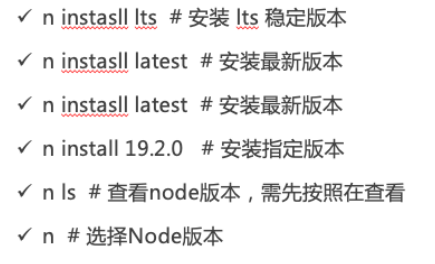

### 8.4、PM2 常用命令

PM2 常用命令和配置文件

- https://pm2.keymetrics.io/docs/usage/application-declaration/

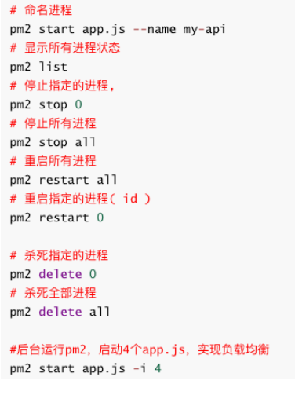

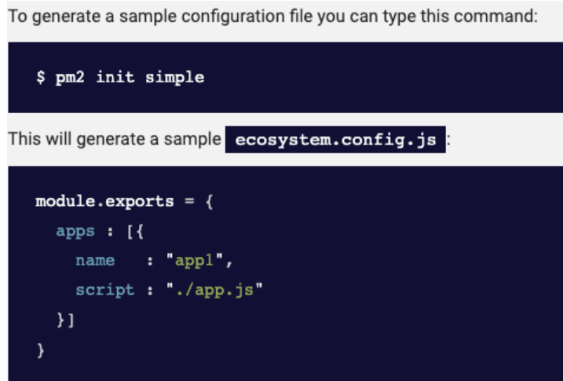

### 8.5、项目打包和部署

项目打包

- 执行 `npm run build` , 生成的.output文件夹就是部署产物(目前不支持中文路径) 
- 执行 `npm run preview` 本地预览效果

使用Node部署

- 运行: `node .output/server/index.mjs`
- 指定端口: `PORT=8888 node .output/server/index.mjs `
  - PORT:是动态添加的环境变量

使用PM2部署(推荐)

- `pm2 init simple` # 自动生成ecosystem配置文件
- `pm2 start ecosystem.config.js`  #启动应用
  - instances:指定启动实例(进程)的个数
  - exec_mode:运行的模式: cluster模式和fork模式(默认)

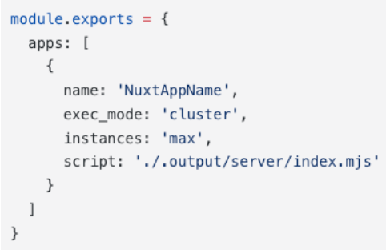

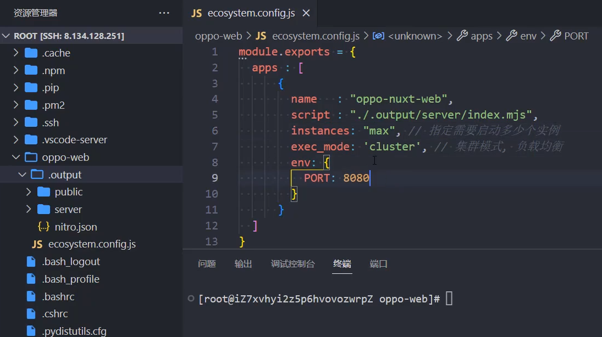


