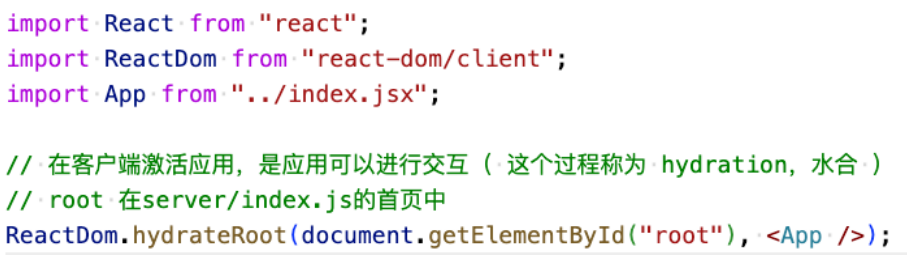
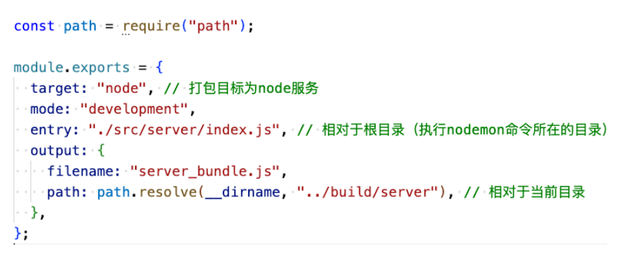

## 1、邂逅React18 +SSR

React和Vue一样,除了支持开发SPA应用之外,其实也是支持开发SSR应用的。

在React中创建SSR应用,需要调用 ReactDOM.hydrateRoot 函数,而不是ReactDOM.createRoot 

- createRoot :创建一个Root,接着调用其 render函数将App直接过载到页面上
- hydrateRoot :创建水合Root ,是在激活的模式下渲染App

服务端可用 ReactDOM.renderToString 来进行渲染。



## 2、NodeServer搭建

需安装的依赖项:

- `npm i express `
- `npm i -D nodemon`
- `npm i -D webpack webpack-cli webpack-node-externals`



## 3、React18 + SSR搭建

需安装的依赖项:

- `npm i express `
- `npm i react react-dom`
- `npm i –D nodemon`
- `npm i -D webpack webpack-cli webpack-node-externals webpack-merge `
- `npm i -D babel-loader @babel/preset-react @babel/preset-env`

## 4、React18SSR+Hydration

安装的依赖项同前面一样

## 5、React18SSR+Router

安装的依赖项同前面一样,还需增加

- `npm i react-router-dom` (默认会自动安装 react-router)

```js
import React from "react";
import ReactDOM from "react-dom/client";
import { BrowserRouter } from "react-router-dom";
import App from "../app.jsx";

// 在需要激活的模式下挂载应用 ( hydrateRoot )
ReactDOM.hydrateRoot(
  document.getElementById("root"),
  <BrowserRouter>
    <App />
  </BrowserRouter>
);
```

```js
const express = require("express");
import React from "react";
import ReactDOM from "react-dom/server";
import { StaticRouter } from "react-router-dom/server";
import App from "../app.jsx";
const server = express();

// 静态资源的部署
server.use(express.static("build"));

server.get("/*", (req, res) => {
  // 就是服务器端渲染:  /   /about
  const AppHtmlString = ReactDOM.renderToString(
    <StaticRouter location={req.url}>
      <App />
    </StaticRouter>
  );

  res.send(`
    <!DOCTYPE html>
    <html lang="en">
    <head>
      <meta charset="UTF-8">
      <meta http-equiv="X-UA-Compatible" content="IE=edge">
      <meta name="viewport" content="width=device-width, initial-scale=1.0">
      <title>Document</title>
    </head>
    <body>
      <h1>React18 + SSR</h1>
      <div id="root">${AppHtmlString}</div>
      <script src="/client/client_bundle.js"></script>
    </body>
    </html>
  `);
});

server.listen(8080, () => {
  console.log("server start on 8080");
});
```

## 6、React18SSR+Redux

### 6.1、Redux

安装的依赖项同前面一样,还需增加

- `npm i react-redux @reduxjs/toolkit `
- `npm i axios`

### 6.2、Redux Toolkit (RTK)

#### 6.2.1、认识Redux Toolkit

Redux Toolkit 是官方推荐的编写 Redux 逻辑的方法。

- 以前在使用redux时,通常会将redux代码拆分在多个模块中,每个模块需包含多个文件,如: constants、 action、 reducer、 index等
- 然后使用combineReducers对多个模块合并,这种代码组织方式过于繁琐和麻烦,导致代码量过多,也不利于后期管理
- Redux Toolkit就是为了解决这种编码方式而诞生。
- 并且以前的createStore方式已标为过时,而 ReduxToolit已成为官方推荐;

安装Redux Toolkit:  `npm install @reduxjs/toolkit react-redux`

Redux Toolkit的核心API主要是如下几个:

- onfigureStore: 包装createStore以提供简化的配置选项和良好的默认值。
  - 可自动组合slice reducer
  - 可添加其它 Redux 中间件, redux-thunk 默认包含,
  - 默认启用 Redux DevTools Extension
- createSlice: 接受切片名称、初始状态值和reducer函数的对象, 并自动生成切片reducer,并带有相应的actions。
- createAsyncThunk: 接受一个动作类型字符串和一个返回承诺的函数,并生成一个pending/fulfilled/rejected基于该承诺分派动作类型的 thunk。简单理解就是专门用来创建异步Action。

#### 6.2.2、创建counter模块的reducer

我们先创建counter模块的reducer: 通过createSlice创建一个slice。

createSlice主要包含如下几个参数:

- name:用来标记slice的名词
  - redux-devtool中会显示对应的名词;
- initialState:第一次初始化时的值;
- reducers:相当于之前的reducer函数
  - 对象类型,并且可以添加很多的函数;
  - 函数类似于redux原来reducer中的一个case语句;
  - 函数的参数:
    - 参数一: state
    - 参数二: action
- createSlice返回值是一个对象
  - 对象包含所有的 actions和 reducer;

```js
import { createAsyncThunk, createSlice } from "@reduxjs/toolkit";
import axios from "axios";
const homeSlcie = createSlice({
  name: "home", //
  initialState: {
    counter: 1000,
    homeInfo: {},
  },
  reducers: {
    increment(state, { payload }) {
      // action: { type:home/increment/状态, payload: 1 }
      console.log("payload=>", payload);
      state.counter += payload;
    },
  },
  extraReducers: (buidler) => {
    // type: fetchHomeData/状态
    buidler.addCase(fetchHomeData.fulfilled, (state, { payload, type }) => {
      console.log("type=>", type);
      console.log("payload=>", payload);
      state.homeInfo = payload;
    });
  },
});

// 异步的action -> axios
export const fetchHomeData = createAsyncThunk(
  "fetchHomeData",
  async (payload, { dispatch, getState }) => {
    const res = await axios.get("http://codercba.com:9060/juanpi/api/homeInfo");
    return res.data;
  }
);

// 同步的 action
export const { increment } = homeSlcie.actions;
// home 切片生成的 reducer
export default homeSlcie.reducer;
```

#### 6.2.3、store的创建

configureStore用于创建store对象,常见参数如下:

- reducer,将slice中的reducer可以组成一个对象传入此处;
- middleware:可以使用参数,传入其他的中间件(自行了解); 
- devTools:是否配置devTools工具,默认为true;

```js
import { configureStore } from "@reduxjs/toolkit";
import homeReducer from "./modules/home";
const store = configureStore({
  // 组合 reducer
  reducer: {
    home: homeReducer,
  },
  // devTools: true,
});

export default store;
```

#### 6.2.4、store接入应用

在app.js中将store接入应用:

- Provider,内容提供者,给所有的子或孙子组件提供store对象; 
- store: 使用configureStore创建的store对象;

```js
const express = require("express");
import React from "react";
import ReactDOM from "react-dom/server";
import { StaticRouter } from "react-router-dom/server";
import { Provider } from "react-redux";
import store from "../store/index";
import App from "../app.jsx";
const server = express();

// 静态资源的部署
server.use(express.static("build"));

server.get("/*", (req, res) => {
  // 就是服务器端渲染:  /   /about
  const AppHtmlString = ReactDOM.renderToString(
    <Provider store={store}>
      <StaticRouter location={req.url}>
        <App />
      </StaticRouter>
    </Provider>
  );

  res.send(`
    <!DOCTYPE html>
    <html lang="en">
    <head>
      <meta charset="UTF-8">
      <meta http-equiv="X-UA-Compatible" content="IE=edge">
      <meta name="viewport" content="width=device-width, initial-scale=1.0">
      <title>Document</title>
    </head>
    <body>
      <h1>React18 + SSR</h1>
      <div id="root">${AppHtmlString}</div>
      <script src="/client/client_bundle.js"></script>
    </body>
    </html>
  `);
});

server.listen(8080, () => {
  console.log("server start on 8080");
});
```

```js
import React from "react";
import ReactDOM from "react-dom/client";
import { BrowserRouter } from "react-router-dom";
import { Provider } from "react-redux";
import store from "../store/index";
import App from "../app.jsx";

// 在需要激活的模式下挂载应用 ( hydrateRoot )
ReactDOM.hydrateRoot(
  document.getElementById("root"),
  <Provider store={store}>
    <BrowserRouter>
      <App />
    </BrowserRouter>
  </Provider>
);
```

#### 6.2.5、开始使用store

在函数式组件中可以使用 react-redux 提供的 Hooks API 连接、操作store。

- useSelector 允许你使用 selector 函数从store 中获取数据(rootstate)。
- useDispatch 返回 redux store 的 dispatch 引用。你可以使用它来dispatch actions。
- useStore 返回一个store 引用,和 Provider组件引用完全一致。

```jsx
import React, { useState } from "react";
import { useDispatch, useSelector } from "react-redux";
// 导入了两个 action 函数
import { increment, fetchHomeData } from "../store/modules/home";

const Home = function () {
  // 1.从redux的store中读取数据
  const { counter } = useSelector((rootState) => {
    return {
      counter: rootState.home.counter,
    };
  });

  // 2.触发action
  const dispatch = useDispatch();
  function addCounter() {
    // setCounter(counter + 1);
    dispatch(increment(2));
  }
  function getHomeData() {
    dispatch(fetchHomeData());
  }
  return (
    <div className="Home" style={{ border: "2px solid green", margin: "10px" }}>
      <h3>Home</h3>
      <div>{counter}</div>
      <button onClick={addCounter}>+1</button>
      <button onClick={getHomeData}>getHomeData</button>
    </div>
  );
};

export default Home;
```

#### 6.2.6、Redux Toolkit异步Action操作

在之前的开发中,我们通过redux-thunk中间件让dispatch中可以进行异步操作。

Redux Toolkit默认已经给我们继承了Thunk相关的功能: createAsyncThunk

当createAsyncThunk创建出来的action被dispatch时,会存在三种状态:

- pending: action被发出,但是还没有最终的结果;
- fulfilled:获取到最终的结果(有返回值的结果);
- rejected:执行过程中有错误或者抛出了异常;

我们可以在createSlice的entraReducer中监听这些结果: 见右图

- extraReducers也支持函数,该函数会接收一个builder参数
- builder.addCase(getHomeMultidataAction.fulfilled, (state, action)=>{})


