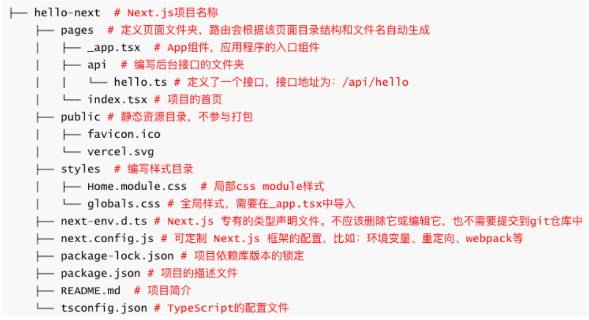

## 1、邂逅Next.js

### 1.1、什么是Next?

Next.js是一个React框架,支持CSR、 SSR、 SSG、 ISR (Incremental Static Regeneration)等渲染模式。

Next.js提供了创建Web 应用程序的构建块,比如:

- 用户界面、路由、数据获取、渲染模式、后端服务等等

Next.js不但处理 React 所需的工具和配置,还提供额外的功能和优化,比如: 

- UI构建, CSR、 SSR、 SSG、 ISR渲染模式, Routing、 Data Fetching等等。

中文官网:https://www.nextjs.cn/docs/getting-started

英文官网: https://nextjs.org/docs/getting-started

### 1.2、Next.js发展史

Next.js于2016 年 10 月 25 日首次作为开源项目发布在GitHub上,最初是基于六个原则开发的:

- 开箱即用、无处不在的JS、所有函数用JS编写、自动代码拆分和服务器渲染、可配置数据获取、预期请求和简化部署。

Next.js 2.0 于2017 年3 月发布,改进后的版本让小型网站的工作变得更加容易,还提高了构建和热模块替换效率。

7.0 版于2018 年9 月发布,改进了错误处理并支持 React 的上下文API。升级到了webpack4

8.0 版于2019 年2 月发布,第一个提供Serverless部署的版本。

2020 年3 月发布的 9.3 版包括各种优化和全局Sass和 CSS 模块支持。

2020 年7 月 27 日, Next.js 9.5 版发布,增加了增量静态再生成、重写和重定向支持等新功能。

2021 年6 月 15 日, Next.js版本 11 发布,其中包括: Webpack5 支持

2021 年 10 月 26 日, Next.js 12 发布,添加了 Rust 编译器,使编译速度更快

2022 年 10 月 26 日, Vercel 发布了 Next.js13。

- 带来了一种新的路由模式,增加了app目录 、布局布局、服务器组件和一组新的数据获取方法等(目前是 beta 版本) 
- 编译和压缩等由 Babel + Terser换为 SWC(Speedy Web Compiler ),构建工具增加了 Turbopack。

### 1.3、Next.js特点

开箱即用,快速创建:

- Next.js 已经帮我集成好了各种技术栈,比如: React、 webpack、路由、数据获取、 SCSS、 TypeScript等等
- 也提供了专门的脚手架: create-next-app

约定式路由(目录结构即路由)

- Next.js和Nuxt3一样,所有的路由都是根据 pages目录结构自动生成。但在 Next.js 13 beta版本增加了app目录。

内置CSS模块和Sass支持:

- 自从Next.js 9.3 以后就内置了CSS模块和Sass支持,也是开箱即用

全栈开发能力:

- Next.js不但支持前端开发,还支持编写后端代码,比如:可开发登录验证、存储数据、获取数据等接口

多种渲染模式:支持CSR、 SSR、 SSG、 ISR等渲染模式,当然也支持混合搭配使用

利于搜索引擎优化:

- Next.js支持使用服务器端渲染,同时它也是一个很棒的静态站点生成器,非常利于SEO和首屏渲染

### 1.4、Next.jsVS Nuxt3

Next.js和 Nuxt3的相同点

- 利于搜索引擎优化,都能提高首屏渲染速度
- 零配置,开箱即用
- 都支持目录结构即路由、支持数据获取、支持TypeScript
- 服务器端渲染、静态网站生成、客户端渲染等
- 都需要Node.js 服务器,支持全栈开发

Next.js和 Nuxt3区别:

- Next.js使用的是React技术栈: React、 webpack、 express 、 node.....
- Nuxt3使用的是Vue技术栈: Vue、 webpack、 vite、 h3、 nitro、 node.....
- Nuxt3支持组件、组合API、 VueAPI等自动导入, Next.js则不支持
- Next.js社区生态、资源和文档都会比Nuxt3友好(star数: Nuxt3 -> 41.6k 和 Next.js -> 96.8k ) 

Next.js和 Nuxt3如何选择? 个人建议如下:

- 首先根据自己擅长的技术栈来选择,擅长Vue选择Nuxt3,擅长React选择Next.js
- 需要更灵活的,选择Next.js
- 需要简单易用、快速上手的,选择Nuxt3

## 2、Next.js初体验

### 2.1、Next.js 13环境搭建

在开始之前,请确保您已安装推荐的设置:

- Node.js (要求 Node.js 14.6.0或更高版本。)
- Git (window下可以用其随附的 Git Bash 终端命令)
- Visual Studio Code

创建一个项目,项目名不支持大写

- 方式一: `npx create-next-app@latest --typescript`
- 方式二: `yarn create next-app --typescript`
- 方式三: `pnpm create next-app–typescript`
- 方式四: `npm i create-next-app@latest–g && create-next-app `

运行项目

- `npm run dev`
- `yarn dev`
- `pnpm dev`



### 2.2、入口App组件(_app.tsx)

_app.tsx是项目的入口组件,主要作用: 

- 可以扩展自定义的布局(Layout) 
- 引入全局的样式文件
- 引入Redux状态管理
- 引入主题组件等等
- 全局监听客户端路由的切换

```jsx
// 5.导入全局的样式
import "../styles/globals.css";
import type { AppProps } from "next/app";

/**
 * 1.自定义布局 Layout
 * 2.Redux
 * 3.Theme
 * 4.监听全局的路由
 */
export default function App({ Component, pageProps }: AppProps) {
  return <Component {...pageProps} />;
}
```

## 3、全局配置

### 3.1、ts.config.json 的配置

Next.js默认是没有配置路径别名的,我们可以在ts.config.json中配置模块导入的别名:

- baseUrl :配置允许直接从项目的根目录导入,比如: import Button from 'components/button' 
- paths:允许配置模块别,比如: import Button from '@/components/button’

```json
{
  "compilerOptions": {
    "target": "es5",
    "lib": ["dom", "dom.iterable", "esnext"],
    "allowJs": true,
    "skipLibCheck": true,
    "strict": true,
    "forceConsistentCasingInFileNames": true,
    "noEmit": true,
    "esModuleInterop": true,
    "module": "esnext",
    "moduleResolution": "node",
    "resolveJsonModule": true,
    "isolatedModules": true,
    "jsx": "preserve",
    "incremental": true,
    "baseUrl": ".",
    "paths": {
      "@/components/*": ["components/*"],
      "@/styles/*": ["styles/*"],
      "@/assets/*": ["assets/*"],
      "@/service/*": ["service/*"],
      "@/store/*": ["store/*"]
    }
  },
  "include": ["next-env.d.ts", "**/*.ts", "**/*.tsx"],
  "exclude": ["node_modules"]
}
```

### 3.2、环境变量(.env*)

定义环境变量的4种方式:

- .env:所有环境下生效的默认设置
- .env.development: 执行 nextdev时加载并生效
- .env.production : 执行nextstart时加载并生效
- .env.local :始终覆盖上面文件定义的默认值。 所有环境生效,通常只需一个 .env.local 文件就够了 (常用存储敏感信息) 

环境变量定义语法(支持变量,例如 $PORT):

- 大写单词,多个单词使用下划线,比如: DB_HOST=localhost
- 添加NEXT_PUBLIC_前缀会额外暴露给浏览器,比如: NEXT_PUBLIC_ANALYTICS_ID=aaabbbccc

环境变量的获取:

- .env文件中定义环境变量会加载到 process.env中。两端都可直接通过 process.env.xxx访问使用 (不支持解构) 

注意事项:

- 由于.env、 .env.development和 .env.production 文件定义了默认设置,需提交到源码仓库中。
- 而.env.*.local 应当添加到 .gitignore 中,因为这类文件是需要被忽略的。

```bash
NAME=localhost
PORT=8888
HOST=http://127.0.0.1

NEXT_PUBLIC_BASE_URL=http://$NAME:$PORT
```

```jsx
import HYButton from "@/components/hy-button"; // baseURL: .

export default function Home() {
  // 1.判断当前的运行的环境
  if (typeof window === "object") {
    console.log("client");
    // console.log(process.server); // Next.js 不支持
  } else {
    console.log("server");
  }

  // 2.读取环境变量
  if (typeof window === "object") {
    console.log("client");
    console.log(process.env.NEXT_PUBLIC_BASE_URL); // NEXT_PUBLIC_开头可以再客户端拿到
  } else {
    console.log("server");
    console.log(process.env.NAME);
    console.log(process.env.PORT);
    console.log(process.env.HOST);
    console.log(process.env.NEXT_PUBLIC_BASE_URL);
  }

  return (
    <>
      <div>Hello World: {process.env.NEXT_PUBLIC_BASE_URL}</div>
      <HYButton></HYButton>
    </>
  );
}
```

### 3.3、Next.js配置(next.config)

next.config.ts配置文件位于项目根目录,可对Next.js进行自定义配置,比如,可以进行如下配置:

- reactStrictMode: 是否启用严格模式,辅助开发,避免常见错误,例如:可以检查过期API来逐步升级
- env:配置环境变量, 配置完需要重启
  - 会添加到 process.env.xx中
  - 配置的优先级: next.config.js中的env > .env.local >.env
- basePath:要在域名的子路径下部署 Next.js应用程序,您可以使用basePath配置选项。
  - basePath:允许为应用程序设置URl路径前缀。
  - 例如 basePath=/music, 即用/music访问首页,而不是默认/
- images:可以配置图片URL的白名单等信息
- swcMinify: 用 SpeedyWeb Compiler编译和压缩技术,而不是 Babel + Terser技术。默认启用
- 更多的配置: https://nextjs.org/docs/api-reference/next.config.js/introduction

```js
/** @type {import('next').NextConfig} */
const nextConfig = {
  reactStrictMode: true, // 启用严格模式, 辅助我们编写代码, 如果用到了过时的函数 方法 和 属性,会提示已过期
  // 配置环境变量 process.env
  env: {
    PORT: 9999,
    NEXT_PUBLIC_BASE_URL: "http://localhost:9999",
  },
  swcMinify: true, // swc -> speedy web compiler  Rust-base -> Babel + Terser
  basePath: "/music", // 给网站添加一个路径前缀
};

module.exports = nextConfig;
```

## 4、内置组件

 Next.js框架也提供了几个内置组件,常用的有:

- Head:用于将新增的标签添加到页面的 head 标签中,需要从 next/head中导入
  - 如果想要给所有页面统一添加的,那需在pages目录下新建_document.js文件来定制HTML页面
- Script: 将一个script标签到页面的 body中(不支持在_document.js 中用),需要从 next/script中导入
- Link:可以启用客户端的路由切换,需从 next/link导入
- Image:内置的图片组件(对 img 的增强)。需从 next/image导入

```jsx
// index.jsx 写在首页只在首页起作用
import Head from "next/head";
import Script from "next/script";

export default function Home() {
  return (
    <>
      {/* 作用:方便我们做SEO 和 添加一个外部的资源 */}
      <Head>
        {/* html的标签 */}
        <title>我是Title</title>
        <meta name="description" content="网易云音乐商城"></meta>
        <link rel="shortcut icon" href="favicon.ico" type="image/x-icon" />
      </Head>

      {/* 是给 home 首页的body 插入一个script标签 */}
      <Script src="http://codercba.com"></Script>

      <div>Hello World</div>
    </>
  );
}
```

```js
// _document.js
import { Html, Head, Main, NextScript } from "next/document";

// 不支持在这里了使用该内置组件
// import Script from "next/script";

export default function Document() {
  return (
    <Html lang="en">
      {/* 这里的SEO的配置,是作用域所有的页面 */}
      <Head>
        <meta name="description" content="网易云音乐商城"></meta>
        <link rel="shortcut icon" href="favicon.ico" type="image/x-icon" />
      </Head>
      {/* <Script src="http://localhost:3000"></Script> */}
      <body className="liujun">
        <Main />
        <NextScript />
      </body>
    </Html>
  );
}
```

Image:内置的图片组件, 是对 img 的增强,需从 next/image导入。

 Image组件常用属性

- src属性:
  - 引入本地图片资源,会自动确认图片的宽高,
  - 引入外部资源需,需手动给宽高,还需配置白名单。
- width/height:是 number类型, 不支持100%等字符串
- priority:将图片标记为 LCP ( Largest Contentful Paint )元素, 允许预加载图像。
  - 建议大图,并在首屏可见时才应使用该属性。默认为 false
- placeholder:图片占位,默认值为empty,当值为blur需和blurDataURL一起用
  - fill :让图片填充父容器大小,父容器需设为相对定位

```jsx
import Image from "next/image";
import UseImg from "../assets/images/user.png";

const About = function () {
  return (
    <div>
      <h2>about</h2>
      {/* 1.加载显示本地的图片 */}
      <Image src={UseImg} alt="User"></Image>

      {/* 2.加载显示网路的图片 */}
      <Image
        className="custom-img"
        src={
          "https://p2.music.126.net/mqTKX_-Llqif4oFJkfWpRw==/109951164206445553.jpg?param=140y140"
        }
        alt="User"
        width={140}
        height={140}
        priority></Image>

      <div className="box">
        <Image
          src={
            "https://p2.music.126.net/mqTKX_-Llqif4oFJkfWpRw==/109951164206445553.jpg?param=400y400"
          }
          alt="User"
          fill></Image>
      </div>

      {/*  */}
    </div>
  );
};

export default About;
```

## 5、样式和资源

### 5.1、全局和局部样式

Next.js允许在JavaScript 文件中直接通过 import关键字来导入CSS 文件(不是: @import)

全局样式:

- 在assets 目录或styles 目录下编写,然后在 pages/_app.js入口组件中导入
- 也支持导入node_modules中样式, 导入文件后缀名不能省略

局部样式:

- Next.js默认是支持CSS Module的,如: [name].module.css
- CSS Module 中的选择器会自动创建一个唯一的类名。
- 唯一类名保证在不同的文件中使用相同CSS类名,也不用担心冲突

内置Scss支持

- 用 scss之前,需安装Sass: npm i sass–D
- xx.module.scss文件:export中定义的变量, 可导出供JavaScript中用

```jsx
// _app.jsx
// 导入字体图标
import "../assets/cus-font/iconfont.css";
// 1.导入了全局样式
import "../styles/globals.css";
import "../styles/main.scss";

import type { AppProps } from "next/app";

export default function App({ Component, pageProps }: AppProps) {
  return <Component {...pageProps} />;
}
```

```scss
@use "../styles/variables.scss" as *;

$fsColor: blue;
.local-style1 {
  font-size: 30px;
  color: red;
  @include border();
}

.localStyle2 {
  font-size: 30px;
  color: green;
}

// 导出了一个 scss 变量, 是专门给js代码使用 ( 必须要放在css module的文件中 )
:export {
  // primaryColor: red;
  // primaryColor: $fsColor;
  primaryColor: $primaryColor;
}
```

```jsx
import styles from "./index.module.scss";
import Image from "next/image";
import UserImg from "../assets/images/user.png";

export default function Home() {
  return (
    <>
      <h3>样式</h3>
      <div className="globel-style1">1.全局样式</div>
      <div className="global-style2">2.全局样式</div>
      <div className={styles["local-style1"]}>3.局部样式</div>
      <div className={styles.localStyle2}>4.局部样式</div>
      <div style={{ color: styles.primaryColor }}>5.使用scss导出的变量</div>
    
      <h3>public</h3>
      <Image src={"/feel.png"} alt="feel" width={140} height={140}></Image>
      <div className="box1-bg"></div>

      <h3>assets</h3>
      <Image src={UserImg} alt="feel"></Image>
      <div className="box2-bg"></div>

      <h3>字体图标</h3>
      <i className="iconfont icon-bianji icon"></i>
    </>
  );
}
```

### 5.2、静态资源引用

public目录

- 常用于存放静态文件,例如: robots.txt、 favicon.ico、 img等,并直接对外提供访问。
- 访问需以 `/` 作为开始路径,例如:添加了一张图片到 public/me.png中
  - 可通过静态URL: /me.png 访问,如右图
  - 静态URL也支持在背景中使用
- 注意: 确保静态文件中没有与 pages/下的文件重名,否则导致错误。

assets目录

- 常用存放样式、字体、图片或SVG等文件
- 可用 import导入位于assets目录的文件,支持相对路径和绝对路径
  - importAvatarfrom “../assets/images/avatar.png”
  - importAvatarfrom “@/assets/images/avatar.png”
- 背景图片和字体: url("~/assets/images/bym.png")

### 5.3、字体图标

字体图标使用步骤

1. 将字体图标存放在assets 目录下
2. 字体文件可以使用相对路径和绝对路径引用。
3. 在_app.tsx文件中导入全局样式
4. 在页面中就可以使用字体图标了

## 6、页面和导航

### 6.1、新建页面

Next.js项目页面需在pages目录下新建 ( .js, .jsx, .ts, or.tsx ) 文件,该文件需导出的React组件。

Next.js会根据 pages 目录结构和文件名,来自动生成路由,比如: 

- pages/index.jsx →/ (首页, 一级路由)
- pages/about.jsx →/about (一级路由)
- pages/blog/index.jsx →/blog (一级路由)
-  pages/blog/post.jsx →/blog/post (嵌套路由,一级路由)
- pages/blog/[slug].jsx →/blog/:slug (动态路由, 一级路由)

新建页面步骤:

1. 新建一个命名为 pages/about.jsx组件文件,并导出(export) React组件。
2. 接着通过/about路径,就可访问新创建的页面了。

注意: Nuxt3 需要添加`<NuxtPage>`内置组件占位, Next.js则不需要

### 6.2、组件导航(Link)

页面之间的跳转需要用到`<Link>`组件,需从 next/link包导入。

Link组件底层实现是一个` <a> `标签,所以使用 a + href 也支持页面切换(不推荐,会默认刷新浏览器)

`<Link>`组件属性:

- href值类型(不支持to)
  - 字符类型: /、 /home、 /about
  - 对象类型: { pathname: ’’ , query:{}}
  - URL:外部网址
- as:在浏览器的 URL 栏中显示的路径的别名。
- replace: 替换当前url页面, 而不是将新的 url添加到堆栈中。默认为 false 
- target:和a标签的target一样,指定何种方式显示新页面

```jsx
import "../styles/globals.css";
import type { AppProps } from "next/app";
import Link from "next/link";
import { useRouter } from "next/router";
import { useEffect } from "react";

export default function App({ Component, pageProps }: AppProps) {

  return (
    <div>
      <div>
        <Link href="/">
          <button>home</button>
        </Link>

        <Link href="/category">
          <button>category</button>
        </Link>

        <Link
          href={{
            pathname: "/cart",
            query: {
              count: 100,
            },
          }}>
          <button>cart</button>
        </Link>

        {/* as: 是给路径 起一个 别名 */}
        <Link href="/profile?id=1000" as="profile_v2">
          <button>profile</button>
        </Link>

        <Link href="/more" replace>
          <button>more replace</button>
        </Link>

        <Link href="https://www.jd.com" target={"_blank"}>
          <button>jd.com</button>
        </Link>

        <button onClick={goToFindPage}>find</button>
        <button onClick={goBack}>back</button>
      </div>

      {/* 页面的内容: router-view */}
      <Component {...pageProps} />
    </div>
  );
}
```

### 6.3、编程导航(useRouter)

Next13除了可以通过<Link>组件来实现导航,同时也支持使用编程导航。

编程导航可以轻松的实现动态导航了,缺点就是不利于SEO。

可以从next/router中导入useRouter函数(或class 中用withRouer),调用该函数可以拿到 router对象进行编程导航。

 router对象的方法:

- push(url [, as, opts] ):页面跳转
- replace( url [, as, opts] ) :页面跳转(会替换当前页面)
- back():页面返回
- events.on(name, func):客户端路由的监听(建议在_app.tsx监听)
  - routeChangeStart
  - routeChangeComplete
- beforePopState :路由的返回和前进的监听。 (建议在_app.tsx监听) 
- ....

```jsx
import "../styles/globals.css";
import type { AppProps } from "next/app";
import Link from "next/link";
import { useRouter } from "next/router";
import { useEffect } from "react";

export default function App({ Component, pageProps }: AppProps) {
  // console.log(Component.displayName);

  const router = useRouter();

  function goToFindPage() {
    // 1.参数一
    router.push("/find");
    router.push({
      pathname: "/find",
      query: {
        id: 1000,
      },
    });
    router.push("https://www.jd.com");

    // 2.参数二
    router.push("/find?id=1000", "find_v2"); // as
    // router.replace();
  }

  function goBack() {
    router.back();
  }

  useEffect(() => {
    // 路由守卫 - 全局监听路由的切换
    const handleRouterChange = (url: string) => {
      console.log("routeChangeStart=>", url); // url 是当前访问的路径
    };
    const handleRouterChange2 = (url: string) => {
      console.log("routeChangeComplete=>", url); // url 是当前访问的路径
    };
    
    router.events.on("routeChangeStart", handleRouterChange);
    router.events.on("routeChangeComplete", handleRouterChange2);
    return () => {
      router.events.off("routeChangeStart", handleRouterChange);
      router.events.off("routeChangeComplete", handleRouterChange2);
    };
  }, []);

  return (
    <div>
      <div>
        <button onClick={goToFindPage}>find</button>
        <button onClick={goBack}>back</button>
      </div>

      {/* 页面的内容: router-view */}
      <Component {...pageProps} />
    </div>
  );
}

```

## 7、动态路由

### 7.1、动态路由

Next.js也是支持动态路由,并且也是根据目录结构和文件的名称自动生成。

动态路由语法:

- 页面组件目录或页面组件文件都支持 [] 方括号语法(方括号前后不能有字符串)。
- 方括号里编写的字符串就是:动态路由的参数。

例如,动态路由 支持如下写法:

- pages/detail/[id].tsx -> /detail/:id
- pages/detail/[role]/[id].tsx -> /detail/:role/:id 
- ~~pages/detail-[role]/[id].tsx -> /detail-:role/:id~~

```jsx
// /detail?id=1000
import { memo, ReactElement } from "react";
import type { FC } from "react";
import { useRouter } from "next/router";

export interface IProps {
  children?: ReactElement;
  // ...
}

const Detail: FC<IProps> = function (props) {
  const { children } = props;

  const router = useRouter(); // 没有这个 useRoute Hook
  // 拿到查询字符串
  const { id } = router.query;

  return (
    <div className="detail">
      <div>Detail query id={id}</div>
    </div>
  );
};

export default memo(Detail);
Detail.displayName = "Detail"; // 方便以后调试用的
```

### 7.2、路由参数(useRouter)

动态路由参数

1. 通过 [] 方括号语法定义动态路由,比如: /post/[id].tsx
2. 页面跳转时,在URL路径中传递动态路由参数,比如: /post/10010
3. 动态路由参数将作为查询参数发送到目标页面,并**与其他查询参数合并**
4. 目标页面**通过 router.query 获取动态路由参数**(注意: Next.js是router, Nuxt3是route)

查询字符串参数

1. 页面跳转时,通过查询字符串方式传递参数,比如: /post/10010?name=liujun 
2. 目标页面通过 router.query获取查询字符串参数
3. 如果路由参数和查询参数相同,那么路由参数将覆盖同名的查询参数。

```jsx
// /detail01/12
import { memo, ReactElement } from "react";
import type { FC } from "react";
import { useRouter } from "next/router";

export interface IProps {
  children?: ReactElement;
}

const Detail01: FC<IProps> = function (props) {
  const { children } = props;

  const router = useRouter(); // 没有这个 useRoute Hook

  // const { id } = router.params; // 是没有这个 params 属性
  // router.query 不但可以拿到查询字符串的参数,还可以拿到动态路由的params参数
  // 如果查询字符串参数 和 动态路由参数名字重复怎么办?
  // Next.js 会优先使用动态路由的参数.
  const { id } = router.query;

  return (
    <div className="Detail01">
      <div>Detail01 id={id}</div>
    </div>
  );
};

export default memo(Detail01);
Detail01.displayName = "Detail01"; // 方便以后调试用的
```

```jsx
// /detail03/admin/123456
import { memo, ReactElement } from "react";
import type { FC } from "react";
import { useRouter } from "next/router";

export interface IProps {
  children?: ReactElement;
}

const Detail01: FC<IProps> = function (props) {
  const { children } = props;

  const router = useRouter();
  // 拿到动态路由的参数 ( 注意都是通过 router.query来获取)
  const { role, id } = router.query;

  return (
    <div className="Detail01">
      <div>
        Detail03 role={role} id={id}
      </div>
    </div>
  );
};

export default memo(Detail01);
Detail01.displayName = "Detail01";
```

### 7.3、404 Page

方式一: 捕获所有不匹配的路由(即 404 notfound页面)

- 通过在方括号内添加三个点 ,如: [...slug].tsx语法, 如在其它目录下的话,仅作用于该目录以及子目录
  - 比如:访问 pages/post/[...slug].js 路径,将匹配/post/a 、 /post/a/b、 /post/a/b/c等, 但不匹配/post 
  - 注意:是可以使用除了slug以外的名称,例如: [...param].tsx
- [...slug] 匹配的参数将作为查询参数发送到页面,并且它始终是一个数组
  - 如: 访问/post/a路径,对应的参数为: { "slug": ["a"] }
  - 如:访问/post/a/b路径,对应的参数为: { "slug": ["a", "b"] }

方式二(推荐): 在 pages根目录新建404.tsx页面(注意:只支持根目录) 

- 当然还支持 500.tsx文件,即客户端或者服务器端报错

### 7.4、路由匹配规则

路由匹配优先级, 即预定义路由优先于动态路由,动态路由优先于捕获所有路由。请看以下示例: 

1. 预定义路由: pages/post/create.jsx
   - 将匹配/post/create
2. 动态路由 : pages/post/[pid].jsx
   - 将匹配/post/1,/post/abc等。
   - 但不匹配/post/create 、 /post/1/1等
3. 捕获所有路由: pages/post/[...slug].jsx
   - 将匹配/post/1/2, /post/a/b/c等。
   - 但不匹配/post/create, /post/abc、 /post/1、、 /post/等


