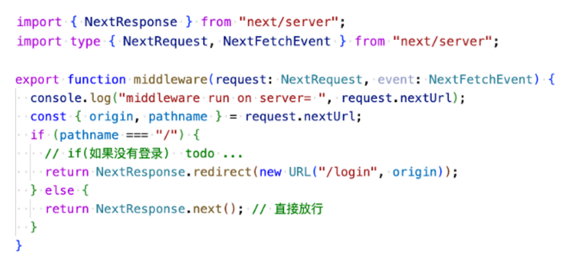
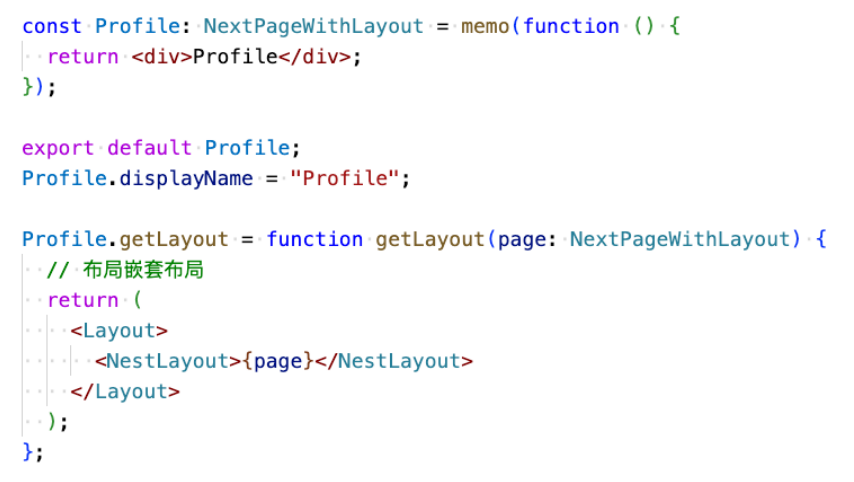
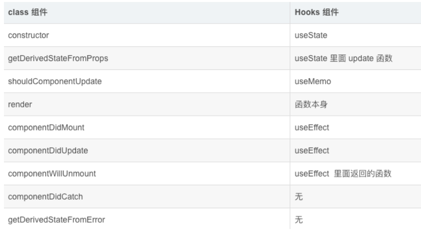
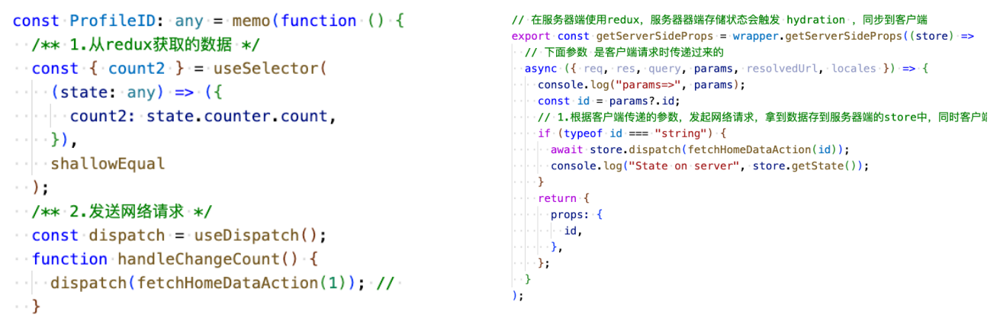
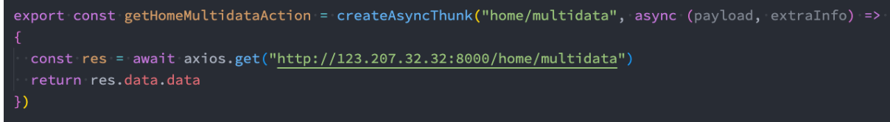
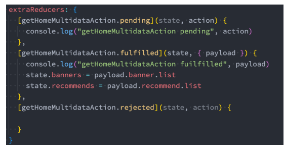
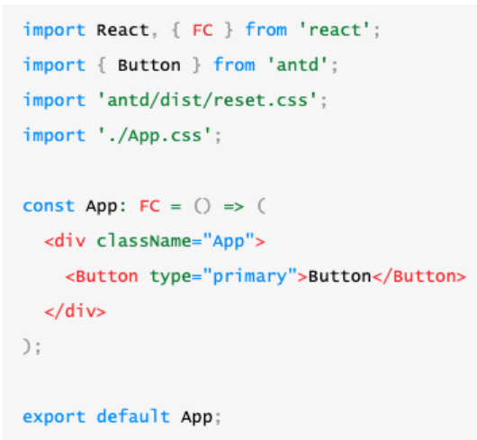
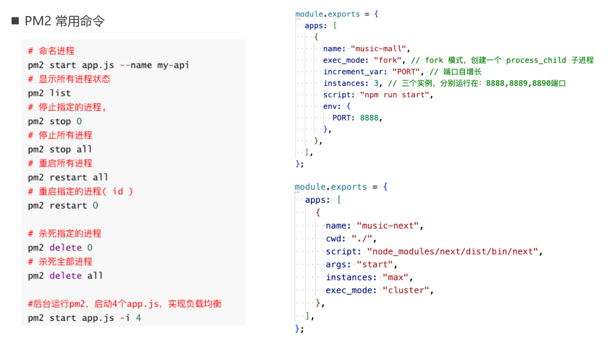

## 1、中间件和匹配器

### 1.1、中间件(middleware)

Next.js的中间件允许我们去拦截客户端发起的请求,例如: API请求、 router切换、资源加载、站点图片等。

拦截客服端发起的请求等等之后,便可对这些进行:重写、重定向、修改请求响应标头、或响应等操作。

使用中间件需按照以下步骤操作:

1. 在根目录中创建 middleware.ts文件
2. 从middleware.ts文件中导出一个中间件middleware函数(支持async,并只允许在服务端),会接收两个参数: 
   - req:类型为 NextRequest
   - event:类型为 NextFetchEvent
3. 通过返回NextResponse对象来实现重定向等功能
   - next()-将继续中间件链
   - redirect()-将重定向,如:重定向到某个页面
   - rewrite()-将重写URL,如:配置反向代理
4. 没返回值: 页面将按预期加载和返回next()一样

```ts
import { NextRequest, NextResponse } from "next/server";

// 1.可以拦截，API请求、router切换、资源加载、站点图片等
// 2.这个中间件只在服务器段运行
export function middleware(req: NextRequest) {
  // 1.常用的请求参数
  console.log(req.nextUrl);

  // 3.返回的 重定向
  let token = req.cookies.get("token")?.value;
  if (!token && req.nextUrl.pathname !== "/login") {
    // 重定向到登录页面
    return NextResponse.redirect(new URL("/login", req.nextUrl.origin));
  }

  // 4.返回的 重写 ->  vue.config  devServer-> proxy
  if (req.nextUrl.pathname.startsWith("/juanpi/api")) {
    // http://locahost:3000/juanpi/api/homeInfo?id=100
    // 重写 url 为下面的 url
    // http://codercba.com:9060/juanpi/api/homeInfo?id=100
    return NextResponse.rewrite(
      new URL(req.nextUrl.pathname, "http://codercba.com:9060")
    );
  }

  // 2.返回next()
  return NextResponse.next(); // 返回next 和 没有返回的效果是一样，直接放行
}

// 匹配器 -> 过滤
export const config = {
  // (?!_next)  匹配不包含 _next 路径
  matcher: ["/((?!_next/static|api|favicon.ico).*)"],
};
```

### 1.2、匹配器(Matcher)

 匹配器允许我们过滤中间件以在特定路径上运行,比如:

- matcher: `/about/:path*`, 意思是匹配以/about/* 开头的路径。其中路径开头的:是修饰符, 而* 代表0个或n个
- matcher: `[‘/about/:path*’, ‘/dashboard/:path*’]` , 意思是匹配以/about/* 和 /dashboard/* 开头的路径
- matcher: `[‘/((?!api|_next/static|favicon.ico).*)‘]` ,意思是不匹配以api、 _next、 static、 favicon.ico开头的路径

### 1.3、路由拦截

下面我们通过 中间件 + 匹配器来实现路由的拦截: 

- matcher: ['/((?!api|_next/static|favicon.ico).*)']



## 2、Layout和生命周期

### 2.1、布局组件(Layout)

Layout布局是页面的包装器,可以将多个页面的共性东西写到Layout布局中,使用 props.children 属性来显示页面内容

- 例如:每个页面的页眉和页脚组件,这些具有共性的组件我们是可以写到一个Layout布局中。

Layout布局的使用步骤:

1. 在 components 目录下新建 layout.tsx 布局组件
2. 接着在 _app.tsx 中通过`<Layout>`组件包裹`<Component>`组件

```jsx
import { memo, ReactElement } from "react";
import type { FC } from "react";

export interface IProps {
  children?: ReactElement;
}

// 自定义的布局组件
const Layout: FC<IProps> = function (props) {
  const { children } = props;

  return (
    <div className="layout">
      <div className="header">header</div>
      {/* 页面的内容 */}
      {children}
      <div className="footer">footer</div>
    </div>
  );
};

export default memo(Layout);
Layout.displayName = "Layout";
```

```jsx
import Layout from "../components/layout";

export default function App({ Component, pageProps }) {

  return (
    <Layout>
      <Component {pageProps} />
    </Layout>
  );
}
```

### 2.2、嵌套布局(NestLayout)

 Layout布局可以作为所有页面的容器,也可以给每个页面一个单独的布局也是可以的,并且也可以在布局中嵌套布局。

因此,我们可以利用布局再嵌套一个布局来实现二级路由。



```tsx
import { memo, ReactElement } from "react";
import type { FC } from "react";
import Layout from "../../components/layout";
import NestLayout from "../../components/nest-layout";

export interface IStaticProps {
  getLayout?: (page: ReactElement) => ReactElement;
}

export interface IProps {
  children?: ReactElement;
}

const Profile: FC<IProps> & IStaticProps = function (props) {
  const { children } = props;
  return (
    <div className="profile">
      <div>Profile</div>
    </div>
  );
};

export default Profile;
Profile.displayName = "Profile"; // 方便以后调试用的
Profile.getLayout = (page: ReactElement) => {
  return (
    <Layout>
      <NestLayout>{page}</NestLayout>
    </Layout>
  );
};
```

```tsx
import "../styles/globals.css";
import type { AppProps } from "next/app";
import { ReactElement } from "react";
import type { NextPage } from "next";

type NextPageWidthLayout = NextPage & {
  getLayout?: (page: ReactElement) => ReactElement;
};

type AppPropsWidthLayout = AppProps & {
  Component: NextPageWidthLayout;
};

export default function App({ Component, ...rest }: AppPropsWidthLayout) {

  const getLayout = Component.getLayout
    ? Component.getLayout
    : (page: ReactElement) => page;
  return getLayout(<Component {...rest.pageProps} />);
}
```

### 2.3、嵌套路由

 Next.js和 Nuxt3一样,也支持嵌套路由(但是只在app目录下), 也是根据目录结构和文件的名称自动生成。

二级路由实现有两种方案:

- 方案一: 使用 Layout 布局嵌套来实现
- 方案二: 使用 Next.js 13 版本,新增的 app 目录(目前 beta版本)

### 2.4、App目录和布局

Next.js 13版本,新增的app目录(目前 beta版本,还是处于实验性阶段,需要在配置开始)

- 第一步:创建app目录
- 第二步:创建根HTML布局: layout.tsx
- 第三步:创建首页: page.tsx
- 第四步:创建head.tsx,定制head
- 第五步:创建其它页面和布局
  - page.tsx
  - layout.tsx

```tsx
/** @type {import('next').NextConfig} */
const nextConfig = {
  reactStrictMode: true,
  // 实验性的功能 beta
  experimental: {
    appDir: true,
  },
};

module.exports = nextConfig;
```

### 2.5、组件生命周期

**客户端渲染**



**服务器端渲染**

- constructor
- UNSAFE_componentWillMount
- render -> functon component本身

## 3、网络请求的封装

**axios封装**

安装依赖库

- `npm i axios --save`

封装axios步骤

1. 定义HYRequest类,并导出
2. 在类中定义request、 get、 post方法
3. 在request中使用axios发起网络请求
4. 添加TypeScript类型声明

```ts
import axios from "axios";
import type { AxiosRequestConfig, AxiosInstance, AxiosResponse } from "axios";

const BASE_URL = "http://codercba.com:9060/juanpi/api";
const TIME_OUT = 1000 * 60;

class HYRequest {
  instance: AxiosInstance;
  constructor(config: AxiosRequestConfig) {
    this.instance = axios.create(config);

    // 全局拦截器
    this.instance.interceptors.request.use((config: AxiosRequestConfig) => {
      console.log("请求的拦截");
      // ...
      return config;
    });
    this.instance.interceptors.response.use((res: AxiosResponse) => {
      console.log("响应的拦截");
      // ...
      return res;
    });
  }

  // 公共的请求的方法
  request<T = any>(config: AxiosRequestConfig): Promise<T> {
    return new Promise((resolve, reject) => {
      // 开始发起网络请求
      this.instance
        .request<T>(config)
        .then((res) => {
          resolve(res.data);
        })
        .catch((error) => {
          reject(error);
        });
    });
  }

  get<T = any>(url: string, params?: any): Promise<T> {
    return this.request<T>({ url, params, method: "GET" });
  }

  post<T = any>(url: string, data?: any): Promise<T> {
    return this.request<T>({ url, data, method: "POST" });
  }
}

export default new HYRequest({
  baseURL: BASE_URL,
  timeout: TIME_OUT,
});
```

## 4、编写后端接口

**API Routes**

Next.js提供了编写后端接口的功能(即 API Routes),编写接口可以在 pages/api 目录下编写

在 pages/api 目录下的任何API Routes文件都会自动映射到以 /api/* 前缀开头接口地址

比如:编写一个/api/user 接口

1. 在 pages/api 目录下新建 user.ts
2. 接在在该文件中使用 handler函数来定义接口
3. 然后就可以用 fetch 函数或axios轻松调用:  /api/user 接口了

```ts
import type { NextApiRequest, NextApiResponse } from "next";

export default function handler(req: NextApiRequest, res: NextApiResponse) {
  // 1.mock
  // 2.axios
  // 3.数据库
  const useInfo = {
    name: "liujun",
    age: 18,
  };
  res.status(200).send(useInfo);
}
```

```ts
import type { NextApiRequest, NextApiResponse } from "next";

// /api/login -> POST
export default function handler(req: NextApiRequest, res: NextApiResponse) {

  if (req.method === "POST") {
    const useInfo = {
      name: "liujun",
      age: 18,
      token: "aabbcc",
    };
    res.status(200).send(useInfo);
  } else {
    res.status(405).end();
  }
}
```

## 5、页面渲染模式

### 5.1、认识预渲染

认识预渲染

- 默认情况下, Next.js会预渲染每个页面,即预先为每个页面生成 HTML 文件,而不是由客户端JavaScript 来完成。
- 预渲染可以带来更好的性能和 SEO 效果。
- 当浏览器加载一个页面时,页面依赖JS代码将会执行,执行JS代码后会激活页面,使页面具有交互性。 (此过程称Hydration)

Next.js具有两种形式的预渲染: 

- 静态生成(推荐) :  HTML 在构建时生成,并在每次页面请求(request)时重用。
- 服务器端渲染: 在每次页面请求(request)时重新生成 HTML页面。

提示: 出于性能考虑,相对服务器端渲染,更推荐使用静态生成。

### 5.2、SSG-静态生成

静态生成(也称SSG或静态站点生成)

- 如果一个页面使用了 静态生成,在构建时将生成此页面对应的 HTML 文件。这意味着在生产环境中,运行 next build 时将生成该页面对应的 HTML 文件。然后,此 HTML 文件将在每个页面请求时被重用,还可以被CDN 缓存。
- 在 Next.js 中,你可以静态生成带有或不带有数据的页面。接下来我们分别看看这两种情况。

**生成不带数据的静态页面**

- 默认情况下, Next.js使用 “静态生成” 来预渲染页面但不涉及获取数据。如下例所示:

  ```tsx
  import { memo, ReactElement } from "react";
  import type { FC } from "react";
  
  export interface IProps {
    children?: ReactElement;
  }
  
  // 这个是一个:不带有数据的 静态生成 的页面
  const About: FC<IProps> = memo(function (props) {
    const { children } = props;
    return (
      <div className="about">
        <div>About</div>
        <div>不带有数据的 静态生成 的页面</div>
      </div>
    );
  });
  
  export default About;
  About.displayName = "About";
  ```

- 请注意:

  - 此页面在预渲染时不需要获取任何外部数据。
  - 在这种情况下, Next.js只需在构建时为每个页面生成一个 HTML 文件即可。

**需要获取数据的静态页面生成**

- 当某些页面需要获取外部数据以进行预渲染,通常有两种情况:

  - 情况一: 页面内容取决于外部数据:使用 Next.js提供的 getStaticProps函数。
  - 情况二:页面paths (路径) 取决于外部数据:使用Next.js提供的 getStaticPaths函数(通常还要同时用getStaticProps)。

- 情况一: 页面内容取决于外部数据

  - 比如, 发起网络请求拿到页面书籍列表的数据,并展示。
  - 具体的使用步骤是:
    1. 先在getStaticProps函数中借助axios获取到数据
    2. 拿到异步数据之后return给页面组件
    3. 页面就可通过props拿到数据来渲染页面
    4. 在build时,经过以上步骤,一个静态页面就打包生成

  ```tsx
  import { memo, ReactElement } from "react";
  import type { FC } from "react";
  import { fetchBooks } from "../../service/home";
  
  export interface IProps {
    children?: ReactElement;
    books?: any[];
  }
  
  const BooksSSG: FC<IProps> = memo(function (props) {
    const { children, books } = props;
    return (
      <div className="home">
        <div>BooksSSG</div>
        <ul>
          {books?.map((item) => {
            return <li key={item.id}>{item.name}</li>;
          })}
        </ul>
      </div>
    );
  });
  
  export default BooksSSG;
  BooksSSG.displayName = "BooksSSG"; // 方便以后调试用的
  
  export async function getStaticProps(context: any) {
    let count = Math.floor(Math.random() * 10 + 1);
    const res = await fetchBooks(count);
    return {
      props: {
        books: res.data.books,
      },
    };
  }
  ```

- 情况二:页面paths (路径) 取决于外部数据

  - 例如,新建一个动态路由页面,然后发起网络请求拿到书本列表,然后每本书的信息都使用单独详情页面显示。
  - 简单的理解就是,在build阶段时,动态拿到n本书,然后根据n书动态生成n个静态详情页面。

  ```tsx
  import { memo, ReactElement } from "react";
  import type { FC } from "react";
  import type { GetStaticPaths, GetStaticProps } from "next";
  import { fetchBookDetail, fetchBooks } from "../../service/home";
  
  export interface IProps {
    children?: ReactElement;
    book?: any;
  }
  
  const BooksDetailSSG: FC<IProps> = memo(function (props) {
    const { children, book } = props;
    return (
      <div className="books-detail-ssg">
        <div>BooksDetailSSG</div>
        <div>{book.name}</div>
      </div>
    );
  });
  
  export default BooksDetailSSG;
  BooksDetailSSG.displayName = "BooksDetailSSG"; // 方便以后调试用的
  
  export const getStaticPaths: GetStaticPaths = async (context) => {
    const res = await fetchBooks(5);
    // console.log(res.data.books); // 5
    const ids = res.data.books.map((item: any) => {
      return {
        params: {
          id: item.id + "", // "0" "1" "2" "3" "4"
        },
      };
    });
    return {
      paths: ids || [], //  "0" "1" "2" "3" "4"
      fallback: false, // 如果动态路由的路径没有匹配上的,那么返回404页面
    };
  };
  
  export const getStaticProps: GetStaticProps = async (context) => {
    console.log("getStaticProps params=>", context.params);
    //  "0" "1" "2" "3" "4"
    const res = await fetchBookDetail(context.params?.id as string);
    return {
      props: {
        book: res.data.book,
      },
    };
  };
  ```

### 5.3、静态生成应用场景

建议尽可能使用静态生成(无论有与没有数据),因为静态生成的页面可以构建一次,并可由CDN 提供服。

我们可以为多种类型的页面使用静态生成,包括: 

- 营销页面、官网网站
- 博客文章、投资组合
- 电子商务产品列表、 帮助和文档

如果在用户请求之前就可以预渲染页面,那么应该选择静态生成。反之,静态生成就不合适了。

例如, 页面要显示经常更新的数据,并且页面内容会在每次请求时发生变化,这时可以这样选择:

- 静态生成与客户端数据获取结合使用:
  - 我们可以跳过预呈现页面的某些部分,然后使用客户端JS来填充它们,但是客户端渲染是不利于SEO优化的,例如:
    - 在useEffect中获取数据,在客户端动态渲染页面。
- 服务器端呈现(也称动态呈现):
  - Next.js会根据每个请求预呈现一个页面。 缺点是稍微慢一点,因为页面无法被CDN 缓存,但预渲染页面将始终是最新的。

### 5.4、服务器端渲染(SSR)

服务器端渲染(也称SSR或动态渲染)

- 如果页面使用的是服务器端渲染,则会在每次页面请求时重新生成页面的 HTML 。
- 要对页面使用服务器端渲染, 你需要 export一个名为 getServerSideProps 的async函数。
- 服务器将在每次页面请求时调用此函数。

例如,假设你的某个页面需要预渲染频繁更新的数据(从外部API 获取)。你就可以编写 getServerSideProps获取该数据并将其传递给 Page ,如下所示:

```tsx
import { memo, ReactElement } from "react";
import type { FC } from "react";
import type { GetServerSideProps } from "next";
import { fetchBooks } from "../../service/home";

export interface IProps {
  children?: ReactElement;
  books?: any[];
}

const BooksSSR: FC<IProps> = memo(function (props) {
  const { children, books } = props;
  return (
    <div className="home">
      <div>BooksSSR</div>
      <ul>
        {books?.map((item) => {
          return <li key={item.id}>{item.name}</li>;
        })}
      </ul>
    </div>
  );
});

export default BooksSSR;
BooksSSR.displayName = "BooksSSR"; // 方便以后调试用的

// 这个函数在每次用户访问页面的时候会回调
export const getServerSideProps: GetServerSideProps = async (context) => {
  console.log("getServerSideProps");
  console.log(context.query);
  const res = await fetchBooks(parseInt(context.query.count as string));
  // console.log(res);
  return {
    props: {
      books: res.data.books,
    },
  };
};
```

### 5.5、服务器端渲染(注意事项)

我们知道getStaticProps和getStaticPaths函数都是在build阶段运行,那么getServerSideProps函数的运行时机是怎么样的呢?

getServerSideProps运行时机:

- 首先, getServerSideProps仅在服务器端运行,从不在浏览器上运行。
- 如果页面使用getServerSideProps,则:
  - 当直接通过URL请求此页面时, getServerSideProps在请求时运行,并且此页面将使用返回的props 进行预渲染
  - 当通过Link或router切换页面来请求此页面时, Next.js向服务器发送API 请求,服务器端会运行getServerSideProps

什么时候该使用getServerSideProps?

- 当页面显示的数据必须在请求时获取的,才应使用getServerSideProps。
  - 如: 页面需要显示经常更新的数据,并且页面内容会在每次请求时发生变化。
- 如过页面使用了getServerSideProps函数,那么该页面将在客户端请求时,会在服务器端渲染,页面默认不会缓存。
- 如果不需要在客户端每次请求时获取页面数据,那么应该考虑在客户端
  动态渲染或getStaticProps.

### 5.6、增量静态再成(ISR)

Next.js 除了支持静态生成和服务器端渲染, Next.js还允许在构建网站后创建或更新静态页面。

这种模式称为:  增量静态再生(Incremental Static Regeneration),简称(ISR)。

比如我们继续实现前面的案例:

- 发起网络请求拿到页面书籍列表的数据,并展示。这次我们使用ISR渲染模式, 让服务器端每隔5s重新生成静态书籍列表页面

```tsx
import { memo, ReactElement } from "react";
import type { FC } from "react";
import { fetchBooks } from "../../service/home";

export interface IProps {
  children?: ReactElement;
  books?: any[];
}

const BooksSSG: FC<IProps> = memo(function (props) {
  const { children, books } = props;
  return (
    <div className="home">
      <div>BooksSSG</div>
      <ul>
        {books?.map((item) => {
          return <li key={item.id}>{item.name}</li>;
        })}
      </ul>
    </div>
  );
});

export default BooksSSG;
BooksSSG.displayName = "BooksSSG"; // 方便以后调试用的

export async function getStaticProps(context: any) {
  let count = Math.floor(Math.random() * 10 + 1);
  const res = await fetchBooks(count);
  return {
    props: {
      books: res.data.books,
    },
    revalidate: 5, // 每间隔5s动态生成新的静态页面
  };
}
```

### 5.7、客户端渲染(CSR)

Next.js 除了支持在服务器端获取数据,同时也是支持在客户端获取数据,并在客户端进行渲染。

在客户端获取数据,需要在页面组件或普通组件的 useEffect 函数中获取,比如:

```tsx
import { memo, ReactElement, useEffect, useState } from "react";
import type { FC } from "react";
import { fetchBooks } from "../../service/home";

export interface IProps {
  children?: ReactElement;
}

const BooksCSR: FC<IProps> = memo(function (props) {
  const { children } = props;
  const [books, setBooks] = useState([]);

  useEffect(() => {
    // 在客户端获取数据 ( CSR )
    let count = Math.floor(Math.random() * 10 + 1);
    fetchBooks(count).then((res) => {
      console.log(res.data.books);
      setBooks(res.data.books);
    });
  }, []);

  return (
    <div className="home">
      <div>BooksCSR</div>
      <ul>
        {books?.map((item: any) => {
          return <li key={item.id}>{item.name}</li>;
        })}
      </ul>
    </div>
  );
});

export default BooksCSR;
BooksCSR.displayName = "BooksCSR";
```

## 6、数据获取和Redux

### 6.1、Next.js集成Redux

安装依赖库

- `npm i next-redux-wrapper --save`
  - 可以避免在访问服务器端渲染页面时store的重置
  - 该库可以将服务器端redux存的数据, 同步一份到客户端上
  - 该库提供了HYDRATE调度操作
    - 当用户访问动态路由或后端渲染的页面时,会执行Hydration来保持两端数据状态一致
    - 比如:每次当用户打开使用了getStaticProps或getServerSideProps函数生成的页面时, HYDRATE将执行调度操作。
- `npm i @reduxjs/toolkit react-redux --save`

### 6.2、创建counter模块的reducer

我们先创建counter模块的reducer: 通过createSlice创建一个slice。

createSlice主要包含如下几个参数:

- name:用来标记slice的名词
  - redux-devtool中会显示对应的名词;
- initialState:第一次初始化时的值;
- reducers:相当于之前的reducer函数
  - 对象类型,并且可以添加很多的函数;
  - 函数类似于 redux原来reducer中的一个case语句; 
- extraReducer:添加更多额外reducer处理otheraction 
- createSlice返回值是一个对象
  - 对象包含所有的actions和 reducer;

```ts
import { getSearchSuggest } from "@/service/home";
import { createSlice, createAsyncThunk } from "@reduxjs/toolkit";
import { HYDRATE } from "next-redux-wrapper";
import type { ISearchSuggest } from "@/service/home";

// home 模块的state的类型
export interface IHomeInitialState {
  counter: number;
  navbar: ISearchSuggest;
}

const homeSlice = createSlice({
  name: "home",
  initialState: {
    counter: 10,
    navbar: {},
  } as IHomeInitialState,
  reducers: {
    increment(state, { type, payload }) {
      console.log("increment=>", type, payload); // increment=> home/increment 2
      state.counter += payload;
    },
  },
  extraReducers: (builder) => {
    // Hydrate的操作, 保证服务端端和客户端数据的一致性
    builder
      .addCase(HYDRATE, (state, action: any) => {
        // state -> initialState
        // action.payload -> rootState
        return {
          ...state,
          ...action.payload.home,
        };
      })
      .addCase(fetchSearchSuggest.fulfilled, (state, { payload }) => {
        state.navbar = payload;
      });
  },
});

// 异步的action
export const fetchSearchSuggest = createAsyncThunk(
  "fetchSearchSuggest",
  async () => {
    // 发起网络请求,拿到搜索建议的数据
    const res = await getSearchSuggest();
    return res.data;
  }
);

// 同步的action
export const { increment } = homeSlice.actions;
export default homeSlice.reducer;
```

### 6.3、store的创建

configureStore用于创建store对象,常见参数如下:

- reducer,将slice中的reducer可以组成一个对象传入此处;
- middleware:可以使用参数,传入其他的中间件(自行了解); 
- devTools:是否配置devTools工具,默认为true;

```ts
import { configureStore } from "@reduxjs/toolkit";
import { createWrapper } from "next-redux-wrapper";
import homeReducer from "./modules/home";

const store = configureStore({
  reducer: {
    home: homeReducer,
  },
});

const wrapper = createWrapper(() => store);
export default wrapper;

// 这个是dispatch函数的类型
export type IAppDispatch = typeof store.dispatch;
// 这个是rootState的类型
export type IAppRootState = ReturnType<typeof store.getState>;
```

### 6.4、store接入应用

在app.js中将store接入应用:

- Provider,内容提供者,给所有的子或孙子组件提供store对象; 
- store: 使用useWrappedStore函数导出的store对象;

```tsx
// 全局样式
import "normalize.css";
import "antd/dist/reset.css";
import "@/styles/globals.scss";

import { Provider } from "react-redux";
import wrapper from "@/store/index";
import Layout from "@/components/layout";
import type { AppProps } from "next/app";

export default function App({ Component, ...rest }: AppProps) {
  // Redux 接入的 App
  const { store, props } = wrapper.useWrappedStore(rest);

  return (
    <Provider store={store}>
      <Layout>
        <Component {...props.pageProps} />
      </Layout>
    </Provider>
  );
}
```

### 6.5、使用store

在函数式组件中可以使用 react-redux 提供的 Hooks API 连接、操作store。

- useSelector 允许你使用 selector 函数从store 中获取数据(rootstate)。
- useDispatch 返回 redux store 的 dispatch 引用。你可以使用它来dispatch actions。
- useStore 返回一个store 引用,和 Provider组件引用完全一致。



```tsx
const Home: FC<IProps> = (props) => {
  // 1.从redux读取状态
  const { counter } = useSelector((rootState: IAppRootState) => {
    return {
      counter: rootState.home.counter,
    };
  });
  // 2.使用dispatch来触发action
  const dispatch: IAppDispatch = useDispatch();
  function addCounter() {
    // 触发 increment的action
    dispatch(increment(2));
  }

  return (
    <>
      <Head>
        <title>云音乐商城</title>
      </Head>
    </>
  );
};

export default Home;
Home.displayName = "Home";
```

### 6.6、Redux Toolkit异步Action操作

在之前的开发中,我们通过redux-thunk中间件让dispatch中可以进行异步操作。

Redux Toolkit默认已经给我们继承了Thunk相关的功能: createAsyncThunk



当createAsyncThunk创建出来的action被dispatch时,会存在三种状态: 

- pending: action被发出,但是还没有最终的结果;
- fulfilled:获取到最终的结果(有返回值的结果);
- rejected:执行过程中有错误或者抛出了异常;

我们可以在createSlice的entraReducer中监听这些结果: 



## 7、项目实战和部署

### 7.1、项目需安装的依赖

样式

- `npm i normalize.css --save `
- `npm i sass --save`
- `npm i classnames --save`

ReduxAnd Toolkit

- `npm i next-redux-wrapper --save`
- `npm i @reduxjs/toolkit  react-redux --save`

Axios( 最新的版本发现有bug ) 

- `npm i axios@1.1.3 --save`

 AntDesign

- `npm i antd –save`
- `npm i -D @types/antd`

### 6.2、Next.js集成Redux


### 6.3、安装Ant Design5

Ant Design 官网:https://ant.design/docs/react/use-in-typescript-cn

Next.js应用安装Ant Design5 

- 第一步:
  - `npm i antd`
  - `npm i -D @types/antd `
- 第二步:
  - 统一样式风格
- 第三步:
  - 就可以开始使用了

注意事项:

- antd 默认支持基于 ES modules 的tree shaking
- 直接引入`import { Button } from 'antd'` 就会有按需加载的效果



### 6.4、项目打包和部署

项目打包

- 执行npm run build (整个项目是部署产物) 
- 执行npm run start 本地预览效果

使用Node部署

- 运行: npm run start
- 指定端口: PORT=9090 npm run start

使用PM2部署(推荐)

- 项目根目录运行: pm2 start npm --name ”music-mall" -- run start 
  - pm2 start npm :在当前目录执行npm
  - --name :指定应用程序的名称
  - -- :后面所有参数会传递给 npm程序
- OR: pm2 start “PORT=9090 npm run start” –-name music-mall


### 6.5、PM2 常用命令




