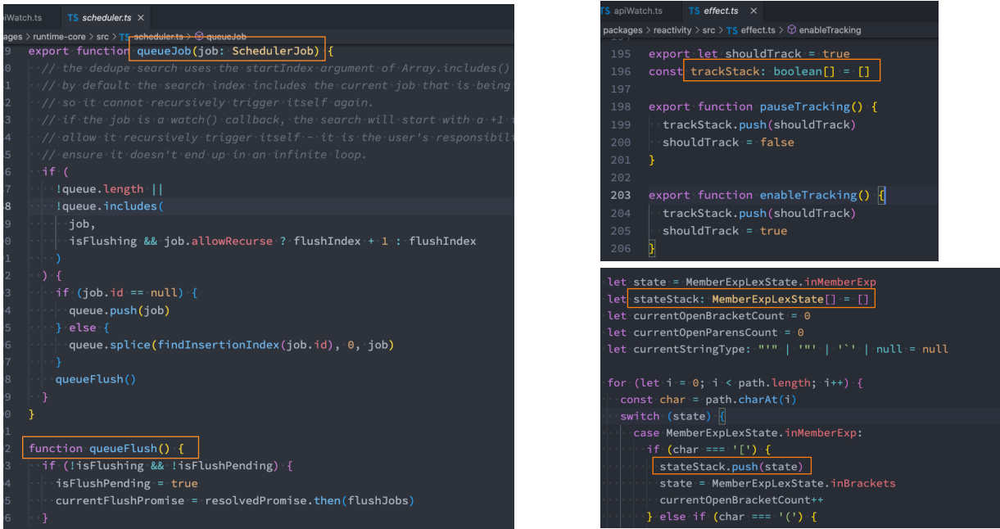
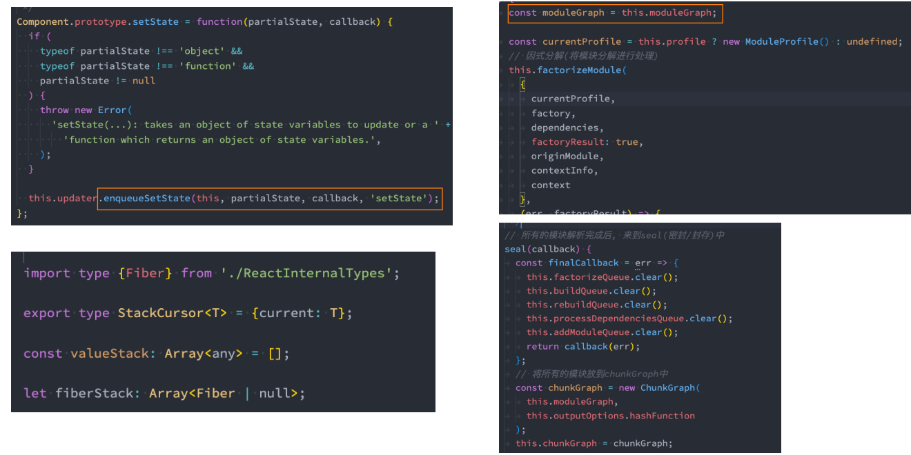
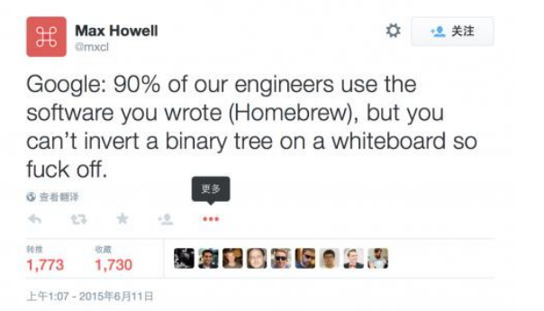
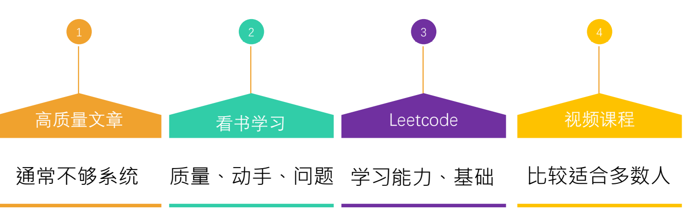
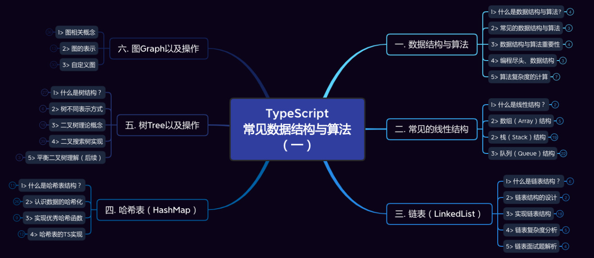
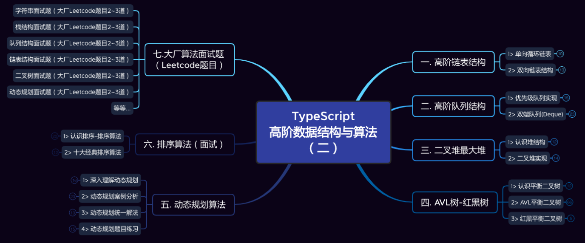
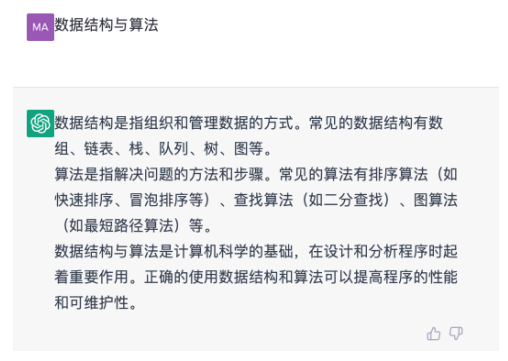
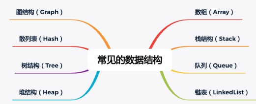
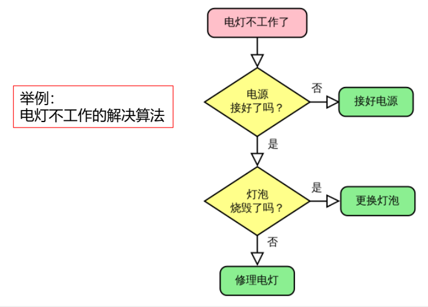

## 1、编程尽头、数据结构

### 1.1、为什么需要学习数据结构与算法?

### 1.2、编程的真相–数据的处理

在前面的课程中我不断的强调一个编程的真相：

编程的最终目的只有一个：对数据进行操作和处理。

- 评判编程能力、水平的高低，要看你是否可以更好的操作和处理数据。
- 在之前的很多课程中，我经常和同学们强调一个事实：所以的编程(无论是前端、后端、算法、人工智能、区块链，也不论是什么语言JavaScript、 Java、 C++等等)最终的目的都是为了处理数据。

当你拿到这些数据时，以什么样的方式存储和处理会更加方便、高效，也是评判一个开发人员能力的重要指标 (甚至是唯一的指标) 。

- 虽然目前很多的系统、框架已经给我们提供了足够多好用的API，对于大多数时候我们只需要调用这些API即可。
- 但是如何更好的组织数据和代码，以及当数据变得复杂时,，以什么方式处理这些数据依然非常重要。
- 只有可以更好的处理数据，你才是一个真正的开发工程师，而不只是一个API调用程序员。

以前端、后端为例:

- 前端从后端获取数据,对数据进行处理、展示;
- 和用户进行交互产生新的数据,传递给后端,后端进行处理、保存到数据库,以便后续读取、操作、展示等等;

### 1.3、数据结构与算法的本质

数据结构与算法的本质就是一门专门研究数据如何组织、存储和操作的科目。

甚至Pascal之父——尼古拉斯赵四说过：

- Nicklaus Wirth凭借一个公式获得图灵奖:
- `算法+数据结构=程序(Algorithm+Data Structures=Programs)`。

所以数据结构与算法事实上是程序的核心,是我们编写的所有程序的灵魂。

勿在浮沙筑高台

- 只有掌握了扎实的数据结构与算法,我们才能更好的理解编程,编写扎实、高效的程序。
- 包括对于程序的理解不再停留于表面,甚至在学习其他的系统或者编程语言时,也可以做到高屋建瓴、势如破竹。

## 2、数据结构与算法的应用

### 2.1、学习数据结构与算法到底有什么实际应用?

只要是已经接触或者即将接触编程的人,都会或多或少的听说过数据结构与算法,也有很多人可以直接说出几种耳熟能详的数据结构。

- 很多计算机专业的同学,在大学也是学习过 《数据结构》 这门课程的。
- 但是对于很多同学来说,平时学习或者工作来说, 好像很少直接用到或者直接接触到数据结构与算法。
- 事实上数据结构与算法是无处不在的。

系统、语言、框架源码随处可见数据结构与算法:

- 无论是操作系统(Windows、 MacOS) 本身,还是我们所使用的编程语言(JavaScript、 Java、 C++、 Python等等),还是我们在平时应用程序中用到的框架(Vue、 React、 Spring、 Flask等等) , 它们的底层实现到处都是数据结构与算法,所以你要想学习一些底层的知识或者某一个框架的源码(比如Vue、 React的源码) 是必须要掌握数据结构与算法的。
- 以前端为例:框架中大量使用到了栈结构、队列结构等来解决问题(比如之前看框架源码时经常看到这些数据结构, Vue源码、React源码、 Webpack源码中可以看到队列、栈结构、树结构等等, Webpack中还可以看到很多Graph图结构);
- 实现语言或者引擎本身也需要大量的数据结构：哈希表结构、队列结构(微任务队列、宏任务队列)，前端无处不在的数据结构：DOM Tree (树结构)、 AST (抽象语法树)。

### 2.2、Vue源码中的数据结构

### 2.3、React、 Webpack源码中的数据结构

### 2.4、Homebrew作者被Google拒绝

互联网大厂、高级岗位面试都会要求必须要掌握一定的数据结构与算法:

Mac上非常知名的工具 homebrew 的作者 Max Howell 曾经去Google面试, Google要求它写一个 《反转二叉树》 的算法(课堂会讲到)，但是因为没有写出所以被拒绝了。

- 当然这件事本身可能会让我们唏嘘:一些人才因为对于数据结构与算法的掌握不够被埋没。
- 但是从侧面也能反应对于很多互联网大厂(无论是国内外的大厂)对于数据结构与算法的重视程度。

### 2.5、互联网大厂、高级岗位面试

因为对于很多企业来说,想要短时间考察一个人的能力以及未来的潜力,数据结构与算法是非常重要指标,也会成为它们的硬性条件。

- 对于可以将数据结构与算法掌握很好的开发人员来说,通常对于业务的把握肯定是没有问题的。
- 并且对于系统的设计也会更加合理,可以写出更加高效的代码。

对于想要进入大厂的同学,经常会刷leetcode:

- 但是对于大多数同学来说, leetcode上的题目晦涩难懂, 代码无从下手, 不会解题。
- 只有系统的掌握了数据结构与算法,才能将这些题目融会贯通,面试遇到相关的题目就可以对答如流。

逻辑思维、代码能力提升离不开对于数据的处理:

- 我们已经强调了所有的编程最终的目的都是为了处理数据。
- 而数据结构与算法就是一门专为讲解数据应该如何存储、组织、操作的课程。
- 所以学习数据结构与算法可以更好的锻炼我们的逻辑思维能力和代码编程能力,帮助我们平时在处理一些复杂数据时,可以更好的编写代码,写出更高效的程序。

并且掌握数据结构与算法后,如果想要转向其他的领域(比如从前端转到后端、算法工程师等)也会更加容易:

- 因为所有的编程思想都是想通的,只是换了一种语言来处理数据而已。
- 对于未来更多的领域,比如人工智能、区块链,数据结构与算法也是它们的基石,是必须要掌握的一门课程。

## 3、如何学习数据结构算法?

###  3.1、如何学习数据结构与算法?

数据结构与算法通常被认为 晦涩难懂、复杂抽象,对于大多数人来说学习起来是比较困难的。

那么通常学习数据结构与算法有哪些方式呢?

### 3.2、TypeScript常见数据结构与算法

## 4、到底什么是数据结构?

### 4.1、到底什么是数据结构?

那么,到底什么是数据结构与算法呢? 

- 官方定义: 并没有.

我们分开来理解它们是什么? 

- 什么是数据结构?
- 什么是算法?

### 4.2、什么是数据结构(Data Structure)?

非官方较为标准的定义:

- “数据结构是数据对象,以及存在于该对象的实例和 组成实例的数据元素之间的各种联系。这些联系可以通过定义相关的函数来给出。” --- 《数据结构、 算法与应用》
- “数据结构是ADT (抽象数据类型Abstract Data Type)的物理实现。” --- 《数据结构与算法分析》
- “数据结构(data structure)是计算机中存储、组织数据的方式。通常情况下,精心选择的数据结构可以带来最优效率的算法。” ---中文维基百科

我们还是从 自己的角度来认识数据结构吧:

- 数据结构就是在计算机中,存储和组织数据的方式
- 我们知道,计算机中数据量非常庞大,如何以高效的方式组织和存储呢?
- 这就好比一个庞大的图书馆中存放了大量的书籍,我们不仅仅要把书放进入,还应该在合适的时候能够取出来。

我们从摆放图书说起:

### 4.3、如何摆放图书?

如果是自己的书相对较少,我们可以这样摆放

如果你有一家书店,书的数量相对较多,我们可以这样摆放

如果我们开了一个图书馆,书的数量相当庞大,我们可以这样摆放

### 4.4、图书摆放规则

图书摆放要使得两个相关操作方便实现: 

- 操作1 :新书怎么插入?
- 操作2:怎么找到某本指定的书?

方法1:随便放

- 插入操作:哪里有空放哪里,一步到位! 
- 查找操作:找某本书,累死。。。

方法2:按照书名的拼音字母顺序排放

- 插入操作:新进一本 《阿Q正传》《理想国》 ,按照字母顺序找到位置,插入
- 查找操作:二分查找法

方法3:把书架划分成几块区域,按照类别存放,类别中按照字母顺序

- 插入操作:先定类别,二分查找确定位置,移出空位
- 查找操作:先定类别,再二分查找

结论:

- 解决问题方法的效率,根数据的组织方式有关
- 计算机中存储的数据量相对于图书馆的书籍来说数据量更大, 数据种类更多
- 以什么样的方式,来存储和组织我们的数据才能在使用数据时更加方便和有效呢?
- 这就是数据结构需要考虑的问题。

### 4.5、常见的数据结构

那么在计算机中对于数据的组织和存储结构也会影响我们的效率。

常见的数据结构较多

- 每一种都有其对应的应用场景, 不同的数据结构 的不同操作性能是不同的。
- 有的查询性能很快,有的插入速度很快,有的是插入头和尾速度很快。
- 有的做范围查找很快,有的允许元素重复,有的不允许重复等等。
- 在开发中如何选择,要根据具体的需求来选择。

注意:数据结构和语言无关,常见的编程语言都有直接或者间接的使用上述常见的数据结构

为什么之前学习JavaScript没有接触过数据结构呢? 好像只见过数组。

- 这是因为很多数据结构是需要再进行高阶开发(比如设计框架源码)时才会用到的。
- 设置某些数据结构在JavaScript中本身是没有的,我们需要从零去实现的。

你可能会想:老师,我觉得不多呀,赶紧给我们讲讲怎么用的就行了。

- 我们不是要讲这些数据结构如何用,用是 API 程序员的思考方式,我们要讲的是这些数据结构如何实现,再如何使用。
- 了解真相,你才能获得真正的自由。

## 5、什么是算法?

算法(Algorithm)的认识

- 在之前的学习中,我们可能学习过几种排序算法,并且知道不同的算法,执行效率是不一样的。
- 也就是说解决问题的过程中,不仅仅数据的存储方式会影响效率, 算法的优劣也会影响着效率。
- 那么到底什么是算法呢?

算法的定义:

- 一个有限指令集,每条指令的描述不依赖于语言
- 接受一些输入(有些情况下不需要输入)
- 产生输出
- 一定在有限步骤之后终止

算法通俗理解:

- Algorithm这个单词本意就是解决问题的办法/步骤逻辑。
- 数据结构的实现,离不开算法。

## 6、生活中数据结构与算法

前面我们提了一下生活中的数据结构和算法: 图书的摆放。

- 为了更加方便的插入和搜索书籍,需要合理的组织数据,并且通过更加高效的算法插入和查询数据。
- 除了这些,生活中还有很多案例。

**快递员的快递**

- 大家平时都有收到过快递。
- 现在很多的快递通常情况不是送到家里的;
- 通常快递会放在某个固定的地方,让大家自己去拿。
- 当你跑到固定的地方拿快递,还有两种情况:一种自己去海量的快递中找,另一种快递员让你报出名字,它帮你找。
  自己寻找相当于线性查找,一个个挨着看吧。
  - 当然我们人类眼睛处理数据的能力非常快,眼观六路耳听八方,可能很快也能找到。
- 但是比较好的方式,应该是快递员帮我们找。
  - 如果这个快递员动动脑筋的话,最好的方式是对快递进行分类,比如按照名字分类。
- 这个时候,只要你报出名字,它会根据姓氏立马锁定到某一个区域的快递中,再根据名字马上帮你找到。
- 这就体现了合理的组织数据,对于我们获取数据效率的重要性至关重要。

**找出线缆出问题的地方:**

- 假如上海和杭州之间有一条高架线,高架线长度是1,000,000米,有一天高架线中有其中一米出现了故障。
- 请你想出一种算法,可以快速定位到处问题的地方。

线性查找:

- 从上海的起点开始一米一米的排查,最终一定能找到出问题的线段。
- 但是如果线段在另一头,我们需要排查1,000,000次。这是最坏的情况。平均需要500,000次。

二分查找:

- 从中间位置开始排查,看一下问题出在上海到中间位置,还是中间到杭州的位置。
- 查找对应的问题后,再从中间位置分开,重新锁定一半的路程。
- 最坏的情况,需要多少次可以排查完呢? 最坏的情况是20次就可以找到出问题的地方。
- 怎么计算出来的呢? log(1000000, 2),以2位底, 1000000的对数 ≈ 20。

结论:

- 你会发现,解决问题的办法有很多。但是好的算法对比于差的算法,效率天壤之别。

后续我们还会讲解大O表示法来评定算法的效率(这里暂时不讲)。

