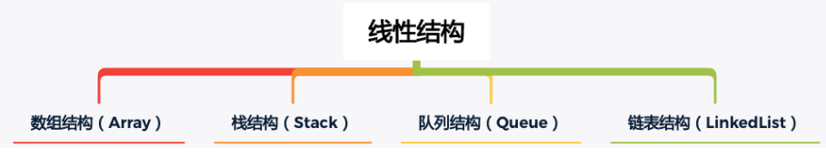
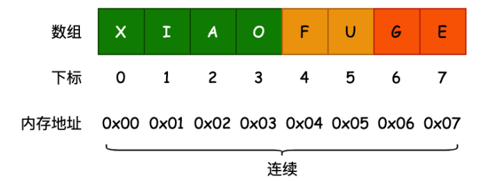

## 1、线性结构(Linear List)

线性结构(英語: Linear List)是由n (n≥0)个数据元素(结点) a[0], a[1], a[2]., a[n-1]组成的有限序列。

其中:

- 数据元素的个数n定义为表的长度 = “list”.length() ( “list”.length() = 0 (表里没有一个元素)时称为空表)。
- 将非空的线性表(n>=1)记作:(a[0], a[1], a[2], ., a[n-1])。
- 数据元素a[i] (0≤i≤n-1)只是个抽象符号,其具体含义在不同情况下可以不同。

上面是维基百科对于线性结构的定义,有一点点抽象,其实我们只需要记住几个常见的线性结构即可。

## 2、数组(Array)结构

数组(Array)结构是一种重要的数据结构:

- 几乎是每种编程语言都会提供的一种原生数据结构(语言自带的) ;
- 并且我们可以借助于数组结构来实现其他的数据结构,比如栈(Stack)、队列(Queue)、堆(Heap); 

通常数组的内存是连续的,所以数组在知道下标值的情况下,访问效率是非常高的

这里我们不再详细讲解TypeScript中数组的各种用法,和JavaScript是一致的。

- https://developer.mozilla.org/zh-CN/docs/Web/JavaScript/Reference/Global_Objects/Array 

后续我们在讨论数组和链表的关系区别时,还会通过大O表示法来分析数组操作元素的时间复杂度问题。

