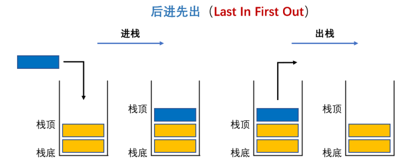
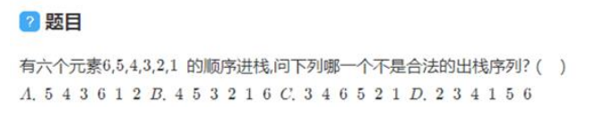
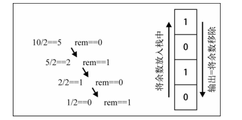
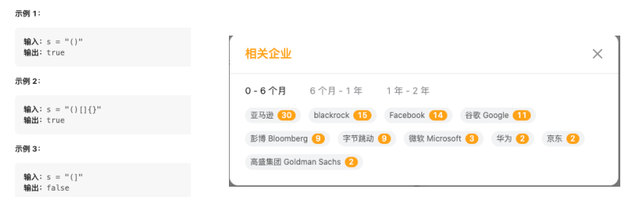

## 1、认识栈结构和特性

栈也是一种非常常见的数据结构, 并且在程序中的应用非常广泛。

数组

- 我们知道数组是一种线性结构, 并且可以在数组的任意位置插入和删除数据。
- 但是有时候, 我们为了实现某些功能, 必须对这种任意性加以限制。
- 而栈和队列 就是比较常见的受限的线性结构, 我们先来学习栈结构。

栈结构示意图



栈(stack),它是一种受限的线性结构, 后进先出(LIFO)

- 其限制是仅允许在表的一端进行插入和删除运算。这一端被称为栈顶,相对地,把另一端称为栈底。
- LIFO(last in first out)表示就是后进入的元素, 第一个弹出栈空间。 类似于自动餐托盘, 最后放上的托盘, 往往先把拿出去使用。
- 向一个栈插入新元素又称作进栈、入栈或压栈,它是把新元素放到栈顶元素的上面,使之成为新的栈顶元素;
- 从一个栈删除元素又称作出栈或退栈,它是把栈顶元素删除掉,使其相邻的元素成为新的栈顶元素。

生活中类似于栈的

- 自助餐的托盘, 最新放上去的, 最先被客人拿走使用。
- 收到很多的邮件(实体的), 从上往下依次处理这些邮件。 (最新到的邮件, 最先处理)
- 注意: 不允许改变邮件的次序, 比如从最小开始, 或者处于最紧急的邮件, 否则就不再是栈结构了。 而是队列或者优先级队列结构。

## 2、栈结构特性-面试题



题目答案: C

- A答案: 65进栈, 5出栈, 4进栈出栈, 3进栈出栈, 6出栈, 21进栈, 1出栈,2出栈
- B答案: 654进栈, 4出栈, 5出栈, 3进栈出栈, 2进栈出栈, 1进栈出栈,6出栈
- D答案: 65432进栈, 2出栈, 3出栈, 4出栈, 1进栈出栈, 5出栈,6出栈

## 3、实现栈结构的封装

实现栈结构有两种比较常见的方式: 

- 基于数组实现
- 基于链表实现

创建一个栈的类,用于封装栈相关的操作

```ts
// 封装一个栈
class ArrayStack {
  // 定义一个数组/链表, 用于存储元素
  private data: any[] = [];
}
```

代码解析:

- 我们创建了一个Stack,用户创建栈的类,可以定义一个泛型类。
- 在构造函数中,定义了一个变量,这个变量可以用于保存当前栈对象中所有的元素。
- 这个变量是一个数组类型。
- 我们之后无论是压栈操作还是出栈操作,都是从数组中添加和删除元素。
- 栈有一些相关的操作方法,通常无论是什么语言,操作都是比较类似的。

## 4、栈结构常见的方法

栈常见有哪些操作呢?

- push(element):  添加一个新元素到栈顶位置。
- pop():移除栈顶的元素,同时返回被移除的元素。
- peek():返回栈顶的元素,不对栈做任何修改(这个方法不会移除栈顶的元素,仅仅返回它)。
- isEmpty():如果栈里没有任何元素就返回true,否则返回false。
- size():返回栈里的元素个数。这个方法和数组的length属性很类似。

```ts
import IStack from "./IStack";

// 封装一个栈: TypeScript => AnyScript
class ArrayStack<T> implements IStack<T> {
  // 定义一个数组/链表, 用于存储元素
  private data: T[] = [];

  // 实现栈中相关的操作方法
  // push方法: 将一个元素压入到栈中
  push(element: T): void {
    this.data.push(element);
  }

  // pop方法: 将栈顶的元素弹出栈(返回出去, 并且从栈顶移除掉)
  pop(): T | undefined {
    return this.data.pop();
  }

  // peek方法: 看一眼栈顶元素, 但是不进行任何的操作
  peek(): T | undefined {
    return this.data[this.data.length - 1];
  }

  // isEmpty: 判断栈是否为空
  isEmpty(): boolean {
    return this.data.length === 0;
  }

  // 返回栈的数据个数
  size(): number {
    return this.data.length;
  }
}

export default ArrayStack;
```

```ts
// 定义栈的结构
interface IStack<T> {
  push(element: T): void
  pop(): T | undefined
  peek(): T | undefined
  isEmpty(): boolean
  size(): number
}

export default IStack
```

## 5、栈面试题–转二进制

我们已经学会了如何使用Stack类,现在就用它解决一些计算机科学中的问题。

为什么需要十进制转二进制?

- 现实生活中,我们主要使用十进制。
- 但在计算科学中, 二进制非常重要,因为计算机里的所有内容都是用二进制数字表示的(0和1) 。
- 没有十进制和二进制相互转化的能力,与计算机交流就很困难。
- 转换二进制是计算机科学和编程领域中经常使用的算法。

如何实现十进制转二进制?

- 要把十进制转化成二进制,我们可以将该十进制数字和2整除 (二进制是满二进一),直到结果是0为止。
- 举个例子,把十进制的数字10转化成二进制的数字,过程大概是这样:



```ts
import ArrayStack from "./02_实现栈结构Stack(重构)";

function decimalToBinary(decimal: number): string {
  // 1.创建一个栈, 用于存放余数
  const stack = new ArrayStack<number>();

  // 2.使用循环:
  while (decimal > 0) {
    const result = decimal % 2;
    stack.push(result);

    decimal = Math.floor(decimal / 2);
  }

  // 3.所有的余数都已经放在stack中, 以此取出即可
  let binary = "";
  while (!stack.isEmpty()) {
    binary += stack.pop();
  }

  return binary;
}
```

## 6、栈面试题–有效括号

国内字节、华为、京东都考过的面试题。

给定一个只包括'(', ')', '{', '}', '[', ']'的字符串s,判断字符串是否有效。

- Leetcode20: https://leetcode.cn/problems/valid-parentheses/description

有效字符串需满足:

1. 左括号必须用相同类型的右括号闭合。
2. 左括号必须以正确的顺序闭合。
3. 每个右括号都有一个对应的相同类型的左括号。



```ts
import ArrayStack from "./02_实现栈结构Stack(重构)";

function isValid(s: string): boolean {
  // 1.创建栈结构
  const stack: string[] = [];

  // 2.遍历s中的所有的括号
  for (let i = 0; i < s.length; i++) {
    const c = s[i];
    switch (c) {
      case "(":
        stack.push(")");
        break;
      case "{":
        stack.push("}");
        break;
      case "[":
        stack.push("]");
        break;
      default:
        if (c !== stack.pop()) return false;
        break;
    }
  }

  return stack.length === 0;
}
```


